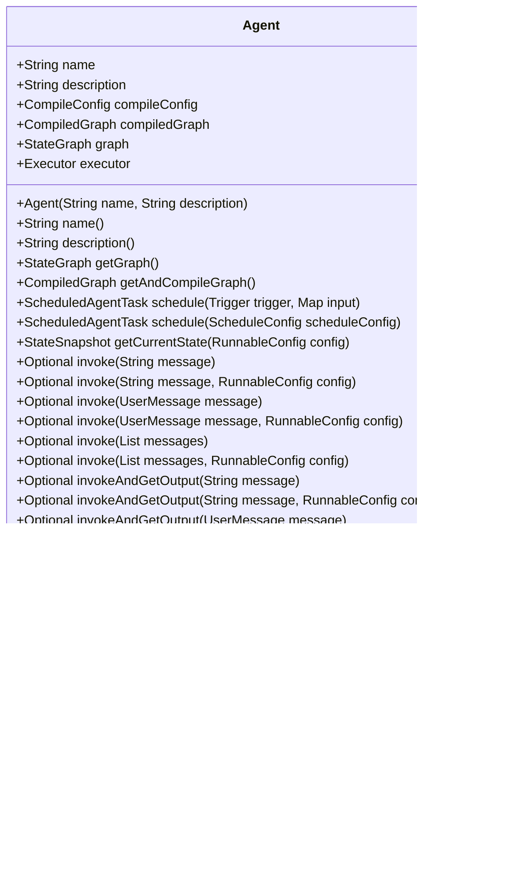

# 代理框架API

<cite>
**本文档中引用的文件**   
- [Agent.java](file://spring-ai-alibaba-agent-framework/src/main/java/com/alibaba/cloud/ai/graph/agent/Agent.java)
- [BaseAgent.java](file://spring-ai-alibaba-agent-framework/src/main/java/com/alibaba/cloud/ai/graph/agent/BaseAgent.java)
- [ReactAgent.java](file://spring-ai-alibaba-agent-framework/src/main/java/com/alibaba/cloud/ai/graph/agent/ReactAgent.java)
- [FlowAgent.java](file://spring-ai-alibaba-agent-framework/src/main/java/com/alibaba/cloud/ai/graph/agent/flow/agent/FlowAgent.java)
- [AgentTool.java](file://spring-ai-alibaba-agent-framework/src/main/java/com/alibaba/cloud/ai/graph/agent/AgentTool.java)
- [AgentHook.java](file://spring-ai-alibaba-agent-framework/src/main/java/com/alibaba/cloud/ai/graph/agent/hook/AgentHook.java)
- [Interceptor.java](file://spring-ai-alibaba-agent-framework/src/main/java/com/alibaba/cloud/ai/graph/agent/interceptor/Interceptor.java)
- [Builder.java](file://spring-ai-alibaba-agent-framework/src/main/java/com/alibaba/cloud/ai/graph/agent/Builder.java)
- [DefaultBuilder.java](file://spring-ai-alibaba-agent-framework/src/main/java/com/alibaba/cloud/ai/graph/agent/DefaultBuilder.java)
- [GraphResponse.java](file://spring-ai-alibaba-graph-core/src/main/java/com/alibaba/cloud/ai/graph/GraphResponse.java)
- [RunnableConfig.java](file://spring-ai-alibaba-graph-core/src/main/java/com/alibaba/cloud/ai/graph/RunnableConfig.java)
</cite>

## 目录
1. [简介](#简介)
2. [核心组件](#核心组件)
3. [代理接口](#代理接口)
4. [实现类](#实现类)
5. [运行方法](#运行方法)
6. [代理工具](#代理工具)
7. [代理钩子和拦截器](#代理钩子和拦截器)
8. [代码示例](#代码示例)

## 简介

代理框架API提供了一套完整的代理系统，用于构建复杂的AI代理应用。该框架基于图结构，支持多种代理类型和执行模式。核心功能包括代理的创建、配置、执行以及生命周期管理。框架提供了丰富的扩展点，包括钩子（Hook）和拦截器（Interceptor），允许开发者在代理执行的不同阶段插入自定义逻辑。

**代理接口**是所有代理的基类，定义了代理的基本行为和属性。**ReactAgent**实现了经典的ReAct模式，通过循环执行模型调用和工具调用来解决问题。**FlowAgent**及其子类提供了更复杂的执行流程，包括顺序、并行和条件分支等模式。

框架还提供了**AgentTool**机制，允许将代理本身作为工具供其他代理调用，实现代理间的协作。通过**AgentHook**和**Interceptor**，开发者可以在代理执行的关键节点插入自定义逻辑，如日志记录、权限检查、结果处理等。

## 核心组件

代理框架的核心组件包括代理接口、实现类、工具系统、钩子和拦截器等。这些组件共同构成了一个灵活且可扩展的代理系统。

**代理接口**（Agent）是所有代理的抽象基类，定义了代理的基本属性和方法。每个代理都有一个唯一的名称和描述，用于标识和说明其功能。代理通过图结构（StateGraph）来定义其执行流程，并通过编译后的图（CompiledGraph）来执行。

**实现类**包括ReactAgent和各种FlowAgent。ReactAgent实现了ReAct模式，通过循环执行模型调用和工具调用来解决问题。FlowAgent提供了更复杂的执行流程，包括顺序执行、并行执行、条件分支等模式。

**工具系统**（AgentTool）允许将代理本身作为工具供其他代理调用。这使得代理可以相互协作，形成更复杂的解决方案。工具的定义和注册通过Builder模式完成，支持多种输入输出类型和模式。

**钩子和拦截器**提供了在代理执行过程中插入自定义逻辑的机制。钩子（Hook）在代理执行的特定阶段（如执行前、执行后）被调用，而拦截器（Interceptor）则在模型调用或工具调用时被触发。

**构建器**（Builder）模式用于创建和配置代理。通过链式调用，开发者可以方便地设置代理的各种属性，如名称、描述、模型、工具、钩子等。

**Section sources**
- [Agent.java](file://spring-ai-alibaba-agent-framework/src/main/java/com/alibaba/cloud/ai/graph/agent/Agent.java#L49-L331)
- [BaseAgent.java](file://spring-ai-alibaba-agent-framework/src/main/java/com/alibaba/cloud/ai/graph/agent/BaseAgent.java#L23-L107)
- [ReactAgent.java](file://spring-ai-alibaba-agent-framework/src/main/java/com/alibaba/cloud/ai/graph/agent/ReactAgent.java#L93-L148)
- [FlowAgent.java](file://spring-ai-alibaba-agent-framework/src/main/java/com/alibaba/cloud/ai/graph/agent/flow/agent/FlowAgent.java#L31-L105)

## 代理接口

`Agent` 是所有代理的抽象基类，定义了代理的基本属性和方法。它是代理框架的核心接口，所有具体的代理实现都继承自这个类。



**Diagram sources**
- [Agent.java](file://spring-ai-alibaba-agent-framework/src/main/java/com/alibaba/cloud/ai/graph/agent/Agent.java#L49-L331)

### 构造函数

`Agent` 类提供了两个受保护的构造函数：

- `protected Agent(String name, String description)`：使用名称和描述初始化代理。
- `protected Agent()`：默认构造函数，允许子类以其他方式初始化属性。

### 关键方法

- `name()` 和 `description()`：获取代理的名称和描述。
- `getGraph()`：获取代理的状态图。如果图尚未初始化，则调用 `initGraph()` 方法创建。
- `getAndCompileGraph()`：获取并编译代理的图。如果图尚未编译，则调用 `compile()` 方法编译。
- `schedule()`：调度代理任务。支持使用 `Trigger` 或 `ScheduleConfig` 配置调度。
- `invoke()` 系列方法：同步调用代理，返回 `OverAllState`。
- `invokeAndGetOutput()` 系列方法：同步调用代理，返回 `NodeOutput`。
- `stream()` 系列方法：流式调用代理，返回 `Flux<NodeOutput>`。
- `doInvoke()`, `doInvokeAndGetOutput()`, `doStream()`：实际执行调用的受保护方法。
- `buildNonStreamConfig()` 和 `buildStreamConfig()`：构建非流式和流式配置。
- `applyExecutorConfig()`：将执行器配置应用到 `RunnableConfig` 构建器。
- `buildMessageInput()`：构建消息输入。
- `initGraph()`：抽象方法，由子类实现以初始化图。

**Section sources**
- [Agent.java](file://spring-ai-alibaba-agent-framework/src/main/java/com/alibaba/cloud/ai/graph/agent/Agent.java#L49-L331)

## 实现类

代理框架提供了多个实现类，包括 `BaseAgent`、`ReactAgent` 和 `FlowAgent`。这些类继承自 `Agent` 类，并提供了具体的实现。

### BaseAgent

`BaseAgent` 是 `Agent` 的直接子类，引入了输入输出模式、类型和键策略等概念。


**Diagram sources**
- [BaseAgent.java](file://spring-ai-alibaba-agent-framework/src/main/java/com/alibaba/cloud/ai/graph/agent/BaseAgent.java#L23-L107)

### ReactAgent

`ReactAgent` 实现了经典的ReAct模式，通过循环执行模型调用和工具调用来解决问题。


**Diagram sources**
- [ReactAgent.java](file://spring-ai-alibaba-agent-framework/src/main/java/com/alibaba/cloud/ai/graph/agent/ReactAgent.java#L93-L800)

### FlowAgent

`FlowAgent` 是一种特殊的代理，用于构建复杂的执行流程。


**Diagram sources**
- [FlowAgent.java](file://spring-ai-alibaba-agent-framework/src/main/java/com/alibaba/cloud/ai/graph/agent/flow/agent/FlowAgent.java#L31-L105)

**Section sources**
- [BaseAgent.java](file://spring-ai-alibaba-agent-framework/src/main/java/com/alibaba/cloud/ai/graph/agent/BaseAgent.java#L23-L107)
- [ReactAgent.java](file://spring-ai-alibaba-agent-framework/src/main/java/com/alibaba/cloud/ai/graph/agent/ReactAgent.java#L93-L800)
- [FlowAgent.java](file://spring-ai-alibaba-agent-framework/src/main/java/com/alibaba/cloud/ai/graph/agent/flow/agent/FlowAgent.java#L31-L105)

## 运行方法

代理框架提供了多种运行方法，包括同步调用、异步调用和流式调用。

### run() 方法参数

`run()` 方法的主要参数是输入消息和运行配置 `RunnableConfig`。

- **输入消息**：可以是字符串、`UserMessage` 或 `List<Message>`。这些消息将被转换为代理的输入。
- **运行配置**（`RunnableConfig`）：包含代理执行的各种配置，如线程ID、标签、元数据等。

### 返回值

`run()` 方法的返回值是 `GraphResponse`，它包含了代理执行的结果。


**Diagram sources**
- [GraphResponse.java](file://spring-ai-alibaba-graph-core/src/main/java/com/alibaba/cloud/ai/graph/GraphResponse.java)

`GraphResponse` 包含以下属性：
- `messages`：代理执行过程中生成的消息列表。
- `metadata`：与执行相关的元数据。
- `done`：指示代理执行是否完成。

**Section sources**
- [Agent.java](file://spring-ai-alibaba-agent-framework/src/main/java/com/alibaba/cloud/ai/graph/agent/Agent.java#L161-L253)
- [GraphResponse.java](file://spring-ai-alibaba-graph-core/src/main/java/com/alibaba/cloud/ai/graph/GraphResponse.java)

## 代理工具

`AgentTool` 类用于创建和管理代理工具。

```mermaid
classDiagram
class AgentTool {
+static ToolCallResultConverter CONVERTER
+static ToolCallback getFunctionToolCallback(ReactAgent agent)
+static ToolCallback create(ReactAgent agent)
+private static String wrapSchemaInInputParameter(String originalSchema)
+static class AgentToolExecutor {
+ReactAgent agent
+AgentToolExecutor(ReactAgent agent)
+AssistantMessage executeAgent(String input, ToolContext toolContext)
+private String extractInputValue(String input)
}
}
```

**Diagram sources**
- [AgentTool.java](file://spring-ai-alibaba-agent-framework/src/main/java/com/alibaba/cloud/ai/graph/agent/AgentTool.java)

### 定义

`AgentTool` 提供了静态方法来创建工具回调：
- `getFunctionToolCallback(ReactAgent agent)`：获取函数工具回调。
- `create(ReactAgent agent)`：创建工具回调。

### 使用方式

`AgentTool` 的使用方式如下：
1. 创建 `ReactAgent` 实例。
2. 使用 `AgentTool.create(agent)` 创建工具回调。
3. 将工具回调添加到其他代理的工具列表中。

`AgentToolExecutor` 是一个内部类，包含 `executeAgent` 方法，该方法被 `MethodToolCallback` 通过反射调用。

**Section sources**
- [AgentTool.java](file://spring-ai-alibaba-agent-framework/src/main/java/com/alibaba/cloud/ai/graph/agent/AgentTool.java)

## 代理钩子和拦截器

代理框架提供了 `AgentHook` 和 `Interceptor` 机制，用于在代理执行过程中插入自定义逻辑。

### 生命周期方法

`AgentHook` 定义了以下生命周期方法：
- `beforeAgent(OverAllState state, RunnableConfig config)`：在代理执行前调用。
- `afterAgent(OverAllState state, RunnableConfig config)`：在代理执行后调用。


**Diagram sources**
- [AgentHook.java](file://spring-ai-alibaba-agent-framework/src/main/java/com/alibaba/cloud/ai/graph/agent/hook/AgentHook.java)

### 注册机制

`Interceptor` 是一个接口，定义了 `getName()` 方法。

```mermaid
classDiagram
interface Interceptor {
+String getName()
}
```

**Diagram sources**
- [Interceptor.java](file://spring-ai-alibaba-agent-framework/src/main/java/com/alibaba/cloud/ai/graph/agent/interceptor/Interceptor.java)

钩子和拦截器通过 `Builder` 的 `hooks()` 和 `interceptors()` 方法注册。


**Diagram sources**
- [Builder.java](file://spring-ai-alibaba-agent-framework/src/main/java/com/alibaba/cloud/ai/graph/agent/Builder.java)

**Section sources**
- [AgentHook.java](file://spring-ai-alibaba-agent-framework/src/main/java/com/alibaba/cloud/ai/graph/agent/hook/AgentHook.java)
- [Interceptor.java](file://spring-ai-alibaba-agent-framework/src/main/java/com/alibaba/cloud/ai/graph/agent/interceptor/Interceptor.java)
- [Builder.java](file://spring-ai-alibaba-agent-framework/src/main/java/com/alibaba/cloud/ai/graph/agent/Builder.java)

## 代码示例

以下代码示例展示了如何创建和配置不同类型的代理。

### 创建ReactAgent


**Diagram sources**
- [DefaultBuilder.java](file://spring-ai-alibaba-agent-framework/src/main/java/com/alibaba/cloud/ai/graph/agent/DefaultBuilder.java#L50-L243)

### 使用AgentTool


**Diagram sources**
- [AgentTool.java](file://spring-ai-alibaba-agent-framework/src/main/java/com/alibaba/cloud/ai/graph/agent/AgentTool.java)

### 注册钩子和拦截器


**Diagram sources**
- [Builder.java](file://spring-ai-alibaba-agent-framework/src/main/java/com/alibaba/cloud/ai/graph/agent/Builder.java)

**Section sources**
- [DefaultBuilder.java](file://spring-ai-alibaba-agent-framework/src/main/java/com/alibaba/cloud/ai/graph/agent/DefaultBuilder.java#L50-L243)
- [AgentTool.java](file://spring-ai-alibaba-agent-framework/src/main/java/com/alibaba/cloud/ai/graph/agent/AgentTool.java)
- [Builder.java](file://spring-ai-alibaba-agent-framework/src/main/java/com/alibaba/cloud/ai/graph/agent/Builder.java)