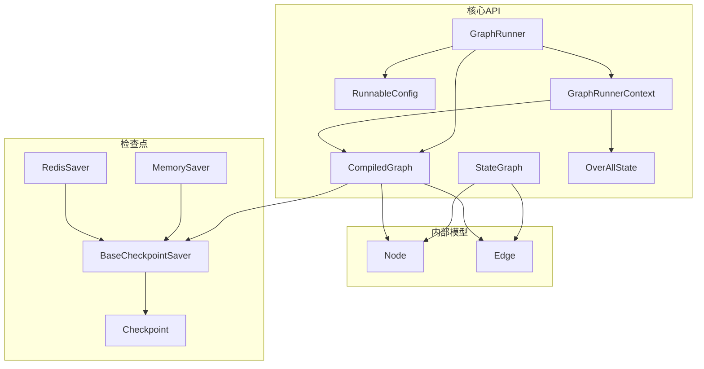
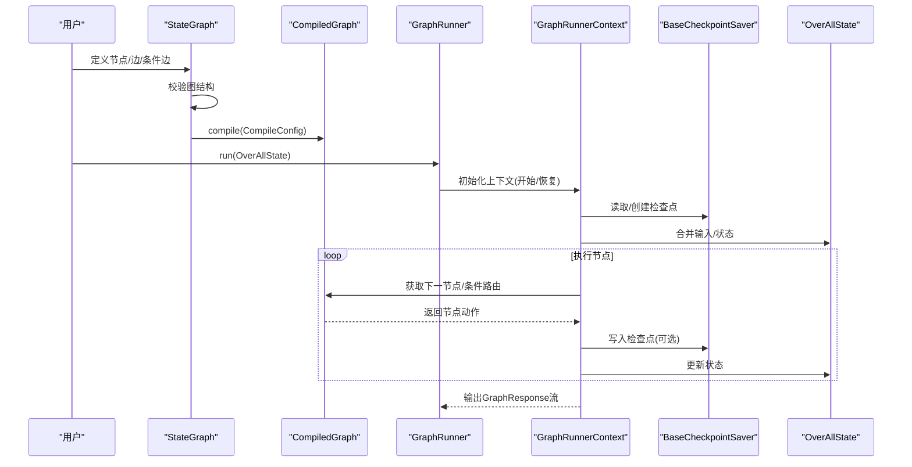
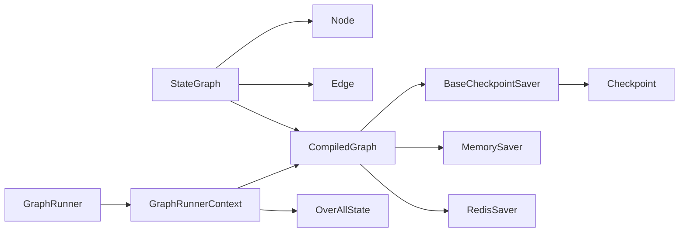

# 图核心API

<cite>
**本文引用的文件列表**
- [GraphRunner.java](file://spring-ai-alibaba-graph-core/src/main/java/com/alibaba/cloud/ai/graph/GraphRunner.java)
- [RunnableConfig.java](file://spring-ai-alibaba-graph/RunnableConfig.java)
- [StateGraph.java](file://spring-ai-alibaba-graph-core/src/main/java/com/alibaba/cloud/ai/graph/StateGraph.java)
- [OverAllState.java](file://spring-ai-alibaba-graph-core/src/main/java/com/alibaba/cloud/ai/graph/OverAllState.java)
- [CompiledGraph.java](file://spring-ai-alibaba-graph-core/src/main/java/com/alibaba/cloud/ai/graph/CompiledGraph.java)
- [GraphRunnerContext.java](file://spring-ai-alibaba-graph-core/src/main/java/com/alibaba/cloud/ai/graph/GraphRunnerContext.java)
- [Node.java](file://spring-ai-alibaba-graph-core/src/main/java/com/alibaba/cloud/ai/graph/internal/node/Node.java)
- [Edge.java](file://spring-ai-alibaba-graph-core/src/main/java/com/alibaba/cloud/ai/graph/internal/edge/Edge.java)
- [BaseCheckpointSaver.java](file://spring-ai-alibaba-graph-core/src/main/java/com/alibaba/cloud/ai/graph/checkpoint/BaseCheckpointSaver.java)
- [Checkpoint.java](file://spring-ai-alibaba-graph-core/src/main/java/com/alibaba/cloud/ai/graph/checkpoint/Checkpoint.java)
- [MemorySaver.java](file://spring-ai-alibaba-graph-core/src/main/java/com/alibaba/cloud/ai/graph/checkpoint/savers/MemorySaver.java)
- [RedisSaver.java](file://spring-ai-alibaba-graph-core/src/main/java/com/alibaba/cloud/ai/graph/checkpoint/savers/redis/RedisSaver.java)
</cite>

## 目录
1. [简介](#简介)
2. [项目结构](#项目结构)
3. [核心组件](#核心组件)
4. [架构总览](#架构总览)
5. [详细组件分析](#详细组件分析)
6. [依赖关系分析](#依赖关系分析)
7. [性能考量](#性能考量)
8. [故障排查指南](#故障排查指南)
9. [结论](#结论)
10. [附录：示例与最佳实践](#附录示例与最佳实践)

## 简介
本文件为“图核心引擎”的完整API参考文档，聚焦以下目标：
- 深入解析 GraphRunner 的 execute() 行为与与 RunnableConfig 的交互
- 详述 StateGraph 的构建方法（如 addNode、addEdge）与编译流程
- 文档化 Node、Edge 与 OverAllState 的核心接口与实现
- 说明检查点（Checkpoint）系统中 MemorySaver 与 RedisSaver 的配置与使用
- 提供 Javadoc 风格的说明，包含公共方法、构造器、枚举与常量
- 明确稳定性、线程安全与异常信息
- 给出定义状态图并执行的代码片段路径

## 项目结构
图核心引擎位于 spring-ai-alibaba-graph-core 模块，围绕“状态图”“节点/边”“编译与执行”“检查点”四大主题组织代码。关键包与职责如下：
- graph：对外API与运行时入口（GraphRunner、RunnableConfig、StateGraph、CompiledGraph、GraphRunnerContext）
- internal.node / internal.edge：内部节点与边模型
- checkpoint：检查点抽象与多种持久化实现（MemorySaver、RedisSaver等）
- state：状态策略与通道（KeyStrategy、Reducer、Channel等）
- streaming：流式输出与类型封装
- serializer：状态序列化与检查点序列化
- executor：执行器（MainGraphExecutor、NodeExecutor等）

图表来源
- [GraphRunner.java](file://spring-ai-alibaba-graph-core/src/main/java/com/alibaba/cloud/ai/graph/GraphRunner.java#L1-L66)
- [RunnableConfig.java](file://spring-ai-alibaba-graph-core/src/main/java/com/alibaba/cloud/ai/graph/RunnableConfig.java#L1-L400)
- [StateGraph.java](file://spring-ai-alibaba-graph-core/src/main/java/com/alibaba/cloud/ai/graph/StateGraph.java#L1-L607)
- [CompiledGraph.java](file://spring-ai-alibaba-graph-core/src/main/java/com/alibaba/cloud/ai/graph/CompiledGraph.java#L1-L807)
- [GraphRunnerContext.java](file://spring-ai-alibaba-graph-core/src/main/java/com/alibaba/cloud/ai/graph/GraphRunnerContext.java#L1-L473)
- [Node.java](file://spring-ai-alibaba-graph-core/src/main/java/com/alibaba/cloud/ai/graph/internal/node/Node.java#L1-L139)
- [Edge.java](file://spring-ai-alibaba-graph-core/src/main/java/com/alibaba/cloud/ai/graph/internal/edge/Edge.java#L1-L150)
- [BaseCheckpointSaver.java](file://spring-ai-alibaba-graph-core/src/main/java/com/alibaba/cloud/ai/graph/checkpoint/BaseCheckpointSaver.java#L1-L50)
- [Checkpoint.java](file://spring-ai-alibaba-graph-core/src/main/java/com/alibaba/cloud/ai/graph/checkpoint/Checkpoint.java#L1-L134)
- [MemorySaver.java](file://spring-ai-alibaba-graph-core/src/main/java/com/alibaba/cloud/ai/graph/checkpoint/savers/MemorySaver.java#L1-L170)
- [RedisSaver.java](file://spring-ai-alibaba-graph-core/src/main/java/com/alibaba/cloud/ai/graph/checkpoint/savers/redis/RedisSaver.java#L1-L428)

章节来源
- [GraphRunner.java](file://spring-ai-alibaba-graph-core/src/main/java/com/alibaba/cloud/ai/graph/GraphRunner.java#L1-L66)
- [StateGraph.java](file://spring-ai-alibaba-graph-core/src/main/java/com/alibaba/cloud/ai/graph/StateGraph.java#L1-L607)

## 核心组件
- GraphRunner：基于 Project Reactor 的响应式图执行引擎，负责将初始状态与配置交给执行上下文，返回 GraphResponse 流。
- RunnableConfig：可变配置对象，承载线程ID、检查点ID、下一节点、流模式、元数据、上下文、中断节点标记等。
- StateGraph：状态图构建器，提供 addNode/addEdge/addConditionalEdges 等方法，支持子图节点与条件边，最终编译为 CompiledGraph。
- CompiledGraph：编译后的图，持有节点工厂、边映射、键策略、最大迭代次数等；提供流式执行、快照、状态更新、调度等能力。
- GraphRunnerContext：执行上下文，管理当前/下一节点、状态、令牌用量、检查点写入、监听器回调、输出构建等。
- OverAllState：全局状态容器，支持键策略、输入注入、快照、覆盖、合并更新等。
- Node/Edge：内部节点与边模型，校验标识合法性、目标一致性、并行边去重等。
- Checkpoint/BaseCheckpointSaver：检查点与抽象保存器接口；MemorySaver 内存实现；RedisSaver 基于 Redisson 的分布式实现。

章节来源
- [GraphRunner.java](file://spring-ai-alibaba-graph-core/src/main/java/com/alibaba/cloud/ai/graph/GraphRunner.java#L1-L66)
- [RunnableConfig.java](file://spring-ai-alibaba-graph-core/src/main/java/com/alibaba/cloud/ai/graph/RunnableConfig.java#L1-L400)
- [StateGraph.java](file://spring-ai-alibaba-graph-core/src/main/java/com/alibaba/cloud/ai/graph/StateGraph.java#L1-L607)
- [CompiledGraph.java](file://spring-ai-alibaba-graph-core/src/main/java/com/alibaba/cloud/ai/graph/CompiledGraph.java#L1-L807)
- [GraphRunnerContext.java](file://spring-ai-alibaba-graph-core/src/main/java/com/alibaba/cloud/ai/graph/GraphRunnerContext.java#L1-L473)
- [OverAllState.java](file://spring-ai-alibaba-graph-core/src/main/java/com/alibaba/cloud/ai/graph/OverAllState.java#L1-L561)
- [Node.java](file://spring-ai-alibaba-graph-core/src/main/java/com/alibaba/cloud/ai/graph/internal/node/Node.java#L1-L139)
- [Edge.java](file://spring-ai-alibaba-graph-core/src/main/java/com/alibaba/cloud/ai/graph/internal/edge/Edge.java#L1-L150)
- [BaseCheckpointSaver.java](file://spring-ai-alibaba-graph-core/src/main/java/com/alibaba/cloud/ai/graph/checkpoint/BaseCheckpointSaver.java#L1-L50)
- [Checkpoint.java](file://spring-ai-alibaba-graph-core/src/main/java/com/alibaba/cloud/ai/graph/checkpoint/Checkpoint.java#L1-L134)
- [MemorySaver.java](file://spring-ai-alibaba-graph-core/src/main/java/com/alibaba/cloud/ai/graph/checkpoint/savers/MemorySaver.java#L1-L170)
- [RedisSaver.java](file://spring-ai-alibaba-graph-core/src/main/java/com/alibaba/cloud/ai/graph/checkpoint/savers/redis/RedisSaver.java#L1-L428)

## 架构总览
下图展示了从构建状态图到执行与检查点的端到端流程。

图表来源
- [StateGraph.java](file://spring-ai-alibaba-graph-core/src/main/java/com/alibaba/cloud/ai/graph/StateGraph.java#L441-L467)
- [CompiledGraph.java](file://spring-ai-alibaba-graph-core/src/main/java/com/alibaba/cloud/ai/graph/CompiledGraph.java#L466-L520)
- [GraphRunner.java](file://spring-ai-alibaba-graph-core/src/main/java/com/alibaba/cloud/ai/graph/GraphRunner.java#L48-L64)
- [GraphRunnerContext.java](file://spring-ai-alibaba-graph-core/src/main/java/com/alibaba/cloud/ai/graph/GraphRunnerContext.java#L80-L139)
- [BaseCheckpointSaver.java](file://spring-ai-alibaba-graph-core/src/main/java/com/alibaba/cloud/ai/graph/checkpoint/BaseCheckpointSaver.java#L27-L50)
- [Checkpoint.java](file://spring-ai-alibaba-graph-core/src/main/java/com/alibaba/cloud/ai/graph/checkpoint/Checkpoint.java#L1-L134)

## 详细组件分析

### GraphRunner：执行入口与结果收集
- 职责
  - 接收已编译图与配置，创建 GraphRunnerContext 并委托 MainGraphExecutor 执行
  - 返回 GraphResponse 的 Flux 流，支持错误传播与结果值收集
- 关键方法
  - run(initialState): 返回 Flux<GraphResponse<NodeOutput>>
  - resultValue(): 返回 Optional<Object>，用于获取最终结果值
- 稳定性与线程安全
  - GraphRunner 本身不维护共享状态，但其内部字段（AtomicReference）仅在 run 中使用，对外暴露为只读访问
  - 线程安全：外部需确保并发调用 run 的隔离性；内部执行由执行器与上下文协作完成
- 异常
  - run 中捕获异常并以 Flux.error 形式返回
- 代码片段路径
  - [GraphRunner.run(...)](file://spring-ai-alibaba-graph-core/src/main/java/com/alibaba/cloud/ai/graph/GraphRunner.java#L48-L64)
  - [GraphRunner.resultValue()](file://spring-ai-alibaba-graph-core/src/main/java/com/alibaba/cloud/ai/graph/GraphRunner.java#L61-L64)

章节来源
- [GraphRunner.java](file://spring-ai-alibaba-graph-core/src/main/java/com/alibaba/cloud/ai/graph/GraphRunner.java#L1-L66)

### RunnableConfig：执行配置与元数据
- 职责
  - 封装执行参数：threadId、checkPointId、nextNode、streamMode
  - 元数据与上下文：metadata（不可变）、context（可变，仅本次运行）
  - 中断控制：isInterrupted、markNodeAsInterrupted、withNodeResumed、removeInterrupted
  - 并行执行：通过 metadata 注入自定义 Executor
- 关键方法
  - threadId()/checkPointId()/nextNode(): 可选包装
  - withStreamMode()/withCheckPointId(): 返回新配置实例
  - metadata()/metadata(key)/context(): 访问与读取
  - addHumanFeedback()/addStateUpdate()/addParallelNodeExecutor()/defaultParallelExecutor()
- 稳定性与线程安全
  - 不可变元数据与可变上下文分离；Builder 构建后配置不可变
  - 外部并发访问需自行同步
- 异常
  - 传入 null 值时抛出 NullPointerException（如 addParallelNodeExecutor）
- 代码片段路径
  - [RunnableConfig.Builder](file://spring-ai-alibaba-graph-core/src/main/java/com/alibaba/cloud/ai/graph/RunnableConfig.java#L264-L398)
  - [RunnableConfig.withStreamMode(...)](file://spring-ai-alibaba-graph-core/src/main/java/com/alibaba/cloud/ai/graph/RunnableConfig.java#L170-L189)
  - [RunnableConfig.markNodeAsInterrupted(...)](file://spring-ai-alibaba-graph-core/src/main/java/com/alibaba/cloud/ai/graph/RunnableConfig.java#L159-L169)

章节来源
- [RunnableConfig.java](file://spring-ai-alibaba-graph-core/src/main/java/com/alibaba/cloud/ai/graph/RunnableConfig.java#L1-L400)

### StateGraph：状态图构建与编译
- 职责
  - 定义节点与边，支持普通节点、条件边、子图节点（StateGraph/SubCompiledGraphNode）
  - 校验图结构：起始节点存在、边目标合法、条件映射非空、并行边目标唯一
  - 编译为 CompiledGraph，注册默认内存检查点保存器
- 关键方法
  - addNode(id, action)
  - addNode(id, actionWithConfig)
  - addNode(id, Node)
  - addNode(id, action, mappings) 条件节点
  - addNode(id, CompiledGraph/sub StateGraph)
  - addEdge(sourceId, targetId)
  - addConditionalEdges(sourceId, condition, mappings)
  - compile()/compile(CompileConfig)
  - getGraph(...)
- 常量
  - START/END/ERROR/NODE_BEFORE/NODE_AFTER
- 稳定性与线程安全
  - 构建期为单线程操作；运行期由 CompiledGraph 与执行器处理
- 异常
  - GraphStateException：节点/边标识非法、重复、缺失、条件映射为空等
- 代码片段路径
  - [StateGraph.addNode(...)](file://spring-ai-alibaba-graph-core/src/main/java/com/alibaba/cloud/ai/graph/StateGraph.java#L236-L321)
  - [StateGraph.addEdge(...)](file://spring-ai-alibaba-graph-core/src/main/java/com/alibaba/cloud/ai/graph/StateGraph.java#L352-L377)
  - [StateGraph.addConditionalEdges(...)](file://spring-ai-alibaba-graph-core/src/main/java/com/alibaba/cloud/ai/graph/StateGraph.java#L379-L406)
  - [StateGraph.compile(...)](file://spring-ai-alibaba-graph-core/src/main/java/com/alibaba/cloud/ai/graph/StateGraph.java#L441-L467)

章节来源
- [StateGraph.java](file://spring-ai-alibaba-graph-core/src/main/java/com/alibaba/cloud/ai/graph/StateGraph.java#L1-L607)

### CompiledGraph：编译产物与执行入口
- 职责
  - 保存节点工厂、边映射、键策略、最大迭代次数
  - 提供流式执行、状态历史查询、状态快照、状态更新、调度
  - 处理子图展开、并行节点转换、中断节点校验
- 关键方法
  - stream()/stream(inputs)/streamFromInitialNode(...)
  - invoke()/invokeAndGetOutput()
  - getStateHistory()/getState()/stateOf()/updateState(...)
  - getGraph(...)
  - getNodeAction()/getEdge()/getKeyStrategyMap()/getMaxIterations()
- 稳定性与线程安全
  - 存储节点工厂而非实例，保证线程安全；内部状态仅在执行期间使用
- 异常
  - Missing CheckpointSaver/Checkpoint：当未配置或缺失检查点时抛出
- 代码片段路径
  - [CompiledGraph.streamFromInitialNode(...)](file://spring-ai-alibaba-graph-core/src/main/java/com/alibaba/cloud/ai/graph/CompiledGraph.java#L498-L520)
  - [CompiledGraph.updateState(...)](file://spring-ai-alibaba-graph-core/src/main/java/com/alibaba/cloud/ai/graph/CompiledGraph.java#L255-L289)

章节来源
- [CompiledGraph.java](file://spring-ai-alibaba-graph-core/src/main/java/com/alibaba/cloud/ai/graph/CompiledGraph.java#L1-L807)

### GraphRunnerContext：执行上下文
- 职责
  - 管理当前/下一节点、状态、令牌用量、恢复来源
  - 计算下一节点（含条件边）、添加检查点、构建输出（NodeOutput/StreamingOutput/StateSnapshot）
  - 触发生命周期监听器（开始、结束、节点前/后、错误）
- 关键方法
  - initializeFromStart()/initializeFromResume()
  - getEntryPoint()/nextNodeId(...)
  - addCheckpoint()/buildOutput()/buildNodeOutput()/buildStreamingOutput(...)
  - doListeners(...)
- 稳定性与线程安全
  - 上下文为单次执行的临时对象，不跨线程共享
- 异常
  - 缺失边/映射错误、迭代超限等
- 代码片段路径
  - [GraphRunnerContext.initializeFromStart(...)](file://spring-ai-alibaba-graph-core/src/main/java/com/alibaba/cloud/ai/graph/GraphRunnerContext.java#L121-L134)
  - [GraphRunnerContext.nextNodeId(...)](file://spring-ai-alibaba-graph-core/src/main/java/com/alibaba/cloud/ai/graph/GraphRunnerContext.java#L197-L221)
  - [GraphRunnerContext.addCheckpoint(...)](file://spring-ai-alibaba-graph-core/src/main/java/com/alibaba/cloud/ai/graph/GraphRunnerContext.java#L226-L237)

章节来源
- [GraphRunnerContext.java](file://spring-ai-alibaba-graph-core/src/main/java/com/alibaba/cloud/ai/graph/GraphRunnerContext.java#L1-L473)

### Node 与 Edge：内部模型
- Node
  - 标识 id 与 ActionFactory；校验 id 合法性（非空白、非私有前缀、非 START/END）
  - 提供 withIdUpdated 辅助更新 id
- Edge
  - 记录 sourceId 与 targets 列表；支持并行边与条件边
  - 校验目标节点存在、并行边目标去重、条件映射完整性
- 代码片段路径
  - [Node.validate()](file://spring-ai-alibaba-graph-core/src/main/java/com/alibaba/cloud/ai/graph/internal/node/Node.java#L66-L78)
  - [Edge.validate(...)](file://spring-ai-alibaba-graph-core/src/main/java/com/alibaba/cloud/ai/graph/internal/edge/Edge.java#L76-L124)

章节来源
- [Node.java](file://spring-ai-alibaba-graph-core/src/main/java/com/alibaba/cloud/ai/graph/internal/node/Node.java#L1-L139)
- [Edge.java](file://spring-ai-alibaba-graph-core/src/main/java/com/alibaba/cloud/ai/graph/internal/edge/Edge.java#L1-L150)

### OverAllState：全局状态容器
- 职责
  - 键值存储、键策略（KeyStrategy）映射、输入注入、快照、覆盖、合并更新
  - 支持人类反馈、中断消息、Store 长期记忆
- 关键方法
  - registerKeyAndStrategy()/updateState()/updateStateWithKeyStrategies()
  - input()/snapShot()/cover()/clear()/reset()
  - data()/value(key)/value(key,type)/keyStrategies()
- 稳定性与线程安全
  - 非线程安全；外部需自行同步
- 代码片段路径
  - [OverAllState.updateState(...)](file://spring-ai-alibaba-graph-core/src/main/java/com/alibaba/cloud/ai/graph/OverAllState.java#L263-L278)
  - [OverAllState.input(...)](file://spring-ai-alibaba-graph-core/src/main/java/com/alibaba/cloud/ai/graph/OverAllState.java#L209-L226)

章节来源
- [OverAllState.java](file://spring-ai-alibaba-graph-core/src/main/java/com/alibaba/cloud/ai/graph/OverAllState.java#L1-L561)

### 检查点系统：Checkpoint、BaseCheckpointSaver、MemorySaver、RedisSaver
- Checkpoint
  - 包含 id、state、nodeId、nextNodeId；支持复制与状态更新
- BaseCheckpointSaver
  - 抽象接口：list/get/put/release；Tag 记录线程与检查点集合
- MemorySaver
  - 内存实现：按 threadId 分组存储 LinkedList<Checkpoint>；支持加载/插入/更新/释放
- RedisSaver
  - Redis 实现：基于 Redisson 的 RMap/RBucket；采用 Base64 序列化；带锁与线程元数据管理
- 使用建议
  - MemorySaver 适合单机/测试场景；RedisSaver 适合分布式/多实例场景
  - 通过 CompileConfig 注册 SaverConfig，再传递给 StateGraph.compile(...)
- 代码片段路径
  - [Checkpoint.builder()/updateState(...)](file://spring-ai-alibaba-graph-core/src/main/java/com/alibaba/cloud/ai/graph/checkpoint/Checkpoint.java#L61-L86)
  - [BaseCheckpointSaver 接口](file://spring-ai-alibaba-graph-core/src/main/java/com/alibaba/cloud/ai/graph/checkpoint/BaseCheckpointSaver.java#L27-L50)
  - [MemorySaver.put(...)](file://spring-ai-alibaba-graph-core/src/main/java/com/alibaba/cloud/ai/graph/checkpoint/savers/MemorySaver.java#L117-L139)
  - [RedisSaver.put(...)](file://spring-ai-alibaba-graph-core/src/main/java/com/alibaba/cloud/ai/graph/checkpoint/savers/redis/RedisSaver.java#L268-L323)

章节来源
- [Checkpoint.java](file://spring-ai-alibaba-graph-core/src/main/java/com/alibaba/cloud/ai/graph/checkpoint/Checkpoint.java#L1-L134)
- [BaseCheckpointSaver.java](file://spring-ai-alibaba-graph-core/src/main/java/com/alibaba/cloud/ai/graph/checkpoint/BaseCheckpointSaver.java#L1-L50)
- [MemorySaver.java](file://spring-ai-alibaba-graph-core/src/main/java/com/alibaba/cloud/ai/graph/checkpoint/savers/MemorySaver.java#L1-L170)
- [RedisSaver.java](file://spring-ai-alibaba-graph-core/src/main/java/com/alibaba/cloud/ai/graph/checkpoint/savers/redis/RedisSaver.java#L1-L428)

## 依赖关系分析
- 组件耦合
  - StateGraph 与 Node/Edge：构建期强耦合；运行期通过 CompiledGraph 解耦
  - CompiledGraph 与 BaseCheckpointSaver：通过 CompileConfig 注入，运行期解耦
  - GraphRunner 与 GraphRunnerContext：组合关系，前者负责调度，后者负责状态与输出
- 外部依赖
  - RedisSaver 依赖 Redisson；MemorySaver 依赖本地内存
  - 序列化依赖 StateSerializer/CheckPointSerializer
- 循环依赖
  - 未发现循环依赖；各模块职责清晰

图表来源
- [StateGraph.java](file://spring-ai-alibaba-graph-core/src/main/java/com/alibaba/cloud/ai/graph/StateGraph.java#L1-L607)
- [CompiledGraph.java](file://spring-ai-alibaba-graph-core/src/main/java/com/alibaba/cloud/ai/graph/CompiledGraph.java#L1-L807)
- [GraphRunner.java](file://spring-ai-alibaba-graph-core/src/main/java/com/alibaba/cloud/ai/graph/GraphRunner.java#L1-L66)
- [GraphRunnerContext.java](file://spring-ai-alibaba-graph-core/src/main/java/com/alibaba/cloud/ai/graph/GraphRunnerContext.java#L1-L473)
- [BaseCheckpointSaver.java](file://spring-ai-alibaba-graph-core/src/main/java/com/alibaba/cloud/ai/graph/checkpoint/BaseCheckpointSaver.java#L1-L50)
- [Checkpoint.java](file://spring-ai-alibaba-graph-core/src/main/java/com/alibaba/cloud/ai/graph/checkpoint/Checkpoint.java#L1-L134)
- [MemorySaver.java](file://spring-ai-alibaba-graph-core/src/main/java/com/alibaba/cloud/ai/graph/checkpoint/savers/MemorySaver.java#L1-L170)
- [RedisSaver.java](file://spring-ai-alibaba-graph-core/src/main/java/com/alibaba/cloud/ai/graph/checkpoint/savers/redis/RedisSaver.java#L1-L428)

## 性能考量
- 并行节点
  - CompiledGraph 在编译阶段将并行边转换为 ParallelNode，并对条件边进行限制，避免复杂分支导致的性能问题
- 序列化与检查点
  - MemorySaver 为内存操作，延迟低；RedisSaver 需网络往返与序列化开销，建议合理设置锁等待时间
- 迭代限制
  - 通过 CompileConfig.recursionLimit 控制最大迭代次数，防止无限循环
- 流模式
  - StreamMode.SNAPSHOTS 会生成快照，增加序列化成本；仅在需要回放/调试时启用

[本节为通用指导，无需列出具体文件来源]

## 故障排查指南
- 常见异常
  - GraphStateException：节点/边标识非法、重复、缺失、条件映射为空、子图并行限制等
  - RunnableErrors：缺失边/映射、执行错误
  - IllegalStateException：缺少 CheckpointSaver 或 Checkpoint
- 排查步骤
  - 检查 StateGraph.validateGraph() 是否通过
  - 确认 RunnableConfig 中 threadId/checkPointId/nextNode 设置正确
  - 检查 BaseCheckpointSaver 的可用性与锁竞争情况（RedisSaver）
  - 使用 CompiledGraph.getStateHistory()/lastStateOf() 快速定位最近检查点
- 代码片段路径
  - [StateGraph.validateGraph(...)](file://spring-ai-alibaba-graph-core/src/main/java/com/alibaba/cloud/ai/graph/StateGraph.java#L424-L439)
  - [CompiledGraph.getStateHistory(...)](file://spring-ai-alibaba-graph-core/src/main/java/com/alibaba/cloud/ai/graph/CompiledGraph.java#L218-L226)

章节来源
- [StateGraph.java](file://spring-ai-alibaba-graph-core/src/main/java/com/alibaba/cloud/ai/graph/StateGraph.java#L424-L439)
- [CompiledGraph.java](file://spring-ai-alibaba-graph-core/src/main/java/com/alibaba/cloud/ai/graph/CompiledGraph.java#L218-L226)

## 结论
本API体系以“可编译、可检查点、可流式”的设计实现了高扩展的状态图执行框架。GraphRunner 作为执行入口，配合 RunnableConfig 的灵活配置与 StateGraph 的声明式构建，使复杂工作流的定义与运行变得清晰可控。检查点系统通过 MemorySaver 与 RedisSaver 提供了从单机到分布式的一致性保障。

[本节为总结性内容，无需列出具体文件来源]

## 附录：示例与最佳实践

### 示例一：定义状态图并执行（代码片段路径）
- 步骤
  - 创建 StateGraph，注册节点与边（含条件边）
  - 调用 compile() 获取 CompiledGraph
  - 构造 RunnableConfig（可选：设置流模式、线程ID、检查点ID）
  - 通过 CompiledGraph.stream(...) 或 GraphRunner.run(...) 执行
- 代码片段路径
  - [StateGraph.compile(...)](file://spring-ai-alibaba-graph-core/src/main/java/com/alibaba/cloud/ai/graph/StateGraph.java#L441-L467)
  - [CompiledGraph.stream(...)](file://spring-ai-alibaba-graph-core/src/main/java/com/alibaba/cloud/ai/graph/CompiledGraph.java#L488-L500)
  - [GraphRunner.run(...)](file://spring-ai-alibaba-graph-core/src/main/java/com/alibaba/cloud/ai/graph/GraphRunner.java#L48-L64)

### 示例二：使用检查点（MemorySaver/RedisSaver）
- MemorySaver
  - 在 CompileConfig 中注册 MemorySaver，执行过程中自动写入/读取检查点
  - 适合单机/测试环境
- RedisSaver
  - 通过 Builder 指定 RedissonClient 与 StateSerializer
  - 适合分布式部署，注意锁竞争与序列化性能
- 代码片段路径
  - [MemorySaver.put(...)](file://spring-ai-alibaba-graph-core/src/main/java/com/alibaba/cloud/ai/graph/checkpoint/savers/MemorySaver.java#L117-L139)
  - [RedisSaver.put(...)](file://spring-ai-alibaba-graph-core/src/main/java/com/alibaba/cloud/ai/graph/checkpoint/savers/redis/RedisSaver.java#L268-L323)

### 最佳实践
- 节点命名
  - 避免使用 START/END/NODE_BEFORE/NODE_AFTER 等保留标识
  - 不使用私有前缀（如 __）开头的 id
- 条件边
  - 映射非空且目标节点存在；避免在并行节点上使用条件边
- 并行边
  - 目标节点唯一，避免歧义
- 检查点
  - 生产环境优先考虑 RedisSaver；开发/测试可用 MemorySaver
  - 合理设置 recursionLimit，防止死循环
- 流模式
  - 正常执行使用 VALUES；需要回放/调试时切换为 SNAPSHOTS

[本节为通用指导，无需列出具体文件来源]