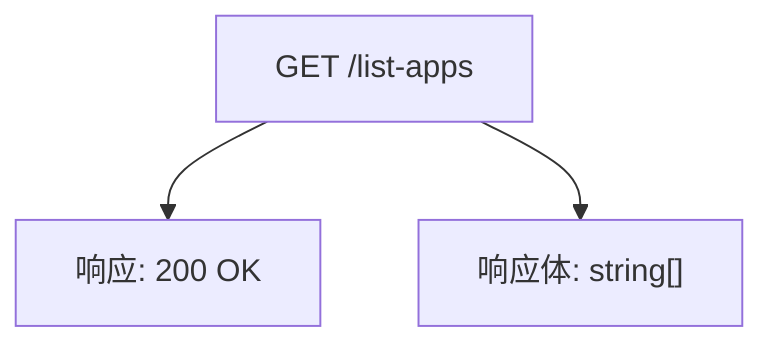
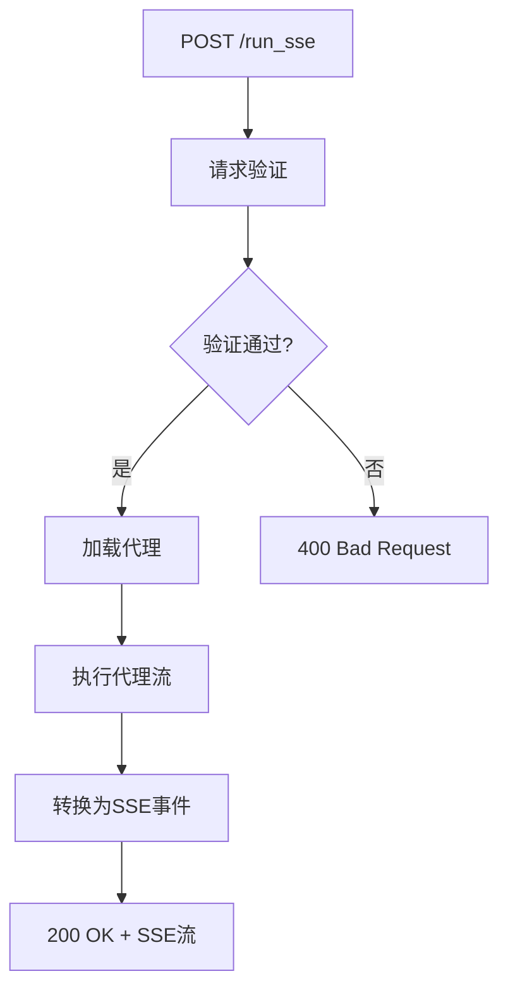
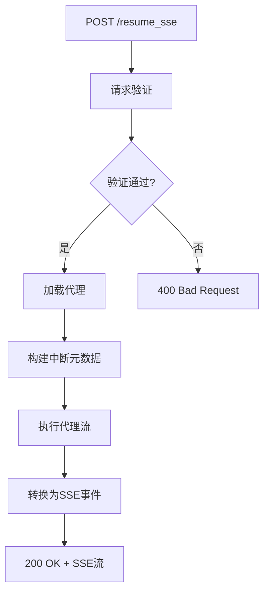
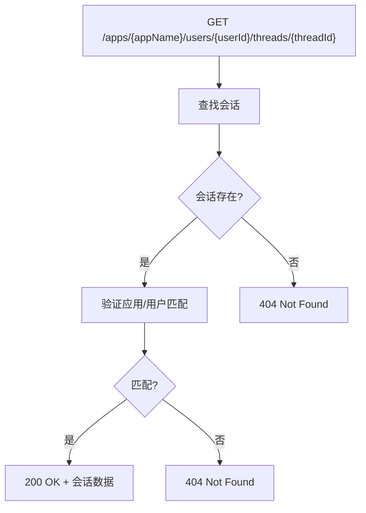
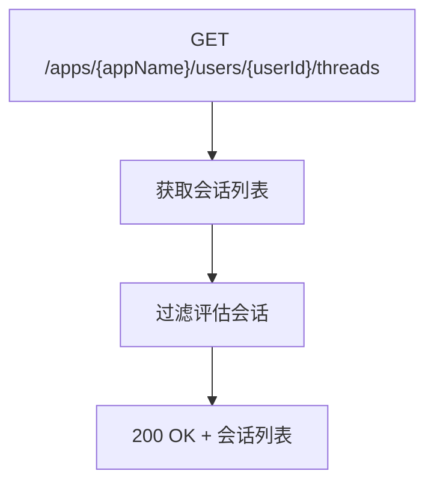
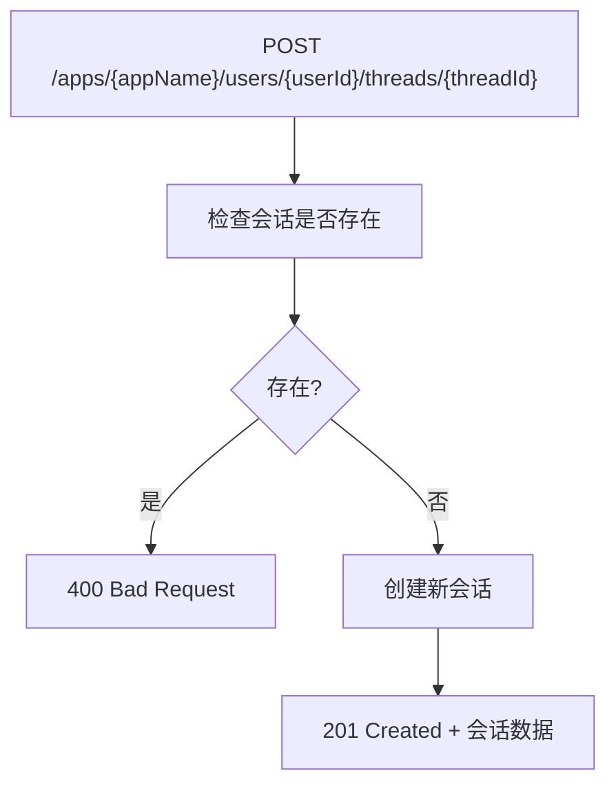
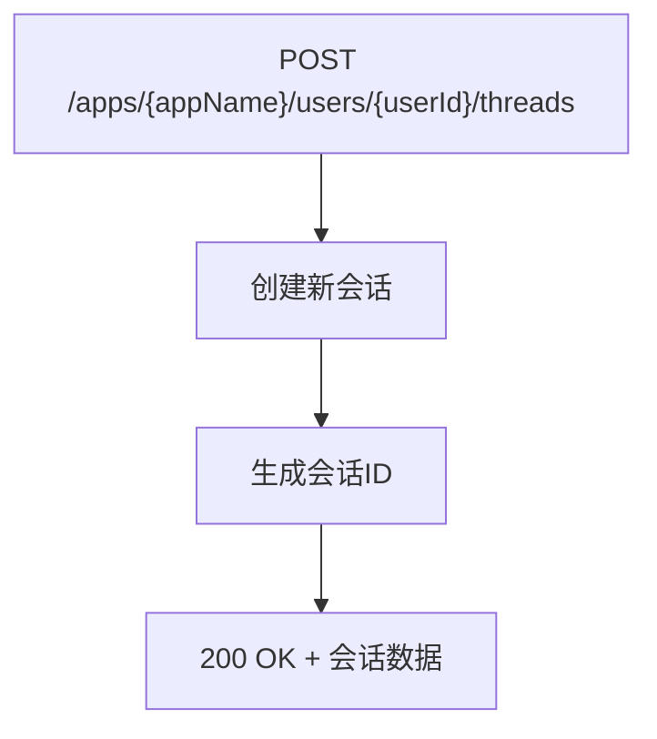
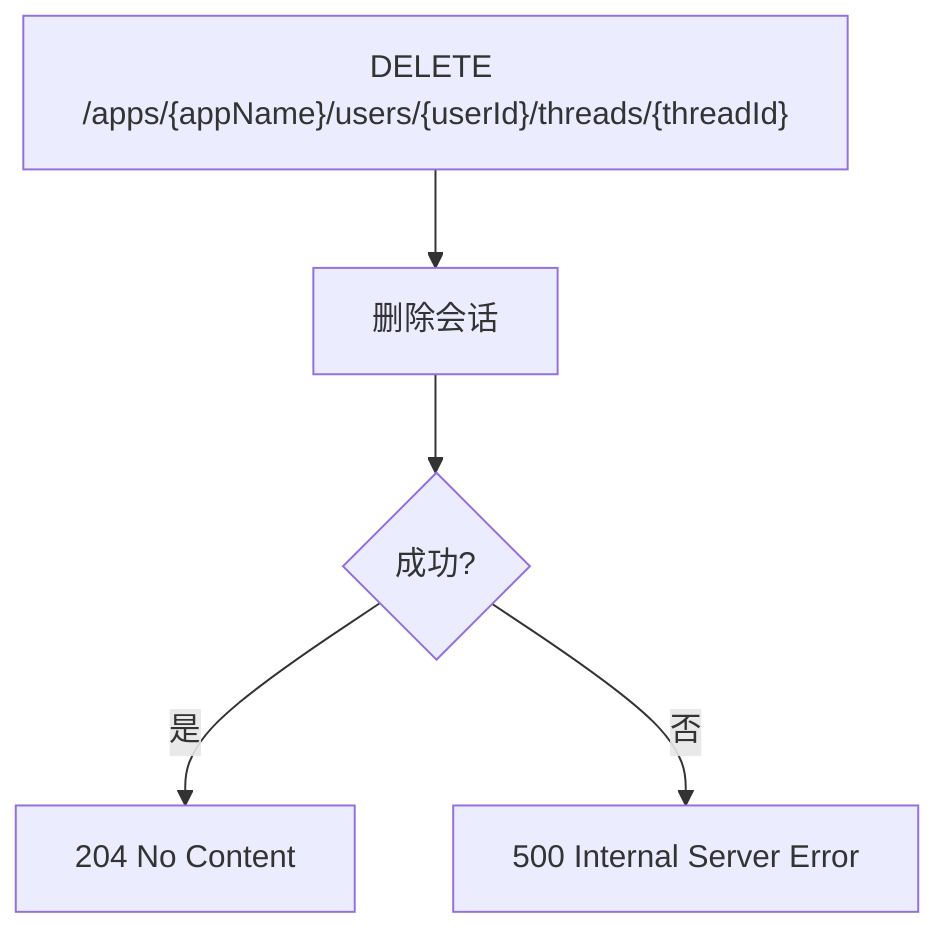
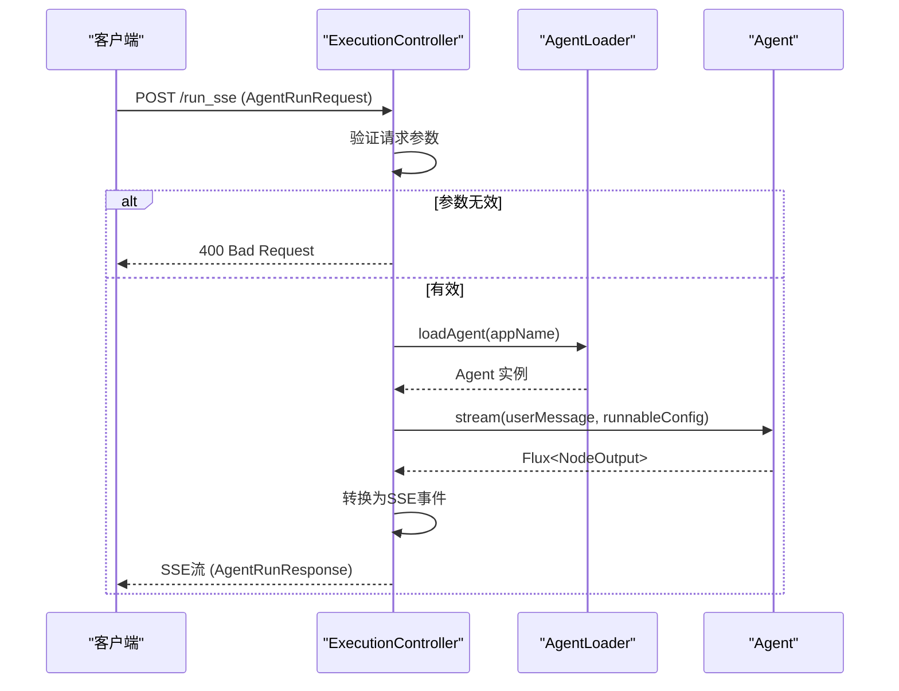

# 工作室API

<cite>
**本文档中引用的文件**  
- [AgentController.java](file://spring-ai-alibaba-studio/src/main/java/com/alibaba/cloud/ai/agent/studio/controller/AgentController.java)
- [ExecutionController.java](file://spring-ai-alibaba-studio/src/main/java/com/alibaba/cloud/ai/agent/studio/controller/ExecutionController.java)
- [ThreadController.java](file://spring-ai-alibaba-studio/src/main/java/com/alibaba/cloud/ai/agent/studio/controller/ThreadController.java)
- [AgentRunRequest.java](file://spring-ai-alibaba-studio/src/main/java/com/alibaba/cloud/ai/agent/studio/dto/AgentRunRequest.java)
- [AgentResumeRequest.java](file://spring-ai-alibaba-studio/src/main/java/com/alibaba/cloud/ai/agent/studio/dto/AgentResumeRequest.java)
- [AgentRunResponse.java](file://spring-ai-alibaba-studio/src/main/java/com/alibaba/cloud/ai/agent/studio/dto/messages/AgentRunResponse.java)
- [Thread.java](file://spring-ai-alibaba-studio/src/main/java/com/alibaba/cloud/ai/agent/studio/dto/Thread.java)
- [ListThreadsResponse.java](file://spring-ai-alibaba-studio/src/main/java/com/alibaba/cloud/ai/agent/studio/dto/ListThreadsResponse.java)
</cite>

## 目录
1. [简介](#简介)
2. [API版本控制](#api版本控制)
3. [认证方式](#认证方式)
4. [核心组件](#核心组件)
5. [端点参考](#端点参考)
6. [会话管理](#会话管理)
7. [代理执行流程](#代理执行流程)
8. [错误响应](#错误响应)
9. [示例](#示例)

## 简介
工作室后端服务提供了一套RESTful API，用于管理AI代理的执行和会话。本API文档详细描述了`AgentController`、`ExecutionController`和`ThreadController`中的所有端点，包括HTTP方法、URL路径、请求/响应体结构、认证方式、参数验证规则和错误响应码。

该API支持流式和非流式代理执行，允许客户端通过Server-Sent Events (SSE)接收实时更新。会话（Thread）管理功能允许创建、检索、列出和删除用户会话，确保对话状态的持久化和隔离。

**本文档中引用的文件**
- [AgentController.java](file://spring-ai-alibaba-studio/src/main/java/com/alibaba/cloud/ai/agent/studio/controller/AgentController.java)
- [ExecutionController.java](file://spring-ai-alibaba-studio/src/main/java/com/alibaba/cloud/ai/agent/studio/controller/ExecutionController.java)
- [ThreadController.java](file://spring-ai-alibaba-studio/src/main/java/com/alibaba/cloud/ai/agent/studio/controller/ThreadController.java)

## API版本控制
当前API未显式实现版本控制策略。所有端点均位于根路径下，没有版本前缀（如`/v1/`）。这意味着API是向前兼容的，任何向后不兼容的更改都需要通过部署新实例或使用不同的部署策略来管理。

潜在的向后兼容性问题包括：
- 添加新的必需请求参数可能会破坏现有客户端
- 修改现有响应体结构可能会导致客户端解析失败
- 删除或重命名端点会直接导致客户端调用失败

建议客户端在生产环境中使用特定的部署实例，并监控API变更通知。

**本文档中引用的文件**
- [AgentController.java](file://spring-ai-alibaba-studio/src/main/java/com/alibaba/cloud/ai/agent/studio/controller/AgentController.java)
- [ExecutionController.java](file://spring-ai-alibaba-studio/src/main/java/com/alibaba/cloud/ai/agent/studio/controller/ExecutionController.java)
- [ThreadController.java](file://spring-ai-alibaba-studio/src/main/java/com/alibaba/cloud/ai/agent/studio/controller/ThreadController.java)

## 认证方式
当前API实现中未包含显式的认证机制。所有端点均可在无需身份验证的情况下访问。这表明该API可能设计用于内部网络或受信任环境。

在生产部署中，应通过以下方式之一添加认证：
- JWT令牌认证
- API密钥认证
- OAuth 2.0
- 基于证书的认证

用户身份通过请求体中的`userId`字段传递，但这不构成安全认证，仅用于会话隔离和审计。

**本文档中引用的文件**
- [AgentRunRequest.java](file://spring-ai-alibaba-studio/src/main/java/com/alibaba/cloud/ai/agent/studio/dto/AgentRunRequest.java)
- [AgentResumeRequest.java](file://spring-ai-alibaba-studio/src/main/java/com/alibaba/cloud/ai/agent/studio/dto/AgentResumeRequest.java)

## 核心组件

### AgentController
`AgentController`负责管理代理应用程序的发现和列表功能。它提供了一个端点来检索系统中可用的代理应用程序列表。

**本文档中引用的文件**
- [AgentController.java](file://spring-ai-alibaba-studio/src/main/java/com/alibaba/cloud/ai/agent/studio/controller/AgentController.java)

### ExecutionController
`ExecutionController`处理代理执行的核心功能，包括启动新的代理运行和恢复被中断的代理执行。它支持流式响应，通过Server-Sent Events (SSE)向客户端发送实时更新。

**本文档中引用的文件**
- [ExecutionController.java](file://spring-ai-alibaba-studio/src/main/java/com/alibaba/cloud/ai/agent/studio/controller/ExecutionController.java)

### ThreadController
`ThreadController`管理用户会话（线程），提供创建、检索、列出和删除会话的功能。会话用于保持对话状态，并与特定的用户和应用程序关联。

**本文档中引用的文件**
- [ThreadController.java](file://spring-ai-alibaba-studio/src/main/java/com/alibaba/cloud/ai/agent/studio/controller/ThreadController.java)

## 端点参考

### AgentController端点

#### 获取应用程序列表


- **HTTP方法**: `GET`
- **URL路径**: `/list-apps`
- **请求参数**: 无
- **请求体**: 无
- **响应体**: `string[]` - 可用的应用程序名称列表
- **成功响应码**: `200 OK`
- **错误响应码**: 无特定错误处理
- **描述**: 返回系统中可用的代理应用程序列表。此列表由`AgentLoader`动态加载。

**本文档中引用的文件**
- [AgentController.java](file://spring-ai-alibaba-studio/src/main/java/com/alibaba/cloud/ai/agent/studio/controller/AgentController.java#L63-L68)

### ExecutionController端点

#### 流式代理执行


- **HTTP方法**: `POST`
- **URL路径**: `/run_sse`
- **请求参数**: 无
- **请求体**: `AgentRunRequest` 对象
- **响应体**: Server-Sent Events 流，包含 `AgentRunResponse` 对象
- **成功响应码**: `200 OK`
- **错误响应码**: 
  - `400 Bad Request` - 当`appName`或`threadId`为空时
  - `500 Internal Server Error` - 当代理执行失败时
- **描述**: 执行代理运行并使用Server-Sent Events (SSE)流式传输结果。客户端可以实时接收代理的输出。

**本文档中引用的文件**
- [ExecutionController.java](file://spring-ai-alibaba-studio/src/main/java/com/alibaba/cloud/ai/agent/studio/controller/ExecutionController.java#L154-L186)

#### 恢复代理执行


- **HTTP方法**: `POST`
- **URL路径**: `/resume_sse`
- **请求参数**: 无
- **请求体**: `AgentResumeRequest` 对象
- **响应体**: Server-Sent Events 流，包含 `AgentRunResponse` 对象
- **成功响应码**: `200 OK`
- **错误响应码**: 
  - `400 Bad Request` - 当`appName`或`threadId`为空时
  - `500 Internal Server Error` - 当代理执行失败时
- **描述**: 恢复被中断的代理执行。允许客户端提供工具调用反馈，以继续之前的执行流程。

**本文档中引用的文件**
- [ExecutionController.java](file://spring-ai-alibaba-studio/src/main/java/com/alibaba/cloud/ai/agent/studio/controller/ExecutionController.java#L188-L247)

### ThreadController端点

#### 获取会话


- **HTTP方法**: `GET`
- **URL路径**: `/apps/{appName}/users/{userId}/threads/{threadId}`
- **路径参数**:
  - `appName`: 应用程序名称
  - `userId`: 用户ID
  - `threadId`: 会话ID
- **请求体**: 无
- **响应体**: `Thread` 对象
- **成功响应码**: `200 OK`
- **错误响应码**: `404 Not Found` - 当会话不存在或应用/用户不匹配时
- **描述**: 检索指定的会话信息。

**本文档中引用的文件**
- [ThreadController.java](file://spring-ai-alibaba-studio/src/main/java/com/alibaba/cloud/ai/agent/studio/controller/ThreadController.java#L115-L120)

#### 列出会话


- **HTTP方法**: `GET`
- **URL路径**: `/apps/{appName}/users/{userId}/threads`
- **路径参数**:
  - `appName`: 应用程序名称
  - `userId`: 用户ID
- **请求体**: 无
- **响应体**: `List<Thread>` 对象
- **成功响应码**: `200 OK`
- **错误响应码**: 无特定错误处理
- **描述**: 列出指定用户在特定应用程序中的所有非评估会话。

**本文档中引用的文件**
- [ThreadController.java](file://spring-ai-alibaba-studio/src/main/java/com/alibaba/cloud/ai/agent/studio/controller/ThreadController.java#L129-L151)

#### 创建会话（指定ID）


- **HTTP方法**: `POST`
- **URL路径**: `/apps/{appName}/users/{userId}/threads/{threadId}`
- **路径参数**:
  - `appName`: 应用程序名称
  - `userId`: 用户ID
  - `threadId`: 会话ID
- **请求体**: 可选的 `Map<String, Object>` 初始状态
- **响应体**: `Thread` 对象
- **成功响应码**: `200 OK`
- **错误响应码**: 
  - `400 Bad Request` - 当会话已存在时
  - `500 Internal Server Error` - 当会话创建失败时
- **描述**: 使用客户端提供的ID创建新会话。如果会话已存在，则返回错误。

**本文档中引用的文件**
- [ThreadController.java](file://spring-ai-alibaba-studio/src/main/java/com/alibaba/cloud/ai/agent/studio/controller/ThreadController.java#L164-L217)

#### 创建会话（生成ID）


- **HTTP方法**: `POST`
- **URL路径**: `/apps/{appName}/users/{userId}/threads`
- **路径参数**:
  - `appName`: 应用程序名称
  - `userId`: 用户ID
- **请求体**: 可选的 `Map<String, Object>` 初始状态
- **响应体**: `Thread` 对象
- **成功响应码**: `200 OK`
- **错误响应码**: `500 Internal Server Error` - 当会话创建失败时
- **描述**: 创建新会话，由服务生成会话ID。

**本文档中引用的文件**
- [ThreadController.java](file://spring-ai-alibaba-studio/src/main/java/com/alibaba/cloud/ai/agent/studio/controller/ThreadController.java#L228-L264)

#### 删除会话


- **HTTP方法**: `DELETE`
- **URL路径**: `/apps/{appName}/users/{userId}/threads/{threadId}`
- **路径参数**:
  - `appName`: 应用程序名称
  - `userId`: 用户ID
  - `threadId`: 会话ID
- **请求体**: 无
- **响应体**: 无
- **成功响应码**: `204 No Content`
- **错误响应码**: `500 Internal Server Error` - 当会话删除失败时
- **描述**: 删除指定的会话。

**本文档中引用的文件**
- [ThreadController.java](file://spring-ai-alibaba-studio/src/main/java/com/alibaba/cloud/ai/agent/studio/controller/ThreadController.java#L275-L293)

## 会话管理
会话（Thread）是工作室API中的核心概念，用于维护用户与代理之间的对话状态。每个会话都与特定的应用程序和用户关联，并通过唯一的`threadId`标识。

会话管理功能包括：
- **创建会话**: 可以通过两种方式创建会话：客户端指定ID或服务生成ID
- **检索会话**: 通过应用程序、用户和会话ID检索特定会话
- **列出会话**: 获取特定用户在特定应用程序中的所有会话
- **删除会话**: 删除不再需要的会话

会话数据包含会话ID、应用程序名称、用户ID和会话值（`values`），其中存储了对话历史和其他状态信息。

评估会话（ID以`SAA_EVAL_`开头）在列出会话时会被自动过滤掉，以区分常规对话和评估对话。

**本文档中引用的文件**
- [Thread.java](file://spring-ai-alibaba-studio/src/main/java/com/alibaba/cloud/ai/agent/studio/dto/Thread.java)
- [ThreadController.java](file://spring-ai-alibaba-studio/src/main/java/com/alibaba/cloud/ai/agent/studio/controller/ThreadController.java)

## 代理执行流程
代理执行流程涉及多个组件的协同工作，从接收客户端请求到返回流式响应。



1. 客户端发送`POST /run_sse`请求，包含`AgentRunRequest`
2. `ExecutionController`验证`appName`和`threadId`是否为空
3. 使用`AgentLoader`根据`appName`加载相应的代理
4. 创建`RunnableConfig`，包含会话ID和用户元数据
5. 调用代理的`stream`方法，开始执行
6. 将`Flux<NodeOutput>`转换为`Flux<ServerSentEvent<String>>`
7. 通过SSE向客户端流式传输`AgentRunResponse`对象

对于被中断的代理执行，客户端可以发送`POST /resume_sse`请求，提供工具调用反馈，以恢复执行流程。

**本文档中引用的文件**
- [ExecutionController.java](file://spring-ai-alibaba-studio/src/main/java/com/alibaba/cloud/ai/agent/studio/controller/ExecutionController.java)
- [AgentRunRequest.java](file://spring-ai-alibaba-studio/src/main/java/com/alibaba/cloud/ai/agent/studio/dto/AgentRunRequest.java)
- [AgentRunResponse.java](file://spring-ai-alibaba-studio/src/main/java/com/alibaba/cloud/ai/agent/studio/dto/messages/AgentRunResponse.java)

## 错误响应
API使用标准HTTP状态码表示错误情况。所有错误都会在响应体中包含详细的错误信息。

### 通用错误响应结构
```json
{
  "error": true,
  "errorType": "错误类型",
  "errorMessage": "错误消息"
}
```

### 特定错误码
- `400 Bad Request`: 请求参数无效，如`appName`或`threadId`为空
- `404 Not Found`: 请求的资源不存在，如会话不存在
- `500 Internal Server Error`: 服务器内部错误，如代理执行失败或会话操作失败

错误处理在控制器层实现，使用`ResponseStatusException`来抛出适当的HTTP错误。所有异常都会被记录到日志中，便于调试和监控。

**本文档中引用的文件**
- [ExecutionController.java](file://spring-ai-alibaba-studio/src/main/java/com/alibaba/cloud/ai/agent/studio/controller/ExecutionController.java)
- [ThreadController.java](file://spring-ai-alibaba-studio/src/main/java/com/alibaba/cloud/ai/agent/studio/controller/ThreadController.java)

## 示例

### curl命令示例

#### 列出应用程序
```bash
curl -X GET http://localhost:8080/list-apps
```

#### 流式代理执行
```bash
curl -X POST http://localhost:8080/run_sse \
  -H "Content-Type: application/json" \
  -d '{
    "appName": "chatbot",
    "userId": "user123",
    "threadId": "thread456",
    "newMessage": {
      "content": "你好，你能帮我吗？"
    }
  }'
```

#### 恢复代理执行
```bash
curl -X POST http://localhost:8080/resume_sse \
  -H "Content-Type: application/json" \
  -d '{
    "appName": "chatbot",
    "userId": "user123",
    "threadId": "thread456",
    "toolFeedbacks": [
      {
        "id": "call_123",
        "name": "search_tool",
        "arguments": {"query": "天气"},
        "result": "APPROVED"
      }
    ]
  }'
```

#### 创建会话
```bash
curl -X POST http://localhost:8080/apps/chatbot/users/user123/threads/thread456 \
  -H "Content-Type: application/json" \
  -d '{
    "initialState": {
      "language": "zh-CN"
    }
  }'
```

### JSON请求体示例

#### AgentRunRequest
```json
{
  "appName": "deepresearch",
  "userId": "user789",
  "threadId": "thread012",
  "newMessage": {
    "content": "请帮我研究一下量子计算的最新进展",
    "metadata": {},
    "media": []
  },
  "streaming": true
}
```

#### AgentResumeRequest
```json
{
  "appName": "deepresearch",
  "userId": "user789",
  "threadId": "thread012",
  "toolFeedbacks": [
    {
      "id": "call_456",
      "name": "web_search",
      "arguments": {
        "query": "quantum computing 2025"
      },
      "result": "APPROVED",
      "description": "搜索量子计算最新进展"
    }
  ]
}
```

#### Thread创建请求
```json
{
  "values": {
    "initial_prompt": {
      "messageType": "user",
      "content": "开始新的研究项目",
      "metadata": {},
      "media": []
    }
  }
}
```

**本文档中引用的文件**
- [AgentRunRequest.java](file://spring-ai-alibaba-studio/src/main/java/com/alibaba/cloud/ai/agent/studio/dto/AgentRunRequest.java)
- [AgentResumeRequest.java](file://spring-ai-alibaba-studio/src/main/java/com/alibaba/cloud/ai/agent/studio/dto/AgentResumeRequest.java)
- [Thread.java](file://spring-ai-alibaba-studio/src/main/java/com/alibaba/cloud/ai/agent/studio/dto/Thread.java)