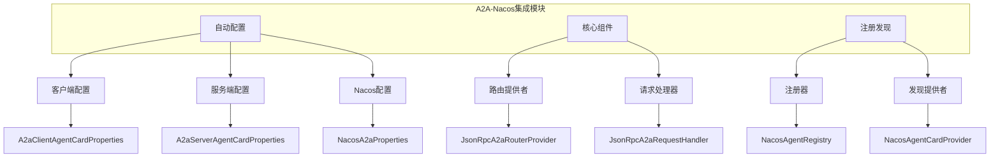
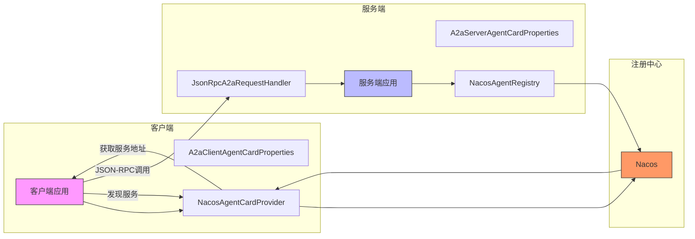
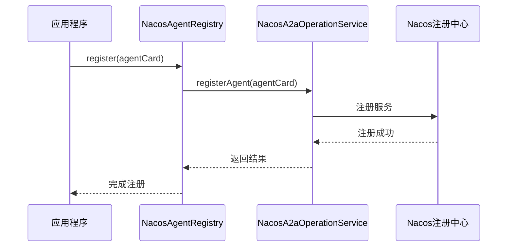
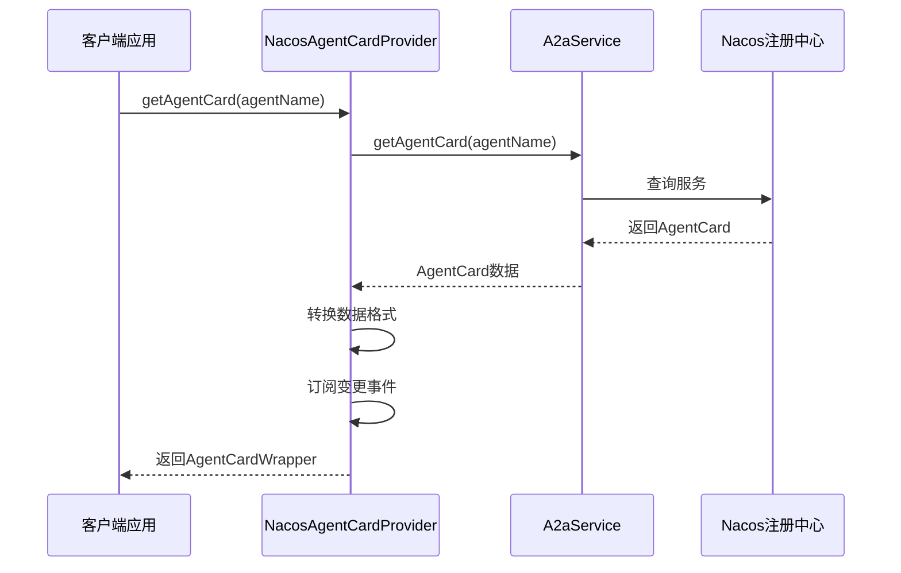
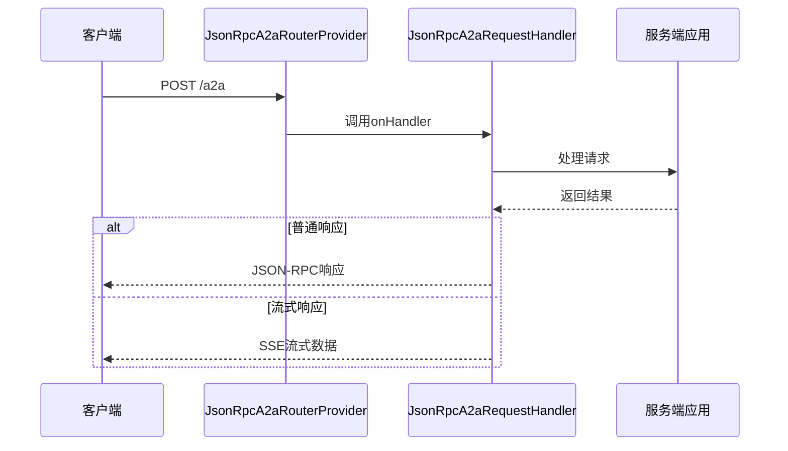
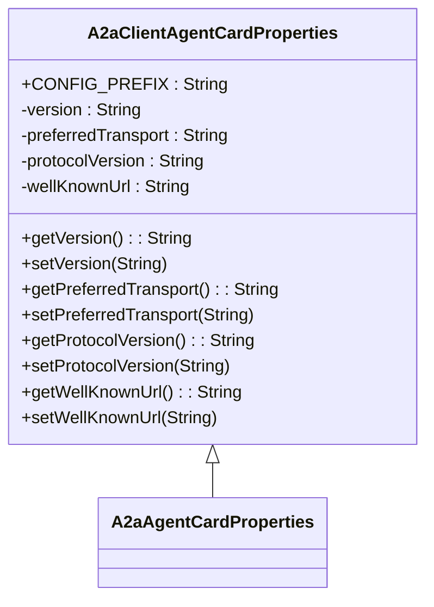
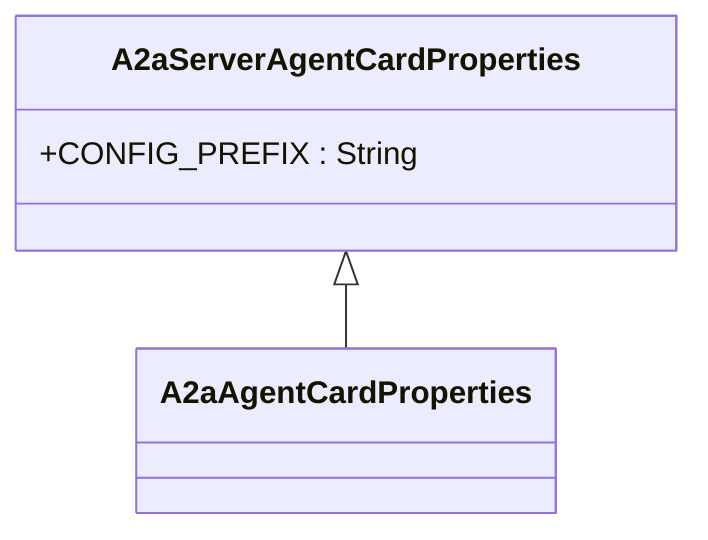
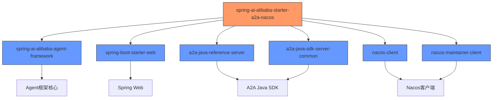

# A2A-Nacos集成

<cite>
**本文档中引用的文件**  
- [A2aClientAgentCardProperties.java](file://spring-boot-starters/spring-ai-alibaba-starter-a2a-nacos/src/main/java/com/alibaba/cloud/ai/a2a/autoconfigure/A2aClientAgentCardProperties.java)
- [A2aServerAgentCardProperties.java](file://spring-boot-starters/spring-ai-alibaba-starter-a2a-nacos/src/main/java/com/alibaba/cloud/ai/a2a/autoconfigure/A2aServerAgentCardProperties.java)
- [A2aAgentCardProperties.java](file://spring-boot-starters/spring-ai-alibaba-starter-a2a-nacos/src/main/java/com/alibaba/cloud/ai/a2a/autoconfigure/A2aAgentCardProperties.java)
- [A2aServerProperties.java](file://spring-boot-starters/spring-ai-alibaba-starter-a2a-nacos/src/main/java/com/alibaba/cloud/ai/a2a/autoconfigure/A2aServerProperties.java)
- [JsonRpcA2aRouterProvider.java](file://spring-boot-starters/spring-ai-alibaba-starter-a2a-nacos/src/main/java/com/alibaba/cloud/ai/a2a/core/route/JsonRpcA2aRouterProvider.java)
- [NacosAgentRegistry.java](file://spring-boot-starters/spring-ai-alibaba-starter-a2a-nacos/src/main/java/com/alibaba/cloud/ai/a2a/registry/nacos/register/NacosAgentRegistry.java)
- [NacosAgentCardProvider.java](file://spring-boot-starters/spring-ai-alibaba-starter-a2a-nacos/src/main/java/com/alibaba/cloud/ai/a2a/registry/nacos/discovery/NacosAgentCardProvider.java)
- [NacosA2aRegistryAutoConfiguration.java](file://spring-boot-starters/spring-ai-alibaba-starter-a2a-nacos/src/main/java/com/alibaba/cloud/ai/a2a/autoconfigure/nacos/NacosA2aRegistryAutoConfiguration.java)
- [NacosA2aDiscoveryAutoConfiguration.java](file://spring-boot-starters/spring-ai-alibaba-starter-a2a-nacos/src/main/java/com/alibaba/cloud/ai/a2a/autoconfigure/nacos/NacosA2aDiscoveryAutoConfiguration.java)
- [A2aServerHandlerAutoConfiguration.java](file://spring-boot-starters/spring-ai-alibaba-starter-a2a-nacos/src/main/java/com/alibaba/cloud/ai/a2a/autoconfigure/server/A2aServerHandlerAutoConfiguration.java)
</cite>

## 目录
1. [简介](#简介)
2. [项目结构](#项目结构)
3. [核心组件](#核心组件)
4. [架构概述](#架构概述)
5. [详细组件分析](#详细组件分析)
6. [依赖分析](#依赖分析)
7. [性能考虑](#性能考虑)
8. [故障排查指南](#故障排查指南)
9. [结论](#结论)

## 简介
本文档详细介绍了A2A-Nacos集成的实现机制，重点阐述了代理间自动发现与通信（Agent-to-Agent, A2A）的功能。文档深入解析了服务注册与发现机制，包括客户端和服务端的AgentCard注册流程，以及Nacos作为注册中心的角色。同时，文档详细说明了基于JSON-RPC的远程调用实现、核心配置属性和关键组件的协作关系，为开发者提供完整的集成、配置和故障排查指南。

## 项目结构
A2A-Nacos集成模块位于`spring-boot-starters/spring-ai-alibaba-starter-a2a-nacos`目录下，主要包含自动配置、核心路由、服务注册和发现等组件。该模块通过Spring Boot自动配置机制，实现了与Nacos注册中心的无缝集成。

**图示来源**  
- [A2aClientAgentCardProperties.java](file://spring-boot-starters/spring-ai-alibaba-starter-a2a-nacos/src/main/java/com/alibaba/cloud/ai/a2a/autoconfigure/A2aClientAgentCardProperties.java)
- [A2aServerAgentCardProperties.java](file://spring-boot-starters/spring-ai-alibaba-starter-a2a-nacos/src/main/java/com/alibaba/cloud/ai/a2a/autoconfigure/A2aServerAgentCardProperties.java)
- [NacosA2aProperties.java](file://spring-boot-starters/spring-ai-alibaba-starter-a2a-nacos/src/main/java/com/alibaba/cloud/ai/a2a/registry/nacos/properties/NacosA2aProperties.java)
- [JsonRpcA2aRouterProvider.java](file://spring-boot-starters/spring-ai-alibaba-starter-a2a-nacos/src/main/java/com/alibaba/cloud/ai/a2a/core/route/JsonRpcA2aRouterProvider.java)
- [NacosAgentRegistry.java](file://spring-boot-starters/spring-ai-alibaba-starter-a2a-nacos/src/main/java/com/alibaba/cloud/ai/a2a/registry/nacos/register/NacosAgentRegistry.java)
- [NacosAgentCardProvider.java](file://spring-boot-starters/spring-ai-alibaba-starter-a2a-nacos/src/main/java/com/alibaba/cloud/ai/a2a/registry/nacos/discovery/NacosAgentCardProvider.java)

**本节来源**  
- [spring-boot-starters/spring-ai-alibaba-starter-a2a-nacos](file://spring-boot-starters/spring-ai-alibaba-starter-a2a-nacos)

## 核心组件
A2A-Nacos集成的核心组件包括服务注册器、发现提供者、路由提供者和配置属性类。这些组件共同实现了代理间的自动发现与通信功能。

**本节来源**  
- [NacosAgentRegistry.java](file://spring-boot-starters/spring-ai-alibaba-starter-a2a-nacos/src/main/java/com/alibaba/cloud/ai/a2a/registry/nacos/register/NacosAgentRegistry.java)
- [NacosAgentCardProvider.java](file://spring-boot-starters/spring-ai-alibaba-starter-a2a-nacos/src/main/java/com/alibaba/cloud/ai/a2a/registry/nacos/discovery/NacosAgentCardProvider.java)
- [JsonRpcA2aRouterProvider.java](file://spring-boot-starters/spring-ai-alibaba-starter-a2a-nacos/src/main/java/com/alibaba/cloud/ai/a2a/core/route/JsonRpcA2aRouterProvider.java)
- [A2aClientAgentCardProperties.java](file://spring-boot-starters/spring-ai-alibaba-starter-a2a-nacos/src/main/java/com/alibaba/cloud/ai/a2a/autoconfigure/A2aClientAgentCardProperties.java)
- [A2aServerAgentCardProperties.java](file://spring-boot-starters/spring-ai-alibaba-starter-a2a-nacos/src/main/java/com/alibaba/cloud/ai/a2a/autoconfigure/A2aServerAgentCardProperties.java)

## 架构概述
A2A-Nacos集成的架构基于Spring Boot自动配置和Nacos服务发现机制。系统通过注册中心实现服务的注册与发现，利用JSON-RPC协议实现远程调用。

**图示来源**  
- [NacosAgentRegistry.java](file://spring-boot-starters/spring-ai-alibaba-starter-a2a-nacos/src/main/java/com/alibaba/cloud/ai/a2a/registry/nacos/register/NacosAgentRegistry.java)
- [NacosAgentCardProvider.java](file://spring-boot-starters/spring-ai-alibaba-starter-a2a-nacos/src/main/java/com/alibaba/cloud/ai/a2a/registry/nacos/discovery/NacosAgentCardProvider.java)
- [JsonRpcA2aRouterProvider.java](file://spring-boot-starters/spring-ai-alibaba-starter-a2a-nacos/src/main/java/com/alibaba/cloud/ai/a2a/core/route/JsonRpcA2aRouterProvider.java)
- [A2aClientAgentCardProperties.java](file://spring-boot-starters/spring-ai-alibaba-starter-a2a-nacos/src/main/java/com/alibaba/cloud/ai/a2a/autoconfigure/A2aClientAgentCardProperties.java)
- [A2aServerAgentCardProperties.java](file://spring-boot-starters/spring-ai-alibaba-starter-a2a-nacos/src/main/java/com/alibaba/cloud/ai/a2a/autoconfigure/A2aServerAgentCardProperties.java)

## 详细组件分析

### 服务注册机制
A2A-Nacos集成通过`NacosAgentRegistry`实现服务注册功能。服务端启动时，会将AgentCard信息注册到Nacos注册中心，供客户端发现和调用。

**图示来源**  
- [NacosAgentRegistry.java](file://spring-boot-starters/spring-ai-alibaba-starter-a2a-nacos/src/main/java/com/alibaba/cloud/ai/a2a/registry/nacos/register/NacosAgentRegistry.java)
- [NacosA2aOperationService.java](file://spring-boot-starters/spring-ai-alibaba-starter-a2a-nacos/src/main/java/com/alibaba/cloud/ai/a2a/registry/nacos/service/NacosA2aOperationService.java)

**本节来源**  
- [NacosAgentRegistry.java](file://spring-boot-starters/spring-ai-alibaba-starter-a2a-nacos/src/main/java/com/alibaba/cloud/ai/a2a/registry/nacos/register/NacosAgentRegistry.java)

### 服务发现过程
客户端通过`NacosAgentCardProvider`实现服务发现功能。客户端应用通过代理名称从Nacos注册中心获取对应的AgentCard信息，包括服务地址、元数据等。

**图示来源**  
- [NacosAgentCardProvider.java](file://spring-boot-starters/spring-ai-alibaba-starter-a2a-nacos/src/main/java/com/alibaba/cloud/ai/a2a/registry/nacos/discovery/NacosAgentCardProvider.java)
- [AgentCardConverterUtil.java](file://spring-boot-starters/spring-ai-alibaba-starter-a2a-nacos/src/main/java/com/alibaba/cloud/ai/a2a/registry/nacos/utils/AgentCardConverterUtil.java)

**本节来源**  
- [NacosAgentCardProvider.java](file://spring-boot-starters/spring-ai-alibaba-starter-a2a-nacos/src/main/java/com/alibaba/cloud/ai/a2a/registry/nacos/discovery/NacosAgentCardProvider.java)

### JSON-RPC远程调用实现
基于`JsonRpcA2aRouterProvider`和`JsonRpcA2aRequestHandler`实现JSON-RPC远程调用。系统通过Spring Web的RouterFunction机制处理HTTP请求，支持SSE流式响应。

**图示来源**  
- [JsonRpcA2aRouterProvider.java](file://spring-boot-starters/spring-ai-alibaba-starter-a2a-nacos/src/main/java/com/alibaba/cloud/ai/a2a/core/route/JsonRpcA2aRouterProvider.java)
- [JsonRpcA2aRequestHandler.java](file://spring-boot-starters/spring-ai-alibaba-starter-a2a-nacos/src/main/java/com/alibaba/cloud/ai/a2a/core/server/JsonRpcA2aRequestHandler.java)

**本节来源**  
- [JsonRpcA2aRouterProvider.java](file://spring-boot-starters/spring-ai-alibaba-starter-a2a-nacos/src/main/java/com/alibaba/cloud/ai/a2a/core/route/JsonRpcA2aRouterProvider.java)

### 配置属性详解
A2A-Nacos集成提供了详细的配置属性，分为客户端和服务端两部分。

#### 客户端配置属性
`A2aClientAgentCardProperties`类定义了客户端相关的配置属性：

**图示来源**  
- [A2aClientAgentCardProperties.java](file://spring-boot-starters/spring-ai-alibaba-starter-a2a-nacos/src/main/java/com/alibaba/cloud/ai/a2a/autoconfigure/A2aClientAgentCardProperties.java)
- [A2aAgentCardProperties.java](file://spring-boot-starters/spring-ai-alibaba-starter-a2a-nacos/src/main/java/com/alibaba/cloud/ai/a2a/autoconfigure/A2aAgentCardProperties.java)

#### 服务端配置属性
`A2aServerAgentCardProperties`类定义了服务端相关的配置属性：

**图示来源**  
- [A2aServerAgentCardProperties.java](file://spring-boot-starters/spring-ai-alibaba-starter-a2a-nacos/src/main/java/com/alibaba/cloud/ai/a2a/autoconfigure/A2aServerAgentCardProperties.java)
- [A2aAgentCardProperties.java](file://spring-boot-starters/spring-ai-alibaba-starter-a2a-nacos/src/main/java/com/alibaba/cloud/ai/a2a/autoconfigure/A2aAgentCardProperties.java)

**本节来源**  
- [A2aClientAgentCardProperties.java](file://spring-boot-starters/spring-ai-alibaba-starter-a2a-nacos/src/main/java/com/alibaba/cloud/ai/a2a/autoconfigure/A2aClientAgentCardProperties.java)
- [A2aServerAgentCardProperties.java](file://spring-boot-starters/spring-ai-alibaba-starter-a2a-nacos/src/main/java/com/alibaba/cloud/ai/a2a/autoconfigure/A2aServerAgentCardProperties.java)

## 依赖分析
A2A-Nacos集成模块依赖于多个核心组件，形成了完整的依赖链。

**图示来源**  
- [pom.xml](file://spring-boot-starters/spring-ai-alibaba-starter-a2a-nacos/pom.xml)

**本节来源**  
- [pom.xml](file://spring-boot-starters/spring-ai-alibaba-starter-a2a-nacos/pom.xml)

## 性能考虑
A2A-Nacos集成在设计时考虑了多项性能优化：

1. **连接复用**：通过Nacos客户端的连接池机制，复用网络连接，减少连接建立开销。
2. **缓存机制**：客户端发现服务时，会缓存AgentCard信息，减少对注册中心的频繁查询。
3. **异步处理**：支持SSE流式响应，通过Reactor实现异步非阻塞处理，提高并发性能。
4. **事件驱动**：利用Nacos的监听机制，实时感知服务变更，避免轮询开销。

## 故障排查指南
### 常见问题及解决方案

1. **服务注册失败**
   - 检查Nacos服务地址配置是否正确
   - 确认网络连接是否正常
   - 查看日志中的具体错误信息

2. **服务发现失败**
   - 确认服务名称是否正确
   - 检查Nacos中是否存在对应的服务
   - 验证客户端配置是否正确

3. **远程调用超时**
   - 检查网络延迟
   - 确认服务端是否正常运行
   - 调整超时配置参数

4. **JSON-RPC协议错误**
   - 验证请求格式是否符合规范
   - 检查序列化/反序列化配置
   - 确认版本兼容性

**本节来源**  
- [NacosAgentRegistry.java](file://spring-boot-starters/spring-ai-alibaba-starter-a2a-nacos/src/main/java/com/alibaba/cloud/ai/a2a/registry/nacos/register/NacosAgentRegistry.java)
- [NacosAgentCardProvider.java](file://spring-boot-starters/spring-ai-alibaba-starter-a2a-nacos/src/main/java/com/alibaba/cloud/ai/a2a/registry/nacos/discovery/NacosAgentCardProvider.java)
- [JsonRpcA2aRouterProvider.java](file://spring-boot-starters/spring-ai-alibaba-starter-a2a-nacos/src/main/java/com/alibaba/cloud/ai/a2a/core/route/JsonRpcA2aRouterProvider.java)

## 结论
A2A-Nacos集成提供了一套完整的代理间自动发现与通信解决方案。通过与Nacos注册中心的深度集成，实现了服务的动态注册与发现。基于JSON-RPC协议的远程调用机制，确保了通信的高效性和可靠性。详细的配置属性和自动配置机制，使得集成过程简单易用。该集成方案为构建分布式代理系统提供了坚实的基础，具有良好的扩展性和稳定性。