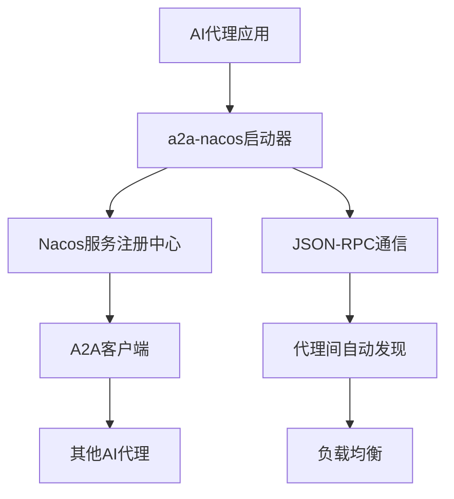
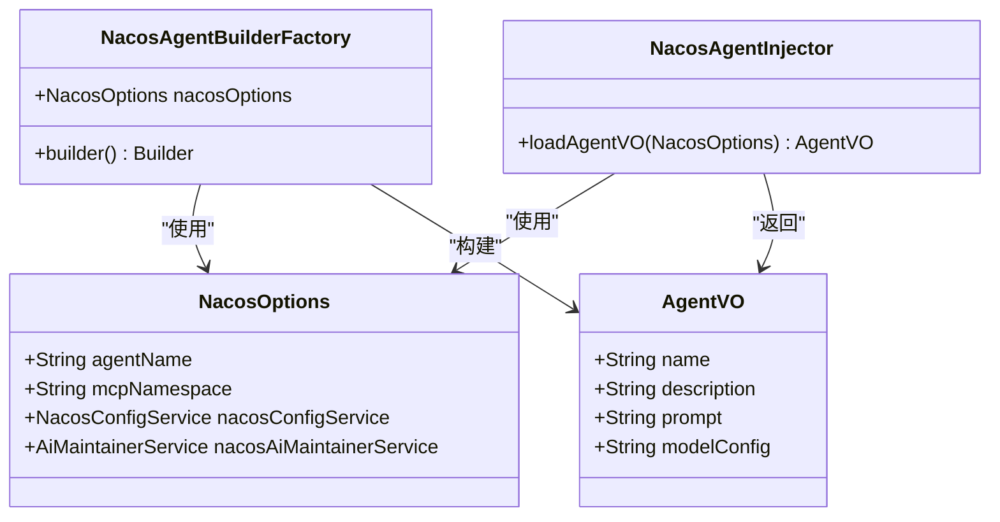
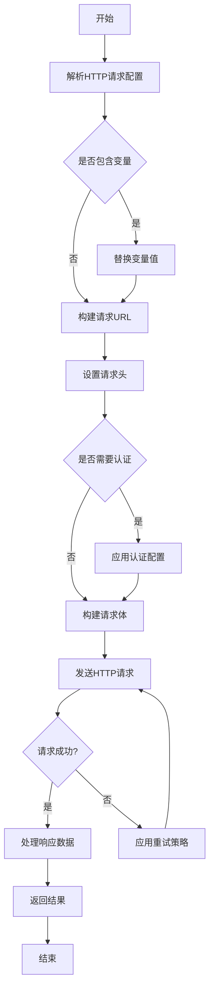

# Spring Boot启动器

<cite>
**本文档引用的文件**
- [spring-ai-alibaba-starter-a2a-nacos/pom.xml](file://spring-boot-starters/spring-ai-alibaba-starter-a2a-nacos/pom.xml)
- [spring-ai-alibaba-starter-a2a-nacos/README.md](file://spring-boot-starters/spring-ai-alibaba-starter-a2a-nacos/README.md)
- [spring-ai-alibaba-starter-a2a-nacos/src/main/resources/META-INF/additional-spring-configuration-metadata.json](file://spring-boot-starters/spring-ai-alibaba-starter-a2a-nacos/src/main/resources/META-INF/additional-spring-configuration-metadata.json)
- [spring-ai-alibaba-starter-a2a-nacos/src/main/java/com/alibaba/cloud/ai/a2a/autoconfigure/A2aServerProperties.java](file://spring-boot-starters/spring-ai-alibaba-starter-a2a-nacos/src/main/java/com/alibaba/cloud/ai/a2a/autoconfigure/A2aServerProperties.java)
- [spring-ai-alibaba-starter-a2a-nacos/src/main/java/com/alibaba/cloud/ai/a2a/autoconfigure/A2aServerAgentCardProperties.java](file://spring-boot-starters/spring-ai-alibaba-starter-a2a-nacos/src/main/java/com/alibaba/cloud/ai/a2a/autoconfigure/A2aServerAgentCardProperties.java)
- [spring-ai-alibaba-starter-a2a-nacos/src/main/java/com/alibaba/cloud/ai/a2a/autoconfigure/nacos/NacosA2aRegistryAutoConfiguration.java](file://spring-boot-starters/spring-ai-alibaba-starter-a2a-nacos/src/main/java/com/alibaba/cloud/ai/a2a/autoconfigure/nacos/NacosA2aRegistryAutoConfiguration.java)
- [spring-ai-alibaba-starter-a2a-nacos/src/main/java/com/alibaba/cloud/ai/a2a/autoconfigure/nacos/NacosA2aDiscoveryAutoConfiguration.java](file://spring-boot-starters/spring-ai-alibaba-starter-a2a-nacos/src/main/java/com/alibaba/cloud/ai/a2a/autoconfigure/nacos/NacosA2aDiscoveryAutoConfiguration.java)
- [spring-ai-alibaba-starter-config-nacos/pom.xml](file://spring-boot-starters/spring-ai-alibaba-starter-config-nacos/pom.xml)
- [spring-ai-alibaba-starter-config-nacos/README.md](file://spring-boot-starters/spring-ai-alibaba-starter-config-nacos/README.md)
- [spring-ai-alibaba-starter-config-nacos/src/main/resources/META-INF/spring/org.springframework.boot.autoconfigure.AutoConfiguration.imports](file://spring-boot-starters/spring-ai-alibaba-starter-config-nacos/src/main/resources/META-INF/spring/org.springframework.boot.autoconfigure.AutoConfiguration.imports)
- [spring-ai-alibaba-starter-config-nacos/src/main/java/com/alibaba/cloud/ai/agent/nacos/NacosAgentBuilderFactory.java](file://spring-boot-starters/spring-ai-alibaba-starter-config-nacos/src/main/java/com/alibaba/cloud/ai/agent/nacos/NacosAgentBuilderFactory.java)
- [spring-ai-alibaba-starter-config-nacos/src/main/java/com/alibaba/cloud/ai/agent/nacos/NacosAgentInjector.java](file://spring-boot-starters/spring-ai-alibaba-starter-config-nacos/src/main/java/com/alibaba/cloud/ai/agent/nacos/NacosAgentInjector.java)
- [spring-ai-alibaba-starter-config-nacos/src/main/java/com/alibaba/cloud/ai/agent/nacos/NacosOptions.java](file://spring-boot-starters/spring-ai-alibaba-starter-config-nacos/src/main/java/com/alibaba/cloud/ai/agent/nacos/NacosOptions.java)
- [spring-ai-alibaba-starter-builtin-nodes/pom.xml](file://spring-boot-starters/spring-ai-alibaba-starter-builtin-nodes/pom.xml)
- [spring-ai-alibaba-starter-builtin-nodes/src/main/java/com/alibaba/cloud/ai/graph/node/HttpNode.java](file://spring-boot-starters/spring-ai-alibaba-starter-builtin-nodes/src/main/java/com/alibaba/cloud/ai/graph/node/HttpNode.java)
</cite>

## 目录
1. [简介](#简介)
2. [a2a-nacos启动器](#a2a-nacos启动器)
3. [config-nacos启动器](#config-nacos启动器)
4. [builtin-nodes启动器](#builtin-nodes启动器)
5. [配置属性参考](#配置属性参考)
6. [最佳实践](#最佳实践)

## 简介
Spring Boot启动器为spring-ai-alibaba框架提供了"开箱即用"的集成体验，极大地简化了AI代理的开发和部署过程。这些启动器通过自动配置和依赖管理，使开发者能够快速构建、部署和管理AI代理系统。本文档重点介绍三个核心启动器：a2a-nacos、config-nacos和builtin-nodes，它们分别解决了代理间通信、配置管理和内置功能节点等关键问题。

## a2a-nacos启动器

a2a-nacos启动器为spring-ai-alibaba框架提供了基于Nacos的服务发现和代理间通信（A2A）能力。该启动器允许开发者将AI代理快速部署为A2A服务器，并通过Nacos实现分布式部署、服务注册和自动发现。

该启动器集成了Nacos，实现了A2A服务器的分布式部署和注册，以及A2A客户端的自动发现和负载均衡。通过JSON-RPC协议，代理之间可以进行高效通信，实现了真正的代理到代理（Agent-to-Agent）交互模式。

**图示来源**
- [spring-ai-alibaba-starter-a2a-nacos/README.md](file://spring-boot-starters/spring-ai-alibaba-starter-a2a-nacos/README.md)
- [spring-ai-alibaba-starter-a2a-nacos/pom.xml](file://spring-boot-starters/spring-ai-alibaba-starter-a2a-nacos/pom.xml)

**章节来源**
- [spring-ai-alibaba-starter-a2a-nacos/README.md](file://spring-boot-starters/spring-ai-alibaba-starter-a2a-nacos/README.md)
- [spring-ai-alibaba-starter-a2a-nacos/pom.xml](file://spring-boot-starters/spring-ai-alibaba-starter-a2a-nacos/pom.xml)

## config-nacos启动器

config-nacos启动器为spring-ai-alibaba框架提供了基于Nacos配置中心的动态配置管理能力。该启动器允许开发者无需编写代码即可构建AI代理，通过YAML格式的配置文件描述代理行为。

该启动器从Nacos配置中心动态加载代理配置、提示词（Prompt）和模型参数，实现了配置的集中化管理。通过`NacosAgentBuilderFactory`和`NacosAgentInjector`等核心组件，启动器能够从Nacos获取配置并构建相应的代理实例。

**图示来源**
- [spring-ai-alibaba-starter-config-nacos/src/main/java/com/alibaba/cloud/ai/agent/nacos/NacosAgentBuilderFactory.java](file://spring-boot-starters/spring-ai-alibaba-starter-config-nacos/src/main/java/com/alibaba/cloud/ai/agent/nacos/NacosAgentBuilderFactory.java)
- [spring-ai-alibaba-starter-config-nacos/src/main/java/com/alibaba/cloud/ai/agent/nacos/NacosAgentInjector.java](file://spring-boot-starters/spring-ai-alibaba-starter-config-nacos/src/main/java/com/alibaba/cloud/ai/agent/nacos/NacosAgentInjector.java)
- [spring-ai-alibaba-starter-config-nacos/src/main/java/com/alibaba/cloud/ai/agent/nacos/NacosOptions.java](file://spring-boot-starters/spring-ai-alibaba-starter-config-nacos/src/main/java/com/alibaba/cloud/ai/agent/nacos/NacosOptions.java)

**章节来源**
- [spring-ai-alibaba-starter-config-nacos/README.md](file://spring-boot-starters/spring-ai-alibaba-starter-config-nacos/README.md)
- [spring-ai-alibaba-starter-config-nacos/src/main/java/com/alibaba/cloud/ai/agent/nacos/NacosAgentBuilderFactory.java](file://spring-boot-starters/spring-ai-alibaba-starter-config-nacos/src/main/java/com/alibaba/cloud/ai/agent/nacos/NacosAgentBuilderFactory.java)
- [spring-ai-alibaba-starter-config-nacos/src/main/java/com/alibaba/cloud/ai/agent/nacos/NacosAgentInjector.java](file://spring-boot-starters/spring-ai-alibaba-starter-config-nacos/src/main/java/com/alibaba/cloud/ai/agent/nacos/NacosAgentInjector.java)

## builtin-nodes启动器

builtin-nodes启动器为spring-ai-alibaba框架提供了丰富的内置节点功能，包括HTTP调用节点和代码执行节点等。这些内置节点简化了常见任务的实现，使开发者能够快速构建复杂的AI代理工作流。

### HttpNode分析
HttpNode是builtin-nodes启动器提供的核心功能之一，它允许AI代理执行HTTP请求并与外部API进行交互。该节点支持多种HTTP方法、请求头、查询参数和请求体类型，包括RAW_TEXT、JSON、X_WWW_FORM_URLENCODED、FORM_DATA和BINARY。

**图示来源**
- [spring-ai-alibaba-starter-builtin-nodes/src/main/java/com/alibaba/cloud/ai/graph/node/HttpNode.java](file://spring-boot-starters/spring-ai-alibaba-starter-builtin-nodes/src/main/java/com/alibaba/cloud/ai/graph/node/HttpNode.java)

**章节来源**
- [spring-ai-alibaba-starter-builtin-nodes/pom.xml](file://spring-boot-starters/spring-ai-alibaba-starter-builtin-nodes/pom.xml)
- [spring-ai-alibaba-starter-builtin-nodes/src/main/java/com/alibaba/cloud/ai/graph/node/HttpNode.java](file://spring-boot-starters/spring-ai-alibaba-starter-builtin-nodes/src/main/java/com/alibaba/cloud/ai/graph/node/HttpNode.java)

## 配置属性参考

### a2a-nacos启动器配置属性
以下表格列出了a2a-nacos启动器的主要配置属性：

| 配置属性 | 类型 | 描述 | 默认值 |
|---------|------|------|-------|
| spring.ai.alibaba.a2a.nacos.server-addr | String | Nacos服务器地址 | localhost:8848 |
| spring.ai.alibaba.a2a.nacos.namespace | String | Nacos命名空间 | public |
| spring.ai.alibaba.a2a.nacos.username | String | Nacos用户名 | "" |
| spring.ai.alibaba.a2a.nacos.password | String | Nacos密码 | "" |
| spring.ai.alibaba.a2a.nacos.access-key | String | Nacos访问密钥 | "" |
| spring.ai.alibaba.a2a.nacos.secret-key | String | Nacos密钥 | "" |
| spring.ai.alibaba.a2a.nacos.registry.enabled | Boolean | 是否启用Nacos自动注册 | true |
| spring.ai.alibaba.a2a.nacos.discovery.enabled | Boolean | 是否启用Nacos自动发现 | true |
| spring.ai.alibaba.a2a.server.type | String | A2A服务器类型 | JSONRPC |
| spring.ai.alibaba.a2a.server.port | Integer | A2A服务器端口 | ${server.port} |

**章节来源**
- [spring-ai-alibaba-starter-a2a-nacos/src/main/resources/META-INF/additional-spring-configuration-metadata.json](file://spring-boot-starters/spring-ai-alibaba-starter-a2a-nacos/src/main/resources/META-INF/additional-spring-configuration-metadata.json)

### config-nacos启动器配置属性
config-nacos启动器通过NacosOptions类管理配置，主要属性包括：

- **agentName**: 代理名称
- **mcpNamespace**: MCP命名空间
- **nacosConfigService**: Nacos配置服务实例
- **nacosAiMaintainerService**: Nacos AI维护服务实例
- **encrypted**: 是否启用加密
- **modelEncrypted**: 模型配置是否加密
- **promptEncrypted**: 提示词是否加密
- **agentBaseEncrypted**: 代理基础配置是否加密
- **mcpServersEncrypted**: MCP服务器配置是否加密

**章节来源**
- [spring-ai-alibaba-starter-config-nacos/src/main/java/com/alibaba/cloud/ai/agent/nacos/NacosOptions.java](file://spring-boot-starters/spring-ai-alibaba-starter-config-nacos/src/main/java/com/alibaba/cloud/ai/agent/nacos/NacosOptions.java)

## 最佳实践

### a2a-nacos启动器使用最佳实践
1. **服务注册与发现**: 确保所有AI代理都配置了相同的Nacos服务器地址和命名空间，以便实现自动发现。
2. **安全配置**: 在生产环境中，务必配置Nacos的用户名、密码或访问密钥，以确保服务注册的安全性。
3. **版本管理**: 利用Nacos的版本管理功能，可以注册代理的多个版本，并通过客户端进行版本选择。
4. **健康检查**: 配置合理的健康检查机制，确保故障代理能够被及时发现和隔离。

### config-nacos启动器使用最佳实践
1. **配置集中化**: 将所有代理的配置集中存储在Nacos中，便于统一管理和维护。
2. **动态更新**: 利用Nacos的配置监听功能，实现代理配置的动态更新，无需重启应用。
3. **环境隔离**: 为不同环境（开发、测试、生产）使用不同的Nacos命名空间，避免配置冲突。
4. **加密保护**: 对敏感配置（如API密钥、数据库密码）启用加密保护，提高安全性。

### builtin-nodes启动器使用最佳实践
1. **HTTP节点使用**: 在使用HttpNode时，合理配置重试策略和超时时间，以应对网络不稳定的情况。
2. **变量替换**: 充分利用变量替换功能，使HTTP请求能够动态适应不同的上下文。
3. **错误处理**: 为HTTP请求配置适当的错误处理机制，确保代理在外部服务不可用时能够优雅降级。
4. **性能监控**: 对频繁调用的HTTP节点进行性能监控，及时发现和解决性能瓶颈。

**章节来源**
- [spring-ai-alibaba-starter-a2a-nacos/README.md](file://spring-boot-starters/spring-ai-alibaba-starter-a2a-nacos/README.md)
- [spring-ai-alibaba-starter-config-nacos/README.md](file://spring-boot-starters/spring-ai-alibaba-starter-config-nacos/README.md)
- [spring-ai-alibaba-starter-builtin-nodes/src/main/java/com/alibaba/cloud/ai/graph/node/HttpNode.java](file://spring-boot-starters/spring-ai-alibaba-starter-builtin-nodes/src/main/java/com/alibaba/cloud/ai/graph/node/HttpNode.java)