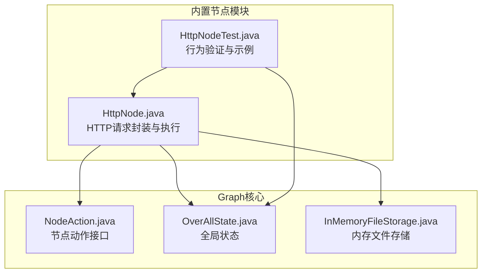
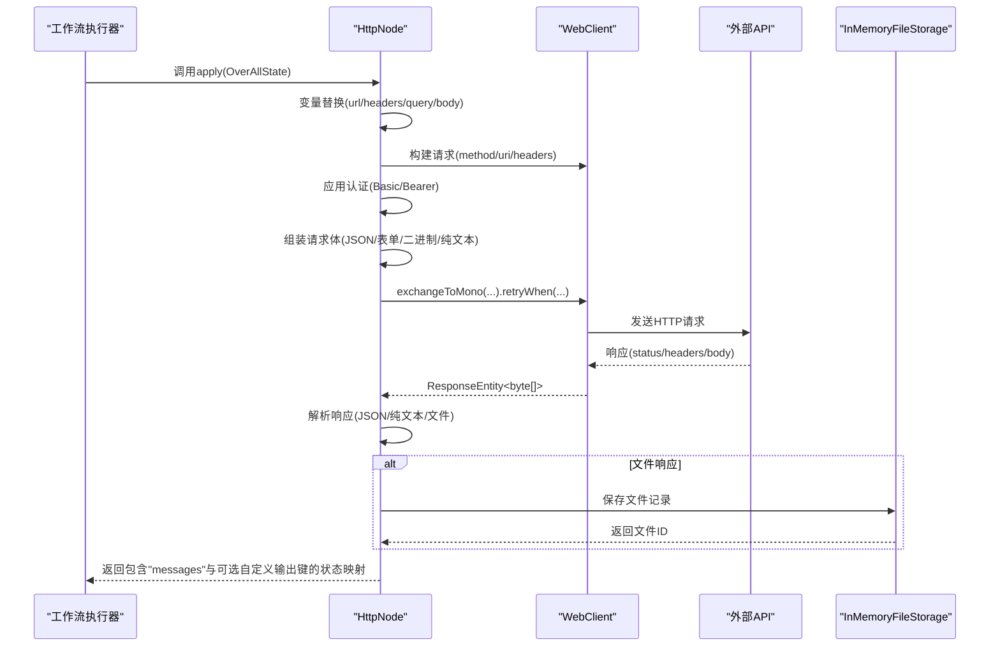
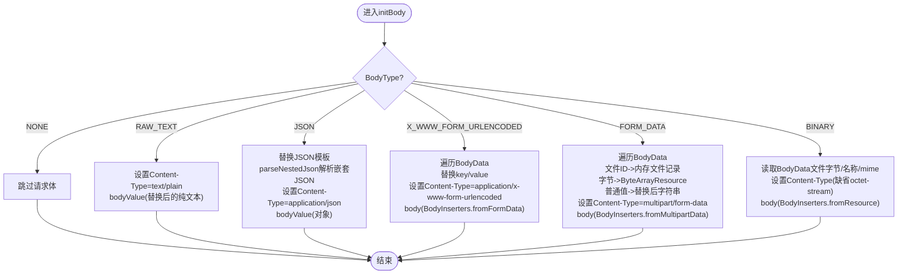
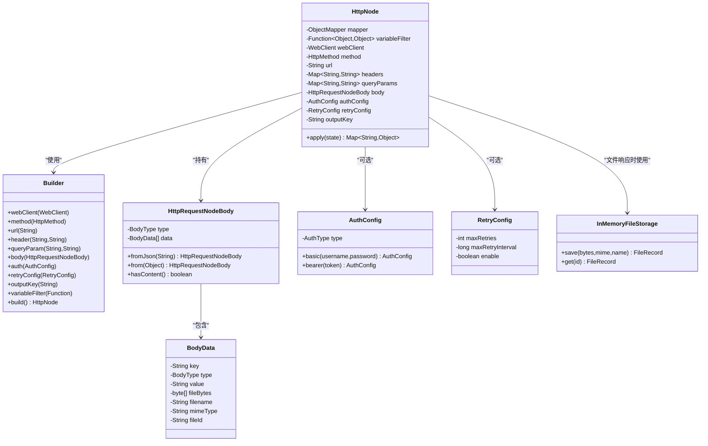

# HTTP节点

<cite>
**本文引用的文件**
- [HttpNode.java](file://spring-boot-starters/spring-ai-alibaba-starter-builtin-nodes/src/main/java/com/alibaba/cloud/ai/graph/node/HttpNode.java)
- [HttpNodeTest.java](file://spring-boot-starters/spring-ai-alibaba-starter-builtin-nodes/src/test/java/com/alibaba/cloud/ai/graph/node/HttpNodeTest.java)
- [NodeAction.java](file://spring-ai-alibaba-graph-core/src/main/java/com/alibaba/cloud/ai/graph/action/NodeAction.java)
- [OverAllState.java](file://spring-ai-alibaba-graph-core/src/main/java/com/alibaba/cloud/ai/graph/OverAllState.java)
- [InMemoryFileStorage.java](file://spring-ai-alibaba-graph-core/src/main/java/com/alibaba/cloud/ai/graph/utils/InMemoryFileStorage.java)
</cite>

## 目录
1. [简介](#简介)
2. [项目结构](#项目结构)
3. [核心组件](#核心组件)
4. [架构总览](#架构总览)
5. [详细组件分析](#详细组件分析)
6. [依赖关系分析](#依赖关系分析)
7. [性能考量](#性能考量)
8. [故障排查指南](#故障排查指南)
9. [结论](#结论)
10. [附录](#附录)

## 简介
本篇文档聚焦于“HTTP节点”（HttpNode），系统性阐述其在工作流中的职责与实现机制，覆盖如下要点：
- 如何封装HTTP请求的构建、发送与响应处理全流程
- 配置参数与序列化策略：请求方法、URL模板、请求头、请求体类型（JSON、表单、二进制、纯文本、multipart）、认证方式、重试策略
- 在工作流中使用HttpNode调用外部API，如何处理状态码、响应头与响应体，并将结果合并回全局状态
- 动态变量注入与模板替换机制
- 错误处理策略与异常转换
- 与Spring WebClient的集成方式与性能优化建议

## 项目结构
HttpNode位于“内置节点”模块中，作为工作流的一个标准节点，遵循Graph框架的NodeAction接口规范，接收全局状态并返回更新后的状态映射。其测试用例展示了典型场景：GET/POST、变量替换、JSON/表单/纯文本、文件下载、Basic/Bearer认证、网络重试等。

图表来源
- [HttpNode.java](file://spring-boot-starters/spring-ai-alibaba-starter-builtin-nodes/src/main/java/com/alibaba/cloud/ai/graph/node/HttpNode.java#L64-L120)
- [HttpNodeTest.java](file://spring-boot-starters/spring-ai-alibaba-starter-builtin-nodes/src/test/java/com/alibaba/cloud/ai/graph/node/HttpNodeTest.java#L74-L123)
- [NodeAction.java](file://spring-ai-alibaba-graph-core/src/main/java/com/alibaba/cloud/ai/graph/action/NodeAction.java#L18-L27)
- [OverAllState.java](file://spring-ai-alibaba-graph-core/src/main/java/com/alibaba/cloud/ai/graph/OverAllState.java)
- [InMemoryFileStorage.java](file://spring-ai-alibaba-graph-core/src/main/java/com/alibaba/cloud/ai/graph/utils/InMemoryFileStorage.java)

章节来源
- [HttpNode.java](file://spring-boot-starters/spring-ai-alibaba-starter-builtin-nodes/src/main/java/com/alibaba/cloud/ai/graph/node/HttpNode.java#L64-L120)
- [HttpNodeTest.java](file://spring-boot-starters/spring-ai-alibaba-starter-builtin-nodes/src/test/java/com/alibaba/cloud/ai/graph/node/HttpNodeTest.java#L74-L123)

## 核心组件
- HttpNode：实现NodeAction，负责构建WebClient请求、注入变量、发送请求、处理响应并写回状态
- Builder：链式配置入口，支持设置WebClient、方法、URL、头、查询参数、请求体、认证、重试、输出键、变量过滤器等
- HttpRequestNodeBody：请求体构造器，支持多种BodyType（NONE/RAW_TEXT/JSON/X_WWW_FORM_URLENCODED/FORM_DATA/BINARY）
- AuthConfig：认证配置（BASIC/BEARER）
- RetryConfig：重试配置（最大次数、间隔、开关）
- 内部工具：变量替换、JSON嵌套解析、文件响应识别与落盘

章节来源
- [HttpNode.java](file://spring-boot-starters/spring-ai-alibaba-starter-builtin-nodes/src/main/java/com/alibaba/cloud/ai/graph/node/HttpNode.java#L402-L496)
- [HttpNode.java](file://spring-boot-starters/spring-ai-alibaba-starter-builtin-nodes/src/main/java/com/alibaba/cloud/ai/graph/node/HttpNode.java#L499-L911)

## 架构总览
HttpNode在工作流中的调用路径如下：Graph执行器调度NodeAction，HttpNode读取OverAllState中的键值，进行变量替换与请求体组装，通过WebClient发送请求，根据响应类型（JSON/纯文本/文件）解析并写回状态；同时支持Basic/Bearer认证与Backoff重试。

图表来源
- [HttpNode.java](file://spring-boot-starters/spring-ai-alibaba-starter-builtin-nodes/src/main/java/com/alibaba/cloud/ai/graph/node/HttpNode.java#L127-L166)
- [HttpNode.java](file://spring-boot-starters/spring-ai-alibaba-starter-builtin-nodes/src/main/java/com/alibaba/cloud/ai/graph/node/HttpNode.java#L138-L148)
- [HttpNode.java](file://spring-boot-starters/spring-ai-alibaba-starter-builtin-nodes/src/main/java/com/alibaba/cloud/ai/graph/node/HttpNode.java#L318-L359)
- [HttpNode.java](file://spring-boot-starters/spring-ai-alibaba-starter-builtin-nodes/src/main/java/com/alibaba/cloud/ai/graph/node/HttpNode.java#L339-L359)
- [InMemoryFileStorage.java](file://spring-ai-alibaba-graph-core/src/main/java/com/alibaba/cloud/ai/graph/utils/InMemoryFileStorage.java)

## 详细组件分析

### HttpNode类与生命周期
- 接口实现：实现NodeAction，apply方法是执行入口
- 关键字段：WebClient实例、HTTP方法、URL模板、请求头、查询参数、请求体、认证配置、重试配置、输出键、ObjectMapper、变量过滤器
- 执行流程：
  - 变量替换：对URL、headers、query、body中的占位符进行替换
  - 构建URI与请求：使用UriComponentsBuilder拼接查询参数，设置请求头
  - 认证：根据AuthConfig设置Basic或Bearer
  - 请求体：根据BodyType选择对应序列化策略
  - 发送与重试：exchangeToMono后使用Backoff重试
  - 响应处理：根据Content-Disposition与Content-Type判断文件/文本/JSON，写入messages与可选输出键

章节来源
- [HttpNode.java](file://spring-boot-starters/spring-ai-alibaba-starter-builtin-nodes/src/main/java/com/alibaba/cloud/ai/graph/node/HttpNode.java#L127-L166)
- [HttpNode.java](file://spring-boot-starters/spring-ai-alibaba-starter-builtin-nodes/src/main/java/com/alibaba/cloud/ai/graph/node/HttpNode.java#L138-L148)
- [HttpNode.java](file://spring-boot-starters/spring-ai-alibaba-starter-builtin-nodes/src/main/java/com/alibaba/cloud/ai/graph/node/HttpNode.java#L318-L359)

### 请求体与序列化策略
- BodyType枚举：NONE/RAW_TEXT/JSON/X_WWW_FORM_URLENCODED/FORM_DATA/BINARY
- JSON：支持嵌套字符串的二次解析，保留非JSON字符串原样
- 表单：支持application/x-www-form-urlencoded与multipart/form-data两种
- 二进制：支持直接发送字节数组或指定媒体类型
- 纯文本：设置Content-Type为text/plain
- 文件上传：支持从内存文件记录或字节数组上传

图表来源
- [HttpNode.java](file://spring-boot-starters/spring-ai-alibaba-starter-builtin-nodes/src/main/java/com/alibaba/cloud/ai/graph/node/HttpNode.java#L187-L282)
- [HttpNode.java](file://spring-boot-starters/spring-ai-alibaba-starter-builtin-nodes/src/main/java/com/alibaba/cloud/ai/graph/node/HttpNode.java#L284-L316)

章节来源
- [HttpNode.java](file://spring-boot-starters/spring-ai-alibaba-starter-builtin-nodes/src/main/java/com/alibaba/cloud/ai/graph/node/HttpNode.java#L187-L282)
- [HttpNode.java](file://spring-boot-starters/spring-ai-alibaba-starter-builtin-nodes/src/main/java/com/alibaba/cloud/ai/graph/node/HttpNode.java#L284-L316)

### 变量替换与模板
- 占位符语法：${key}
- 替换范围：URL、请求头、查询参数、请求体各字段
- 默认过滤器：对JSON模板字符串进行清理，便于安全地内嵌JSON
- 自定义过滤器：可通过Builder.variableFilter注入

章节来源
- [HttpNode.java](file://spring-boot-starters/spring-ai-alibaba-starter-builtin-nodes/src/main/java/com/alibaba/cloud/ai/graph/node/HttpNode.java#L68-L90)
- [HttpNode.java](file://spring-boot-starters/spring-ai-alibaba-starter-builtin-nodes/src/main/java/com/alibaba/cloud/ai/graph/node/HttpNode.java#L168-L179)
- [HttpNode.java](file://spring-boot-starters/spring-ai-alibaba-starter-builtin-nodes/src/main/java/com/alibaba/cloud/ai/graph/node/HttpNode.java#L181-L185)
- [HttpNode.java](file://spring-boot-starters/spring-ai-alibaba-starter-builtin-nodes/src/main/java/com/alibaba/cloud/ai/graph/node/HttpNode.java#L480-L491)

### 认证与安全
- Basic认证：设置Authorization: Basic base64(user:pass)
- Bearer令牌：设置Authorization: Bearer token
- 通过AuthConfig配置

章节来源
- [HttpNode.java](file://spring-boot-starters/spring-ai-alibaba-starter-builtin-nodes/src/main/java/com/alibaba/cloud/ai/graph/node/HttpNode.java#L318-L329)
- [HttpNode.java](file://spring-boot-starters/spring-ai-alibaba-starter-builtin-nodes/src/main/java/com/alibaba/cloud/ai/graph/node/HttpNode.java#L725-L786)

### 响应处理与状态写回
- 响应结构：包含status、headers、body或files
- 文件响应识别：依据Content-Disposition与Content-Type判定，若为文件则保存至InMemoryFileStorage并返回文件ID列表
- 非文件响应：优先尝试JSON解析，失败则作为纯文本返回
- 输出键：可通过Builder.outputKey设置，将响应写入自定义键名

章节来源
- [HttpNode.java](file://spring-boot-starters/spring-ai-alibaba-starter-builtin-nodes/src/main/java/com/alibaba/cloud/ai/graph/node/HttpNode.java#L331-L359)
- [HttpNode.java](file://spring-boot-starters/spring-ai-alibaba-starter-builtin-nodes/src/main/java/com/alibaba/cloud/ai/graph/node/HttpNode.java#L362-L400)
- [HttpNode.java](file://spring-boot-starters/spring-ai-alibaba-starter-builtin-nodes/src/main/java/com/alibaba/cloud/ai/graph/node/HttpNode.java#L149-L156)
- [InMemoryFileStorage.java](file://spring-ai-alibaba-graph-core/src/main/java/com/alibaba/cloud/ai/graph/utils/InMemoryFileStorage.java)

### 重试机制与异常转换
- 重试策略：基于Backoff的指数退避，可配置最大重试次数与间隔
- 异常转换：WebClientResponseException与RestClientException统一转为GraphRunnerException并中断节点执行
- 测试验证：网络断连场景下的重试成功

章节来源
- [HttpNode.java](file://spring-boot-starters/spring-ai-alibaba-starter-builtin-nodes/src/main/java/com/alibaba/cloud/ai/graph/node/HttpNode.java#L145-L148)
- [HttpNode.java](file://spring-boot-starters/spring-ai-alibaba-starter-builtin-nodes/src/main/java/com/alibaba/cloud/ai/graph/node/HttpNode.java#L158-L166)
- [HttpNodeTest.java](file://spring-boot-starters/spring-ai-alibaba-starter-builtin-nodes/src/test/java/com/alibaba/cloud/ai/graph/node/HttpNodeTest.java#L264-L282)

### 与Spring WebClient的集成
- WebClient实例：可通过Builder.webClient注入；默认使用WebClient.create()
- 请求发送：使用exchangeToMono获取字节数组响应，再统一解析
- 重试：使用retryWhen与Backoff策略
- 适配：与Spring WebFlux的WebClient集成，支持响应式与阻塞模式结合

章节来源
- [HttpNode.java](file://spring-boot-starters/spring-ai-alibaba-starter-builtin-nodes/src/main/java/com/alibaba/cloud/ai/graph/node/HttpNode.java#L406-L438)
- [HttpNode.java](file://spring-boot-starters/spring-ai-alibaba-starter-builtin-nodes/src/main/java/com/alibaba/cloud/ai/graph/node/HttpNode.java#L138-L148)

## 依赖关系分析
- 与Graph核心的耦合：实现NodeAction接口，接收OverAllState并返回Map<String,Object>
- 与WebClient的耦合：通过WebClient构建请求、发送与重试
- 与文件存储的耦合：文件响应时写入InMemoryFileStorage
- 与Jackson的耦合：用于JSON解析与嵌套JSON处理

图表来源
- [HttpNode.java](file://spring-boot-starters/spring-ai-alibaba-starter-builtin-nodes/src/main/java/com/alibaba/cloud/ai/graph/node/HttpNode.java#L406-L496)
- [HttpNode.java](file://spring-boot-starters/spring-ai-alibaba-starter-builtin-nodes/src/main/java/com/alibaba/cloud/ai/graph/node/HttpNode.java#L499-L911)

章节来源
- [HttpNode.java](file://spring-boot-starters/spring-ai-alibaba-starter-builtin-nodes/src/main/java/com/alibaba/cloud/ai/graph/node/HttpNode.java#L406-L496)
- [HttpNode.java](file://spring-boot-starters/spring-ai-alibaba-starter-builtin-nodes/src/main/java/com/alibaba/cloud/ai/graph/node/HttpNode.java#L499-L911)

## 性能考量
- 重试策略：合理设置maxRetries与maxRetryInterval，避免过度重试导致延迟放大
- 响应解析：文件响应走InMemoryFileStorage，注意内存占用；非文件响应优先JSON解析，失败回退纯文本
- 请求体大小：multipart/form-data与binary可能较大，建议控制单次请求体大小
- 并发与线程：WebClient默认线程模型与工作流并发策略配合，避免阻塞
- 超时：当前源码未暴露TimeoutConfig的显式设置入口；如需细粒度超时控制，可在WebClient层面配置

[本节为通用指导，无需特定文件引用]

## 故障排查指南
- 4xx/5xx响应：仍会写入messages.status与body，便于上层节点处理
- JSON解析失败：请求体或响应体JSON不合法时，会回退为纯文本
- 文件下载：确认Content-Disposition与Content-Type是否符合预期
- 认证失败：检查Basic/Bearer配置是否正确
- 变量未替换：确认占位符${key}是否存在且在OverAllState中注册
- 重试无效：确认RetryConfig.enable为true且网络异常触发重试

章节来源
- [HttpNodeTest.java](file://spring-boot-starters/spring-ai-alibaba-starter-builtin-nodes/src/test/java/com/alibaba/cloud/ai/graph/node/HttpNodeTest.java#L190-L209)
- [HttpNodeTest.java](file://spring-boot-starters/spring-ai-alibaba-starter-builtin-nodes/src/test/java/com/alibaba/cloud/ai/graph/node/HttpNodeTest.java#L211-L239)
- [HttpNodeTest.java](file://spring-boot-starters/spring-ai-alibaba-starter-builtin-nodes/src/test/java/com/alibaba/cloud/ai/graph/node/HttpNodeTest.java#L241-L261)
- [HttpNodeTest.java](file://spring-boot-starters/spring-ai-alibaba-starter-builtin-nodes/src/test/java/com/alibaba/cloud/ai/graph/node/HttpNodeTest.java#L100-L123)
- [HttpNodeTest.java](file://spring-boot-starters/spring-ai-alibaba-starter-builtin-nodes/src/test/java/com/alibaba/cloud/ai/graph/node/HttpNodeTest.java#L264-L282)

## 结论
HttpNode提供了在工作流中调用外部API的一站式能力：灵活的请求体序列化、丰富的认证方式、完善的响应处理与文件落盘、可配置的重试策略。通过变量替换与输出键，它能够无缝对接工作流状态，实现端到端的数据流转与错误处理。

[本节为总结，无需特定文件引用]

## 附录

### 配置参数与使用要点
- 请求方法：GET/POST/PUT/DELETE等（通过Builder.method设置）
- URL模板：支持${key}变量替换
- 请求头：通过Builder.header(name,value)批量设置
- 查询参数：通过Builder.queryParam(name,value)批量设置
- 请求体：
  - JSON：HttpRequestNodeBody.fromJson(...)或from(Object)
  - 表单：X_WWW_FORM_URLENCODED或FORM_DATA
  - 二进制：BINARY
  - 纯文本：RAW_TEXT
- 认证：AuthConfig.basic(...)或AuthConfig.bearer(...)
- 重试：RetryConfig(maxRetries,maxRetryInterval,enable)
- 输出键：Builder.outputKey("自定义键名")，将响应写入该键

章节来源
- [HttpNode.java](file://spring-boot-starters/spring-ai-alibaba-starter-builtin-nodes/src/main/java/com/alibaba/cloud/ai/graph/node/HttpNode.java#L435-L496)
- [HttpNode.java](file://spring-boot-starters/spring-ai-alibaba-starter-builtin-nodes/src/main/java/com/alibaba/cloud/ai/graph/node/HttpNode.java#L499-L723)
- [HttpNodeTest.java](file://spring-boot-starters/spring-ai-alibaba-starter-builtin-nodes/src/test/java/com/alibaba/cloud/ai/graph/node/HttpNodeTest.java#L284-L347)

### 在工作流中使用HttpNode的实践
- 将HttpNode作为节点加入StateGraph，使用node_async包装
- 在初始状态中注册必要的键（如${pathVar}/${headerVal}/${queryVal}/${name}等）
- 通过messages键读取HTTP响应，或通过自定义outputKey键获取
- 对于文件下载，从messages.files中读取文件ID，再通过InMemoryFileStorage获取内容

章节来源
- [HttpNodeTest.java](file://spring-boot-starters/spring-ai-alibaba-starter-builtin-nodes/src/test/java/com/alibaba/cloud/ai/graph/node/HttpNodeTest.java#L211-L239)
- [HttpNodeTest.java](file://spring-boot-starters/spring-ai-alibaba-starter-builtin-nodes/src/test/java/com/alibaba/cloud/ai/graph/node/HttpNodeTest.java#L100-L123)
- [HttpNodeTest.java](file://spring-boot-starters/spring-ai-alibaba-starter-builtin-nodes/src/test/java/com/alibaba/cloud/ai/graph/node/HttpNodeTest.java#L145-L172)