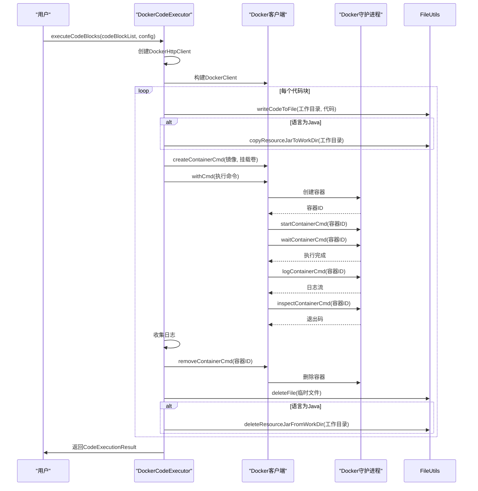
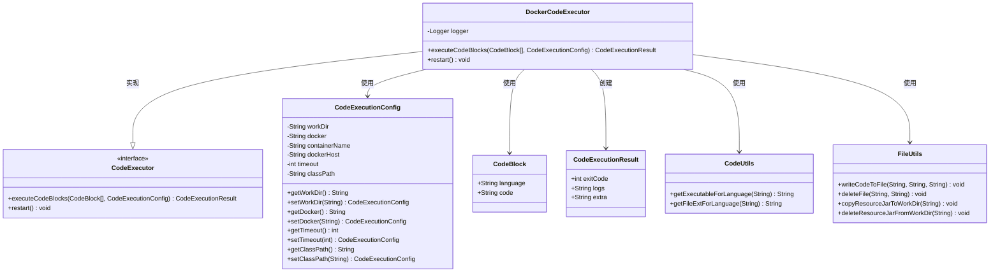
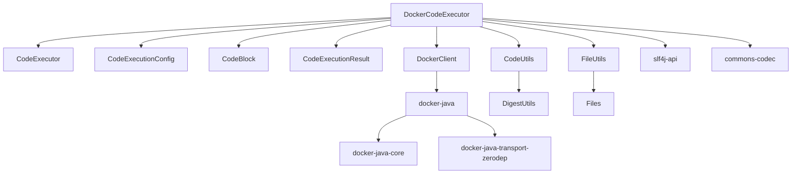

# Docker执行器

<cite>
**本文档引用的文件**  
- [DockerCodeExecutor.java](file://spring-boot-starters/spring-ai-alibaba-starter-builtin-nodes/src/main/java/com/alibaba/cloud/ai/graph/node/code/DockerCodeExecutor.java)
- [CodeExecutor.java](file://spring-boot-starters/spring-ai-alibaba-starter-builtin-nodes/src/main/java/com/alibaba/cloud/ai/graph/node/code/CodeExecutor.java)
- [CodeExecutionConfig.java](file://spring-boot-starters/spring-ai-alibaba-starter-builtin-nodes/src/main/java/com/alibaba/cloud/ai/graph/node/code/entity/CodeExecutionConfig.java)
- [CodeBlock.java](file://spring-boot-starters/spring-ai-alibaba-starter-builtin-nodes/src/main/java/com/alibaba/cloud/ai/graph/node/code/entity/CodeBlock.java)
- [CodeExecutionResult.java](file://spring-boot-starters/spring-ai-alibaba-starter-builtin-nodes/src/main/java/com/alibaba/cloud/ai/graph/node/code/entity/CodeExecutionResult.java)
- [CodeUtils.java](file://spring-boot-starters/spring-ai-alibaba-starter-builtin-nodes/src/main/java/com/alibaba/cloud/ai/graph/utils/CodeUtils.java)
- [FileUtils.java](file://spring-boot-starters/spring-ai-alibaba-starter-builtin-nodes/src/main/java/com/alibaba/cloud/ai/graph/utils/FileUtils.java)
- [DockerCodeExecutorTest.java](file://spring-boot-starters/spring-ai-alibaba-starter-builtin-nodes/src/test/java/com/alibaba/cloud/ai/graph/node/code/DockerCodeExecutorTest.java)
- [pom.xml](file://spring-boot-starters/spring-ai-alibaba-starter-builtin-nodes/pom.xml)
</cite>

## 目录
1. [简介](#简介)
2. [核心组件](#核心组件)
3. [架构概述](#架构概述)
4. [详细组件分析](#详细组件分析)
5. [依赖分析](#依赖分析)
6. [性能考虑](#性能考虑)
7. [故障排除指南](#故障排除指南)
8. [结论](#结论)

## 简介
DockerCodeExecutor 是 Spring AI Alibaba 框架中的一个关键组件，它利用 Docker 容器技术为代码执行提供了一个安全隔离的环境。该执行器通过与 Docker Daemon 通信，创建并管理容器实例来执行用户提供的代码块。它支持多种编程语言，包括 Python、Java、Shell 和 Node.js，并通过配置化的基础镜像确保执行环境的一致性。DockerCodeExecutor 实现了完整的容器生命周期管理，包括创建、启动、执行、停止和清理，同时提供了对资源限制（如 CPU 和内存）和网络配置的控制。其设计重点在于安全性，通过进程隔离和文件系统隔离防止对主机系统的潜在入侵。此外，该执行器还具备错误处理机制，能够捕获执行过程中的异常并返回详细的日志信息，确保了执行过程的可靠性和可追溯性。

## 核心组件

DockerCodeExecutor 的核心组件包括 `DockerCodeExecutor` 类、`CodeExecutor` 接口、`CodeExecutionConfig` 配置类、`CodeBlock` 代码块实体、`CodeExecutionResult` 执行结果实体以及辅助工具类 `CodeUtils` 和 `FileUtils`。`DockerCodeExecutor` 类实现了 `CodeExecutor` 接口，是执行代码的主要逻辑所在。`CodeExecutionConfig` 类用于配置执行环境，如指定 Docker 镜像、工作目录、超时时间等。`CodeBlock` 类封装了待执行的代码及其语言类型。`CodeExecutionResult` 类则用于返回执行结果，包括退出码和日志。`CodeUtils` 和 `FileUtils` 提供了处理代码文件和路径的实用方法。

**本节来源**
- [DockerCodeExecutor.java](file://spring-boot-starters/spring-ai-alibaba-starter-builtin-nodes/src/main/java/com/alibaba/cloud/ai/graph/node/code/DockerCodeExecutor.java#L55-L208)
- [CodeExecutor.java](file://spring-boot-starters/spring-ai-alibaba-starter-builtin-nodes/src/main/java/com/alibaba/cloud/ai/graph/node/code/CodeExecutor.java#L29-L49)
- [CodeExecutionConfig.java](file://spring-boot-starters/spring-ai-alibaba-starter-builtin-nodes/src/main/java/com/alibaba/cloud/ai/graph/node/code/entity/CodeExecutionConfig.java#L22-L135)
- [CodeBlock.java](file://spring-boot-starters/spring-ai-alibaba-starter-builtin-nodes/src/main/java/com/alibaba/cloud/ai/graph/node/code/entity/CodeBlock.java#L23-L24)
- [CodeExecutionResult.java](file://spring-boot-starters/spring-ai-alibaba-starter-builtin-nodes/src/main/java/com/alibaba/cloud/ai/graph/node/code/entity/CodeExecutionResult.java#L29-L34)
- [CodeUtils.java](file://spring-boot-starters/spring-ai-alibaba-starter-builtin-nodes/src/main/java/com/alibaba/cloud/ai/graph/utils/CodeUtils.java#L23-L45)
- [FileUtils.java](file://spring-boot-starters/spring-ai-alibaba-starter-builtin-nodes/src/main/java/com/alibaba/cloud/ai/graph/utils/FileUtils.java#L28-L132)

## 架构概述

DockerCodeExecutor 的架构基于客户端-服务器模式，通过 Docker Java 客户端库与本地或远程的 Docker Daemon 进行通信。其核心流程是：接收代码块和配置，创建 Docker 客户端，为每个代码块生成唯一的文件名并写入工作目录，然后创建并配置一个 Docker 容器，将主机的工作目录挂载到容器内的 `/workspace` 目录，启动容器执行代码，等待执行完成，获取日志和退出码，最后清理容器和临时文件。

**图表来源**  
- [DockerCodeExecutor.java](file://spring-boot-starters/spring-ai-alibaba-starter-builtin-nodes/src/main/java/com/alibaba/cloud/ai/graph/node/code/DockerCodeExecutor.java#L66-L176)
- [FileUtils.java](file://spring-boot-starters/spring-ai-alibaba-starter-builtin-nodes/src/main/java/com/alibaba/cloud/ai/graph/utils/FileUtils.java#L34-L66)

## 详细组件分析

### DockerCodeExecutor 分析
`DockerCodeExecutor` 类是 `CodeExecutor` 接口的具体实现，负责执行代码块。其主要方法 `executeCodeBlocks` 接收一个 `CodeBlock` 列表和一个 `CodeExecutionConfig` 配置对象。该方法首先根据配置创建一个 `DockerHttpClient`，然后使用它构建一个 `DockerClient`。对于列表中的每个代码块，它会生成一个基于代码内容 MD5 哈希的唯一文件名，以避免冲突，并将代码写入配置的工作目录。接着，它创建一个容器命令，指定基础镜像、容器名称、工作目录，并将主机的工作目录挂载到容器的 `/workspace` 目录。根据代码的语言，它会构建相应的执行命令，例如对于 Python 代码，命令为 `python filename.py`；对于 Java 代码，则会构建包含所有 JAR 文件的 classpath。容器启动后，执行器会等待其完成，并捕获标准输出和标准错误日志。最后，无论执行成功与否，都会强制删除容器并清理临时文件。

**图表来源**  
- [DockerCodeExecutor.java](file://spring-boot-starters/spring-ai-alibaba-starter-builtin-nodes/src/main/java/com/alibaba/cloud/ai/graph/node/code/DockerCodeExecutor.java#L55-L208)
- [CodeExecutor.java](file://spring-boot-starters/spring-ai-alibaba-starter-builtin-nodes/src/main/java/com/alibaba/cloud/ai/graph/node/code/CodeExecutor.java#L29-L49)
- [CodeExecutionConfig.java](file://spring-boot-starters/spring-ai-alibaba-starter-builtin-nodes/src/main/java/com/alibaba/cloud/ai/graph/node/code/entity/CodeExecutionConfig.java#L22-L135)
- [CodeBlock.java](file://spring-boot-starters/spring-ai-alibaba-starter-builtin-nodes/src/main/java/com/alibaba/cloud/ai/graph/node/code/entity/CodeBlock.java#L23-L24)
- [CodeExecutionResult.java](file://spring-boot-starters/spring-ai-alibaba-starter-builtin-nodes/src/main/java/com/alibaba/cloud/ai/graph/node/code/entity/CodeExecutionResult.java#L29-L34)
- [CodeUtils.java](file://spring-boot-starters/spring-ai-alibaba-starter-builtin-nodes/src/main/java/com/alibaba/cloud/ai/graph/utils/CodeUtils.java#L23-L45)
- [FileUtils.java](file://spring-boot-starters/spring-ai-alibaba-starter-builtin-nodes/src/main/java/com/alibaba/cloud/ai/graph/utils/FileUtils.java#L28-L132)

**本节来源**
- [DockerCodeExecutor.java](file://spring-boot-starters/spring-ai-alibaba-starter-builtin-nodes/src/main/java/com/alibaba/cloud/ai/graph/node/code/DockerCodeExecutor.java#L55-L208)

### 配置与实体分析
`CodeExecutionConfig` 类是配置的核心，它定义了代码执行所需的所有参数。`docker` 字段指定了用于创建容器的基础镜像，如 `python:3.10` 或 `openjdk:17`。`workDir` 指定了主机上的工作目录，该目录会被挂载到容器中。`timeout` 设置了容器执行的超时时间（秒），防止无限循环。`dockerHost` 允许连接到非默认的 Docker 守护进程，例如远程 Docker 主机。`classPath` 字段专门用于 Java 代码，允许指定额外的类路径。`CodeBlock` 是一个简单的记录类，仅包含 `language` 和 `code` 两个字段，用于封装待执行的代码片段。`CodeExecutionResult` 记录了执行的最终状态，`exitCode` 为 0 表示成功，非零表示失败，`logs` 字段包含了所有的输出和错误信息。

**本节来源**
- [CodeExecutionConfig.java](file://spring-boot-starters/spring-ai-alibaba-starter-builtin-nodes/src/main/java/com/alibaba/cloud/ai/graph/node/code/entity/CodeExecutionConfig.java#L22-L135)
- [CodeBlock.java](file://spring-boot-starters/spring-ai-alibaba-starter-builtin-nodes/src/main/java/com/alibaba/cloud/ai/graph/node/code/entity/CodeBlock.java#L23-L24)
- [CodeExecutionResult.java](file://spring-boot-starters/spring-ai-alibaba-starter-builtin-nodes/src/main/java/com/alibaba/cloud/ai/graph/node/code/entity/CodeExecutionResult.java#L29-L34)

## 依赖分析

DockerCodeExecutor 的依赖关系清晰，主要依赖于 Docker Java 客户端库来与 Docker 守护进程交互。其核心依赖包括 `docker-java`、`docker-java-core` 和 `docker-java-transport-zerodep`，这些库提供了创建、启动、停止和管理容器的 API。`commons-codec` 用于生成代码的 MD5 哈希值。`slf4j-api` 用于日志记录。在测试方面，它依赖于 `junit-jupiter` 和 `testcontainers` 来进行单元测试和集成测试。`DockerCodeExecutor` 类依赖于 `CodeUtils` 和 `FileUtils` 来处理文件操作和代码元数据，同时直接使用 `CodeExecutionConfig`、`CodeBlock` 和 `CodeExecutionResult` 进行数据的输入和输出。

**图表来源**  
- [pom.xml](file://spring-boot-starters/spring-ai-alibaba-starter-builtin-nodes/pom.xml#L165-L212)
- [DockerCodeExecutor.java](file://spring-boot-starters/spring-ai-alibaba-starter-builtin-nodes/src/main/java/com/alibaba/cloud/ai/graph/node/code/DockerCodeExecutor.java#L22-L36)

**本节来源**
- [pom.xml](file://spring-boot-starters/spring-ai-alibaba-starter-builtin-nodes/pom.xml#L165-L212)

## 性能考虑
DockerCodeExecutor 的性能开销主要来自于容器的创建和销毁过程。每次执行代码块都会创建一个新的容器，这比在宿主机上直接执行命令要慢得多。为了优化性能，可以考虑以下几点：首先，合理设置 `timeout` 参数，避免长时间运行的代码阻塞后续任务。其次，对于需要频繁执行的小型脚本，可以考虑实现一个容器池机制，复用容器实例，但这会增加实现的复杂性并可能影响隔离性。资源限制（CPU、内存）虽然在当前实现中未显式配置，但可以通过 `HostConfig` 在 `CreateContainerCmd` 中添加，以防止某个脚本耗尽系统资源。网络策略方面，默认情况下容器使用桥接网络，可以通过配置 `HostConfig` 来限制网络访问，例如使用 `--network none` 来完全禁用网络，增强安全性。

## 故障排除指南
当 DockerCodeExecutor 执行失败时，应首先检查 `CodeExecutionResult` 中的 `logs` 字段，它包含了容器的标准输出和标准错误，通常能直接定位问题。常见的错误包括：指定的 Docker 镜像不存在，此时需要确保镜像名称正确且已拉取；代码语法错误，这会在日志中显示具体的错误信息；依赖缺失，例如 Python 脚本中使用了未安装的包，需要在基础镜像中预装或通过其他方式提供依赖；权限问题，确保工作目录对执行进程可读写。如果日志中没有足够信息，可以检查应用自身的日志，`DockerCodeExecutor` 使用 SLF4J 记录了关键步骤。此外，确保 Docker 守护进程正在运行，并且 `dockerHost` 配置正确。测试用例 `DockerCodeExecutorTest` 提供了一个成功的执行示例，可以作为参考。

**本节来源**
- [DockerCodeExecutor.java](file://spring-boot-starters/spring-ai-alibaba-starter-builtin-nodes/src/main/java/com/alibaba/cloud/ai/graph/node/code/DockerCodeExecutor.java#L181-L184)
- [DockerCodeExecutorTest.java](file://spring-boot-starters/spring-ai-alibaba-starter-builtin-nodes/src/test/java/com/alibaba/cloud/ai/graph/node/code/DockerCodeExecutorTest.java#L38-L62)

## 结论
DockerCodeExecutor 是一个功能完整且设计安全的代码执行解决方案。它通过 Docker 容器技术，为动态代码执行提供了强大的隔离性，有效防止了对宿主机的潜在威胁。其架构清晰，依赖明确，通过 `CodeExecutionConfig` 提供了灵活的配置选项。虽然容器化带来了性能开销，但其在安全性和环境一致性方面的优势使其成为处理不可信代码的理想选择。未来可以通过引入容器复用或更精细的资源控制来进一步优化性能和安全性。该组件是 Spring AI Alibaba 框架中实现安全、可靠代码执行的关键基石。