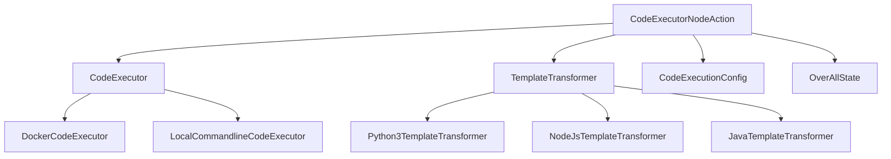
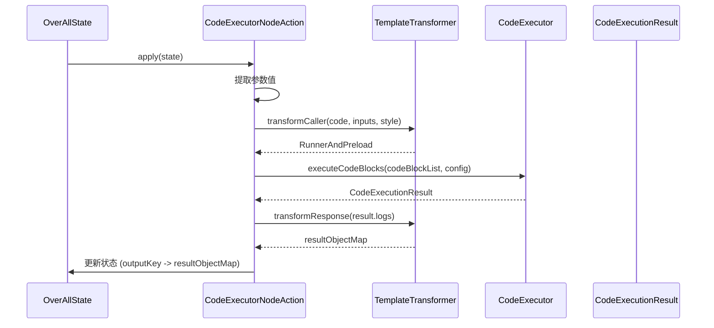
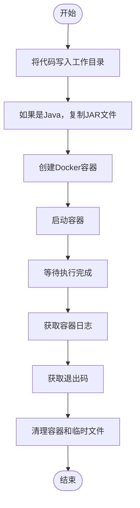
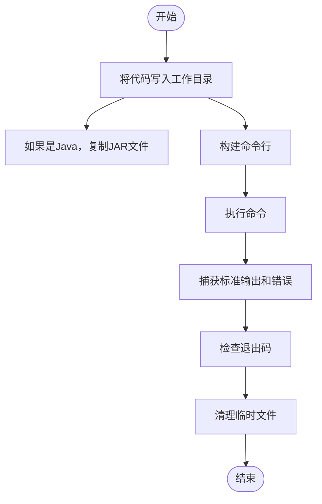
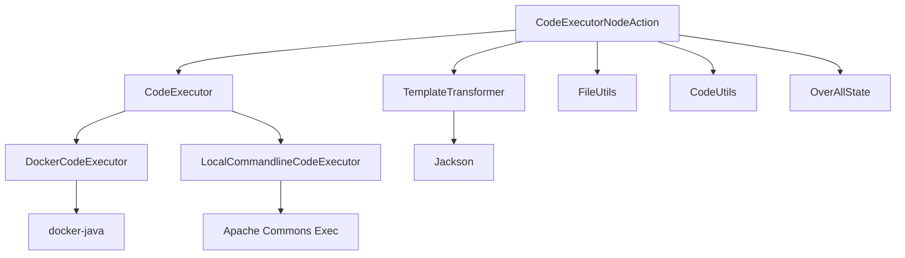

# 代码执行节点

<cite>
**本文档引用的文件**  
- [CodeExecutorNodeAction.java](file://spring-boot-starters/spring-ai-alibaba-starter-builtin-nodes/src/main/java/com/alibaba/cloud/ai/graph/node/code/CodeExecutorNodeAction.java)
- [DockerCodeExecutor.java](file://spring-boot-starters/spring-ai-alibaba-starter-builtin-nodes/src/main/java/com/alibaba/cloud/ai/graph/node/code/DockerCodeExecutor.java)
- [LocalCommandlineCodeExecutor.java](file://spring-boot-starters/spring-ai-alibaba-starter-builtin-nodes/src/main/java/com/alibaba/cloud/ai/graph/node/code/LocalCommandlineCodeExecutor.java)
- [CodeExecutionConfig.java](file://spring-boot-starters/spring-ai-alibaba-starter-builtin-nodes/src/main/java/com/alibaba/cloud/ai/graph/node/code/entity/CodeExecutionConfig.java)
- [CodeExecutionResult.java](file://spring-boot-starters/spring-ai-alibaba-starter-builtin-nodes/src/main/java/com/alibaba/cloud/ai/graph/node/code/entity/CodeExecutionResult.java)
- [TemplateTransformer.java](file://spring-boot-starters/spring-ai-alibaba-starter-builtin-nodes/src/main/java/com/alibaba/cloud/ai/graph/node/code/TemplateTransformer.java)
- [Python3TemplateTransformer.java](file://spring-boot-starters/spring-ai-alibaba-starter-builtin-nodes/src/main/java/com/alibaba/cloud/ai/graph/node/code/python3/Python3TemplateTransformer.java)
- [NodeJsTemplateTransformer.java](file://spring-boot-starters/spring-ai-alibaba-starter-builtin-nodes/src/main/java/com/alibaba/cloud/ai/graph/node/code/javascript/NodeJsTemplateTransformer.java)
- [JavaTemplateTransformer.java](file://spring-boot-starters/spring-ai-alibaba-starter-builtin-nodes/src/main/java/com/alibaba/cloud/ai/graph/node/code/java/JavaTemplateTransformer.java)
</cite>

## 目录
1. [简介](#简介)
2. [核心组件](#核心组件)
3. [架构概述](#架构概述)
4. [详细组件分析](#详细组件分析)
5. [依赖分析](#依赖分析)
6. [性能考虑](#性能考虑)
7. [故障排除指南](#故障排除指南)
8. [结论](#结论)

## 简介
代码执行节点是Spring AI Alibaba框架中的关键功能，允许在工作流中安全地执行动态代码。该系统通过`CodeExecutorNodeAction`实现，支持多种编程语言（如Python、JavaScript、Java），并提供两种执行器：`DockerCodeExecutor`和`LocalCommandlineCodeExecutor`。前者通过Docker容器提供强隔离的安全沙箱环境，后者则在本地命令行中执行代码，适用于开发和测试场景。系统通过模板转换机制注入输入参数并捕获输出结果，同时支持超时控制、资源限制和依赖管理，确保执行过程的安全性和可靠性。

## 核心组件
`CodeExecutorNodeAction`是代码执行的核心类，实现了`NodeAction`接口，负责协调代码执行流程。它通过`CodeExecutor`接口与具体的执行器（如`DockerCodeExecutor`或`LocalCommandlineCodeExecutor`）交互，利用`TemplateTransformer`系列类（如`Python3TemplateTransformer`、`NodeJsTemplateTransformer`）将用户代码包装成可执行的脚本。`CodeExecutionConfig`类用于配置执行环境，包括工作目录、超时时间、Docker镜像等。`CodeExecutionResult`记录执行结果，包括退出码、日志和额外信息。整个系统通过`CodeParam`定义输入参数，支持从全局状态中提取值，并通过`outputKey`将结果写回状态。

**本节来源**
- [CodeExecutorNodeAction.java](file://spring-boot-starters/spring-ai-alibaba-starter-builtin-nodes/src/main/java/com/alibaba/cloud/ai/graph/node/code/CodeExecutorNodeAction.java#L43-L122)
- [CodeExecutionConfig.java](file://spring-boot-starters/spring-ai-alibaba-starter-builtin-nodes/src/main/java/com/alibaba/cloud/ai/graph/node/code/entity/CodeExecutionConfig.java#L22-L135)
- [CodeExecutionResult.java](file://spring-boot-starters/spring-ai-alibaba-starter-builtin-nodes/src/main/java/com/alibaba/cloud/ai/graph/node/code/entity/CodeExecutionResult.java#L29-L34)

## 架构概述
代码执行节点采用分层架构，上层为`CodeExecutorNodeAction`，负责接收配置、准备输入并处理输出；中层为`CodeExecutor`接口及其实现，负责实际的代码执行；底层为`TemplateTransformer`体系，负责代码的包装和转换。当节点被调用时，`apply`方法首先从`OverAllState`中提取参数，然后通过`TemplateTransformer`生成包含输入参数的可执行脚本，再由`CodeExecutor`执行该脚本，最后解析输出并更新状态。两种执行器共享相同的接口，但实现方式不同：`DockerCodeExecutor`使用Docker API创建容器并运行代码，而`LocalCommandlineCodeExecutor`使用Apache Commons Exec在本地执行命令。

**图表来源**
- [CodeExecutorNodeAction.java](file://spring-boot-starters/spring-ai-alibaba-starter-builtin-nodes/src/main/java/com/alibaba/cloud/ai/graph/node/code/CodeExecutorNodeAction.java#L43-L122)
- [DockerCodeExecutor.java](file://spring-boot-starters/spring-ai-alibaba-starter-builtin-nodes/src/main/java/com/alibaba/cloud/ai/graph/node/code/DockerCodeExecutor.java#L55-L208)
- [LocalCommandlineCodeExecutor.java](file://spring-boot-starters/spring-ai-alibaba-starter-builtin-nodes/src/main/java/com/alibaba/cloud/ai/graph/node/code/LocalCommandlineCodeExecutor.java#L45-L174)

## 详细组件分析

### CodeExecutorNodeAction 分析
`CodeExecutorNodeAction`是代码执行的入口点，其`apply`方法实现了核心逻辑。首先，它从`params`中提取参数值，优先使用直接指定的`value`，否则从`OverAllState`中通过`stateKey`获取。然后，它调用`executeWorkflowCodeTemplate`方法，该方法使用`TemplateTransformer`将用户代码和输入参数组合成一个完整的可执行脚本。执行成功后，输出结果被解析为`Map<String, Object>`，并通过`outputKey`写入状态。`Builder`模式提供了流畅的API来配置执行器、语言、代码、样式、配置、参数和输出键。

**图表来源**
- [CodeExecutorNodeAction.java](file://spring-boot-starters/spring-ai-alibaba-starter-builtin-nodes/src/main/java/com/alibaba/cloud/ai/graph/node/code/CodeExecutorNodeAction.java#L108-L122)
- [TemplateTransformer.java](file://spring-boot-starters/spring-ai-alibaba-starter-builtin-nodes/src/main/java/com/alibaba/cloud/ai/graph/node/code/TemplateTransformer.java#L41-L46)

### DockerCodeExecutor 分析
`DockerCodeExecutor`通过Docker容器提供安全的代码执行环境。它使用`docker-java`库与Docker守护进程通信，创建一个临时容器来运行代码。执行流程包括：生成唯一文件名，将代码写入工作目录，创建容器并挂载工作目录，启动容器，等待执行完成，获取日志和退出码，最后清理容器和临时文件。对于Java代码，它会自动复制必要的JAR文件到工作目录，并在类路径中包含它们。该执行器支持配置Docker主机、连接超时、响应超时和最大连接数，确保在各种网络环境下稳定运行。

**图表来源**
- [DockerCodeExecutor.java](file://spring-boot-starters/spring-ai-alibaba-starter-builtin-nodes/src/main/java/com/alibaba/cloud/ai/graph/node/code/DockerCodeExecutor.java#L60-L180)
- [FileUtils.java](file://spring-boot-starters/spring-ai-alibaba-starter-builtin-nodes/src/main/java/com/alibaba/cloud/ai/graph/utils/FileUtils.java)

### LocalCommandlineCodeExecutor 分析
`LocalCommandlineCodeExecutor`在本地环境中执行代码，适用于不需要强隔离的场景。它使用Apache Commons Exec库来执行命令，通过`DefaultExecutor`管理进程的生命周期。执行流程与Docker版本类似：写入代码文件，执行命令，捕获输出，清理临时文件。它也支持Java的JAR文件处理，并使用`ExecuteWatchdog`来强制执行超时。与Docker执行器相比，它启动更快，但安全性较低，因为它直接在宿主系统上运行代码。

**图表来源**
- [LocalCommandlineCodeExecutor.java](file://spring-boot-starters/spring-ai-alibaba-starter-builtin-nodes/src/main/java/com/alibaba/cloud/ai/graph/node/code/LocalCommandlineCodeExecutor.java#L50-L67)
- [CodeUtils.java](file://spring-boot-starters/spring-ai-alibaba-starter-builtin-nodes/src/main/java/com/alibaba/cloud/ai/graph/utils/CodeUtils.java)

## 依赖分析
代码执行节点依赖于多个外部库和内部模块。`DockerCodeExecutor`依赖`docker-java`库与Docker守护进程通信，`LocalCommandlineCodeExecutor`依赖`Apache Commons Exec`来执行本地命令。`TemplateTransformer`体系依赖`Jackson`库进行JSON序列化和反序列化。内部依赖包括`FileUtils`用于文件操作，`CodeUtils`用于语言相关的工具方法。`CodeExecutorNodeAction`通过接口与执行器解耦，使得可以轻松替换或扩展执行策略。整个系统与Spring AI Alibaba的图执行框架集成，通过`OverAllState`与工作流的其他节点共享数据。

**图表来源**
- [DockerCodeExecutor.java](file://spring-boot-starters/spring-ai-alibaba-starter-builtin-nodes/src/main/java/com/alibaba/cloud/ai/graph/node/code/DockerCodeExecutor.java#L22-L37)
- [LocalCommandlineCodeExecutor.java](file://spring-boot-starters/spring-ai-alibaba-starter-builtin-nodes/src/main/java/com/alibaba/cloud/ai/graph/node/code/LocalCommandlineCodeExecutor.java#L24-L31)
- [TemplateTransformer.java](file://spring-boot-starters/spring-ai-alibaba-starter-builtin-nodes/src/main/java/com/alibaba/cloud/ai/graph/node/code/TemplateTransformer.java#L21-L25)

## 性能考虑
代码执行节点的性能受多种因素影响。`DockerCodeExecutor`由于需要创建和启动容器，启动时间较长，但提供了更好的资源隔离和安全性。`LocalCommandlineCodeExecutor`启动速度快，但可能受到宿主系统资源竞争的影响。为了优化性能，建议复用执行器实例，避免频繁创建和销毁。配置合理的超时时间可以防止长时间运行的代码阻塞工作流。对于大量数据的输入输出，应考虑序列化和反序列化的开销。此外，通过`CodeExecutionConfig`设置适当的工作目录和类路径，可以减少文件I/O和类加载时间。

## 故障排除指南
当代码执行失败时，首先检查`CodeExecutionResult`中的`exitCode`和`logs`。非零退出码表示代码执行失败，日志中通常包含详细的错误信息。对于`DockerCodeExecutor`，确保Docker守护进程正在运行，并且配置的`dockerHost`正确。对于`LocalCommandlineCodeExecutor`，检查执行环境是否安装了所需的解释器（如Python、Node.js、Java）。如果遇到类路径问题，确认`classPath`配置正确，并且所有依赖的JAR文件都已复制到工作目录。在调试时，可以临时将`timeout`设置得更长，并检查工作目录中的临时文件以验证代码是否正确生成。

**本节来源**
- [CodeExecutionResult.java](file://spring-boot-starters/spring-ai-alibaba-starter-builtin-nodes/src/main/java/com/alibaba/cloud/ai/graph/node/code/entity/CodeExecutionResult.java#L29-L34)
- [DockerCodeExecutor.java](file://spring-boot-starters/spring-ai-alibaba-starter-builtin-nodes/src/main/java/com/alibaba/cloud/ai/graph/node/code/DockerCodeExecutor.java#L181-L184)
- [LocalCommandlineCodeExecutor.java](file://spring-boot-starters/spring-ai-alibaba-starter-builtin-nodes/src/main/java/com/alibaba/cloud/ai/graph/node/code/LocalCommandlineCodeExecutor.java#L157-L164)

## 结论
代码执行节点是Spring AI Alibaba框架中一个强大而灵活的功能，它通过`CodeExecutorNodeAction`统一了代码执行的接口，并通过`DockerCodeExecutor`和`LocalCommandlineCodeExecutor`提供了两种不同的执行策略。系统通过`TemplateTransformer`机制安全地注入输入参数并捕获输出结果，支持多种编程语言和执行样式。通过合理的配置，可以在安全性和性能之间取得平衡，满足不同场景的需求。在使用时，应遵循安全最佳实践，如验证输入、限制资源使用和避免代码注入，以确保系统的稳定和安全。