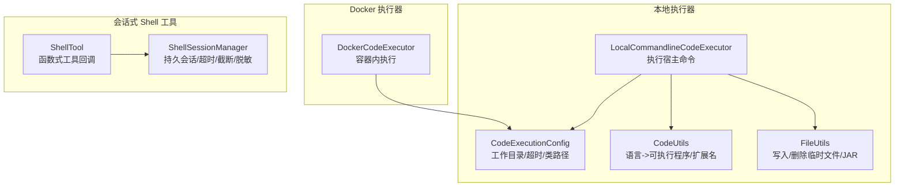
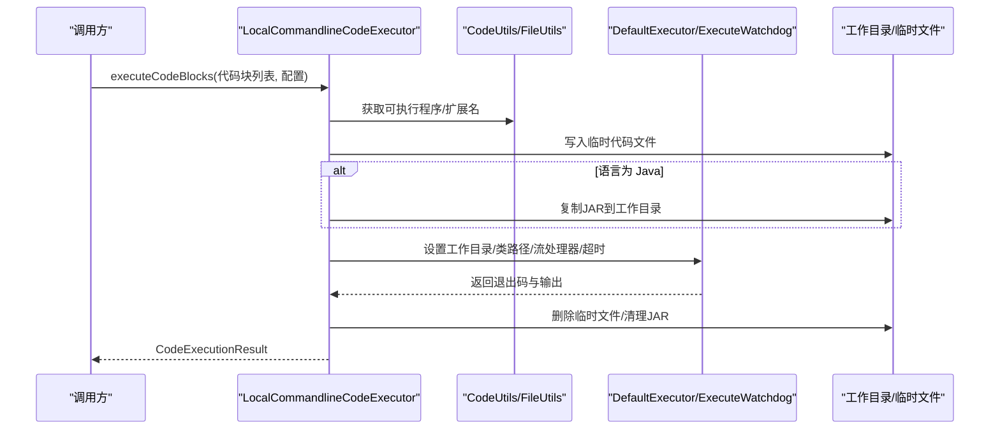
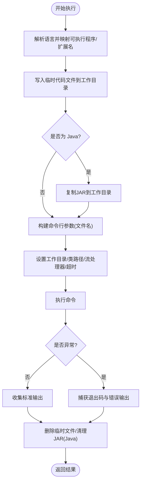
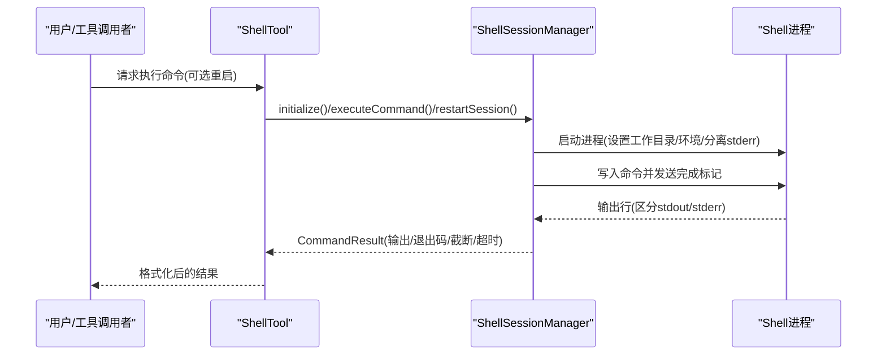
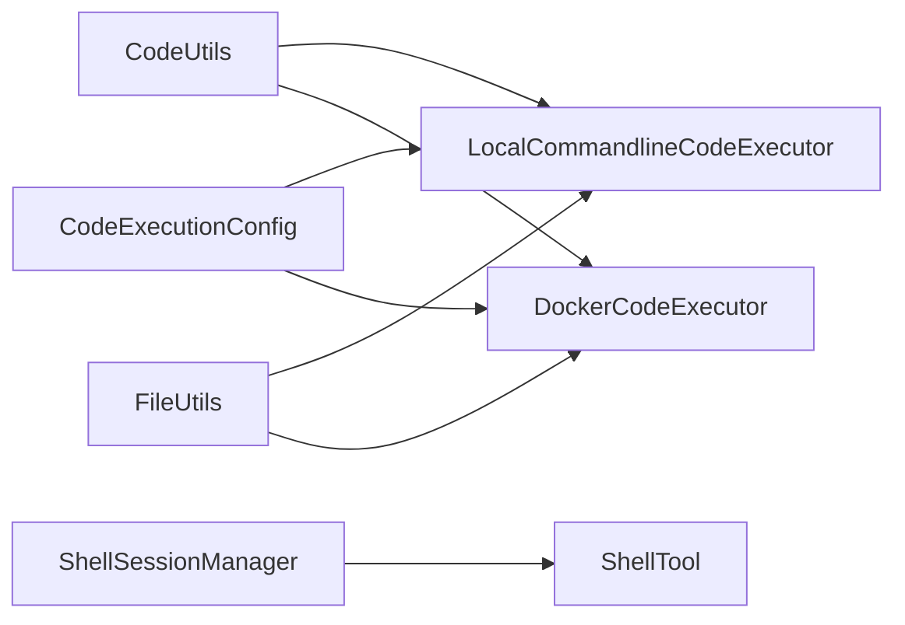

# 命令行执行器

<cite>
**本文引用的文件列表**
- [LocalCommandlineCodeExecutor.java](file://spring-boot-starters/spring-ai-alibaba-starter-builtin-nodes/src/main/java/com/alibaba/cloud/ai/graph/node/code/LocalCommandlineCodeExecutor.java)
- [DockerCodeExecutor.java](file://spring-boot-starters/spring-ai-alibaba-starter-builtin-nodes/src/main/java/com/alibaba/cloud/ai/graph/node/code/DockerCodeExecutor.java)
- [CodeExecutionConfig.java](file://spring-boot-starters/spring-ai-alibaba-starter-builtin-nodes/src/main/java/com/alibaba/cloud/ai/graph/node/code/entity/CodeExecutionConfig.java)
- [CodeExecutionResult.java](file://spring-boot-starters/spring-ai-alibaba-starter-builtin-nodes/src/main/java/com/alibaba/cloud/ai/graph/node/code/entity/CodeExecutionResult.java)
- [CodeUtils.java](file://spring-boot-starters/spring-ai-alibaba-starter-builtin-nodes/src/main/java/com/alibaba/cloud/ai/graph/utils/CodeUtils.java)
- [FileUtils.java](file://spring-boot-starters/spring-ai-alibaba-starter-builtin-nodes/src/main/java/com/alibaba/cloud/ai/graph/utils/FileUtils.java)
- [ShellTool.java](file://spring-ai-alibaba-agent-framework/src/main/java/com/alibaba/cloud/ai/graph/agent/tools/ShellTool.java)
- [ShellSessionManager.java](file://spring-ai-alibaba-agent-framework/src/main/java/com/alibaba/cloud/ai/graph/agent/tools/ShellSessionManager.java)
- [CodeActionTest.java](file://spring-boot-starters/spring-ai-alibaba-starter-builtin-nodes/src/test/java/com/alibaba/cloud/ai/graph/node/CodeActionTest.java)
- [FilesystemInterceptor.java](file://spring-ai-alibaba-agent-framework/src/main/java/com/alibaba/cloud/ai/graph/agent/extension/interceptor/FilesystemInterceptor.java)
</cite>

## 目录
1. [简介](#简介)
2. [项目结构](#项目结构)
3. [核心组件](#核心组件)
4. [架构总览](#架构总览)
5. [详细组件分析](#详细组件分析)
6. [依赖关系分析](#依赖关系分析)
7. [性能考量](#性能考量)
8. [故障排查指南](#故障排查指南)
9. [结论](#结论)
10. [附录](#附录)

## 简介
本文件面向“本地命令行代码执行器”的设计与实现，系统性说明 LocalCommandlineCodeExecutor 如何通过 Apache Commons Exec 的 DefaultExecutor 与 ExecuteWatchdog 在宿主系统上直接执行代码片段；如何构造命令、设置工作目录、注入环境变量、重定向输入输出；如何处理执行超时、进程终止与资源清理；以及在受控环境下如何安全地执行系统命令或调用本地脚本（如 Python、Shell、NodeJS、Java）。同时，本文将对比本地执行器与 Docker 执行器在性能与安全方面的权衡，并给出适用场景建议。

## 项目结构
围绕命令行执行器的关键模块分布如下：
- 本地执行器：LocalCommandlineCodeExecutor 使用 Apache Commons Exec 执行宿主命令，支持 Python、Shell、NodeJS、Java 等语言。
- Docker 执行器：DockerCodeExecutor 通过 Docker 客户端在容器中执行代码，隔离性更强但有额外开销。
- 工具与配置：CodeExecutionConfig 提供工作目录、超时、类路径等配置；CodeUtils 提供语言到可执行程序与扩展名映射；FileUtils 负责临时文件写入与 JAR 拷贝。
- 会话式 Shell 工具：ShellTool 与 ShellSessionManager 提供持久化 Shell 会话，支持命令超时、输出截断、环境注入与安全脱敏。

图表来源
- [LocalCommandlineCodeExecutor.java](file://spring-boot-starters/spring-ai-alibaba-starter-builtin-nodes/src/main/java/com/alibaba/cloud/ai/graph/node/code/LocalCommandlineCodeExecutor.java#L75-L172)
- [DockerCodeExecutor.java](file://spring-boot-starters/spring-ai-alibaba-starter-builtin-nodes/src/main/java/com/alibaba/cloud/ai/graph/node/code/DockerCodeExecutor.java#L59-L180)
- [CodeExecutionConfig.java](file://spring-boot-starters/spring-ai-alibaba-starter-builtin-nodes/src/main/java/com/alibaba/cloud/ai/graph/node/code/entity/CodeExecutionConfig.java#L24-L133)
- [CodeUtils.java](file://spring-boot-starters/spring-ai-alibaba-starter-builtin-nodes/src/main/java/com/alibaba/cloud/ai/graph/utils/CodeUtils.java#L25-L43)
- [FileUtils.java](file://spring-boot-starters/spring-ai-alibaba-starter-builtin-nodes/src/main/java/com/alibaba/cloud/ai/graph/utils/FileUtils.java#L34-L130)
- [ShellTool.java](file://spring-ai-alibaba-agent-framework/src/main/java/com/alibaba/cloud/ai/graph/agent/tools/ShellTool.java#L46-L151)
- [ShellSessionManager.java](file://spring-ai-alibaba-agent-framework/src/main/java/com/alibaba/cloud/ai/graph/agent/tools/ShellSessionManager.java#L220-L416)

章节来源
- [LocalCommandlineCodeExecutor.java](file://spring-boot-starters/spring-ai-alibaba-starter-builtin-nodes/src/main/java/com/alibaba/cloud/ai/graph/node/code/LocalCommandlineCodeExecutor.java#L45-L174)
- [DockerCodeExecutor.java](file://spring-boot-starters/spring-ai-alibaba-starter-builtin-nodes/src/main/java/com/alibaba/cloud/ai/graph/node/code/DockerCodeExecutor.java#L55-L180)
- [ShellTool.java](file://spring-ai-alibaba-agent-framework/src/main/java/com/alibaba/cloud/ai/graph/agent/tools/ShellTool.java#L46-L151)
- [ShellSessionManager.java](file://spring-ai-alibaba-agent-framework/src/main/java/com/alibaba/cloud/ai/graph/agent/tools/ShellSessionManager.java#L220-L416)

## 核心组件
- LocalCommandlineCodeExecutor：负责将代码块写入临时文件，选择对应语言的可执行程序，设置工作目录与类路径，配置流处理器与超时 watchdog，捕获标准输出与错误输出，返回退出码与日志。
- DockerCodeExecutor：与本地执行器类似，但通过 Docker 客户端在容器中运行，挂载主机工作目录到容器 /workspace，支持容器级资源限制与隔离。
- ShellTool 与 ShellSessionManager：提供持久化 Shell 会话，支持命令超时、输出行数/字节截断、环境变量注入、安全脱敏规则与优雅终止。

章节来源
- [LocalCommandlineCodeExecutor.java](file://spring-boot-starters/spring-ai-alibaba-starter-builtin-nodes/src/main/java/com/alibaba/cloud/ai/graph/node/code/LocalCommandlineCodeExecutor.java#L75-L172)
- [DockerCodeExecutor.java](file://spring-boot-starters/spring-ai-alibaba-starter-builtin-nodes/src/main/java/com/alibaba/cloud/ai/graph/node/code/DockerCodeExecutor.java#L59-L180)
- [ShellTool.java](file://spring-ai-alibaba-agent-framework/src/main/java/com/alibaba/cloud/ai/graph/agent/tools/ShellTool.java#L46-L151)
- [ShellSessionManager.java](file://spring-ai-alibaba-agent-framework/src/main/java/com/alibaba/cloud/ai/graph/agent/tools/ShellSessionManager.java#L220-L416)

## 架构总览
本地执行器与 Docker 执行器均遵循统一的接口契约，分别在宿主与容器环境中执行代码。两者都依赖 CodeExecutionConfig 进行工作目录、超时、类路径等配置；依赖 CodeUtils 将语言映射为可执行程序与文件扩展名；依赖 FileUtils 写入/删除临时文件与 JAR 资源。

图表来源
- [LocalCommandlineCodeExecutor.java](file://spring-boot-starters/spring-ai-alibaba-starter-builtin-nodes/src/main/java/com/alibaba/cloud/ai/graph/node/code/LocalCommandlineCodeExecutor.java#L75-L172)
- [CodeUtils.java](file://spring-boot-starters/spring-ai-alibaba-starter-builtin-nodes/src/main/java/com/alibaba/cloud/ai/graph/utils/CodeUtils.java#L25-L43)
- [FileUtils.java](file://spring-boot-starters/spring-ai-alibaba-starter-builtin-nodes/src/main/java/com/alibaba/cloud/ai/graph/utils/FileUtils.java#L34-L130)

## 详细组件分析

### 本地命令行代码执行器（LocalCommandlineCodeExecutor）
- 命令构造与工作目录
  - 依据语言映射选择可执行程序与文件扩展名。
  - 对于 Java，构建类路径包含当前目录、工作目录中的 JAR 与外部类路径参数。
  - 工作目录由配置提供，执行器设置为 DefaultExecutor 的工作目录。
- 输入/输出与流重定向
  - 使用 PumpStreamHandler 将子进程的标准输出与错误输出重定向到内存缓冲区，便于统一收集与返回。
- 超时与进程终止
  - 使用 ExecuteWatchdog 设置超时，超时后自动中断执行。
  - Java 类文件在执行后清理，避免残留。
- 错误处理
  - 捕获 ExecuteException 获取退出码；IO 异常向上抛出以便上层处理。
- 示例用法
  - 可参考测试用例中对 Python、JavaScript、Java 的执行示例，展示如何通过 CodeExecutorNodeAction 配置 LocalCommandlineCodeExecutor 并传入参数。

图表来源
- [LocalCommandlineCodeExecutor.java](file://spring-boot-starters/spring-ai-alibaba-starter-builtin-nodes/src/main/java/com/alibaba/cloud/ai/graph/node/code/LocalCommandlineCodeExecutor.java#L75-L172)
- [CodeUtils.java](file://spring-boot-starters/spring-ai-alibaba-starter-builtin-nodes/src/main/java/com/alibaba/cloud/ai/graph/utils/CodeUtils.java#L25-L43)
- [FileUtils.java](file://spring-boot-starters/spring-ai-alibaba-starter-builtin-nodes/src/main/java/com/alibaba/cloud/ai/graph/utils/FileUtils.java#L34-L130)

章节来源
- [LocalCommandlineCodeExecutor.java](file://spring-boot-starters/spring-ai-alibaba-starter-builtin-nodes/src/main/java/com/alibaba/cloud/ai/graph/node/code/LocalCommandlineCodeExecutor.java#L75-L172)
- [CodeExecutionConfig.java](file://spring-boot-starters/spring-ai-alibaba-starter-builtin-nodes/src/main/java/com/alibaba/cloud/ai/graph/node/code/entity/CodeExecutionConfig.java#L24-L133)
- [CodeExecutionResult.java](file://spring-boot-starters/spring-ai-alibaba-starter-builtin-nodes/src/main/java/com/alibaba/cloud/ai/graph/node/code/entity/CodeExecutionResult.java#L29-L34)
- [CodeUtils.java](file://spring-boot-starters/spring-ai-alibaba-starter-builtin-nodes/src/main/java/com/alibaba/cloud/ai/graph/utils/CodeUtils.java#L25-L43)
- [FileUtils.java](file://spring-boot-starters/spring-ai-alibaba-starter-builtin-nodes/src/main/java/com/alibaba/cloud/ai/graph/utils/FileUtils.java#L34-L130)
- [CodeActionTest.java](file://spring-boot-starters/spring-ai-alibaba-starter-builtin-nodes/src/test/java/com/alibaba/cloud/ai/graph/node/CodeActionTest.java#L56-L103)

### 会话式 Shell 工具（ShellTool 与 ShellSessionManager）
- 会话生命周期
  - 初始化：根据工作空间根目录或临时目录启动持久会话，注入环境变量，执行启动命令。
  - 执行：向会话发送命令，等待完成标记，聚合 stdout/stderr 输出，统计行数与字节数，记录退出码。
  - 终止：优雅关闭会话，执行停机命令，清理临时目录。
- 超时与截断
  - 命令超时触发会话重启；输出按行数与字节数上限进行截断。
- 安全与脱敏
  - 支持配置脱敏规则，对输出进行匹配与替换，记录匹配项类型，避免敏感信息泄露。
- 环境变量注入
  - 通过 ShellSessionManager.Builder.environment 注入键值对，影响后续命令执行。

图表来源
- [ShellTool.java](file://spring-ai-alibaba-agent-framework/src/main/java/com/alibaba/cloud/ai/graph/agent/tools/ShellTool.java#L46-L151)
- [ShellSessionManager.java](file://spring-ai-alibaba-agent-framework/src/main/java/com/alibaba/cloud/ai/graph/agent/tools/ShellSessionManager.java#L220-L416)

章节来源
- [ShellTool.java](file://spring-ai-alibaba-agent-framework/src/main/java/com/alibaba/cloud/ai/graph/agent/tools/ShellTool.java#L46-L151)
- [ShellSessionManager.java](file://spring-ai-alibaba-agent-framework/src/main/java/com/alibaba/cloud/ai/graph/agent/tools/ShellSessionManager.java#L220-L416)

### 与 Docker 执行器的对比
- 性能
  - 本地执行器无容器开销，启动更快、延迟更低；Docker 执行器需拉取镜像、创建容器、挂载卷，存在额外时间成本。
- 安全
  - Docker 执行器具备更强的隔离性，限制资源与网络访问，降低对宿主系统的潜在影响；本地执行器直接在宿主执行，需严格控制工作目录与命令来源。
- 配置与运维
  - Docker 执行器需要 Docker 守护进程、镜像可用性与网络策略；本地执行器仅依赖宿主已安装的语言运行时。
- 适用场景
  - 本地执行器适合受控环境、低延迟需求与简单脚本执行；Docker 执行器适合需要强隔离、多语言运行时一致性的场景。

章节来源
- [DockerCodeExecutor.java](file://spring-boot-starters/spring-ai-alibaba-starter-builtin-nodes/src/main/java/com/alibaba/cloud/ai/graph/node/code/DockerCodeExecutor.java#L59-L180)
- [LocalCommandlineCodeExecutor.java](file://spring-boot-starters/spring-ai-alibaba-starter-builtin-nodes/src/main/java/com/alibaba/cloud/ai/graph/node/code/LocalCommandlineCodeExecutor.java#L75-L172)

## 依赖关系分析
- 语言映射与文件扩展
  - CodeUtils 将语言字符串映射为可执行程序与文件扩展名，确保不同语言的命令行参数正确拼接。
- 文件管理
  - FileUtils 负责将代码写入工作目录、复制/删除 JAR 资源，保证 Java 执行所需的依赖就绪与清理。
- 执行配置
  - CodeExecutionConfig 提供工作目录、超时、类路径、Docker 相关参数等，贯穿本地与 Docker 执行器。
- 流与超时
  - LocalCommandlineCodeExecutor 使用 DefaultExecutor 与 ExecuteWatchdog 实现流重定向与超时控制；ShellSessionManager 通过阻塞队列与标记行实现输出聚合与超时重启。

图表来源
- [CodeUtils.java](file://spring-boot-starters/spring-ai-alibaba-starter-builtin-nodes/src/main/java/com/alibaba/cloud/ai/graph/utils/CodeUtils.java#L25-L43)
- [FileUtils.java](file://spring-boot-starters/spring-ai-alibaba-starter-builtin-nodes/src/main/java/com/alibaba/cloud/ai/graph/utils/FileUtils.java#L34-L130)
- [CodeExecutionConfig.java](file://spring-boot-starters/spring-ai-alibaba-starter-builtin-nodes/src/main/java/com/alibaba/cloud/ai/graph/node/code/entity/CodeExecutionConfig.java#L24-L133)
- [LocalCommandlineCodeExecutor.java](file://spring-boot-starters/spring-ai-alibaba-starter-builtin-nodes/src/main/java/com/alibaba/cloud/ai/graph/node/code/LocalCommandlineCodeExecutor.java#L75-L172)
- [DockerCodeExecutor.java](file://spring-boot-starters/spring-ai-alibaba-starter-builtin-nodes/src/main/java/com/alibaba/cloud/ai/graph/node/code/DockerCodeExecutor.java#L59-L180)
- [ShellTool.java](file://spring-ai-alibaba-agent-framework/src/main/java/com/alibaba/cloud/ai/graph/agent/tools/ShellTool.java#L46-L151)
- [ShellSessionManager.java](file://spring-ai-alibaba-agent-framework/src/main/java/com/alibaba/cloud/ai/graph/agent/tools/ShellSessionManager.java#L220-L416)

## 性能考量
- 本地执行器
  - 启动快、延迟低，适合短小脚本与频繁调用；注意避免长时间阻塞命令导致资源占用。
- Docker 执行器
  - 首次启动容器有额外开销；可通过复用镜像与减少不必要的挂载优化性能。
- 共同点
  - 合理设置超时与输出截断，防止大输出造成内存压力；对 Java 代码执行后及时清理中间类文件与 JAR。

[本节为通用性能讨论，不直接分析具体文件]

## 故障排查指南
- 常见问题
  - 语言未识别：检查语言字符串是否在 CodeUtils 映射范围内。
  - 工作目录不存在：确认 CodeExecutionConfig 中的工作目录存在且可写。
  - 超时被触发：适当提高超时阈值或优化命令逻辑。
  - Java 类路径缺失：确保复制 JAR 到工作目录或在配置中提供类路径。
  - Shell 会话未初始化：确保在 Agent 生命周期中启用 ShellToolAgentHook 或手动 initialize。
- 定位手段
  - 查看 CodeExecutionResult 的退出码与日志；在 ShellTool 中关注超时与截断提示。
  - 检查 ShellSessionManager 的启动/停机命令执行情况与临时目录清理状态。

章节来源
- [LocalCommandlineCodeExecutor.java](file://spring-boot-starters/spring-ai-alibaba-starter-builtin-nodes/src/main/java/com/alibaba/cloud/ai/graph/node/code/LocalCommandlineCodeExecutor.java#L150-L172)
- [ShellTool.java](file://spring-ai-alibaba-agent-framework/src/main/java/com/alibaba/cloud/ai/graph/agent/tools/ShellTool.java#L121-L150)
- [ShellSessionManager.java](file://spring-ai-alibaba-agent-framework/src/main/java/com/alibaba/cloud/ai/graph/agent/tools/ShellSessionManager.java#L76-L126)

## 结论
LocalCommandlineCodeExecutor 通过 Apache Commons Exec 在宿主系统上高效执行多种语言的代码片段，具备简洁的命令构造、工作目录与类路径设置、流重定向与超时控制能力。配合 ShellSessionManager 的持久化会话与安全脱敏，可在受控环境下安全地执行系统命令或调用本地脚本。若需要更强隔离与一致性，可选用 DockerCodeExecutor。在生产环境中，应结合最小权限、白名单命令、输入验证与严格的超时策略，确保安全与稳定。

[本节为总结性内容，不直接分析具体文件]

## 附录

### 安全风险与缓解措施
- 路径遍历与越界访问
  - 在文件系统工具中采用路径校验与规范化，拒绝包含 “..”、“~” 的路径，并限定允许前缀。
- 命令注入
  - 本地执行器通过语言映射与参数化命令行，避免直接拼接用户输入；会话式 Shell 工具通过标记行与超时机制降低交互式注入风险。
- 权限提升
  - 本地执行器以当前进程权限运行；建议在受限用户下运行服务，限制工作目录与可执行程序范围。
- 最佳实践
  - 白名单命令与语言支持；输入参数严格校验与转义；最小权限原则；超时与输出截断；定期清理临时文件与 JAR。

章节来源
- [FilesystemInterceptor.java](file://spring-ai-alibaba-agent-framework/src/main/java/com/alibaba/cloud/ai/graph/agent/extension/interceptor/FilesystemInterceptor.java#L142-L181)
- [ShellSessionManager.java](file://spring-ai-alibaba-agent-framework/src/main/java/com/alibaba/cloud/ai/graph/agent/tools/ShellSessionManager.java#L220-L416)
- [CodeUtils.java](file://spring-boot-starters/spring-ai-alibaba-starter-builtin-nodes/src/main/java/com/alibaba/cloud/ai/graph/utils/CodeUtils.java#L25-L43)