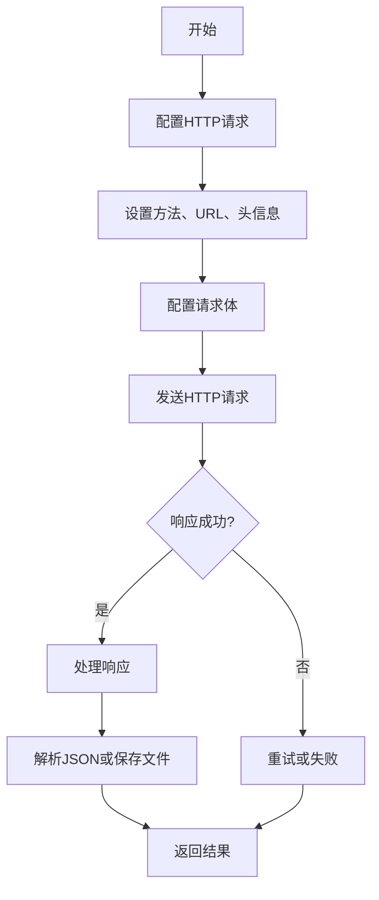
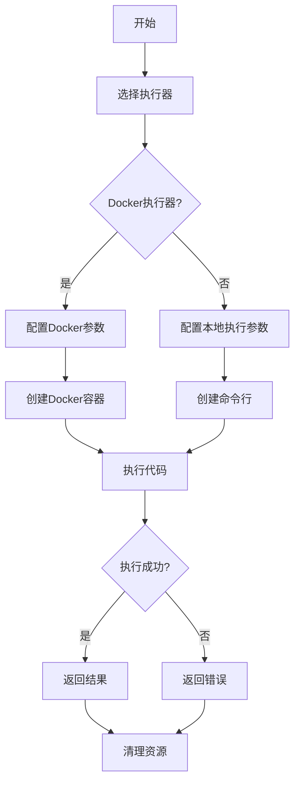
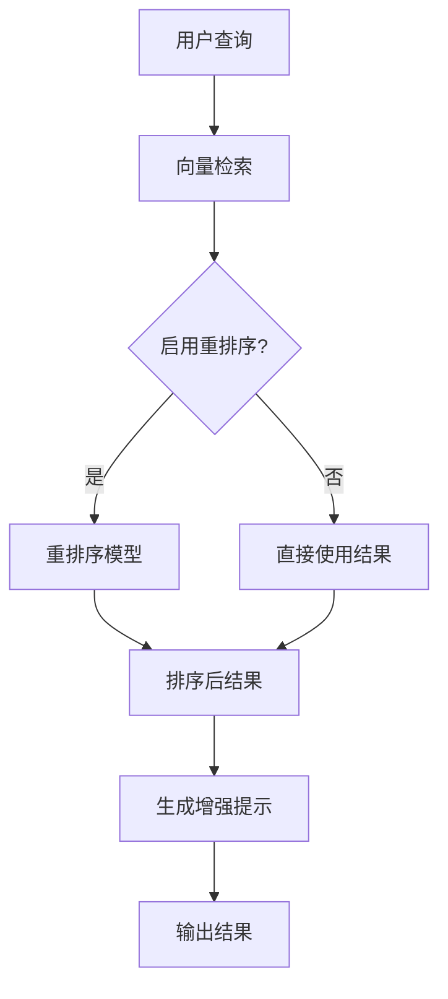
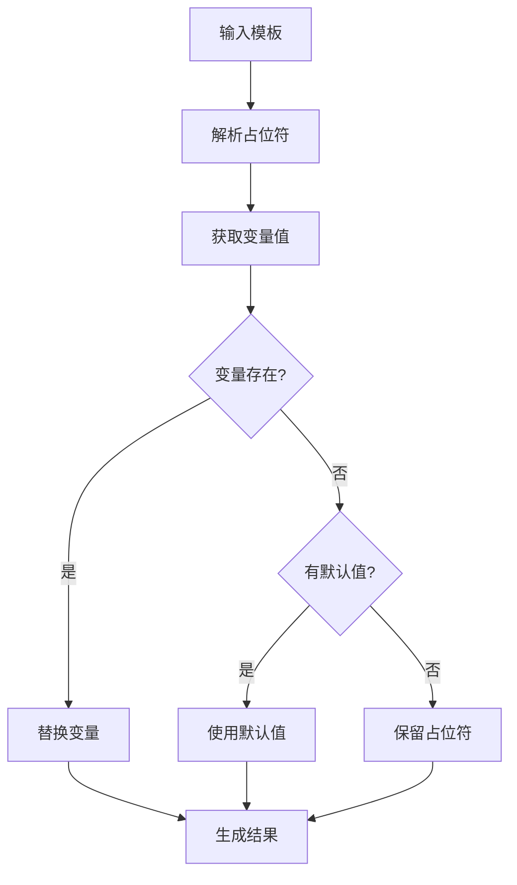
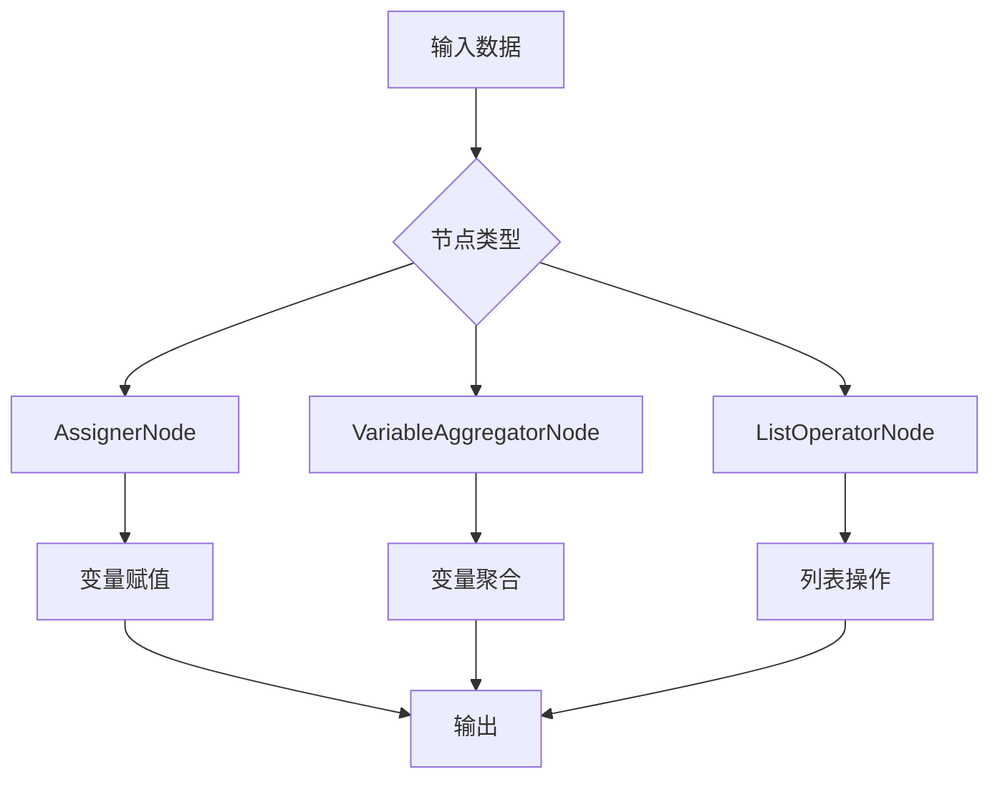

# 内置节点

<cite>
**本文档引用的文件**
- [HttpNode.java](file://spring-boot-starters/spring-ai-alibaba-starter-builtin-nodes/src/main/java/com/alibaba/cloud/ai/graph/node/HttpNode.java)
- [CodeExecutorNodeAction.java](file://spring-boot-starters/spring-ai-alibaba-starter-builtin-nodes/src/main/java/com/alibaba/cloud/ai/graph/node/code/CodeExecutorNodeAction.java)
- [DockerCodeExecutor.java](file://spring-boot-starters/spring-ai-alibaba-starter-builtin-nodes/src/main/java/com/alibaba/cloud/ai/graph/node/code/DockerCodeExecutor.java)
- [LocalCommandlineCodeExecutor.java](file://spring-boot-starters/spring-ai-alibaba-starter-builtin-nodes/src/main/java/com/alibaba/cloud/ai/graph/node/code/LocalCommandlineCodeExecutor.java)
- [KnowledgeRetrievalNode.java](file://spring-boot-starters/spring-ai-alibaba-starter-builtin-nodes/src/main/java/com/alibaba/cloud/ai/graph/node/KnowledgeRetrievalNode.java)
- [TemplateTransformNode.java](file://spring-boot-starters/spring-ai-alibaba-starter-builtin-nodes/src/main/java/com/alibaba/cloud/ai/graph/node/TemplateTransformNode.java)
- [AssignerNode.java](file://spring-boot-starters/spring-ai-alibaba-starter-builtin-nodes/src/main/java/com/alibaba/cloud/ai/graph/node/AssignerNode.java)
- [VariableAggregatorNode.java](file://spring-boot-starters/spring-ai-alibaba-starter-builtin-nodes/src/main/java/com/alibaba/cloud/ai/graph/node/VariableAggregatorNode.java)
- [ListOperatorNode.java](file://spring-boot-starters/spring-ai-alibaba-starter-builtin-nodes/src/main/java/com/alibaba/cloud/ai/graph/node/ListOperatorNode.java)
</cite>

## 目录
1. [介绍](#介绍)
2. [HTTP节点](#http节点)
3. [代码执行节点](#代码执行节点)
4. [知识检索节点](#知识检索节点)
5. [模板转换节点](#模板转换节点)
6. [数据处理节点](#数据处理节点)

## 介绍
本系统提供了一系列预构建的内置节点，用于在工作流中执行各种任务。这些节点涵盖了从HTTP请求、代码执行到知识检索和数据处理的多种功能。每个节点都设计为可配置和可重用的组件，允许开发者通过组合这些节点来构建复杂的工作流。本文档将详细介绍这些内置节点的使用方法和配置选项。

## HTTP节点
HttpNode节点用于执行HTTP请求并处理响应。它支持多种HTTP方法、URL、头信息和请求体配置。

### 配置HTTP请求
HttpNode节点通过Builder模式进行配置，支持以下主要配置项：

- **方法 (method)**: 设置HTTP请求方法，如GET、POST、PUT等。
- **URL (url)**: 设置请求的URL，支持变量替换，例如`${baseUrl}/api/users`。
- **头信息 (headers)**: 设置请求头，例如Content-Type、Authorization等。
- **查询参数 (queryParams)**: 添加URL查询参数。
- **认证 (auth)**: 配置基本认证或Bearer令牌认证。
- **请求体 (body)**: 支持多种请求体类型，包括原始文本、JSON、表单数据、multipart表单和二进制数据。
- **重试配置 (retryConfig)**: 配置请求失败时的重试策略。

### 处理响应
HttpNode节点会自动处理HTTP响应，根据响应内容类型进行不同的处理：
- 对于JSON响应，会解析为Map对象。
- 对于文件响应（如通过Content-Disposition头标识），会将文件内容保存到内存文件存储中，并返回文件ID。
- 响应的状态码、头信息和主体内容都会被包含在输出结果中。

**节点来源**
- [HttpNode.java](file://spring-boot-starters/spring-ai-alibaba-starter-builtin-nodes/src/main/java/com/alibaba/cloud/ai/graph/node/HttpNode.java)

## 代码执行节点
CodeExecutorNodeAction节点用于安全地执行Python、Java和JavaScript代码。它提供了两种执行器：DockerCodeExecutor和LocalCommandlineCodeExecutor。

### 执行器配置
#### DockerCodeExecutor
DockerCodeExecutor在隔离的Docker容器中执行代码，提供了更高的安全性。配置选项包括：
- **Docker主机 (dockerHost)**: Docker守护进程的地址。
- **工作目录 (workDir)**: 容器内代码文件的挂载目录。
- **容器名称 (containerName)**: 容器的名称。
- **超时 (timeout)**: 代码执行的最大时间。
- **Docker镜像 (docker)**: 使用的Docker镜像，如"python:3.10"。

#### LocalCommandlineCodeExecutor
LocalCommandlineCodeExecutor在本地命令行中执行代码，适用于开发和测试环境。配置选项与Docker执行器类似，但不需要Docker相关配置。

### 安全考量
- **隔离执行**: Docker执行器在容器中运行代码，防止对主机系统的直接访问。
- **超时控制**: 两种执行器都支持超时设置，防止无限循环或长时间运行的代码。
- **文件清理**: 执行完成后会自动清理生成的临时文件。
- **资源限制**: 可以通过Docker配置限制容器的CPU和内存使用。

**节点来源**
- [CodeExecutorNodeAction.java](file://spring-boot-starters/spring-ai-alibaba-starter-builtin-nodes/src/main/java/com/alibaba/cloud/ai/graph/node/code/CodeExecutorNodeAction.java)
- [DockerCodeExecutor.java](file://spring-boot-starters/spring-ai-alibaba-starter-builtin-nodes/src/main/java/com/alibaba/cloud/ai/graph/node/code/DockerCodeExecutor.java)
- [LocalCommandlineCodeExecutor.java](file://spring-boot-starters/spring-ai-alibaba-starter-builtin-nodes/src/main/java/com/alibaba/cloud/ai/graph/node/code/LocalCommandlineCodeExecutor.java)

## 知识检索节点
KnowledgeRetrievalNode节点用于与向量数据库集成，实现检索增强生成（RAG）功能。

### 与向量数据库集成
该节点通过VectorStore接口与向量数据库交互，支持以下功能：
- **相似性检索**: 根据用户查询在向量空间中检索最相似的文档。
- **过滤条件**: 支持基于元数据的过滤表达式。
- **重排序**: 可以启用重排序模型对检索结果进行重新排序，提高相关性。
- **Top-K控制**: 限制返回的文档数量。

### RAG实现
知识检索节点的工作流程如下：
1. 接收用户查询作为输入。
2. 在向量数据库中检索与查询相关的文档。
3. （可选）使用重排序模型对检索结果进行重新排序。
4. 将检索到的文档内容与原始查询结合，形成增强的提示。
5. 将增强的提示和文档列表输出，供后续节点使用。

**节点来源**
- [KnowledgeRetrievalNode.java](file://spring-boot-starters/spring-ai-alibaba-starter-builtin-nodes/src/main/java/com/alibaba/cloud/ai/graph/node/KnowledgeRetrievalNode.java)

## 模板转换节点
TemplateTransformNode节点利用模板引擎进行内容转换，支持变量替换和默认值设置。

### 模板引擎使用
该节点支持以下模板语法：
- **变量替换**: 使用`{{ variable }}`语法替换变量。
- **默认值**: 使用`{{ variable ?: defaultValue }}`语法设置默认值。
- **嵌套属性**: 支持点号表示法访问嵌套对象属性，如`{{ user.name }}`。
- **数组索引**: 支持数组索引访问，如`{{ items[0] }}`。

### 内容转换
模板转换节点的工作流程：
1. 接收包含模板的字符串。
2. 解析模板中的占位符。
3. 从状态中获取对应的变量值。
4. 如果变量不存在且有默认值，则使用默认值。
5. 将所有占位符替换为实际值，生成最终字符串。

**节点来源**
- [TemplateTransformNode.java](file://spring-boot-starters/spring-ai-alibaba-starter-builtin-nodes/src/main/java/com/alibaba/cloud/ai/graph/node/TemplateTransformNode.java)

## 数据处理节点
系统提供了多种数据处理节点，用于在工作流中操作和转换数据。

### AssignerNode
AssignerNode用于在状态中进行变量赋值，支持多种写入模式：
- **覆盖写入 (OVER_WRITE)**: 直接覆盖目标键的值。
- **追加 (APPEND)**: 将值追加到列表中。
- **清空 (CLEAR)**: 清空目标键的值。
- **常量输入 (INPUT_CONSTANT)**: 将常量值赋给目标键。

### VariableAggregatorNode
VariableAggregatorNode用于聚合多个变量的值，支持将结果转换为列表或字符串。

### ListOperatorNode
ListOperatorNode用于对列表进行过滤、排序和限制操作：
- **过滤**: 使用Predicate定义过滤条件。
- **排序**: 使用Comparator定义排序规则。
- **限制**: 限制返回的元素数量。
- **模式**: 支持JSON字符串、列表和数组三种输入/输出模式。

**节点来源**
- [AssignerNode.java](file://spring-boot-starters/spring-ai-alibaba-starter-builtin-nodes/src/main/java/com/alibaba/cloud/ai/graph/node/AssignerNode.java)
- [VariableAggregatorNode.java](file://spring-boot-starters/spring-ai-alibaba-starter-builtin-nodes/src/main/java/com/alibaba/cloud/ai/graph/node/VariableAggregatorNode.java)
- [ListOperatorNode.java](file://spring-boot-starters/spring-ai-alibaba-starter-builtin-nodes/src/main/java/com/alibaba/cloud/ai/graph/node/ListOperatorNode.java)