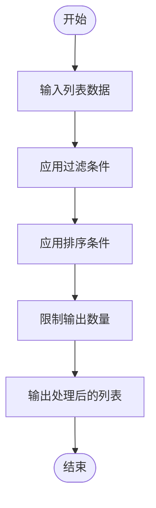
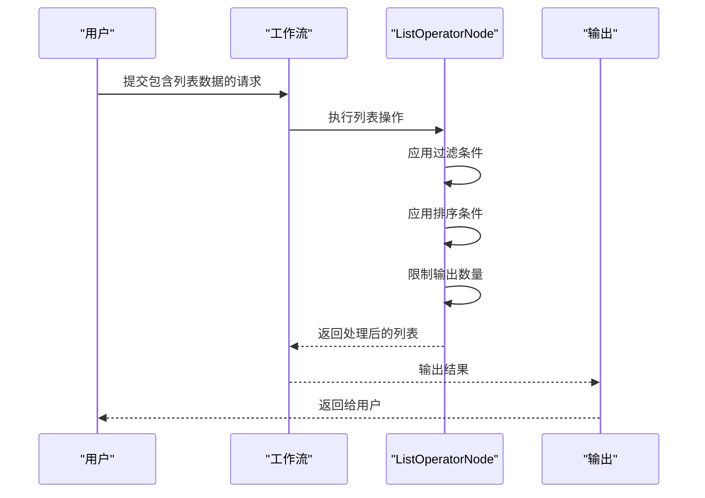

# 列表操作节点

<cite>
**本文档引用的文件**  
- [ListOperatorNode.java](file://spring-boot-starters/spring-ai-alibaba-starter-builtin-nodes/src/main/java/com/alibaba/cloud/ai/graph/node/ListOperatorNode.java)
- [ListOperatorNodeTest.java](file://spring-boot-starters/spring-ai-alibaba-starter-builtin-nodes/src/test/java/com/alibaba/cloud/ai/graph/node/ListOperatorNodeTest.java)
</cite>

## 目录
1. [简介](#简介)
2. [核心功能](#核心功能)
3. [配置参数详解](#配置参数详解)
4. [操作模式](#操作模式)
5. [表达式语法与示例](#表达式语法与示例)
6. [实际应用场景](#实际应用场景)
7. [性能特征与使用限制](#性能特征与使用限制)
8. [总结](#总结)

## 简介

列表操作节点（ListOperatorNode）是Spring AI Alibaba框架中用于对状态中的列表数据进行复杂转换的核心组件。该节点支持多种列表操作功能，包括映射（Map）、过滤（Filter）、排序（Sort）和聚合（Reduce/Summarize）。通过灵活的配置参数和表达式语法，开发者可以实现对列表数据的筛选、排序、限制输出数量等操作，广泛应用于数据预处理和后处理流程中，如为RAG检索结果排序或为多代理决策聚合候选方案。

**Section sources**
- [ListOperatorNode.java](file://spring-boot-starters/spring-ai-alibaba-starter-builtin-nodes/src/main/java/com/alibaba/cloud/ai/graph/node/ListOperatorNode.java#L32-L36)

## 核心功能

列表操作节点提供了以下核心功能：
- **过滤（Filter）**：根据指定条件筛选列表中的元素。
- **排序（Sort）**：按照指定的比较器对列表元素进行排序。
- **限制（Limit）**：限制输出结果的数量。
- **输入输出模式支持**：支持JSON字符串、List和Array三种输入输出模式。

这些功能可以通过构建器模式进行灵活配置，满足不同场景下的需求。



**Diagram sources**
- [ListOperatorNode.java](file://spring-boot-starters/spring-ai-alibaba-starter-builtin-nodes/src/main/java/com/alibaba/cloud/ai/graph/node/ListOperatorNode.java#L83-L127)

## 配置参数详解

列表操作节点的配置参数如下：

| 参数 | 描述 | 默认值 |
|------|------|--------|
| `mode` | 输入/输出类型，支持JSON_STR、LIST、ARRAY | JSON_STR |
| `inputKey` | 输入数据在状态中的键名 | "input" |
| `outputKey` | 输出数据在状态中的键名 | "output" |
| `filterChain` | 过滤条件链，多个条件通过逻辑与连接 | 无过滤 |
| `comparatorChain` | 排序条件链，多个条件通过thenComparing连接 | 无排序 |
| `limitNumber` | 限制输出结果的数量 | 无限制 |
| `type` | 泛型具体类，用于JSON反序列化 | 无 |

**Section sources**
- [ListOperatorNode.java](file://spring-boot-starters/spring-ai-alibaba-starter-builtin-nodes/src/main/java/com/alibaba/cloud/ai/graph/node/ListOperatorNode.java#L50-L68)

## 操作模式

列表操作节点支持三种输入/输出模式：

### JSON字符串模式（JSON_STR）
将输入的JSON字符串反序列化为列表对象，并将处理后的列表序列化为JSON字符串输出。需要指定泛型具体类（`type`）用于反序列化。

### 列表模式（LIST）
直接处理状态中的List对象，输入和输出均为List类型。

### 数组模式（ARRAY）
将输入的数组转换为List进行处理，输出时再转换回数组。

```mermaid
classDiagram
class ListOperatorNode {
+enum Mode { JSON_STR, LIST, ARRAY }
+String inputKey
+String outputKey
+Predicate~T~ filterChain
+Comparator~T~ comparatorChain
+Long limitNumber
+Class~T~ type
+Map~String, Object~ apply(OverAllState t)
}
ListOperatorNode : +Builder~T~ builder()
ListOperatorNode : -ObjectMapper objectMapper
ListOperatorNode : -Logger log
```

**Diagram sources**
- [ListOperatorNode.java](file://spring-boot-starters/spring-ai-alibaba-starter-builtin-nodes/src/main/java/com/alibaba/cloud/ai/graph/node/ListOperatorNode.java#L42-L48)

## 表达式语法与示例

### 过滤表达式
使用Java 8的Predicate接口定义过滤条件。可以链式添加多个过滤条件，所有条件通过逻辑与连接。

```java
.filter(x -> x instanceof Integer)
.filter(x -> x.length() > 4)
```

### 排序表达式
使用Java 8的Comparator接口定义排序条件。可以链式添加多个排序条件，后续条件作为前一个条件相等时的次级排序依据。

```java
.comparator(Comparator.comparing(Number::intValue).reversed())
.comparator(String::compareTo)
```

### 完整示例
```java
ListOperatorNode<String> node = ListOperatorNode.<String>builder()
    .mode(ListOperatorNode.Mode.LIST)
    .inputKey("input")
    .outputKey("output")
    .filter(x -> x.startsWith("1234"))
    .filter(x -> x.length() > 4)
    .comparator(String::compareTo)
    .limitNumber(10)
    .build();
```

**Section sources**
- [ListOperatorNodeTest.java](file://spring-boot-starters/spring-ai-alibaba-starter-builtin-nodes/src/test/java/com/alibaba/cloud/ai/graph/node/ListOperatorNodeTest.java#L64-L75)

## 实际应用场景

### RAG检索结果排序
在检索增强生成（RAG）场景中，可以使用列表操作节点对检索到的文档进行排序，确保最相关的结果排在前面。

### 多代理决策聚合
在多代理系统中，可以使用该节点聚合各个代理的候选方案，并根据评分或其他指标进行排序和筛选。

### 数据预处理
在数据进入模型之前，可以使用该节点对输入数据进行清洗和转换，如过滤无效数据、按时间排序等。



**Diagram sources**
- [ListOperatorNode.java](file://spring-boot-starters/spring-ai-alibaba-starter-builtin-nodes/src/main/java/com/alibaba/cloud/ai/graph/node/ListOperatorNode.java#L83-L127)
- [ListOperatorNodeTest.java](file://spring-boot-starters/spring-ai-alibaba-starter-builtin-nodes/src/test/java/com/alibaba/cloud/ai/graph/node/ListOperatorNodeTest.java#L117-L137)

## 性能特征与使用限制

### 性能特征
- **内存使用**：处理过程中会将整个列表加载到内存中，因此对于大型列表需要注意内存消耗。
- **时间复杂度**：过滤操作为O(n)，排序操作为O(n log n)，整体性能受列表大小影响较大。

### 使用限制
- 当使用JSON_STR模式时，必须指定泛型具体类（`type`），否则会抛出IllegalArgumentException。
- 不支持流式处理，所有数据必须一次性加载到内存中。
- 对于非常大的列表，建议在外部进行分页或分批处理。

**Section sources**
- [ListOperatorNode.java](file://spring-boot-starters/spring-ai-alibaba-starter-builtin-nodes/src/main/java/com/alibaba/cloud/ai/graph/node/ListOperatorNode.java#L195-L197)
- [ListOperatorNode.java](file://spring-boot-starters/spring-ai-alibaba-starter-builtin-nodes/src/main/java/com/alibaba/cloud/ai/graph/node/ListOperatorNode.java#L109-L113)

## 总结

列表操作节点（ListOperatorNode）是Spring AI Alibaba框架中一个强大而灵活的组件，能够满足各种列表数据处理需求。通过合理的配置和使用，可以有效提升数据处理效率和质量。在实际应用中，应根据具体场景选择合适的操作模式和配置参数，并注意其性能特征和使用限制。

[无来源，此部分为总结性内容]