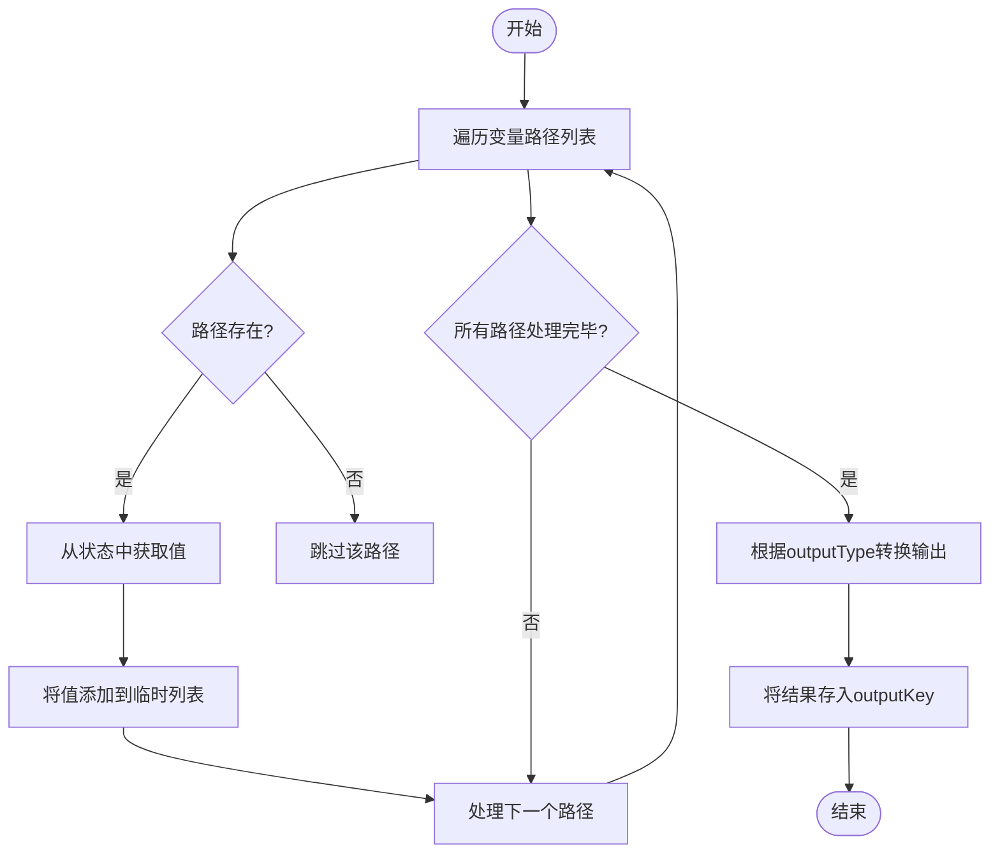
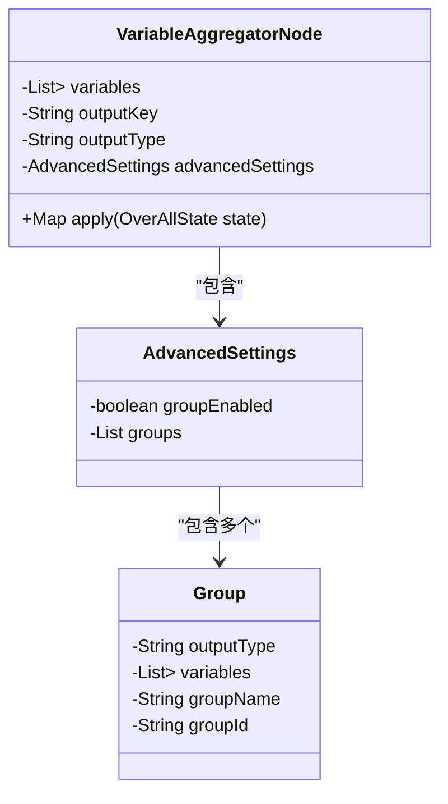
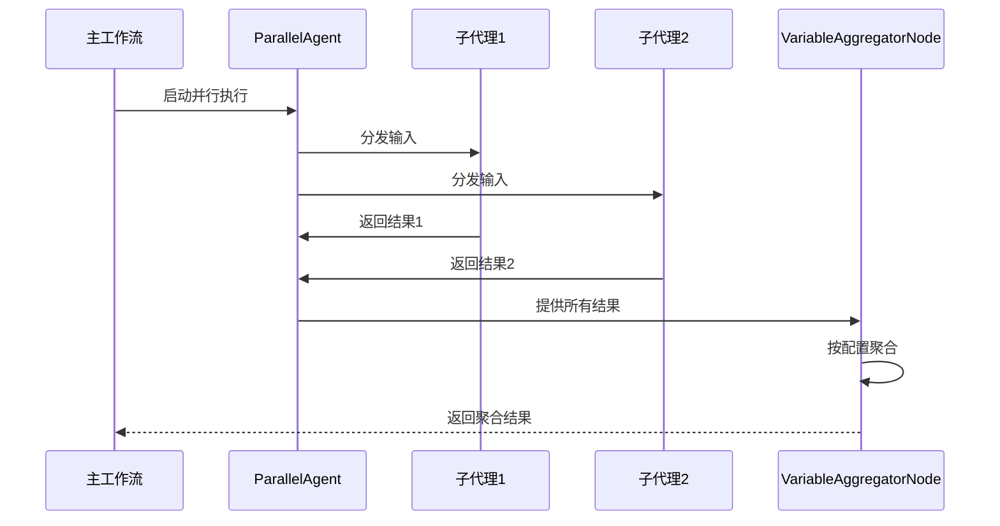
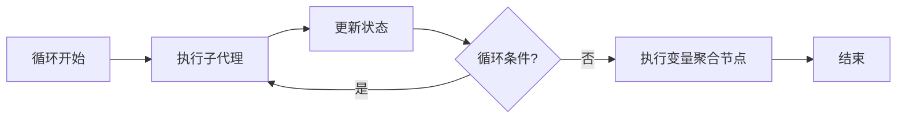

# 变量聚合节点

<cite>
**本文档中引用的文件**  
- [VariableAggregatorNode.java](file://spring-boot-starters/spring-ai-alibaba-starter-builtin-nodes/src/main/java/com/alibaba/cloud/ai/graph/node/VariableAggregatorNode.java)
- [VariableAggregatorNodeTest.java](file://spring-boot-starters/spring-ai-alibaba-starter-builtin-nodes/src/test/java/com/alibaba/cloud/ai/graph/node/VariableAggregatorNodeTest.java)
- [ParallelAgent.java](file://spring-ai-alibaba-agent-framework/src/main/java/com/alibaba/cloud/ai/graph/agent/flow/agent/ParallelAgent.java)
- [EnhancedParallelResultAggregator.java](file://spring-ai-alibaba-agent-framework/src/main/java/com/alibaba/cloud/ai/graph/agent/flow/node/EnhancedParallelResultAggregator.java)
- [LoopAgent.java](file://spring-ai-alibaba-agent-framework/src/main/java/com/alibaba/cloud/ai/graph/agent/flow/agent/LoopAgent.java)
</cite>

## 目录
1. [简介](#简介)
2. [核心功能与设计](#核心功能与设计)
3. [聚合策略详解](#聚合策略详解)
4. [配置与使用示例](#配置与使用示例)
5. [与并行和循环代理的协同](#与并行和循环代理的协同)
6. [性能与内存考量](#性能与内存考量)
7. [总结](#总结)

## 简介

变量聚合节点（VariableAggregatorNode）是Spring AI Alibaba框架中的一个关键组件，专门用于在并行分支或循环迭代结束后，从多个子流程中收集分散的数据，并将其合并到主工作流状态中。该节点在复杂的工作流编排中扮演着“结果汇总者”的角色，确保在Fan-Out/Gather模式或循环模式下，所有分支或迭代的结果能够被有效整合，为后续的处理步骤提供统一的数据视图。

**Section sources**
- [VariableAggregatorNode.java](file://spring-boot-starters/spring-ai-alibaba-starter-builtin-nodes/src/main/java/com/alibaba/cloud/ai/graph/node/VariableAggregatorNode.java#L1-L210)

## 核心功能与设计

变量聚合节点的核心功能是遍历一个预定义的变量路径列表，从工作流的全局状态（OverAllState）中提取对应的值，并根据配置的策略将这些值聚合到一个指定的输出键下。

该节点的设计基于`NodeAction`接口，其核心方法是`apply(OverAllState state)`。当工作流执行到该节点时，此方法会被调用，接收当前的全局状态作为输入，并返回一个包含聚合结果的映射（Map）。

节点的关键属性包括：
- **variables**: 一个`List<List<String>>`，表示需要聚合的变量路径。每个内部列表代表一个从根状态到目标值的路径，例如`["user", "name"]`。
- **outputKey**: 聚合结果在全局状态中存储的键名。
- **outputType**: 指定聚合结果的输出类型，如`list`或`string`。
- **advancedSettings**: 高级配置，支持分组聚合等复杂场景。

节点通过`getValueByPath`方法递归地从嵌套的Map结构中提取值，确保能够处理深层嵌套的状态数据。



**Diagram sources**
- [VariableAggregatorNode.java](file://spring-boot-starters/spring-ai-alibaba-starter-builtin-nodes/src/main/java/com/alibaba/cloud/ai/graph/node/VariableAggregatorNode.java#L43-L73)

**Section sources**
- [VariableAggregatorNode.java](file://spring-boot-starters/spring-ai-alibaba-starter-builtin-nodes/src/main/java/com/alibaba/cloud/ai/graph/node/VariableAggregatorNode.java#L26-L97)

## 聚合策略详解

变量聚合节点支持多种聚合策略，主要通过`outputType`参数和`AdvancedSettings`来控制。

### 基本聚合策略

1.  **列表追加 (List)**: 这是最直接的策略。所有成功提取的值会被添加到一个ArrayList中，最终结果是一个包含所有值的列表。
    ```java
    case "list" -> new ArrayList<>(values);
    ```

2.  **字符串连接 (String)**: 所有值会被转换为字符串，并用换行符`\n`连接成一个单一的字符串。
    ```java
    case "string" -> String.join("\n", values.stream().map(Object::toString).collect(Collectors.toList()));
    ```

### 高级分组聚合

通过`AdvancedSettings`，节点支持更复杂的分组聚合功能。用户可以定义多个`Group`，每个组有自己的`groupName`和`variables`（变量路径列表）。聚合时，会为每个组创建一个独立的值列表，最终结果是一个以组名为键、值列表为内容的Map。



**Diagram sources**
- [VariableAggregatorNode.java](file://spring-boot-starters/spring-ai-alibaba-starter-builtin-nodes/src/main/java/com/alibaba/cloud/ai/graph/node/VariableAggregatorNode.java#L100-L168)

**Section sources**
- [VariableAggregatorNode.java](file://spring-boot-starters/spring-ai-alibaba-starter-builtin-nodes/src/main/java/com/alibaba/cloud/ai/graph/node/VariableAggregatorNode.java#L91-L97)
- [VariableAggregatorNode.java](file://spring-boot-starters/spring-ai-alibaba-starter-builtin-nodes/src/main/java/com/alibaba/cloud/ai/graph/node/VariableAggregatorNode.java#L47-L60)

## 配置与使用示例

以下示例展示了如何配置和使用变量聚合节点。

### 示例1：基本列表聚合

```java
List<List<String>> variables = Arrays.asList(
    Collections.singletonList("user"),
    Collections.singletonList("age")
);

// 假设状态中包含: user="ricky", age=20
VariableAggregatorNode node = new VariableAggregatorNode(variables, "result", "list", null);
Map<String, Object> result = node.apply(mockState);
// result.get("result") 将返回 ["ricky", 20]
```

### 示例2：字符串连接

```java
List<List<String>> variables = Arrays.asList(
    Collections.singletonList("product"),
    Collections.singletonList("price")
);

// 假设状态中包含: product="Book", price="19.9"
VariableAggregatorNode node = new VariableAggregatorNode(variables, "result", "string", null);
Map<String, Object> result = node.apply(mockState);
// result.get("result") 将返回 "Book\n19.9"
```

### 示例3：分组聚合

```java
// 定义用户信息组
VariableAggregatorNode.Group userInfoGroup = new VariableAggregatorNode.Group();
userInfoGroup.setGroupName("UserInfo");
userInfoGroup.setVariables(Arrays.asList(
    Arrays.asList("user", "name"), 
    Arrays.asList("user", "age")
));

// 定义产品信息组
VariableAggregatorNode.Group productInfoGroup = new VariableAggregatorNode.Group();
productInfoGroup.setGroupName("ProductInfo");
productInfoGroup.setVariables(Collections.singletonList(Collections.singletonList("product")));

// 配置高级设置
VariableAggregatorNode.AdvancedSettings settings = new VariableAggregatorNode.AdvancedSettings();
settings.setGroupEnabled(true);
settings.setGroups(Arrays.asList(userInfoGroup, productInfoGroup));

// 创建聚合节点
VariableAggregatorNode node = new VariableAggregatorNode(variables, "aggregatedData", "group", settings);
Map<String, Object> result = node.apply(mockState);
// result.get("aggregatedData") 将返回一个Map，包含:
// {"UserInfo": ["Alice", 30], "ProductInfo": ["Laptop"]}
```

**Section sources**
- [VariableAggregatorNodeTest.java](file://spring-boot-starters/spring-ai-alibaba-starter-builtin-nodes/src/test/java/com/alibaba/cloud/ai/graph/node/VariableAggregatorNodeTest.java#L56-L117)

## 与并行和循环代理的协同

变量聚合节点与`ParallelAgent`和`LoopAgent`紧密协作，是实现复杂工作流模式的关键。

### 与ParallelAgent的协同

`ParallelAgent`实现了并行的Fan-Out/Gather模式。它会将输入分发给多个子代理并行执行，然后使用一个结果聚合器来收集和合并结果。虽然`ParallelAgent`内部使用`EnhancedParallelResultAggregator`进行结果合并，但`VariableAggregatorNode`可以在`ParallelAgent`之后作为一个独立的节点，对更复杂或特定格式的数据进行二次聚合。



**Diagram sources**
- [ParallelAgent.java](file://spring-ai-alibaba-agent-framework/src/main/java/com/alibaba/cloud/ai/graph/agent/flow/agent/ParallelAgent.java#L36-L53)
- [EnhancedParallelResultAggregator.java](file://spring-ai-alibaba-agent-framework/src/main/java/com/alibaba/cloud/ai/graph/agent/flow/node/EnhancedParallelResultAggregator.java#L32-L36)

### 与LoopAgent的协同

`LoopAgent`用于执行循环操作。在每次循环迭代中，可能会产生新的数据。`VariableAggregatorNode`可以放置在循环之后，用于收集所有迭代中产生的数据。例如，如果循环用于从多个数据源获取信息，聚合节点可以将所有结果合并成一个完整的报告。



**Diagram sources**
- [LoopAgent.java](file://spring-ai-alibaba-agent-framework/src/main/java/com/alibaba/cloud/ai/graph/agent/flow/agent/LoopAgent.java#L29-L37)

**Section sources**
- [ParallelAgent.java](file://spring-ai-alibaba-agent-framework/src/main/java/com/alibaba/cloud/ai/graph/agent/flow/agent/ParallelAgent.java#L54-L117)
- [LoopAgent.java](file://spring-ai-alibaba-agent-framework/src/main/java/com/alibaba/cloud/ai/graph/agent/flow/agent/LoopAgent.java#L58-L117)

## 性能与内存考量

在处理大规模数据聚合时，需要注意以下性能和内存问题：

1.  **内存占用**: 聚合节点会将所有匹配的值加载到内存中的一个列表里。如果源数据量巨大，可能会导致内存溢出（OOM）。应确保聚合的数据量在可接受范围内，或考虑分批处理。
2.  **路径查找效率**: `getValueByPath`方法需要遍历路径来查找值。对于非常深的嵌套结构，这可能会成为性能瓶颈。应尽量保持状态结构扁平化。
3.  **空值处理**: 节点会自动跳过不存在的路径，这避免了空指针异常，但大量的无效路径检查会增加不必要的开销。应确保配置的变量路径是有效的。
4.  **字符串连接开销**: 当使用`string`输出类型时，`String.join`和`stream().map()`会产生临时对象，对于大量数据，建议直接使用`StringBuilder`以提高效率。

**Section sources**
- [VariableAggregatorNode.java](file://spring-boot-starters/spring-ai-alibaba-starter-builtin-nodes/src/main/java/com/alibaba/cloud/ai/graph/node/VariableAggregatorNode.java#L62-L68)
- [VariableAggregatorNode.java](file://spring-boot-starters/spring-ai-alibaba-starter-builtin-nodes/src/main/java/com/alibaba/cloud/ai/graph/node/VariableAggregatorNode.java#L91-L95)

## 总结

变量聚合节点是Spring AI Alibaba框架中实现数据汇总功能的核心组件。它通过灵活的路径配置和多种聚合策略，能够有效地从并行分支或循环迭代中收集和合并数据。其与`ParallelAgent`和`LoopAgent`的协同工作，为构建复杂、高效的工作流提供了坚实的基础。在使用时，应合理设计状态结构和聚合逻辑，并注意大规模数据处理时的性能和内存消耗。