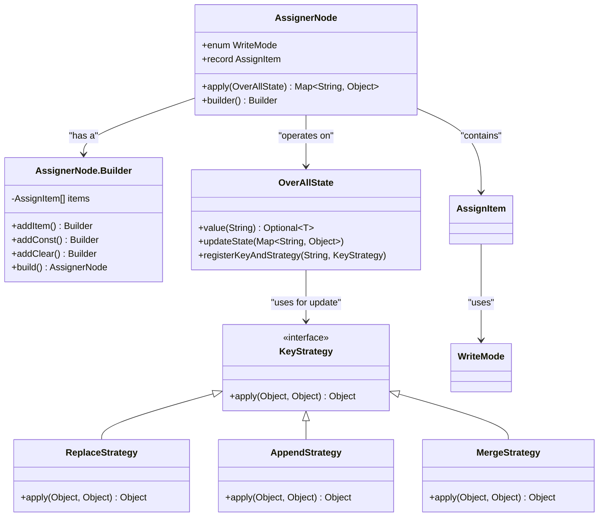
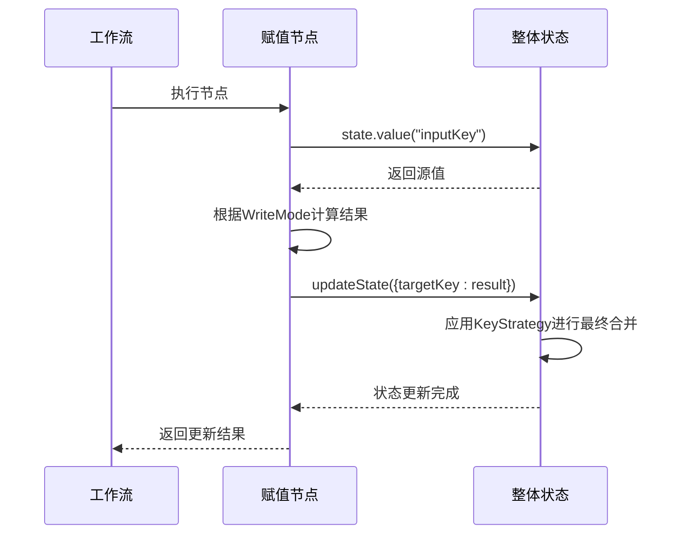

# 赋值节点

<cite>
**本文档中引用的文件**  
- [AssignerNode.java](file://spring-boot-starters/spring-ai-alibaba-starter-builtin-nodes/src/main/java/com/alibaba/cloud/ai/graph/node/AssignerNode.java)
- [AssignerNodeTest.java](file://spring-boot-starters/spring-ai-alibaba-starter-builtin-nodes/src/test/java/com/alibaba/cloud/ai/graph/node/AssignerNodeTest.java)
- [OverAllState.java](file://spring-ai-alibaba-graph-core/src/main/java/com/alibaba/cloud/ai/graph/OverAllState.java)
- [OverAllStateBuilder.java](file://spring-ai-alibaba-graph-core/src/main/java/com/alibaba/cloud/ai/graph/OverAllStateBuilder.java)
- [KeyStrategy.java](file://spring-ai-alibaba-graph-core/src/main/java/com/alibaba/cloud/ai/graph/KeyStrategy.java)
- [ReplaceStrategy.java](file://spring-ai-alibaba-graph-core/src/main/java/com/alibaba/cloud/ai/graph/state/strategy/ReplaceStrategy.java)
- [AppendStrategy.java](file://spring-ai-alibaba-graph-core/src/main/java/com/alibaba/cloud/ai/graph/state/strategy/AppendStrategy.java)
- [MergeStrategy.java](file://spring-ai-alibaba-graph-core/src/main/java/com/alibaba/cloud/ai/graph/state/strategy/MergeStrategy.java)
</cite>

## 目录
1. [简介](#简介)
2. [核心功能与设计](#核心功能与设计)
3. [工作模式详解](#工作模式详解)
4. [配置与使用示例](#配置与使用示例)
5. [在工作流中的应用场景](#在工作流中的应用场景)
6. [与状态管理系统的集成](#与状态管理系统的集成)
7. [性能影响与最佳实践](#性能影响与最佳实践)
8. [结论](#结论)

## 简介

赋值节点（AssignerNode）是Spring AI Alibaba框架中一个核心的内置节点，用于在工作流执行过程中对整体状态（OverAllState）进行精确的赋值操作。它提供了一种灵活且强大的机制，允许开发者将常量值、从其他节点输出提取的数据或通过表达式计算得到的动态值，赋给状态中的特定键。该节点支持批量操作和多种写入模式，是实现工作流状态初始化、更新、条件分支后数据归一化等关键任务的基础组件。

**Section sources**
- [AssignerNode.java](file://spring-boot-starters/spring-ai-alibaba-starter-builtin-nodes/src/main/java/com/alibaba/cloud/ai/graph/node/AssignerNode.java#L31-L32)

## 核心功能与设计

赋值节点的核心功能是作为`NodeAction`接口的实现，其`apply`方法接收当前的`OverAllState`，并返回一个包含更新项的`Map<String, Object>`。其设计遵循了清晰的职责分离和构建者模式。

### 核心数据结构

赋值节点的核心是`AssignItem`记录类，它定义了一次赋值操作的所有必要信息：
- `targetKey`: 目标键，即状态中将要被更新的键。
- `inputKey`: 输入键，即从状态中读取源数据的键。此字段在`INPUT_CONSTANT`模式下为`null`。
- `writeMode`: 写入模式，决定了如何将源数据应用到目标键。
- `inputValue`: 输入值，用于`INPUT_CONSTANT`模式，直接作为常量值使用。

### 构建器模式

为了简化配置，`AssignerNode`提供了`Builder`类，支持流畅的链式调用。这使得创建复杂的批量赋值操作变得直观和简洁。



**Diagram sources**
- [AssignerNode.java](file://spring-boot-starters/spring-ai-alibaba-starter-builtin-nodes/src/main/java/com/alibaba/cloud/ai/graph/node/AssignerNode.java#L32-L175)
- [OverAllState.java](file://spring-ai-alibaba-graph-core/src/main/java/com/alibaba/cloud/ai/graph/OverAllState.java#L77-L561)
- [KeyStrategy.java](file://spring-ai-alibaba-graph-core/src/main/java/com/alibaba/cloud/ai/graph/KeyStrategy.java#L34-L51)

**Section sources**
- [AssignerNode.java](file://spring-boot-starters/spring-ai-alibaba-starter-builtin-nodes/src/main/java/com/alibaba/cloud/ai/graph/node/AssignerNode.java#L43-L55)
- [AssignerNode.java](file://spring-boot-starters/spring-ai-alibaba-starter-builtin-nodes/src/main/java/com/alibaba/cloud/ai/graph/node/AssignerNode.java#L136-L169)

## 工作模式详解

`AssignerNode`通过`WriteMode`枚举定义了四种不同的赋值行为，每种模式都针对特定的使用场景。

### OVER_WRITE (覆盖写入)

这是最直接的模式。它将`inputKey`对应的状态值直接赋给`targetKey`。如果目标键不存在，则会创建它。

**示例**:
```java
// 将状态中 "a" 的值赋给 "x"
AssignerNode node = new AssignerNode("x", "a", AssignerNode.WriteMode.OVER_WRITE);
```

### APPEND (追加)

此模式专为集合类型（如`List`）设计。它会将源值追加到目标键的现有值中。
- 如果目标值是`List`，源值会被添加到该列表的末尾。
- 如果源值本身是`Collection`，则其所有元素都会被添加。
- 如果目标值不是`List`，会抛出`IllegalArgumentException`。

**示例**:
```java
// 将 "a" 的值追加到 "x" 的列表中
AssignerNode node = AssignerNode.builder()
    .addItem("x", "a", AssignerNode.WriteMode.APPEND)
    .build();
```

### CLEAR (清空)

此模式用于重置目标键的值。根据目标值的类型，它会将其重置为“空”状态：
- `List` -> 空列表
- `Map` -> 空映射
- `String` -> 空字符串
- `Number` -> 0
- 其他类型 -> `null`

**示例**:
```java
// 清空 "b" 键的值
AssignerNode node = AssignerNode.builder()
    .addItem("b", null, AssignerNode.WriteMode.CLEAR)
    .build();
```

### INPUT_CONSTANT (输入常量)

此模式允许将一个固定的常量值直接赋给目标键，而无需从状态中读取。这是初始化变量或设置默认值的理想选择。

**示例**:
```java
// 将布尔值 true 赋给 "d"
AssignerNode node = AssignerNode.builder()
    .addConst("d", true)
    .build();
```

**Section sources**
- [AssignerNode.java](file://spring-boot-starters/spring-ai-alibaba-starter-builtin-nodes/src/main/java/com/alibaba/cloud/ai/graph/node/AssignerNode.java#L34-L38)
- [AssignerNode.java](file://spring-boot-starters/spring-ai-alibaba-starter-builtin-nodes/src/main/java/com/alibaba/cloud/ai/graph/node/AssignerNode.java#L74-L125)

## 配置与使用示例

以下示例展示了如何使用`AssignerNode`的构建器来配置复杂的批量赋值操作。

### 批量赋值示例

```java
// 创建一个包含多种操作的赋值节点
AssignerNode node = AssignerNode.builder()
    // 将 input1 的值追加到 a 的列表中
    .addItem("a", "input1", AssignerNode.WriteMode.APPEND)
    // 清空 b 键
    .addItem("b", null, AssignerNode.WriteMode.CLEAR)
    // 用 input3 的值覆盖 c 键
    .addItem("c", "input3", AssignerNode.WriteMode.OVER_WRITE)
    // 将常量 true 赋给 d 键
    .addConst("d", true)
    .build();
```

此配置在一次执行中完成了四项独立的赋值任务，极大地提高了工作流的效率和可读性。

**Section sources**
- [AssignerNodeTest.java](file://spring-boot-starters/spring-ai-alibaba-starter-builtin-nodes/src/test/java/com/alibaba/cloud/ai/graph/node/AssignerNodeTest.java#L129-L134)

## 在工作流中的应用场景

### 初始化变量

在工作流开始时，使用`INPUT_CONSTANT`模式为关键变量设置初始值或默认值。

```java
AssignerNode initNode = AssignerNode.builder()
    .addConst("retryCount", 0)
    .addConst("status", "PENDING")
    .build();
```

### 更新状态

在节点执行后，将处理结果更新到全局状态中，供后续节点使用。

```java
// 假设某个LLM节点的输出在 "llm_output" 键中
AssignerNode updateNode = new AssignerNode("finalAnswer", "llm_output", AssignerNode.WriteMode.OVER_WRITE);
```

### 处理条件分支后的数据归一化

当工作流存在多个分支时，每个分支可能产生不同格式的数据。在合并分支后，可以使用`AssignerNode`将这些数据归一化到一个统一的结构中。

```java
// 无论走哪个分支，都将结果统一到 "processedResult" 键
AssignerNode normalizeNode = AssignerNode.builder()
    .addItem("processedResult", "branchA_result", AssignerNode.WriteMode.OVER_WRITE) // 分支A
    .addItem("processedResult", "branchB_result", AssignerNode.WriteMode.OVER_WRITE) // 分支B
    .build();
```

**Section sources**
- [AssignerNodeTest.java](file://spring-boot-starters/spring-ai-alibaba-starter-builtin-nodes/src/test/java/com/alibaba/cloud/ai/graph/node/AssignerNodeTest.java#L149-L152)

## 与状态管理系统的集成

`AssignerNode`与`OverAllState`和`KeyStrategy`系统紧密集成，共同构成了强大的状态管理机制。

### OverAllState

`OverAllState`是工作流的中央状态容器，它以`Map<String, Object>`的形式存储所有数据。`AssignerNode`通过其`value(String)`方法从`OverAllState`中读取数据，并通过`updateState`方法将计算结果写回。

### KeyStrategy

`KeyStrategy`定义了当一个键被更新时，新旧值如何合并。`AssignerNode`本身不直接处理合并逻辑，而是依赖于`OverAllState`中为每个键注册的`KeyStrategy`。例如，如果一个键注册了`APPEND`策略，那么即使`AssignerNode`使用`OVER_WRITE`模式，最终的行为也可能是追加，这取决于`OverAllState`的更新逻辑。然而，在`AssignerNode`的上下文中，`APPEND`模式会直接在节点内部处理列表追加，绕过`KeyStrategy`。



**Diagram sources**
- [AssignerNode.java](file://spring-boot-starters/spring-ai-alibaba-starter-builtin-nodes/src/main/java/com/alibaba/cloud/ai/graph/node/AssignerNode.java#L74-L129)
- [OverAllState.java](file://spring-ai-alibaba-graph-core/src/main/java/com/alibaba/cloud/ai/graph/OverAllState.java#L263-L278)

**Section sources**
- [OverAllState.java](file://spring-ai-alibaba-graph-core/src/main/java/com/alibaba/cloud/ai/graph/OverAllState.java#L484-L486)
- [OverAllState.java](file://spring-ai-alibaba-graph-core/src/main/java/com/alibaba/cloud/ai/graph/OverAllState.java#L263-L278)
- [KeyStrategy.java](file://spring-ai-alibaba-graph-core/src/main/java/com/alibaba/cloud/ai/graph/KeyStrategy.java#L36-L40)

## 性能影响与最佳实践

### 性能影响

`AssignerNode`的性能开销非常低。其核心操作是简单的键值查找和赋值，时间复杂度为O(n)，其中n是`AssignItem`的数量。对于大多数工作流，这种开销可以忽略不计。

### 最佳实践

1.  **使用构建器进行批量操作**：尽可能使用`Builder`一次性配置所有赋值操作，而不是创建多个`AssignerNode`实例。
2.  **明确写入模式**：在配置时，明确指定`WriteMode`，避免因默认行为不明确而导致的逻辑错误。
3.  **与KeyStrategy协同**：理解`AssignerNode`的`APPEND`模式与`OverAllState`的`AppendStrategy`之间的区别，避免混淆。
4.  **利用常量赋值**：对于初始化和设置标志位，优先使用`addConst`方法，代码更清晰。

**Section sources**
- [AssignerNode.java](file://spring-boot-starters/spring-ai-alibaba-starter-builtin-nodes/src/main/java/com/alibaba/cloud/ai/graph/node/AssignerNode.java#L136-L169)
- [AssignerNode.java](file://spring-boot-starters/spring-ai-alibaba-starter-builtin-nodes/src/main/java/com/alibaba/cloud/ai/graph/node/AssignerNode.java#L74-L129)

## 结论

赋值节点（AssignerNode）是Spring AI Alibaba框架中不可或缺的构建块。它提供了一种强大、灵活且高效的方式来管理工作流的全局状态。通过支持多种写入模式和批量操作，它能够满足从简单变量初始化到复杂数据归一化的各种需求。其与`OverAllState`和`KeyStrategy`系统的无缝集成，确保了状态管理的一致性和可靠性。掌握`AssignerNode`的使用是构建健壮、可维护的AI工作流的关键。