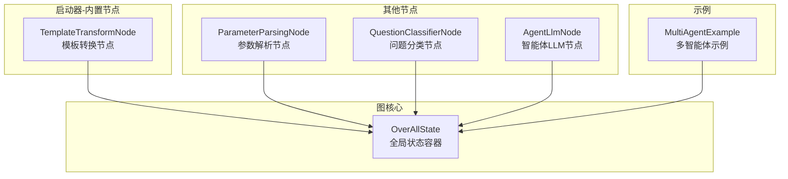
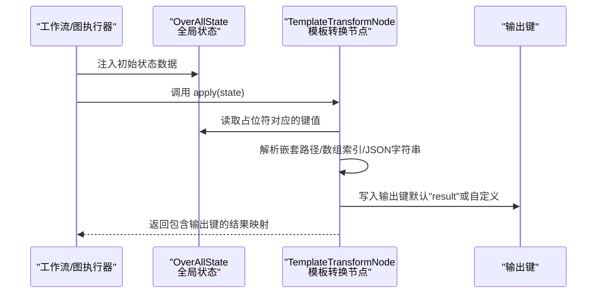
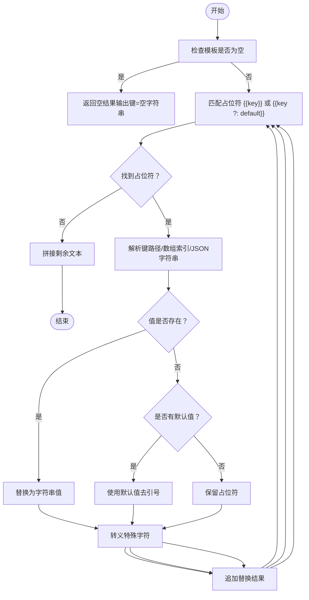
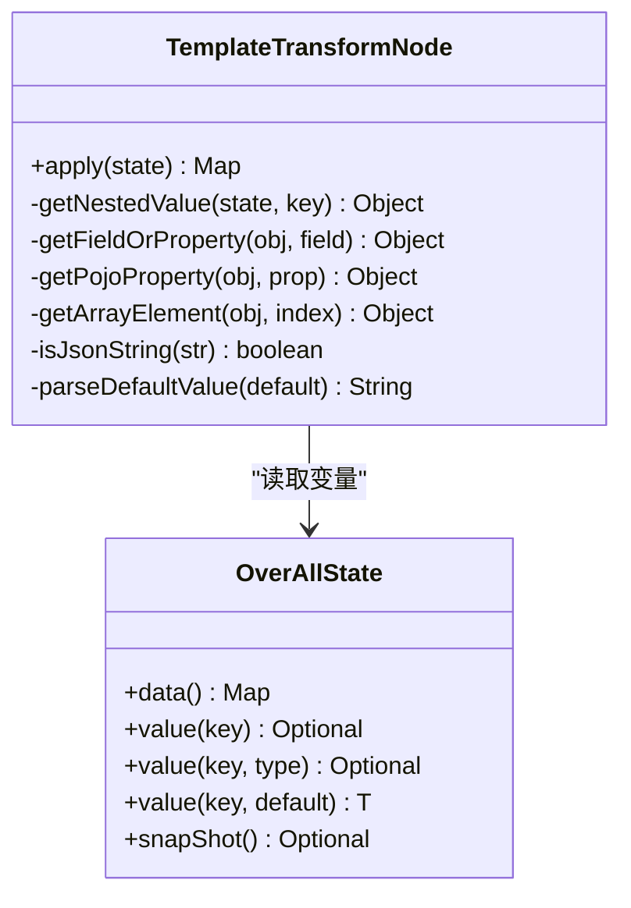
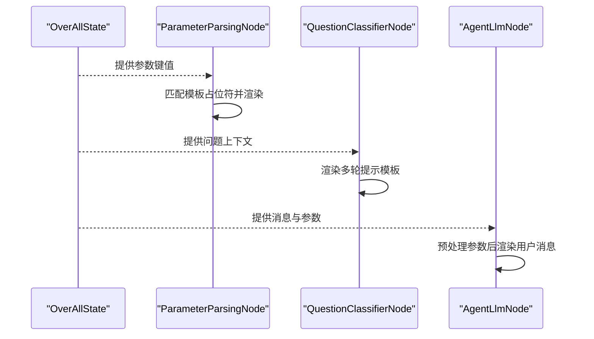
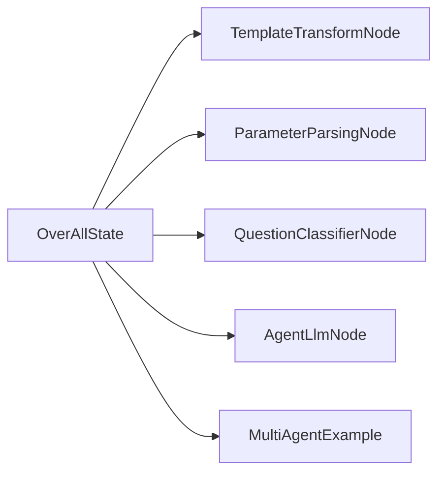

# 模板转换节点

<cite>
**本文引用的文件列表**
- [TemplateTransformNode.java](file://spring-boot-starters/spring-ai-alibaba-starter-builtin-nodes/src/main/java/com/alibaba/cloud/ai/graph/node/TemplateTransformNode.java)
- [TemplateTransformNodeTest.java](file://spring-boot-starters/spring-ai-alibaba-starter-builtin-nodes/src/test/java/com/alibaba/cloud/ai/graph/node/TemplateTransformNodeTest.java)
- [TemplateTransformNodeIntegrationTest.java](file://spring-boot-starters/spring-ai-alibaba-starter-builtin-nodes/src/test/java/com/alibaba/cloud/ai/graph/node/TemplateTransformNodeIntegrationTest.java)
- [OverAllState.java](file://spring-ai-alibaba-graph-core/src/main/java/com/alibaba/cloud/ai/graph/OverAllState.java)
- [ParameterParsingNode.java](file://spring-boot-starters/spring-ai-alibaba-starter-builtin-nodes/src/main/java/com/alibaba/cloud/ai/graph/node/ParameterParsingNode.java)
- [QuestionClassifierNode.java](file://spring-boot-starters/spring-ai-alibaba-starter-builtin-nodes/src/main/java/com/alibaba/cloud/ai/graph/node/QuestionClassifierNode.java)
- [AgentLlmNode.java](file://spring-ai-alibaba-agent-framework/src/main/java/com/alibaba/cloud/ai/graph/agent/node/AgentLlmNode.java)
- [MultiAgentExample.java](file://examples/documentation/src/main/java/com/alibaba/cloud/ai/examples/documentation/framework/advanced/MultiAgentExample.java)
</cite>

## 目录
1. [简介](#简介)
2. [项目结构](#项目结构)
3. [核心组件](#核心组件)
4. [架构总览](#架构总览)
5. [详细组件分析](#详细组件分析)
6. [依赖关系分析](#依赖关系分析)
7. [性能考量](#性能考量)
8. [故障排查指南](#故障排查指南)
9. [结论](#结论)
10. [附录](#附录)

## 简介
本文件系统性地介绍“模板转换节点”（TemplateTransformNode），说明其如何基于工作流的全局状态（OverAllState）进行动态内容生成与渲染，如何通过占位符语法与内置的“空值安全”机制（Elvis操作符）保障模板解析的健壮性，并给出在动态提示工程（Dynamic Prompt Engineering）与报告自动化等场景中的实践建议。同时，文档明确指出该节点采用的是自研占位符模板语法，而非Freemarker或Velocity等外部模板引擎，从而避免引入额外依赖与复杂度。

## 项目结构
- 模板转换节点位于启动器模块的内置节点包中，负责对输入模板进行占位符替换与输出键写回。
- 全局状态由图核心模块提供，统一承载工作流各阶段共享数据。
- 其他节点（如参数解析节点、问题分类节点、智能体LLM节点）展示了如何在不同场景下使用占位符模板与状态注入。

图表来源
- [TemplateTransformNode.java](file://spring-boot-starters/spring-ai-alibaba-starter-builtin-nodes/src/main/java/com/alibaba/cloud/ai/graph/node/TemplateTransformNode.java#L31-L124)
- [OverAllState.java](file://spring-ai-alibaba-graph-core/src/main/java/com/alibaba/cloud/ai/graph/OverAllState.java#L470-L537)
- [ParameterParsingNode.java](file://spring-boot-starters/spring-ai-alibaba-starter-builtin-nodes/src/main/java/com/alibaba/cloud/ai/graph/node/ParameterParsingNode.java#L140-L168)
- [QuestionClassifierNode.java](file://spring-boot-starters/spring-ai-alibaba-starter-builtin-nodes/src/main/java/com/alibaba/cloud/ai/graph/node/QuestionClassifierNode.java#L106-L138)
- [AgentLlmNode.java](file://spring-ai-alibaba-agent-framework/src/main/java/com/alibaba/cloud/ai/graph/agent/node/AgentLlmNode.java#L368-L410)
- [MultiAgentExample.java](file://examples/documentation/src/main/java/com/alibaba/cloud/ai/examples/documentation/framework/advanced/MultiAgentExample.java#L472-L513)

章节来源
- [TemplateTransformNode.java](file://spring-boot-starters/spring-ai-alibaba-starter-builtin-nodes/src/main/java/com/alibaba/cloud/ai/graph/node/TemplateTransformNode.java#L31-L124)
- [OverAllState.java](file://spring-ai-alibaba-graph-core/src/main/java/com/alibaba/cloud/ai/graph/OverAllState.java#L470-L537)

## 核心组件
- 模板转换节点（TemplateTransformNode）
  - 职责：从工作流全局状态中提取变量，按占位符语法进行替换，输出到指定键。
  - 关键能力：
    - 占位符语法：{{key}} 或 {{key ?: defaultValue}}（Elvis操作符）。
    - 嵌套访问：支持“点号路径”与“数组索引”，自动解析JSON字符串为对象后继续访问。
    - 空值安全：缺失键或空值时可回退默认值；null值按字符串“null”处理。
    - 输出键：可自定义输出键，默认为“result”。

- 全局状态（OverAllState）
  - 职责：集中存储与管理工作流共享数据，提供只读视图与类型安全的读取方法。
  - 与模板节点的关系：模板节点通过状态读取变量，写回结果到指定键。

章节来源
- [TemplateTransformNode.java](file://spring-boot-starters/spring-ai-alibaba-starter-builtin-nodes/src/main/java/com/alibaba/cloud/ai/graph/node/TemplateTransformNode.java#L31-L124)
- [OverAllState.java](file://spring-ai-alibaba-graph-core/src/main/java/com/alibaba/cloud/ai/graph/OverAllState.java#L470-L537)

## 架构总览
模板转换节点在工作流中的典型调用链如下：

图表来源
- [TemplateTransformNode.java](file://spring-boot-starters/spring-ai-alibaba-starter-builtin-nodes/src/main/java/com/alibaba/cloud/ai/graph/node/TemplateTransformNode.java#L70-L124)
- [OverAllState.java](file://spring-ai-alibaba-graph-core/src/main/java/com/alibaba/cloud/ai/graph/OverAllState.java#L470-L537)

## 详细组件分析

### 组件一：TemplateTransformNode 类与处理流程
- 占位符语法与Elvis操作符
  - 支持形如 {{key}} 的占位符，以及 {{key ?: defaultValue}} 的默认值回退。
  - 默认值支持单引号或双引号包裹，内部会去除引号后作为字符串使用。
- 嵌套访问与数组索引
  - 支持“点号路径”访问嵌套对象字段，如 {{user.name}}。
  - 支持“数组索引”访问，如 {{users[0].name}}。
  - 对根键为数组索引的情况（如 {{items[1]}}）也做了特殊处理。
- JSON字符串自动解析
  - 若状态中某键对应字符串且符合JSON格式，将自动解析为对象后再继续访问字段或数组元素。
  - 解析失败则保持原样，不抛异常，保证模板渲染的稳定性。
- 空值与缺失键处理
  - 变量存在但为null：输出“null”字符串。
  - 变量不存在或未在状态中出现：若提供默认值，则使用默认值；否则保留原始占位符。
- 输出键与返回结构
  - 默认输出键为“result”，可通过构建器自定义。
  - 返回值为包含输出键的映射，便于后续节点读取。

图表来源
- [TemplateTransformNode.java](file://spring-boot-starters/spring-ai-alibaba-starter-builtin-nodes/src/main/java/com/alibaba/cloud/ai/graph/node/TemplateTransformNode.java#L70-L124)
- [TemplateTransformNode.java](file://spring-boot-starters/spring-ai-alibaba-starter-builtin-nodes/src/main/java/com/alibaba/cloud/ai/graph/node/TemplateTransformNode.java#L126-L194)
- [TemplateTransformNode.java](file://spring-boot-starters/spring-ai-alibaba-starter-builtin-nodes/src/main/java/com/alibaba/cloud/ai/graph/node/TemplateTransformNode.java#L196-L315)
- [TemplateTransformNode.java](file://spring-boot-starters/spring-ai-alibaba-starter-builtin-nodes/src/main/java/com/alibaba/cloud/ai/graph/node/TemplateTransformNode.java#L317-L347)
- [TemplateTransformNode.java](file://spring-boot-starters/spring-ai-alibaba-starter-builtin-nodes/src/main/java/com/alibaba/cloud/ai/graph/node/TemplateTransformNode.java#L348-L367)

章节来源
- [TemplateTransformNode.java](file://spring-boot-starters/spring-ai-alibaba-starter-builtin-nodes/src/main/java/com/alibaba/cloud/ai/graph/node/TemplateTransformNode.java#L31-L124)
- [TemplateTransformNode.java](file://spring-boot-starters/spring-ai-alibaba-starter-builtin-nodes/src/main/java/com/alibaba/cloud/ai/graph/node/TemplateTransformNode.java#L126-L367)

### 组件二：与全局状态（OverAllState）的交互
- 读取方式
  - 通过状态提供的键值读取接口获取变量，支持泛型类型安全读取。
- 写回方式
  - 将模板渲染后的结果写入输出键，供下游节点消费。
- 状态特性
  - 提供不可变视图，避免并发修改风险。
  - 支持快照、合并策略等高级功能，便于调试与恢复。

图表来源
- [OverAllState.java](file://spring-ai-alibaba-graph-core/src/main/java/com/alibaba/cloud/ai/graph/OverAllState.java#L470-L537)
- [TemplateTransformNode.java](file://spring-boot-starters/spring-ai-alibaba-starter-builtin-nodes/src/main/java/com/alibaba/cloud/ai/graph/node/TemplateTransformNode.java#L126-L367)

章节来源
- [OverAllState.java](file://spring-ai-alibaba-graph-core/src/main/java/com/alibaba/cloud/ai/graph/OverAllState.java#L470-L537)
- [TemplateTransformNode.java](file://spring-boot-starters/spring-ai-alibaba-starter-builtin-nodes/src/main/java/com/alibaba/cloud/ai/graph/node/TemplateTransformNode.java#L126-L367)

### 组件三：与其他节点的协同（占位符模板与状态注入）
- 参数解析节点（ParameterParsingNode）
  - 展示了如何在指令模板中使用占位符语法，并结合状态注入生成最终提示文本。
- 问题分类节点（QuestionClassifierNode）
  - 同样采用占位符模板与状态注入的方式，生成多轮对话消息。
- 智能体LLM节点（AgentLlmNode）
  - 在渲染用户消息时，会对参数进行预处理，排除不适合的键与类型，再进行模板渲染。

图表来源
- [ParameterParsingNode.java](file://spring-boot-starters/spring-ai-alibaba-starter-builtin-nodes/src/main/java/com/alibaba/cloud/ai/graph/node/ParameterParsingNode.java#L140-L168)
- [QuestionClassifierNode.java](file://spring-boot-starters/spring-ai-alibaba-starter-builtin-nodes/src/main/java/com/alibaba/cloud/ai/graph/node/QuestionClassifierNode.java#L106-L138)
- [AgentLlmNode.java](file://spring-ai-alibaba-agent-framework/src/main/java/com/alibaba/cloud/ai/graph/agent/node/AgentLlmNode.java#L368-L410)

章节来源
- [ParameterParsingNode.java](file://spring-boot-starters/spring-ai-alibaba-starter-builtin-nodes/src/main/java/com/alibaba/cloud/ai/graph/node/ParameterParsingNode.java#L140-L168)
- [QuestionClassifierNode.java](file://spring-boot-starters/spring-ai-alibaba-starter-builtin-nodes/src/main/java/com/alibaba/cloud/ai/graph/node/QuestionClassifierNode.java#L106-L138)
- [AgentLlmNode.java](file://spring-ai-alibaba-agent-framework/src/main/java/com/alibaba/cloud/ai/graph/agent/node/AgentLlmNode.java#L368-L410)

### 组件四：测试覆盖与行为验证
- 基础占位符替换、多变量模板、缺失变量保留占位符、空值输出“null”、默认输出键、静态模板、空模板、大模板、特殊字符处理、复杂嵌套、数组索引、POJO反射访问、JSON字符串解析、多重Elvis操作符、越界数组索引、混合JSON与POJO访问等。
- 集成演示展示了基本模板替换、缺失变量保留占位符、复杂嵌套模板的输出效果。

章节来源
- [TemplateTransformNodeTest.java](file://spring-boot-starters/spring-ai-alibaba-starter-builtin-nodes/src/test/java/com/alibaba/cloud/ai/graph/node/TemplateTransformNodeTest.java#L33-L698)
- [TemplateTransformNodeIntegrationTest.java](file://spring-boot-starters/spring-ai-alibaba-starter-builtin-nodes/src/test/java/com/alibaba/cloud/ai/graph/node/TemplateTransformNodeIntegrationTest.java#L27-L68)

## 依赖关系分析
- TemplateTransformNode 依赖 OverAllState 进行变量读取与结果写回。
- 其他节点（ParameterParsingNode、QuestionClassifierNode、AgentLlmNode）展示了占位符模板与状态注入在不同场景下的通用模式。
- 示例工程 MultiAgentExample 展示了在多智能体场景中如何通过占位符模板传递工作流状态。

图表来源
- [OverAllState.java](file://spring-ai-alibaba-graph-core/src/main/java/com/alibaba/cloud/ai/graph/OverAllState.java#L470-L537)
- [TemplateTransformNode.java](file://spring-boot-starters/spring-ai-alibaba-starter-builtin-nodes/src/main/java/com/alibaba/cloud/ai/graph/node/TemplateTransformNode.java#L70-L124)
- [ParameterParsingNode.java](file://spring-boot-starters/spring-ai-alibaba-starter-builtin-nodes/src/main/java/com/alibaba/cloud/ai/graph/node/ParameterParsingNode.java#L140-L168)
- [QuestionClassifierNode.java](file://spring-boot-starters/spring-ai-alibaba-starter-builtin-nodes/src/main/java/com/alibaba/cloud/ai/graph/node/QuestionClassifierNode.java#L106-L138)
- [AgentLlmNode.java](file://spring-ai-alibaba-agent-framework/src/main/java/com/alibaba/cloud/ai/graph/agent/node/AgentLlmNode.java#L368-L410)
- [MultiAgentExample.java](file://examples/documentation/src/main/java/com/alibaba/cloud/ai/examples/documentation/framework/advanced/MultiAgentExample.java#L472-L513)

章节来源
- [TemplateTransformNode.java](file://spring-boot-starters/spring-ai-alibaba-starter-builtin-nodes/src/main/java/com/alibaba/cloud/ai/graph/node/TemplateTransformNode.java#L70-L124)
- [OverAllState.java](file://spring-ai-alibaba-graph-core/src/main/java/com/alibaba/cloud/ai/graph/OverAllState.java#L470-L537)

## 性能考量
- 正则匹配与字符串替换：对模板进行逐个占位符扫描与替换，时间复杂度与占位符数量线性相关。
- 嵌套访问与JSON解析：当使用“点号路径”或数组索引时，可能触发多次字段访问与一次JSON解析（若根键为JSON字符串）。建议尽量减少深层嵌套与重复解析。
- 大模板与大量变量：测试覆盖了大模板场景，建议在上游节点提前裁剪不必要的变量，避免模板过大导致渲染开销增加。
- 空值与默认值：Elvis操作符在缺失键或空值时快速回退，避免复杂逻辑分支，有利于稳定性能。

## 故障排查指南
- 模板为空或仅空白字符
  - 行为：返回空字符串到输出键。
  - 排查：确认模板构建器传入的模板非空。
- 缺失变量或空值
  - 行为：缺失变量保留占位符；空值输出“null”；若提供默认值则使用默认值。
  - 排查：检查状态中是否存在该键，或是否应使用Elvis操作符提供默认值。
- 数组索引越界
  - 行为：越界时保留占位符，不抛异常。
  - 排查：在上游节点确保索引合法，或使用Elvis操作符兜底。
- JSON字符串解析失败
  - 行为：解析失败时保持原样，不抛异常，占位符保留。
  - 排查：确认字符串为合法JSON格式，或在上游节点进行校验。
- 输出键冲突
  - 行为：默认输出键为“result”，可通过构建器自定义。
  - 排查：避免与已有状态键冲突，必要时设置自定义输出键。

章节来源
- [TemplateTransformNode.java](file://spring-boot-starters/spring-ai-alibaba-starter-builtin-nodes/src/main/java/com/alibaba/cloud/ai/graph/node/TemplateTransformNode.java#L70-L124)
- [TemplateTransformNodeTest.java](file://spring-boot-starters/spring-ai-alibaba-starter-builtin-nodes/src/test/java/com/alibaba/cloud/ai/graph/node/TemplateTransformNodeTest.java#L33-L698)

## 结论
TemplateTransformNode 提供了轻量、稳定、可扩展的占位符模板渲染能力，能够无缝对接工作流全局状态，满足动态提示工程与报告自动化等场景的需求。其内置的Elvis操作符与JSON自动解析机制显著提升了模板的容错性与表达力。由于采用自研占位符语法，无需引入外部模板引擎依赖，简化了部署与维护成本。

## 附录

### 模板语法与内置函数说明
- 占位符语法
  - {{key}}：直接替换为状态中对应键的值。
  - {{key ?: defaultValue}}：当键不存在或为空时，使用默认值。默认值支持单引号或双引号包裹，内部会去除引号。
- 嵌套访问
  - 支持“点号路径”访问嵌套对象字段，如 {{user.name}}。
  - 支持“数组索引”访问，如 {{users[0].name}} 或 {{items[1]}}。
- JSON字符串解析
  - 当根键为合法JSON字符串时，自动解析为对象后再继续访问字段或数组元素。
- 空值与缺失键处理
  - 存在但为null：输出“null”字符串。
  - 不存在或未在状态中出现：若提供默认值则使用默认值；否则保留原始占位符。
- 输出键
  - 默认输出键为“result”，可通过构建器自定义。

章节来源
- [TemplateTransformNode.java](file://spring-boot-starters/spring-ai-alibaba-starter-builtin-nodes/src/main/java/com/alibaba/cloud/ai/graph/node/TemplateTransformNode.java#L31-L124)
- [TemplateTransformNode.java](file://spring-boot-starters/spring-ai-alibaba-starter-builtin-nodes/src/main/java/com/alibaba/cloud/ai/graph/node/TemplateTransformNode.java#L126-L367)

### 配置示例与最佳实践
- 基本模板替换
  - 使用构建器设置模板与输出键，将渲染结果写入指定键供下游节点使用。
- 动态提示工程（Dynamic Prompt Engineering）
  - 在提示模板中使用占位符，结合状态中的上下文变量生成动态提示。
  - 示例参考：参数解析节点与问题分类节点的占位符模板渲染方式。
- 报告自动化
  - 将结构化数据（如JSON、XML）作为状态键，通过占位符模板生成报告正文。
  - 建议：在上游节点完成数据清洗与格式化，避免模板中做复杂逻辑。
- 代码片段生成
  - 将代码模板与变量注入，生成目标语言的代码片段。
  - 建议：使用Elvis操作符为可选字段提供默认值，提升模板鲁棒性。

章节来源
- [TemplateTransformNodeIntegrationTest.java](file://spring-boot-starters/spring-ai-alibaba-starter-builtin-nodes/src/test/java/com/alibaba/cloud/ai/graph/node/TemplateTransformNodeIntegrationTest.java#L27-L68)
- [ParameterParsingNode.java](file://spring-boot-starters/spring-ai-alibaba-starter-builtin-nodes/src/main/java/com/alibaba/cloud/ai/graph/node/ParameterParsingNode.java#L140-L168)
- [QuestionClassifierNode.java](file://spring-boot-starters/spring-ai-alibaba-starter-builtin-nodes/src/main/java/com/alibaba/cloud/ai/graph/node/QuestionClassifierNode.java#L106-L138)
- [MultiAgentExample.java](file://examples/documentation/src/main/java/com/alibaba/cloud/ai/examples/documentation/framework/advanced/MultiAgentExample.java#L472-L513)

### 与Freemarker/Velocity的关系
- 本项目未引入外部模板引擎（如Freemarker或Velocity），而是采用自研占位符模板语法与状态注入机制。
- 若未来需要更复杂的模板控制流或宏功能，可在现有基础上扩展或引入外部引擎，但需评估依赖与集成成本。