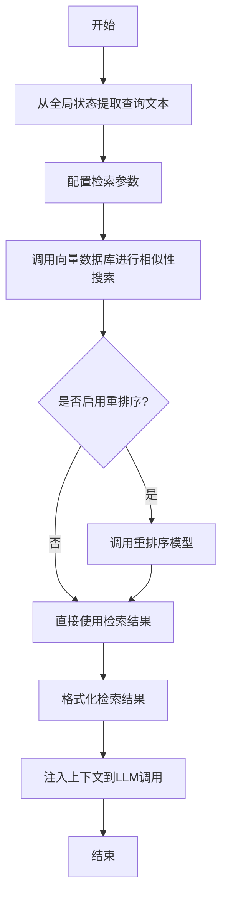
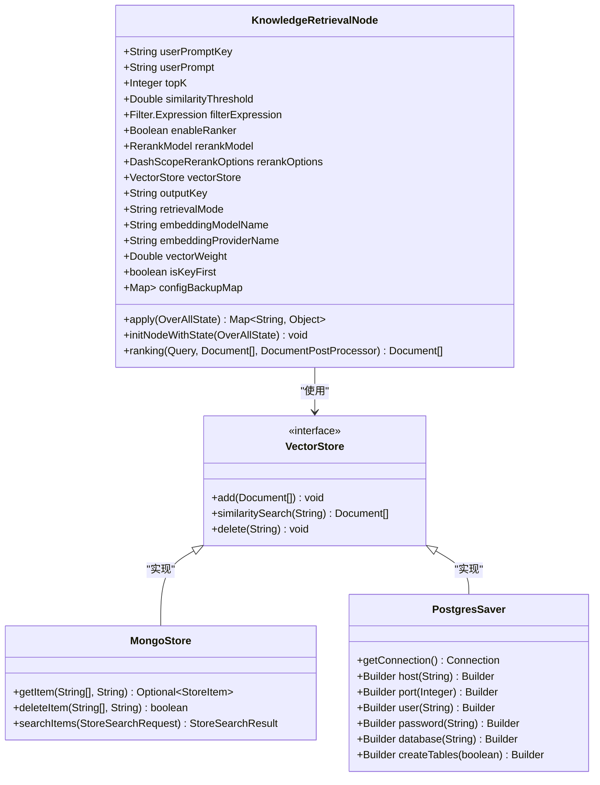
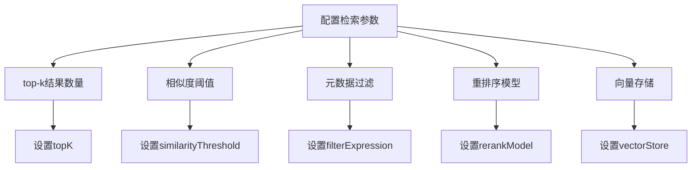
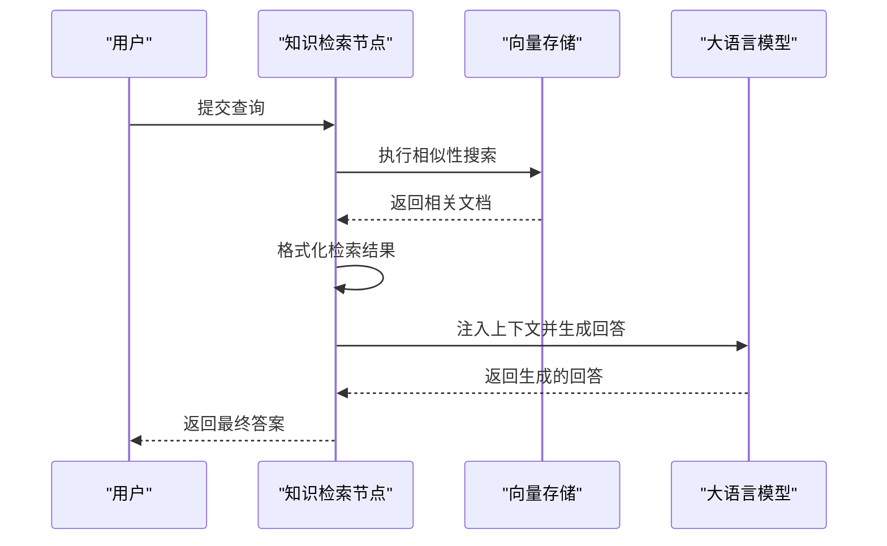
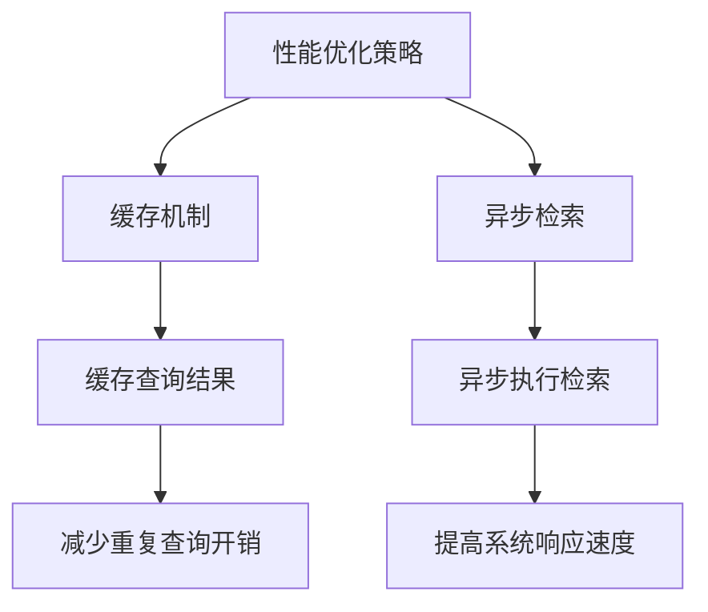

# 知识检索节点

<cite>
**本文档引用的文件**   
- [KnowledgeRetrievalNode.java](file://spring-boot-starters/spring-ai-alibaba-starter-builtin-nodes/src/main/java/com/alibaba/cloud/ai/graph/node/KnowledgeRetrievalNode.java)
- [KnowledgeRetrievalNodeTest.java](file://spring-boot-starters/spring-ai-alibaba-starter-builtin-nodes/src/test/java/com/alibaba/cloud/ai/graph/node/KnowledgeRetrievalNodeTest.java)
- [RAGExample.java](file://examples/documentation/src/main/java/com/alibaba/cloud/ai/examples/documentation/framework/advanced/RAGExample.java)
- [QuickStartExample.java](file://examples/documentation/src/main/java/com/alibaba/cloud/ai/examples/documentation/graph/QuickStartExample.java)
- [MongoStore.java](file://spring-ai-alibaba-graph-core/src/main/java/com/alibaba/cloud/ai/graph/store/stores/MongoStore.java)
- [PostgresSaver.java](file://spring-ai-alibaba-graph-core/src/main/java/com/alibaba/cloud/ai/graph/checkpoint/savers/postgresql/PostgresSaver.java)
</cite>

## 目录
1. [简介](#简介)
2. [核心组件](#核心组件)
3. [内部工作流程](#内部工作流程)
4. [向量存储后端集成](#向量存储后端集成)
5. [检索参数配置](#检索参数配置)
6. [端到端使用示例](#端到端使用示例)
7. [性能优化策略](#性能优化策略)
8. [结论](#结论)

## 简介
知识检索节点是实现检索增强生成（RAG）模式的核心组件。它通过从全局状态中提取查询文本，调用向量数据库进行相似性搜索，并将检索到的上下文片段格式化后注入到后续的LLM调用中，从而为大语言模型提供外部知识支持。该节点支持多种向量存储后端和灵活的配置选项，能够有效提升问答系统的准确性和可靠性。

## 核心组件

知识检索节点实现了`NodeAction`接口，主要负责从向量存储中检索相关文档，并将这些文档作为上下文注入到后续的LLM调用中。其核心功能包括从全局状态提取查询文本、配置检索参数、执行相似性搜索以及格式化检索结果。

**Section sources**
- [KnowledgeRetrievalNode.java](file://spring-boot-starters/spring-ai-alibaba-starter-builtin-nodes/src/main/java/com/alibaba/cloud/ai/graph/node/KnowledgeRetrievalNode.java#L46-L459)

## 内部工作流程

知识检索节点的工作流程主要包括以下几个步骤：首先从全局状态中提取用户查询文本，然后根据配置的检索参数调用向量数据库进行相似性搜索，接着对检索结果进行重排序（如果启用），最后将检索到的上下文片段格式化并注入到后续的LLM调用中。

**Diagram sources **
- [KnowledgeRetrievalNode.java](file://spring-boot-starters/spring-ai-alibaba-starter-builtin-nodes/src/main/java/com/alibaba/cloud/ai/graph/node/KnowledgeRetrievalNode.java#L117-L146)

## 向量存储后端集成

知识检索节点支持与多种向量存储后端集成，包括Milvus、Elasticsearch等。通过配置`vectorStore`属性，可以指定不同的向量存储实现。例如，可以通过`MongoStore`或`PostgresSaver`来实现与MongoDB或PostgreSQL的集成。

**Diagram sources **
- [KnowledgeRetrievalNode.java](file://spring-boot-starters/spring-ai-alibaba-starter-builtin-nodes/src/main/java/com/alibaba/cloud/ai/graph/node/KnowledgeRetrievalNode.java#L78-L78)
- [MongoStore.java](file://spring-ai-alibaba-graph-core/src/main/java/com/alibaba/cloud/ai/graph/store/stores/MongoStore.java#L37-L41)
- [PostgresSaver.java](file://spring-ai-alibaba-graph-core/src/main/java/com/alibaba/cloud/ai/graph/checkpoint/savers/postgresql/PostgresSaver.java#L436-L480)

## 检索参数配置

知识检索节点提供了丰富的检索参数配置选项，包括top-k结果数量、相似度阈值和元数据过滤等。这些参数可以通过构造函数或构建器进行设置，也可以在运行时从全局状态中动态获取。

**Diagram sources **
- [KnowledgeRetrievalNode.java](file://spring-boot-starters/spring-ai-alibaba-starter-builtin-nodes/src/main/java/com/alibaba/cloud/ai/graph/node/KnowledgeRetrievalNode.java#L52-L78)

## 端到端使用示例

以下是一个基于私有知识库的问答工作流示例。该示例展示了如何使用知识检索节点构建一个完整的RAG系统，包括知识库的构建、两步RAG、Agentic RAG和混合RAG。

**Diagram sources **
- [RAGExample.java](file://examples/documentation/src/main/java/com/alibaba/cloud/ai/examples/documentation/framework/advanced/RAGExample.java#L125-L138)
- [QuickStartExample.java](file://examples/documentation/src/main/java/com/alibaba/cloud/ai/examples/documentation/graph/QuickStartExample.java#L508-L564)

## 性能优化策略

为了提高知识检索节点的性能，可以采用缓存机制和异步检索等策略。缓存机制可以减少重复查询的开销，而异步检索则可以在后台执行耗时的检索操作，从而提高系统的响应速度。

**Diagram sources **
- [KnowledgeRetrievalNode.java](file://spring-boot-starters/spring-ai-alibaba-starter-builtin-nodes/src/main/java/com/alibaba/cloud/ai/graph/node/KnowledgeRetrievalNode.java#L97-L98)

## 结论

知识检索节点是实现RAG模式的关键组件，它通过高效的检索和上下文注入机制，显著提升了大语言模型在特定领域问答任务中的表现。通过灵活的配置选项和多种向量存储后端的支持，该节点能够适应不同的应用场景和需求。未来的工作可以进一步探索更高级的检索算法和优化策略，以进一步提升系统的性能和准确性。