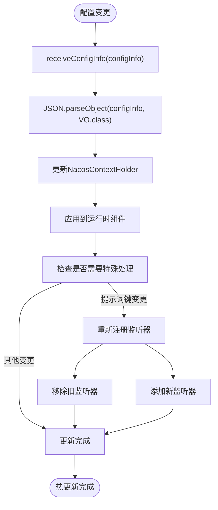

# 配置-Nacos集成

<cite>
**本文档中引用的文件**  
- [NacosAgentBuilderFactory.java](file://spring-boot-starters/spring-ai-alibaba-starter-config-nacos/src/main/java/com/alibaba/cloud/ai/agent/nacos/NacosAgentBuilderFactory.java)
- [NacosAgentInjector.java](file://spring-boot-starters/spring-ai-alibaba-starter-config-nacos/src/main/java/com/alibaba/cloud/ai/agent/nacos/NacosAgentInjector.java)
- [NacosAgentPromptBuilder.java](file://spring-boot-starters/spring-ai-alibaba-starter-config-nacos/src/main/java/com/alibaba/cloud/ai/agent/nacos/NacosAgentPromptBuilder.java)
- [NacosPromptInjector.java](file://spring-boot-starters/spring-ai-alibaba-starter-config-nacos/src/main/java/com/alibaba/cloud/ai/agent/nacos/NacosPromptInjector.java)
- [NacosModelInjector.java](file://spring-boot-starters/spring-ai-alibaba-starter-config-nacos/src/main/java/com/alibaba/cloud/ai/agent/nacos/NacosModelInjector.java)
- [NacosOptions.java](file://spring-boot-starters/spring-ai-alibaba-starter-config-nacos/src/main/java/com/alibaba/cloud/ai/agent/nacos/NacosOptions.java)
- [NacosReactAgentBuilder.java](file://spring-boot-starters/spring-ai-alibaba-starter-config-nacos/src/main/java/com/alibaba/cloud/ai/agent/nacos/NacosReactAgentBuilder.java)
- [NacosContextHolder.java](file://spring-boot-starters/spring-ai-alibaba-starter-config-nacos/src/main/java/com/alibaba/cloud/ai/agent/nacos/NacosContextHolder.java)
- [NacosMcpToolsInjector.java](file://spring-boot-starters/spring-ai-alibaba-starter-config-nacos/src/main/java/com/alibaba/cloud/ai/agent/nacos/NacosMcpToolsInjector.java)
- [NacosMcpGatewayToolsInitializer.java](file://spring-boot-starters/spring-ai-alibaba-starter-config-nacos/src/main/java/com/alibaba/cloud/ai/agent/nacos/tools/NacosMcpGatewayToolsInitializer.java)
- [AgentVO.java](file://spring-boot-starters/spring-ai-alibaba-starter-config-nacos/src/main/java/com/alibaba/cloud/ai/agent/nacos/vo/AgentVO.java)
- [PromptVO.java](file://spring-boot-starters/spring-ai-alibaba-starter-config-nacos/src/main/java/com/alibaba/cloud/ai/agent/nacos/vo/PromptVO.java)
- [ModelVO.java](file://spring-boot-starters/spring-ai-alibaba-starter-config-nacos/src/main/java/com/alibaba/cloud/ai/agent/nacos/vo/ModelVO.java)
- [McpServersVO.java](file://spring-boot-starters/spring-ai-alibaba-starter-config-nacos/src/main/java/com/alibaba/cloud/ai/agent/nacos/vo/McpServersVO.java)
- [ObservationConfiguration.java](file://spring-boot-starters/spring-ai-alibaba-starter-config-nacos/src/main/java/com/alibaba/cloud/ai/agent/nacos/ObservationConfiguration.java)
- [ChatOptionsProxy.java](file://spring-boot-starters/spring-ai-alibaba-starter-config-nacos/src/main/java/com/alibaba/cloud/ai/agent/nacos/utils/ChatOptionsProxy.java)
</cite>

## 目录
1. [简介](#简介)
2. [核心配置结构](#核心配置结构)
3. [NacosAgentConfig配置体系](#nacosagentconfig配置体系)
4. [注入器工作原理](#注入器工作原理)
5. [提示词动态构建](#提示词动态构建)
6. [MCP工具初始化](#mcp工具初始化)
7. [配置热更新机制](#配置热更新机制)
8. [配置示例与最佳实践](#配置示例与最佳实践)
9. [版本管理与安全性](#版本管理与安全性)
10. [总结](#总结)

## 简介

本文档详细阐述了Spring AI Alibaba框架中配置-Nacos集成的实现机制。该集成方案通过Nacos配置中心实现了AI代理各项配置的动态加载与管理，支持代理、模型、提示词（Prompt）、记忆（Memory）和合作伙伴代理（Partner Agents）等核心组件的远程配置。通过NacosAgentBuilderFactory、NacosPromptInjector、NacosModelInjector等组件，系统能够在运行时从Nacos动态获取配置并注入到代理构建流程中，实现配置的热更新和灵活管理。

**Section sources**
- [NacosAgentBuilderFactory.java](file://spring-boot-starters/spring-ai-alibaba-starter-config-nacos/src/main/java/com/alibaba/cloud/ai/agent/nacos/NacosAgentBuilderFactory.java#L1-L35)
- [NacosReactAgentBuilder.java](file://spring-boot-starters/spring-ai-alibaba-starter-config-nacos/src/main/java/com/alibaba/cloud/ai/agent/nacos/NacosReactAgentBuilder.java#L1-L361)

## 核心配置结构

Nacos集成方案的核心是将AI代理的各项配置以结构化的方式存储在Nacos配置中心。主要配置包括：

- **代理基础配置**：存储在`agent-base.json`中，包含代理的描述、最大迭代次数等基本信息
- **提示词配置**：存储在`prompt-{key}.json`中，包含提示词模板、版本信息和变量定义
- **模型配置**：存储在`model.json`中，包含模型的API地址、密钥、模型名称、温度和最大令牌数等参数
- **MCP服务器配置**：存储在`mcp-servers.json`中，定义了可调用的MCP（Model Context Protocol）工具服务器

这些配置通过NacosOptions对象进行统一管理，并通过不同的注入器加载到运行时环境中。

**Section sources**
- [NacosOptions.java](file://spring-boot-starters/spring-ai-alibaba-starter-config-nacos/src/main/java/com/alibaba/cloud/ai/agent/nacos/NacosOptions.java#L1-L185)
- [AgentVO.java](file://spring-boot-starters/spring-ai-alibaba-starter-config-nacos/src/main/java/com/alibaba/cloud/ai/agent/nacos/vo/AgentVO.java#L1-L51)
- [PromptVO.java](file://spring-boot-starters/spring-ai-alibaba-starter-config-nacos/src/main/java/com/alibaba/cloud/ai/agent/nacos/vo/PromptVO.java#L1-L64)
- [ModelVO.java](file://spring-boot-starters/spring-ai-alibaba-starter-config-nacos/src/main/java/com/alibaba/cloud/ai/agent/nacos/vo/ModelVO.java#L1-L70)
- [McpServersVO.java](file://spring-boot-starters/spring-ai-alibaba-starter-config-nacos/src/main/java/com/alibaba/cloud/ai/agent/nacos/vo/McpServersVO.java#L1-L92)

## NacosAgentConfig配置体系

NacosAgentConfig配置体系通过一系列VO（Value Object）类来组织和管理AI代理的配置。这些VO类定义了配置的结构和属性，确保配置的类型安全和可维护性。

### AgentVO配置

AgentVO类定义了代理的基础配置，包括：
- `promptKey`：关联的提示词键
- `description`：代理描述
- `maxIterations`：最大迭代次数

该配置存储在Nacos的`agent-base.json`配置项中，是代理的核心元数据。

### PromptVO配置

PromptVO类定义了提示词的完整配置，包括：
- `promptKey`：提示词键
- `version`：版本号
- `template`：提示词模板
- `variables`：模板变量列表

提示词配置支持动态更新，系统会监听对应配置项的变化并实时更新运行时的提示词。

### ModelVO配置

ModelVO类定义了模型的连接和调用参数，包括：
- `baseUrl`：模型API基础地址
- `apiKey`：认证密钥
- `model`：模型名称
- `temperature`：温度参数
- `maxTokens`：最大令牌数

模型配置同样支持热更新，当配置发生变化时，系统会创建新的模型实例并替换运行时的模型。

**Section sources**
- [AgentVO.java](file://spring-boot-starters/spring-ai-alibaba-starter-config-nacos/src/main/java/com/alibaba/cloud/ai/agent/nacos/vo/AgentVO.java#L1-L51)
- [PromptVO.java](file://spring-boot-starters/spring-ai-alibaba-starter-config-nacos/src/main/java/com/alibaba/cloud/ai/agent/nacos/vo/PromptVO.java#L1-L64)
- [ModelVO.java](file://spring-boot-starters/spring-ai-alibaba-starter-config-nacos/src/main/java/com/alibaba/cloud/ai/agent/nacos/vo/ModelVO.java#L1-L70)

## 注入器工作原理

Nacos集成方案通过一系列注入器将远程配置注入到运行时的代理构建过程中。这些注入器负责从Nacos获取配置、解析配置并将其应用到相应的组件中。

### NacosPromptInjector

NacosPromptInjector负责从Nacos加载提示词配置。其工作流程如下：
1. 根据提示词键构造Nacos的Data ID（如`prompt-{key}.json`）
2. 通过NacosConfigService获取配置内容
3. 使用FastJSON将JSON配置反序列化为PromptVO对象
4. 返回配置对象供构建器使用

该注入器支持配置加密，可通过`promptEncrypted`参数启用加密配置的加载。


**Diagram sources**
- [NacosPromptInjector.java](file://spring-boot-starters/spring-ai-alibaba-starter-config-nacos/src/main/java/com/alibaba/cloud/ai/agent/nacos/NacosPromptInjector.java#L1-L44)
- [PromptVO.java](file://spring-boot-starters/spring-ai-alibaba-starter-config-nacos/src/main/java/com/alibaba/cloud/ai/agent/nacos/vo/PromptVO.java#L1-L64)

### NacosModelInjector

NacosModelInjector负责从Nacos加载模型配置并动态替换运行时的模型。其工作原理更为复杂，涉及反射和字节码操作：

1. 从Nacos加载模型配置并解析为ModelVO
2. 使用反射获取ChatClient内部的defaultChatClientRequest对象
3. 通过修改final字段的方式替换其中的chatModel和chatOptions
4. 创建新的OpenAiChatModel实例并注入新的配置

该注入器特别处理了Java的final字段限制，通过反射修改字段修饰符来实现运行时的模型替换。


**Diagram sources**
- [NacosModelInjector.java](file://spring-boot-starters/spring-ai-alibaba-starter-config-nacos/src/main/java/com/alibaba/cloud/ai/agent/nacos/NacosModelInjector.java#L1-L111)
- [ModelVO.java](file://spring-boot-starters/spring-ai-alibaba-starter-config-nacos/src/main/java/com/alibaba/cloud/ai/agent/nacos/vo/ModelVO.java#L1-L70)

**Section sources**
- [NacosModelInjector.java](file://spring-boot-starters/spring-ai-alibaba-starter-config-nacos/src/main/java/com/alibaba/cloud/ai/agent/nacos/NacosModelInjector.java#L1-L111)

## 提示词动态构建

NacosAgentPromptBuilder是负责根据Nacos配置动态构建代理提示词的核心组件。它继承自DefaultBuilder，并重写了build方法以集成Nacos配置。

### 构建流程

1. **加载提示词配置**：通过NacosPromptInjector获取指定promptKey的提示词配置
2. **设置指令模板**：将获取的模板设置为代理的instruction
3. **创建代理实例**：调用父类的build方法创建ReactAgent实例
4. **注册监听器**：为提示词配置注册监听器，实现热更新

### 元数据注入

NacosAgentPromptBuilder还负责将配置的元数据注入到观察系统中。通过ChatOptionsProxy创建的代理对象，可以同时实现ChatOptions和ObservationMetadataAwareOptions接口，从而在不修改原有类结构的情况下添加元数据功能。


**Diagram sources**
- [NacosAgentPromptBuilder.java](file://spring-boot-starters/spring-ai-alibaba-starter-config-nacos/src/main/java/com/alibaba/cloud/ai/agent/nacos/NacosAgentPromptBuilder.java#L1-L110)
- [ChatOptionsProxy.java](file://spring-boot-starters/spring-ai-alibaba-starter-config-nacos/src/main/java/com/alibaba/cloud/ai/agent/nacos/utils/ChatOptionsProxy.java#L1-L210)

**Section sources**
- [NacosAgentPromptBuilder.java](file://spring-boot-starters/spring-ai-alibaba-starter-config-nacos/src/main/java/com/alibaba/cloud/ai/agent/nacos/NacosAgentPromptBuilder.java#L1-L110)

## MCP工具初始化

NacosMcpGatewayToolsInitializer负责根据Nacos中的MCP服务器配置初始化可用的工具集。它通过NacosMcpOperationService与Nacos的MCP服务进行交互，动态加载和配置工具。

### 初始化流程

1. **获取服务列表**：从McpServersVO中获取要初始化的MCP服务器名称列表
2. **查询服务详情**：通过NacosMcpOperationService获取每个服务器的详细信息
3. **解析工具定义**：从服务详情中提取工具规范（ToolSpecification）
4. **创建工具回调**：为每个工具创建NacosMcpGatewayToolCallback实例
5. **应用访问控制**：根据whiteTools白名单过滤可用工具

### 工具回调机制

每个工具都包装在NacosMcpGatewayToolCallback中，该回调负责：
- 处理工具调用请求
- 添加必要的请求头和查询参数
- 与远程MCP服务器通信
- 处理响应和错误


**Diagram sources**
- [NacosMcpGatewayToolsInitializer.java](file://spring-boot-starters/spring-ai-alibaba-starter-config-nacos/src/main/java/com/alibaba/cloud/ai/agent/nacos/tools/NacosMcpGatewayToolsInitializer.java#L1-L138)
- [NacosMcpToolsInjector.java](file://spring-boot-starters/spring-ai-alibaba-starter-config-nacos/src/main/java/com/alibaba/cloud/ai/agent/nacos/NacosMcpToolsInjector.java#L1-L55)

**Section sources**
- [NacosMcpGatewayToolsInitializer.java](file://spring-boot-starters/spring-ai-alibaba-starter-config-nacos/src/main/java/com/alibaba/cloud/ai/agent/nacos/tools/NacosMcpGatewayToolsInitializer.java#L1-L138)

## 配置热更新机制

Nacos集成方案的核心优势之一是支持配置的热更新。系统通过Nacos的监听器机制，能够在配置发生变化时自动更新运行时的代理配置，无需重启应用。

### 监听器注册

在NacosReactAgentBuilder的build方法中，系统为各类配置注册了监听器：

- **代理基础监听器**：监听`agent-base.json`的变化，可更新代理描述和提示词键
- **提示词监听器**：监听`prompt-{key}.json`的变化，实时更新提示词模板
- **模型监听器**：监听`model.json`的变化，动态替换模型实例
- **MCP服务器监听器**：监听`mcp-servers.json`的变化，重新初始化工具集

### 变更处理

当配置发生变化时，监听器的receiveConfigInfo方法会被调用：
1. 解析新的配置内容
2. 更新NacosContextHolder中的缓存
3. 调用相应的setter方法更新运行时状态
4. 对于提示词键变更，还会注册新的监听器并移除旧的监听器

这种机制确保了配置更新的原子性和一致性，避免了配置不一致导致的问题。



**Diagram sources**
- [NacosReactAgentBuilder.java](file://spring-boot-starters/spring-ai-alibaba-starter-config-nacos/src/main/java/com/alibaba/cloud/ai/agent/nacos/NacosReactAgentBuilder.java#L1-L361)
- [NacosContextHolder.java](file://spring-boot-starters/spring-ai-alibaba-starter-config-nacos/src/main/java/com/alibaba/cloud/ai/agent/nacos/NacosContextHolder.java#L1-L102)

**Section sources**
- [NacosReactAgentBuilder.java](file://spring-boot-starters/spring-ai-alibaba-starter-config-nacos/src/main/java/com/alibaba/cloud/ai/agent/nacos/NacosReactAgentBuilder.java#L1-L361)

## 配置示例与最佳实践

### Nacos配置组织

在Nacos中，建议按以下方式组织AI代理的配置：

```
配置分组: nacos-ai-meta
├── prompt-chatbot.json          # 聊天机器人提示词
├── prompt-research.json         # 研究助手提示词
├── model.json                   # 模型通用配置
└── mcp-servers.json             # MCP工具服务器列表

配置分组: ai-agent-{agentName}
├── agent-base.json              # 代理基础配置
└── model.json                   # 代理特定模型配置
```

### 配置文件示例

**agent-base.json**
```json
{
  "promptKey": "chatbot",
  "description": "聊天机器人代理",
  "maxIterations": 10
}
```

**prompt-chatbot.json**
```json
{
  "promptKey": "chatbot",
  "version": "1.0.0",
  "template": "你是一个友好的聊天助手，要以{tone}的语气回答用户问题。",
  "variables": ["tone"]
}
```

**model.json**
```json
{
  "baseUrl": "https://api.openai.com/v1",
  "apiKey": "sk-xxx",
  "model": "gpt-4",
  "temperature": "0.7",
  "maxTokens": "2048"
}
```

### 最佳实践

1. **配置分离**：将通用配置和代理特定配置分离，便于复用和管理
2. **版本控制**：为提示词配置添加版本号，便于回滚和灰度发布
3. **加密存储**：对敏感配置（如API密钥）启用加密存储
4. **灰度发布**：通过Nacos的灰度功能，逐步验证新配置的效果
5. **监控告警**：监控配置加载和更新的健康状态，及时发现异常

**Section sources**
- [NacosOptions.java](file://spring-boot-starters/spring-ai-alibaba-starter-config-nacos/src/main/java/com/alibaba/cloud/ai/agent/nacos/NacosOptions.java#L1-L185)
- [NacosAgentInjector.java](file://spring-boot-starters/spring-ai-alibaba-starter-config-nacos/src/main/java/com/alibaba/cloud/ai/agent/nacos/NacosAgentInjector.java#L1-L42)

## 版本管理与安全性

### 版本管理

Nacos本身提供了完善的配置版本管理功能，结合本集成方案，可以实现：
- **配置历史**：查看配置的修改历史和变更内容
- **版本回滚**：快速回滚到任意历史版本
- **灰度发布**：先在部分实例上验证新配置，再全量发布
- **多环境管理**：通过不同的命名空间管理开发、测试、生产环境的配置

### 安全性考虑

本集成方案提供了多层次的安全保障：

1. **配置加密**：支持通过`cipher-kms-aes-256-`前缀启用KMS加密的配置项
2. **访问控制**：通过Nacos的权限系统控制配置的读写权限
3. **敏感信息保护**：避免在日志中输出API密钥等敏感信息
4. **工具白名单**：通过whiteTools字段限制可调用的工具集
5. **HTTPS通信**：确保与Nacos服务器的通信是加密的

### 观察性配置

通过ObservationConfiguration类，系统还支持将配置信息注入到观察系统中，便于监控和追踪：
- **元数据注入**：将提示词键、版本等信息作为观察元数据
- **调用追踪**：记录模型调用、工具调用的详细信息
- **性能监控**：监控配置加载和更新的性能指标

**Section sources**
- [NacosOptions.java](file://spring-boot-starters/spring-ai-alibaba-starter-config-nacos/src/main/java/com/alibaba/cloud/ai/agent/nacos/NacosOptions.java#L1-L185)
- [ObservationConfiguration.java](file://spring-boot-starters/spring-ai-alibaba-starter-config-nacos/src/main/java/com/alibaba/cloud/ai/agent/nacos/ObservationConfiguration.java#L1-L76)

## 总结

Spring AI Alibaba的Nacos集成方案提供了一套完整的AI代理配置管理解决方案。通过将代理、模型、提示词和工具的配置集中管理在Nacos中，实现了配置的动态化、可追溯和可管理。核心组件如NacosAgentBuilderFactory、NacosPromptInjector和NacosModelInjector协同工作，确保配置能够高效、安全地加载到运行时环境中。

该方案的关键优势包括：
- **动态更新**：支持配置热更新，无需重启应用
- **集中管理**：所有配置集中存储，便于维护和审计
- **灵活扩展**：通过VO类和注入器模式，易于扩展新的配置类型
- **安全可靠**：支持配置加密和访问控制，保障配置安全
- **观察性强**：与观察系统集成，提供完整的监控能力

通过遵循本文档中的最佳实践，用户可以充分利用Nacos集成方案的优势，构建灵活、可维护的AI代理系统。