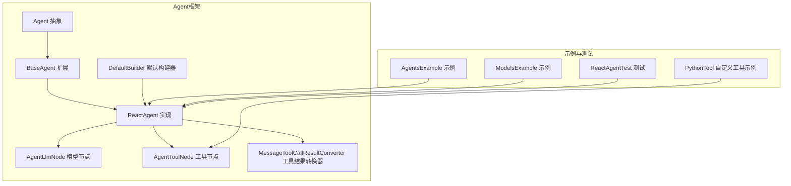
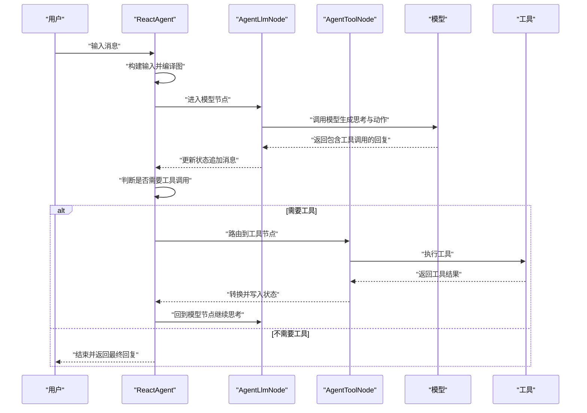
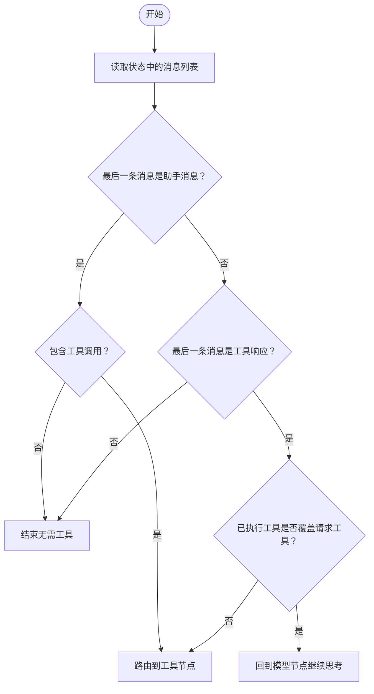
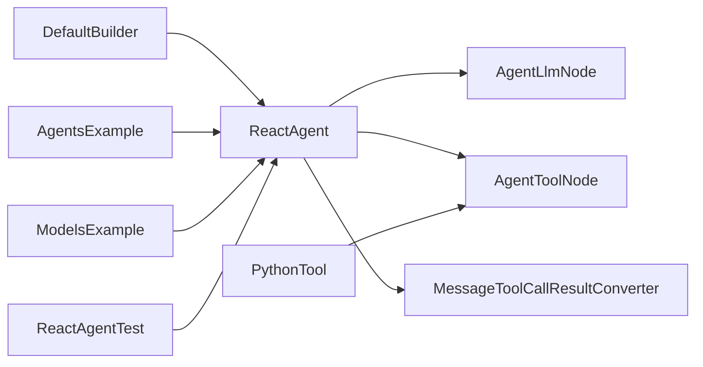

# React代理

<cite>
**本文引用的文件列表**
- [ReactAgent.java](file://spring-ai-alibaba-agent-framework/src/main/java/com/alibaba/cloud/ai/graph/agent/ReactAgent.java)
- [BaseAgent.java](file://spring-ai-alibaba-agent-framework/src/main/java/com/alibaba/cloud/ai/graph/agent/BaseAgent.java)
- [Agent.java](file://spring-ai-alibaba-agent-framework/src/main/java/com/alibaba/cloud/ai/graph/agent/Agent.java)
- [MessageToolCallResultConverter.java](file://spring-ai-alibaba-agent-framework/src/main/java/com/alibaba/cloud/ai/graph/agent/MessageToolCallResultConverter.java)
- [DefaultBuilder.java](file://spring-ai-alibaba-agent-framework/src/main/java/com/alibaba/cloud/ai/graph/agent/DefaultBuilder.java)
- [AgentLlmNode.java](file://spring-ai-alibaba-agent-framework/src/main/java/com/alibaba/cloud/ai/graph/agent/node/AgentLlmNode.java)
- [PythonTool.java](file://examples/chatbot/src/main/java/com/alibaba/cloud/ai/examples/chatbot/PythonTool.java)
- [ReactAgentTest.java](file://spring-ai-alibaba-agent-framework/src/test/java/com/alibaba/cloud/ai/graph/agent/ReactAgentTest.java)
- [ModelsExample.java](file://examples/documentation/src/main/java/com/alibaba/cloud/ai/examples/documentation/framework/tutorials/ModelsExample.java)
- [AgentsExample.java](file://examples/documentation/src/main/java/com/alibaba/cloud/ai/examples/documentation/framework/tutorials/AgentsExample.java)
</cite>

## 目录
1. [简介](#简介)
2. [项目结构](#项目结构)
3. [核心组件](#核心组件)
4. [架构总览](#架构总览)
5. [详细组件分析](#详细组件分析)
6. [依赖关系分析](#依赖关系分析)
7. [性能考量](#性能考量)
8. [故障排查指南](#故障排查指南)
9. [结论](#结论)
10. [附录](#附录)

## 简介
本文件面向希望在Spring AI Alibaba生态中使用ReAct（推理与行动）范式的开发者，系统阐述ReactAgent在本框架中的实现方式与使用方法。ReAct通过“思考（Thought）—决策（Action）—观察（Observation）”的循环，驱动大语言模型与工具协同完成复杂任务。ReactAgent基于图执行引擎，将模型节点与工具节点以可配置的钩子与路由策略串联，形成稳定的ReAct循环，并支持人类在环（Human-in-the-loop）中断与恢复、结构化输出、拦截器与工具注入等扩展能力。

## 项目结构
ReactAgent位于agent框架模块中，围绕Agent抽象、BaseAgent扩展、ReactAgent实现、默认构建器、工具结果转换器以及配套示例与测试构成完整体系。

图表来源
- [Agent.java](file://spring-ai-alibaba-agent-framework/src/main/java/com/alibaba/cloud/ai/graph/agent/Agent.java#L1-L331)
- [BaseAgent.java](file://spring-ai-alibaba-agent-framework/src/main/java/com/alibaba/cloud/ai/graph/agent/BaseAgent.java#L1-L107)
- [ReactAgent.java](file://spring-ai-alibaba-agent-framework/src/main/java/com/alibaba/cloud/ai/graph/agent/ReactAgent.java#L1-L1007)
- [DefaultBuilder.java](file://spring-ai-alibaba-agent-framework/src/main/java/com/alibaba/cloud/ai/graph/agent/DefaultBuilder.java#L1-L247)
- [MessageToolCallResultConverter.java](file://spring-ai-alibaba-agent-framework/src/main/java/com/alibaba/cloud/ai/graph/agent/MessageToolCallResultConverter.java#L1-L57)
- [AgentLlmNode.java](file://spring-ai-alibaba-agent-framework/src/main/java/com/alibaba/cloud/ai/graph/agent/node/AgentLlmNode.java#L110-L137)
- [PythonTool.java](file://examples/chatbot/src/main/java/com/alibaba/cloud/ai/examples/chatbot/PythonTool.java#L1-L158)
- [ReactAgentTest.java](file://spring-ai-alibaba-agent-framework/src/test/java/com/alibaba/cloud/ai/graph/agent/ReactAgentTest.java#L1-L200)
- [AgentsExample.java](file://examples/documentation/src/main/java/com/alibaba/cloud/ai/examples/documentation/framework/tutorials/AgentsExample.java#L83-L200)
- [ModelsExample.java](file://examples/documentation/src/main/java/com/alibaba/cloud/ai/examples/documentation/framework/tutorials/ModelsExample.java#L240-L263)

章节来源
- [Agent.java](file://spring-ai-alibaba-agent-framework/src/main/java/com/alibaba/cloud/ai/graph/agent/Agent.java#L1-L331)
- [ReactAgent.java](file://spring-ai-alibaba-agent-framework/src/main/java/com/alibaba/cloud/ai/graph/agent/ReactAgent.java#L1-L1007)

## 核心组件
- Agent：所有代理的抽象基类，提供统一的编译图、执行、流式输出、调度与输入构建能力。
- BaseAgent：在Agent基础上增加输入/输出模式、输出键与策略、内容包含开关等通用属性。
- ReactAgent：实现ReAct循环，连接模型节点与工具节点，管理钩子、路由与状态序列化。
- DefaultBuilder：负责从模型、工具、拦截器、解析器等装配ReactAgent实例。
- MessageToolCallResultConverter：将工具执行结果转换为适合工具响应消息的格式。
- AgentLlmNode：封装模型调用、迭代计数、日志与拦截器集成。
- PythonTool：示例工具，演示如何通过FunctionToolCallback注册工具供ReactAgent调用。

章节来源
- [Agent.java](file://spring-ai-alibaba-agent-framework/src/main/java/com/alibaba/cloud/ai/graph/agent/Agent.java#L1-L331)
- [BaseAgent.java](file://spring-ai-alibaba-agent-framework/src/main/java/com/alibaba/cloud/ai/graph/agent/BaseAgent.java#L1-L107)
- [ReactAgent.java](file://spring-ai-alibaba-agent-framework/src/main/java/com/alibaba/cloud/ai/graph/agent/ReactAgent.java#L1-L1007)
- [DefaultBuilder.java](file://spring-ai-alibaba-agent-framework/src/main/java/com/alibaba/cloud/ai/graph/agent/DefaultBuilder.java#L1-L247)
- [MessageToolCallResultConverter.java](file://spring-ai-alibaba-agent-framework/src/main/java/com/alibaba/cloud/ai/graph/agent/MessageToolCallResultConverter.java#L1-L57)
- [AgentLlmNode.java](file://spring-ai-alibaba-agent-framework/src/main/java/com/alibaba/cloud/ai/graph/agent/node/AgentLlmNode.java#L110-L137)
- [PythonTool.java](file://examples/chatbot/src/main/java/com/alibaba/cloud/ai/examples/chatbot/PythonTool.java#L1-L158)

## 架构总览
ReactAgent采用“状态图+节点”的执行模型：
- 图由若干节点组成：模型节点、工具节点、钩子节点（按位置拆分before/after、beforeModel/afterModel等）。
- 边由条件路由决定：从模型到工具、从工具回到模型、退出等，依据最后一条消息类型与工具执行结果判定。
- 状态序列化与键策略：messages追加、输出键替换或保留，钩子可扩展键策略。
- 可插拔钩子：在Agent生命周期内插入前置/后置逻辑，支持人类在环中断与恢复。

图表来源
- [ReactAgent.java](file://spring-ai-alibaba-agent-framework/src/main/java/com/alibaba/cloud/ai/graph/agent/ReactAgent.java#L254-L344)
- [ReactAgent.java](file://spring-ai-alibaba-agent-framework/src/main/java/com/alibaba/cloud/ai/graph/agent/ReactAgent.java#L668-L773)
- [AgentLlmNode.java](file://spring-ai-alibaba-agent-framework/src/main/java/com/alibaba/cloud/ai/graph/agent/node/AgentLlmNode.java#L110-L137)

## 详细组件分析

### ReactAgent：ReAct循环与状态管理
- 继承关系：ReactAgent继承BaseAgent，后者继承Agent，具备统一的图编译、执行与流式输出能力。
- 初始化图：initGraph中注册模型节点与工具节点，按钩子位置插入before/after、beforeModel/afterModel节点；随后根据钩子集合确定入口、循环入口/出口与退出节点，并建立边与条件路由。
- 条件路由：
  - 模型到工具：当最后一条消息为助手消息且包含工具调用时，进入工具节点；若最后一条是工具响应消息，则检查已执行工具集合是否覆盖请求工具集，未覆盖则继续工具节点，否则回到模型节点。
  - 工具回到模型：工具执行完成后，回到模型节点继续基于工具结果进行下一步思考。
  - 退出：当无工具或满足特定退出条件（如工具响应标记return_direct）时，直接退出。
- 状态序列化与键策略：messages默认追加策略，输出键可替换策略；钩子可扩展其他键策略。
- 钩子机制：支持AgentHook、MessagesAgentHook、ModelHook、MessagesModelHook等，按HookPosition划分执行顺序与优先级，支持JumpTo跳转控制。
- 中断与恢复：提供updateAgentState与interrupt接口，结合人类在环钩子，可在运行时注入反馈并恢复执行。

图表来源
- [ReactAgent.java](file://spring-ai-alibaba-agent-framework/src/main/java/com/alibaba/cloud/ai/graph/agent/ReactAgent.java#L702-L773)

章节来源
- [ReactAgent.java](file://spring-ai-alibaba-agent-framework/src/main/java/com/alibaba/cloud/ai/graph/agent/ReactAgent.java#L1-L1007)

### BaseAgent与Agent：继承与扩展点
- BaseAgent：提供输出键、输出策略、内容包含与推理内容开关等属性，作为ReactAgent的通用扩展基类。
- Agent：提供invoke/doInvoke/doStream、编译图、调度、当前状态快照、输入构建等通用能力，ReactAgent复用这些能力。

章节来源
- [BaseAgent.java](file://spring-ai-alibaba-agent-framework/src/main/java/com/alibaba/cloud/ai/graph/agent/BaseAgent.java#L1-L107)
- [Agent.java](file://spring-ai-alibaba-agent-framework/src/main/java/com/alibaba/cloud/ai/graph/agent/Agent.java#L1-L331)

### DefaultBuilder：装配ReactAgent
- 必填项校验：名称非空；必须提供模型或ChatClient。
- ChatClient构建：若仅提供模型，自动构建ChatClient并应用观测与默认选项。
- LLM节点装配：设置系统提示、输出模式（schema/type）、工具回调、日志开关等。
- 工具收集：合并用户提供的工具、拦截器暴露的工具、解析器解析出的工具；支持通过工具名解析回调工具。
- 工具节点装配：设置工具回调、异常处理器、上下文等。
- 返回ReactAgent实例。

章节来源
- [DefaultBuilder.java](file://spring-ai-alibaba-agent-framework/src/main/java/com/alibaba/cloud/ai/graph/agent/DefaultBuilder.java#L1-L247)

### MessageToolCallResultConverter：工具结果转换
- 将工具返回值转换为适合工具响应消息的字符串表示：
  - Void类型：返回约定的完成标识。
  - AssistantMessage：若包含文本则返回文本，否则抛出不支持媒体类型的异常，或返回约定完成标识。
  - 其他类型：序列化为JSON字符串。
- 该转换器用于将工具执行结果写入ToolResponseMessage，驱动后续模型继续思考。

章节来源
- [MessageToolCallResultConverter.java](file://spring-ai-alibaba-agent-framework/src/main/java/com/alibaba/cloud/ai/graph/agent/MessageToolCallResultConverter.java#L1-L57)

### AgentLlmNode：模型调用与迭代控制
- 迭代计数：在每次模型节点执行时维护迭代次数，便于限制或记录推理深度。
- 日志与拦截器：支持开启推理日志与模型拦截器链路。
- 工具回调：与工具节点共享工具定义，使模型能生成工具调用。

章节来源
- [AgentLlmNode.java](file://spring-ai-alibaba-agent-framework/src/main/java/com/alibaba/cloud/ai/graph/agent/node/AgentLlmNode.java#L110-L137)

### PythonTool：自定义工具示例
- 通过FunctionToolCallback注册，提供Python代码执行能力，返回字符串结果。
- 在ReactAgent中作为工具回调被调用，经转换器写入状态，推动ReAct循环继续。

章节来源
- [PythonTool.java](file://examples/chatbot/src/main/java/com/alibaba/cloud/ai/examples/chatbot/PythonTool.java#L1-L158)

## 依赖关系分析
- ReactAgent依赖Agent/ BaseAgent提供的统一执行与编译能力；依赖AgentLlmNode与AgentToolNode作为模型与工具的执行单元。
- DefaultBuilder负责将模型、工具、拦截器、解析器整合为ReactAgent。
- MessageToolCallResultConverter作为工具结果转换器，贯穿工具执行与状态写入环节。
- 示例与测试展示了DashScope模型接入、工具注入、结构化输出、线程上下文维护等典型用法。

图表来源
- [DefaultBuilder.java](file://spring-ai-alibaba-agent-framework/src/main/java/com/alibaba/cloud/ai/graph/agent/DefaultBuilder.java#L1-L247)
- [ReactAgent.java](file://spring-ai-alibaba-agent-framework/src/main/java/com/alibaba/cloud/ai/graph/agent/ReactAgent.java#L1-L1007)
- [MessageToolCallResultConverter.java](file://spring-ai-alibaba-agent-framework/src/main/java/com/alibaba/cloud/ai/graph/agent/MessageToolCallResultConverter.java#L1-L57)
- [PythonTool.java](file://examples/chatbot/src/main/java/com/alibaba/cloud/ai/examples/chatbot/PythonTool.java#L1-L158)
- [ReactAgentTest.java](file://spring-ai-alibaba-agent-framework/src/test/java/com/alibaba/cloud/ai/graph/agent/ReactAgentTest.java#L1-L200)
- [AgentsExample.java](file://examples/documentation/src/main/java/com/alibaba/cloud/ai/examples/documentation/framework/tutorials/AgentsExample.java#L83-L200)
- [ModelsExample.java](file://examples/documentation/src/main/java/com/alibaba/cloud/ai/examples/documentation/framework/tutorials/ModelsExample.java#L240-L263)

## 性能考量
- 状态序列化：默认使用Spring AI Jackson序列化器，兼顾兼容性与功能；可根据场景选择更轻量的序列化策略。
- 工具执行：工具节点支持异常处理器与重试拦截器，建议在工具层做好幂等与超时控制。
- 模型调用：AgentLlmNode内置迭代计数与日志开关，便于定位长循环与过度推理问题。
- 并行与流式：Agent提供流式输出接口，适合长输出或实时反馈场景；默认并行执行器可通过构建器注入。

## 故障排查指南
- 无AssistantMessage返回：当状态messages中未找到助手消息时会抛出异常，需确认模型是否正确生成工具调用或输出文本。
- 工具未完全执行：若工具响应消息未覆盖请求工具集合，ReAct将继续路由至工具节点；检查工具回调名称与签名是否匹配。
- 线程中断与恢复：使用updateAgentState注入反馈，结合人类在环钩子实现中断与恢复；确保threadId一致。
- 输出键缺失：当设置了outputKey但状态中不存在对应键时会抛出异常，需检查输出键策略与钩子扩展。

章节来源
- [ReactAgent.java](file://spring-ai-alibaba-agent-framework/src/main/java/com/alibaba/cloud/ai/graph/agent/ReactAgent.java#L216-L235)
- [ReactAgent.java](file://spring-ai-alibaba-agent-framework/src/main/java/com/alibaba/cloud/ai/graph/agent/ReactAgent.java#L702-L773)

## 结论
ReactAgent以“状态图+节点+钩子”的方式实现了ReAct范式，具备清晰的思考—行动—观察闭环、灵活的路由策略、可扩展的钩子与拦截器体系，以及良好的工具结果转换与状态序列化能力。通过DefaultBuilder可快速装配DashScope模型与自定义工具，配合示例与测试可快速落地实际业务场景。

## 附录

### 配置与使用示例（路径指引）
- 基础模型配置与集成
  - [DashScope模型接入与ReactAgent集成示例](file://examples/documentation/src/main/java/com/alibaba/cloud/ai/examples/documentation/framework/tutorials/ModelsExample.java#L240-L263)
  - [基础调用与多Agent示例](file://examples/documentation/src/main/java/com/alibaba/cloud/ai/examples/documentation/framework/tutorials/AgentsExample.java#L83-L200)
- 工具注入与结构化输出
  - [工具使用示例（含工具回调注册）](file://examples/documentation/src/main/java/com/alibaba/cloud/ai/examples/documentation/framework/tutorials/AgentsExample.java#L110-L133)
  - [结构化输出（schema/type）示例](file://spring-ai-alibaba-agent-framework/src/test/java/com/alibaba/cloud/ai/graph/agent/ReactAgentTest.java#L130-L190)
- 线程上下文与内存存档
  - [使用MemorySaver维护对话上下文](file://examples/documentation/src/main/java/com/alibaba/cloud/ai/examples/documentation/framework/tutorials/AgentsExample.java#L464-L482)
- 自定义工具（PythonTool）
  - [FunctionToolCallback注册与执行](file://examples/chatbot/src/main/java/com/alibaba/cloud/ai/examples/chatbot/PythonTool.java#L66-L110)

### 关键流程：doRun与工具调用
- doRun（在Agent中）负责编译图与执行，ReactAgent通过initGraph构建ReAct图，随后在循环中根据消息类型与工具执行结果切换节点。
- 工具调用链路：工具节点执行工具回调，转换器将结果写入状态，触发模型节点继续推理。

章节来源
- [Agent.java](file://spring-ai-alibaba-agent-framework/src/main/java/com/alibaba/cloud/ai/graph/agent/Agent.java#L255-L330)
- [ReactAgent.java](file://spring-ai-alibaba-agent-framework/src/main/java/com/alibaba/cloud/ai/graph/agent/ReactAgent.java#L254-L344)
- [ReactAgent.java](file://spring-ai-alibaba-agent-framework/src/main/java/com/alibaba/cloud/ai/graph/agent/ReactAgent.java#L668-L773)
- [MessageToolCallResultConverter.java](file://spring-ai-alibaba-agent-framework/src/main/java/com/alibaba/cloud/ai/graph/agent/MessageToolCallResultConverter.java#L1-L57)