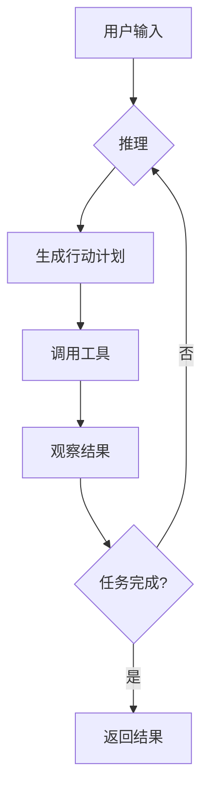
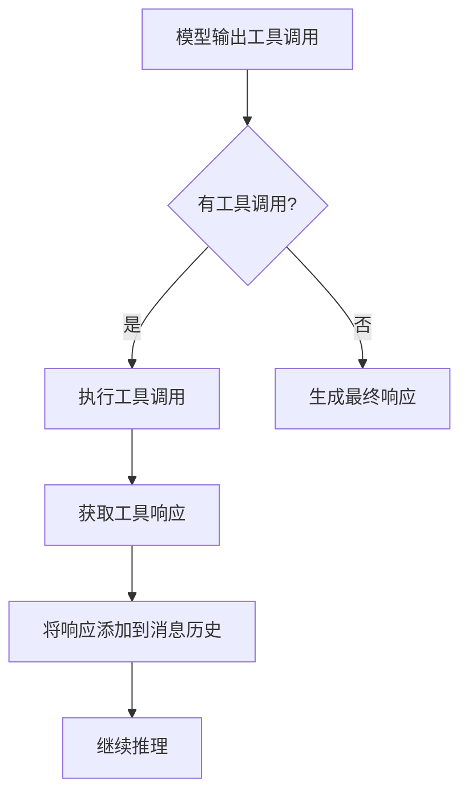
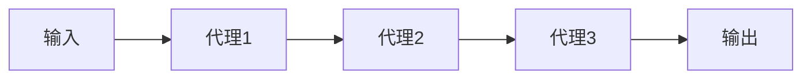
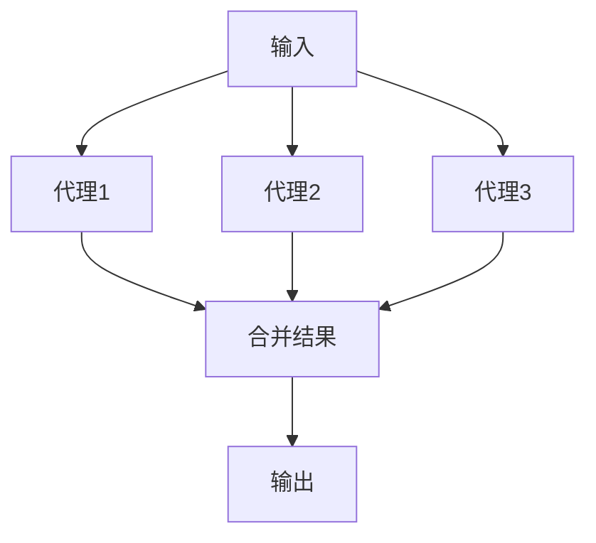
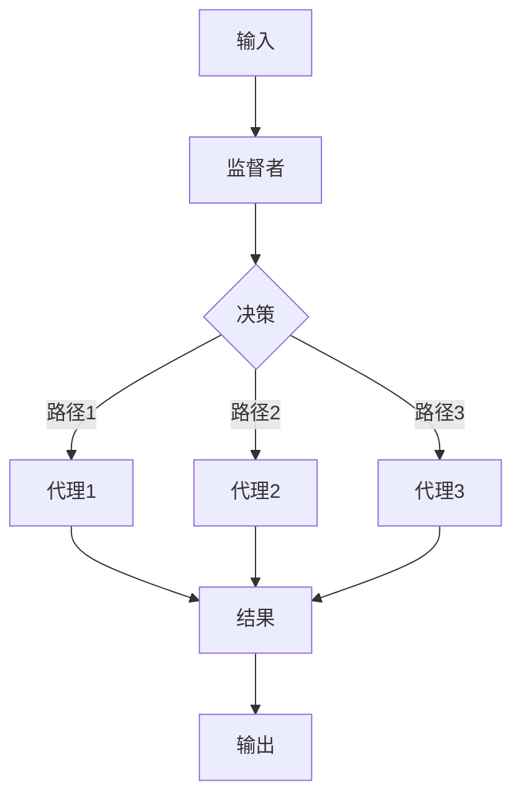
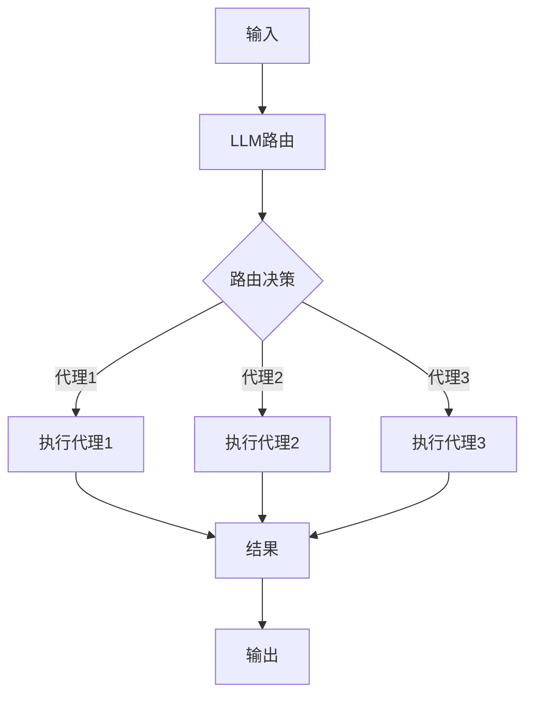
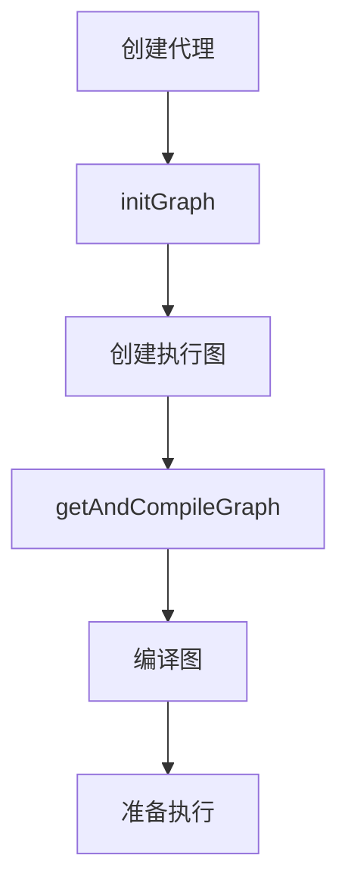
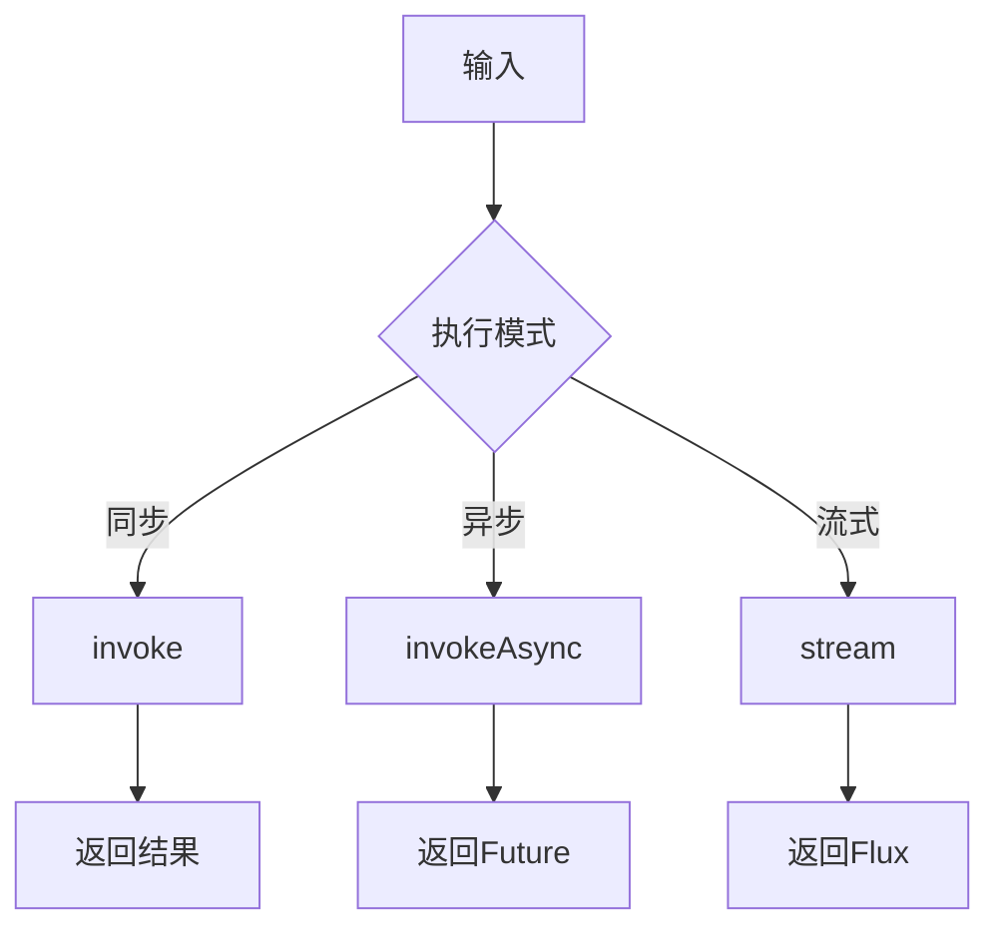
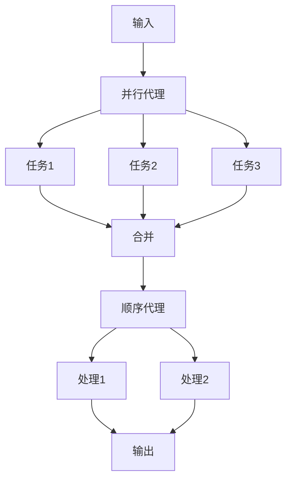

# 代理框架

<cite>
**本文档引用的文件**   
- [ReactAgent.java](file://spring-ai-alibaba-agent-framework/src/main/java/com/alibaba/cloud/ai/graph/agent/ReactAgent.java)
- [BaseAgent.java](file://spring-ai-alibaba-agent-framework/src/main/java/com/alibaba/cloud/ai/graph/agent/BaseAgent.java)
- [Agent.java](file://spring-ai-alibaba-agent-framework/src/main/java/com/alibaba/cloud/ai/graph/agent/Agent.java)
- [SequentialAgent.java](file://spring-ai-alibaba-agent-framework/src/main/java/com/alibaba/cloud/ai/graph/agent/flow/agent/SequentialAgent.java)
- [ParallelAgent.java](file://spring-ai-alibaba-agent-framework/src/main/java/com/alibaba/cloud/ai/graph/agent/flow/agent/ParallelAgent.java)
- [SupervisorAgent.java](file://spring-ai-alibaba-agent-framework/src/main/java/com/alibaba/cloud/ai/graph/agent/flow/agent/SupervisorAgent.java)
- [LlmRoutingAgent.java](file://spring-ai-alibaba-agent-framework/src/main/java/com/alibaba/cloud/ai/graph/agent/flow/agent/LlmRoutingAgent.java)
- [FlowAgent.java](file://spring-ai-alibaba-agent-framework/src/main/java/com/alibaba/cloud/ai/graph/agent/flow/agent/FlowAgent.java)
- [DefaultAgentBuilderFactory.java](file://spring-ai-alibaba-agent-framework/src/main/java/com/alibaba/cloud/ai/graph/agent/factory/DefaultAgentBuilderFactory.java)
- [FlowAgentBuilder.java](file://spring-ai-alibaba-agent-framework/src/main/java/com/alibaba/cloud/ai/graph/agent/flow/builder/FlowAgentBuilder.java)
- [FlowGraphBuilder.java](file://spring-ai-alibaba-agent-framework/src/main/java/com/alibaba/cloud/ai/graph/agent/flow/builder/FlowGraphBuilder.java)
- [SequentialGraphBuildingStrategy.java](file://spring-ai-alibaba-agent-framework/src/main/java/com/alibaba/cloud/ai/graph/agent/flow/strategy/SequentialGraphBuildingStrategy.java)
- [ParallelGraphBuildingStrategy.java](file://spring-ai-alibaba-agent-framework/src/main/java/com/alibaba/cloud/ai/graph/agent/flow/strategy/ParallelGraphBuildingStrategy.java)
- [SupervisorGraphBuildingStrategy.java](file://spring-ai-alibaba-agent-framework/src/main/java/com/alibaba/cloud/ai/graph/agent/flow/strategy/SupervisorGraphBuildingStrategy.java)
- [RoutingGraphBuildingStrategy.java](file://spring-ai-alibaba-agent-framework/src/main/java/com/alibaba/cloud/ai/graph/agent/flow/strategy/RoutingGraphBuildingStrategy.java)
- [TransparentNode.java](file://spring-ai-alibaba-agent-framework/src/main/java/com/alibaba/cloud/ai/graph/agent/flow/node/TransparentNode.java)
- [EnhancedParallelResultAggregator.java](file://spring-ai-alibaba-agent-framework/src/main/java/com/alibaba/cloud/ai/graph/agent/flow/node/EnhancedParallelResultAggregator.java)
- [FlowAgentEnum.java](file://spring-ai-alibaba-agent-framework/src/main/java/com/alibaba/cloud/ai/graph/agent/flow/enums/FlowAgentEnum.java)
</cite>

## 目录
1. [简介](#简介)
2. [核心组件](#核心组件)
3. [ReAct代理实现原理](#reAct代理实现原理)
4. [工作流代理家族](#工作流代理家族)
5. [代理构建器模式](#代理构建器模式)
6. [代理生命周期管理](#代理生命周期管理)
7. [复杂工作流组合](#复杂工作流组合)
8. [结论](#结论)

## 简介

代理框架是一个基于大语言模型（LLM）的智能代理系统，旨在通过结合推理（Reason）和行动（Act）能力来解决复杂任务。该框架的核心是ReAct代理模式，它通过迭代的推理-行动循环来处理用户请求。框架提供了多种工作流代理，包括顺序执行、并行执行、监督者模式和基于LLM的动态路由，以满足不同场景的需求。通过构建器模式，开发者可以灵活地配置和组合代理，实现复杂的业务逻辑。

## 核心组件

代理框架的核心组件包括ReAct代理、工作流代理家族、构建器模式和生命周期管理。ReAct代理是框架的基础，它通过与大语言模型的交互来实现推理和行动。工作流代理家族提供了多种执行模式，包括顺序、并行、监督和动态路由。构建器模式简化了代理的创建过程，而生命周期管理确保了代理的高效运行和资源管理。

**本文档引用的文件**   
- [ReactAgent.java](file://spring-ai-alibaba-agent-framework/src/main/java/com/alibaba/cloud/ai/graph/agent/ReactAgent.java)
- [BaseAgent.java](file://spring-ai-alibaba-agent-framework/src/main/java/com/alibaba/cloud/ai/graph/agent/BaseAgent.java)
- [Agent.java](file://spring-ai-alibaba-agent-framework/src/main/java/com/alibaba/cloud/ai/graph/agent/Agent.java)

## ReAct代理实现原理

ReAct代理是代理框架的核心实现，它基于ReAct（Reasoning and Acting）范式，通过迭代的推理-行动循环来解决复杂任务。代理通过大语言模型进行推理，生成行动计划，并通过工具调用来执行这些计划。

### 推理与行动循环

ReAct代理的推理与行动循环包括以下步骤：
1. **推理（Reason）**：代理接收用户输入，通过大语言模型进行推理，生成下一步的行动计划。
2. **行动（Act）**：根据推理结果，代理调用相应的工具来执行具体操作。
3. **观察（Observe）**：代理观察工具执行的结果，并将其作为新的上下文输入。
4. **迭代**：重复上述步骤，直到任务完成或达到终止条件。



**图源**
- [ReactAgent.java](file://spring-ai-alibaba-agent-framework/src/main/java/com/alibaba/cloud/ai/graph/agent/ReactAgent.java#L702-L750)

### 工具调用循环

ReAct代理通过工具调用循环来执行具体操作。当大语言模型生成工具调用请求时，代理会调用相应的工具，并将执行结果返回给模型，以便进行下一步推理。



**图源**
- [ReactAgent.java](file://spring-ai-alibaba-agent-framework/src/main/java/com/alibaba/cloud/ai/graph/agent/ReactAgent.java#L662-L665)

**本节源码**
- [ReactAgent.java](file://spring-ai-alibaba-agent-framework/src/main/java/com/alibaba/cloud/ai/graph/agent/ReactAgent.java#L702-L772)

## 工作流代理家族

工作流代理家族提供了多种执行模式，以满足不同场景的需求。这些代理包括顺序执行、并行执行、监督者模式和基于LLM的动态路由。

### 顺序代理（SequentialAgent）

顺序代理按照预定义的顺序依次执行子代理。每个子代理的输出作为下一个子代理的输入，形成一个线性执行链。



**图源**
- [SequentialGraphBuildingStrategy.java](file://spring-ai-alibaba-agent-framework/src/main/java/com/alibaba/cloud/ai/graph/agent/flow/strategy/SequentialGraphBuildingStrategy.java#L38-L64)

### 并行代理（ParallelAgent）

并行代理同时执行多个子代理，并将结果合并。这种模式适用于可以并行处理的独立任务。



**图源**
- [ParallelGraphBuildingStrategy.java](file://spring-ai-alibaba-agent-framework/src/main/java/com/alibaba/cloud/ai/graph/agent/flow/strategy/ParallelGraphBuildingStrategy.java#L38-L64)

### 监督者代理（SupervisorAgent）

监督者代理使用大语言模型作为决策中心，动态决定任务的执行路径。它可以根据上下文和任务需求，智能地分配和协调子代理。



**图源**
- [SupervisorGraphBuildingStrategy.java](file://spring-ai-alibaba-agent-framework/src/main/java/com/alibaba/cloud/ai/graph/agent/flow/strategy/SupervisorGraphBuildingStrategy.java#L38-L64)

### LLM路由代理（LlmRoutingAgent）

LLM路由代理基于大语言模型的判断，动态选择执行路径。它可以根据输入内容和上下文，智能地路由到最合适的子代理。



**图源**
- [RoutingGraphBuildingStrategy.java](file://spring-ai-alibaba-agent-framework/src/main/java/com/alibaba/cloud/ai/graph/agent/flow/strategy/RoutingGraphBuildingStrategy.java#L38-L64)

**本节源码**
- [SequentialAgent.java](file://spring-ai-alibaba-agent-framework/src/main/java/com/alibaba/cloud/ai/graph/agent/flow/agent/SequentialAgent.java)
- [ParallelAgent.java](file://spring-ai-alibaba-agent-framework/src/main/java/com/alibaba/cloud/ai/graph/agent/flow/agent/ParallelAgent.java)
- [SupervisorAgent.java](file://spring-ai-alibaba-agent-framework/src/main/java/com/alibaba/cloud/ai/graph/agent/flow/agent/SupervisorAgent.java)
- [LlmRoutingAgent.java](file://spring-ai-alibaba-agent-framework/src/main/java/com/alibaba/cloud/ai/graph/agent/flow/agent/LlmRoutingAgent.java)

## 代理构建器模式

代理构建器模式通过流畅的API简化了代理的创建和配置过程。`DefaultAgentBuilderFactory` 提供了创建代理构建器的入口，开发者可以通过链式调用配置代理的各种属性。

### DefaultAgentBuilderFactory

`DefaultAgentBuilderFactory` 是代理构建器的工厂类，它负责创建 `DefaultBuilder` 实例，用于构建ReAct代理。

```java
public class DefaultAgentBuilderFactory implements AgentBuilderFactory {
    @Override
    public Builder builder() {
        return new DefaultBuilder();
    }
}
```

**本节源码**
- [DefaultAgentBuilderFactory.java](file://spring-ai-alibaba-agent-framework/src/main/java/com/alibaba/cloud/ai/graph/agent/factory/DefaultAgentBuilderFactory.java)

### 流畅的API设计

工作流代理的构建器采用了流畅的API设计，允许通过链式调用配置代理的各种属性。

```java
SequentialAgent agent = SequentialAgent.builder()
    .name("blog_agent")
    .description("写文章并评论")
    .subAgents(List.of(writerAgent, reviewerAgent))
    .build();
```

**本节源码**
- [FlowAgentBuilder.java](file://spring-ai-alibaba-agent-framework/src/main/java/com/alibaba/cloud/ai/graph/agent/flow/builder/FlowAgentBuilder.java)

## 代理生命周期管理

代理的生命周期管理包括创建、初始化、执行和销毁等阶段。框架通过 `initGraph` 方法初始化代理的执行图，并通过 `invoke` 和 `stream` 方法执行代理。

### 初始化过程

代理的初始化过程包括创建执行图和编译图。`initGraph` 方法负责创建代理的执行图，而 `getAndCompileGraph` 方法负责编译图。



**本节源码**
- [Agent.java](file://spring-ai-alibaba-agent-framework/src/main/java/com/alibaba/cloud/ai/graph/agent/Agent.java#L102-L131)

### 执行模式

代理支持多种执行模式，包括同步执行、异步执行和流式执行。



**本节源码**
- [Agent.java](file://spring-ai-alibaba-agent-framework/src/main/java/com/alibaba/cloud/ai/graph/agent/Agent.java#L161-L253)

## 复杂工作流组合

通过组合不同的工作流代理，可以构建复杂的业务逻辑。例如，可以将顺序代理和并行代理结合使用，实现先并行处理多个任务，再顺序处理结果的复杂工作流。

### 混合模式示例



**本节源码**
- [FlowAgent.java](file://spring-ai-alibaba-agent-framework/src/main/java/com/alibaba/cloud/ai/graph/agent/flow/agent/FlowAgent.java)

## 结论

代理框架提供了一个强大而灵活的系统，用于构建基于大语言模型的智能代理。通过ReAct代理模式，框架实现了推理与行动的有机结合。工作流代理家族提供了多种执行模式，满足不同场景的需求。构建器模式简化了代理的创建过程，而生命周期管理确保了代理的高效运行。通过组合不同的工作流代理，可以构建复杂的业务逻辑，实现智能化的任务处理。