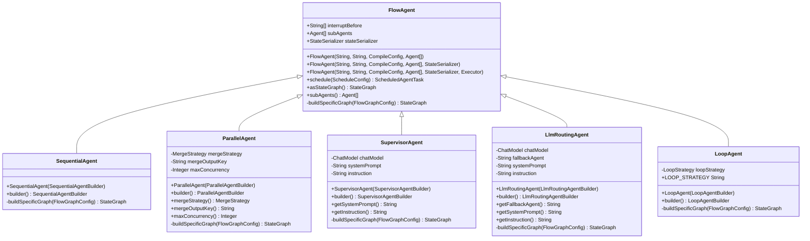
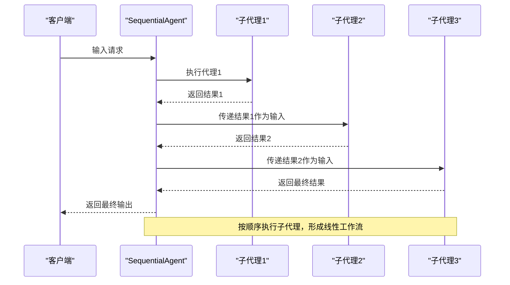
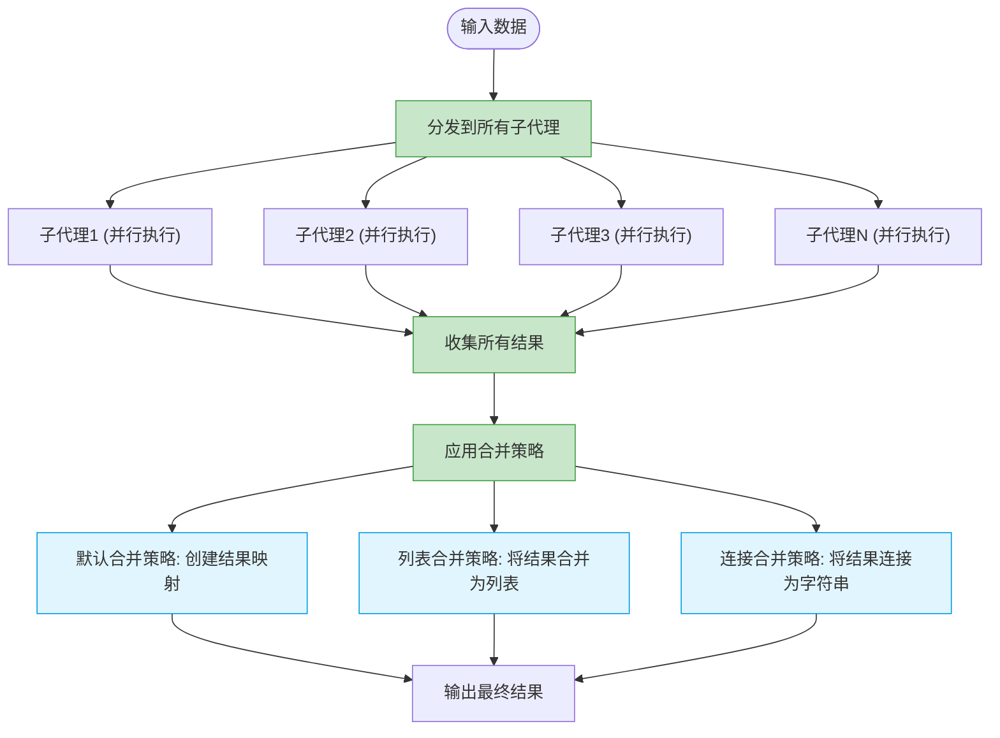
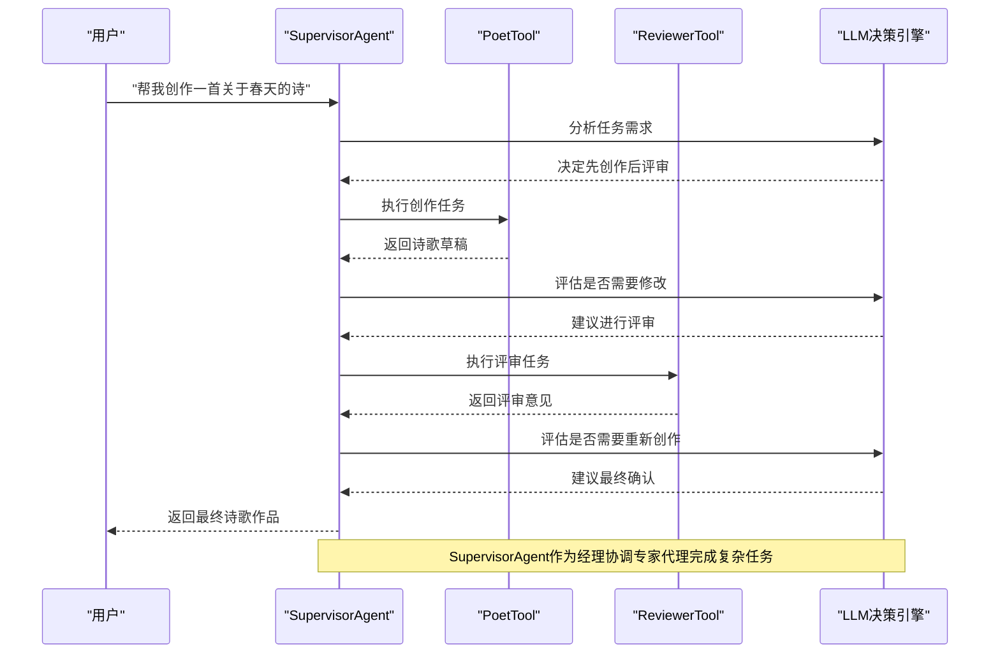
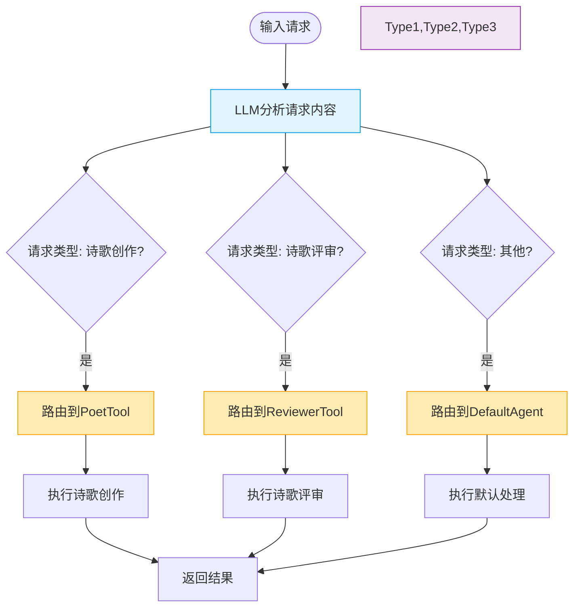
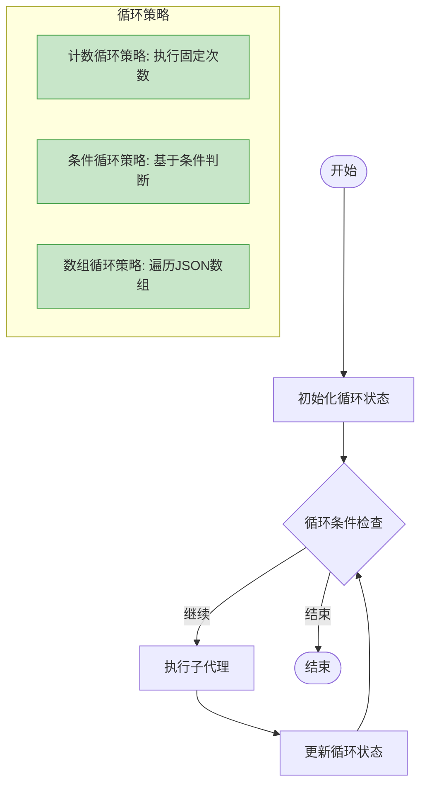

# 工作流代理

<cite>
**本文档中引用的文件**  
- [FlowAgent.java](file://spring-ai-alibaba-agent-framework/src/main/java/com/alibaba/cloud/ai/graph/agent/flow/agent/FlowAgent.java)
- [SequentialAgent.java](file://spring-ai-alibaba-agent-framework/src/main/java/com/alibaba/cloud/ai/graph/agent/flow/agent/SequentialAgent.java)
- [ParallelAgent.java](file://spring-ai-alibaba-agent-framework/src/main/java/com/alibaba/cloud/ai/graph/agent/flow/agent/ParallelAgent.java)
- [SupervisorAgent.java](file://spring-ai-alibaba-agent-framework/src/main/java/com/alibaba/cloud/ai/graph/agent/flow/agent/SupervisorAgent.java)
- [LlmRoutingAgent.java](file://spring-ai-alibaba-agent-framework/src/main/java/com/alibaba/cloud/ai/graph/agent/flow/agent/LlmRoutingAgent.java)
- [LoopAgent.java](file://spring-ai-alibaba-agent-framework/src/main/java/com/alibaba/cloud/ai/graph/agent/flow/agent/LoopAgent.java)
- [ParallelResultAggregator.java](file://spring-ai-alibaba-agent-framework/src/main/java/com/alibaba/cloud/ai/graph/agent/flow/node/ParallelResultAggregator.java)
- [EnhancedParallelResultAggregator.java](file://spring-ai-alibaba-agent-framework/src/main/java/com/alibaba/cloud/ai/graph/agent/flow/node/EnhancedParallelResultAggregator.java)
- [FlowGraphBuilder.java](file://spring-ai-alibaba-agent-framework/src/main/java/com/alibaba/cloud/ai/graph/agent/flow/builder/FlowGraphBuilder.java)
- [CountLoopStrategy.java](file://spring-ai-alibaba-agent-framework/src/main/java/com/alibaba/cloud/ai/graph/agent/flow/agent/loop/CountLoopStrategy.java)
- [ConditionLoopStrategy.java](file://spring-ai-alibaba-agent-framework/src/main/java/com/alibaba/cloud/ai/graph/agent/flow/agent/loop/ConditionLoopStrategy.java)
- [ArrayLoopStrategy.java](file://spring-ai-alibaba-agent-framework/src/main/java/com/alibaba/cloud/ai/graph/agent/flow/agent/loop/ArrayLoopStrategy.java)
- [LoopMode.java](file://spring-ai-alibaba-agent-framework/src/main/java/com/alibaba/cloud/ai/graph/agent/flow/agent/loop/LoopMode.java)
- [ReviewerTool.java](file://spring-ai-alibaba-agent-framework/src/test/java/com/alibaba/cloud/ai/graph/agent/tools/ReviewerTool.java)
- [PoetTool.java](file://spring-ai-alibaba-agent-framework/src/test/java/com/alibaba/cloud/ai/graph/agent/tools/PoetTool.java)
</cite>

## 目录
1. [工作流代理概述](#工作流代理概述)
2. [SequentialAgent](#sequentialagent)
3. [ParallelAgent](#parallelagent)
4. [SupervisorAgent](#supervisoragent)
5. [LlmRoutingAgent](#llmroutingagent)
6. [LoopAgent](#loopagent)
7. [配置示例与场景对比](#配置示例与场景对比)

## 工作流代理概述

工作流代理（FlowAgent）家族是Spring AI Alibaba框架中用于构建复杂代理工作流的核心组件。这些代理通过组合多个子代理来实现高级任务编排能力。所有工作流代理都继承自`FlowAgent`基类，该基类定义了工作流代理的基本结构和行为。

`FlowAgent`通过`FlowGraphBuilder`构建状态图，利用`buildSpecificGraph`抽象方法让子类定义特定的图构建策略。这种设计模式实现了工作流逻辑与图构建的解耦，使得每种代理类型可以独立实现其特有的执行模式。



**图源**  
- [FlowAgent.java](file://spring-ai-alibaba-agent-framework/src/main/java/com/alibaba/cloud/ai/graph/agent/flow/agent/FlowAgent.java)
- [SequentialAgent.java](file://spring-ai-alibaba-agent-framework/src/main/java/com/alibaba/cloud/ai/graph/agent/flow/agent/SequentialAgent.java)
- [ParallelAgent.java](file://spring-ai-alibaba-agent-framework/src/main/java/com/alibaba/cloud/ai/graph/agent/flow/agent/ParallelAgent.java)
- [SupervisorAgent.java](file://spring-ai-alibaba-agent-framework/src/main/java/com/alibaba/cloud/ai/graph/agent/flow/agent/SupervisorAgent.java)
- [LlmRoutingAgent.java](file://spring-ai-alibaba-agent-framework/src/main/java/com/alibaba/cloud/ai/graph/agent/flow/agent/LlmRoutingAgent.java)
- [LoopAgent.java](file://spring-ai-alibaba-agent-framework/src/main/java/com/alibaba/cloud/ai/graph/agent/flow/agent/LoopAgent.java)

**节源**  
- [FlowAgent.java](file://spring-ai-alibaba-agent-framework/src/main/java/com/alibaba/cloud/ai/graph/agent/flow/agent/FlowAgent.java)

## SequentialAgent

`SequentialAgent`实现了代理的顺序执行模式。它按照预定义的顺序依次执行子代理，每个代理的输出作为下一个代理的输入，形成一个线性的处理流水线。这种模式适用于需要按步骤处理的任务，如多阶段数据处理或分步决策流程。

`SequentialAgent`通过`FlowGraphBuilder`构建一个线性状态图，使用`SEQUENTIAL`类型策略。其构建过程简单直接，不需要复杂的并行或条件逻辑。代理的执行顺序由子代理在列表中的位置决定。



**图源**  
- [SequentialAgent.java](file://spring-ai-alibaba-agent-framework/src/main/java/com/alibaba/cloud/ai/graph/agent/flow/agent/SequentialAgent.java)
- [FlowGraphBuilder.java](file://spring-ai-alibaba-agent-framework/src/main/java/com/alibaba/cloud/ai/graph/agent/flow/builder/FlowGraphBuilder.java)

**节源**  
- [SequentialAgent.java](file://spring-ai-alibaba-agent-framework/src/main/java/com/alibaba/cloud/ai/graph/agent/flow/agent/SequentialAgent.java)

## ParallelAgent

`ParallelAgent`实现了代理的并行执行机制，支持多个子代理同时执行。它采用"扇出-聚集"（Fan-Out/Gather）模式，将输入分发给所有子代理，并行执行后收集结果并进行聚合。这种模式显著提高了处理效率，特别适合可以并行处理的独立任务。

`ParallelAgent`通过`ParallelGraphBuildingStrategy`构建并行执行图。其核心是`MergeStrategy`接口，定义了结果聚合策略。代理支持多种内置的合并策略，包括默认映射、列表合并和字符串连接等。



**图源**  
- [ParallelAgent.java](file://spring-ai-alibaba-agent-framework/src/main/java/com/alibaba/cloud/ai/graph/agent/flow/agent/ParallelAgent.java)
- [EnhancedParallelResultAggregator.java](file://spring-ai-alibaba-agent-framework/src/main/java/com/alibaba/cloud/ai/graph/agent/flow/node/EnhancedParallelResultAggregator.java)

**节源**  
- [ParallelAgent.java](file://spring-ai-alibaba-agent-framework/src/main/java/com/alibaba/cloud/ai/graph/agent/flow/agent/ParallelAgent.java)

## SupervisorAgent

`SupervisorAgent`作为"经理"角色，负责协调多个专家代理完成复杂任务。它利用LLM作为决策引擎，根据当前状态和任务要求动态选择下一个执行的代理。这种模式实现了智能的任务调度和资源分配，适用于需要动态决策的复杂工作流。

`SupervisorAgent`通过`SupervisorGraphBuildingStrategy`构建监督式执行图。它配置了专门的`ChatModel`用于决策，并可以设置系统提示和指令来指导LLM的决策过程。监督代理会根据任务上下文和子代理的能力，智能地分配任务。



**图源**  
- [SupervisorAgent.java](file://spring-ai-alibaba-agent-framework/src/main/java/com/alibaba/cloud/ai/graph/agent/flow/agent/SupervisorAgent.java)
- [ReviewerTool.java](file://spring-ai-alibaba-agent-framework/src/test/java/com/alibaba/cloud/ai/graph/agent/tools/ReviewerTool.java)
- [PoetTool.java](file://spring-ai-alibaba-agent-framework/src/test/java/com/alibaba/cloud/ai/graph/agent/tools/PoetTool.java)

**节源**  
- [SupervisorAgent.java](file://spring-ai-alibaba-agent-framework/src/main/java/com/alibaba/cloud/ai/graph/agent/flow/agent/SupervisorAgent.java)

## LlmRoutingAgent

`LlmRoutingAgent`利用LLM作为路由器，根据输入动态选择下一个执行的代理。与`SupervisorAgent`不同，它更侧重于路由决策而非任务协调。代理根据输入内容、上下文和预定义的规则，智能地将请求路由到最合适的处理代理。

`LlmRoutingAgent`通过`RoutingGraphBuildingStrategy`构建路由图。它同样使用`ChatModel`进行决策，但更专注于路径选择。代理可以配置备用代理（fallback agent），当无法确定最佳路由时使用默认路径。



**图源**  
- [LlmRoutingAgent.java](file://spring-ai-alibaba-agent-framework/src/main/java/com/alibaba/cloud/ai/graph/agent/flow/agent/LlmRoutingAgent.java)
- [ReviewerTool.java](file://spring-ai-alibaba-agent-framework/src/test/java/com/alibaba/cloud/ai/graph/agent/tools/ReviewerTool.java)
- [PoetTool.java](file://spring-ai-alibaba-agent-framework/src/test/java/com/alibaba/cloud/ai/graph/agent/tools/PoetTool.java)

**节源**  
- [LlmRoutingAgent.java](file://spring-ai-alibaba-agent-framework/src/main/java/com/alibaba/cloud/ai/graph/agent/flow/agent/LlmRoutingAgent.java)

## LoopAgent

`LoopAgent`实现了循环执行策略，支持多种循环模式。它可以在满足特定条件时重复执行子代理，适用于需要迭代处理的任务，如重试机制、数据批量处理或条件循环。

`LoopAgent`通过`LoopGraphBuildingStrategy`构建循环执行图。其核心是`LoopStrategy`接口，定义了循环控制逻辑。代理支持多种内置的循环策略，包括计数循环、条件循环和JSON数组循环等。



**图源**  
- [LoopAgent.java](file://spring-ai-alibaba-agent-framework/src/main/java/com/alibaba/cloud/ai/graph/agent/flow/agent/LoopAgent.java)
- [CountLoopStrategy.java](file://spring-ai-alibaba-agent-framework/src/main/java/com/alibaba/cloud/ai/graph/agent/flow/agent/loop/CountLoopStrategy.java)
- [ConditionLoopStrategy.java](file://spring-ai-alibaba-agent-framework/src/main/java/com/alibaba/cloud/ai/graph/agent/flow/agent/loop/ConditionLoopStrategy.java)
- [ArrayLoopStrategy.java](file://spring-ai-alibaba-agent-framework/src/main/java/com/alibaba/cloud/ai/graph/agent/flow/agent/loop/ArrayLoopStrategy.java)

**节源**  
- [LoopAgent.java](file://spring-ai-alibaba-agent-framework/src/main/java/com/alibaba/cloud/ai/graph/agent/flow/agent/LoopAgent.java)

## 配置示例与场景对比

不同工作流代理适用于不同的应用场景，选择合适的代理类型对于构建高效的工作流至关重要。以下是各种代理的配置示例和适用场景对比：

```mermaid
erDiagram
AGENT_TYPES {
string type PK
string description
string configuration_example
string use_cases
string performance_characteristics
}
STRATEGIES {
string strategy PK
string description
string implementation_class
string parameters
}
AGENT_TYPES ||--o{ STRATEGIES : "uses"
AGENT_TYPES {
"SequentialAgent" "顺序执行代理" "builder().subAgents(list)" "多阶段处理、线性工作流" "顺序执行，性能可预测"
"ParallelAgent" "并行执行代理" "builder().subAgents(list).mergeStrategy(strategy)" "独立任务并行处理" "并行执行，高吞吐量"
"SupervisorAgent" "监督协调代理" "builder().subAgents(list).model(chatModel)" "复杂任务协调、智能调度" "决策开销，灵活性高"
"LlmRoutingAgent" "LLM路由代理" "builder().subAgents(list).model(chatModel)" "智能路由、内容分发" "路由决策开销"
"LoopAgent" "循环执行代理" "builder().subAgent(agent).loopStrategy(strategy)" "迭代处理、重试机制" "循环开销，可控制"
}
STRATEGIES {
"DefaultMergeStrategy" "默认合并策略" "ParallelAgent$DefaultMergeStrategy" "无"
"ListMergeStrategy" "列表合并策略" "ParallelAgent$ListMergeStrategy" "无"
"ConcatenationMergeStrategy" "连接合并策略" "ParallelAgent$ConcatenationMergeStrategy" "separator"
"CountLoopStrategy" "计数循环策略" "CountLoopStrategy" "maxCount"
"ConditionLoopStrategy" "条件循环策略" "ConditionLoopStrategy" "messagePredicate"
"ArrayLoopStrategy" "数组循环策略" "ArrayLoopStrategy" "converter"
}
```

**图源**  
- [ParallelAgent.java](file://spring-ai-alibaba-agent-framework/src/main/java/com/alibaba/cloud/ai/graph/agent/flow/agent/ParallelAgent.java)
- [LoopAgent.java](file://spring-ai-alibaba-agent-framework/src/main/java/com/alibaba/cloud/ai/graph/agent/flow/agent/LoopAgent.java)
- [CountLoopStrategy.java](file://spring-ai-alibaba-agent-framework/src/main/java/com/alibaba/cloud/ai/graph/agent/flow/agent/loop/CountLoopStrategy.java)
- [ConditionLoopStrategy.java](file://spring-ai-alibaba-agent-framework/src/main/java/com/alibaba/cloud/ai/graph/agent/flow/agent/loop/ConditionLoopStrategy.java)
- [ArrayLoopStrategy.java](file://spring-ai-alibaba-agent-framework/src/main/java/com/alibaba/cloud/ai/graph/agent/flow/agent/loop/ArrayLoopStrategy.java)

**节源**  
- [ParallelAgent.java](file://spring-ai-alibaba-agent-framework/src/main/java/com/alibaba/cloud/ai/graph/agent/flow/agent/ParallelAgent.java)
- [LoopAgent.java](file://spring-ai-alibaba-agent-framework/src/main/java/com/alibaba/cloud/ai/graph/agent/flow/agent/LoopAgent.java)