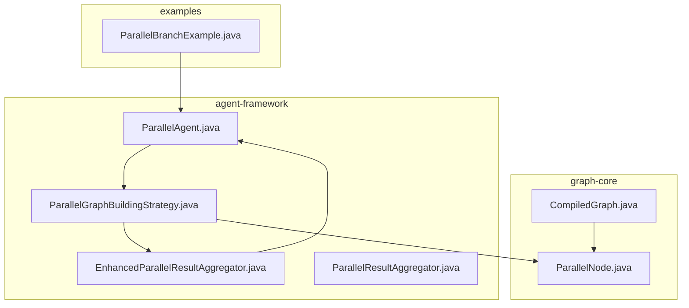
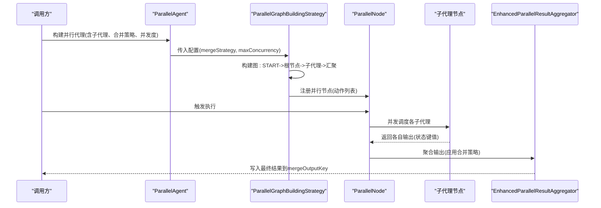
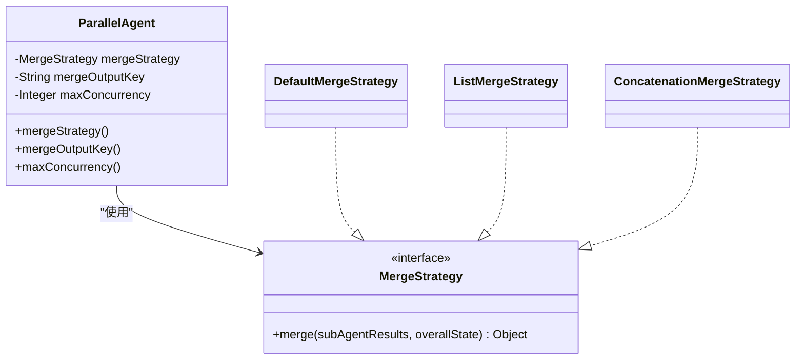
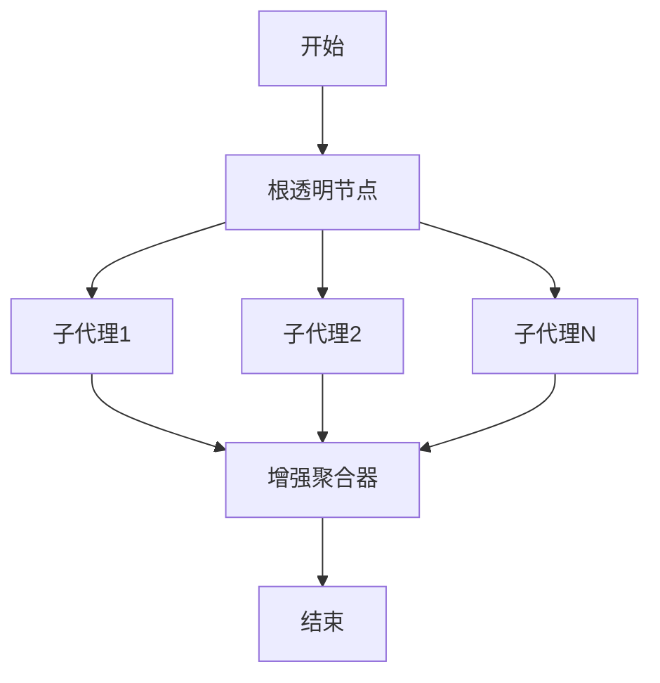
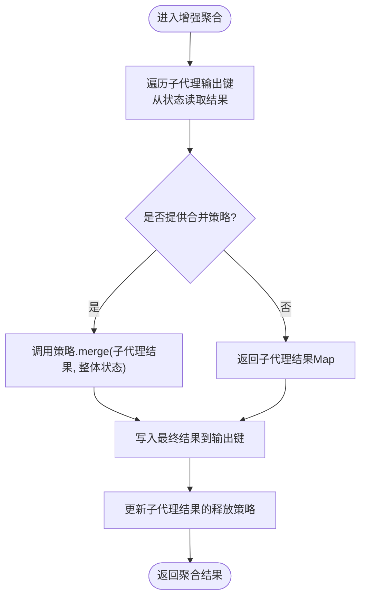
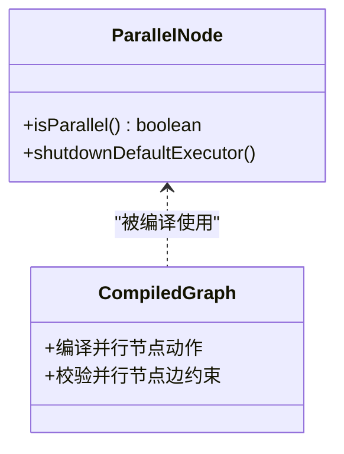
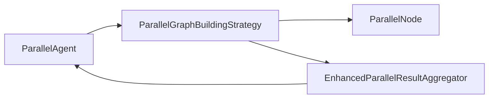

# 并行代理

<cite>
**本文引用的文件列表**
- [ParallelAgent.java](file://spring-ai-alibaba-agent-framework/src/main/java/com/alibaba/cloud/ai/graph/agent/flow/agent/ParallelAgent.java)
- [ParallelGraphBuildingStrategy.java](file://spring-ai-alibaba-agent-framework/src/main/java/com/alibaba/cloud/ai/graph/agent/flow/strategy/ParallelGraphBuildingStrategy.java)
- [EnhancedParallelResultAggregator.java](file://spring-ai-alibaba-agent-framework/src/main/java/com/alibaba/cloud/ai/graph/agent/flow/node/EnhancedParallelResultAggregator.java)
- [ParallelResultAggregator.java](file://spring-ai-alibaba-agent-framework/src/main/java/com/alibaba/cloud/ai/graph/agent/flow/node/ParallelResultAggregator.java)
- [ParallelAgentTest.java](file://spring-ai-alibaba-agent-framework/src/test/java/com/alibaba/cloud/ai/graph/agent/flow/ParallelAgentTest.java)
- [ExecutorConfigTest.java](file://spring-ai-alibaba-agent-framework/src/test/java/com/alibaba/cloud/ai/graph/agent/ExecutorConfigTest.java)
- [ParallelNode.java](file://spring-ai-alibaba-graph-core/src/main/java/com/alibaba/cloud/ai/graph/internal/node/ParallelNode.java)
- [CompiledGraph.java](file://spring-ai-alibaba-graph-core/src/main/java/com/alibaba/cloud/ai/graph/CompiledGraph.java)
- [ParallelBranchExample.java](file://examples/documentation/src/main/java/com/alibaba/cloud/ai/examples/documentation/graph/examples/ParallelBranchExample.java)
</cite>

## 目录
1. [简介](#简介)
2. [项目结构](#项目结构)
3. [核心组件](#核心组件)
4. [架构总览](#架构总览)
5. [组件详解](#组件详解)
6. [依赖关系分析](#依赖关系分析)
7. [性能与资源权衡](#性能与资源权衡)
8. [故障排查指南](#故障排查指南)
9. [结论](#结论)
10. [附录：配置与示例](#附录配置与示例)

## 简介
并行代理（ParallelAgent）用于同时执行多个子代理，以提升独立任务的批量处理效率。它通过“扇出-并行执行-汇聚”的模式，将输入分发给所有子代理并发执行，并在完成后根据可插拔的合并策略对结果进行聚合。该组件广泛适用于需要同时查询多个数据源、并行处理多个文件等场景，能显著缩短端到端执行时间。

## 项目结构
并行代理相关的核心代码分布在以下模块：
- agent-framework 模块：并行代理定义、构建器、合并策略、增强结果聚合器、并行图构建策略
- graph-core 模块：底层并行节点（ParallelNode）、图编译与并行分支处理
- examples 模块：并行分支示例，演示如何组织并行工作流

图表来源
- [ParallelAgent.java](file://spring-ai-alibaba-agent-framework/src/main/java/com/alibaba/cloud/ai/graph/agent/flow/agent/ParallelAgent.java#L36-L117)
- [ParallelGraphBuildingStrategy.java](file://spring-ai-alibaba-agent-framework/src/main/java/com/alibaba/cloud/ai/graph/agent/flow/strategy/ParallelGraphBuildingStrategy.java#L40-L95)
- [EnhancedParallelResultAggregator.java](file://spring-ai-alibaba-agent-framework/src/main/java/com/alibaba/cloud/ai/graph/agent/flow/node/EnhancedParallelResultAggregator.java#L37-L116)
- [ParallelResultAggregator.java](file://spring-ai-alibaba-agent-framework/src/main/java/com/alibaba/cloud/ai/graph/agent/flow/node/ParallelResultAggregator.java#L28-L89)
- [ParallelNode.java](file://spring-ai-alibaba-graph-core/src/main/java/com/alibaba/cloud/ai/graph/internal/node/ParallelNode.java#L360-L372)
- [CompiledGraph.java](file://spring-ai-alibaba-graph-core/src/main/java/com/alibaba/cloud/ai/graph/CompiledGraph.java#L177-L216)
- [ParallelBranchExample.java](file://examples/documentation/src/main/java/com/alibaba/cloud/ai/examples/documentation/graph/examples/ParallelBranchExample.java#L149-L167)

章节来源
- [ParallelAgent.java](file://spring-ai-alibaba-agent-framework/src/main/java/com/alibaba/cloud/ai/graph/agent/flow/agent/ParallelAgent.java#L36-L117)
- [ParallelGraphBuildingStrategy.java](file://spring-ai-alibaba-agent-framework/src/main/java/com/alibaba/cloud/ai/graph/agent/flow/strategy/ParallelGraphBuildingStrategy.java#L40-L95)

## 核心组件
- ParallelAgent：并行代理主体，负责构建并行图、设置最大并发度、注册合并策略，并暴露构建器以支持链式配置。
- ParallelGraphBuildingStrategy：并行图构建策略，负责将根节点、子代理节点与汇聚节点（增强聚合器）连接成扇出-汇聚的并行拓扑。
- EnhancedParallelResultAggregator：增强型结果聚合器，从状态中收集各子代理输出，应用指定合并策略，将最终结果写入指定输出键。
- ParallelResultAggregator：基础结果聚合器，将所有并行输出汇总为字符串摘要（用于简单场景）。
- ParallelNode：底层并行节点，承载并行动作集合，确保分支并发执行与统一汇聚。

章节来源
- [ParallelAgent.java](file://spring-ai-alibaba-agent-framework/src/main/java/com/alibaba/cloud/ai/graph/agent/flow/agent/ParallelAgent.java#L104-L117)
- [ParallelGraphBuildingStrategy.java](file://spring-ai-alibaba-agent-framework/src/main/java/com/alibaba/cloud/ai/graph/agent/flow/strategy/ParallelGraphBuildingStrategy.java#L40-L95)
- [EnhancedParallelResultAggregator.java](file://spring-ai-alibaba-agent-framework/src/main/java/com/alibaba/cloud/ai/graph/agent/flow/node/EnhancedParallelResultAggregator.java#L37-L116)
- [ParallelResultAggregator.java](file://spring-ai-alibaba-agent-framework/src/main/java/com/alibaba/cloud/ai/graph/agent/flow/node/ParallelResultAggregator.java#L28-L89)
- [ParallelNode.java](file://spring-ai-alibaba-graph-core/src/main/java/com/alibaba/cloud/ai/graph/internal/node/ParallelNode.java#L360-L372)

## 架构总览
并行代理采用“扇出-并行执行-汇聚”架构：
- 扇出：根透明节点将输入分发给所有子代理
- 并行执行：底层并行节点（ParallelNode）并发调度子代理动作
- 汇聚：增强聚合器收集子代理输出，按合并策略生成最终结果并写入状态

图表来源
- [ParallelAgent.java](file://spring-ai-alibaba-agent-framework/src/main/java/com/alibaba/cloud/ai/graph/agent/flow/agent/ParallelAgent.java#L75-L82)
- [ParallelGraphBuildingStrategy.java](file://spring-ai-alibaba-agent-framework/src/main/java/com/alibaba/cloud/ai/graph/agent/flow/strategy/ParallelGraphBuildingStrategy.java#L59-L90)
- [ParallelNode.java](file://spring-ai-alibaba-graph-core/src/main/java/com/alibaba/cloud/ai/graph/internal/node/ParallelNode.java#L360-L372)
- [EnhancedParallelResultAggregator.java](file://spring-ai-alibaba-agent-framework/src/main/java/com/alibaba/cloud/ai/graph/agent/flow/node/EnhancedParallelResultAggregator.java#L57-L113)

## 组件详解

### ParallelAgent 类与合并策略
- 合并策略接口：定义 merge(Map<String,Object>, OverAllState) 方法，接收子代理结果映射与整体状态，返回合并后的结果对象。
- 默认策略：将子代理结果原样复制为新 Map。
- 列表策略：将子代理结果值收集为 List。
- 连接策略：将子代理结果转为字符串后按分隔符拼接。

图表来源
- [ParallelAgent.java](file://spring-ai-alibaba-agent-framework/src/main/java/com/alibaba/cloud/ai/graph/agent/flow/agent/ParallelAgent.java#L104-L117)
- [ParallelAgent.java](file://spring-ai-alibaba-agent-framework/src/main/java/com/alibaba/cloud/ai/graph/agent/flow/agent/ParallelAgent.java#L305-L355)

章节来源
- [ParallelAgent.java](file://spring-ai-alibaba-agent-framework/src/main/java/com/alibaba/cloud/ai/graph/agent/flow/agent/ParallelAgent.java#L104-L117)
- [ParallelAgent.java](file://spring-ai-alibaba-agent-framework/src/main/java/com/alibaba/cloud/ai/graph/agent/flow/agent/ParallelAgent.java#L305-L355)

### 并行图构建策略
- 将根透明节点、每个子代理节点与一个汇聚节点（增强聚合器）连接，形成 START->根->子代理->汇聚->END 的拓扑。
- 从配置中读取 mergeStrategy 与 maxConcurrency，并传递给增强聚合器。
- 根节点必须是 FlowAgent，且至少包含两个子代理。

图表来源
- [ParallelGraphBuildingStrategy.java](file://spring-ai-alibaba-agent-framework/src/main/java/com/alibaba/cloud/ai/graph/agent/flow/strategy/ParallelGraphBuildingStrategy.java#L40-L95)

章节来源
- [ParallelGraphBuildingStrategy.java](file://spring-ai-alibaba-agent-framework/src/main/java/com/alibaba/cloud/ai/graph/agent/flow/strategy/ParallelGraphBuildingStrategy.java#L40-L95)

### 增强结果聚合器
- 从状态中按子代理的输出键收集结果；若子代理返回 GraphResponse，则优先提取其 resultValue 并按 Map 或原始值处理。
- 若提供 ParallelAgent.MergeStrategy，调用其 merge 方法；否则默认返回收集到的 Map。
- 将子代理结果与释放策略写回状态，便于后续节点消费。

图表来源
- [EnhancedParallelResultAggregator.java](file://spring-ai-alibaba-agent-framework/src/main/java/com/alibaba/cloud/ai/graph/agent/flow/node/EnhancedParallelResultAggregator.java#L57-L113)

章节来源
- [EnhancedParallelResultAggregator.java](file://spring-ai-alibaba-agent-framework/src/main/java/com/alibaba/cloud/ai/graph/agent/flow/node/EnhancedParallelResultAggregator.java#L37-L116)

### 底层并行节点与图编译
- ParallelNode 表示并行执行容器，负责并发调度子动作，并在汇聚阶段统一处理结果。
- 编译过程中，当检测到并行节点存在多条目标边时，会抛出错误，确保拓扑合法。
- 提供默认线程池的优雅关闭逻辑，避免资源泄漏。

图表来源
- [ParallelNode.java](file://spring-ai-alibaba-graph-core/src/main/java/com/alibaba/cloud/ai/graph/internal/node/ParallelNode.java#L185-L203)
- [ParallelNode.java](file://spring-ai-alibaba-graph-core/src/main/java/com/alibaba/cloud/ai/graph/internal/node/ParallelNode.java#L360-L372)
- [CompiledGraph.java](file://spring-ai-alibaba-graph-core/src/main/java/com/alibaba/cloud/ai/graph/CompiledGraph.java#L177-L216)

章节来源
- [ParallelNode.java](file://spring-ai-alibaba-graph-core/src/main/java/com/alibaba/cloud/ai/graph/internal/node/ParallelNode.java#L185-L203)
- [ParallelNode.java](file://spring-ai-alibaba-graph-core/src/main/java/com/alibaba/cloud/ai/graph/internal/node/ParallelNode.java#L360-L372)
- [CompiledGraph.java](file://spring-ai-alibaba-graph-core/src/main/java/com/alibaba/cloud/ai/graph/CompiledGraph.java#L177-L216)

## 依赖关系分析
- ParallelAgent 依赖 ParallelGraphBuildingStrategy 生成并行图；后者依赖 ParallelNode 实现并发执行。
- 增强聚合器依赖子代理输出键从状态中读取结果，并可调用 ParallelAgent.MergeStrategy 完成合并。
- 测试覆盖了构建器验证、合并策略行为、执行器注入与并发度限制等关键路径。

图表来源
- [ParallelAgent.java](file://spring-ai-alibaba-agent-framework/src/main/java/com/alibaba/cloud/ai/graph/agent/flow/agent/ParallelAgent.java#L75-L82)
- [ParallelGraphBuildingStrategy.java](file://spring-ai-alibaba-agent-framework/src/main/java/com/alibaba/cloud/ai/graph/agent/flow/strategy/ParallelGraphBuildingStrategy.java#L59-L90)
- [EnhancedParallelResultAggregator.java](file://spring-ai-alibaba-agent-framework/src/main/java/com/alibaba/cloud/ai/graph/agent/flow/node/EnhancedParallelResultAggregator.java#L57-L113)
- [ParallelNode.java](file://spring-ai-alibaba-graph-core/src/main/java/com/alibaba/cloud/ai/graph/internal/node/ParallelNode.java#L360-L372)

章节来源
- [ParallelAgent.java](file://spring-ai-alibaba-agent-framework/src/main/java/com/alibaba/cloud/ai/graph/agent/flow/agent/ParallelAgent.java#L75-L82)
- [ParallelGraphBuildingStrategy.java](file://spring-ai-alibaba-agent-framework/src/main/java/com/alibaba/cloud/ai/graph/agent/flow/strategy/ParallelGraphBuildingStrategy.java#L59-L90)
- [EnhancedParallelResultAggregator.java](file://spring-ai-alibaba-agent-framework/src/main/java/com/alibaba/cloud/ai/graph/agent/flow/node/EnhancedParallelResultAggregator.java#L57-L113)
- [ParallelNode.java](file://spring-ai-alibaba-graph-core/src/main/java/com/alibaba/cloud/ai/graph/internal/node/ParallelNode.java#L360-L372)

## 性能与资源权衡
- 并发度控制：通过 maxConcurrency 限制同时执行的子代理数量，避免过度竞争 CPU/IO 资源导致吞吐下降。
- 执行器注入：可通过构建器注入自定义 Executor，以适配不同任务特征（如 ForkJoinPool、固定大小线程池）。
- 资源回收：ParallelNode 提供默认线程池的优雅关闭逻辑，防止长时间运行后资源泄漏。
- 图编译约束：编译期对并行节点的多目标边进行严格校验，避免不合法拓扑引发不可预期的并发问题。

章节来源
- [ParallelAgent.java](file://spring-ai-alibaba-agent-framework/src/main/java/com/alibaba/cloud/ai/graph/agent/flow/agent/ParallelAgent.java#L173-L181)
- [ExecutorConfigTest.java](file://spring-ai-alibaba-agent-framework/src/test/java/com/alibaba/cloud/ai/graph/agent/ExecutorConfigTest.java#L129-L169)
- [ParallelNode.java](file://spring-ai-alibaba-graph-core/src/main/java/com/alibaba/cloud/ai/graph/internal/node/ParallelNode.java#L185-L203)
- [CompiledGraph.java](file://spring-ai-alibaba-graph-core/src/main/java/com/alibaba/cloud/ai/graph/CompiledGraph.java#L177-L216)

## 故障排查指南
- 子代理数量不足：并行代理要求至少 2 个子代理，否则构建失败。
- 输出键冲突：子代理需具有唯一输出键，重复将导致合并冲突。
- 并发度非法：maxConcurrency 必须 ≥1，否则构建失败。
- 并行图拓扑错误：并行节点不能有多条目标边，编译时会抛出异常。
- 执行器未生效：确认在构建器中正确注入 Executor，并检查 RunnableConfig 中的元数据键是否存在。

章节来源
- [ParallelAgent.java](file://spring-ai-alibaba-agent-framework/src/main/java/com/alibaba/cloud/ai/graph/agent/flow/agent/ParallelAgent.java#L203-L232)
- [ParallelAgent.java](file://spring-ai-alibaba-agent-framework/src/main/java/com/alibaba/cloud/ai/graph/agent/flow/agent/ParallelAgent.java#L234-L259)
- [ParallelGraphBuildingStrategy.java](file://spring-ai-alibaba-agent-framework/src/main/java/com/alibaba/cloud/ai/graph/agent/flow/strategy/ParallelGraphBuildingStrategy.java#L108-L129)
- [CompiledGraph.java](file://spring-ai-alibaba-graph-core/src/main/java/com/alibaba/cloud/ai/graph/CompiledGraph.java#L177-L216)
- [ExecutorConfigTest.java](file://spring-ai-alibaba-agent-framework/src/test/java/com/alibaba/cloud/ai/graph/agent/ExecutorConfigTest.java#L129-L169)

## 结论
ParallelAgent 通过清晰的扇出-并行-汇聚架构，结合可插拔的合并策略与并发度控制，为独立任务的批量处理提供了高效、可控的解决方案。配合底层 ParallelNode 的并发执行与编译期拓扑校验，能够在保证正确性的同时最大化吞吐。建议在高并发场景下合理设置 maxConcurrency，并根据业务选择合适的合并策略。

## 附录：配置与示例

### 配置要点
- 子代理：至少 2 个，且每个子代理应有唯一输出键。
- 合并策略：可选，默认 Map 聚合；也可选择列表或字符串连接。
- 最大并发度：可选，null 表示不限制；建议根据资源情况设置。
- 执行器：可选，注入自定义线程池以优化任务特征。
- 输出键：指定最终聚合结果写入的状态键。

章节来源
- [ParallelAgent.java](file://spring-ai-alibaba-agent-framework/src/main/java/com/alibaba/cloud/ai/graph/agent/flow/agent/ParallelAgent.java#L140-L191)
- [ParallelAgent.java](file://spring-ai-alibaba-agent-framework/src/main/java/com/alibaba/cloud/ai/graph/agent/flow/agent/ParallelAgent.java#L203-L232)
- [ParallelGraphBuildingStrategy.java](file://spring-ai-alibaba-agent-framework/src/main/java/com/alibaba/cloud/ai/graph/agent/flow/strategy/ParallelGraphBuildingStrategy.java#L59-L90)

### 自定义合并策略
- 实现 MergeStrategy 接口的 merge 方法，按需对子代理结果进行合并（如去重、排序、评分择优等）。
- 在构建器中传入自定义策略实例，即可在汇聚阶段生效。

章节来源
- [ParallelAgent.java](file://spring-ai-alibaba-agent-framework/src/main/java/com/alibaba/cloud/ai/graph/agent/flow/agent/ParallelAgent.java#L104-L117)
- [ParallelAgent.java](file://spring-ai-alibaba-agent-framework/src/main/java/com/alibaba/cloud/ai/graph/agent/flow/agent/ParallelAgent.java#L305-L355)

### 并行工作流示例
- 参考示例工程中的并行分支示例，了解如何组织并行节点与子图作为并行节点的实践。

章节来源
- [ParallelBranchExample.java](file://examples/documentation/src/main/java/com/alibaba/cloud/ai/examples/documentation/graph/examples/ParallelBranchExample.java#L149-L167)