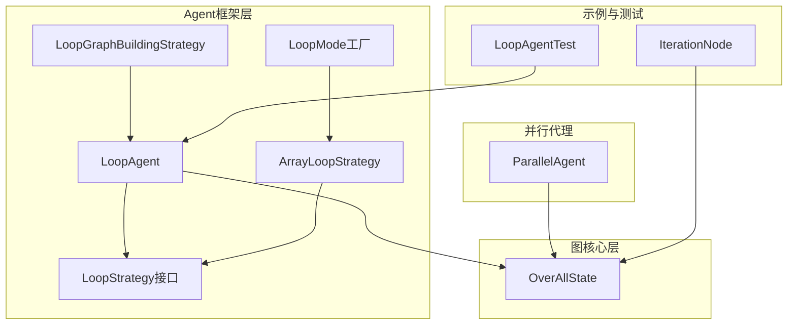
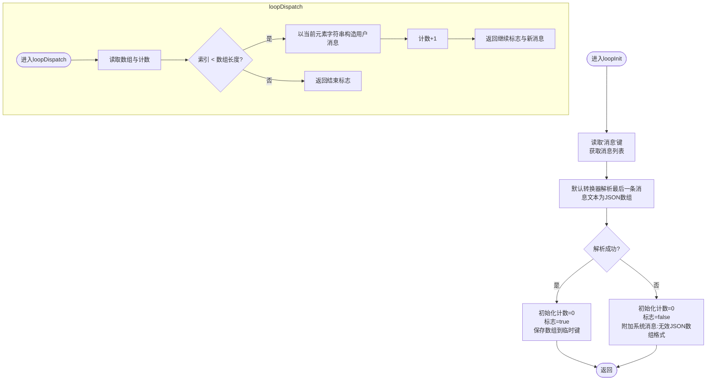
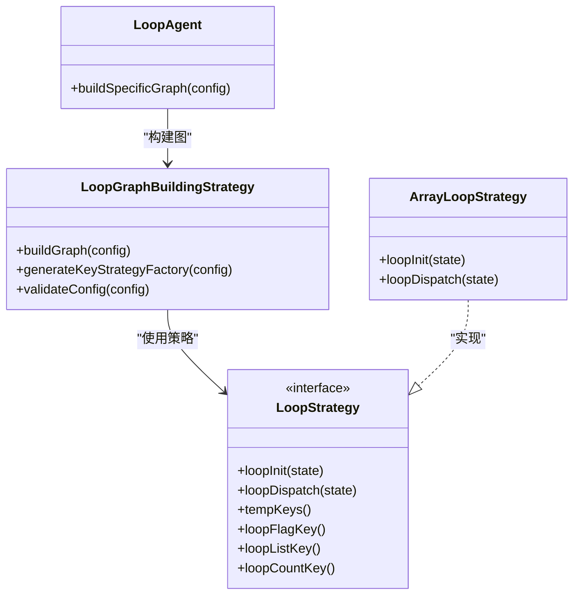
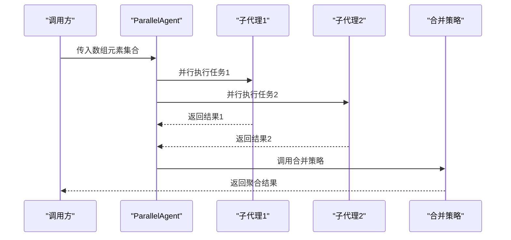
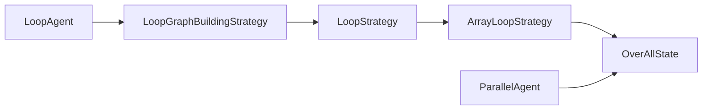

# 基于数组的循环

<cite>
**本文引用的文件**
- [ArrayLoopStrategy.java](file://spring-ai-alibaba-agent-framework/src/main/java/com/alibaba/cloud/ai/graph/agent/flow/agent/loop/ArrayLoopStrategy.java)
- [LoopStrategy.java](file://spring-ai-alibaba-agent-framework/src/main/java/com/alibaba/cloud/ai/graph/agent/flow/agent/loop/LoopStrategy.java)
- [LoopMode.java](file://spring-ai-alibaba-agent-framework/src/main/java/com/alibaba/cloud/ai/graph/agent/flow/agent/loop/LoopMode.java)
- [LoopAgent.java](file://spring-ai-alibaba-agent-framework/src/main/java/com/alibaba/cloud/ai/graph/agent/flow/agent/LoopAgent.java)
- [LoopGraphBuildingStrategy.java](file://spring-ai-alibaba-agent-framework/src/main/java/com/alibaba/cloud/ai/graph/agent/flow/strategy/LoopGraphBuildingStrategy.java)
- [OverAllState.java](file://spring-ai-alibaba-graph-core/src/main/java/com/alibaba/cloud/ai/graph/OverAllState.java)
- [ParallelAgent.java](file://spring-ai-alibaba-agent-framework/src/main/java/com/alibaba/cloud/ai/graph/agent/flow/agent/ParallelAgent.java)
- [LoopAgentTest.java](file://spring-ai-alibaba-agent-framework/src/test/java/com/alibaba/cloud/ai/graph/agent/flow/LoopAgentTest.java)
- [IterationNode.java](file://spring-boot-starters/spring-ai-alibaba-starter-builtin-nodes/src/main/java/com/alibaba/cloud/ai/graph/node/IterationNode.java)
</cite>

## 目录
1. [简介](#简介)
2. [项目结构](#项目结构)
3. [核心组件](#核心组件)
4. [架构总览](#架构总览)
5. [详细组件分析](#详细组件分析)
6. [依赖关系分析](#依赖关系分析)
7. [性能考量](#性能考量)
8. [故障排查指南](#故障排查指南)
9. [结论](#结论)
10. [附录](#附录)

## 简介
本篇文档围绕“基于数组的循环”展开，系统性阐述 ArrayLoopStrategy 的实现原理与使用方式。其核心思想是：从全局状态 OverAllState 中提取目标数组（默认从消息列表的最后一条消息文本解析出 JSON 数组），遍历数组元素，为每个元素创建独立的执行上下文（通过替换消息键值），驱动子代理（或节点）逐项执行，从而实现数据批处理、逐项分析与并行化扩展。

该策略适用于多种场景：
- 批量处理用户请求：将一组自然语言问题作为数组传入，逐条生成 SQL 或其他响应。
- 数据集逐项分析：对文件列表、对象列表等进行逐项处理。
- 并行化扩展：结合 ParallelAgent 对数组元素进行并发处理，提升吞吐。

同时，文档还说明了与并行代理 ParallelAgent 的协同方式、性能优化与错误处理策略，帮助读者在真实业务中高效落地。

## 项目结构
围绕“数组循环”的相关代码主要分布在以下模块：
- agent 框架层：LoopAgent、LoopStrategy 接口及其实现（ArrayLoopStrategy）、LoopMode 工厂方法、LoopGraphBuildingStrategy 图构建策略。
- 图核心层：OverAllState 全局状态容器，提供键值存取与合并策略。
- 并行代理：ParallelAgent 提供并行执行与结果聚合能力。
- 示例与测试：LoopAgentTest 展示数组模式的典型用法；IterationNode 提供另一种“迭代节点”的实现思路，便于理解数组遍历的通用范式。



图表来源
- [LoopAgent.java](file://spring-ai-alibaba-agent-framework/src/main/java/com/alibaba/cloud/ai/graph/agent/flow/agent/LoopAgent.java#L58-L117)
- [LoopStrategy.java](file://spring-ai-alibaba-agent-framework/src/main/java/com/alibaba/cloud/ai/graph/agent/flow/agent/loop/LoopStrategy.java#L32-L89)
- [ArrayLoopStrategy.java](file://spring-ai-alibaba-agent-framework/src/main/java/com/alibaba/cloud/ai/graph/agent/flow/agent/loop/ArrayLoopStrategy.java#L37-L92)
- [LoopMode.java](file://spring-ai-alibaba-agent-framework/src/main/java/com/alibaba/cloud/ai/graph/agent/flow/agent/loop/LoopMode.java#L31-L51)
- [LoopGraphBuildingStrategy.java](file://spring-ai-alibaba-agent-framework/src/main/java/com/alibaba/cloud/ai/graph/agent/flow/strategy/LoopGraphBuildingStrategy.java#L66-L126)
- [OverAllState.java](file://spring-ai-alibaba-graph-core/src/main/java/com/alibaba/cloud/ai/graph/OverAllState.java#L470-L561)
- [ParallelAgent.java](file://spring-ai-alibaba-agent-framework/src/main/java/com/alibaba/cloud/ai/graph/agent/flow/agent/ParallelAgent.java#L1-L355)
- [LoopAgentTest.java](file://spring-ai-alibaba-agent-framework/src/test/java/com/alibaba/cloud/ai/graph/agent/flow/LoopAgentTest.java#L168-L188)
- [IterationNode.java](file://spring-boot-starters/spring-ai-alibaba-starter-builtin-nodes/src/main/java/com/alibaba/cloud/ai/graph/node/IterationNode.java#L452-L544)

章节来源
- [LoopAgent.java](file://spring-ai-alibaba-agent-framework/src/main/java/com/alibaba/cloud/ai/graph/agent/flow/agent/LoopAgent.java#L58-L117)
- [LoopStrategy.java](file://spring-ai-alibaba-agent-framework/src/main/java/com/alibaba/cloud/ai/graph/agent/flow/agent/loop/LoopStrategy.java#L32-L89)
- [ArrayLoopStrategy.java](file://spring-ai-alibaba-agent-framework/src/main/java/com/alibaba/cloud/ai/graph/agent/flow/agent/loop/ArrayLoopStrategy.java#L37-L92)
- [LoopMode.java](file://spring-ai-alibaba-agent-framework/src/main/java/com/alibaba/cloud/ai/graph/agent/flow/agent/loop/LoopMode.java#L31-L51)
- [LoopGraphBuildingStrategy.java](file://spring-ai-alibaba-agent-framework/src/main/java/com/alibaba/cloud/ai/graph/agent/flow/strategy/LoopGraphBuildingStrategy.java#L66-L126)
- [OverAllState.java](file://spring-ai-alibaba-graph-core/src/main/java/com/alibaba/cloud/ai/graph/OverAllState.java#L470-L561)
- [ParallelAgent.java](file://spring-ai-alibaba-agent-framework/src/main/java/com/alibaba/cloud/ai/graph/agent/flow/agent/ParallelAgent.java#L1-L355)
- [LoopAgentTest.java](file://spring-ai-alibaba-agent-framework/src/test/java/com/alibaba/cloud/ai/graph/agent/flow/LoopAgentTest.java#L168-L188)
- [IterationNode.java](file://spring-boot-starters/spring-ai-alibaba-starter-builtin-nodes/src/main/java/com/alibaba/cloud/ai/graph/node/IterationNode.java#L452-L544)

## 核心组件
- ArrayLoopStrategy：基于数组的循环策略实现，负责从消息列表中解析 JSON 数组，维护循环计数与标志位，并为每个元素生成新的消息上下文。
- LoopStrategy：循环策略接口，定义临时键名、初始化与分发逻辑、最大循环次数等约定。
- LoopMode：内置策略工厂，提供 array() 与 array(Converter) 等便捷构造方法。
- LoopAgent：封装循环控制的代理，通过 LoopGraphBuildingStrategy 将策略编译为状态图。
- OverAllState：全局状态容器，提供键值存取、类型安全访问与合并策略。
- ParallelAgent：并行代理，支持并发执行多个子代理并进行结果聚合，可与数组循环配合实现批量并行处理。

章节来源
- [ArrayLoopStrategy.java](file://spring-ai-alibaba-agent-framework/src/main/java/com/alibaba/cloud/ai/graph/agent/flow/agent/loop/ArrayLoopStrategy.java#L37-L92)
- [LoopStrategy.java](file://spring-ai-alibaba-agent-framework/src/main/java/com/alibaba/cloud/ai/graph/agent/flow/agent/loop/LoopStrategy.java#L32-L89)
- [LoopMode.java](file://spring-ai-alibaba-agent-framework/src/main/java/com/alibaba/cloud/ai/graph/agent/flow/agent/loop/LoopMode.java#L31-L51)
- [LoopAgent.java](file://spring-ai-alibaba-agent-framework/src/main/java/com/alibaba/cloud/ai/graph/agent/flow/agent/LoopAgent.java#L58-L117)
- [LoopGraphBuildingStrategy.java](file://spring-ai-alibaba-agent-framework/src/main/java/com/alibaba/cloud/ai/graph/agent/flow/strategy/LoopGraphBuildingStrategy.java#L66-L126)
- [OverAllState.java](file://spring-ai-alibaba-graph-core/src/main/java/com/alibaba/cloud/ai/graph/OverAllState.java#L470-L561)
- [ParallelAgent.java](file://spring-ai-alibaba-agent-framework/src/main/java/com/alibaba/cloud/ai/graph/agent/flow/agent/ParallelAgent.java#L1-L355)

## 架构总览
下图展示了基于数组的循环在整体架构中的位置与交互关系：LoopAgent 通过 LoopGraphBuildingStrategy 将 ArrayLoopStrategy 编译为状态图，OverAllState 作为全局状态承载数组与消息上下文，子代理在每次迭代中接收新消息并产生结果，最终由 ParallelAgent 进行并行化与聚合。

```mermaid
sequenceDiagram
participant Client as "调用方"
participant Loop as "LoopAgent"
participant Strat as "ArrayLoopStrategy"
participant Graph as "LoopGraphBuildingStrategy"
participant State as "OverAllState"
participant Sub as "子代理/节点"
Client->>Loop : 调用invoke(输入)
Loop->>Graph : 构建循环图(注入策略)
Graph->>Strat : loopInit(State)
Strat->>State : 读取"messages"并解析数组
Strat-->>Graph : 返回初始计数/标志/数组
Graph->>Sub : 首次进入子代理
Sub-->>Graph : 子代理输出(含messages)
Graph->>Strat : loopDispatch(State)
Strat->>State : 读取数组与计数
Strat-->>Graph : 返回继续/结束标志与新消息
alt 继续
Graph->>Sub : 下一次迭代
Sub-->>Graph : 输出(含messages)
Graph->>Strat : loopDispatch
else 结束
Graph-->>Client : 返回最终状态
end
```

图表来源
- [LoopAgent.java](file://spring-ai-alibaba-agent-framework/src/main/java/com/alibaba/cloud/ai/graph/agent/flow/agent/LoopAgent.java#L69-L73)
- [LoopGraphBuildingStrategy.java](file://spring-ai-alibaba-agent-framework/src/main/java/com/alibaba/cloud/ai/graph/agent/flow/strategy/LoopGraphBuildingStrategy.java#L66-L86)
- [ArrayLoopStrategy.java](file://spring-ai-alibaba-agent-framework/src/main/java/com/alibaba/cloud/ai/graph/agent/flow/agent/loop/ArrayLoopStrategy.java#L49-L72)
- [OverAllState.java](file://spring-ai-alibaba-graph-core/src/main/java/com/alibaba/cloud/ai/graph/OverAllState.java#L470-L561)

## 详细组件分析

### ArrayLoopStrategy 实现原理
- 初始化阶段（loopInit）
  - 从 OverAllState 的消息键中读取消息列表，使用默认转换器将最后一条消息文本解析为 JSON 数组。
  - 若解析成功，初始化循环计数为 0、循环标志为 true，并将数组保存在临时键中；否则设置标志为 false，并附加系统消息提示格式无效。
- 分发阶段（loopDispatch）
  - 从临时数组键读取当前数组，从计数键读取当前索引。
  - 若索引小于数组长度，则以当前元素字符串形式构造用户消息，递增计数并返回继续标志；否则返回结束标志。
- 默认转换器
  - 默认从消息列表的最后一条消息文本解析 JSON 数组；若无消息或解析失败则返回空，触发初始化失败路径。



图表来源
- [ArrayLoopStrategy.java](file://spring-ai-alibaba-agent-framework/src/main/java/com/alibaba/cloud/ai/graph/agent/flow/agent/loop/ArrayLoopStrategy.java#L49-L92)
- [LoopStrategy.java](file://spring-ai-alibaba-agent-framework/src/main/java/com/alibaba/cloud/ai/graph/agent/flow/agent/loop/LoopStrategy.java#L32-L89)

章节来源
- [ArrayLoopStrategy.java](file://spring-ai-alibaba-agent-framework/src/main/java/com/alibaba/cloud/ai/graph/agent/flow/agent/loop/ArrayLoopStrategy.java#L37-L92)
- [LoopStrategy.java](file://spring-ai-alibaba-agent-framework/src/main/java/com/alibaba/cloud/ai/graph/agent/flow/agent/loop/LoopStrategy.java#L32-L89)

### LoopAgent 与 LoopGraphBuildingStrategy 的协作
- LoopAgent 将 LoopStrategy 注入到 FlowGraphBuilder 的自定义属性中，随后由 LoopGraphBuildingStrategy 构建状态图。
- 构建流程包含三个关键节点：初始化节点、分发节点与子代理节点；通过条件边控制“继续/结束”分支，形成标准的 do-while 循环结构。
- LoopGraphBuildingStrategy 还会注册策略所需的临时键（计数、标志、数组）为可替换策略，确保状态更新的一致性。



图表来源
- [LoopAgent.java](file://spring-ai-alibaba-agent-framework/src/main/java/com/alibaba/cloud/ai/graph/agent/flow/agent/LoopAgent.java#L69-L73)
- [LoopGraphBuildingStrategy.java](file://spring-ai-alibaba-agent-framework/src/main/java/com/alibaba/cloud/ai/graph/agent/flow/strategy/LoopGraphBuildingStrategy.java#L66-L126)
- [LoopStrategy.java](file://spring-ai-alibaba-agent-framework/src/main/java/com/alibaba/cloud/ai/graph/agent/flow/agent/loop/LoopStrategy.java#L32-L89)
- [ArrayLoopStrategy.java](file://spring-ai-alibaba-agent-framework/src/main/java/com/alibaba/cloud/ai/graph/agent/flow/agent/loop/ArrayLoopStrategy.java#L37-L92)

章节来源
- [LoopAgent.java](file://spring-ai-alibaba-agent-framework/src/main/java/com/alibaba/cloud/ai/graph/agent/flow/agent/LoopAgent.java#L58-L117)
- [LoopGraphBuildingStrategy.java](file://spring-ai-alibaba-agent-framework/src/main/java/com/alibaba/cloud/ai/graph/agent/flow/strategy/LoopGraphBuildingStrategy.java#L66-L126)
- [LoopStrategy.java](file://spring-ai-alibaba-agent-framework/src/main/java/com/alibaba/cloud/ai/graph/agent/flow/agent/loop/LoopStrategy.java#L32-L89)

### OverAllState 在数组循环中的作用
- 键值存取与类型安全
  - 提供 value(key)、value(key, Class)、value(key, T) 等方法，支持从状态中读取消息列表与数组等数据。
- 合并与策略
  - 支持为不同键注册 KeyStrategy，用于合并或替换，保证数组与消息在多次迭代中的正确累积。
- 序列化与快照
  - 可序列化状态，便于持久化、检查点与跨节点通信，这对长流程的数组循环尤为关键。

章节来源
- [OverAllState.java](file://spring-ai-alibaba-graph-core/src/main/java/com/alibaba/cloud/ai/graph/OverAllState.java#L470-L561)

### 与并行代理（ParallelAgent）的协同
- 场景一：数组元素并行处理
  - 将数组元素拆分为多个子任务，交由 ParallelAgent 并行执行，再通过合并策略汇总结果。
  - 可配置最大并发度与合并输出键，平衡吞吐与资源占用。
- 场景二：数组循环 + 并行子任务
  - 外层使用 ArrayLoopStrategy 遍历数组，内层子代理内部再使用 ParallelAgent 对子任务进行并行化，实现“两级并行”。



图表来源
- [ParallelAgent.java](file://spring-ai-alibaba-agent-framework/src/main/java/com/alibaba/cloud/ai/graph/agent/flow/agent/ParallelAgent.java#L1-L355)

章节来源
- [ParallelAgent.java](file://spring-ai-alibaba-agent-framework/src/main/java/com/alibaba/cloud/ai/graph/agent/flow/agent/ParallelAgent.java#L1-L355)

### 实际使用示例与配置要点
- 使用数组模式的典型流程
  - 构造 LoopAgent，指定 subAgent 与 LoopMode.array() 策略。
  - invoke 时传入 JSON 数组字符串（默认由 ArrayLoopStrategy 解析）。
  - 测试用例展示了数组模式下的行为：messages 列表中包含多条消息，表明每条数组元素都被逐一处理。
- 自定义转换器
  - 若需要从非消息列表中提取数组，可通过 LoopMode.array(Converter) 注入自定义转换器，实现灵活的数据源适配。
- 与迭代节点（IterationNode）对比
  - IterationNode 提供了更完整的迭代生命周期管理（开始、迭代、结束），适合复杂场景；ArrayLoopStrategy 更轻量，聚焦“数组元素逐个发送给模型”的核心需求。

章节来源
- [LoopAgentTest.java](file://spring-ai-alibaba-agent-framework/src/test/java/com/alibaba/cloud/ai/graph/agent/flow/LoopAgentTest.java#L168-L188)
- [LoopMode.java](file://spring-ai-alibaba-agent-framework/src/main/java/com/alibaba/cloud/ai/graph/agent/flow/agent/loop/LoopMode.java#L31-L51)
- [IterationNode.java](file://spring-boot-starters/spring-ai-alibaba-starter-builtin-nodes/src/main/java/com/alibaba/cloud/ai/graph/node/IterationNode.java#L452-L544)

## 依赖关系分析
- 组件耦合
  - LoopAgent 与 LoopGraphBuildingStrategy 强耦合，前者负责装配策略，后者负责图构建与键策略注册。
  - ArrayLoopStrategy 依赖 OverAllState 的消息键与临时键约定，依赖默认转换器进行 JSON 解析。
  - ParallelAgent 与 OverAllState 解耦，通过输入/输出键与合并策略参与数据流。
- 关键依赖链
  - LoopAgent → LoopGraphBuildingStrategy → LoopStrategy → OverAllState
  - ParallelAgent → OverAllState（通过输入键与合并策略）



图表来源
- [LoopAgent.java](file://spring-ai-alibaba-agent-framework/src/main/java/com/alibaba/cloud/ai/graph/agent/flow/agent/LoopAgent.java#L69-L73)
- [LoopGraphBuildingStrategy.java](file://spring-ai-alibaba-agent-framework/src/main/java/com/alibaba/cloud/ai/graph/agent/flow/strategy/LoopGraphBuildingStrategy.java#L66-L126)
- [LoopStrategy.java](file://spring-ai-alibaba-agent-framework/src/main/java/com/alibaba/cloud/ai/graph/agent/flow/agent/loop/LoopStrategy.java#L32-L89)
- [ArrayLoopStrategy.java](file://spring-ai-alibaba-agent-framework/src/main/java/com/alibaba/cloud/ai/graph/agent/flow/agent/loop/ArrayLoopStrategy.java#L37-L92)
- [OverAllState.java](file://spring-ai-alibaba-graph-core/src/main/java/com/alibaba/cloud/ai/graph/OverAllState.java#L470-L561)
- [ParallelAgent.java](file://spring-ai-alibaba-agent-framework/src/main/java/com/alibaba/cloud/ai/graph/agent/flow/agent/ParallelAgent.java#L1-L355)

章节来源
- [LoopAgent.java](file://spring-ai-alibaba-agent-framework/src/main/java/com/alibaba/cloud/ai/graph/agent/flow/agent/LoopAgent.java#L58-L117)
- [LoopGraphBuildingStrategy.java](file://spring-ai-alibaba-agent-framework/src/main/java/com/alibaba/cloud/ai/graph/agent/flow/strategy/LoopGraphBuildingStrategy.java#L66-L126)
- [ArrayLoopStrategy.java](file://spring-ai-alibaba-agent-framework/src/main/java/com/alibaba/cloud/ai/graph/agent/flow/agent/loop/ArrayLoopStrategy.java#L37-L92)
- [OverAllState.java](file://spring-ai-alibaba-graph-core/src/main/java/com/alibaba/cloud/ai/graph/OverAllState.java#L470-L561)
- [ParallelAgent.java](file://spring-ai-alibaba-agent-framework/src/main/java/com/alibaba/cloud/ai/graph/agent/flow/agent/ParallelAgent.java#L1-L355)

## 性能考量
- 最大循环次数
  - LoopStrategy 定义了可迭代元素上限，避免无限循环导致的资源耗尽。
- 并发与限流
  - ParallelAgent 支持最大并发度配置，建议根据下游模型的并发限制与资源情况合理设置，防止过载。
- 状态序列化
  - OverAllState 可序列化，适合在长流程中做检查点与恢复；但频繁序列化可能带来开销，应权衡频率与必要性。
- 输入大小与批处理
  - 对超大数组，建议分批处理或采用流式处理策略，避免单次 invoke 占用过多内存。

章节来源
- [LoopStrategy.java](file://spring-ai-alibaba-agent-framework/src/main/java/com/alibaba/cloud/ai/graph/agent/flow/agent/loop/LoopStrategy.java#L32-L89)
- [ParallelAgent.java](file://spring-ai-alibaba-agent-framework/src/main/java/com/alibaba/cloud/ai/graph/agent/flow/agent/ParallelAgent.java#L1-L355)
- [OverAllState.java](file://spring-ai-alibaba-graph-core/src/main/java/com/alibaba/cloud/ai/graph/OverAllState.java#L470-L561)

## 故障排查指南
- 数组解析失败
  - 现象：初始化阶段返回标志为 false，并附带系统消息提示无效 JSON 数组格式。
  - 排查：确认传入的是合法 JSON 数组字符串；或提供自定义转换器以适配非消息列表的数据源。
- 循环未结束
  - 现象：超过最大循环次数后仍未结束。
  - 排查：检查 loopDispatch 的计数与边界条件；确认子代理是否按预期更新状态。
- 并行结果不一致
  - 现象：并行执行后聚合结果不符合预期。
  - 排查：核对各子代理的输出键唯一性与合并策略；确保共享状态键策略一致。
- 状态键冲突
  - 现象：状态更新异常或覆盖。
  - 排查：确认临时键（计数、标志、数组）已注册为可替换策略；避免与其他键冲突。

章节来源
- [ArrayLoopStrategy.java](file://spring-ai-alibaba-agent-framework/src/main/java/com/alibaba/cloud/ai/graph/agent/flow/agent/loop/ArrayLoopStrategy.java#L49-L92)
- [LoopGraphBuildingStrategy.java](file://spring-ai-alibaba-agent-framework/src/main/java/com/alibaba/cloud/ai/graph/agent/flow/strategy/LoopGraphBuildingStrategy.java#L94-L112)
- [ParallelAgent.java](file://spring-ai-alibaba-agent-framework/src/main/java/com/alibaba/cloud/ai/graph/agent/flow/agent/ParallelAgent.java#L234-L291)

## 结论
ArrayLoopStrategy 通过从 OverAllState 中提取数组并逐项生成消息上下文，实现了对数组元素的统一驱动执行。它与 LoopAgent、LoopGraphBuildingStrategy 协作，形成稳定的循环执行图；结合 ParallelAgent，可在数据批处理、逐项分析与并行化场景中发挥重要作用。通过自定义转换器与合理的并发配置，可进一步提升灵活性与性能。

## 附录
- 快速上手步骤
  - 选择 LoopMode.array() 或 LoopMode.array(Converter) 作为循环策略。
  - 构建 LoopAgent 并设置子代理。
  - 传入 JSON 数组字符串作为输入，调用 invoke 观察 messages 的累积效果。
  - 如需并行化，将数组元素拆分后交由 ParallelAgent 执行，并配置合并策略。

章节来源
- [LoopMode.java](file://spring-ai-alibaba-agent-framework/src/main/java/com/alibaba/cloud/ai/graph/agent/flow/agent/loop/LoopMode.java#L31-L51)
- [LoopAgentTest.java](file://spring-ai-alibaba-agent-framework/src/test/java/com/alibaba/cloud/ai/graph/agent/flow/LoopAgentTest.java#L168-L188)