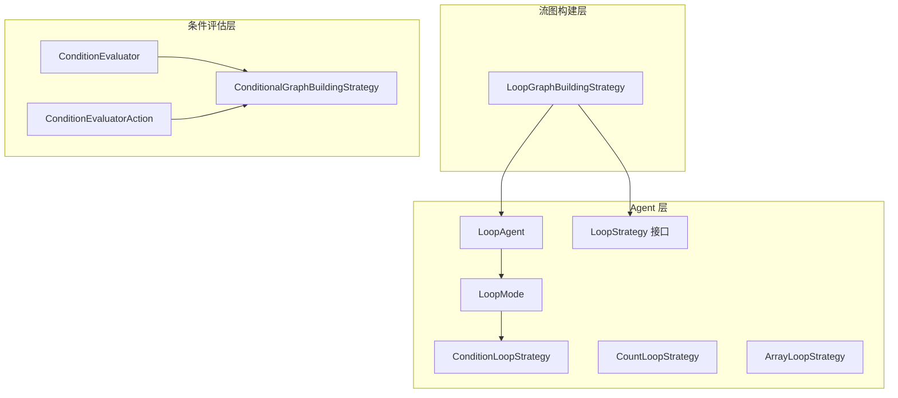
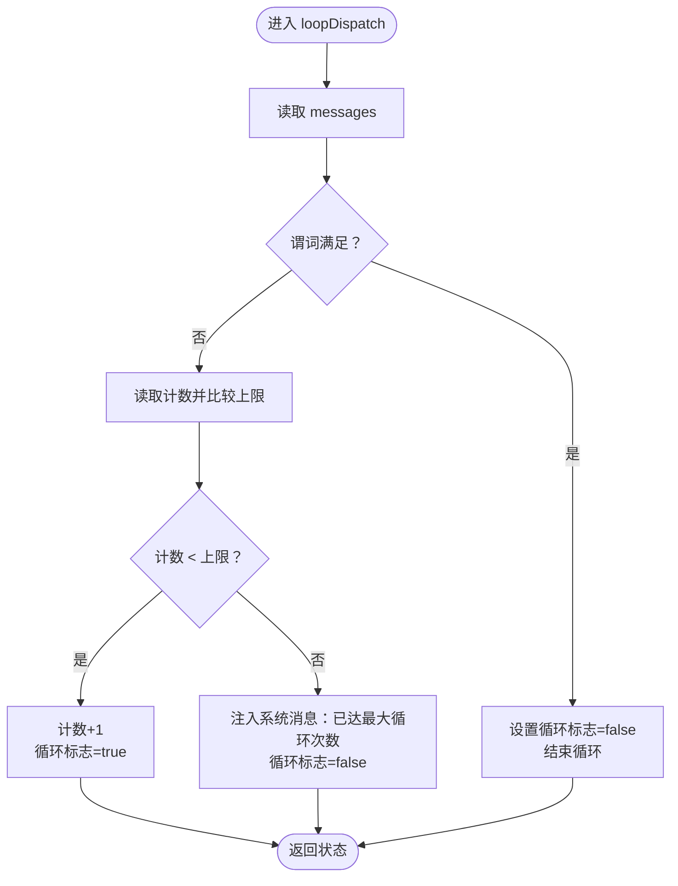
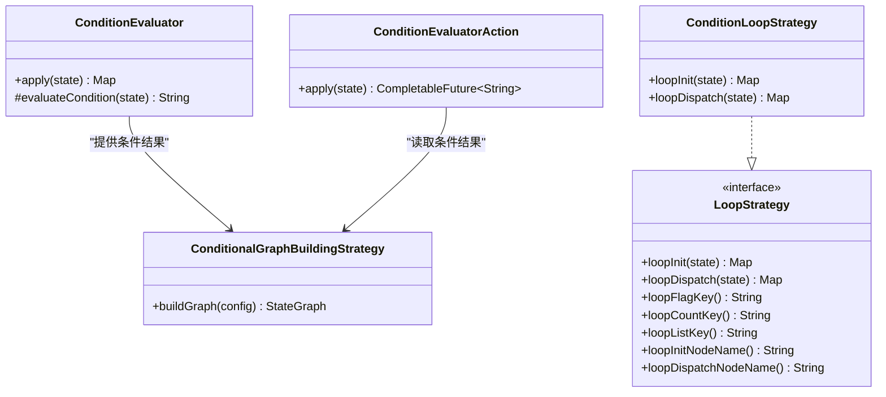
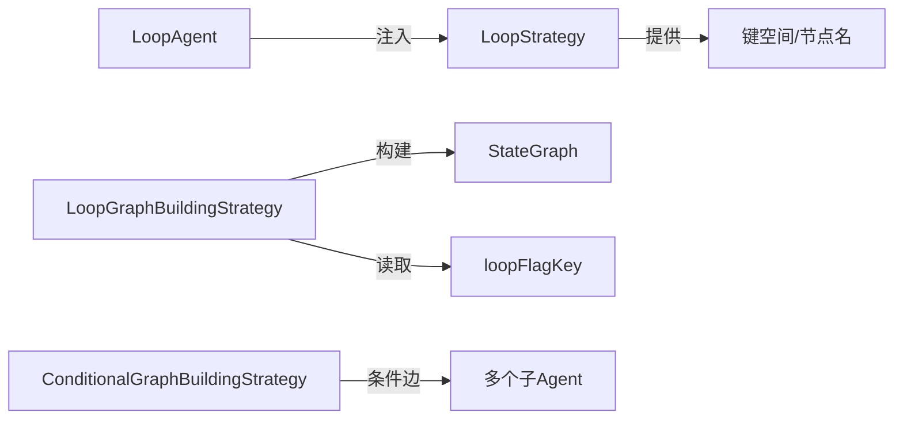

# 基于条件的循环

<cite>
**本文引用的文件**
- [ConditionLoopStrategy.java](file://spring-ai-alibaba-agent-framework/src/main/java/com/alibaba/cloud/ai/graph/agent/flow/agent/loop/ConditionLoopStrategy.java)
- [LoopStrategy.java](file://spring-ai-alibaba-agent-framework/src/main/java/com/alibaba/cloud/ai/graph/agent/flow/agent/loop/LoopStrategy.java)
- [LoopMode.java](file://spring-ai-alibaba-agent-framework/src/main/java/com/alibaba/cloud/ai/graph/agent/flow/agent/loop/LoopMode.java)
- [LoopAgent.java](file://spring-ai-alibaba-agent-framework/src/main/java/com/alibaba/cloud/ai/graph/agent/flow/agent/LoopAgent.java)
- [LoopGraphBuildingStrategy.java](file://spring-ai-alibaba-agent-framework/src/main/java/com/alibaba/cloud/ai/graph/agent/flow/strategy/LoopGraphBuildingStrategy.java)
- [ConditionEvaluator.java](file://spring-ai-alibaba-agent-framework/src/main/java/com/alibaba/cloud/ai/graph/agent/flow/node/ConditionEvaluator.java)
- [ConditionEvaluatorAction.java](file://spring-ai-alibaba-agent-framework/src/main/java/com/alibaba/cloud/ai/graph/agent/flow/node/ConditionEvaluatorAction.java)
- [ConditionalGraphBuildingStrategy.java](file://spring-ai-alibaba-agent-framework/src/main/java/com/alibaba/cloud/ai/graph/agent/flow/strategy/ConditionalGraphBuildingStrategy.java)
- [LoopAgentTest.java](file://spring-ai-alibaba-agent-framework/src/test/java/com/alibaba/cloud/ai/graph/agent/flow/LoopAgentTest.java)
</cite>

## 目录
1. [简介](#简介)
2. [项目结构](#项目结构)
3. [核心组件](#核心组件)
4. [架构总览](#架构总览)
5. [详细组件分析](#详细组件分析)
6. [依赖关系分析](#依赖关系分析)
7. [性能与可靠性考量](#性能与可靠性考量)
8. [故障排查指南](#故障排查指南)
9. [结论](#结论)
10. [附录：使用示例与最佳实践](#附录使用示例与最佳实践)

## 简介
本篇文档围绕“基于条件的循环”展开，重点解释 ConditionLoopStrategy 的实现原理与工作机制，阐述其如何通过评估状态图中的条件表达式来决定是否继续循环；同时介绍条件评估器 ConditionEvaluator 的工作方式与配置方法，帮助读者理解如何定义复杂的布尔表达式以监控状态变化。文档还提供实际代码示例路径，展示如何构建条件循环，包括等待异步任务完成、监控系统状态变化或实现动态迭代优化等常见用法，并讨论在事件驱动架构中的应用以及如何规避无限循环风险（如超时与状态变化检测）。

## 项目结构
围绕条件循环的相关代码主要位于以下模块：
- agent 层：LoopAgent、LoopStrategy 接口及内置策略（LoopMode、CountLoopStrategy、ArrayLoopStrategy、ConditionLoopStrategy）
- 流图构建层：LoopGraphBuildingStrategy 将 LoopAgent 转换为 StateGraph，形成循环控制流
- 条件评估层：ConditionEvaluator 与 ConditionEvaluatorAction 提供条件评估与路由决策
- 示例与测试：LoopAgentTest 展示了 condition 模式的典型用法



图表来源
- [LoopAgent.java](file://spring-ai-alibaba-agent-framework/src/main/java/com/alibaba/cloud/ai/graph/agent/flow/agent/LoopAgent.java#L58-L117)
- [LoopStrategy.java](file://spring-ai-alibaba-agent-framework/src/main/java/com/alibaba/cloud/ai/graph/agent/flow/agent/loop/LoopStrategy.java#L32-L88)
- [LoopMode.java](file://spring-ai-alibaba-agent-framework/src/main/java/com/alibaba/cloud/ai/graph/agent/flow/agent/loop/LoopMode.java#L31-L51)
- [ConditionLoopStrategy.java](file://spring-ai-alibaba-agent-framework/src/main/java/com/alibaba/cloud/ai/graph/agent/flow/agent/loop/ConditionLoopStrategy.java#L33-L63)
- [LoopGraphBuildingStrategy.java](file://spring-ai-alibaba-agent-framework/src/main/java/com/alibaba/cloud/ai/graph/agent/flow/strategy/LoopGraphBuildingStrategy.java#L52-L86)
- [ConditionEvaluator.java](file://spring-ai-alibaba-agent-framework/src/main/java/com/alibaba/cloud/ai/graph/agent/flow/node/ConditionEvaluator.java#L28-L80)
- [ConditionEvaluatorAction.java](file://spring-ai-alibaba-agent-framework/src/main/java/com/alibaba/cloud/ai/graph/agent/flow/node/ConditionEvaluatorAction.java#L27-L47)
- [ConditionalGraphBuildingStrategy.java](file://spring-ai-alibaba-agent-framework/src/main/java/com/alibaba/cloud/ai/graph/agent/flow/strategy/ConditionalGraphBuildingStrategy.java#L40-L85)

章节来源
- [LoopAgent.java](file://spring-ai-alibaba-agent-framework/src/main/java/com/alibaba/cloud/ai/graph/agent/flow/agent/LoopAgent.java#L27-L117)
- [LoopGraphBuildingStrategy.java](file://spring-ai-alibaba-agent-framework/src/main/java/com/alibaba/cloud/ai/graph/agent/flow/strategy/LoopGraphBuildingStrategy.java#L52-L86)

## 核心组件
- LoopStrategy 接口：定义循环控制所需的键空间、节点命名约定、初始化与调度逻辑，以及最大循环次数上限。
- ConditionLoopStrategy：基于 Predicate<List<Message>> 的条件判断，当条件满足时终止循环；否则在达到最大次数前继续循环。
- LoopMode：提供内置策略工厂方法，便于快速选择 LoopStrategy 实现。
- LoopAgent：封装循环行为，将 LoopStrategy 注入并交由 LoopGraphBuildingStrategy 构建 StateGraph。
- ConditionEvaluator 与 ConditionEvaluatorAction：在条件图中对状态进行评估并输出路由键，配合 ConditionalGraphBuildingStrategy 完成分支选择。
- LoopGraphBuildingStrategy：将 LoopAgent 的循环逻辑映射为 StateGraph，形成“初始化 -> 分派 -> 子图 -> 分派”的闭环。

章节来源
- [LoopStrategy.java](file://spring-ai-alibaba-agent-framework/src/main/java/com/alibaba/cloud/ai/graph/agent/flow/agent/loop/LoopStrategy.java#L32-L88)
- [ConditionLoopStrategy.java](file://spring-ai-alibaba-agent-framework/src/main/java/com/alibaba/cloud/ai/graph/agent/flow/agent/loop/ConditionLoopStrategy.java#L33-L63)
- [LoopMode.java](file://spring-ai-alibaba-agent-framework/src/main/java/com/alibaba/cloud/ai/graph/agent/flow/agent/loop/LoopMode.java#L31-L51)
- [LoopAgent.java](file://spring-ai-alibaba-agent-framework/src/main/java/com/alibaba/cloud/ai/graph/agent/flow/agent/LoopAgent.java#L58-L117)
- [ConditionEvaluator.java](file://spring-ai-alibaba-agent-framework/src/main/java/com/alibaba/cloud/ai/graph/agent/flow/node/ConditionEvaluator.java#L28-L80)
- [ConditionEvaluatorAction.java](file://spring-ai-alibaba-agent-framework/src/main/java/com/alibaba/cloud/ai/graph/agent/flow/node/ConditionEvaluatorAction.java#L27-L47)
- [ConditionalGraphBuildingStrategy.java](file://spring-ai-alibaba-agent-framework/src/main/java/com/alibaba/cloud/ai/graph/agent/flow/strategy/ConditionalGraphBuildingStrategy.java#L40-L85)
- [LoopGraphBuildingStrategy.java](file://spring-ai-alibaba-agent-framework/src/main/java/com/alibaba/cloud/ai/graph/agent/flow/strategy/LoopGraphBuildingStrategy.java#L52-L86)

## 架构总览
下图展示了基于条件的循环在 LoopAgent 中的运行流程：LoopGraphBuildingStrategy 将 LoopStrategy 的 loopInit 与 loopDispatch 映射为两个节点，并在每次子图执行后根据 loopFlagKey 决定继续或退出循环。

```mermaid
sequenceDiagram
participant Root as "根透明节点"
participant Init as "循环初始化节点"
participant Dispatch as "循环分派节点"
participant Sub as "子图/子Agent"
participant Strat as "LoopStrategy"
Root->>Init : 触发初始化
Init->>Strat : loopInit(state)
Strat-->>Init : 返回计数/标志等状态
Init-->>Dispatch : 进入分派阶段
loop 每次迭代
Dispatch->>Strat : loopDispatch(state)
Strat-->>Dispatch : 返回{loopFlagKey, loopCountKey, 可选消息}
alt 继续循环
Dispatch-->>Sub : 跳转到子图
Sub-->>Dispatch : 子图结束
else 退出循环
Dispatch-->>End : 结束
end
end
```

图表来源
- [LoopGraphBuildingStrategy.java](file://spring-ai-alibaba-agent-framework/src/main/java/com/alibaba/cloud/ai/graph/agent/flow/strategy/LoopGraphBuildingStrategy.java#L66-L84)
- [LoopStrategy.java](file://spring-ai-alibaba-agent-framework/src/main/java/com/alibaba/cloud/ai/graph/agent/flow/agent/loop/LoopStrategy.java#L48-L88)
- [ConditionLoopStrategy.java](file://spring-ai-alibaba-agent-framework/src/main/java/com/alibaba/cloud/ai/graph/agent/flow/agent/loop/ConditionLoopStrategy.java#L44-L63)

章节来源
- [LoopGraphBuildingStrategy.java](file://spring-ai-alibaba-agent-framework/src/main/java/com/alibaba/cloud/ai/graph/agent/flow/strategy/LoopGraphBuildingStrategy.java#L52-L86)

## 详细组件分析

### ConditionLoopStrategy：基于条件的循环策略
- 设计要点
  - 使用 Predicate<List<Message>> 对当前消息列表进行布尔判定，满足则终止循环，不满足则递增计数并在未达上限时继续。
  - 当达到最大循环次数仍未满足条件时，向状态注入一条系统消息提示“已达最大循环次数”，并终止循环。
  - 通过 LoopStrategy 提供的键空间（loopCountKey、loopFlagKey、MESSAGE_KEY）管理状态。
- 关键行为
  - 初始化：重置计数并开启循环标志。
  - 分派：读取当前消息列表，调用谓词；若为真则关闭循环标志；否则检查计数是否小于上限，是则递增计数并保持循环；否则注入超时消息并关闭循环。
- 复杂度与性能
  - 时间复杂度：O(1) 每次迭代（谓词计算取决于具体实现），整体 O(N) 其中 N 为迭代次数。
  - 空间复杂度：O(1)，仅维护少量状态键。
- 风险与限制
  - 若谓词永远不满足且未设置上限，可能导致无限循环；上限由 LoopStrategy.maxLoopCount 控制。
  - 谓词应尽量轻量、幂等，避免副作用。



图表来源
- [ConditionLoopStrategy.java](file://spring-ai-alibaba-agent-framework/src/main/java/com/alibaba/cloud/ai/graph/agent/flow/agent/loop/ConditionLoopStrategy.java#L44-L63)
- [LoopStrategy.java](file://spring-ai-alibaba-agent-framework/src/main/java/com/alibaba/cloud/ai/graph/agent/flow/agent/loop/LoopStrategy.java#L64-L88)

章节来源
- [ConditionLoopStrategy.java](file://spring-ai-alibaba-agent-framework/src/main/java/com/alibaba/cloud/ai/graph/agent/flow/agent/loop/ConditionLoopStrategy.java#L33-L63)
- [LoopStrategy.java](file://spring-ai-alibaba-agent-framework/src/main/java/com/alibaba/cloud/ai/graph/agent/flow/agent/loop/LoopStrategy.java#L32-L88)

### LoopStrategy 接口与键空间
- 键空间约定
  - loopFlagKey：控制是否继续循环的布尔标志
  - loopCountKey：当前循环计数
  - loopListKey：可选的迭代列表键（用于数组型策略）
  - MESSAGE_KEY：用于传递消息输入/输出
- 节点命名
  - loopInitNodeName 与 loopDispatchNodeName 为每个 LoopStrategy 实例生成唯一节点名，避免冲突。
- 最大循环次数
  - 默认上限由 maxLoopCount 提供，内置策略会裁剪传入的最大值。

章节来源
- [LoopStrategy.java](file://spring-ai-alibaba-agent-framework/src/main/java/com/alibaba/cloud/ai/graph/agent/flow/agent/loop/LoopStrategy.java#L32-L88)

### LoopMode：内置策略工厂
- 提供 count、array、condition 等工厂方法，简化 LoopStrategy 的创建与使用。
- condition 工厂直接接收 Predicate<List<Message>>，便于快速组合业务条件。

章节来源
- [LoopMode.java](file://spring-ai-alibaba-agent-framework/src/main/java/com/alibaba/cloud/ai/graph/agent/flow/agent/loop/LoopMode.java#L31-L51)

### LoopAgent：循环代理
- 负责将 LoopStrategy 注入到配置中，并委托 FlowGraphBuilder 使用 LoopGraphBuildingStrategy 构建 StateGraph。
- 约束：LoopAgent 必须仅包含一个子 Agent。

章节来源
- [LoopAgent.java](file://spring-ai-alibaba-agent-framework/src/main/java/com/alibaba/cloud/ai/graph/agent/flow/agent/LoopAgent.java#L58-L117)

### 条件评估器与条件图构建
- ConditionEvaluator：从状态中读取输入并计算条件结果，写入内部键以便后续路由。
- ConditionEvaluatorAction：从状态读取条件结果键，作为边的路由键，驱动 ConditionalGraphBuildingStrategy 的条件边。
- ConditionalGraphBuildingStrategy：将条件评估节点与多个子 Agent 映射为条件边，支持默认分支（default -> END）。



图表来源
- [ConditionEvaluator.java](file://spring-ai-alibaba-agent-framework/src/main/java/com/alibaba/cloud/ai/graph/agent/flow/node/ConditionEvaluator.java#L28-L80)
- [ConditionEvaluatorAction.java](file://spring-ai-alibaba-agent-framework/src/main/java/com/alibaba/cloud/ai/graph/agent/flow/node/ConditionEvaluatorAction.java#L27-L47)
- [ConditionalGraphBuildingStrategy.java](file://spring-ai-alibaba-agent-framework/src/main/java/com/alibaba/cloud/ai/graph/agent/flow/strategy/ConditionalGraphBuildingStrategy.java#L40-L85)
- [LoopStrategy.java](file://spring-ai-alibaba-agent-framework/src/main/java/com/alibaba/cloud/ai/graph/agent/flow/agent/loop/LoopStrategy.java#L48-L88)
- [ConditionLoopStrategy.java](file://spring-ai-alibaba-agent-framework/src/main/java/com/alibaba/cloud/ai/graph/agent/flow/agent/loop/ConditionLoopStrategy.java#L44-L63)

章节来源
- [ConditionEvaluator.java](file://spring-ai-alibaba-agent-framework/src/main/java/com/alibaba/cloud/ai/graph/agent/flow/node/ConditionEvaluator.java#L28-L80)
- [ConditionEvaluatorAction.java](file://spring-ai-alibaba-agent-framework/src/main/java/com/alibaba/cloud/ai/graph/agent/flow/node/ConditionEvaluatorAction.java#L27-L47)
- [ConditionalGraphBuildingStrategy.java](file://spring-ai-alibaba-agent-framework/src/main/java/com/alibaba/cloud/ai/graph/agent/flow/strategy/ConditionalGraphBuildingStrategy.java#L40-L85)

## 依赖关系分析
- LoopGraphBuildingStrategy 依赖 LoopStrategy 的接口约定（键空间、节点名、初始化/分派方法），并通过条件边将 loopFlagKey 的布尔值映射为“continue/break”分支。
- LoopAgent 将 LoopStrategy 注入配置，再由 FlowGraphBuilder 选择 LoopGraphBuildingStrategy 构建 StateGraph。
- 条件图构建策略独立于循环策略，但两者均可在更复杂的图中并存：条件图用于多分支路由，循环图用于重复执行同一子图。



图表来源
- [LoopGraphBuildingStrategy.java](file://spring-ai-alibaba-agent-framework/src/main/java/com/alibaba/cloud/ai/graph/agent/flow/strategy/LoopGraphBuildingStrategy.java#L66-L84)
- [LoopStrategy.java](file://spring-ai-alibaba-agent-framework/src/main/java/com/alibaba/cloud/ai/graph/agent/flow/agent/loop/LoopStrategy.java#L48-L88)
- [ConditionalGraphBuildingStrategy.java](file://spring-ai-alibaba-agent-framework/src/main/java/com/alibaba/cloud/ai/graph/agent/flow/strategy/ConditionalGraphBuildingStrategy.java#L40-L85)

章节来源
- [LoopGraphBuildingStrategy.java](file://spring-ai-alibaba-agent-framework/src/main/java/com/alibaba/cloud/ai/graph/agent/flow/strategy/LoopGraphBuildingStrategy.java#L52-L86)
- [LoopAgent.java](file://spring-ai-alibaba-agent-framework/src/main/java/com/alibaba/cloud/ai/graph/agent/flow/agent/LoopAgent.java#L70-L73)

## 性能与可靠性考量
- 谓词开销控制
  - 建议将谓词设计为纯函数、无副作用，避免在谓词中执行昂贵操作（如网络请求、IO）。
  - 若需要外部状态，优先通过状态键读取，减少跨组件耦合。
- 循环上限与超时
  - ConditionLoopStrategy 已内置上限保护；建议结合业务设定合理上限，防止无限循环。
  - 在事件驱动场景中，可结合外部事件源（如定时器、外部回调）更新状态键，使谓词具备“状态变化检测”能力。
- 并发与一致性
  - LoopGraphBuildingStrategy 支持异步节点与边动作，注意状态键的并发访问与可见性。
  - 若使用自定义执行器，需确保线程安全与资源释放。

[本节为通用指导，无需列出具体文件来源]

## 故障排查指南
- 常见问题
  - 循环未退出：检查谓词是否始终返回 false；确认 MESSAGE_KEY 是否正确传递至谓词。
  - 无限循环：确认 maxLoopCount 是否被正确使用；必要时在谓词中加入“兜底”逻辑。
  - 路由错误：条件图中 ConditionEvaluatorAction 读取的键名需与 ConditionEvaluator 写入一致。
- 定位手段
  - 使用日志记录 loopCountKey 与 loopFlagKey 的变化，观察循环是否按预期推进。
  - 在谓词中打印关键状态（如最后一条消息文本），验证条件触发时机。
- 单元测试参考
  - LoopAgentTest 中提供了 condition 模式的测试样例，可对照其构造谓词与断言结果。

章节来源
- [LoopAgentTest.java](file://spring-ai-alibaba-agent-framework/src/test/java/com/alibaba/cloud/ai/graph/agent/flow/LoopAgentTest.java#L138-L166)

## 结论
ConditionLoopStrategy 通过 Predicate<List<Message>> 将“状态变化”转化为循环控制信号，结合 LoopStrategy 的键空间与 LoopGraphBuildingStrategy 的图构建能力，实现了灵活、可扩展的条件循环。配合 ConditionEvaluator/ConditionEvaluatorAction 的条件图，可在事件驱动架构中实现多分支与重复执行的复合控制流。实践中应重视谓词设计、上限与超时控制、状态变化检测，以确保系统的稳定性与可维护性。

[本节为总结性内容，无需列出具体文件来源]

## 附录：使用示例与最佳实践

### 如何构建基于条件的循环
- 快速上手
  - 使用 LoopMode.condition 构造 ConditionLoopStrategy，并将其注入 LoopAgent。
  - 在谓词中定义布尔表达式，例如基于最后一条消息的数值阈值。
- 示例路径
  - 条件循环示例（SQL评分阈值）：[LoopAgentTest.java](file://spring-ai-alibaba-agent-framework/src/test/java/com/alibaba/cloud/ai/graph/agent/flow/LoopAgentTest.java#L138-L166)
  - LoopAgent 构建与使用说明：[LoopAgent.java](file://spring-ai-alibaba-agent-framework/src/main/java/com/alibaba/cloud/ai/graph/agent/flow/agent/LoopAgent.java#L27-L67)

章节来源
- [LoopMode.java](file://spring-ai-alibaba-agent-framework/src/main/java/com/alibaba/cloud/ai/graph/agent/flow/agent/loop/LoopMode.java#L31-L51)
- [LoopAgent.java](file://spring-ai-alibaba-agent-framework/src/main/java/com/alibaba/cloud/ai/graph/agent/flow/agent/LoopAgent.java#L27-L67)
- [LoopAgentTest.java](file://spring-ai-alibaba-agent-framework/src/test/java/com/alibaba/cloud/ai/graph/agent/flow/LoopAgentTest.java#L138-L166)

### 实际应用场景
- 等待异步任务完成
  - 将异步任务的状态写入状态键，谓词轮询该键以判断完成条件。
- 监控系统状态变化
  - 依据最近若干条消息或指标阈值，动态调整循环终止条件。
- 动态迭代优化
  - 在每次迭代后根据输出质量（如评分）决定是否继续，直至满足目标。

[本小节为概念性说明，无需列出具体文件来源]

### 避免无限循环的风险控制
- 设置合理的 maxLoopCount，并在谓词中加入兜底逻辑（如超时、失败重试上限）。
- 使用状态变化检测：在每次迭代中引入新的输入或外部事件，确保谓词能感知到状态演进。
- 超时与中断：在图层增加超时边或中断钩子，防止长时间阻塞。

[本小节为通用指导，无需列出具体文件来源]