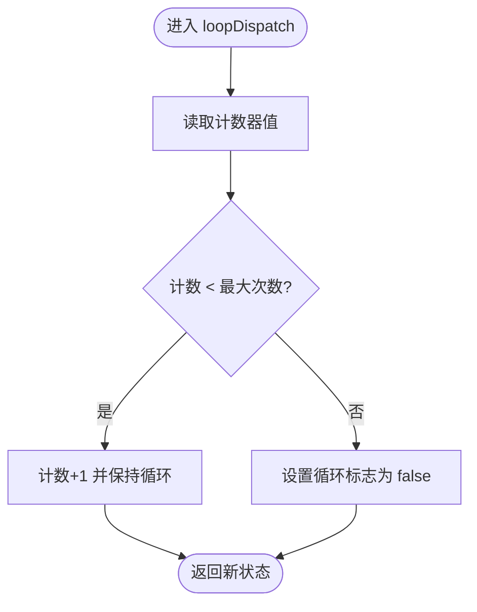

# 基于次数的循环

<cite>
**本文引用的文件列表**
- [CountLoopStrategy.java](file://spring-ai-alibaba-agent-framework/src/main/java/com/alibaba/cloud/ai/graph/agent/flow/agent/loop/CountLoopStrategy.java)
- [LoopStrategy.java](file://spring-ai-alibaba-agent-framework/src/main/java/com/alibaba/cloud/ai/graph/agent/flow/agent/loop/LoopStrategy.java)
- [LoopMode.java](file://spring-ai-alibaba-agent-framework/src/main/java/com/alibaba/cloud/ai/graph/agent/flow/agent/loop/LoopMode.java)
- [LoopAgent.java](file://spring-ai-alibaba-agent-framework/src/main/java/com/alibaba/cloud/ai/graph/agent/flow/agent/LoopAgent.java)
- [LoopGraphBuildingStrategy.java](file://spring-ai-alibaba-agent-framework/src/main/java/com/alibaba/cloud/ai/graph/agent/flow/strategy/LoopGraphBuildingStrategy.java)
- [LoopAgentTest.java](file://spring-ai-alibaba-agent-framework/src/test/java/com/alibaba/cloud/ai/graph/agent/flow/LoopAgentTest.java)
- [ConditionLoopStrategy.java](file://spring-ai-alibaba-agent-framework/src/main/java/com/alibaba/cloud/ai/graph/agent/flow/agent/loop/ConditionLoopStrategy.java)
- [ArrayLoopStrategy.java](file://spring-ai-alibaba-agent-framework/src/main/java/com/alibaba/cloud/ai/graph/agent/flow/agent/loop/ArrayLoopStrategy.java)
</cite>

## 目录
1. [引言](#引言)
2. [项目结构](#项目结构)
3. [核心组件](#核心组件)
4. [架构总览](#架构总览)
5. [详细组件分析](#详细组件分析)
6. [依赖关系分析](#依赖关系分析)
7. [性能与复杂度](#性能与复杂度)
8. [故障排查指南](#故障排查指南)
9. [结论](#结论)
10. [附录：常见用法与最佳实践](#附录常见用法与最佳实践)

## 引言
本篇文档围绕“基于次数的循环”（CountLoopStrategy）展开，系统阐述其在工作流中的实现原理、关键参数配置、运行时行为、与其他循环策略的差异，以及在批处理、多轮对话等场景的最佳实践与边界情况处理建议。读者无需深入源码即可理解如何在工作流中配置并使用 CountLoopStrategy 来实现固定轮次的迭代优化任务或指定次数的重试机制。

## 项目结构
CountLoopStrategy 所属模块位于 agent 流式执行框架中，围绕 LoopAgent 提供可插拔的循环策略接口 LoopStrategy，并由 LoopGraphBuildingStrategy 将策略编译为状态图节点，驱动子代理按策略推进。

图表来源
- [LoopStrategy.java](file://spring-ai-alibaba-agent-framework/src/main/java/com/alibaba/cloud/ai/graph/agent/flow/agent/loop/LoopStrategy.java#L1-L89)
- [CountLoopStrategy.java](file://spring-ai-alibaba-agent-framework/src/main/java/com/alibaba/cloud/ai/graph/agent/flow/agent/loop/CountLoopStrategy.java#L1-L52)
- [ConditionLoopStrategy.java](file://spring-ai-alibaba-agent-framework/src/main/java/com/alibaba/cloud/ai/graph/agent/flow/agent/loop/ConditionLoopStrategy.java#L1-L64)
- [ArrayLoopStrategy.java](file://spring-ai-alibaba-agent-framework/src/main/java/com/alibaba/cloud/ai/graph/agent/flow/agent/loop/ArrayLoopStrategy.java#L1-L92)
- [LoopMode.java](file://spring-ai-alibaba-agent-framework/src/main/java/com/alibaba/cloud/ai/graph/agent/flow/agent/loop/LoopMode.java#L1-L52)
- [LoopAgent.java](file://spring-ai-alibaba-agent-framework/src/main/java/com/alibaba/cloud/ai/graph/agent/flow/agent/LoopAgent.java#L1-L118)
- [LoopGraphBuildingStrategy.java](file://spring-ai-alibaba-agent-framework/src/main/java/com/alibaba/cloud/ai/graph/agent/flow/strategy/LoopGraphBuildingStrategy.java#L66-L91)

章节来源
- [LoopStrategy.java](file://spring-ai-alibaba-agent-framework/src/main/java/com/alibaba/cloud/ai/graph/agent/flow/agent/loop/LoopStrategy.java#L1-L89)
- [LoopMode.java](file://spring-ai-alibaba-agent-framework/src/main/java/com/alibaba/cloud/ai/graph/agent/flow/agent/loop/LoopMode.java#L1-L52)
- [LoopAgent.java](file://spring-ai-alibaba-agent-framework/src/main/java/com/alibaba/cloud/ai/graph/agent/flow/agent/LoopAgent.java#L1-L118)
- [LoopGraphBuildingStrategy.java](file://spring-ai-alibaba-agent-framework/src/main/java/com/alibaba/cloud/ai/graph/agent/flow/strategy/LoopGraphBuildingStrategy.java#L66-L91)

## 核心组件
- LoopStrategy 接口：定义循环策略的统一契约，包括初始化、调度、临时键空间、节点命名约定、最大循环次数上限等。
- CountLoopStrategy：基于预设最大次数控制循环终止，内部维护计数器与循环标志位。
- LoopMode：提供工厂方法，便捷创建内置策略（含 CountLoopStrategy）。
- LoopAgent：工作流节点，负责将策略注入到图构建流程中。
- LoopGraphBuildingStrategy：将 LoopStrategy 编译为状态图节点，连接初始化节点、调度节点与子代理，依据循环标志决定继续或跳出。

章节来源
- [LoopStrategy.java](file://spring-ai-alibaba-agent-framework/src/main/java/com/alibaba/cloud/ai/graph/agent/flow/agent/loop/LoopStrategy.java#L1-L89)
- [CountLoopStrategy.java](file://spring-ai-alibaba-agent-framework/src/main/java/com/alibaba/cloud/ai/graph/agent/flow/agent/loop/CountLoopStrategy.java#L1-L52)
- [LoopMode.java](file://spring-ai-alibaba-agent-framework/src/main/java/com/alibaba/cloud/ai/graph/agent/flow/agent/loop/LoopMode.java#L1-L52)
- [LoopAgent.java](file://spring-ai-alibaba-agent-framework/src/main/java/com/alibaba/cloud/ai/graph/agent/flow/agent/LoopAgent.java#L1-L118)
- [LoopGraphBuildingStrategy.java](file://spring-ai-alibaba-agent-framework/src/main/java/com/alibaba/cloud/ai/graph/agent/flow/strategy/LoopGraphBuildingStrategy.java#L66-L91)

## 架构总览
CountLoopStrategy 的运行时由“初始化—调度—子代理执行—再调度”的闭环构成。图构建策略会：
- 注入 loopInit 节点，初始化计数器与循环标志；
- 注入 loopDispatch 节点，依据计数与最大次数判断是否继续；
- 连接子代理图，形成“执行一次子代理—再调度”的循环；
- 当循环标志为 false 时，结束流程。

图表来源
- [LoopGraphBuildingStrategy.java](file://spring-ai-alibaba-agent-framework/src/main/java/com/alibaba/cloud/ai/graph/agent/flow/strategy/LoopGraphBuildingStrategy.java#L66-L91)
- [CountLoopStrategy.java](file://spring-ai-alibaba-agent-framework/src/main/java/com/alibaba/cloud/ai/graph/agent/flow/agent/loop/CountLoopStrategy.java#L1-L52)

## 详细组件分析

### CountLoopStrategy 实现原理与参数
- 最大循环次数 maxCount：构造函数会对传入值与接口默认上限取最小值，避免超出限制。
- 初始计数器值：初始化时将计数器置零。
- 循环标志位：当 maxCount > 0 时初始为 true；否则为 false，表示不进入循环。
- 调度逻辑：每次调度读取当前计数，若小于 maxCount，则计数+1并保持循环；否则设置循环标志为 false，结束循环。
- 临时键空间：通过接口提供的唯一键前缀组合生成 loopCountKey、loopFlagKey 等，保证不同策略实例互不冲突。

图表来源
- [CountLoopStrategy.java](file://spring-ai-alibaba-agent-framework/src/main/java/com/alibaba/cloud/ai/graph/agent/flow/agent/loop/CountLoopStrategy.java#L1-L52)
- [LoopStrategy.java](file://spring-ai-alibaba-agent-framework/src/main/java/com/alibaba/cloud/ai/graph/agent/flow/agent/loop/LoopStrategy.java#L1-L89)

章节来源
- [CountLoopStrategy.java](file://spring-ai-alibaba-agent-framework/src/main/java/com/alibaba/cloud/ai/graph/agent/flow/agent/loop/CountLoopStrategy.java#L1-L52)
- [LoopStrategy.java](file://spring-ai-alibaba-agent-framework/src/main/java/com/alibaba/cloud/ai/graph/agent/flow/agent/loop/LoopStrategy.java#L1-L89)

### LoopMode 与 LoopAgent 集成
- LoopMode.count(maxCount)：工厂方法直接返回 CountLoopStrategy 实例，便于在工作流中快速装配。
- LoopAgent.builder().loopStrategy(...)：将策略注入到工作流配置中，随后由图构建策略编译为具体的状态图。

图表来源
- [LoopMode.java](file://spring-ai-alibaba-agent-framework/src/main/java/com/alibaba/cloud/ai/graph/agent/flow/agent/loop/LoopMode.java#L1-L52)
- [LoopAgent.java](file://spring-ai-alibaba-agent-framework/src/main/java/com/alibaba/cloud/ai/graph/agent/flow/agent/LoopAgent.java#L1-L118)
- [CountLoopStrategy.java](file://spring-ai-alibaba-agent-framework/src/main/java/com/alibaba/cloud/ai/graph/agent/flow/agent/loop/CountLoopStrategy.java#L1-L52)

章节来源
- [LoopMode.java](file://spring-ai-alibaba-agent-framework/src/main/java/com/alibaba/cloud/ai/graph/agent/flow/agent/loop/LoopMode.java#L1-L52)
- [LoopAgent.java](file://spring-ai-alibaba-agent-framework/src/main/java/com/alibaba/cloud/ai/graph/agent/flow/agent/LoopAgent.java#L1-L118)

### 与其它循环策略的差异
- 与 ConditionLoopStrategy 对比
  - 终止条件：CountLoopStrategy 严格按次数；ConditionLoopStrategy 在满足谓词或达到最大次数时终止。
  - 输入依赖：CountLoopStrategy 不依赖消息状态；ConditionLoopStrategy 依赖消息列表并可结合消息内容动态判定。
- 与 ArrayLoopStrategy 对比
  - 数据来源：CountLoopStrategy 使用预设次数；ArrayLoopStrategy 从消息中解析 JSON 数组元素逐个处理。
  - 控制方式：CountLoopStrategy 是“固定轮次”；ArrayLoopStrategy 是“数组长度决定轮次”。

章节来源
- [ConditionLoopStrategy.java](file://spring-ai-alibaba-agent-framework/src/main/java/com/alibaba/cloud/ai/graph/agent/flow/agent/loop/ConditionLoopStrategy.java#L1-L64)
- [ArrayLoopStrategy.java](file://spring-ai-alibaba-agent-framework/src/main/java/com/alibaba/cloud/ai/graph/agent/flow/agent/loop/ArrayLoopStrategy.java#L1-L92)

### 在工作流中的配置与使用示例
- 固定轮次的迭代优化任务
  - 使用 LoopMode.count(N) 创建策略，N 即为最大循环次数。
  - 将策略注入 LoopAgent，并配置一个子代理执行每轮任务。
  - 参考测试用例中对 count 模式的使用路径：[LoopAgentTest.java](file://spring-ai-alibaba-agent-framework/src/test/java/com/alibaba/cloud/ai/graph/agent/flow/LoopAgentTest.java#L120-L136)。
- 指定次数的重试机制
  - 将子代理封装为“尝试—失败—重试”的单元，CountLoopStrategy 保证最多执行 N 次。
  - 若需要在达到最大次数后携带提示信息，可参考 ConditionLoopStrategy 中对“达到最大次数”的处理思路：[ConditionLoopStrategy.java](file://spring-ai-alibaba-agent-framework/src/main/java/com/alibaba/cloud/ai/graph/agent/flow/agent/loop/ConditionLoopStrategy.java#L56-L61)。

章节来源
- [LoopAgentTest.java](file://spring-ai-alibaba-agent-framework/src/test/java/com/alibaba/cloud/ai/graph/agent/flow/LoopAgentTest.java#L120-L136)
- [ConditionLoopStrategy.java](file://spring-ai-alibaba-agent-framework/src/main/java/com/alibaba/cloud/ai/graph/agent/flow/agent/loop/ConditionLoopStrategy.java#L56-L61)

## 依赖关系分析
- LoopGraphBuildingStrategy 依赖 LoopStrategy 的节点命名与键空间约定，将 loopInit 与 loopDispatch 两个节点串联，并根据循环标志连接子代理图。
- LoopAgent 将 LoopStrategy 注入 FlowGraphBuilder 的自定义属性，确保图构建阶段可用。
- CountLoopStrategy 依赖 OverAllState 的键值读取能力，通过 loopCountKey、loopFlagKey 等键名读写状态。

图表来源
- [LoopGraphBuildingStrategy.java](file://spring-ai-alibaba-agent-framework/src/main/java/com/alibaba/cloud/ai/graph/agent/flow/strategy/LoopGraphBuildingStrategy.java#L66-L91)
- [LoopAgent.java](file://spring-ai-alibaba-agent-framework/src/main/java/com/alibaba/cloud/ai/graph/agent/flow/agent/LoopAgent.java#L69-L73)
- [CountLoopStrategy.java](file://spring-ai-alibaba-agent-framework/src/main/java/com/alibaba/cloud/ai/graph/agent/flow/agent/loop/CountLoopStrategy.java#L1-L52)

章节来源
- [LoopGraphBuildingStrategy.java](file://spring-ai-alibaba-agent-framework/src/main/java/com/alibaba/cloud/ai/graph/agent/flow/strategy/LoopGraphBuildingStrategy.java#L66-L91)
- [LoopAgent.java](file://spring-ai-alibaba-agent-framework/src/main/java/com/alibaba/cloud/ai/graph/agent/flow/agent/LoopAgent.java#L69-L73)
- [CountLoopStrategy.java](file://spring-ai-alibaba-agent-framework/src/main/java/com/alibaba/cloud/ai/graph/agent/flow/agent/loop/CountLoopStrategy.java#L1-L52)

## 性能与复杂度
- 时间复杂度：每轮调度为 O(1)，整体为 O(N)，N 为最大循环次数。
- 空间复杂度：主要为状态键空间开销，键数量与策略实例数线性相关。
- 优化建议：
  - 合理设置 maxCount，避免过大导致资源占用与超时风险。
  - 将子代理执行时间尽量缩短，减少每轮等待。
  - 对于高并发场景，结合工作流执行器配置与图级并行策略（见测试用例中对执行器的使用路径）：[LoopAgentTest.java](file://spring-ai-alibaba-agent-framework/src/test/java/com/alibaba/cloud/ai/graph/agent/flow/LoopAgentTest.java#L190-L220)。

[本节为通用性能讨论，不直接分析具体文件]

## 故障排查指南
- 达到最大循环次数后的状态管理
  - CountLoopStrategy 在计数达到 maxCount 时会将循环标志置为 false，流程结束。若需在结束时携带提示信息，可参考 ConditionLoopStrategy 的做法：在达到最大次数时向消息键写入提示消息并关闭循环。
  - 参考路径：[ConditionLoopStrategy.java](file://spring-ai-alibaba-agent-framework/src/main/java/com/alibaba/cloud/ai/graph/agent/flow/agent/loop/ConditionLoopStrategy.java#L56-L61)。
- 循环未开始或提前结束
  - 若 maxCount <= 0，初始化时循环标志即为 false，不会进入循环。检查传入的 maxCount 是否符合预期。
  - 参考路径：[CountLoopStrategy.java](file://spring-ai-alibaba-agent-framework/src/main/java/com/alibaba/cloud/ai/graph/agent/flow/agent/loop/CountLoopStrategy.java#L36-L40)。
- 键冲突与状态污染
  - LoopStrategy 提供唯一键前缀与 tempKeys，默认使用替换策略清理临时键，避免跨轮次状态残留。确认图构建阶段已注册临时键策略。
  - 参考路径：[LoopStrategy.java](file://spring-ai-alibaba-agent-framework/src/main/java/com/alibaba/cloud/ai/graph/agent/flow/agent/loop/LoopStrategy.java#L52-L88)、[LoopGraphBuildingStrategy.java](file://spring-ai-alibaba-agent-framework/src/main/java/com/alibaba/cloud/ai/graph/agent/flow/strategy/LoopGraphBuildingStrategy.java#L93-L112)。
- 子代理异常导致的循环中断
  - 若子代理抛出异常，需结合工作流异常处理机制定位问题。可在子代理层增加拦截器或错误重试策略，避免影响外层循环控制。

章节来源
- [ConditionLoopStrategy.java](file://spring-ai-alibaba-agent-framework/src/main/java/com/alibaba/cloud/ai/graph/agent/flow/agent/loop/ConditionLoopStrategy.java#L56-L61)
- [CountLoopStrategy.java](file://spring-ai-alibaba-agent-framework/src/main/java/com/alibaba/cloud/ai/graph/agent/flow/agent/loop/CountLoopStrategy.java#L36-L40)
- [LoopStrategy.java](file://spring-ai-alibaba-agent-framework/src/main/java/com/alibaba/cloud/ai/graph/agent/flow/agent/loop/LoopStrategy.java#L52-L88)
- [LoopGraphBuildingStrategy.java](file://spring-ai-alibaba-agent-framework/src/main/java/com/alibaba/cloud/ai/graph/agent/flow/strategy/LoopGraphBuildingStrategy.java#L93-L112)

## 结论
CountLoopStrategy 通过“预设最大次数 + 计数器 + 循环标志”的简单而稳健的设计，实现了可控的固定轮次循环。它与 ConditionLoopStrategy 和 ArrayLoopStrategy 在终止条件与数据来源上存在明显差异，适用于需要明确轮次上限的批处理、重试与迭代优化场景。配合 LoopMode 与 LoopAgent 的简洁集成方式，开发者可快速在工作流中启用基于次数的循环。

[本节为总结性内容，不直接分析具体文件]

## 附录：常见用法与最佳实践
- 批处理
  - 使用 LoopMode.count(N) 设置 N 为批次大小或最大重试次数，子代理负责单条记录处理。
- 多轮对话
  - 将每轮对话封装为子代理，CountLoopStrategy 控制对话轮数，适合“首轮提问—后续追问”的场景。
- 重试机制
  - 将“尝试—失败—重试”封装为子代理，CountLoopStrategy 限制最大重试次数，避免无限重试。
- 边界情况
  - maxCount 为 0：不进入循环，适合“仅执行一次”的场景。
  - maxCount 超限：构造函数会裁剪至接口上限，避免越界。
- 与执行器协作
  - 可通过 LoopAgent 的执行器配置提升并发性能，参考测试用例中对执行器的设置路径：[LoopAgentTest.java](file://spring-ai-alibaba-agent-framework/src/test/java/com/alibaba/cloud/ai/graph/agent/flow/LoopAgentTest.java#L190-L220)。

章节来源
- [LoopMode.java](file://spring-ai-alibaba-agent-framework/src/main/java/com/alibaba/cloud/ai/graph/agent/flow/agent/loop/LoopMode.java#L1-L52)
- [LoopAgent.java](file://spring-ai-alibaba-agent-framework/src/main/java/com/alibaba/cloud/ai/graph/agent/flow/agent/LoopAgent.java#L1-L118)
- [LoopAgentTest.java](file://spring-ai-alibaba-agent-framework/src/test/java/com/alibaba/cloud/ai/graph/agent/flow/LoopAgentTest.java#L190-L220)