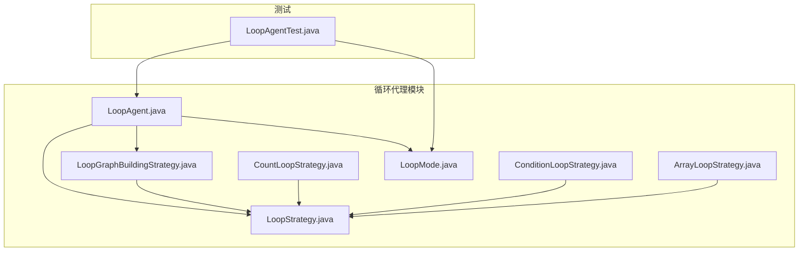
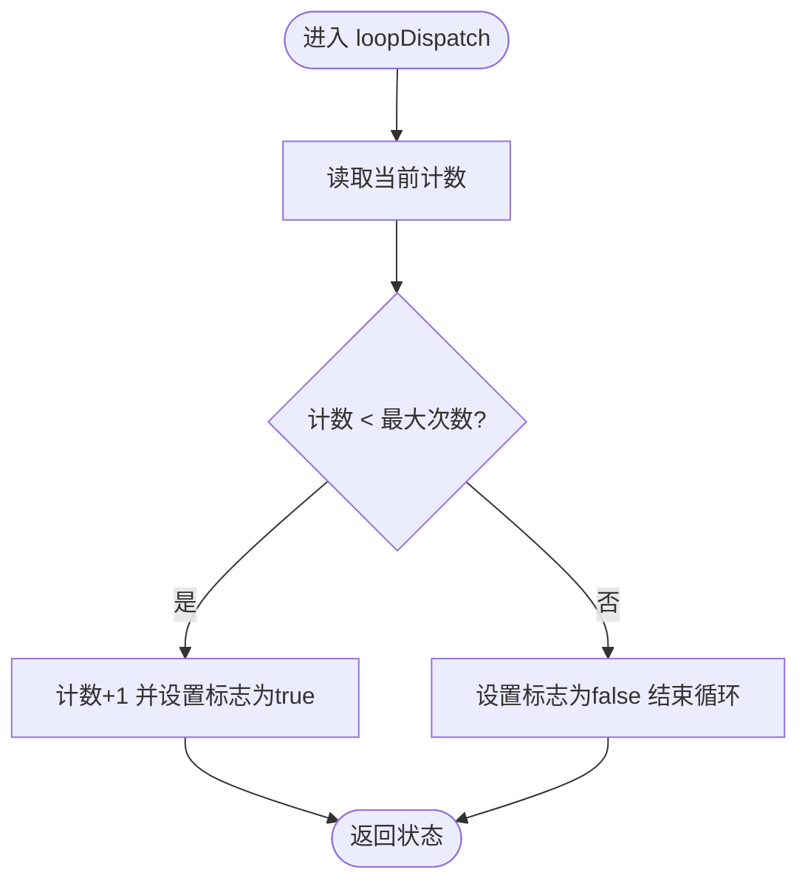
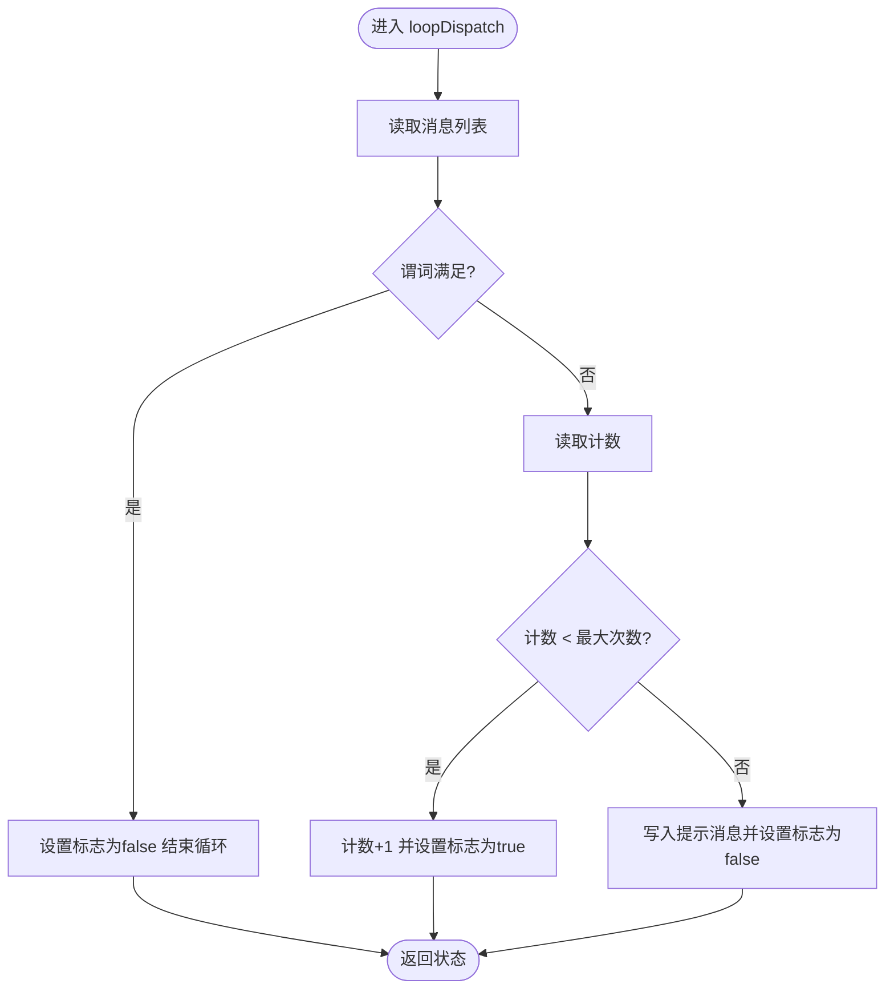
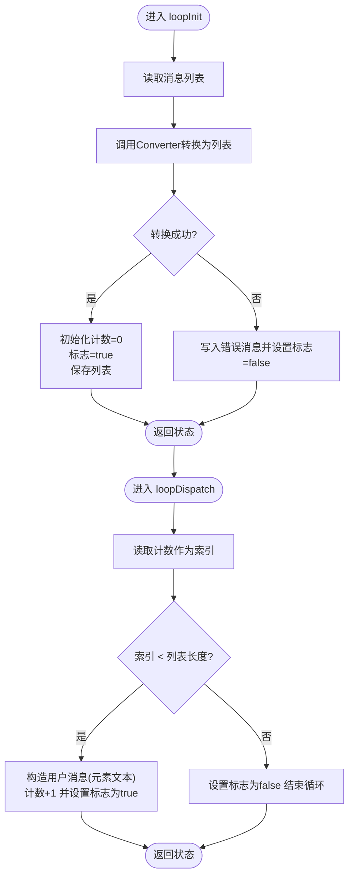
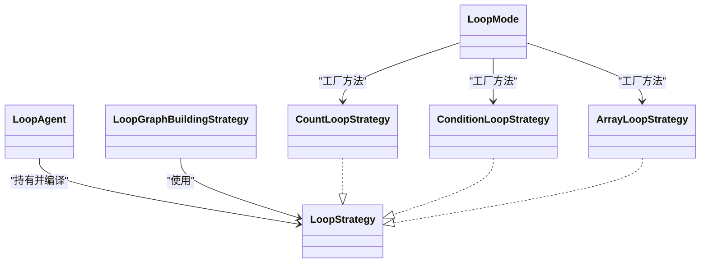

# 循环代理

<cite>
**本文引用的文件列表**
- [LoopAgent.java](file://spring-ai-alibaba-agent-framework/src/main/java/com/alibaba/cloud/ai/graph/agent/flow/agent/LoopAgent.java)
- [LoopStrategy.java](file://spring-ai-alibaba-agent-framework/src/main/java/com/alibaba/cloud/ai/graph/agent/flow/agent/loop/LoopStrategy.java)
- [CountLoopStrategy.java](file://spring-ai-alibaba-agent-framework/src/main/java/com/alibaba/cloud/ai/graph/agent/flow/agent/loop/CountLoopStrategy.java)
- [ConditionLoopStrategy.java](file://spring-ai-alibaba-agent-framework/src/main/java/com/alibaba/cloud/ai/graph/agent/flow/agent/loop/ConditionLoopStrategy.java)
- [ArrayLoopStrategy.java](file://spring-ai-alibaba-agent-framework/src/main/java/com/alibaba/cloud/ai/graph/agent/flow/agent/loop/ArrayLoopStrategy.java)
- [LoopMode.java](file://spring-ai-alibaba-agent-framework/src/main/java/com/alibaba/cloud/ai/graph/agent/flow/agent/loop/LoopMode.java)
- [LoopGraphBuildingStrategy.java](file://spring-ai-alibaba-agent-framework/src/main/java/com/alibaba/cloud/ai/graph/agent/flow/strategy/LoopGraphBuildingStrategy.java)
- [LoopAgentTest.java](file://spring-ai-alibaba-agent-framework/src/test/java/com/alibaba/cloud/ai/graph/agent/flow/LoopAgentTest.java)
</cite>

## 目录
1. [简介](#简介)
2. [项目结构与定位](#项目结构与定位)
3. [核心组件](#核心组件)
4. [架构总览](#架构总览)
5. [详细组件解析](#详细组件解析)
6. [依赖关系分析](#依赖关系分析)
7. [性能与并发特性](#性能与并发特性)
8. [配置与使用示例](#配置与使用示例)
9. [适用场景与风险](#适用场景与风险)
10. [故障排查指南](#故障排查指南)
11. [结论](#结论)

## 简介
本篇文档围绕循环代理（LoopAgent）展开，系统讲解其如何通过“循环策略”实现对某个子代理或工作流的重复执行，直至满足特定终止条件。文档覆盖三大内置循环策略：
- CountLoopStrategy：基于固定执行次数的计数循环
- ConditionLoopStrategy：基于状态条件的条件循环
- ArrayLoopStrategy：遍历消息中的数组元素进行逐项处理

同时，文档提供可直接参考的配置示例路径、关键流程图与时序图，帮助读者快速理解并安全地应用该能力，包括如何避免无限循环等风险。

## 项目结构与定位
LoopAgent 属于“流式代理框架”的一部分，位于 agent-flow 子模块中，配合通用的状态图（StateGraph）与构建策略（FlowGraphBuildingStrategy）完成编译期图构建与运行时控制流。



图表来源
- [LoopAgent.java](file://spring-ai-alibaba-agent-framework/src/main/java/com/alibaba/cloud/ai/graph/agent/flow/agent/LoopAgent.java#L1-L118)
- [LoopStrategy.java](file://spring-ai-alibaba-agent-framework/src/main/java/com/alibaba/cloud/ai/graph/agent/flow/agent/loop/LoopStrategy.java#L1-L89)
- [CountLoopStrategy.java](file://spring-ai-alibaba-agent-framework/src/main/java/com/alibaba/cloud/ai/graph/agent/flow/agent/loop/CountLoopStrategy.java#L1-L52)
- [ConditionLoopStrategy.java](file://spring-ai-alibaba-agent-framework/src/main/java/com/alibaba/cloud/ai/graph/agent/flow/agent/loop/ConditionLoopStrategy.java#L1-L64)
- [ArrayLoopStrategy.java](file://spring-ai-alibaba-agent-framework/src/main/java/com/alibaba/cloud/ai/graph/agent/flow/agent/loop/ArrayLoopStrategy.java#L1-L92)
- [LoopMode.java](file://spring-ai-alibaba-agent-framework/src/main/java/com/alibaba/cloud/ai/graph/agent/flow/agent/loop/LoopMode.java#L1-L51)
- [LoopGraphBuildingStrategy.java](file://spring-ai-alibaba-agent-framework/src/main/java/com/alibaba/cloud/ai/graph/agent/flow/strategy/LoopGraphBuildingStrategy.java#L1-L127)
- [LoopAgentTest.java](file://spring-ai-alibaba-agent-framework/src/test/java/com/alibaba/cloud/ai/graph/agent/flow/LoopAgentTest.java#L1-L258)

章节来源
- [LoopAgent.java](file://spring-ai-alibaba-agent-framework/src/main/java/com/alibaba/cloud/ai/graph/agent/flow/agent/LoopAgent.java#L1-L118)
- [LoopGraphBuildingStrategy.java](file://spring-ai-alibaba-agent-framework/src/main/java/com/alibaba/cloud/ai/graph/agent/flow/strategy/LoopGraphBuildingStrategy.java#L1-L127)

## 核心组件
- LoopAgent：对外暴露的循环代理，负责持有并编译循环策略，以及约束子代理数量为一。
- LoopStrategy：循环策略接口，定义初始化、调度与临时键空间等约定。
- CountLoopStrategy：固定次数计数循环策略。
- ConditionLoopStrategy：基于消息状态条件的循环策略，支持最大次数兜底。
- ArrayLoopStrategy：从消息中解析数组并逐元素迭代的策略，默认使用最后一条消息文本作为 JSON 数组。
- LoopMode：内置策略工厂方法，便于快速构造策略实例。
- LoopGraphBuildingStrategy：将 LoopAgent 编译为 StateGraph 的构建策略，串联“初始化节点”“调度节点”“子代理图”与“结束节点”。

章节来源
- [LoopAgent.java](file://spring-ai-alibaba-agent-framework/src/main/java/com/alibaba/cloud/ai/graph/agent/flow/agent/LoopAgent.java#L27-L117)
- [LoopStrategy.java](file://spring-ai-alibaba-agent-framework/src/main/java/com/alibaba/cloud/ai/graph/agent/flow/agent/loop/LoopStrategy.java#L1-L89)
- [CountLoopStrategy.java](file://spring-ai-alibaba-agent-framework/src/main/java/com/alibaba/cloud/ai/graph/agent/flow/agent/loop/CountLoopStrategy.java#L1-L52)
- [ConditionLoopStrategy.java](file://spring-ai-alibaba-agent-framework/src/main/java/com/alibaba/cloud/ai/graph/agent/flow/agent/loop/ConditionLoopStrategy.java#L1-L64)
- [ArrayLoopStrategy.java](file://spring-ai-alibaba-agent-framework/src/main/java/com/alibaba/cloud/ai/graph/agent/flow/agent/loop/ArrayLoopStrategy.java#L1-L92)
- [LoopMode.java](file://spring-ai-alibaba-agent-framework/src/main/java/com/alibaba/cloud/ai/graph/agent/flow/agent/loop/LoopMode.java#L1-L51)
- [LoopGraphBuildingStrategy.java](file://spring-ai-alibaba-agent-framework/src/main/java/com/alibaba/cloud/ai/graph/agent/flow/strategy/LoopGraphBuildingStrategy.java#L50-L127)

## 架构总览
LoopAgent 的运行时图由三部分组成：
- 初始化节点：调用策略的 loopInit，准备循环所需的临时状态（计数、标志位、列表等）
- 调度节点：调用策略的 loopDispatch，决定是否继续循环或结束
- 子代理图：实际被循环执行的工作流或代理

```mermaid
sequenceDiagram
participant U as "调用方"
participant LA as "LoopAgent"
participant LGBS as "LoopGraphBuildingStrategy"
participant INIT as "初始化节点"
participant DIS as "调度节点"
participant SUB as "子代理图"
participant END as "结束"
U->>LA : 调用 invoke(...)
LA->>LGBS : 编译图并注入 LoopStrategy
LGBS->>INIT : 执行 loopInit
INIT-->>DIS : 返回初始状态(计数/标志/列表)
loop 每次循环
DIS-->>SUB : 条件为真时进入子代理
SUB-->>DIS : 子代理返回后更新状态
DIS-->>DIS : 执行 loopDispatch 决定继续或结束
end
DIS-->>END : 条件为假时结束
LA-->>U : 返回最终状态
```

图表来源
- [LoopGraphBuildingStrategy.java](file://spring-ai-alibaba-agent-framework/src/main/java/com/alibaba/cloud/ai/graph/agent/flow/strategy/LoopGraphBuildingStrategy.java#L52-L86)
- [LoopStrategy.java](file://spring-ai-alibaba-agent-framework/src/main/java/com/alibaba/cloud/ai/graph/agent/flow/agent/loop/LoopStrategy.java#L48-L89)
- [LoopAgent.java](file://spring-ai-alibaba-agent-framework/src/main/java/com/alibaba/cloud/ai/graph/agent/flow/agent/LoopAgent.java#L69-L73)

## 详细组件解析

### LoopStrategy 接口与约定
- 临时键空间：通过 loopFlagKey、loopListKey、loopCountKey 生成唯一键，避免多策略实例之间的状态冲突
- 最大循环次数：默认上限由 maxLoopCount 提供，防止无限循环
- 节点命名：loopInitNodeName、loopDispatchNodeName 保证每个策略实例拥有独立节点名
- 策略职责：定义 loopInit（初始化）与 loopDispatch（调度）两个阶段的返回值映射

章节来源
- [LoopStrategy.java](file://spring-ai-alibaba-agent-framework/src/main/java/com/alibaba/cloud/ai/graph/agent/flow/agent/loop/LoopStrategy.java#L1-L89)

### CountLoopStrategy（计数循环）
- 初始化：将计数归零，若最大次数大于零则允许开始
- 调度：每次递增计数，当达到上限时停止；否则继续



图表来源
- [CountLoopStrategy.java](file://spring-ai-alibaba-agent-framework/src/main/java/com/alibaba/cloud/ai/graph/agent/flow/agent/loop/CountLoopStrategy.java#L37-L51)

章节来源
- [CountLoopStrategy.java](file://spring-ai-alibaba-agent-framework/src/main/java/com/alibaba/cloud/ai/graph/agent/flow/agent/loop/CountLoopStrategy.java#L1-L52)

### ConditionLoopStrategy（条件循环）
- 初始化：始终允许开始
- 调度：先检查消息状态是否满足谓词；若满足则结束；否则检查计数是否达到上限；未达上限则继续，否则记录提示并结束



图表来源
- [ConditionLoopStrategy.java](file://spring-ai-alibaba-agent-framework/src/main/java/com/alibaba/cloud/ai/graph/agent/flow/agent/loop/ConditionLoopStrategy.java#L43-L63)

章节来源
- [ConditionLoopStrategy.java](file://spring-ai-alibaba-agent-framework/src/main/java/com/alibaba/cloud/ai/graph/agent/flow/agent/loop/ConditionLoopStrategy.java#L1-L64)

### ArrayLoopStrategy（数组遍历）
- 初始化：使用 Converter 将消息列表转换为对象列表；成功则准备列表与计数，失败则标记错误并停止
- 调度：按索引取出元素，封装为用户消息，计数+1；索引越界则停止



图表来源
- [ArrayLoopStrategy.java](file://spring-ai-alibaba-agent-framework/src/main/java/com/alibaba/cloud/ai/graph/agent/flow/agent/loop/ArrayLoopStrategy.java#L49-L91)

章节来源
- [ArrayLoopStrategy.java](file://spring-ai-alibaba-agent-framework/src/main/java/com/alibaba/cloud/ai/graph/agent/flow/agent/loop/ArrayLoopStrategy.java#L1-L92)

### LoopMode 工厂方法
- 提供 count(maxCount)、condition(predicate)、array()、array(converter) 等便捷构造方法，简化策略装配

章节来源
- [LoopMode.java](file://spring-ai-alibaba-agent-framework/src/main/java/com/alibaba/cloud/ai/graph/agent/flow/agent/loop/LoopMode.java#L1-L51)

### LoopGraphBuildingStrategy 图构建
- 在编译期将 LoopAgent 转换为 StateGraph，添加透明根节点、初始化节点、调度节点、子代理图与条件边
- 通过 KeyStrategyFactory 为策略的临时键注册替换策略，确保状态隔离

章节来源
- [LoopGraphBuildingStrategy.java](file://spring-ai-alibaba-agent-framework/src/main/java/com/alibaba/cloud/ai/graph/agent/flow/strategy/LoopGraphBuildingStrategy.java#L52-L127)

## 依赖关系分析
- LoopAgent 依赖 LoopStrategy 与 LoopGraphBuildingStrategy 完成编译与运行
- 三大策略均实现 LoopStrategy 接口，遵循统一的临时键与节点命名规范
- LoopMode 作为工厂，向上提供易用的策略构造入口
- 测试用例验证了不同模式下的行为与执行器配置



图表来源
- [LoopAgent.java](file://spring-ai-alibaba-agent-framework/src/main/java/com/alibaba/cloud/ai/graph/agent/flow/agent/LoopAgent.java#L58-L117)
- [LoopStrategy.java](file://spring-ai-alibaba-agent-framework/src/main/java/com/alibaba/cloud/ai/graph/agent/flow/agent/loop/LoopStrategy.java#L32-L89)
- [CountLoopStrategy.java](file://spring-ai-alibaba-agent-framework/src/main/java/com/alibaba/cloud/ai/graph/agent/flow/agent/loop/CountLoopStrategy.java#L29-L51)
- [ConditionLoopStrategy.java](file://spring-ai-alibaba-agent-framework/src/main/java/com/alibaba/cloud/ai/graph/agent/flow/agent/loop/ConditionLoopStrategy.java#L33-L63)
- [ArrayLoopStrategy.java](file://spring-ai-alibaba-agent-framework/src/main/java/com/alibaba/cloud/ai/graph/agent/flow/agent/loop/ArrayLoopStrategy.java#L37-L91)
- [LoopMode.java](file://spring-ai-alibaba-agent-framework/src/main/java/com/alibaba/cloud/ai/graph/agent/flow/agent/loop/LoopMode.java#L31-L51)
- [LoopGraphBuildingStrategy.java](file://spring-ai-alibaba-agent-framework/src/main/java/com/alibaba/cloud/ai/graph/agent/flow/strategy/LoopGraphBuildingStrategy.java#L50-L127)

## 性能与并发特性
- 循环次数上限：各策略通过 maxLoopCount 限制最大迭代次数，避免无界开销
- 状态隔离：每个策略实例使用唯一键空间，避免并发或多实例场景下的状态污染
- 执行器配置：LoopAgent 支持注入自定义执行器，测试用例验证了执行器元数据的传递与保留

章节来源
- [LoopStrategy.java](file://spring-ai-alibaba-agent-framework/src/main/java/com/alibaba/cloud/ai/graph/agent/flow/agent/loop/LoopStrategy.java#L64-L89)
- [LoopAgentTest.java](file://spring-ai-alibaba-agent-framework/src/test/java/com/alibaba/cloud/ai/graph/agent/flow/LoopAgentTest.java#L190-L246)

## 配置与使用示例
以下示例均来自测试用例，可直接参考对应路径以获取完整上下文。

- 固定次数循环（COUNT）
  - 示例路径：[LoopAgentTest.java](file://spring-ai-alibaba-agent-framework/src/test/java/com/alibaba/cloud/ai/graph/agent/flow/LoopAgentTest.java#L120-L137)
  - 关键点：使用 LoopMode.count(2) 指定循环次数；子代理为顺序代理（SequentialAgent）

- 条件循环（CONDITION）
  - 示例路径：[LoopAgentTest.java](file://spring-ai-alibaba-agent-framework/src/test/java/com/alibaba/cloud/ai/graph/agent/flow/LoopAgentTest.java#L138-L167)
  - 关键点：使用 LoopMode.condition(...) 提供谓词；谓词基于最新消息文本解析分数并判断是否继续

- 数组遍历（ARRAY）
  - 示例路径：[LoopAgentTest.java](file://spring-ai-alibaba-agent-framework/src/test/java/com/alibaba/cloud/ai/graph/agent/flow/LoopAgentTest.java#L168-L188)
  - 关键点：使用 LoopMode.array()；默认转换器会解析最后一条消息的文本为 JSON 数组

- 自定义转换器（ARRAY）
  - 示例路径：[LoopMode.java](file://spring-ai-alibaba-agent-framework/src/main/java/com/alibaba/cloud/ai/graph/agent/flow/agent/loop/LoopMode.java#L40-L46)
  - 关键点：通过 LoopMode.array(converter) 注入自定义 Converter，以适配非标准消息格式

- 执行器配置
  - 示例路径：[LoopAgentTest.java](file://spring-ai-alibaba-agent-framework/src/test/java/com/alibaba/cloud/ai/graph/agent/flow/LoopAgentTest.java#L190-L246)
  - 关键点：LoopAgent.builder().executor(...) 设置线程池；测试断言执行器元数据被正确传递

章节来源
- [LoopAgentTest.java](file://spring-ai-alibaba-agent-framework/src/test/java/com/alibaba/cloud/ai/graph/agent/flow/LoopAgentTest.java#L120-L188)
- [LoopMode.java](file://spring-ai-alibaba-agent-framework/src/main/java/com/alibaba/cloud/ai/graph/agent/flow/agent/loop/LoopMode.java#L36-L50)

## 适用场景与风险
- 适用场景
  - 迭代优化：通过条件循环持续改进输出质量，直到达到阈值
  - 数据批处理：通过数组循环对批量任务逐一处理
  - 等待外部事件：通过条件循环轮询状态，直到满足条件

- 潜在风险与预防
  - 无限循环风险：策略已内置 maxLoopCount 上限；仍需在业务层设计合理的终止条件与超时机制
  - 条件不收敛：建议在谓词中加入兜底逻辑（如超时、错误计数），并在达到上限时显式返回提示消息
  - 数组解析失败：ArrayLoopStrategy 在转换失败时会写入错误消息并停止；可在上层捕获并回退

章节来源
- [LoopStrategy.java](file://spring-ai-alibaba-agent-framework/src/main/java/com/alibaba/cloud/ai/graph/agent/flow/agent/loop/LoopStrategy.java#L64-L89)
- [ConditionLoopStrategy.java](file://spring-ai-alibaba-agent-framework/src/main/java/com/alibaba/cloud/ai/graph/agent/flow/agent/loop/ConditionLoopStrategy.java#L43-L63)
- [ArrayLoopStrategy.java](file://spring-ai-alibaba-agent-framework/src/main/java/com/alibaba/cloud/ai/graph/agent/flow/agent/loop/ArrayLoopStrategy.java#L49-L91)

## 故障排查指南
- 子代理数量异常
  - 现象：构建图时报错，提示必须只有一个子代理
  - 处理：确保 LoopAgent 使用单个子代理（LoopAgentBuilder.subAgent）

- 循环策略类型错误
  - 现象：构建图时报错，loopStrategy 必须是 LoopStrategy 实例
  - 处理：确认通过 LoopMode 或自定义实现 LoopStrategy

- 条件循环未退出
  - 现象：超过最大次数仍未退出
  - 处理：检查谓词逻辑与消息格式；必要时在达到上限时显式返回提示消息

- 数组解析失败
  - 现象：初始化阶段返回标志为 false
  - 处理：检查最后一条消息文本是否为合法 JSON 数组；必要时提供自定义 Converter

章节来源
- [LoopGraphBuildingStrategy.java](file://spring-ai-alibaba-agent-framework/src/main/java/com/alibaba/cloud/ai/graph/agent/flow/strategy/LoopGraphBuildingStrategy.java#L114-L127)
- [ConditionLoopStrategy.java](file://spring-ai-alibaba-agent-framework/src/main/java/com/alibaba/cloud/ai/graph/agent/flow/agent/loop/ConditionLoopStrategy.java#L43-L63)
- [ArrayLoopStrategy.java](file://spring-ai-alibaba-agent-framework/src/main/java/com/alibaba/cloud/ai/graph/agent/flow/agent/loop/ArrayLoopStrategy.java#L49-L59)

## 结论
LoopAgent 通过“策略即图”的方式，将循环控制抽象为可插拔的 LoopStrategy 实现，结合 LoopGraphBuildingStrategy 完成编译期图构建与运行时控制流管理。三大策略分别覆盖“计数”“条件”“数组”三类常见需求，配合工厂方法与测试示例，能够快速搭建稳定的循环工作流。在工程实践中，应重视最大循环次数与终止条件的设计，以规避无限循环等风险。