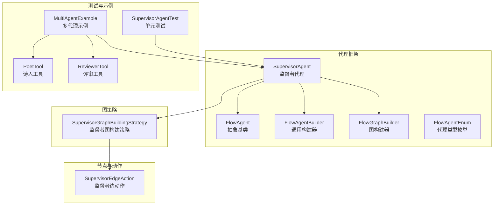
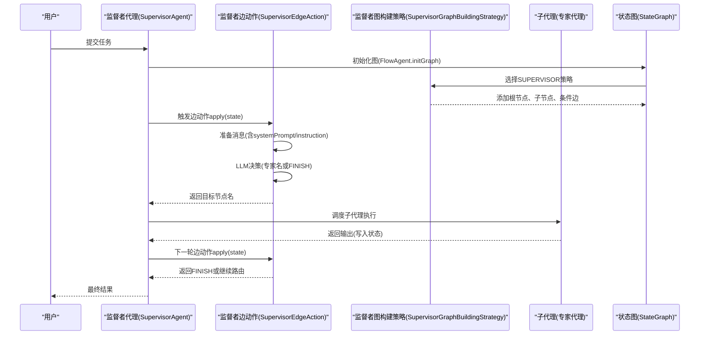
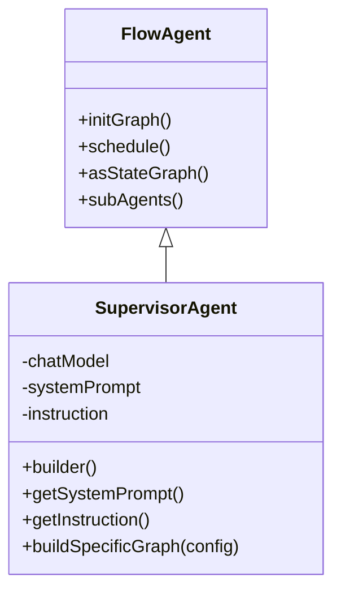
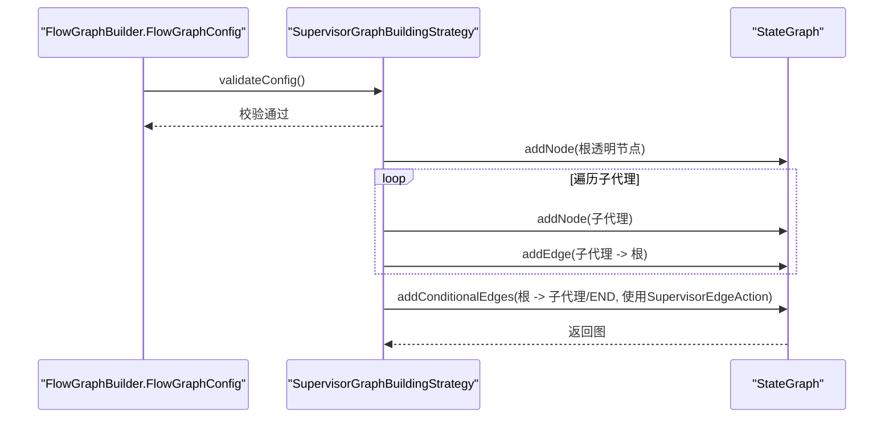
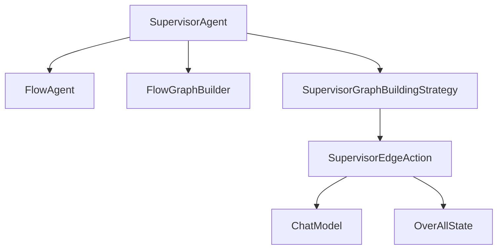

# 监督者代理

<cite>
**本文引用的文件**
- [SupervisorAgent.java](file://spring-ai-alibaba-agent-framework/src/main/java/com/alibaba/cloud/ai/graph/agent/flow/agent/SupervisorAgent.java)
- [SupervisorEdgeAction.java](file://spring-ai-alibaba-agent-framework/src/main/java/com/alibaba/cloud/ai/graph/agent/flow/node/SupervisorEdgeAction.java)
- [SupervisorGraphBuildingStrategy.java](file://spring-ai-alibaba-agent-framework/src/main/java/com/alibaba/cloud/ai/graph/agent/flow/strategy/SupervisorGraphBuildingStrategy.java)
- [FlowAgent.java](file://spring-ai-alibaba-agent-framework/src/main/java/com/alibaba/cloud/ai/graph/agent/flow/agent/FlowAgent.java)
- [FlowGraphBuilder.java](file://spring-ai-alibaba-agent-framework/src/main/java/com/alibaba/cloud/ai/graph/agent/flow/builder/FlowGraphBuilder.java)
- [FlowAgentBuilder.java](file://spring-ai-alibaba-agent-framework/src/main/java/com/alibaba/cloud/ai/graph/agent/flow/builder/FlowAgentBuilder.java)
- [FlowAgentEnum.java](file://spring-ai-alibaba-agent-framework/src/main/java/com/alibaba/cloud/ai/graph/agent/flow/enums/FlowAgentEnum.java)
- [SupervisorAgentTest.java](file://spring-ai-alibaba-agent-framework/src/test/java/com/alibaba/cloud/ai/graph/agent/SupervisorAgentTest.java)
- [MultiAgentExample.java](file://examples/documentation/src/main/java/com/alibaba/cloud/ai/examples/documentation/framework/advanced/MultiAgentExample.java)
- [PoetTool.java](file://spring-ai-alibaba-agent-framework/src/test/java/com/alibaba/cloud/ai/graph/agent/tools/PoetTool.java)
- [ReviewerTool.java](file://spring-ai-alibaba-agent-framework/src/test/java/com/alibaba/cloud/ai/graph/agent/tools/ReviewerTool.java)
</cite>

## 目录
1. [简介](#简介)
2. [项目结构](#项目结构)
3. [核心组件](#核心组件)
4. [架构总览](#架构总览)
5. [详细组件分析](#详细组件分析)
6. [依赖关系分析](#依赖关系分析)
7. [性能考量](#性能考量)
8. [故障排查指南](#故障排查指南)
9. [结论](#结论)
10. [附录](#附录)

## 简介
监督者代理（SupervisorAgent）是“经理”型代理，负责协调多个“专家”代理（如写作、翻译、评审等）完成复杂任务。其工作原理如下：
- 接收用户请求后，基于系统提示（systemPrompt）与上下文消息，由大模型（LLM）决定将任务分配给哪个专家代理；
- 专家代理完成任务后返回监督者；监督者可继续路由到其他专家，或标记任务完成（FINISH）；
- 通过条件边（conditional edges）实现动态路由与结果整合，支持嵌套代理（如SequentialAgent）与占位符指令。

本章节将围绕SupervisorEdgeAction的任务路由与结果整合机制、SupervisorGraphBuildingStrategy的图构建策略、以及SupervisorAgent的配置与使用示例展开说明。

## 项目结构
监督者代理相关代码位于代理框架模块中，主要涉及以下文件：
- 代理定义与构建：SupervisorAgent、FlowAgent、FlowAgentBuilder、FlowGraphBuilder、FlowAgentEnum
- 图构建策略：SupervisorGraphBuildingStrategy
- 路由决策与重试：SupervisorEdgeAction
- 测试与示例：SupervisorAgentTest、MultiAgentExample
- 工具示例：PoetTool、ReviewerTool



**图表来源**
- [SupervisorAgent.java](file://spring-ai-alibaba-agent-framework/src/main/java/com/alibaba/cloud/ai/graph/agent/flow/agent/SupervisorAgent.java#L25-L107)
- [FlowAgent.java](file://spring-ai-alibaba-agent-framework/src/main/java/com/alibaba/cloud/ai/graph/agent/flow/agent/FlowAgent.java#L30-L103)
- [FlowAgentBuilder.java](file://spring-ai-alibaba-agent-framework/src/main/java/com/alibaba/cloud/ai/graph/agent/flow/builder/FlowAgentBuilder.java#L28-L160)
- [FlowGraphBuilder.java](file://spring-ai-alibaba-agent-framework/src/main/java/com/alibaba/cloud/ai/graph/agent/flow/builder/FlowGraphBuilder.java#L30-L184)
- [FlowAgentEnum.java](file://spring-ai-alibaba-agent-framework/src/main/java/com/alibaba/cloud/ai/graph/agent/flow/enums/FlowAgentEnum.java#L17-L31)
- [SupervisorGraphBuildingStrategy.java](file://spring-ai-alibaba-agent-framework/src/main/java/com/alibaba/cloud/ai/graph/agent/flow/strategy/SupervisorGraphBuildingStrategy.java#L40-L111)
- [SupervisorEdgeAction.java](file://spring-ai-alibaba-agent-framework/src/main/java/com/alibaba/cloud/ai/graph/agent/flow/node/SupervisorEdgeAction.java#L40-L273)
- [SupervisorAgentTest.java](file://spring-ai-alibaba-agent-framework/src/test/java/com/alibaba/cloud/ai/graph/agent/SupervisorAgentTest.java#L54-L528)
- [MultiAgentExample.java](file://examples/documentation/src/main/java/com/alibaba/cloud/ai/examples/documentation/framework/advanced/MultiAgentExample.java#L535-L729)
- [PoetTool.java](file://spring-ai-alibaba-agent-framework/src/test/java/com/alibaba/cloud/ai/graph/agent/tools/PoetTool.java#L1-L56)
- [ReviewerTool.java](file://spring-ai-alibaba-agent-framework/src/test/java/com/alibaba/cloud/ai/graph/agent/tools/ReviewerTool.java#L1-L55)

**章节来源**
- [SupervisorAgent.java](file://spring-ai-alibaba-agent-framework/src/main/java/com/alibaba/cloud/ai/graph/agent/flow/agent/SupervisorAgent.java#L25-L107)
- [SupervisorEdgeAction.java](file://spring-ai-alibaba-agent-framework/src/main/java/com/alibaba/cloud/ai/graph/agent/flow/node/SupervisorEdgeAction.java#L40-L273)
- [SupervisorGraphBuildingStrategy.java](file://spring-ai-alibaba-agent-framework/src/main/java/com/alibaba/cloud/ai/graph/agent/flow/strategy/SupervisorGraphBuildingStrategy.java#L40-L111)

## 核心组件
- SupervisorAgent：监督者代理，扩展FlowAgent，负责构建监督者图并暴露systemPrompt与instruction供决策使用。
- SupervisorEdgeAction：监督者边动作，封装LLM路由决策逻辑，支持重试与错误反馈，输出目标子代理名或FINISH。
- SupervisorGraphBuildingStrategy：监督者图构建策略，注册为SUPERVISOR类型，将根节点（监督者）、子代理节点与条件边连接起来。
- FlowAgent/FlowAgentBuilder/FlowGraphBuilder：统一的代理基类与构建体系，保证不同代理类型的图构建一致性。
- FlowAgentEnum：代理类型枚举，包含SUPERVISOR常量。

**章节来源**
- [SupervisorAgent.java](file://spring-ai-alibaba-agent-framework/src/main/java/com/alibaba/cloud/ai/graph/agent/flow/agent/SupervisorAgent.java#L25-L107)
- [SupervisorEdgeAction.java](file://spring-ai-alibaba-agent-framework/src/main/java/com/alibaba/cloud/ai/graph/agent/flow/node/SupervisorEdgeAction.java#L40-L273)
- [SupervisorGraphBuildingStrategy.java](file://spring-ai-alibaba-agent-framework/src/main/java/com/alibaba/cloud/ai/graph/agent/flow/strategy/SupervisorGraphBuildingStrategy.java#L40-L111)
- [FlowAgent.java](file://spring-ai-alibaba-agent-framework/src/main/java/com/alibaba/cloud/ai/graph/agent/flow/agent/FlowAgent.java#L30-L103)
- [FlowAgentBuilder.java](file://spring-ai-alibaba-agent-framework/src/main/java/com/alibaba/cloud/ai/graph/agent/flow/builder/FlowAgentBuilder.java#L28-L160)
- [FlowGraphBuilder.java](file://spring-ai-alibaba-agent-framework/src/main/java/com/alibaba/cloud/ai/graph/agent/flow/builder/FlowGraphBuilder.java#L30-L184)
- [FlowAgentEnum.java](file://spring-ai-alibaba-agent-framework/src/main/java/com/alibaba/cloud/ai/graph/agent/flow/enums/FlowAgentEnum.java#L17-L31)

## 架构总览
监督者代理采用“LLM路由 + 条件边”的架构：
- 初始化阶段：SupervisorAgent通过FlowAgent.initGraph构建StateGraph，委托FlowGraphBuilder调用SupervisorGraphBuildingStrategy；
- 执行阶段：监督者节点调用SupervisorEdgeAction，基于systemPrompt与上下文消息生成决策；子代理完成任务后返回监督者，监督者再次决策或标记FINISH；
- 结果整合：子代理输出键（outputKey）写入全局状态，最终由监督者聚合返回。



**图表来源**
- [SupervisorAgent.java](file://spring-ai-alibaba-agent-framework/src/main/java/com/alibaba/cloud/ai/graph/agent/flow/agent/SupervisorAgent.java#L43-L54)
- [SupervisorEdgeAction.java](file://spring-ai-alibaba-agent-framework/src/main/java/com/alibaba/cloud/ai/graph/agent/flow/node/SupervisorEdgeAction.java#L95-L131)
- [SupervisorGraphBuildingStrategy.java](file://spring-ai-alibaba-agent-framework/src/main/java/com/alibaba/cloud/ai/graph/agent/flow/strategy/SupervisorGraphBuildingStrategy.java#L42-L76)
- [FlowAgent.java](file://spring-ai-alibaba-agent-framework/src/main/java/com/alibaba/cloud/ai/graph/agent/flow/agent/FlowAgent.java#L61-L76)

## 详细组件分析

### 监督者代理（SupervisorAgent）
- 继承自FlowAgent，扩展了model、systemPrompt、instruction字段；
- 通过FlowGraphBuilder以SUPERVISOR类型构建图；
- 提供builder方法设置ChatModel、systemPrompt、instruction。



**图表来源**
- [FlowAgent.java](file://spring-ai-alibaba-agent-framework/src/main/java/com/alibaba/cloud/ai/graph/agent/flow/agent/FlowAgent.java#L30-L103)
- [SupervisorAgent.java](file://spring-ai-alibaba-agent-framework/src/main/java/com/alibaba/cloud/ai/graph/agent/flow/agent/SupervisorAgent.java#L25-L107)

**章节来源**
- [SupervisorAgent.java](file://spring-ai-alibaba-agent-framework/src/main/java/com/alibaba/cloud/ai/graph/agent/flow/agent/SupervisorAgent.java#L25-L107)
- [FlowAgent.java](file://spring-ai-alibaba-agent-framework/src/main/java/com/alibaba/cloud/ai/graph/agent/flow/agent/FlowAgent.java#L30-L103)

### 监督者边动作（SupervisorEdgeAction）
- 职责：从状态中读取消息，准备systemPrompt/instruction，调用LLM生成决策（专家名或FINISH），并进行有效性校验与重试；
- 关键点：
  - 默认最大重试次数为2，失败时抛出异常；
  - 决策值必须来自子代理列表或FINISH；
  - 若存在instruction，追加到UserMessage；否则添加默认提示；
  - 重试时将上次无效决策反馈给LLM，帮助纠正。

```mermaid
flowchart TD
Start(["开始"]) --> LoadMsgs["加载状态消息"]
LoadMsgs --> PrepareMsgs["准备消息(含systemPrompt/instruction)"]
PrepareMsgs --> CallLLM["调用LLM生成决策"]
CallLLM --> Validate{"决策有效?"}
Validate --> |是(FINISH)| Finish["返回END"]
Validate --> |是(专家名)| Route["返回专家节点名"]
Validate --> |否| Retry{"重试次数<2?"}
Retry --> |是| Feedback["附加错误反馈"] --> CallLLM
Retry --> |否| ThrowErr["抛出非法决策异常"]
Finish --> End(["结束"])
Route --> End
ThrowErr --> End
```

**图表来源**
- [SupervisorEdgeAction.java](file://spring-ai-alibaba-agent-framework/src/main/java/com/alibaba/cloud/ai/graph/agent/flow/node/SupervisorEdgeAction.java#L95-L271)

**章节来源**
- [SupervisorEdgeAction.java](file://spring-ai-alibaba-agent-framework/src/main/java/com/alibaba/cloud/ai/graph/agent/flow/node/SupervisorEdgeAction.java#L40-L273)

### 监督者图构建策略（SupervisorGraphBuildingStrategy）
- 校验配置：至少一个子代理、ChatModel非空、根代理为FlowAgent；
- 构建流程：
  - 添加透明根节点（用于初始调度）；
  - 将每个子代理作为节点加入图；
  - 子代理完成后回流到监督者（而非直接END）；
  - 使用SupervisorEdgeAction建立条件边，目标集合包含所有子代理名与END。



**图表来源**
- [SupervisorGraphBuildingStrategy.java](file://spring-ai-alibaba-agent-framework/src/main/java/com/alibaba/cloud/ai/graph/agent/flow/strategy/SupervisorGraphBuildingStrategy.java#L42-L76)
- [FlowGraphBuilder.java](file://spring-ai-alibaba-agent-framework/src/main/java/com/alibaba/cloud/ai/graph/agent/flow/builder/FlowGraphBuilder.java#L44-L48)

**章节来源**
- [SupervisorGraphBuildingStrategy.java](file://spring-ai-alibaba-agent-framework/src/main/java/com/alibaba/cloud/ai/graph/agent/flow/strategy/SupervisorGraphBuildingStrategy.java#L40-L111)
- [FlowGraphBuilder.java](file://spring-ai-alibaba-agent-framework/src/main/java/com/alibaba/cloud/ai/graph/agent/flow/builder/FlowGraphBuilder.java#L30-L184)

### 配置示例与最佳实践
- 定义systemPrompt：明确监督者的职责、可用专家、决策规则与响应格式；
- 定义instruction：当监督者作为子代理时，可使用占位符引用前序Agent输出；
- 子代理组合：普通Agent与嵌套Agent（如SequentialAgent）均可作为子代理；
- 输出键：确保子代理使用唯一outputKey，便于状态聚合与后续路由。

参考示例路径：
- [监督者代理示例（含嵌套SequentialAgent与占位符）](file://examples/documentation/src/main/java/com/alibaba/cloud/ai/examples/documentation/framework/advanced/MultiAgentExample.java#L535-L729)
- [监督者代理测试（多场景验证）](file://spring-ai-alibaba-agent-framework/src/test/java/com/alibaba/cloud/ai/graph/agent/SupervisorAgentTest.java#L54-L528)

适用场景建议：
- 客服系统：根据问题类型路由到不同专家（如FAQ、投诉、技术咨询），必要时多轮迭代；
- 多领域问答系统：按主题路由到对应专家，支持跨领域协作与结果整合；
- 内容生产流水线：写作—评审—翻译等多步骤工作流，监督者动态编排。

最佳实践：
- 明确systemPrompt的职责边界与决策规则，避免歧义；
- 使用占位符时确保前序Agent输出键存在，减少运行期错误；
- 控制子代理数量与职责单一性，提升路由准确性；
- 合理设置重试策略与错误反馈，提高鲁棒性。

**章节来源**
- [MultiAgentExample.java](file://examples/documentation/src/main/java/com/alibaba/cloud/ai/examples/documentation/framework/advanced/MultiAgentExample.java#L535-L729)
- [SupervisorAgentTest.java](file://spring-ai-alibaba-agent-framework/src/test/java/com/alibaba/cloud/ai/graph/agent/SupervisorAgentTest.java#L54-L528)

## 依赖关系分析
- 组件耦合：
  - SupervisorAgent依赖FlowAgent/FlowGraphBuilder/FlowAgentEnum构建图；
  - SupervisorEdgeAction依赖ChatClient与BeanOutputConverter进行结构化输出；
  - SupervisorGraphBuildingStrategy依赖SupervisorEdgeAction与TransparentNode；
- 外部依赖：
  - ChatModel用于LLM推理；
  - OverAllState用于状态读写；
  - 日志记录用于调试与可观测性。



**图表来源**
- [SupervisorAgent.java](file://spring-ai-alibaba-agent-framework/src/main/java/com/alibaba/cloud/ai/graph/agent/flow/agent/SupervisorAgent.java#L43-L54)
- [SupervisorGraphBuildingStrategy.java](file://spring-ai-alibaba-agent-framework/src/main/java/com/alibaba/cloud/ai/graph/agent/flow/strategy/SupervisorGraphBuildingStrategy.java#L42-L76)
- [SupervisorEdgeAction.java](file://spring-ai-alibaba-agent-framework/src/main/java/com/alibaba/cloud/ai/graph/agent/flow/node/SupervisorEdgeAction.java#L95-L131)

**章节来源**
- [SupervisorAgent.java](file://spring-ai-alibaba-agent-framework/src/main/java/com/alibaba/cloud/ai/graph/agent/flow/agent/SupervisorAgent.java#L25-L107)
- [SupervisorEdgeAction.java](file://spring-ai-alibaba-agent-framework/src/main/java/com/alibaba/cloud/ai/graph/agent/flow/node/SupervisorEdgeAction.java#L40-L273)
- [SupervisorGraphBuildingStrategy.java](file://spring-ai-alibaba-agent-framework/src/main/java/com/alibaba/cloud/ai/graph/agent/flow/strategy/SupervisorGraphBuildingStrategy.java#L40-L111)

## 性能考量
- LLM调用成本：监督者每轮决策均需一次LLM调用，建议在systemPrompt中明确决策规则，减少歧义与重试；
- 状态序列化：合理选择StateSerializer（如SpringAIJacksonStateSerializer），平衡序列化开销与兼容性；
- 并发与合并：若子代理并行执行，结合ParallelAgent的合并策略，减少总耗时；
- 日志与观测：开启必要的日志级别，便于定位路由失败与重试原因。

[本节为通用指导，无需特定文件引用]

## 故障排查指南
常见问题与定位要点：
- 决策无效或循环路由：检查SupervisorEdgeAction的重试逻辑与错误反馈是否生效；确认systemPrompt是否清晰；
- 子代理未被调用：核对SupervisorGraphBuildingStrategy是否正确添加子代理节点与回流边；
- 占位符未替换：确认前序Agent输出键存在，且监督者instruction中占位符与键一致；
- 图构建失败：检查FlowGraphBuilder.FlowGraphConfig参数（ChatModel、根代理类型、子代理列表）。

参考测试用例：
- [监督者代理测试（多场景覆盖）](file://spring-ai-alibaba-agent-framework/src/test/java/com/alibaba/cloud/ai/graph/agent/SupervisorAgentTest.java#L54-L528)

**章节来源**
- [SupervisorEdgeAction.java](file://spring-ai-alibaba-agent-framework/src/main/java/com/alibaba/cloud/ai/graph/agent/flow/node/SupervisorEdgeAction.java#L133-L271)
- [SupervisorGraphBuildingStrategy.java](file://spring-ai-alibaba-agent-framework/src/main/java/com/alibaba/cloud/ai/graph/agent/flow/strategy/SupervisorGraphBuildingStrategy.java#L83-L111)
- [SupervisorAgentTest.java](file://spring-ai-alibaba-agent-framework/src/test/java/com/alibaba/cloud/ai/graph/agent/SupervisorAgentTest.java#L54-L528)

## 结论
监督者代理通过LLM驱动的动态路由与条件边整合，实现了对多专家代理的统一编排。其优势在于：
- 明确的职责边界与可配置的systemPrompt；
- 强大的嵌套与占位符能力，适配复杂业务流程；
- 清晰的图构建策略与稳健的重试机制。

在实际应用中，建议结合具体业务场景完善systemPrompt与决策规则，合理组织子代理与工作流，以获得更稳定高效的执行效果。

[本节为总结性内容，无需特定文件引用]

## 附录
- 工具示例（用于演示占位符与输出键）：
  - [PoetTool.java](file://spring-ai-alibaba-agent-framework/src/test/java/com/alibaba/cloud/ai/graph/agent/tools/PoetTool.java#L1-L56)
  - [ReviewerTool.java](file://spring-ai-alibaba-agent-framework/src/test/java/com/alibaba/cloud/ai/graph/agent/tools/ReviewerTool.java#L1-L55)

**章节来源**
- [PoetTool.java](file://spring-ai-alibaba-agent-framework/src/test/java/com/alibaba/cloud/ai/graph/agent/tools/PoetTool.java#L1-L56)
- [ReviewerTool.java](file://spring-ai-alibaba-agent-framework/src/test/java/com/alibaba/cloud/ai/graph/agent/tools/ReviewerTool.java#L1-L55)