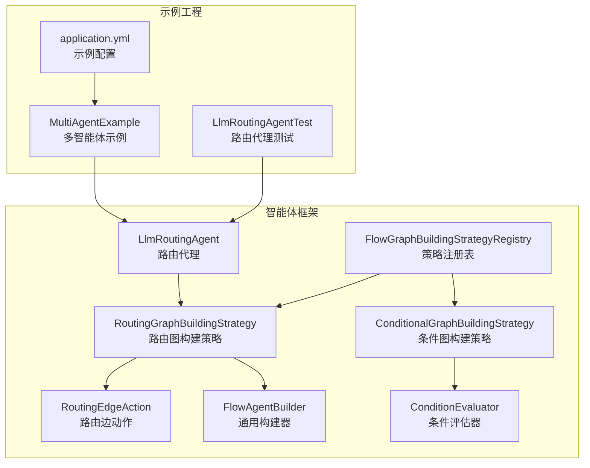
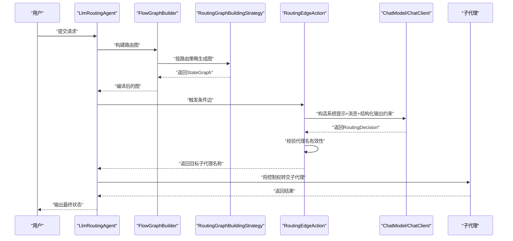
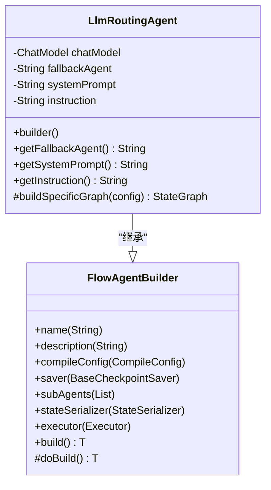
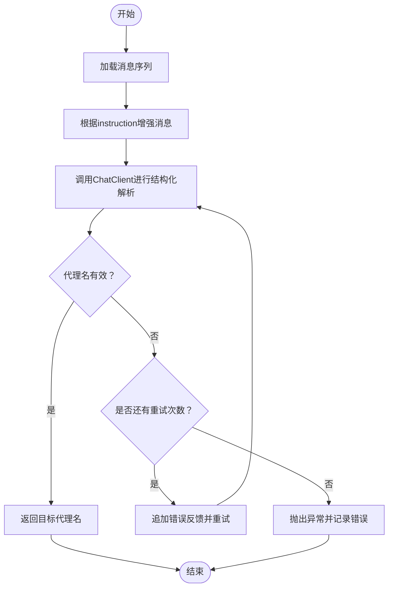
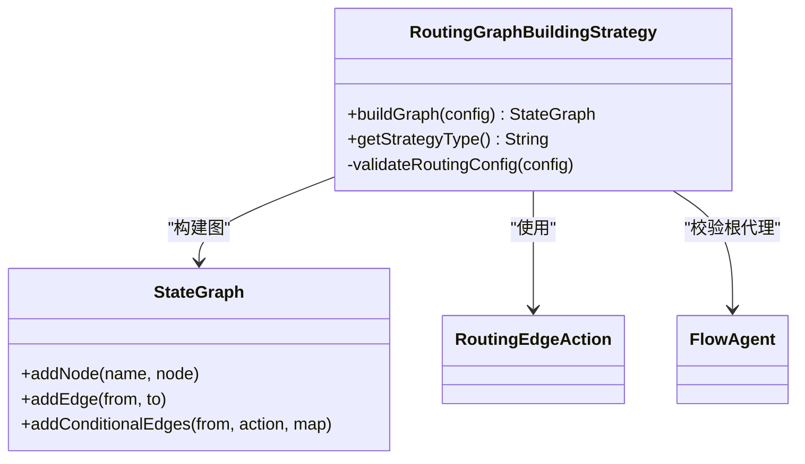
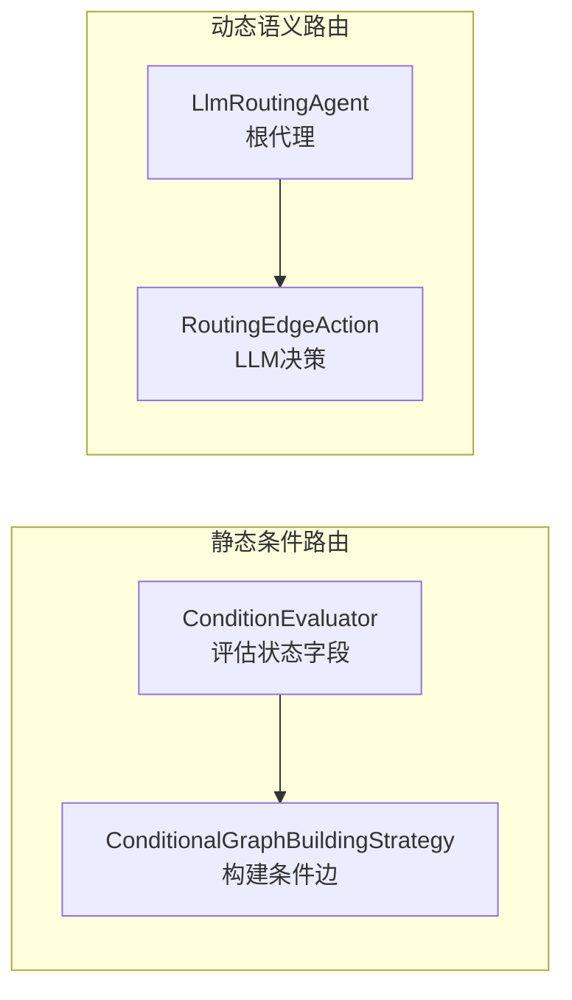
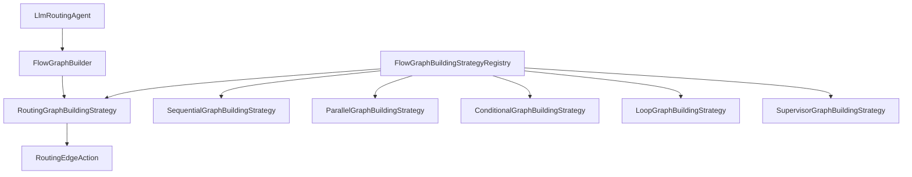

# 路由代理

<cite>
**本文引用的文件列表**
- [LlmRoutingAgent.java](file://spring-ai-alibaba-agent-framework/src/main/java/com/alibaba/cloud/ai/graph/agent/flow/agent/LlmRoutingAgent.java)
- [RoutingEdgeAction.java](file://spring-ai-alibaba-agent-framework/src/main/java/com/alibaba/cloud/ai/graph/agent/flow/node/RoutingEdgeAction.java)
- [RoutingGraphBuildingStrategy.java](file://spring-ai-alibaba-agent-framework/src/main/java/com/alibaba/cloud/ai/graph/agent/flow/strategy/RoutingGraphBuildingStrategy.java)
- [FlowAgentBuilder.java](file://spring-ai-alibaba-agent-framework/src/main/java/com/alibaba/cloud/ai/graph/agent/flow/builder/FlowAgentBuilder.java)
- [ConditionEvaluator.java](file://spring-ai-alibaba-agent-framework/src/main/java/com/alibaba/cloud/ai/graph/agent/flow/node/ConditionEvaluator.java)
- [ConditionalGraphBuildingStrategy.java](file://spring-ai-alibaba-agent-framework/src/main/java/com/alibaba/cloud/ai/graph/agent/flow/strategy/ConditionalGraphBuildingStrategy.java)
- [FlowGraphBuildingStrategyRegistry.java](file://spring-ai-alibaba-agent-framework/src/main/java/com/alibaba/cloud/ai/graph/agent/flow/strategy/FlowGraphBuildingStrategyRegistry.java)
- [LlmRoutingAgentTest.java](file://spring-ai-alibaba-agent-framework/src/test/java/com/alibaba/cloud/ai/graph/agent/LlmRoutingAgentTest.java)
- [MultiAgentExample.java](file://examples/documentation/src/main/java/com/alibaba/cloud/ai/examples/documentation/framework/advanced/MultiAgentExample.java)
- [application.yml](file://examples/documentation/src/main/resources/application.yml)
</cite>

## 目录
1. [引言](#引言)
2. [项目结构](#项目结构)
3. [核心组件](#核心组件)
4. [架构总览](#架构总览)
5. [组件详解](#组件详解)
6. [依赖关系分析](#依赖关系分析)
7. [性能与成本考量](#性能与成本考量)
8. [故障排查指南](#故障排查指南)
9. [结论](#结论)
10. [附录](#附录)

## 引言
本篇文档围绕“路由代理（LlmRoutingAgent）”展开，系统性阐述其如何利用大模型（LLM）作为智能路由器，基于用户输入的语义动态选择下一个执行的子代理或工作流分支。文档对比静态条件路由与基于自然语言理解的动态路由差异，解释ConditionEvaluator与LLM交互以评估路由条件的方式，并提供配置示例、适用场景以及对LLM性能与成本的影响分析。目标是帮助读者在复杂对话系统与需要动态决策的业务流程中，正确设计与使用LlmRoutingAgent。

## 项目结构
LlmRoutingAgent位于智能体框架模块中，配合图构建策略、边动作、条件评估器等组件共同构成可扩展的流式工作流。示例工程提供了多智能体混合模式的使用范式，便于理解路由代理在真实场景中的组合与应用。

**图表来源**
- [LlmRoutingAgent.java](file://spring-ai-alibaba-agent-framework/src/main/java/com/alibaba/cloud/ai/graph/agent/flow/agent/LlmRoutingAgent.java#L1-L121)
- [RoutingEdgeAction.java](file://spring-ai-alibaba-agent-framework/src/main/java/com/alibaba/cloud/ai/graph/agent/flow/node/RoutingEdgeAction.java#L1-L243)
- [RoutingGraphBuildingStrategy.java](file://spring-ai-alibaba-agent-framework/src/main/java/com/alibaba/cloud/ai/graph/agent/flow/strategy/RoutingGraphBuildingStrategy.java#L1-L106)
- [FlowAgentBuilder.java](file://spring-ai-alibaba-agent-framework/src/main/java/com/alibaba/cloud/ai/graph/agent/flow/builder/FlowAgentBuilder.java#L1-L162)
- [ConditionEvaluator.java](file://spring-ai-alibaba-agent-framework/src/main/java/com/alibaba/cloud/ai/graph/agent/flow/node/ConditionEvaluator.java#L1-L81)
- [ConditionalGraphBuildingStrategy.java](file://spring-ai-alibaba-agent-framework/src/main/java/com/alibaba/cloud/ai/graph/agent/flow/strategy/ConditionalGraphBuildingStrategy.java#L1-L120)
- [FlowGraphBuildingStrategyRegistry.java](file://spring-ai-alibaba-agent-framework/src/main/java/com/alibaba/cloud/ai/graph/agent/flow/strategy/FlowGraphBuildingStrategyRegistry.java#L1-L138)
- [MultiAgentExample.java](file://examples/documentation/src/main/java/com/alibaba/cloud/ai/examples/documentation/framework/advanced/MultiAgentExample.java#L370-L569)
- [LlmRoutingAgentTest.java](file://spring-ai-alibaba-agent-framework/src/test/java/com/alibaba/cloud/ai/graph/agent/LlmRoutingAgentTest.java#L1-L120)
- [application.yml](file://examples/documentation/src/main/resources/application.yml#L1-L43)

**章节来源**
- [LlmRoutingAgent.java](file://spring-ai-alibaba-agent-framework/src/main/java/com/alibaba/cloud/ai/graph/agent/flow/agent/LlmRoutingAgent.java#L1-L121)
- [RoutingEdgeAction.java](file://spring-ai-alibaba-agent-framework/src/main/java/com/alibaba/cloud/ai/graph/agent/flow/node/RoutingEdgeAction.java#L1-L243)
- [RoutingGraphBuildingStrategy.java](file://spring-ai-alibaba-agent-framework/src/main/java/com/alibaba/cloud/ai/graph/agent/flow/strategy/RoutingGraphBuildingStrategy.java#L1-L106)
- [FlowAgentBuilder.java](file://spring-ai-alibaba-agent-framework/src/main/java/com/alibaba/cloud/ai/graph/agent/flow/builder/FlowAgentBuilder.java#L1-L162)
- [ConditionEvaluator.java](file://spring-ai-alibaba-agent-framework/src/main/java/com/alibaba/cloud/ai/graph/agent/flow/node/ConditionEvaluator.java#L1-L81)
- [ConditionalGraphBuildingStrategy.java](file://spring-ai-alibaba-agent-framework/src/main/java/com/alibaba/cloud/ai/graph/agent/flow/strategy/ConditionalGraphBuildingStrategy.java#L1-L120)
- [FlowGraphBuildingStrategyRegistry.java](file://spring-ai-alibaba-agent-framework/src/main/java/com/alibaba/cloud/ai/graph/agent/flow/strategy/FlowGraphBuildingStrategyRegistry.java#L1-L138)
- [MultiAgentExample.java](file://examples/documentation/src/main/java/com/alibaba/cloud/ai/examples/documentation/framework/advanced/MultiAgentExample.java#L370-L569)
- [LlmRoutingAgentTest.java](file://spring-ai-alibaba-agent-framework/src/test/java/com/alibaba/cloud/ai/graph/agent/LlmRoutingAgentTest.java#L1-L120)
- [application.yml](file://examples/documentation/src/main/resources/application.yml#L1-L43)

## 核心组件
- LlmRoutingAgent：面向LLM的路由代理，负责根据输入与子代理能力，动态选择下一步执行的子代理。它通过构建“路由图”来组织执行路径，并支持系统提示与指令注入。
- RoutingEdgeAction：路由边动作，封装LLM决策逻辑，将对话历史与可用子代理信息传入模型，解析结构化输出并校验有效性，最终返回目标子代理名称。
- RoutingGraphBuildingStrategy：路由图构建策略，负责将根透明节点、子代理节点与条件边（由RoutingEdgeAction提供）组装为可执行的StateGraph。
- FlowAgentBuilder：通用构建器基类，提供统一的属性设置与校验逻辑，LlmRoutingAgentBuilder在其基础上增加LLM相关配置。
- ConditionEvaluator：条件评估器节点，用于静态条件路由场景；与LLM路由形成互补，既可独立使用，也可与LLM路由结合。
- ConditionalGraphBuildingStrategy：条件图构建策略，将ConditionEvaluator与子代理映射为条件边，实现基于状态的静态分支。
- FlowGraphBuildingStrategyRegistry：策略注册表，集中管理各类型图构建策略，默认注册路由、顺序、并行、条件、循环、监督者等策略。

**章节来源**
- [LlmRoutingAgent.java](file://spring-ai-alibaba-agent-framework/src/main/java/com/alibaba/cloud/ai/graph/agent/flow/agent/LlmRoutingAgent.java#L1-L121)
- [RoutingEdgeAction.java](file://spring-ai-alibaba-agent-framework/src/main/java/com/alibaba/cloud/ai/graph/agent/flow/node/RoutingEdgeAction.java#L1-L243)
- [RoutingGraphBuildingStrategy.java](file://spring-ai-alibaba-agent-framework/src/main/java/com/alibaba/cloud/ai/graph/agent/flow/strategy/RoutingGraphBuildingStrategy.java#L1-L106)
- [FlowAgentBuilder.java](file://spring-ai-alibaba-agent-framework/src/main/java/com/alibaba/cloud/ai/graph/agent/flow/builder/FlowAgentBuilder.java#L1-L162)
- [ConditionEvaluator.java](file://spring-ai-alibaba-agent-framework/src/main/java/com/alibaba/cloud/ai/graph/agent/flow/node/ConditionEvaluator.java#L1-L81)
- [ConditionalGraphBuildingStrategy.java](file://spring-ai-alibaba-agent-framework/src/main/java/com/alibaba/cloud/ai/graph/agent/flow/strategy/ConditionalGraphBuildingStrategy.java#L1-L120)
- [FlowGraphBuildingStrategyRegistry.java](file://spring-ai-alibaba-agent-framework/src/main/java/com/alibaba/cloud/ai/graph/agent/flow/strategy/FlowGraphBuildingStrategyRegistry.java#L1-L138)

## 架构总览
下图展示了LlmRoutingAgent在工作流中的角色与交互：构建阶段由RoutingGraphBuildingStrategy生成图结构，运行阶段由RoutingEdgeAction驱动LLM做出路由决策，最终将控制权交给选定的子代理。

**图表来源**
- [LlmRoutingAgent.java](file://spring-ai-alibaba-agent-framework/src/main/java/com/alibaba/cloud/ai/graph/agent/flow/agent/LlmRoutingAgent.java#L57-L61)
- [RoutingGraphBuildingStrategy.java](file://spring-ai-alibaba-agent-framework/src/main/java/com/alibaba/cloud/ai/graph/agent/flow/strategy/RoutingGraphBuildingStrategy.java#L41-L72)
- [RoutingEdgeAction.java](file://spring-ai-alibaba-agent-framework/src/main/java/com/alibaba/cloud/ai/graph/agent/flow/node/RoutingEdgeAction.java#L83-L113)
- [FlowAgentBuilder.java](file://spring-ai-alibaba-agent-framework/src/main/java/com/alibaba/cloud/ai/graph/agent/flow/builder/FlowAgentBuilder.java#L149-L160)

## 组件详解

### LlmRoutingAgent：基于LLM的智能路由
- 角色定位：作为根代理，负责将输入与上下文传递给RoutingEdgeAction，由后者驱动LLM做出路由决策。
- 关键配置：
  - ChatModel：用于路由决策的模型实例。
  - fallbackAgent：回退代理名称（当前实现未直接使用，保留以备扩展）。
  - systemPrompt：系统提示，用于定制LLM的路由职责与约束。
  - instruction：附加指令，作为UserMessage注入到消息序列中，辅助LLM决策。
- 图构建：通过调用FlowGraphBuilder并指定路由策略类型，将根透明节点、子代理节点与条件边组装为StateGraph。

**图表来源**
- [LlmRoutingAgent.java](file://spring-ai-alibaba-agent-framework/src/main/java/com/alibaba/cloud/ai/graph/agent/flow/agent/LlmRoutingAgent.java#L1-L121)
- [FlowAgentBuilder.java](file://spring-ai-alibaba-agent-framework/src/main/java/com/alibaba/cloud/ai/graph/agent/flow/builder/FlowAgentBuilder.java#L1-L162)

**章节来源**
- [LlmRoutingAgent.java](file://spring-ai-alibaba-agent-framework/src/main/java/com/alibaba/cloud/ai/graph/agent/flow/agent/LlmRoutingAgent.java#L26-L118)
- [FlowAgentBuilder.java](file://spring-ai-alibaba-agent-framework/src/main/java/com/alibaba/cloud/ai/graph/agent/flow/builder/FlowAgentBuilder.java#L36-L160)

### RoutingEdgeAction：LLM路由决策的核心
- 功能要点：
  - 构造系统提示：优先使用LlmRoutingAgent的systemPrompt；否则自动生成包含子代理能力清单与可用名称列表的提示。
  - 结构化输出：通过BeanOutputConverter定义RoutingDecision结构，确保模型输出可解析。
  - 消息增强：根据LlmRoutingAgent的instruction决定是否添加UserMessage，或使用默认指令。
  - 决策校验：验证模型返回的代理名是否存在于可用子代理集合中。
  - 重试机制：当返回无效代理名时，追加错误反馈并最多重试若干次，提升鲁棒性。
- 错误处理：记录日志并在失败时抛出异常，便于上层捕获与恢复。

**图表来源**
- [RoutingEdgeAction.java](file://spring-ai-alibaba-agent-framework/src/main/java/com/alibaba/cloud/ai/graph/agent/flow/node/RoutingEdgeAction.java#L83-L236)

**章节来源**
- [RoutingEdgeAction.java](file://spring-ai-alibaba-agent-framework/src/main/java/com/alibaba/cloud/ai/graph/agent/flow/node/RoutingEdgeAction.java#L48-L113)
- [RoutingEdgeAction.java](file://spring-ai-alibaba-agent-framework/src/main/java/com/alibaba/cloud/ai/graph/agent/flow/node/RoutingEdgeAction.java#L115-L236)

### RoutingGraphBuildingStrategy：路由图构建
- 职责：将根透明节点、子代理节点与条件边（由RoutingEdgeAction提供）组装为StateGraph。
- 校验：要求至少存在一个子代理、必须提供ChatModel、且根代理必须为FlowAgent以便访问输入键。
- 边连接：根节点通过条件边连接到RoutingEdgeAction，RoutingEdgeAction返回的代理名作为边标签，最终将每个子代理连接至END。

**图表来源**
- [RoutingGraphBuildingStrategy.java](file://spring-ai-alibaba-agent-framework/src/main/java/com/alibaba/cloud/ai/graph/agent/flow/strategy/RoutingGraphBuildingStrategy.java#L41-L105)

**章节来源**
- [RoutingGraphBuildingStrategy.java](file://spring-ai-alibaba-agent-framework/src/main/java/com/alibaba/cloud/ai/graph/agent/flow/strategy/RoutingGraphBuildingStrategy.java#L41-L105)

### 与静态条件路由的对比：ConditionEvaluator vs LLM
- 静态条件路由（ConditionEvaluator + ConditionalGraphBuildingStrategy）：
  - 基于状态字段（如输入关键字）进行硬编码判断，适合明确、稳定的业务分支。
  - 无需外部LLM调用，延迟低、成本可控。
- 动态语义路由（LlmRoutingAgent + RoutingEdgeAction）：
  - 基于自然语言理解，能处理模糊、多义、上下文相关的输入，适合复杂对话与动态决策。
  - 需要一次或多次LLM调用（含重试），带来额外延迟与成本。

**图表来源**
- [ConditionEvaluator.java](file://spring-ai-alibaba-agent-framework/src/main/java/com/alibaba/cloud/ai/graph/agent/flow/node/ConditionEvaluator.java#L1-L81)
- [ConditionalGraphBuildingStrategy.java](file://spring-ai-alibaba-agent-framework/src/main/java/com/alibaba/cloud/ai/graph/agent/flow/strategy/ConditionalGraphBuildingStrategy.java#L1-L120)
- [RoutingEdgeAction.java](file://spring-ai-alibaba-agent-framework/src/main/java/com/alibaba/cloud/ai/graph/agent/flow/node/RoutingEdgeAction.java#L1-L243)

**章节来源**
- [ConditionEvaluator.java](file://spring-ai-alibaba-agent-framework/src/main/java/com/alibaba/cloud/ai/graph/agent/flow/node/ConditionEvaluator.java#L28-L81)
- [ConditionalGraphBuildingStrategy.java](file://spring-ai-alibaba-agent-framework/src/main/java/com/alibaba/cloud/ai/graph/agent/flow/strategy/ConditionalGraphBuildingStrategy.java#L35-L120)
- [RoutingEdgeAction.java](file://spring-ai-alibaba-agent-framework/src/main/java/com/alibaba/cloud/ai/graph/agent/flow/node/RoutingEdgeAction.java#L48-L113)

### 配置示例与最佳实践
- 基本路由代理配置（示例来自文档示例工程）：
  - 设置名称、描述、模型、子代理列表。
  - 可选：systemPrompt（定制LLM路由职责）、instruction（附加指令）。
- 混合模式示例（并行收集 -> 分析 -> 路由生成报告）：
  - 将并行与顺序工作流与路由代理组合，形成复杂业务闭环。
- 优化路由准确性的建议：
  - 为每个子代理提供清晰、无重叠的能力描述。
  - 明确职责边界，避免任务歧义导致LLM误判。
- 执行器配置：
  - 可通过FlowAgentBuilder的executor方法为并行节点提供自定义线程池，提升吞吐。

参考路径（不含代码内容）：
- [示例：基础路由代理](file://examples/documentation/src/main/java/com/alibaba/cloud/ai/examples/documentation/framework/advanced/MultiAgentExample.java#L372-L394)
- [示例：优化路由准确性](file://examples/documentation/src/main/java/com/alibaba/cloud/ai/examples/documentation/framework/advanced/MultiAgentExample.java#L401-L439)
- [示例：混合模式（并行+顺序+路由）](file://examples/documentation/src/main/java/com/alibaba/cloud/ai/examples/documentation/framework/advanced/MultiAgentExample.java#L447-L533)
- [执行器配置（测试用例）](file://spring-ai-alibaba-agent-framework/src/test/java/com/alibaba/cloud/ai/graph/agent/ExecutorConfigTest.java#L223-L234)

**章节来源**
- [MultiAgentExample.java](file://examples/documentation/src/main/java/com/alibaba/cloud/ai/examples/documentation/framework/advanced/MultiAgentExample.java#L372-L533)
- [LlmRoutingAgentTest.java](file://spring-ai-alibaba-agent-framework/src/test/java/com/alibaba/cloud/ai/graph/agent/LlmRoutingAgentTest.java#L223-L234)

## 依赖关系分析
- 策略注册与查找：FlowGraphBuildingStrategyRegistry默认注册路由、顺序、并行、条件、循环、监督者等策略，路由代理通过类型标识选择RoutingGraphBuildingStrategy。
- 构建链路：LlmRoutingAgent在构建图时设置ChatModel，再委托FlowGraphBuilder按路由策略生成StateGraph。
- 运行链路：RoutingGraphBuildingStrategy将根节点与子代理节点连接，并通过RoutingEdgeAction的条件边实现动态路由。

**图表来源**
- [FlowGraphBuildingStrategyRegistry.java](file://spring-ai-alibaba-agent-framework/src/main/java/com/alibaba/cloud/ai/graph/agent/flow/strategy/FlowGraphBuildingStrategyRegistry.java#L124-L138)
- [LlmRoutingAgent.java](file://spring-ai-alibaba-agent-framework/src/main/java/com/alibaba/cloud/ai/graph/agent/flow/agent/LlmRoutingAgent.java#L57-L61)
- [RoutingGraphBuildingStrategy.java](file://spring-ai-alibaba-agent-framework/src/main/java/com/alibaba/cloud/ai/graph/agent/flow/strategy/RoutingGraphBuildingStrategy.java#L41-L72)

**章节来源**
- [FlowGraphBuildingStrategyRegistry.java](file://spring-ai-alibaba-agent-framework/src/main/java/com/alibaba/cloud/ai/graph/agent/flow/strategy/FlowGraphBuildingStrategyRegistry.java#L1-L138)
- [LlmRoutingAgent.java](file://spring-ai-alibaba-agent-framework/src/main/java/com/alibaba/cloud/ai/graph/agent/flow/agent/LlmRoutingAgent.java#L57-L61)
- [RoutingGraphBuildingStrategy.java](file://spring-ai-alibaba-agent-framework/src/main/java/com/alibaba/cloud/ai/graph/agent/flow/strategy/RoutingGraphBuildingStrategy.java#L41-L72)

## 性能与成本考量
- LLM调用开销：
  - RoutingEdgeAction在首次尝试失败时会追加错误反馈并重试，增加一次或多次模型调用，带来额外延迟与成本。
  - systemPrompt与instruction越清晰，越有助于减少无效决策与重试次数。
- 成本控制建议：
  - 为子代理提供明确、互斥的能力描述，降低LLM歧义。
  - 对高频路由场景，可在应用层缓存常见输入的路由结果（需自行实现）。
  - 合理设置重试次数与超时时间，避免过度调用。
- 性能优化建议：
  - 使用结构化输出约束（BeanOutputConverter）减少后处理开销。
  - 将子代理数量控制在合理范围，避免过多分支导致LLM负担过重。
  - 对非关键分支采用静态条件路由（ConditionEvaluator）以降低LLM调用频率。

[本节为通用指导，不直接分析具体文件]

## 故障排查指南
- 常见问题与定位：
  - 未提供ChatModel：LlmRoutingAgentBuilder在构建前会校验，缺失将抛出异常。
  - 子代理列表为空：RoutingGraphBuildingStrategy在构建时校验，需至少提供一个子代理。
  - 无效代理名：RoutingEdgeAction在决策校验阶段会记录错误并抛出异常，检查systemPrompt/instruction与子代理名称一致性。
  - 重试失败：若多次重试仍返回无效代理名，检查模型输出格式约束与错误反馈是否被正确注入。
- 单元测试参考：
  - LlmRoutingAgentTest展示了如何创建子代理与路由代理，并断言输出键的存在与内容非空，可作为集成测试模板。

**章节来源**
- [LlmRoutingAgent.java](file://spring-ai-alibaba-agent-framework/src/main/java/com/alibaba/cloud/ai/graph/agent/flow/agent/LlmRoutingAgent.java#L104-L118)
- [RoutingGraphBuildingStrategy.java](file://spring-ai-alibaba-agent-framework/src/main/java/com/alibaba/cloud/ai/graph/agent/flow/strategy/RoutingGraphBuildingStrategy.java#L90-L105)
- [RoutingEdgeAction.java](file://spring-ai-alibaba-agent-framework/src/main/java/com/alibaba/cloud/ai/graph/agent/flow/node/RoutingEdgeAction.java#L92-L113)
- [LlmRoutingAgentTest.java](file://spring-ai-alibaba-agent-framework/src/test/java/com/alibaba/cloud/ai/graph/agent/LlmRoutingAgentTest.java#L54-L118)

## 结论
LlmRoutingAgent通过将LLM决策与图构建策略解耦，实现了基于自然语言理解的动态路由能力。相较静态条件路由，它在复杂对话与多义输入场景更具优势，但也带来额外的性能与成本开销。通过合理的系统提示、清晰的子代理描述与结构化输出约束，可以在保证准确性的同时控制成本与延迟。在实际工程中，可将LlmRoutingAgent与顺序、并行、监督者等模式组合，构建灵活高效的智能工作流。

[本节为总结性内容，不直接分析具体文件]

## 附录

### 配置要点速查
- 必填项：
  - name：唯一名称。
  - subAgents：至少一个子代理。
  - model：ChatModel实例。
- 可选项：
  - systemPrompt：定制LLM路由职责与约束。
  - instruction：附加指令，作为UserMessage注入。
  - executor：为并行节点提供自定义线程池。
- 示例参考：
  - [基础路由代理示例](file://examples/documentation/src/main/java/com/alibaba/cloud/ai/examples/documentation/framework/advanced/MultiAgentExample.java#L372-L394)
  - [混合模式示例](file://examples/documentation/src/main/java/com/alibaba/cloud/ai/examples/documentation/framework/advanced/MultiAgentExample.java#L447-L533)
  - [优化路由准确性示例](file://examples/documentation/src/main/java/com/alibaba/cloud/ai/examples/documentation/framework/advanced/MultiAgentExample.java#L401-L439)

**章节来源**
- [MultiAgentExample.java](file://examples/documentation/src/main/java/com/alibaba/cloud/ai/examples/documentation/framework/advanced/MultiAgentExample.java#L372-L533)
- [FlowAgentBuilder.java](file://spring-ai-alibaba-agent-framework/src/main/java/com/alibaba/cloud/ai/graph/agent/flow/builder/FlowAgentBuilder.java#L36-L160)