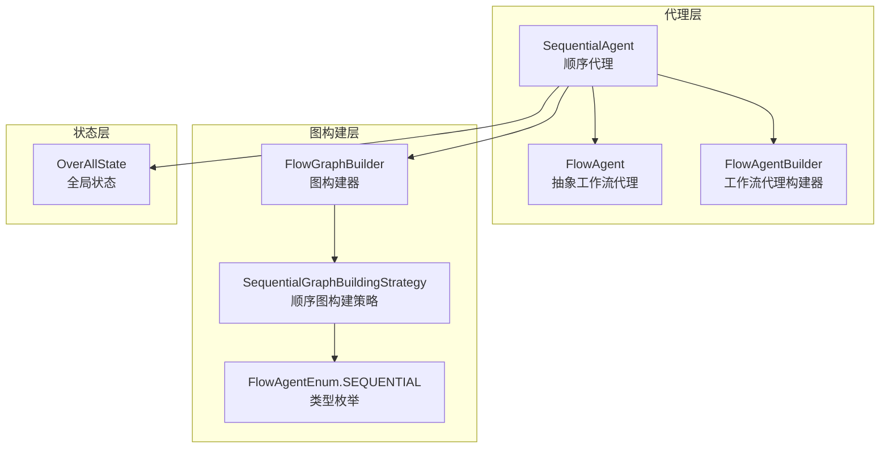
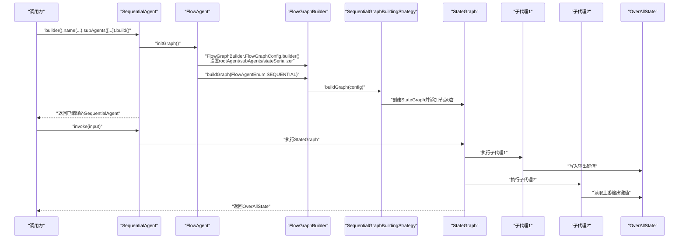
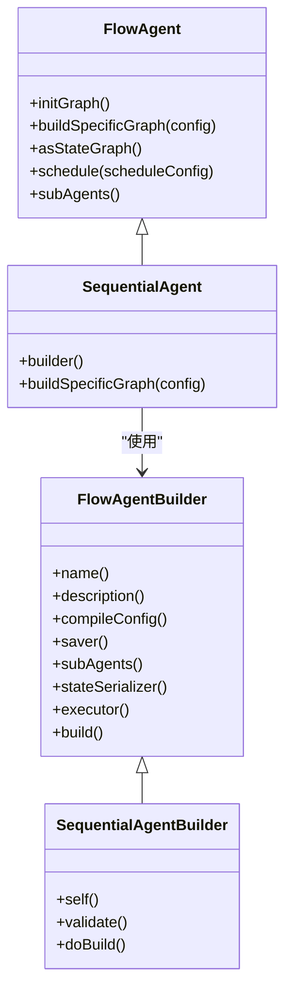
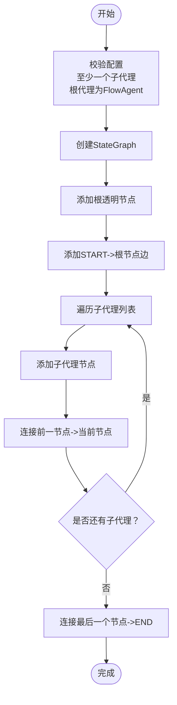
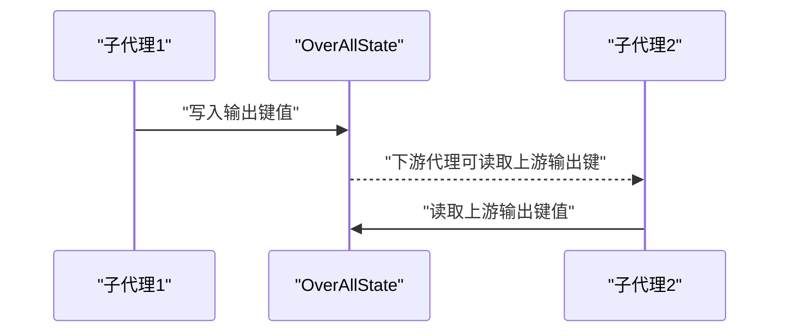
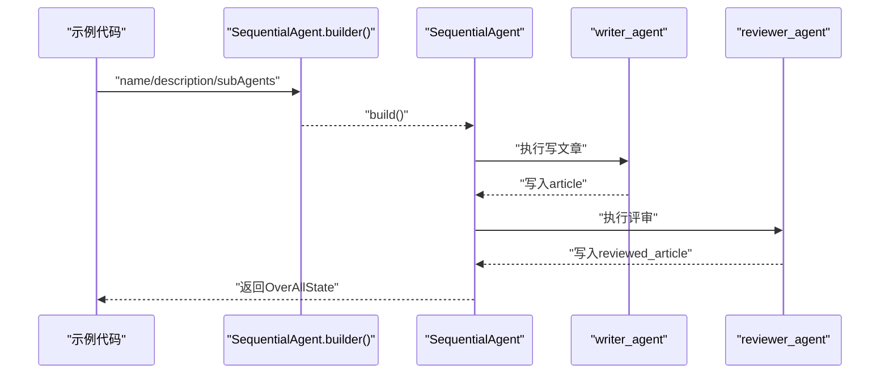
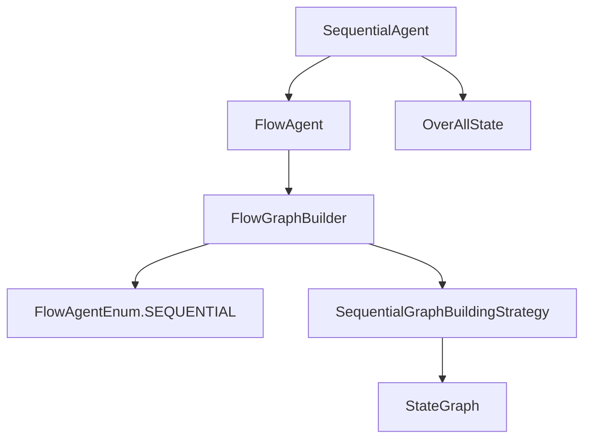

# 顺序代理

<cite>
**本文引用的文件**
- [SequentialAgent.java](file://spring-ai-alibaba-agent-framework/src/main/java/com/alibaba/cloud/ai/graph/agent/flow/agent/SequentialAgent.java)
- [SequentialGraphBuildingStrategy.java](file://spring-ai-alibaba-agent-framework/src/main/java/com/alibaba/cloud/ai/graph/agent/flow/strategy/SequentialGraphBuildingStrategy.java)
- [FlowAgent.java](file://spring-ai-alibaba-agent-framework/src/main/java/com/alibaba/cloud/ai/graph/agent/flow/agent/FlowAgent.java)
- [FlowAgentBuilder.java](file://spring-ai-alibaba-agent-framework/src/main/java/com/alibaba/cloud/ai/graph/agent/flow/builder/FlowAgentBuilder.java)
- [FlowGraphBuilder.java](file://spring-ai-alibaba-agent-framework/src/main/java/com/alibaba/cloud/ai/graph/agent/flow/builder/FlowGraphBuilder.java)
- [FlowAgentEnum.java](file://spring-ai-alibaba-agent-framework/src/main/java/com/alibaba/cloud/ai/graph/agent/flow/enums/FlowAgentEnum.java)
- [OverAllState.java](file://spring-ai-alibaba-graph-core/src/main/java/com/alibaba/cloud/ai/graph/OverAllState.java)
- [SequentialAgentTest.java](file://spring-ai-alibaba-agent-framework/src/test/java/com/alibaba/cloud/ai/graph/agent/SequentialAgentTest.java)
- [MultiAgentExample.java](file://examples/documentation/src/main/java/com/alibaba/cloud/ai/examples/documentation/framework/advanced/MultiAgentExample.java)
</cite>

## 目录
1. [简介](#简介)
2. [项目结构](#项目结构)
3. [核心组件](#核心组件)
4. [架构总览](#架构总览)
5. [详细组件分析](#详细组件分析)
6. [依赖关系分析](#依赖关系分析)
7. [性能考量](#性能考量)
8. [故障排查指南](#故障排查指南)
9. [结论](#结论)
10. [附录](#附录)

## 简介
顺序代理（SequentialAgent）是最基础的工作流代理，它将多个子代理按预定义的线性顺序依次执行，前一个子代理的输出作为下一个子代理的输入。其内部通过“顺序图构建策略”（SequentialGraphBuildingStrategy）将子代理串联为一条执行链路，借助统一的图构建器（FlowGraphBuilder）与枚举类型（FlowAgentEnum.SEQUENTIAL）完成图的编译与运行。在OverAllState状态管理中，各子代理的输出键值被写入全局状态，下游代理可通过占位符引用上游输出，从而实现严格的顺序数据流转。

## 项目结构
围绕顺序代理的关键文件分布如下：
- 顺序代理实现：SequentialAgent
- 图构建策略：SequentialGraphBuildingStrategy
- 抽象基类：FlowAgent
- 构建器基类：FlowAgentBuilder
- 图构建器：FlowGraphBuilder
- 类型枚举：FlowAgentEnum
- 状态容器：OverAllState
- 示例与测试：SequentialAgentTest、MultiAgentExample

**图表来源**
- [SequentialAgent.java](file://spring-ai-alibaba-agent-framework/src/main/java/com/alibaba/cloud/ai/graph/agent/flow/agent/SequentialAgent.java#L23-L64)
- [FlowAgent.java](file://spring-ai-alibaba-agent-framework/src/main/java/com/alibaba/cloud/ai/graph/agent/flow/agent/FlowAgent.java#L31-L104)
- [FlowAgentBuilder.java](file://spring-ai-alibaba-agent-framework/src/main/java/com/alibaba/cloud/ai/graph/agent/flow/builder/FlowAgentBuilder.java#L29-L161)
- [FlowGraphBuilder.java](file://spring-ai-alibaba-agent-framework/src/main/java/com/alibaba/cloud/ai/graph/agent/flow/builder/FlowGraphBuilder.java#L89-L153)
- [SequentialGraphBuildingStrategy.java](file://spring-ai-alibaba-agent-framework/src/main/java/com/alibaba/cloud/ai/graph/agent/flow/strategy/SequentialGraphBuildingStrategy.java#L30-L94)
- [FlowAgentEnum.java](file://spring-ai-alibaba-agent-framework/src/main/java/com/alibaba/cloud/ai/graph/agent/flow/enums/FlowAgentEnum.java#L18-L31)
- [OverAllState.java](file://spring-ai-alibaba-graph-core/src/main/java/com/alibaba/cloud/ai/graph/OverAllState.java#L101-L146)

**章节来源**
- [SequentialAgent.java](file://spring-ai-alibaba-agent-framework/src/main/java/com/alibaba/cloud/ai/graph/agent/flow/agent/SequentialAgent.java#L23-L64)
- [FlowAgent.java](file://spring-ai-alibaba-agent-framework/src/main/java/com/alibaba/cloud/ai/graph/agent/flow/agent/FlowAgent.java#L31-L104)
- [FlowAgentBuilder.java](file://spring-ai-alibaba-agent-framework/src/main/java/com/alibaba/cloud/ai/graph/agent/flow/builder/FlowAgentBuilder.java#L29-L161)
- [FlowGraphBuilder.java](file://spring-ai-alibaba-agent-framework/src/main/java/com/alibaba/cloud/ai/graph/agent/flow/builder/FlowGraphBuilder.java#L89-L153)
- [SequentialGraphBuildingStrategy.java](file://spring-ai-alibaba-agent-framework/src/main/java/com/alibaba/cloud/ai/graph/agent/flow/strategy/SequentialGraphBuildingStrategy.java#L30-L94)
- [FlowAgentEnum.java](file://spring-ai-alibaba-agent-framework/src/main/java/com/alibaba/cloud/ai/graph/agent/flow/enums/FlowAgentEnum.java#L18-L31)
- [OverAllState.java](file://spring-ai-alibaba-graph-core/src/main/java/com/alibaba/cloud/ai/graph/OverAllState.java#L101-L146)

## 核心组件
- 顺序代理（SequentialAgent）
  - 继承自FlowAgent，通过buildSpecificGraph委托给FlowGraphBuilder并指定类型为SEQUENCE。
  - 提供builder方法与SequentialAgentBuilder，支持name、description、compileConfig、saver、subAgents、stateSerializer、executor等配置。
- 顺序图构建策略（SequentialGraphBuildingStrategy）
  - 在validateConfig基础上增加顺序专用校验：至少一个子代理；根代理需为FlowAgent。
  - 构建StateGraph：添加透明根节点、起始边、按序连接子代理、最后指向END。
- 抽象工作流代理（FlowAgent）
  - 负责初始化图：构造FlowGraphBuilder.FlowGraphConfig，设置rootAgent、subAgents、stateSerializer，再调用buildSpecificGraph。
  - 提供schedule与asStateGraph能力。
- 构建器基类（FlowAgentBuilder）
  - 统一的构建器模式，提供name、description、compileConfig、saver、subAgents、stateSerializer、executor等方法。
  - 校验：必须提供name与至少一个subAgent。
- 图构建器（FlowGraphBuilder）
  - 提供FlowGraphConfig的构建方法，包含name、keyStrategyFactory、rootAgent、subAgents、conditionalAgents、chatModel等。
- 类型枚举（FlowAgentEnum）
  - SEQUENTIAL类型用于标识顺序工作流。
- 全局状态（OverAllState）
  - 默认注册输入键“input”，支持键策略（KeyStrategy）与覆盖更新，提供value(key)、value(key, type)、value(key, default)等访问方法。

**章节来源**
- [SequentialAgent.java](file://spring-ai-alibaba-agent-framework/src/main/java/com/alibaba/cloud/ai/graph/agent/flow/agent/SequentialAgent.java#L23-L64)
- [SequentialGraphBuildingStrategy.java](file://spring-ai-alibaba-agent-framework/src/main/java/com/alibaba/cloud/ai/graph/agent/flow/strategy/SequentialGraphBuildingStrategy.java#L30-L94)
- [FlowAgent.java](file://spring-ai-alibaba-agent-framework/src/main/java/com/alibaba/cloud/ai/graph/agent/flow/agent/FlowAgent.java#L31-L104)
- [FlowAgentBuilder.java](file://spring-ai-alibaba-agent-framework/src/main/java/com/alibaba/cloud/ai/graph/agent/flow/builder/FlowAgentBuilder.java#L29-L161)
- [FlowGraphBuilder.java](file://spring-ai-alibaba-agent-framework/src/main/java/com/alibaba/cloud/ai/graph/agent/flow/builder/FlowGraphBuilder.java#L89-L153)
- [FlowAgentEnum.java](file://spring-ai-alibaba-agent-framework/src/main/java/com/alibaba/cloud/ai/graph/agent/flow/enums/FlowAgentEnum.java#L18-L31)
- [OverAllState.java](file://spring-ai-alibaba-graph-core/src/main/java/com/alibaba/cloud/ai/graph/OverAllState.java#L101-L146)

## 架构总览
顺序代理的执行路径如下：
- 构建阶段：SequentialAgent.builder(...) → SequentialAgentBuilder.validate/doBuild → SequentialAgent → FlowAgent.initGraph → FlowGraphBuilder.buildGraph(FlowAgentEnum.SEQUENTIAL) → SequentialGraphBuildingStrategy.buildGraph
- 运行阶段：StateGraph编译后，按线性链路依次执行子代理，前一代理输出写入OverAllState，下游代理可读取上游输出键。

**图表来源**
- [SequentialAgent.java](file://spring-ai-alibaba-agent-framework/src/main/java/com/alibaba/cloud/ai/graph/agent/flow/agent/SequentialAgent.java#L33-L37)
- [FlowAgent.java](file://spring-ai-alibaba-agent-framework/src/main/java/com/alibaba/cloud/ai/graph/agent/flow/agent/FlowAgent.java#L62-L77)
- [FlowGraphBuilder.java](file://spring-ai-alibaba-agent-framework/src/main/java/com/alibaba/cloud/ai/graph/agent/flow/builder/FlowGraphBuilder.java#L89-L153)
- [SequentialGraphBuildingStrategy.java](file://spring-ai-alibaba-agent-framework/src/main/java/com/alibaba/cloud/ai/graph/agent/flow/strategy/SequentialGraphBuildingStrategy.java#L38-L65)
- [OverAllState.java](file://spring-ai-alibaba-graph-core/src/main/java/com/alibaba/cloud/ai/graph/OverAllState.java#L484-L536)

## 详细组件分析

### 顺序代理（SequentialAgent）
- 角色定位：最基础的工作流代理，负责将子代理按顺序串接。
- 关键点：
  - 构建：通过FlowAgentBuilder完成，支持stateSerializer与executor注入。
  - 图构建：委托FlowGraphBuilder并传入FlowAgentEnum.SEQUENTIAL，由SequentialGraphBuildingStrategy生成线性链路。
  - 子代理列表：通过FlowAgentBuilder.subAgents注入，顺序即执行顺序。

**图表来源**
- [SequentialAgent.java](file://spring-ai-alibaba-agent-framework/src/main/java/com/alibaba/cloud/ai/graph/agent/flow/agent/SequentialAgent.java#L23-L64)
- [FlowAgent.java](file://spring-ai-alibaba-agent-framework/src/main/java/com/alibaba/cloud/ai/graph/agent/flow/agent/FlowAgent.java#L31-L104)
- [FlowAgentBuilder.java](file://spring-ai-alibaba-agent-framework/src/main/java/com/alibaba/cloud/ai/graph/agent/flow/builder/FlowAgentBuilder.java#L29-L161)

**章节来源**
- [SequentialAgent.java](file://spring-ai-alibaba-agent-framework/src/main/java/com/alibaba/cloud/ai/graph/agent/flow/agent/SequentialAgent.java#L23-L64)
- [FlowAgent.java](file://spring-ai-alibaba-agent-framework/src/main/java/com/alibaba/cloud/ai/graph/agent/flow/agent/FlowAgent.java#L31-L104)
- [FlowAgentBuilder.java](file://spring-ai-alibaba-agent-framework/src/main/java/com/alibaba/cloud/ai/graph/agent/flow/builder/FlowAgentBuilder.java#L29-L161)

### 顺序图构建策略（SequentialGraphBuildingStrategy）
- 校验逻辑：
  - 必须存在至少一个子代理。
  - 根代理必须是FlowAgent，以便正确访问输入键。
- 构建逻辑：
  - 创建StateGraph（可选带stateSerializer与keyStrategyFactory）。
  - 添加透明根节点与起始边。
  - 逐个添加子代理节点并按序连接。
  - 最后一个子代理连接至END。

**图表来源**
- [SequentialGraphBuildingStrategy.java](file://spring-ai-alibaba-agent-framework/src/main/java/com/alibaba/cloud/ai/graph/agent/flow/strategy/SequentialGraphBuildingStrategy.java#L38-L65)

**章节来源**
- [SequentialGraphBuildingStrategy.java](file://spring-ai-alibaba-agent-framework/src/main/java/com/alibaba/cloud/ai/graph/agent/flow/strategy/SequentialGraphBuildingStrategy.java#L30-L94)

### OverAllState状态管理与数据流转
- 默认输入键：OverAllState.DEFAULT_INPUT_KEY（"input"），用于初始输入注入。
- 键策略：每个键可绑定KeyStrategy，用于合并或替换；默认策略为ReplaceStrategy。
- 数据访问：value(key)、value(key, type)、value(key, default)等方法提供安全访问。
- 在顺序代理中，前一子代理的输出键值写入OverAllState，下游代理通过占位符引用上游输出键，实现严格顺序的数据传递。

**图表来源**
- [OverAllState.java](file://spring-ai-alibaba-graph-core/src/main/java/com/alibaba/cloud/ai/graph/OverAllState.java#L101-L146)
- [OverAllState.java](file://spring-ai-alibaba-graph-core/src/main/java/com/alibaba/cloud/ai/graph/OverAllState.java#L484-L536)

**章节来源**
- [OverAllState.java](file://spring-ai-alibaba-graph-core/src/main/java/com/alibaba/cloud/ai/graph/OverAllState.java#L101-L146)
- [OverAllState.java](file://spring-ai-alibaba-graph-core/src/main/java/com/alibaba/cloud/ai/graph/OverAllState.java#L484-L536)

### 使用示例与配置（FlowAgentBuilder）
- 基本顺序工作流示例：在示例工程中，通过SequentialAgent.builder().name(...).subAgents([...]).build()创建顺序工作流。
- 推理内容控制：通过子代理的returnReasoningContents与includeContents控制消息历史中是否包含推理过程。
- 嵌套顺序代理：SupervisorAgent可将SequentialAgent作为子Agent，实现更复杂的路由与决策。

**图表来源**
- [MultiAgentExample.java](file://examples/documentation/src/main/java/com/alibaba/cloud/ai/examples/documentation/framework/advanced/MultiAgentExample.java#L99-L146)
- [MultiAgentExample.java](file://examples/documentation/src/main/java/com/alibaba/cloud/ai/examples/documentation/framework/advanced/MultiAgentExample.java#L152-L183)

**章节来源**
- [MultiAgentExample.java](file://examples/documentation/src/main/java/com/alibaba/cloud/ai/examples/documentation/framework/advanced/MultiAgentExample.java#L99-L146)
- [MultiAgentExample.java](file://examples/documentation/src/main/java/com/alibaba/cloud/ai/examples/documentation/framework/advanced/MultiAgentExample.java#L152-L183)

## 依赖关系分析
- 顺序代理依赖FlowAgent抽象层，后者负责图初始化与编译。
- FlowGraphBuilder通过类型枚举（FlowAgentEnum.SEQUENTIAL）选择SequentialGraphBuildingStrategy。
- SequentialGraphBuildingStrategy在构建StateGraph时，要求根代理为FlowAgent，确保输入键可用。
- OverAllState作为全局状态容器，承载子代理输出键值，支撑顺序数据流转。

**图表来源**
- [SequentialAgent.java](file://spring-ai-alibaba-agent-framework/src/main/java/com/alibaba/cloud/ai/graph/agent/flow/agent/SequentialAgent.java#L33-L37)
- [FlowAgent.java](file://spring-ai-alibaba-agent-framework/src/main/java/com/alibaba/cloud/ai/graph/agent/flow/agent/FlowAgent.java#L62-L77)
- [FlowGraphBuilder.java](file://spring-ai-alibaba-agent-framework/src/main/java/com/alibaba/cloud/ai/graph/agent/flow/builder/FlowGraphBuilder.java#L89-L153)
- [SequentialGraphBuildingStrategy.java](file://spring-ai-alibaba-agent-framework/src/main/java/com/alibaba/cloud/ai/graph/agent/flow/strategy/SequentialGraphBuildingStrategy.java#L38-L65)
- [FlowAgentEnum.java](file://spring-ai-alibaba-agent-framework/src/main/java/com/alibaba/cloud/ai/graph/agent/flow/enums/FlowAgentEnum.java#L18-L31)
- [OverAllState.java](file://spring-ai-alibaba-graph-core/src/main/java/com/alibaba/cloud/ai/graph/OverAllState.java#L101-L146)

**章节来源**
- [SequentialAgent.java](file://spring-ai-alibaba-agent-framework/src/main/java/com/alibaba/cloud/ai/graph/agent/flow/agent/SequentialAgent.java#L33-L37)
- [FlowAgent.java](file://spring-ai-alibaba-agent-framework/src/main/java/com/alibaba/cloud/ai/graph/agent/flow/agent/FlowAgent.java#L62-L77)
- [FlowGraphBuilder.java](file://spring-ai-alibaba-agent-framework/src/main/java/com/alibaba/cloud/ai/graph/agent/flow/builder/FlowGraphBuilder.java#L89-L153)
- [SequentialGraphBuildingStrategy.java](file://spring-ai-alibaba-agent-framework/src/main/java/com/alibaba/cloud/ai/graph/agent/flow/strategy/SequentialGraphBuildingStrategy.java#L38-L65)
- [FlowAgentEnum.java](file://spring-ai-alibaba-agent-framework/src/main/java/com/alibaba/cloud/ai/graph/agent/flow/enums/FlowAgentEnum.java#L18-L31)
- [OverAllState.java](file://spring-ai-alibaba-graph-core/src/main/java/com/alibaba/cloud/ai/graph/OverAllState.java#L101-L146)

## 性能考量
- 顺序执行特性：SequentialAgent按序串行执行子代理，适合需要严格先后顺序的任务链，但并发度较低。
- 并行对比：若任务链中某些步骤可并行，建议使用ParallelAgent以提升吞吐；若需条件分支，可考虑ConditionalAgent或SupervisorAgent。
- 状态序列化：通过stateSerializer可定制序列化策略，影响编译与持久化开销；默认与Jackson序列化均可在测试中验证一致性。
- 执行器配置：SequentialAgentBuilder支持executor注入，便于在并行节点场景下统一调度（尽管顺序代理本身串行，但可为并行子图提供执行器）。

[本节为通用指导，无需特定文件引用]

## 故障排查指南
- 构建期异常
  - 缺少name或subAgents：FlowAgentBuilder.validate会抛出非法参数异常。
  - 顺序代理缺少子代理：SequentialGraphBuildingStrategy.validateSequentialConfig会抛出非法参数异常。
- 运行期异常
  - 子代理未正确写入输出键：导致下游代理无法读取，可在示例中通过OverAllState.value(key)进行断言与调试。
  - 状态键冲突：OverAllState.updateStateWithKeyStrategies支持键策略合并，避免覆盖错误。
- 常见问题定位
  - 使用SequentialAgentTest中的断言方法验证输出键是否存在与内容非空。
  - 在示例中打印OverAllState的JSON视图，核对messages与各输出键值。

**章节来源**
- [FlowAgentBuilder.java](file://spring-ai-alibaba-agent-framework/src/main/java/com/alibaba/cloud/ai/graph/agent/flow/builder/FlowAgentBuilder.java#L134-L141)
- [SequentialGraphBuildingStrategy.java](file://spring-ai-alibaba-agent-framework/src/main/java/com/alibaba/cloud/ai/graph/agent/flow/strategy/SequentialGraphBuildingStrategy.java#L83-L92)
- [SequentialAgentTest.java](file://spring-ai-alibaba-agent-framework/src/test/java/com/alibaba/cloud/ai/graph/agent/SequentialAgentTest.java#L62-L109)
- [OverAllState.java](file://spring-ai-alibaba-graph-core/src/main/java/com/alibaba/cloud/ai/graph/OverAllState.java#L292-L306)

## 结论
顺序代理SequentialAgent以最小实现提供严格的线性工作流能力：通过SequentialGraphBuildingStrategy将子代理串联为执行链，借助FlowAgent与FlowGraphBuilder完成图构建与编译，结合OverAllState实现前一代理输出到下一代理输入的有序传递。适用于需要严格顺序的任务链（如数据预处理→分析→生成报告）。若需更高吞吐或更灵活的控制，可结合并行、条件或监督代理共同构建复合工作流。

[本节为总结性内容，无需特定文件引用]

## 附录

### 配置示例（基于FlowAgentBuilder）
- 基本顺序工作流
  - 使用SequentialAgent.builder().name(...).description(...).subAgents([...]).build()创建。
- 状态序列化
  - 通过stateSerializer注入自定义序列化器，确保编译后StateGraph使用一致的序列化策略。
- 执行器
  - 通过executor注入执行器，为并行节点提供统一调度（顺序代理本身串行，但可为并行子图提供执行器）。

**章节来源**
- [MultiAgentExample.java](file://examples/documentation/src/main/java/com/alibaba/cloud/ai/examples/documentation/framework/advanced/MultiAgentExample.java#L99-L146)
- [FlowAgentBuilder.java](file://spring-ai-alibaba-agent-framework/src/main/java/com/alibaba/cloud/ai/graph/agent/flow/builder/FlowAgentBuilder.java#L88-L120)
- [FlowAgentSerializerTest.java](file://spring-ai-alibaba-agent-framework/src/test/java/com/alibaba/cloud/ai/graph/agent/flow/FlowAgentSerializerTest.java#L291-L317)