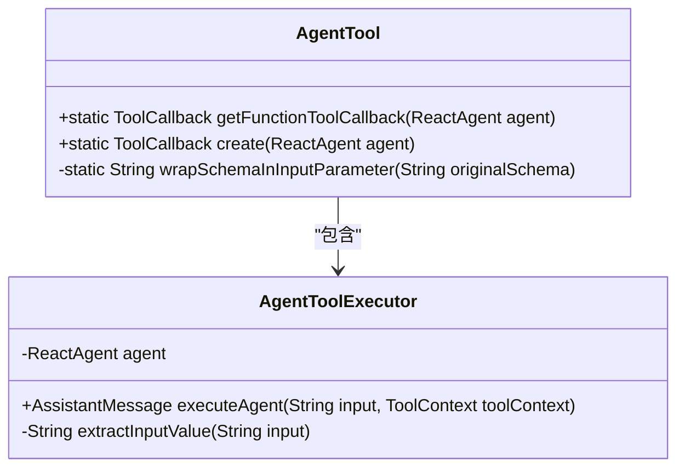

# 工具系统

<cite>
**本文档中引用的文件**  
- [AgentTool.java](file://spring-ai-alibaba-agent-framework/src/main/java/com/alibaba/cloud/ai/graph/agent/AgentTool.java)
- [ShellTool.java](file://spring-ai-alibaba-agent-framework/src/main/java/com/alibaba/cloud/ai/graph/agent/tools/ShellTool.java)
- [GlobSearchTool.java](file://spring-ai-alibaba-agent-framework/src/main/java/com/alibaba/cloud/ai/graph/agent/tools/GlobSearchTool.java)
- [GrepSearchTool.java](file://spring-ai-alibaba-agent-framework/src/main/java/com/alibaba/cloud/ai/graph/agent/tools/GrepSearchTool.java)
- [WriteTodosTool.java](file://spring-ai-alibaba-agent-framework/src/main/java/com/alibaba/cloud/ai/graph/agent/tools/WriteTodosTool.java)
- [EditFileTool.java](file://spring-ai-alibaba-agent-framework/src/main/java/com/alibaba/cloud/ai/graph/agent/extension/tools/filesystem/EditFileTool.java)
- [ReadFileTool.java](file://spring-ai-alibaba-agent-framework/src/main/java/com/alibaba/cloud/ai/graph/agent/extension/tools/filesystem/ReadFileTool.java)
- [WriteFileTool.java](file://spring-ai-alibaba-agent-framework/src/main/java/com/alibaba/cloud/ai/graph/agent/extension/tools/filesystem/WriteFileTool.java)
- [ToolContextConstants.java](file://spring-ai-alibaba-agent-framework/src/main/java/com/alibaba/cloud/ai/graph/agent/tools/ToolContextConstants.java)
- [ChatbotAgent.java](file://examples/chatbot/src/main/java/com/alibaba/cloud/ai/examples/chatbot/ChatbotAgent.java)
- [PythonTool.java](file://examples/chatbot/src/main/java/com/alibaba/cloud/ai/examples/chatbot/PythonTool.java)
</cite>

## 目录
1. [引言](#引言)
2. [AgentTool接口定义](#agenttool接口定义)
3. [内置工具](#内置工具)
   1. [ShellTool - 执行系统命令](#shelltool---执行系统命令)
   2. [GlobSearchTool - 文件搜索](#globsearchtool---文件搜索)
   3. [GrepSearchTool - 内容搜索](#grepsearchtool---内容搜索)
   4. [WriteTodosTool - 生成待办事项](#writetodostool---生成待办事项)
4. [扩展工具包 - 文件系统工具](#扩展工具包---文件系统工具)
   1. [ReadFileTool - 读取文件](#readfiletool---读取文件)
   2. [WriteFileTool - 写入文件](#writefiletool---写入文件)
   3. [EditFileTool - 编辑文件](#editfiletool---编辑文件)
5. [自定义工具的定义、注册和使用](#自定义工具的定义注册和使用)
   1. [定义自定义工具](#定义自定义工具)
   2. [注册工具](#注册工具)
   3. [将工具注入到ReactAgent](#将工具注入到reactagent)
6. [总结](#总结)

## 引言

在代理框架中，工具（Tool）系统是扩展代理能力的核心机制，它使代理能够与外部世界进行交互。通过工具系统，代理可以执行系统命令、搜索文件、读写文件、生成待办事项等操作，从而完成复杂的任务。本文档将详细介绍工具系统的架构、核心接口以及各种内置和扩展工具的使用方法。

**Section sources**
- [AgentTool.java](file://spring-ai-alibaba-agent-framework/src/main/java/com/alibaba/cloud/ai/graph/agent/AgentTool.java#L1-L262)

## AgentTool接口定义

`AgentTool`接口是工具系统的核心，它定义了工具的基本属性和执行方法。在Spring AI Alibaba框架中，`AgentTool`类提供了创建工具回调（ToolCallback）的静态方法，这些方法使用反射机制来注册工具，而不需要依赖`@Tool`注解。

`AgentTool`的主要功能包括：
- **创建工具回调**：通过`create(ReactAgent agent)`方法创建`MethodToolCallback`，该方法使用反射查找`executeAgent`方法并构建回调。
- **包装输入模式**：将原始的输入模式包装在"input"参数中，确保输入数据的结构化。
- **执行代理工具**：`AgentToolExecutor`类包含`executeAgent`方法，该方法从包装的JSON结构中提取实际输入值，并调用代理的`invoke`方法执行任务。



**Diagram sources**
- [AgentTool.java](file://spring-ai-alibaba-agent-framework/src/main/java/com/alibaba/cloud/ai/graph/agent/AgentTool.java#L50-L262)

**Section sources**
- [AgentTool.java](file://spring-ai-alibaba-agent-framework/src/main/java/com/alibaba/cloud/ai/graph/agent/AgentTool.java#L50-L262)

## 内置工具

### ShellTool - 执行系统命令

`ShellTool`是用于执行shell命令的工具。它允许在受管理的会话中执行shell命令，会话的生命周期和配置由`ShellSessionManager`处理。

`ShellTool`的主要特性包括：
- **会话管理**：支持持久化shell会话，可以在会话中执行多个命令。
- **命令执行**：可以执行单个命令或通过`&&`或`;`链式执行多个命令。
- **超时处理**：长时间运行的命令会在配置的超时时间后被终止。
- **输出截断**：当输出非常大时，输出可能会被截断。

```mermaid
classDiagram
class ShellTool {
+static final String DEFAULT_TOOL_DESCRIPTION
-ShellSessionManager sessionManager
+ShellTool(ShellSessionManager sessionManager)
+String apply(Request request, ToolContext toolContext)
+static Builder builder(String workspaceRoot)
}
class ShellTool$Request {
+String command
+Boolean restart
}
class ShellTool$Builder {
-String workspaceRoot
-String name
-String description
-List<String> startupCommands
-List<String> shutdownCommands
-long commandTimeout
-int maxOutputLines
-List<String> shellCommand
-Map<String, String> environment
+ToolCallback build()
}
ShellTool --> ShellTool$Request : "使用"
ShellTool --> ShellTool$Builder : "使用"
```

**Diagram sources**
- [ShellTool.java](file://spring-ai-alibaba-agent-framework/src/main/java/com/alibaba/cloud/ai/graph/agent/tools/ShellTool.java#L16-L255)

**Section sources**
- [ShellTool.java](file://spring-ai-alibaba-agent-framework/src/main/java/com/alibaba/cloud/ai/graph/agent/tools/ShellTool.java#L16-L255)

### GlobSearchTool - 文件搜索

`GlobSearchTool`是用于快速文件模式匹配的工具。它支持glob模式，如`**/*.js`或`src/**/*.ts`，并返回按修改时间排序的匹配文件路径。

`GlobSearchTool`的主要特性包括：
- **模式匹配**：使用`PathMatcher`进行glob模式匹配。
- **路径验证**：防止路径遍历攻击，确保路径在根目录内。
- **结果排序**：按修改时间（最近的在前）对匹配的文件进行排序。

```mermaid
classDiagram
class GlobSearchTool {
-Path rootPath
+GlobSearchTool(String rootPath)
+String apply(Request request, ToolContext toolContext)
+static Builder builder(String rootPath)
}
class GlobSearchTool$Request {
+String pattern
+String path
}
class GlobSearchTool$Builder {
-String rootPath
-String name
-String description
+ToolCallback build()
}
GlobSearchTool --> GlobSearchTool$Request : "使用"
GlobSearchTool --> GlobSearchTool$Builder : "使用"
```

**Diagram sources**
- [GlobSearchTool.java](file://spring-ai-alibaba-agent-framework/src/main/java/com/alibaba/cloud/ai/graph/agent/tools/GlobSearchTool.java#L16-L184)

**Section sources**
- [GlobSearchTool.java](file://spring-ai-alibaba-agent-framework/src/main/java/com/alibaba/cloud/ai/graph/agent/tools/GlobSearchTool.java#L16-L184)

### GrepSearchTool - 内容搜索

`GrepSearchTool`是用于快速内容搜索的工具。它使用正则表达式搜索文件内容，并支持通过include参数过滤文件。

`GrepSearchTool`的主要特性包括：
- **正则表达式搜索**：支持完整的正则表达式语法。
- **文件过滤**：通过include参数过滤文件，如`*.js`或`*.{ts,tsx}`。
- **输出格式**：支持多种输出格式，包括`files_with_matches`、`content`和`count`。
- **性能优化**：优先使用`ripgrep`进行搜索，如果失败则回退到Java搜索。

```mermaid
classDiagram
class GrepSearchTool {
-Path rootPath
-boolean useRipgrep
-long maxFileSizeBytes
+GrepSearchTool(String rootPath)
+GrepSearchTool(String rootPath, boolean useRipgrep, int maxFileSizeMb)
+String apply(Request request, ToolContext toolContext)
+static Builder builder(String rootPath)
}
class GrepSearchTool$Request {
+String pattern
+String path
+String include
+String outputMode
}
class GrepSearchTool$Builder {
-String rootPath
-String name
-String description
-boolean useRipgrep
-int maxFileSizeMb
+ToolCallback build()
}
GrepSearchTool --> GrepSearchTool$Request : "使用"
GrepSearchTool --> GrepSearchTool$Builder : "使用"
```

**Diagram sources**
- [GrepSearchTool.java](file://spring-ai-alibaba-agent-framework/src/main/java/com/alibaba/cloud/ai/graph/agent/tools/GrepSearchTool.java#L16-L372)

**Section sources**
- [GrepSearchTool.java](file://spring-ai-alibaba-agent-framework/src/main/java/com/alibaba/cloud/ai/graph/agent/tools/GrepSearchTool.java#L16-L372)

### WriteTodosTool - 生成待办事项

`WriteTodosTool`是用于创建和管理待办事项列表的工具。它帮助代理跟踪进度、组织复杂任务，并向用户展示工作进展。

`WriteTodosTool`的主要特性包括：
- **任务状态管理**：支持`pending`、`in_progress`和`completed`三种状态。
- **任务更新**：可以实时更新任务状态，标记任务为完成或添加新任务。
- **使用场景**：适用于复杂多步骤任务、用户明确要求待办事项列表或用户提供多个任务的情况。

```mermaid
classDiagram
class WriteTodosTool {
+static final String DEFAULT_TOOL_DESCRIPTION
+WriteTodosTool()
+Response apply(Request request, ToolContext toolContext)
+static Builder builder()
}
class WriteTodosTool$Request {
+List<Todo> todos
}
class WriteTodosTool$Response {
+String message
}
class WriteTodosTool$Builder {
-String name
-String description
+ToolCallback build()
}
WriteTodosTool --> WriteTodosTool$Request : "使用"
WriteTodosTool --> WriteTodosTool$Response : "使用"
WriteTodosTool --> WriteTodosTool$Builder : "使用"
```

**Diagram sources**
- [WriteTodosTool.java](file://spring-ai-alibaba-agent-framework/src/main/java/com/alibaba/cloud/ai/graph/agent/tools/WriteTodosTool.java#L16-L182)

**Section sources**
- [WriteTodosTool.java](file://spring-ai-alibaba-agent-framework/src/main/java/com/alibaba/cloud/ai/graph/agent/tools/WriteTodosTool.java#L16-L182)

## 扩展工具包 - 文件系统工具

### ReadFileTool - 读取文件

`ReadFileTool`是用于读取文件内容的工具，支持分页功能。它允许代理访问文件系统中的任何文件。

`ReadFileTool`的主要特性包括：
- **分页支持**：通过`offset`和`limit`参数支持分页读取，避免上下文溢出。
- **绝对路径**：`file_path`参数必须是绝对路径。
- **行号显示**：结果以`cat -n`格式返回，包含行号。

```mermaid
classDiagram
class ReadFileTool {
+static final String DESCRIPTION
+ReadFileTool()
+String apply(ReadFileRequest request, ToolContext toolContext)
+static ToolCallback createReadFileToolCallback(String description)
}
class ReadFileTool$ReadFileRequest {
+String filePath
+Integer offset
+Integer limit
}
ReadFileTool --> ReadFileTool$ReadFileRequest : "使用"
```

**Diagram sources**
- [ReadFileTool.java](file://spring-ai-alibaba-agent-framework/src/main/java/com/alibaba/cloud/ai/graph/agent/extension/tools/filesystem/ReadFileTool.java#L16-L123)

**Section sources**
- [ReadFileTool.java](file://spring-ai-alibaba-agent-framework/src/main/java/com/alibaba/cloud/ai/graph/agent/extension/tools/filesystem/ReadFileTool.java#L16-L123)

### WriteFileTool - 写入文件

`WriteFileTool`是用于向新文件写入内容的工具。它创建新文件并将内容写入其中。

`WriteFileTool`的主要特性包括：
- **新文件创建**：仅用于创建新文件，如果文件已存在则返回错误。
- **目录创建**：自动创建父目录（如果需要）。
- **内容替换**：写入的内容将完全替换现有内容。

```mermaid
classDiagram
class WriteFileTool {
+static final String DESCRIPTION
+WriteFileTool()
+String apply(WriteFileRequest request, ToolContext toolContext)
+static ToolCallback createWriteFileToolCallback(String description)
}
class WriteFileTool$WriteFileRequest {
+String filePath
+String content
}
WriteFileTool --> WriteFileTool$WriteFileRequest : "使用"
```

**Diagram sources**
- [WriteFileTool.java](file://spring-ai-alibaba-agent-framework/src/main/java/com/alibaba/cloud/ai/graph/agent/extension/tools/filesystem/WriteFileTool.java#L16-L104)

**Section sources**
- [WriteFileTool.java](file://spring-ai-alibaba-agent-framework/src/main/java/com/alibaba/cloud/ai/graph/agent/extension/tools/filesystem/WriteFileTool.java#L16-L104)

### EditFileTool - 编辑文件

`EditFileTool`是用于通过字符串替换编辑文件的工具。它执行精确的字符串替换操作。

`EditFileTool`的主要特性包括：
- **字符串替换**：在文件中执行精确的字符串替换。
- **唯一性检查**：如果`old_string`在文件中不唯一，编辑将失败（除非`replace_all`为true）。
- **修改验证**：建议在编辑后使用`read_file`工具验证更改。

```mermaid
classDiagram
class EditFileTool {
+static final String DESCRIPTION
+EditFileTool()
+String apply(EditFileRequest request, ToolContext toolContext)
+static ToolCallback createEditFileToolCallback(String description)
}
class EditFileTool$EditFileRequest {
+String filePath
+String oldString
+String newString
+boolean replaceAll
}
EditFileTool --> EditFileTool$EditFileRequest : "使用"
```

**Diagram sources**
- [EditFileTool.java](file://spring-ai-alibaba-agent-framework/src/main/java/com/alibaba/cloud/ai/graph/agent/extension/tools/filesystem/EditFileTool.java#L16-L150)

**Section sources**
- [EditFileTool.java](file://spring-ai-alibaba-agent-framework/src/main/java/com/alibaba/cloud/ai/graph/agent/extension/tools/filesystem/EditFileTool.java#L16-L150)

## 自定义工具的定义、注册和使用

### 定义自定义工具

要定义自定义工具，需要创建一个实现`BiFunction<T, ToolContext, R>`接口的类，其中`T`是请求对象，`R`是响应类型。请求对象应使用`@JsonProperty`和`@JsonPropertyDescription`注解来定义参数。

例如，`PythonTool`是一个自定义工具，用于执行Python代码：

```mermaid
classDiagram
class PythonTool {
+static final String DESCRIPTION
-Engine engine
+PythonTool()
+String apply(PythonRequest request, ToolContext toolContext)
+static ToolCallback createPythonToolCallback(String description)
}
class PythonTool$PythonRequest {
+String code
}
PythonTool --> PythonTool$PythonRequest : "使用"
```

**Diagram sources**
- [PythonTool.java](file://examples/chatbot/src/main/java/com/alibaba/cloud/ai/examples/chatbot/PythonTool.java#L16-L158)

**Section sources**
- [PythonTool.java](file://examples/chatbot/src/main/java/com/alibaba/cloud/ai/examples/chatbot/PythonTool.java#L16-L158)

### 注册工具

工具通过`FunctionToolCallback.builder()`方法注册。该方法接受工具名称、工具实例和输入类型作为参数，并返回`ToolCallback`对象。

例如，在`ChatbotAgent`中注册`executeShellCommand`工具：

```java
@Bean
public ToolCallback executeShellCommand() {
    String workspaceRoot = System.getProperty("java.io.tmpdir") + File.separator + "agent-workspace";
    return ShellTool.builder(workspaceRoot)
            .withName("execute_shell_command")
            .withDescription("Execute a shell command inside a persistent session...")
            .build();
}
```

**Section sources**
- [ChatbotAgent.java](file://examples/chatbot/src/main/java/com/alibaba/cloud/ai/examples/chatbot/ChatbotAgent.java#L78-L93)

### 将工具注入到ReactAgent

注册的工具通过`ReactAgent.builder()`的`tools()`方法注入到`ReactAgent`中。同时，可以使用`hooks()`方法添加工具相关的钩子。

例如，在`ChatbotAgent`中将工具注入到`ReactAgent`：

```java
@Bean
public ReactAgent chatbotReactAgent(ChatModel chatModel,
        ToolCallback executeShellCommand,
        ToolCallback executePythonCode,
        ToolCallback viewTextFile,
        MemorySaver memorySaver) {
    return ReactAgent.builder()
            .name("SAA")
            .model(chatModel)
            .instruction(INSTRUCTION)
            .enableLogging(true)
            .saver(memorySaver)
            .hooks(ShellToolAgentHook.builder().shellToolName(executeShellCommand.getToolDefinition().name()).build())
            .tools(
                    executeShellCommand,
                    executePythonCode,
                    viewTextFile
            )
            .build();
}
```

**Section sources**
- [ChatbotAgent.java](file://examples/chatbot/src/main/java/com/alibaba/cloud/ai/examples/chatbot/ChatbotAgent.java#L52-L71)

## 总结

工具系统是Spring AI Alibaba代理框架的核心组成部分，它通过提供一系列内置和可扩展的工具，使代理能够与外部世界进行交互。`AgentTool`接口定义了工具的基本属性和执行方法，而各种内置工具如`ShellTool`、`GlobSearchTool`、`GrepSearchTool`和`WriteTodosTool`提供了执行系统命令、搜索文件、搜索内容和管理待办事项的功能。扩展工具包中的`ReadFileTool`、`WriteFileTool`和`EditFileTool`进一步增强了代理的文件操作能力。通过定义、注册和注入自定义工具，开发者可以轻松扩展代理的功能，以满足特定的应用需求。