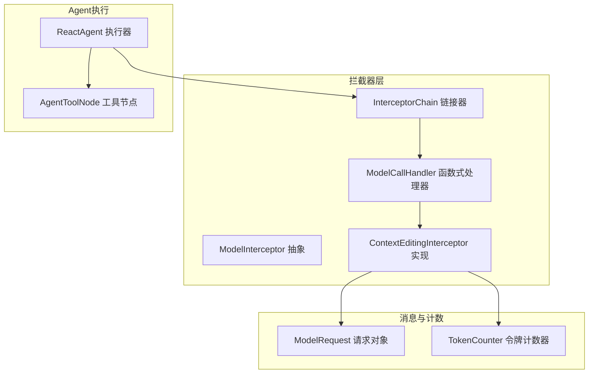
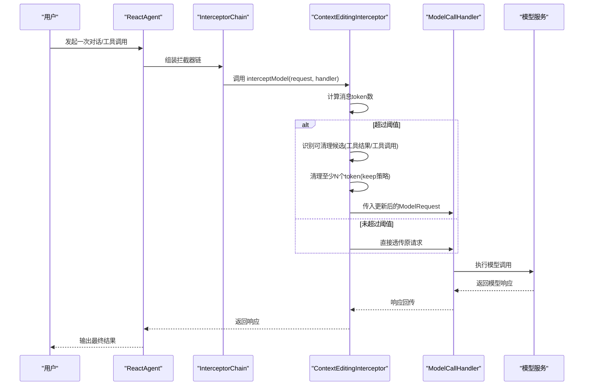
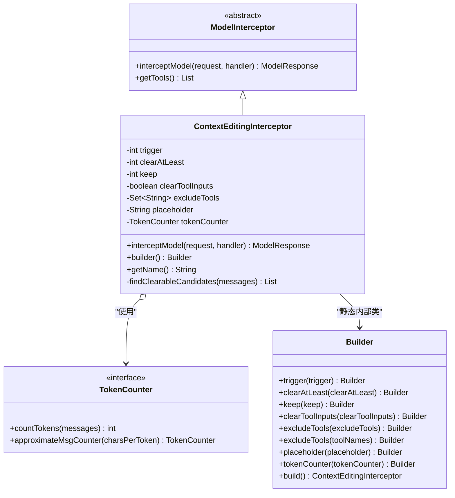
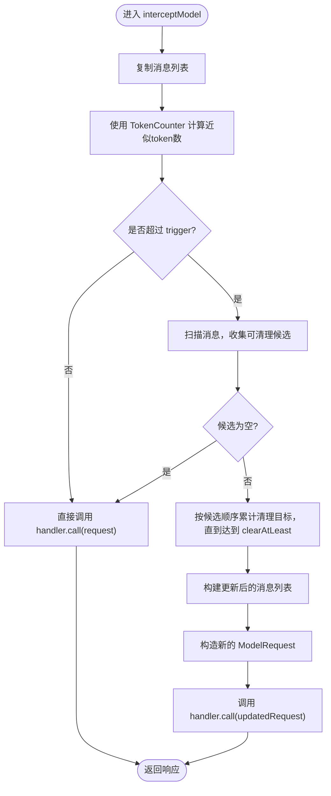
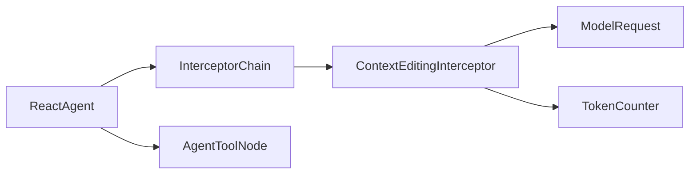

# 上下文编辑拦截器

<cite>
**本文引用的文件列表**
- [ContextEditingInterceptor.java](file://spring-ai-alibaba-agent-framework/src/main/java/com/alibaba/cloud/ai/graph/agent/interceptor/contextediting/ContextEditingInterceptor.java)
- [ModelInterceptor.java](file://spring-ai-alibaba-agent-framework/src/main/java/com/alibaba/cloud/ai/graph/agent/interceptor/ModelInterceptor.java)
- [ModelRequest.java](file://spring-ai-alibaba-agent-framework/src/main/java/com/alibaba/cloud/ai/graph/agent/interceptor/ModelRequest.java)
- [ModelCallHandler.java](file://spring-ai-alibaba-agent-framework/src/main/java/com/alibaba/cloud/ai/graph/agent/interceptor/ModelCallHandler.java)
- [InterceptorChain.java](file://spring-ai-alibaba-agent-framework/src/main/java/com/alibaba/cloud/ai/graph/agent/interceptor/InterceptorChain.java)
- [TokenCounter.java](file://spring-ai-alibaba-agent-framework/src/main/java/com/alibaba/cloud/ai/graph/agent/hook/TokenCounter.java)
- [ContextEditingTest.java](file://spring-ai-alibaba-agent-framework/src/test/java/com/alibaba/cloud/ai/graph/agent/interceptors/ContextEditingTest.java)
- [ContextEngineeringExample.java](file://examples/documentation/src/main/java/com/alibaba/cloud/ai/examples/documentation/framework/advanced/ContextEngineeringExample.java)
- [ReactAgent.java](file://spring-ai-alibaba-agent-framework/src/main/java/com/alibaba/cloud/ai/graph/agent/ReactAgent.java)
- [AgentToolNode.java](file://spring-ai-alibaba-agent-framework/src/main/java/com/alibaba/cloud/ai/graph/agent/node/AgentToolNode.java)
</cite>

## 目录
1. [简介](#简介)
2. [项目结构与定位](#项目结构与定位)
3. [核心组件总览](#核心组件总览)
4. [架构概览](#架构概览)
5. [详细组件分析](#详细组件分析)
6. [依赖关系分析](#依赖关系分析)
7. [性能与复杂度](#性能与复杂度)
8. [使用示例与最佳实践](#使用示例与最佳实践)
9. [与Agent和Hook系统的集成](#与agent和hook系统的集成)
10. [故障排查指南](#故障排查指南)
11. [结论](#结论)

## 简介
本篇文档围绕“上下文编辑拦截器”ContextEditingInterceptor展开，系统性阐述其在模型调用前对上下文进行动态编辑的工作原理、实现机制与应用场景。该拦截器通过拦截ModelRequest，计算消息上下文的近似token数量，在超过阈值时清理较旧的工具结果或工具调用参数，从而控制上下文长度，避免超出模型上下文窗口，提升长对话稳定性与成本效率。文档同时给出配置要点、使用示例、与Agent及Hook系统的集成方式、最佳实践与潜在限制。

## 项目结构与定位
- ContextEditingInterceptor位于拦截器子模块中，属于Agent框架的可插拔扩展点之一，用于在模型调用前对消息上下文进行压缩式“上下文编辑”。
- 它与拦截器链路、请求对象、令牌计数策略等共同构成Agent执行期的上下文治理能力。

图表来源
- [ContextEditingInterceptor.java](file://spring-ai-alibaba-agent-framework/src/main/java/com/alibaba/cloud/ai/graph/agent/interceptor/contextediting/ContextEditingInterceptor.java#L36-L170)
- [ModelInterceptor.java](file://spring-ai-alibaba-agent-framework/src/main/java/com/alibaba/cloud/ai/graph/agent/interceptor/ModelInterceptor.java#L27-L53)
- [ModelCallHandler.java](file://spring-ai-alibaba-agent-framework/src/main/java/com/alibaba/cloud/ai/graph/agent/interceptor/ModelCallHandler.java#L18-L32)
- [InterceptorChain.java](file://spring-ai-alibaba-agent-framework/src/main/java/com/alibaba/cloud/ai/graph/agent/interceptor/InterceptorChain.java#L28-L60)
- [ModelRequest.java](file://spring-ai-alibaba-agent-framework/src/main/java/com/alibaba/cloud/ai/graph/agent/interceptor/ModelRequest.java#L32-L87)
- [TokenCounter.java](file://spring-ai-alibaba-agent-framework/src/main/java/com/alibaba/cloud/ai/graph/agent/hook/TokenCounter.java#L39-L94)
- [ReactAgent.java](file://spring-ai-alibaba-agent-framework/src/main/java/com/alibaba/cloud/ai/graph/agent/ReactAgent.java#L346-L383)
- [AgentToolNode.java](file://spring-ai-alibaba-agent-framework/src/main/java/com/alibaba/cloud/ai/graph/agent/node/AgentToolNode.java#L199-L246)

章节来源
- [ContextEditingInterceptor.java](file://spring-ai-alibaba-agent-framework/src/main/java/com/alibaba/cloud/ai/graph/agent/interceptor/contextediting/ContextEditingInterceptor.java#L36-L170)
- [InterceptorChain.java](file://spring-ai-alibaba-agent-framework/src/main/java/com/alibaba/cloud/ai/graph/agent/interceptor/InterceptorChain.java#L28-L60)

## 核心组件总览
- ContextEditingInterceptor：实现上下文编辑的核心拦截器，负责在模型调用前评估上下文token并按策略清理工具结果或工具调用参数。
- ModelInterceptor：拦截器抽象基类，定义统一的拦截接口。
- ModelRequest：封装模型调用所需的系统消息、消息列表、工具选项、工具清单与上下文映射。
- ModelCallHandler：拦截器链上的函数式处理器，负责调用下一个处理器或基础模型调用。
- InterceptorChain：将多个拦截器按顺序组合为责任链。
- TokenCounter：提供消息级近似token计数策略，支持工具响应与工具调用参数估算。

章节来源
- [ModelInterceptor.java](file://spring-ai-alibaba-agent-framework/src/main/java/com/alibaba/cloud/ai/graph/agent/interceptor/ModelInterceptor.java#L27-L53)
- [ModelRequest.java](file://spring-ai-alibaba-agent-framework/src/main/java/com/alibaba/cloud/ai/graph/agent/interceptor/ModelRequest.java#L32-L87)
- [ModelCallHandler.java](file://spring-ai-alibaba-agent-framework/src/main/java/com/alibaba/cloud/ai/graph/agent/interceptor/ModelCallHandler.java#L18-L32)
- [InterceptorChain.java](file://spring-ai-alibaba-agent-framework/src/main/java/com/alibaba/cloud/ai/graph/agent/interceptor/InterceptorChain.java#L28-L60)
- [TokenCounter.java](file://spring-ai-alibaba-agent-framework/src/main/java/com/alibaba/cloud/ai/graph/agent/hook/TokenCounter.java#L39-L94)

## 架构概览
拦截器链路在Agent执行期间对模型调用进行包装，ContextEditingInterceptor作为其中一层，负责在调用前对消息上下文进行压缩式编辑，确保后续模型调用不会因上下文过长而失败或产生高成本。

图表来源
- [ContextEditingInterceptor.java](file://spring-ai-alibaba-agent-framework/src/main/java/com/alibaba/cloud/ai/graph/agent/interceptor/contextediting/ContextEditingInterceptor.java#L80-L170)
- [InterceptorChain.java](file://spring-ai-alibaba-agent-framework/src/main/java/com/alibaba/cloud/ai/graph/agent/interceptor/InterceptorChain.java#L28-L60)
- [ModelCallHandler.java](file://spring-ai-alibaba-agent-framework/src/main/java/com/alibaba/cloud/ai/graph/agent/interceptor/ModelCallHandler.java#L18-L32)

## 详细组件分析

### ContextEditingInterceptor 类图

图表来源
- [ContextEditingInterceptor.java](file://spring-ai-alibaba-agent-framework/src/main/java/com/alibaba/cloud/ai/graph/agent/interceptor/contextediting/ContextEditingInterceptor.java#L36-L170)
- [ModelInterceptor.java](file://spring-ai-alibaba-agent-framework/src/main/java/com/alibaba/cloud/ai/graph/agent/interceptor/ModelInterceptor.java#L27-L53)
- [TokenCounter.java](file://spring-ai-alibaba-agent-framework/src/main/java/com/alibaba/cloud/ai/graph/agent/hook/TokenCounter.java#L39-L94)

章节来源
- [ContextEditingInterceptor.java](file://spring-ai-alibaba-agent-framework/src/main/java/com/alibaba/cloud/ai/graph/agent/interceptor/contextediting/ContextEditingInterceptor.java#L36-L170)
- [TokenCounter.java](file://spring-ai-alibaba-agent-framework/src/main/java/com/alibaba/cloud/ai/graph/agent/hook/TokenCounter.java#L39-L94)

### 工作原理与处理流程
- 触发条件：当消息列表的近似token数超过阈值时触发编辑；否则直接透传请求。
- 候选识别：遍历消息，识别可清理的工具结果消息与包含工具调用的助理消息；排除被显式排除的工具名称；跳过已清理过的消息。
- 清理策略：
  - 至少清理N个token（clearAtLeast），按时间先后从最旧到较新依次清理。
  - 保留最近K条消息（keep），不参与清理。
  - 对工具结果消息，将响应数据替换为占位符；对助理消息的工具调用参数，同样替换为占位符。
- 更新请求：构建新的ModelRequest并继续链路调用。

图表来源
- [ContextEditingInterceptor.java](file://spring-ai-alibaba-agent-framework/src/main/java/com/alibaba/cloud/ai/graph/agent/interceptor/contextediting/ContextEditingInterceptor.java#L80-L170)

章节来源
- [ContextEditingInterceptor.java](file://spring-ai-alibaba-agent-framework/src/main/java/com/alibaba/cloud/ai/graph/agent/interceptor/contextediting/ContextEditingInterceptor.java#L80-L170)

### 关键实现要点
- 令牌计数：采用字符数/字符每token的近似策略，分别统计工具响应数据与助理消息的工具调用参数，兼顾准确性与性能。
- 占位符策略：默认占位符用于替代被清理的工具响应与工具调用参数，避免上下文膨胀。
- 排除工具：可通过工具名集合排除特定工具，防止关键上下文被清理。
- 保持最近消息：通过keep参数保留最新消息，维持上下文连贯性。

章节来源
- [TokenCounter.java](file://spring-ai-alibaba-agent-framework/src/main/java/com/alibaba/cloud/ai/graph/agent/hook/TokenCounter.java#L39-L94)
- [ContextEditingInterceptor.java](file://spring-ai-alibaba-agent-framework/src/main/java/com/alibaba/cloud/ai/graph/agent/interceptor/contextediting/ContextEditingInterceptor.java#L172-L257)

## 依赖关系分析
- 与拦截器链：通过InterceptorChain将多个拦截器组合，ContextEditingInterceptor作为外层包装，先于其他拦截器执行上下文压缩。
- 与请求对象：读取ModelRequest中的消息列表，必要时更新消息后重建请求。
- 与令牌计数：依赖TokenCounter进行近似token估算，影响清理候选的选择与清理量。
- 与Agent执行：在ReactAgent执行过程中被纳入拦截器链，影响模型调用前的上下文状态。

图表来源
- [ContextEditingInterceptor.java](file://spring-ai-alibaba-agent-framework/src/main/java/com/alibaba/cloud/ai/graph/agent/interceptor/contextediting/ContextEditingInterceptor.java#L80-L170)
- [InterceptorChain.java](file://spring-ai-alibaba-agent-framework/src/main/java/com/alibaba/cloud/ai/graph/agent/interceptor/InterceptorChain.java#L28-L60)
- [ReactAgent.java](file://spring-ai-alibaba-agent-framework/src/main/java/com/alibaba/cloud/ai/graph/agent/ReactAgent.java#L346-L383)
- [AgentToolNode.java](file://spring-ai-alibaba-agent-framework/src/main/java/com/alibaba/cloud/ai/graph/agent/node/AgentToolNode.java#L199-L246)

章节来源
- [InterceptorChain.java](file://spring-ai-alibaba-agent-framework/src/main/java/com/alibaba/cloud/ai/graph/agent/interceptor/InterceptorChain.java#L28-L60)
- [ReactAgent.java](file://spring-ai-alibaba-agent-framework/src/main/java/com/alibaba/cloud/ai/graph/agent/ReactAgent.java#L346-L383)
- [AgentToolNode.java](file://spring-ai-alibaba-agent-framework/src/main/java/com/alibaba/cloud/ai/graph/agent/node/AgentToolNode.java#L199-L246)

## 性能与复杂度
- 时间复杂度：
  - 计数阶段：O(M)，M为消息数量。
  - 候选扫描：O(M)。
  - 清理与重建：O(M)。
  - 整体：O(M)。
- 空间复杂度：O(M)，用于复制消息列表与索引集合。
- 优化建议：
  - 合理设置trigger与keep，避免频繁触发清理。
  - 使用更精确的计数器（如基于分词器）可提高清理精度，但会增加开销。
  - 控制clearAtLeast与excludeTools范围，减少不必要的清理。

[本节为通用性能讨论，无需列出具体文件来源]

## 使用示例与最佳实践

### 配置与应用示例
- 在Agent构建时注入ContextEditingInterceptor，设置触发阈值、最少清理token数与保留最近消息数等参数，即可在模型调用前自动进行上下文压缩。
- 测试用例展示了如何在ReactAgent中启用该拦截器，并通过工具调用驱动上下文增长，验证拦截器生效。

章节来源
- [ContextEditingTest.java](file://spring-ai-alibaba-agent-framework/src/test/java/com/alibaba/cloud/ai/graph/agent/interceptors/ContextEditingTest.java#L63-L97)
- [ContextEngineeringExample.java](file://examples/documentation/src/main/java/com/alibaba/cloud/ai/examples/documentation/framework/advanced/ContextEngineeringExample.java#L291-L336)

### 提示词工程优化建议
- 将工具调用产生的大文本结果进行占位化，有助于降低上下文长度，同时保留工具调用意图。
- 对关键工具（如检索、代码生成）可考虑排除在清理之外，确保上下文完整性。
- 结合keep策略保留最近交互，维持对话连贯性。

章节来源
- [ContextEditingInterceptor.java](file://spring-ai-alibaba-agent-framework/src/main/java/com/alibaba/cloud/ai/graph/agent/interceptor/contextediting/ContextEditingInterceptor.java#L172-L257)

## 与Agent和Hook系统的集成
- 与Agent：
  - ReactAgent在构建时可直接注入拦截器列表，拦截器链在执行前对请求进行包装。
  - 工具节点在执行工具回调时也遵循拦截器链，确保工具调用前后的上下文一致性。
- 与Hook：
  - Hook系统提供模型调用前后日志记录、PII检测、限流等能力，可与拦截器并行使用，形成多维度的执行治理。
  - 若需在模型调用前后记录上下文变化，可结合Hook记录清理前后的消息数量与token估算值。

章节来源
- [ReactAgent.java](file://spring-ai-alibaba-agent-framework/src/main/java/com/alibaba/cloud/ai/graph/agent/ReactAgent.java#L346-L383)
- [AgentToolNode.java](file://spring-ai-alibaba-agent-framework/src/main/java/com/alibaba/cloud/ai/graph/agent/node/AgentToolNode.java#L199-L246)
- [ContextEngineeringExample.java](file://examples/documentation/src/main/java/com/alibaba/cloud/ai/examples/documentation/framework/advanced/ContextEngineeringExample.java#L396-L415)

## 故障排查指南
- 现象：上下文未被清理
  - 检查trigger是否过高，导致未触发清理。
  - 检查keep是否过大，导致候选列表为空。
  - 检查excludeTools是否包含了关键工具。
- 现象：清理过度导致信息丢失
  - 适当提高keep，保留最近交互。
  - 对关键工具使用excludeTools排除清理。
- 现象：清理后仍超限
  - 调整clearAtLeast，增大清理目标。
  - 考虑使用更精确的计数器或减少工具响应大小。
- 日志定位：
  - 查看拦截器日志，确认是否进入清理分支与清理的token数。

章节来源
- [ContextEditingInterceptor.java](file://spring-ai-alibaba-agent-framework/src/main/java/com/alibaba/cloud/ai/graph/agent/interceptor/contextediting/ContextEditingInterceptor.java#L80-L170)

## 结论
ContextEditingInterceptor通过在模型调用前对上下文进行压缩式编辑，有效缓解长对话带来的上下文膨胀问题。其基于近似令牌计数与候选清理策略，能够在保证对话连贯性的前提下控制成本与稳定性。结合合理的trigger、keep与exclude策略，以及与Agent与Hook系统的协同，可在复杂业务场景中实现高质量的上下文治理。