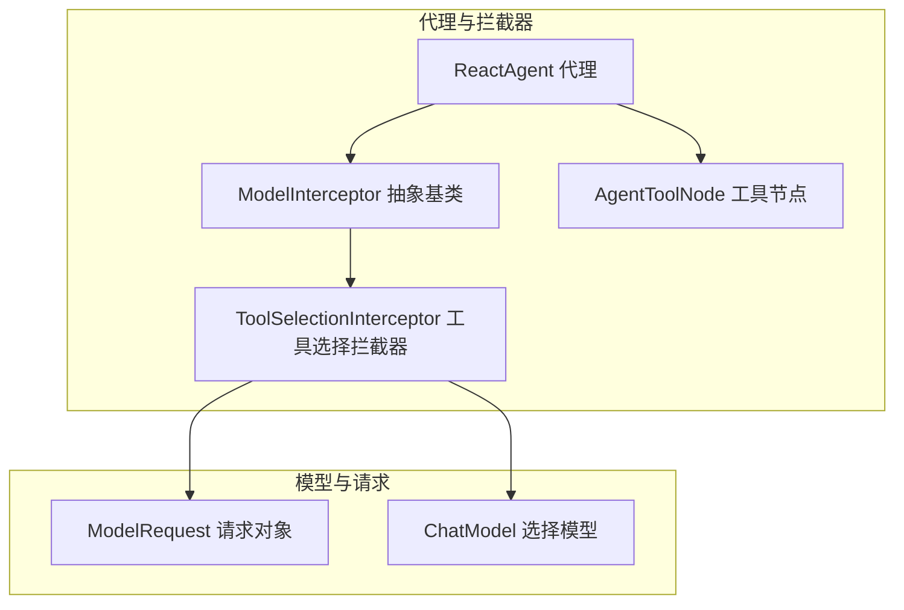
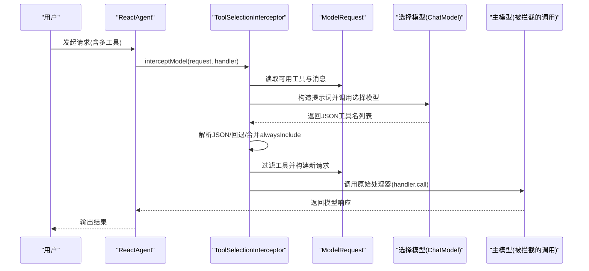
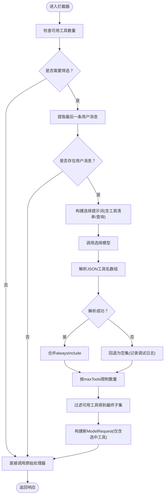
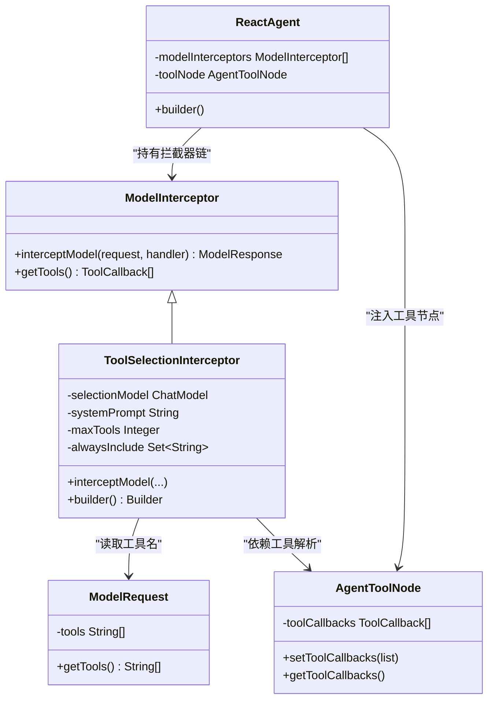
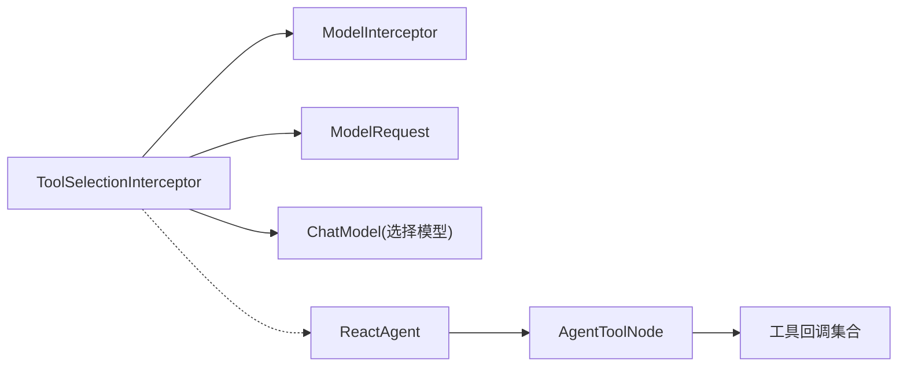

# 工具选择拦截器

<cite>
**本文引用的文件列表**
- [ToolSelectionInterceptor.java](file://spring-ai-alibaba-agent-framework/src/main/java/com/alibaba/cloud/ai/graph/agent/interceptor/toolselection/ToolSelectionInterceptor.java)
- [ModelInterceptor.java](file://spring-ai-alibaba-agent-framework/src/main/java/com/alibaba/cloud/ai/graph/agent/interceptor/ModelInterceptor.java)
- [ModelRequest.java](file://spring-ai-alibaba-agent-framework/src/main/java/com/alibaba/cloud/ai/graph/agent/interceptor/ModelRequest.java)
- [ReactAgent.java](file://spring-ai-alibaba-agent-framework/src/main/java/com/alibaba/cloud/ai/graph/agent/ReactAgent.java)
- [AgentToolNode.java](file://spring-ai-alibaba-agent-framework/src/main/java/com/alibaba/cloud/ai/graph/agent/node/AgentToolNode.java)
- [ToolSelectionTest.java](file://spring-ai-alibaba-agent-framework/src/test/java/com/alibaba/cloud/ai/graph/agent/interceptors/ToolSelectionTest.java)
- [ToolsExample.java](file://examples/documentation/src/main/java/com/alibaba/cloud/ai/examples/documentation/framework/tutorials/ToolsExample.java)
- [ToolContextConstants.java](file://spring-ai-alibaba-agent-framework/src/main/java/com/alibaba/cloud/ai/graph/agent/tools/ToolContextConstants.java)
</cite>

## 目录
1. [简介](#简介)
2. [项目结构](#项目结构)
3. [核心组件](#核心组件)
4. [架构总览](#架构总览)
5. [详细组件分析](#详细组件分析)
6. [依赖关系分析](#依赖关系分析)
7. [性能考量](#性能考量)
8. [故障排查指南](#故障排查指南)
9. [结论](#结论)
10. [附录](#附录)

## 简介
本篇文档围绕 ToolSelectionInterceptor 进行深入解析，阐述其如何基于当前上下文智能筛选最合适的工具进行调用，包括决策逻辑、评分与排序机制、容错与回退策略、配置方法与使用场景，并说明其与工具注册中心、Agent 决策流程的集成方式。目标是帮助读者在面对大量可用工具时，通过该拦截器显著提升模型推理效率与准确性，降低 token 消耗与无关工具调用开销。

## 项目结构
ToolSelectionInterceptor 位于代理框架的拦截器模块中，作为模型层拦截器参与 Agent 的推理链路；其与 ReactAgent、AgentToolNode、ModelInterceptor、ModelRequest 等组件协同工作，形成“请求预处理—工具筛选—模型调用—响应返回”的闭环。

图表来源
- [ModelInterceptor.java](file://spring-ai-alibaba-agent-framework/src/main/java/com/alibaba/cloud/ai/graph/agent/interceptor/ModelInterceptor.java#L1-L54)
- [ToolSelectionInterceptor.java](file://spring-ai-alibaba-agent-framework/src/main/java/com/alibaba/cloud/ai/graph/agent/interceptor/toolselection/ToolSelectionInterceptor.java#L40-L236)
- [ReactAgent.java](file://spring-ai-alibaba-agent-framework/src/main/java/com/alibaba/cloud/ai/graph/agent/ReactAgent.java#L138-L148)
- [AgentToolNode.java](file://spring-ai-alibaba-agent-framework/src/main/java/com/alibaba/cloud/ai/graph/agent/node/AgentToolNode.java#L57-L97)
- [ModelRequest.java](file://spring-ai-alibaba-agent-framework/src/main/java/com/alibaba/cloud/ai/graph/agent/interceptor/ModelRequest.java#L32-L87)

章节来源
- [ToolSelectionInterceptor.java](file://spring-ai-alibaba-agent-framework/src/main/java/com/alibaba/cloud/ai/graph/agent/interceptor/toolselection/ToolSelectionInterceptor.java#L40-L236)
- [ModelInterceptor.java](file://spring-ai-alibaba-agent-framework/src/main/java/com/alibaba/cloud/ai/graph/agent/interceptor/ModelInterceptor.java#L1-L54)
- [ModelRequest.java](file://spring-ai-alibaba-agent-framework/src/main/java/com/alibaba/cloud/ai/graph/agent/interceptor/ModelRequest.java#L32-L87)
- [ReactAgent.java](file://spring-ai-alibaba-agent-framework/src/main/java/com/alibaba/cloud/ai/graph/agent/ReactAgent.java#L138-L148)
- [AgentToolNode.java](file://spring-ai-alibaba-agent-framework/src/main/java/com/alibaba/cloud/ai/graph/agent/node/AgentToolNode.java#L57-L97)

## 核心组件
- ToolSelectionInterceptor：在模型调用前对可用工具进行筛选，减少无关工具进入主模型推理，从而降低 token 消耗并提高相关性。
- ModelInterceptor：拦截器抽象基类，定义统一的拦截接口与扩展点。
- ModelRequest：封装一次模型调用所需的系统消息、消息序列、工具列表等上下文。
- ReactAgent：代理执行器，负责将拦截器链注入到 LLM 节点与工具节点，协调工具注册与调用。
- AgentToolNode：工具节点，维护工具回调集合与工具拦截器，负责工具解析与执行。
- ToolSelectionTest：验证工具选择功能的单元测试，覆盖最大工具数限制、始终包含工具、相关性过滤等场景。
- ToolsExample：工具注册与使用示例，展示如何向 ReactAgent 注入工具回调，为拦截器提供工具清单。

章节来源
- [ToolSelectionInterceptor.java](file://spring-ai-alibaba-agent-framework/src/main/java/com/alibaba/cloud/ai/graph/agent/interceptor/toolselection/ToolSelectionInterceptor.java#L40-L236)
- [ModelInterceptor.java](file://spring-ai-alibaba-agent-framework/src/main/java/com/alibaba/cloud/ai/graph/agent/interceptor/ModelInterceptor.java#L1-L54)
- [ModelRequest.java](file://spring-ai-alibaba-agent-framework/src/main/java/com/alibaba/cloud/ai/graph/agent/interceptor/ModelRequest.java#L32-L87)
- [ReactAgent.java](file://spring-ai-alibaba-agent-framework/src/main/java/com/alibaba/cloud/ai/graph/agent/ReactAgent.java#L138-L148)
- [AgentToolNode.java](file://spring-ai-alibaba-agent-framework/src/main/java/com/alibaba/cloud/ai/graph/agent/node/AgentToolNode.java#L57-L97)
- [ToolSelectionTest.java](file://spring-ai-alibaba-agent-framework/src/test/java/com/alibaba/cloud/ai/graph/agent/interceptors/ToolSelectionTest.java#L70-L171)
- [ToolsExample.java](file://examples/documentation/src/main/java/com/alibaba/cloud/ai/examples/documentation/framework/tutorials/ToolsExample.java#L218-L309)

## 架构总览
ToolSelectionInterceptor 作为 ModelInterceptor 的具体实现，参与 ReactAgent 的模型调用链。其工作流程如下：
- 当请求包含多个可用工具时，拦截器优先提取最后一条用户消息作为查询语义；
- 使用独立的选择模型构建提示词，要求返回 JSON 列表（工具名数组），并可附加“最多选择 N 个工具”的约束；
- 解析 JSON 结果，若失败则回退为空集，再合并 alwaysInclude 的工具名；
- 将最终选中的工具名映射到实际工具回调集合，构造新的 ModelRequest 并继续调用链。

图表来源
- [ToolSelectionInterceptor.java](file://spring-ai-alibaba-agent-framework/src/main/java/com/alibaba/cloud/ai/graph/agent/interceptor/toolselection/ToolSelectionInterceptor.java#L81-L115)
- [ToolSelectionInterceptor.java](file://spring-ai-alibaba-agent-framework/src/main/java/com/alibaba/cloud/ai/graph/agent/interceptor/toolselection/ToolSelectionInterceptor.java#L127-L171)
- [ToolSelectionInterceptor.java](file://spring-ai-alibaba-agent-framework/src/main/java/com/alibaba/cloud/ai/graph/agent/interceptor/toolselection/ToolSelectionInterceptor.java#L172-L184)
- [ModelRequest.java](file://spring-ai-alibaba-agent-framework/src/main/java/com/alibaba/cloud/ai/graph/agent/interceptor/ModelRequest.java#L32-L87)
- [ReactAgent.java](file://spring-ai-alibaba-agent-framework/src/main/java/com/alibaba/cloud/ai/graph/agent/ReactAgent.java#L138-L148)

## 详细组件分析

### ToolSelectionInterceptor 决策与评分机制
- 输入与上下文提取
  - 从 ModelRequest 中读取可用工具名列表与消息序列；
  - 从消息序列末尾提取最近的用户消息作为查询语义，用于指导工具选择。
- 选择模型提示词设计
  - 构建工具清单与用户查询提示，明确要求返回 JSON 数组；
  - 可选地加入“按相关性排序并最多选择 N 个工具”的指令，增强排序倾向。
- 结果解析与回退
  - 优先尝试解析 JSON 中的工具名数组；
  - 若解析失败，记录调试日志并回退为空集，保证稳定性；
  - 合并 alwaysInclude 的工具名，确保关键工具不被遗漏；
  - 若超过 maxTools 限制，则截断至前 N 个工具。
- 过滤与重写请求
  - 将选中的工具名映射到实际工具回调集合（由 AgentToolNode 提供）；
  - 构造新的 ModelRequest 并交由后续处理器继续调用。

图表来源
- [ToolSelectionInterceptor.java](file://spring-ai-alibaba-agent-framework/src/main/java/com/alibaba/cloud/ai/graph/agent/interceptor/toolselection/ToolSelectionInterceptor.java#L81-L115)
- [ToolSelectionInterceptor.java](file://spring-ai-alibaba-agent-framework/src/main/java/com/alibaba/cloud/ai/graph/agent/interceptor/toolselection/ToolSelectionInterceptor.java#L127-L171)
- [ToolSelectionInterceptor.java](file://spring-ai-alibaba-agent-framework/src/main/java/com/alibaba/cloud/ai/graph/agent/interceptor/toolselection/ToolSelectionInterceptor.java#L172-L184)

章节来源
- [ToolSelectionInterceptor.java](file://spring-ai-alibaba-agent-framework/src/main/java/com/alibaba/cloud/ai/graph/agent/interceptor/toolselection/ToolSelectionInterceptor.java#L81-L184)

### 配置方法与参数说明
- selectionModel：用于工具选择的 ChatModel 实例，建议使用轻量模型以降低成本与延迟。
- systemPrompt：自定义系统提示词，可调整工具选择的目标与风格。
- maxTools：最大工具选择数量，控制模型输出规模与后续推理复杂度。
- alwaysInclude：始终包含的工具名集合，确保关键工具不会被排除。
- Builder.build：校验 selectionModel 必填，maxTools 必须大于 0。

章节来源
- [ToolSelectionInterceptor.java](file://spring-ai-alibaba-agent-framework/src/main/java/com/alibaba/cloud/ai/graph/agent/interceptor/toolselection/ToolSelectionInterceptor.java#L196-L236)

### 使用场景与最佳实践
- 场景一：工具数量较多但查询语义明确
  - 设置较小的 maxTools，结合 alwaysInclude 关键工具，提升相关性与效率。
- 场景二：查询涉及多个领域但只需少量工具
  - 通过选择模型的 JSON 输出引导排序，确保最相关工具优先。
- 场景三：稳定性优先
  - 允许解析失败回退到全量工具，避免因选择模型异常导致中断。

章节来源
- [ToolSelectionTest.java](file://spring-ai-alibaba-agent-framework/src/test/java/com/alibaba/cloud/ai/graph/agent/interceptors/ToolSelectionTest.java#L70-L171)
- [ToolSelectionTest.java](file://spring-ai-alibaba-agent-framework/src/test/java/com/alibaba/cloud/ai/graph/agent/interceptors/ToolSelectionTest.java#L173-L271)

### 与工具注册中心和 Agent 决策流程的集成
- 工具注册与可见性
  - ReactAgent 在构建时将工具回调集合注入 AgentToolNode，拦截器通过 ModelRequest 获取工具名列表；
  - ToolsExample 展示了如何通过 tools(...) 或 methodTools(...) 等方式向代理注入工具回调。
- 工具解析与执行
  - AgentToolNode 维护工具回调集合与解析器，负责将工具名解析为具体工具回调；
  - ReactAgent 在钩子与工具注入时，依据名称或类型匹配工具，确保拦截器筛选后的工具能被正确执行。
- 上下文与状态
  - ToolContextConstants 定义了工具上下文中常用的关键字，便于工具在执行时访问代理状态与配置。

图表来源
- [ModelInterceptor.java](file://spring-ai-alibaba-agent-framework/src/main/java/com/alibaba/cloud/ai/graph/agent/interceptor/ModelInterceptor.java#L1-L54)
- [ToolSelectionInterceptor.java](file://spring-ai-alibaba-agent-framework/src/main/java/com/alibaba/cloud/ai/graph/agent/interceptor/toolselection/ToolSelectionInterceptor.java#L40-L236)
- [ReactAgent.java](file://spring-ai-alibaba-agent-framework/src/main/java/com/alibaba/cloud/ai/graph/agent/ReactAgent.java#L138-L148)
- [AgentToolNode.java](file://spring-ai-alibaba-agent-framework/src/main/java/com/alibaba/cloud/ai/graph/agent/node/AgentToolNode.java#L57-L97)
- [ModelRequest.java](file://spring-ai-alibaba-agent-framework/src/main/java/com/alibaba/cloud/ai/graph/agent/interceptor/ModelRequest.java#L32-L87)

章节来源
- [ReactAgent.java](file://spring-ai-alibaba-agent-framework/src/main/java/com/alibaba/cloud/ai/graph/agent/ReactAgent.java#L138-L148)
- [AgentToolNode.java](file://spring-ai-alibaba-agent-framework/src/main/java/com/alibaba/cloud/ai/graph/agent/node/AgentToolNode.java#L57-L97)
- [ToolsExample.java](file://examples/documentation/src/main/java/com/alibaba/cloud/ai/examples/documentation/framework/tutorials/ToolsExample.java#L218-L309)
- [ToolContextConstants.java](file://spring-ai-alibaba-agent-framework/src/main/java/com/alibaba/cloud/ai/graph/agent/tools/ToolContextConstants.java#L16-L23)

## 依赖关系分析
- 组件耦合
  - ToolSelectionInterceptor 依赖 ModelInterceptor 接口与 ModelRequest 数据结构；
  - 与 ChatModel 的交互仅限于工具选择阶段，不改变主模型调用；
  - 与 AgentToolNode 的交互体现在工具名到工具回调的解析上，但拦截器本身不直接操作工具回调集合。
- 外部依赖
  - 选择模型 ChatModel：用于工具选择的推理；
  - 测试依赖 DashScopeChatModel 与工具示例（WeatherTool、TicketTool、HotelTool）。
- 潜在循环依赖
  - 拦截器与代理之间为单向依赖，无循环风险。

图表来源
- [ToolSelectionInterceptor.java](file://spring-ai-alibaba-agent-framework/src/main/java/com/alibaba/cloud/ai/graph/agent/interceptor/toolselection/ToolSelectionInterceptor.java#L40-L236)
- [ModelInterceptor.java](file://spring-ai-alibaba-agent-framework/src/main/java/com/alibaba/cloud/ai/graph/agent/interceptor/ModelInterceptor.java#L1-L54)
- [ModelRequest.java](file://spring-ai-alibaba-agent-framework/src/main/java/com/alibaba/cloud/ai/graph/agent/interceptor/ModelRequest.java#L32-L87)
- [ReactAgent.java](file://spring-ai-alibaba-agent-framework/src/main/java/com/alibaba/cloud/ai/graph/agent/ReactAgent.java#L138-L148)
- [AgentToolNode.java](file://spring-ai-alibaba-agent-framework/src/main/java/com/alibaba/cloud/ai/graph/agent/node/AgentToolNode.java#L57-L97)

章节来源
- [ToolSelectionInterceptor.java](file://spring-ai-alibaba-agent-framework/src/main/java/com/alibaba/cloud/ai/graph/agent/interceptor/toolselection/ToolSelectionInterceptor.java#L40-L236)
- [ModelInterceptor.java](file://spring-ai-alibaba-agent-framework/src/main/java/com/alibaba/cloud/ai/graph/agent/interceptor/ModelInterceptor.java#L1-L54)
- [ModelRequest.java](file://spring-ai-alibaba-agent-framework/src/main/java/com/alibaba/cloud/ai/graph/agent/interceptor/ModelRequest.java#L32-L87)
- [ReactAgent.java](file://spring-ai-alibaba-agent-framework/src/main/java/com/alibaba/cloud/ai/graph/agent/ReactAgent.java#L138-L148)
- [AgentToolNode.java](file://spring-ai-alibaba-agent-framework/src/main/java/com/alibaba/cloud/ai/graph/agent/node/AgentToolNode.java#L57-L97)

## 性能考量
- token 与成本控制
  - 通过 maxTools 限制工具数量，减少主模型的工具描述与调用开销；
  - alwaysInclude 仅在必要时保留，避免过度膨胀。
- 选择模型开销
  - 选择模型应尽量轻量，避免成为瓶颈；
  - 若选择模型不可用或失败，拦截器会回退到全量工具，保证可用性但可能增加 token 消耗。
- 选择逻辑复杂度
  - 解析 JSON 与集合操作的时间复杂度近似 O(N)，其中 N 为工具数量；
  - 建议在工具数量较大时启用 maxTools 以控制复杂度。

[本节为通用性能讨论，无需列出章节来源]

## 故障排查指南
- 现象：工具选择失败，回退到全量工具
  - 触发条件：选择模型返回非 JSON 或解析异常；
  - 处理建议：检查选择模型输出格式与网络连通性；确认提示词中包含 JSON 结构要求。
- 现象：未检测到最后一条用户消息
  - 触发条件：消息序列中无 UserMessage；
  - 处理建议：确保消息序列包含用户输入；或在上游预处理消息。
- 现象：alwaysInclude 未生效
  - 触发条件：工具名大小写或拼写不一致；
  - 处理建议：核对工具名与 alwaysInclude 的一致性。
- 现象：maxTools 未达到预期
  - 触发条件：工具数量小于等于 maxTools；
  - 处理建议：确认工具数量与 maxTools 设置；或在选择模型提示词中强调排序。

章节来源
- [ToolSelectionInterceptor.java](file://spring-ai-alibaba-agent-framework/src/main/java/com/alibaba/cloud/ai/graph/agent/interceptor/toolselection/ToolSelectionInterceptor.java#L127-L171)
- [ToolSelectionInterceptor.java](file://spring-ai-alibaba-agent-framework/src/main/java/com/alibaba/cloud/ai/graph/agent/interceptor/toolselection/ToolSelectionInterceptor.java#L172-L184)
- [ToolSelectionTest.java](file://spring-ai-alibaba-agent-framework/src/test/java/com/alibaba/cloud/ai/graph/agent/interceptors/ToolSelectionTest.java#L70-L171)

## 结论
ToolSelectionInterceptor 通过引入一个专用的选择模型，在模型调用前对工具进行智能筛选，有效降低了主模型的负担与 token 消耗，同时提升了工具调用的相关性与成功率。其设计具备良好的可配置性与容错能力，适合在工具数量较多、查询语义复杂的场景中部署。与 ReactAgent、AgentToolNode 的紧密协作，使其能够无缝融入现有代理决策流程，成为优化工具调用效率的重要环节。

[本节为总结性内容，无需列出章节来源]

## 附录
- 配置要点速查
  - selectionModel：必须提供，建议使用轻量模型；
  - systemPrompt：可选，用于调整选择目标；
  - maxTools：建议设置为中小值（如 2-5），平衡相关性与成本；
  - alwaysInclude：用于保障关键工具必达。
- 相关测试参考
  - ToolSelectionTest 覆盖了最大工具数、始终包含、相关性过滤与工具数量较少等典型场景。

章节来源
- [ToolSelectionTest.java](file://spring-ai-alibaba-agent-framework/src/test/java/com/alibaba/cloud/ai/graph/agent/interceptors/ToolSelectionTest.java#L70-L271)