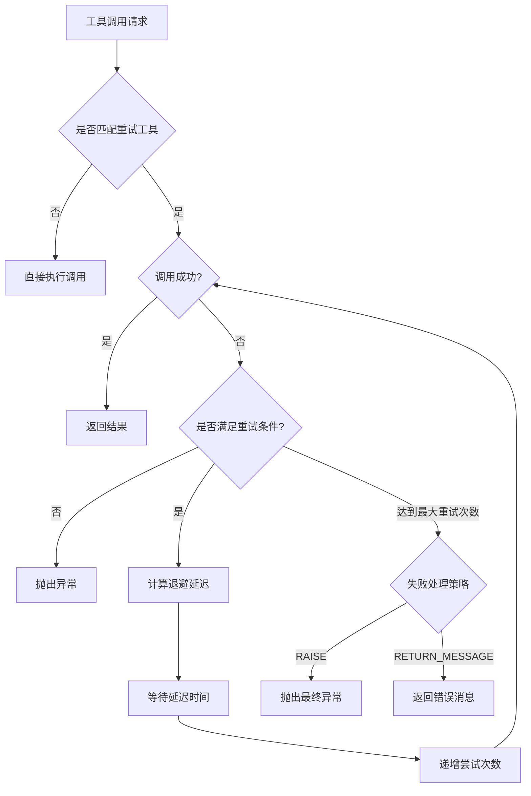
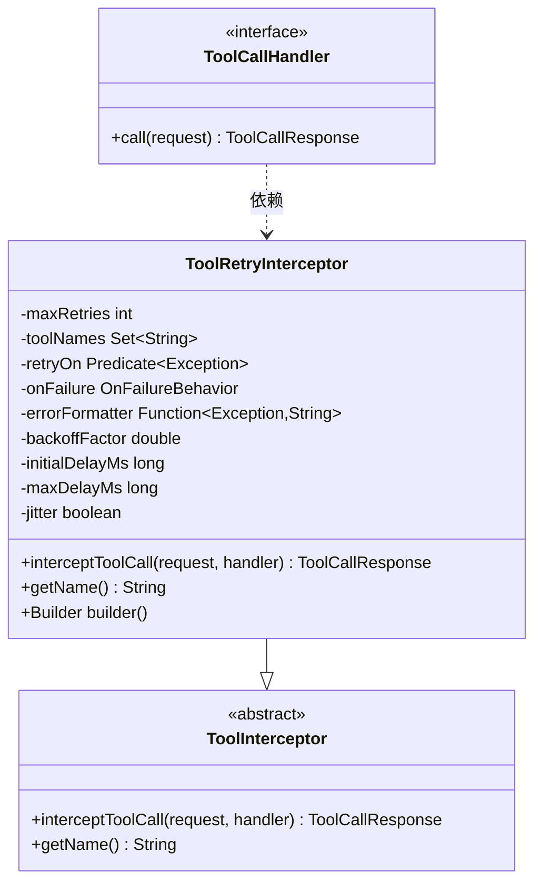
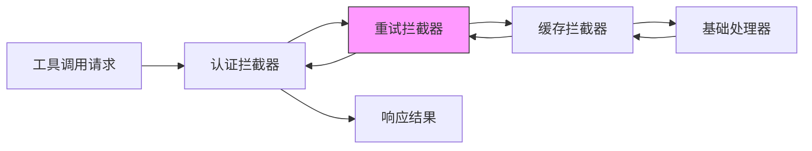
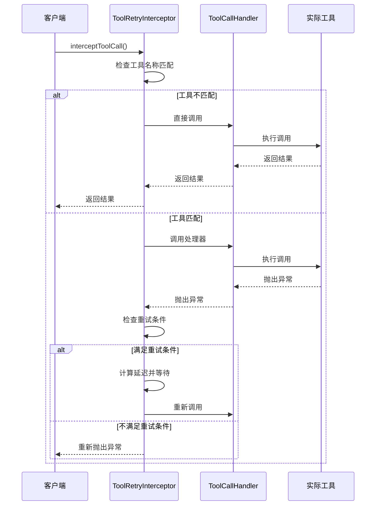
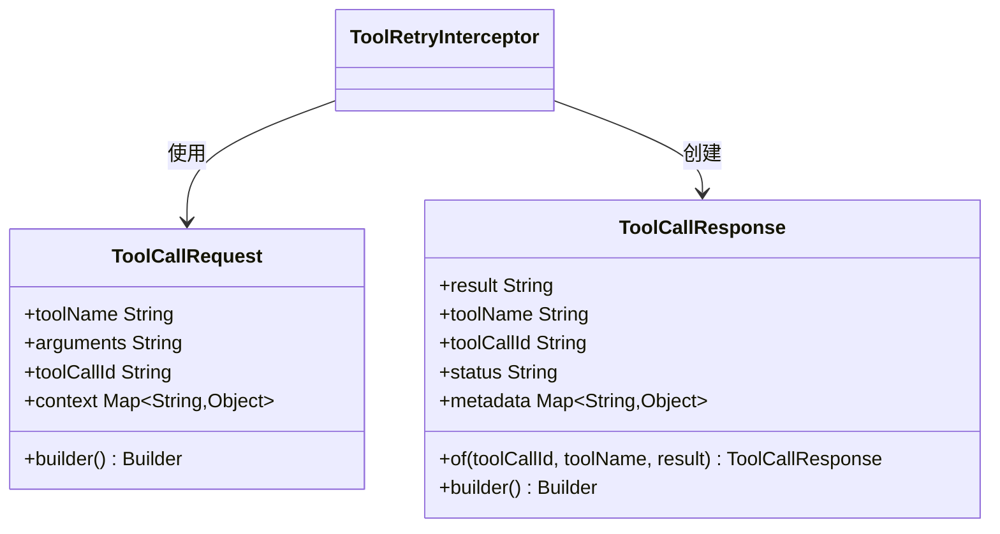
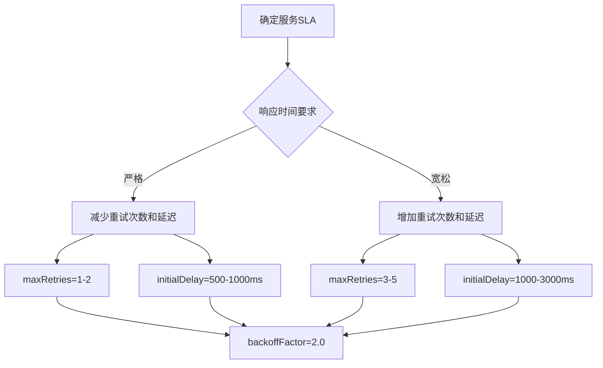
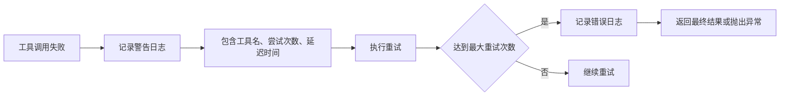

# 工具重试拦截器

<cite>
**本文档引用的文件**  
- [ToolRetryInterceptor.java](file://spring-ai-alibaba-agent-framework/src/main/java/com/alibaba/cloud/ai/graph/agent/interceptor/toolretry/ToolRetryInterceptor.java)
- [ToolRetryTest.java](file://spring-ai-alibaba-agent-framework/src/test/java/com/alibaba/cloud/ai/graph/agent/interceptors/ToolRetryTest.java)
- [ToolInterceptor.java](file://spring-ai-alibaba-agent-framework/src/main/java/com/alibaba/cloud/ai/graph/agent/interceptor/ToolInterceptor.java)
- [ToolCallRequest.java](file://spring-ai-alibaba-agent-framework/src/main/java/com/alibaba/cloud/ai/graph/agent/interceptor/ToolCallRequest.java)
- [ToolCallResponse.java](file://spring-ai-alibaba-agent-framework/src/main/java/com/alibaba/cloud/ai/graph/agent/interceptor/ToolCallResponse.java)
- [InterceptorChain.java](file://spring-ai-alibaba-agent-framework/src/main/java/com/alibaba/cloud/ai/graph/agent/interceptor/InterceptorChain.java)
</cite>

## 目录
1. [简介](#简介)
2. [核心机制](#核心机制)
3. [重试策略配置](#重试策略配置)
4. [异常处理与状态一致性](#异常处理与状态一致性)
5. [配置示例](#配置示例)
6. [最佳实践](#最佳实践)
7. [总结](#总结)

## 简介

工具重试拦截器（ToolRetryInterceptor）是Spring AI Alibaba框架中用于增强系统稳定性的关键组件。它通过自动重试失败的工具调用，有效应对网络波动、临时性服务不可用等常见问题。该拦截器采用可配置的退避算法，在保证系统可靠性的同时避免了过度重试导致的性能下降。

**拦截器工作流程概述**：


**图示来源**  
- [ToolRetryInterceptor.java](file://spring-ai-alibaba-agent-framework/src/main/java/com/alibaba/cloud/ai/graph/agent/interceptor/toolretry/ToolRetryInterceptor.java#L75-L134)

## 核心机制

### 拦截器架构

ToolRetryInterceptor继承自ToolInterceptor抽象类，实现了interceptToolCall方法。它作为工具调用链中的一环，通过装饰器模式包装实际的工具调用处理器。



**图示来源**  
- [ToolRetryInterceptor.java](file://spring-ai-alibaba-agent-framework/src/main/java/com/alibaba/cloud/ai/graph/agent/interceptor/toolretry/ToolRetryInterceptor.java#L44-L245)
- [ToolInterceptor.java](file://spring-ai-alibaba-agent-framework/src/main/java/com/alibaba/cloud/ai/graph/agent/interceptor/ToolInterceptor.java#L22-L38)

### 调用链集成

ToolRetryInterceptor与其他拦截器通过InterceptorChain进行组合，形成完整的调用链。拦截器按照注册顺序从右到左进行包装，确保执行顺序的正确性。



**图示来源**  
- [InterceptorChain.java](file://spring-ai-alibaba-agent-framework/src/main/java/com/alibaba/cloud/ai/graph/agent/interceptor/InterceptorChain.java#L72-L112)

## 重试策略配置

### 配置参数详解

| 参数 | 类型 | 默认值 | 说明 |
|------|------|--------|------|
| maxRetries | int | 2 | 最大重试次数（不包括首次调用） |
| initialDelay | long | 1000 | 初始延迟时间（毫秒） |
| backoffFactor | double | 2.0 | 退避因子，用于计算指数退避 |
| maxDelay | long | 60000 | 最大延迟时间（毫秒） |
| jitter | boolean | true | 是否启用随机抖动（±25%） |
| retryOn | Predicate~Exception~ | 所有异常 | 决定哪些异常触发重试 |
| onFailure | OnFailureBehavior | RETURN_MESSAGE | 达到最大重试次数后的处理行为 |
| toolNames | Set~String~ | null | 指定需要重试的工具名称集合 |

**表来源**  
- [ToolRetryInterceptor.java](file://spring-ai-alibaba-agent-framework/src/main/java/com/alibaba/cloud/ai/graph/agent/interceptor/toolretry/ToolRetryInterceptor.java#L48-L57)
- [Builder.java](file://spring-ai-alibaba-agent-framework/src/main/java/com/alibaba/cloud/ai/graph/agent/interceptor/toolretry/ToolRetryInterceptor.java#L160-L169)

### 退避算法实现

ToolRetryInterceptor采用指数退避算法，结合随机抖动，有效避免多个实例同时重试导致的"重试风暴"。

```mermaid
flowchart TD
Start[开始计算延迟] --> Calc[延迟 = 初始延迟 × (退避因子^重试次数)]
Calc --> Limit[延迟 = min(延迟, 最大延迟)]
Limit --> Jitter{启用抖动?}
Jitter --> |是| Random[延迟 = 延迟 × (0.75-1.25随机因子)]
Jitter --> |否| Final[使用计算延迟]
Random --> Final
Final --> Return[返回延迟时间]
```

**图示来源**  
- [ToolRetryInterceptor.java](file://spring-ai-alibaba-agent-framework/src/main/java/com/alibaba/cloud/ai/graph/agent/interceptor/toolretry/ToolRetryInterceptor.java#L136-L146)

## 异常处理与状态一致性

### 异常捕获与重试决策

ToolRetryInterceptor通过Predicate<Exception>接口灵活控制重试条件，支持基于异常类型的精确匹配。



**图示来源**  
- [ToolRetryInterceptor.java](file://spring-ai-alibaba-agent-framework/src/main/java/com/alibaba/cloud/ai/graph/agent/interceptor/toolretry/ToolRetryInterceptor.java#L75-L134)

### 状态一致性保障

通过不可变的请求对象和响应对象设计，确保在重试过程中工具调用的状态一致性。



**图示来源**  
- [ToolCallRequest.java](file://spring-ai-alibaba-agent-framework/src/main/java/com/alibaba/cloud/ai/graph/agent/interceptor/ToolCallRequest.java#L25-L106)
- [ToolCallResponse.java](file://spring-ai-alibaba-agent-framework/src/main/java/com/alibaba/cloud/ai/graph/agent/interceptor/ToolCallResponse.java#L27-L117)

## 配置示例

### 基础配置

```java
ToolRetryInterceptor interceptor = ToolRetryInterceptor.builder()
    .maxRetries(3)
    .initialDelay(1000)
    .backoffFactor(2.0)
    .build();
```

### 针对特定工具的重试

```java
ToolRetryInterceptor interceptor = ToolRetryInterceptor.builder()
    .maxRetries(2)
    .initialDelay(500)
    .toolName("network_call_tool")
    .toolName("database_query_tool")
    .build();
```

### 自定义异常过滤

```java
ToolRetryInterceptor interceptor = ToolRetryInterceptor.builder()
    .maxRetries(3)
    .initialDelay(1000)
    .retryOn(IOException.class, TimeoutException.class)
    .onFailure(ToolRetryInterceptor.OnFailureBehavior.RAISE)
    .build();
```

### 自定义错误格式化

```java
ToolRetryInterceptor interceptor = ToolRetryInterceptor.builder()
    .maxRetries(2)
    .initialDelay(1000)
    .errorFormatter(e -> "工具调用失败: " + e.getMessage() + "，请稍后重试")
    .build();
```

**代码示例来源**  
- [ToolRetryInterceptor.java](file://spring-ai-alibaba-agent-framework/src/main/java/com/alibaba/cloud/ai/graph/agent/interceptor/toolretry/ToolRetryInterceptor.java#L38-L42)
- [ToolRetryTest.java](file://spring-ai-alibaba-agent-framework/src/test/java/com/alibaba/cloud/ai/graph/agent/interceptors/ToolRetryTest.java#L80-L84)

## 最佳实践

### 重试参数调优

根据服务的SLA和业务需求合理设置重试参数：



### 避免过度重试

实施熔断机制，防止对已知故障服务的持续重试：

```java
// 结合断路器模式
CircuitBreaker circuitBreaker = CircuitBreaker.ofDefaults("tool-call");
ToolRetryInterceptor retryInterceptor = ToolRetryInterceptor.builder()
    .maxRetries(2)
    .retryOn(e -> circuitBreaker.getState() == State.CLOSED)
    .build();
```

### 监控与日志

充分利用拦截器内置的日志功能进行问题排查：



**日志来源**  
- [ToolRetryInterceptor.java](file://spring-ai-alibaba-agent-framework/src/main/java/com/alibaba/cloud/ai/graph/agent/interceptor/toolretry/ToolRetryInterceptor.java#L106-L107)
- [logback-test.xml](file://spring-ai-alibaba-agent-framework/src/test/resources/logback-test.xml#L9-L10)

## 总结

ToolRetryInterceptor通过灵活的配置选项和稳健的实现机制，为AI代理系统提供了可靠的工具调用重试能力。其主要优势包括：

1. **可配置性强**：支持多种重试策略参数的精细调整
2. **选择性重试**：可针对特定工具进行重试配置
3. **智能退避**：采用指数退避加随机抖动，避免重试风暴
4. **异常过滤**：支持基于异常类型的精确重试控制
5. **状态安全**：通过不可变对象设计保障状态一致性

在实际应用中，建议根据具体业务场景和性能要求，合理配置重试参数，并结合监控系统及时发现和解决潜在问题。

**本节来源**  
- [ToolRetryInterceptor.java](file://spring-ai-alibaba-agent-framework/src/main/java/com/alibaba/cloud/ai/graph/agent/interceptor/toolretry/ToolRetryInterceptor.java)
- [ToolRetryTest.java](file://spring-ai-alibaba-agent-framework/src/test/java/com/alibaba/cloud/ai/graph/agent/interceptors/ToolRetryTest.java)