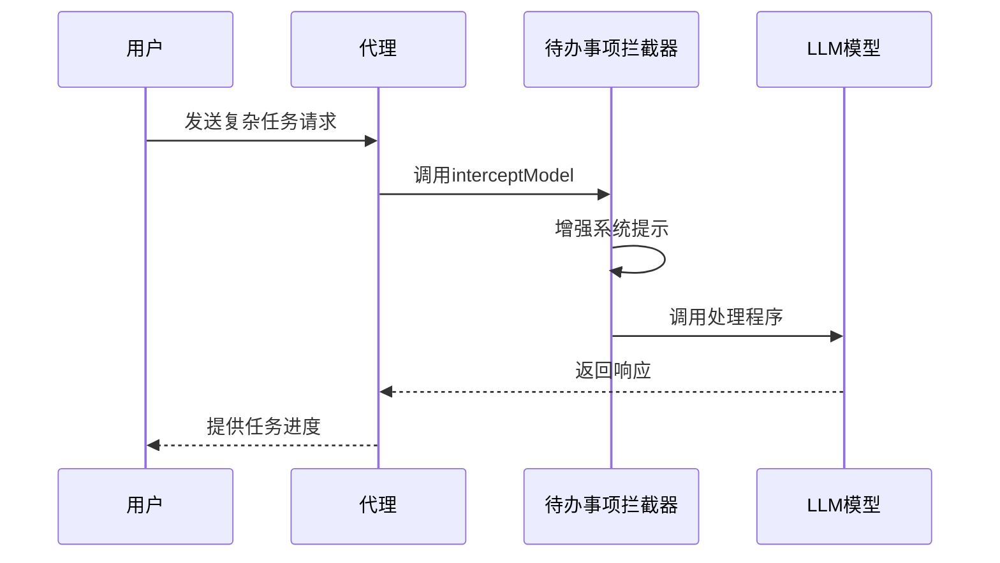
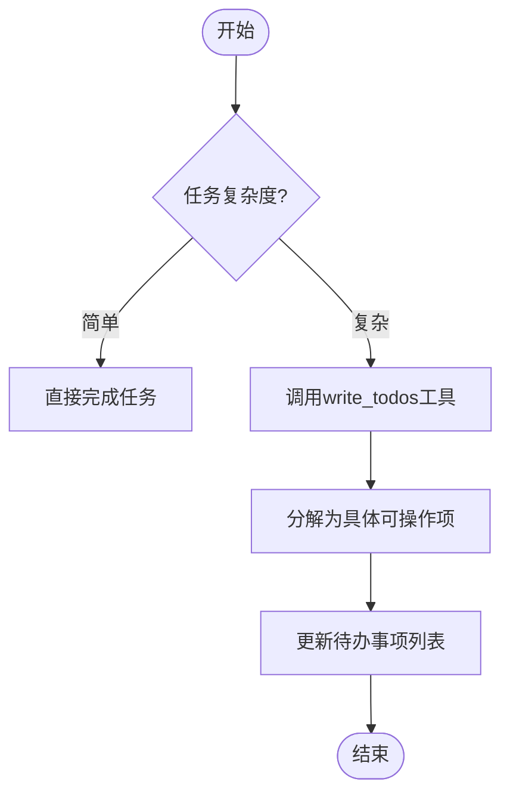
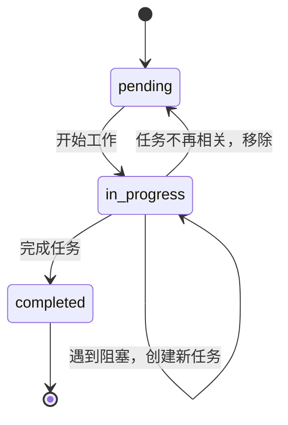
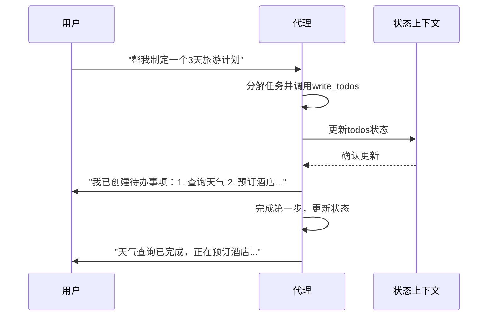
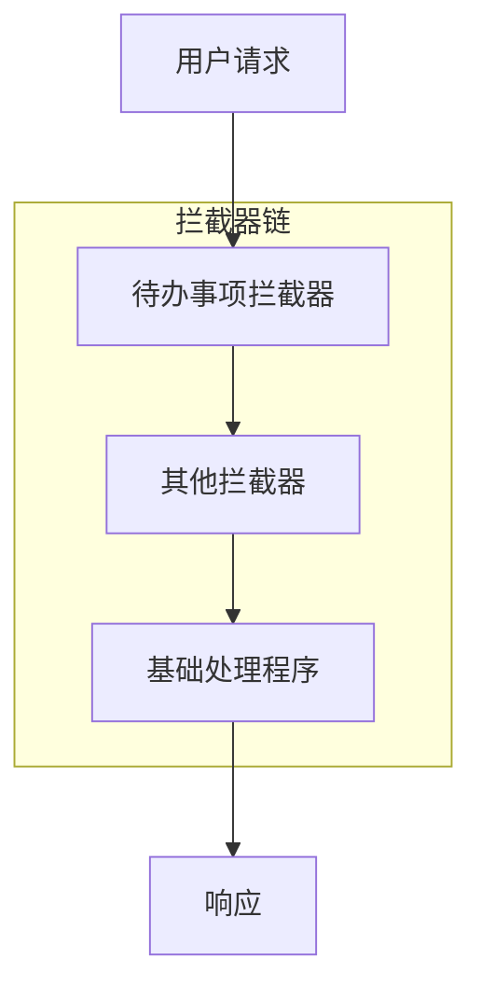
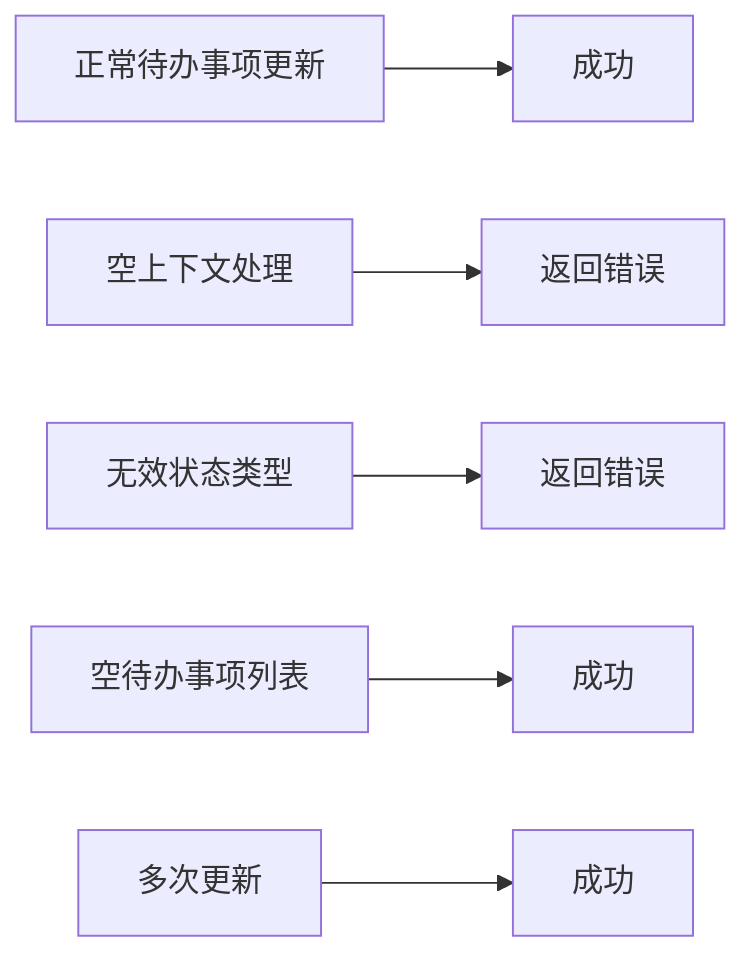

# 待办事项拦截器

<cite>
**本文档中引用的文件**  
- [TodoListInterceptor.java](file://spring-ai-alibaba-agent-framework/src/main/java/com/alibaba/cloud/ai/graph/agent/interceptor/todolist/TodoListInterceptor.java)
- [WriteTodosTool.java](file://spring-ai-alibaba-agent-framework/src/main/java/com/alibaba/cloud/ai/graph/agent/tools/WriteTodosTool.java)
- [ToolContextConstants.java](file://spring-ai-alibaba-agent-framework/src/main/java/com/alibaba/cloud/ai/graph/agent/tools/ToolContextConstants.java)
- [ReactAgent.java](file://spring-ai-alibaba-agent-framework/src/main/java/com/alibaba/cloud/ai/graph/agent/ReactAgent.java)
- [AgentLlmNode.java](file://spring-ai-alibaba-agent-framework/src/main/java/com/alibaba/cloud/ai/graph/agent/node/AgentLlmNode.java)
- [ModelInterceptor.java](file://spring-ai-alibaba-agent-framework/src/main/java/com/alibaba/cloud/ai/graph/agent/interceptor/ModelInterceptor.java)
- [InterceptorChain.java](file://spring-ai-alibaba-agent-framework/src/main/java/com/alibaba/cloud/ai/graph/agent/interceptor/InterceptorChain.java)
- [TodolistTest.java](file://spring-ai-alibaba-agent-framework/src/test/java/com/alibaba/cloud/ai/graph/agent/interceptors/TodolistTest.java)
- [WriteTodosToolTest.java](file://spring-ai-alibaba-agent-framework/src/test/java/com/alibaba/cloud/ai/graph/agent/tools/WriteTodosToolTest.java)
</cite>

## 目录
1. [简介](#简介)
2. [核心机制](#核心机制)
3. [任务提取与分类](#任务提取与分类)
4. [优先级排序与状态管理](#优先级排序与状态管理)
5. [对话流程整合](#对话流程整合)
6. [配置与定制](#配置与定制)
7. [与其他组件协同](#与其他组件协同)
8. [实际应用示例](#实际应用示例)
9. [测试验证](#测试验证)
10. [结论](#结论)

## 简介

待办事项拦截器（TodoListInterceptor）是Spring AI Alibaba代理框架中的一个关键组件，旨在为智能代理提供强大的任务管理能力。该拦截器通过增强系统提示和提供专用工具，帮助代理在处理复杂多步骤任务时能够有效地跟踪进度、组织工作并为用户提供清晰的任务完成视图。其核心功能包括自动生成待办事项列表、实时更新任务状态以及在对话流程中无缝整合任务进度信息。

**待办事项拦截器**通过注入系统级指导，引导代理在适当情况下使用`write_todos`工具来管理复杂目标。它特别适用于需要分解为多个小步骤的复杂任务，确保代理能够有条不紊地推进工作，并让用户清楚地了解当前的处理状态。

## 核心机制

待办事项拦截器的核心机制基于拦截器模式，通过在模型调用前增强系统提示来实现其功能。当代理接收到一个请求时，拦截器会检查是否存在现有的系统消息。如果不存在，它将创建一个新的系统消息；如果存在，则将自定义的待办事项指导追加到现有消息之后。这种机制确保了代理始终能够接收到关于如何使用待办事项功能的最新指导。



**拦截器来源**  
- [TodoListInterceptor.java](file://spring-ai-alibaba-agent-framework/src/main/java/com/alibaba/cloud/ai/graph/agent/interceptor/todolist/TodoListInterceptor.java#L101-L118)

## 任务提取与分类

待办事项拦截器通过`WriteTodosTool`工具实现任务的提取与分类。该工具允许代理创建、更新和跟踪任务列表。任务的提取主要依赖于代理对用户请求的理解能力，当识别到复杂多步骤任务时，代理会主动调用`write_todos`工具来创建待办事项。

任务分类遵循明确的指导原则：
- **复杂多步骤任务**：当任务需要3个或更多不同的步骤或操作时
- **非平凡复杂任务**：需要仔细规划或多个操作的任务
- **用户明确请求**：当用户直接要求使用待办事项列表时
- **用户提供多个任务**：当用户给出一个待办事项列表（编号或逗号分隔）
- **计划可能需要修订**：根据前几步的结果可能需要调整后续计划



**任务提取来源**  
- [WriteTodosTool.java](file://spring-ai-alibaba-agent-framework/src/main/java/com/alibaba/cloud/ai/graph/agent/tools/WriteTodosTool.java#L43-L57)

## 优先级排序与状态管理

待办事项拦截器通过定义明确的任务状态来实现优先级排序和状态管理。任务状态包括三种：`pending`（待处理）、`in_progress`（进行中）和`completed`（已完成）。这种状态机模型确保了任务进度的准确跟踪。

优先级排序主要通过以下机制实现：
1. **实时状态更新**：代理在开始工作前立即将任务标记为`in_progress`
2. **即时完成标记**：任务完成后立即标记为`completed`，不进行批量处理
3. **动态调整**：允许在执行过程中根据新信息修订待办事项列表，添加新任务或删除不再相关的任务



**状态管理来源**  
- [TodoListInterceptor.java](file://spring-ai-alibaba-agent-framework/src/main/java/com/alibaba/cloud/ai/graph/agent/interceptor/todolist/TodoListInterceptor.java#L124-L163)
- [WriteTodosTool.java](file://spring-ai-alibaba-agent-framework/src/main/java/com/alibaba/cloud/ai/graph/agent/tools/WriteTodosTool.java#L67-L79)

## 对话流程整合

待办事项拦截器通过将任务状态无缝整合到对话流程中，为用户提供清晰的任务进度视图。当代理调用`write_todos`工具时，更新后的待办事项列表会被存储在代理的状态上下文中，具体通过`AGENT_STATE_FOR_UPDATE_CONTEXT_KEY`键进行管理。

这种整合机制确保了：
- 用户可以随时了解当前任务的进展情况
- 代理能够基于最新的任务状态做出决策
- 在多轮对话中保持任务上下文的一致性



**对话整合来源**  
- [WriteTodosTool.java](file://spring-ai-alibaba-agent-framework/src/main/java/com/alibaba/cloud/ai/graph/agent/tools/WriteTodosTool.java#L104-L128)
- [ToolContextConstants.java](file://spring-ai-alibaba-agent-framework/src/main/java/com/alibaba/cloud/ai/graph/agent/tools/ToolContextConstants.java#L20)

## 配置与定制

待办事项拦截器提供了灵活的配置选项，允许开发者根据具体需求进行定制。主要通过`Builder`模式提供两个关键的配置方法：

1. **systemPrompt**：允许设置自定义的系统提示，指导代理如何使用待办事项功能
2. **toolDescription**：允许设置`write_todos`工具的自定义描述

这种设计使得开发者可以根据应用场景调整代理的行为模式，例如在需要更严格任务管理的场景中提供更详细的指导。

```java
TodoListInterceptor interceptor = TodoListInterceptor.builder()
    .systemPrompt("自定义的待办事项使用指导...")
    .toolDescription("自定义的工具描述...")
    .build();
```

**配置来源**  
- [TodoListInterceptor.java](file://spring-ai-alibaba-agent-framework/src/main/java/com/alibaba/cloud/ai/graph/agent/interceptor/todolist/TodoListInterceptor.java#L202-L224)

## 与其他组件协同

待办事项拦截器通过拦截器链机制与其他任务管理组件协同工作。在`ReactAgent`中，拦截器被集成到`AgentLlmNode`和`AgentToolNode`中，形成一个完整的处理管道。`InterceptorChain`类负责将多个拦截器组合成一个处理链，确保它们能够按正确的顺序执行。

这种协同工作模式的优势包括：
- **模块化设计**：每个拦截器专注于单一职责
- **可扩展性**：可以轻松添加新的拦截器而不影响现有功能
- **灵活性**：拦截器的执行顺序可以通过配置进行调整



**协同工作来源**  
- [ReactAgent.java](file://spring-ai-alibaba-agent-framework/src/main/java/com/alibaba/cloud/ai/graph/agent/ReactAgent.java#L138-L144)
- [InterceptorChain.java](file://spring-ai-alibaba-agent-framework/src/main/java/com/alibaba/cloud/ai/graph/agent/interceptor/InterceptorChain.java#L26-L60)

## 实际应用示例

以下是一个实际应用示例，展示了如何配置和使用待办事项拦截器来处理复杂的旅游计划请求：

```java
// 创建待办事项拦截器
TodoListInterceptor todoListInterceptor = TodoListInterceptor.builder().build();

// 创建其他工具
ToolCallback weatherTool = WeatherTool.createWeatherTool("weather_tool", new WeatherTool());
ToolCallback ticketTool = TicketTool.createTicketToolCallback("ticket_booking_tool", new TicketTool());
ToolCallback hotelTool = HotelTool.createHotelTool("hotel_booking_tool", new HotelTool());

// 构建代理
ReactAgent agent = ReactAgent.builder()
    .name("single_agent")
    .model(chatModel)
    .interceptors(todoListInterceptor)
    .tools(weatherTool, ticketTool, hotelTool)
    .saver(new MemorySaver())
    .build();

// 调用代理处理复杂任务
agent.invoke("帮我制定一个12月30日开始去北京的3天旅游计划，并完成车票和酒店预订。");
```

在这个示例中，代理会自动将任务分解为多个步骤，如查询天气、预订车票、预订酒店等，并通过`write_todos`工具跟踪每个步骤的进度。

**应用示例来源**  
- [TodolistTest.java](file://spring-ai-alibaba-agent-framework/src/test/java/com/alibaba/cloud/ai/graph/agent/interceptors/TodolistTest.java#L71-L103)

## 测试验证

待办事项拦截器的功能通过一系列单元测试进行了验证。`WriteTodosToolTest`类包含了多个测试用例，验证了工具在各种场景下的行为：

- **正常待办事项更新**：验证工具能够正确更新待办事项列表
- **空上下文处理**：验证在工具上下文为空时的错误处理
- **无效状态类型**：验证对无效状态类型的处理
- **空待办事项列表**：验证空列表的处理
- **多次更新**：验证连续多次更新的正确性

这些测试确保了待办事项拦截器在各种边界条件下的稳定性和可靠性。



**测试来源**  
- [WriteTodosToolTest.java](file://spring-ai-alibaba-agent-framework/src/test/java/com/alibaba/cloud/ai/graph/agent/tools/WriteTodosToolTest.java#L39-L149)

## 结论

待办事项拦截器是一个功能强大且设计精巧的组件，它通过系统提示增强和专用工具的结合，为智能代理提供了有效的任务管理能力。其核心优势在于能够自动识别复杂任务、合理分解工作步骤、实时跟踪任务进度，并将这些信息无缝整合到对话流程中。

该拦截器的设计体现了模块化、可扩展和用户友好的原则，不仅提高了代理处理复杂任务的能力，也为用户提供了透明和可预测的交互体验。通过灵活的配置选项和与其他组件的良好协同，待办事项拦截器能够适应各种应用场景，是构建高效智能代理系统的重要组成部分。