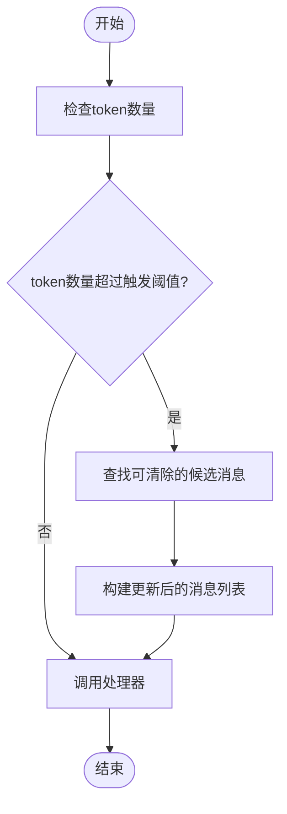
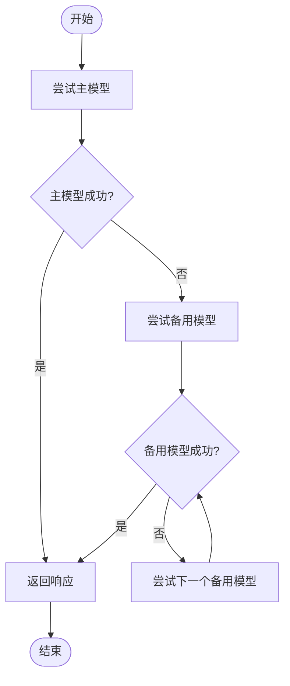
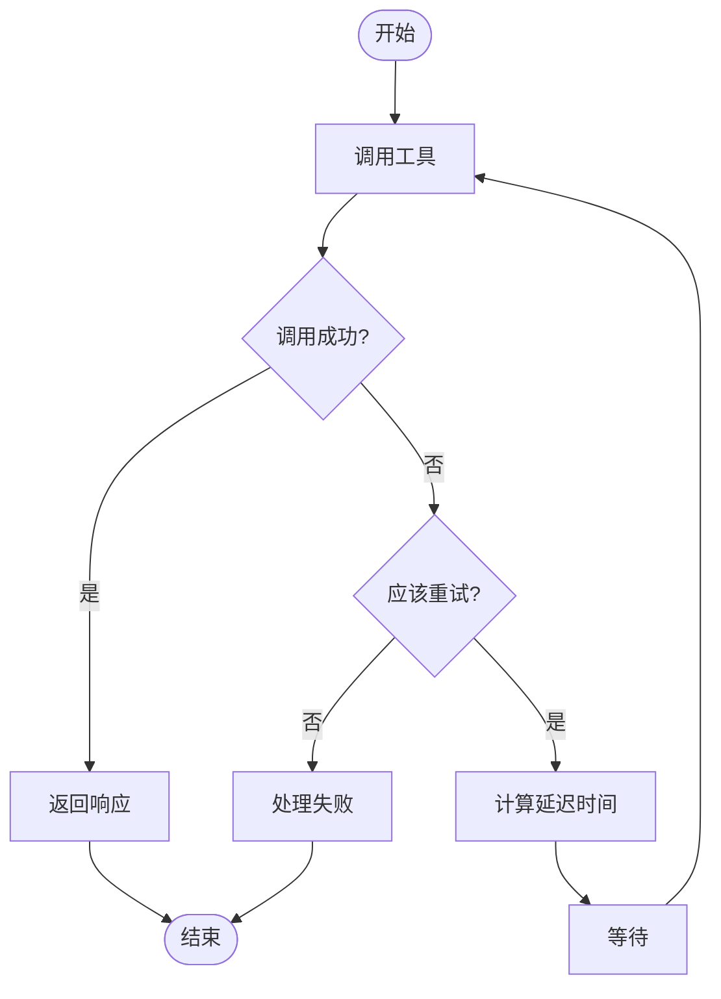
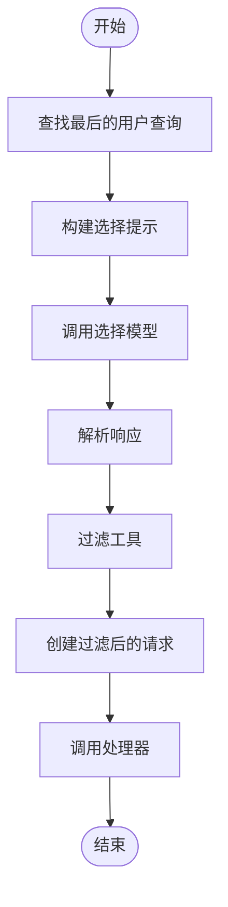
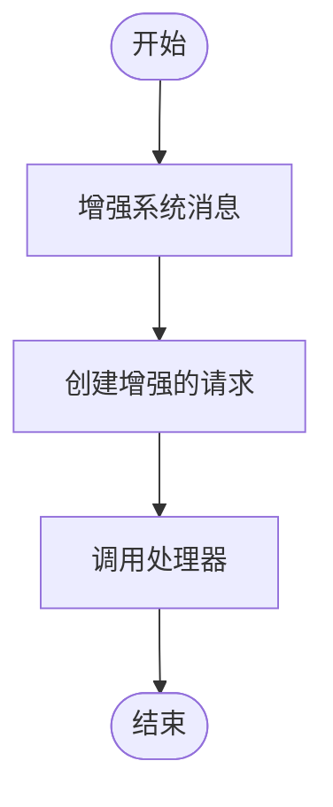
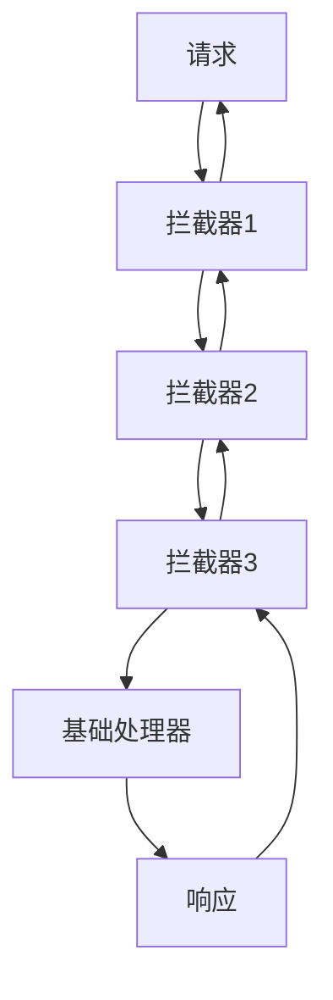

# 拦截器系统

<cite>
**本文档中引用的文件**
- [Interceptor.java](file://spring-ai-alibaba-agent-framework/src/main/java/com/alibaba/cloud/ai/graph/agent/interceptor/Interceptor.java)
- [ModelInterceptor.java](file://spring-ai-alibaba-agent-framework/src/main/java/com/alibaba/cloud/ai/graph/agent/interceptor/ModelInterceptor.java)
- [ToolInterceptor.java](file://spring-ai-alibaba-agent-framework/src/main/java/com/alibaba/cloud/ai/graph/agent/interceptor/ToolInterceptor.java)
- [InterceptorChain.java](file://spring-ai-alibaba-agent-framework/src/main/java/com/alibaba/cloud/ai/graph/agent/interceptor/InterceptorChain.java)
- [ModelCallHandler.java](file://spring-ai-alibaba-agent-framework/src/main/java/com/alibaba/cloud/ai/graph/agent/interceptor/ModelCallHandler.java)
- [ToolCallHandler.java](file://spring-ai-alibaba-agent-framework/src/main/java/com/alibaba/cloud/ai/graph/agent/interceptor/ToolCallHandler.java)
- [ContextEditingInterceptor.java](file://spring-ai-alibaba-agent-framework/src/main/java/com/alibaba/cloud/ai/graph/agent/interceptor/contextediting/ContextEditingInterceptor.java)
- [ModelFallbackInterceptor.java](file://spring-ai-alibaba-agent-framework/src/main/java/com/alibaba/cloud/ai/graph/agent/interceptor/modelfallback/ModelFallbackInterceptor.java)
- [ToolRetryInterceptor.java](file://spring-ai-alibaba-agent-framework/src/main/java/com/alibaba/cloud/ai/graph/agent/interceptor/toolretry/ToolRetryInterceptor.java)
- [ToolSelectionInterceptor.java](file://spring-ai-alibaba-agent-framework/src/main/java/com/alibaba/cloud/ai/graph/agent/interceptor/toolselection/ToolSelectionInterceptor.java)
- [TodoListInterceptor.java](file://spring-ai-alibaba-agent-framework/src/main/java/com/alibaba/cloud/ai/graph/agent/interceptor/todolist/TodoListInterceptor.java)
</cite>

## 目录
1. [引言](#引言)
2. [拦截器与钩子的区别](#拦截器与钩子的区别)
3. [核心接口定义](#核心接口定义)
4. [内置拦截器实现原理](#内置拦截器实现原理)
5. [拦截器链](#拦截器链)
6. [自定义和注册拦截器指南](#自定义和注册拦截器指南)
7. [结论](#结论)

## 引言

拦截器系统是Spring AI Alibaba框架中的关键组件，用于在模型请求/响应和工具调用请求/响应过程中进行内容修改和行为增强。拦截器提供了一种灵活的机制，允许开发者在不修改核心逻辑的情况下，对AI代理的行为进行扩展和定制。通过拦截器，可以实现上下文编辑、模型故障转移、工具调用重试、工具选择和待办事项生成等功能，从而提高AI系统的鲁棒性和智能化水平。

**拦截器与钩子的区别**
- **拦截器（Interceptor）**：更侧重于修改模型请求/响应和工具调用请求/响应的内容，可以改变数据流和执行流程。
- **钩子（Hook）**：主要用于在特定执行点插入额外的逻辑，如日志记录、监控等，通常不修改核心数据流。

## 拦截器与钩子的区别

在Spring AI Alibaba框架中，拦截器和钩子虽然都用于扩展AI代理的功能，但它们在设计目的和使用场景上存在显著差异。

**拦截器（Interceptor）**的主要特点是：
- **内容修改**：能够直接修改模型请求/响应和工具调用请求/响应的内容。
- **流程控制**：可以改变执行流程，如实现重试、故障转移等。
- **数据转换**：能够在数据流中进行转换和处理，如上下文编辑、工具选择等。

**钩子（Hook）**的主要特点是：
- **行为扩展**：主要用于在特定执行点插入额外的逻辑，如日志记录、监控、权限检查等。
- **非侵入性**：通常不修改核心数据流，而是作为旁路处理。
- **事件驱动**：基于特定事件触发，如模型调用前、工具调用后等。

这种区别使得拦截器更适合需要深度干预和修改AI代理行为的场景，而钩子则更适合需要轻量级扩展和监控的场景。

## 核心接口定义

### Interceptor接口

`Interceptor`接口是所有拦截器的基础接口，定义了拦截器的基本行为。它包含一个`getName()`方法，用于获取拦截器的名称。

```java
public interface Interceptor {
    String getName();
}
```

### ModelInterceptor接口

`ModelInterceptor`抽象类是模型拦截器的基础，继承自`Interceptor`接口。它定义了`interceptModel`方法，用于包装模型调用，允许实现者修改请求、响应或添加额外行为（如重试、故障转移等）。

```java
public abstract class ModelInterceptor implements Interceptor {
    public abstract ModelResponse interceptModel(ModelRequest request, ModelCallHandler handler);
    
    public List<ToolCallback> getTools() {
        return Collections.emptyList();
    }
}
```

### ToolInterceptor接口

`ToolInterceptor`抽象类是工具拦截器的基础，继承自`Interceptor`接口。它定义了`interceptToolCall`方法，用于包装工具调用，允许实现者修改请求、响应或添加额外行为（如重试、缓存、日志记录等）。

```java
public abstract class ToolInterceptor implements Interceptor {
    public abstract ToolCallResponse interceptToolCall(ToolCallRequest request, ToolCallHandler handler);
}
```

### Handler接口

`ModelCallHandler`和`ToolCallHandler`接口分别定义了模型调用和工具调用的处理逻辑，作为拦截器链中的基本处理单元。

```java
@FunctionalInterface
public interface ModelCallHandler {
    ModelResponse call(ModelRequest request);
}

@FunctionalInterface
public interface ToolCallHandler {
    ToolCallResponse call(ToolCallRequest request);
}
```

**核心接口定义来源**
- [Interceptor.java](file://spring-ai-alibaba-agent-framework/src/main/java/com/alibaba/cloud/ai/graph/agent/interceptor/Interceptor.java)
- [ModelInterceptor.java](file://spring-ai-alibaba-agent-framework/src/main/java/com/alibaba/cloud/ai/graph/agent/interceptor/ModelInterceptor.java)
- [ToolInterceptor.java](file://spring-ai-alibaba-agent-framework/src/main/java/com/alibaba/cloud/ai/graph/agent/interceptor/ToolInterceptor.java)
- [ModelCallHandler.java](file://spring-ai-alibaba-agent-framework/src/main/java/com/alibaba/cloud/ai/graph/agent/interceptor/ModelCallHandler.java)
- [ToolCallHandler.java](file://spring-ai-alibaba-agent-framework/src/main/java/com/alibaba/cloud/ai/graph/agent/interceptor/ToolCallHandler.java)

## 内置拦截器实现原理

### ContextEditingInterceptor

`ContextEditingInterceptor`用于在调用前编辑上下文，当对话的token数量超过预设阈值时，自动清除较旧的工具结果，以保持在token限制内。它通过`tokenCounter`计算当前消息的token数量，如果超过`trigger`阈值，则根据`keep`参数保留最近的几条消息，清除其余的工具结果。



**拦截器实现来源**
- [ContextEditingInterceptor.java](file://spring-ai-alibaba-agent-framework/src/main/java/com/alibaba/cloud/ai/graph/agent/interceptor/contextediting/ContextEditingInterceptor.java)

### ModelFallbackInterceptor

`ModelFallbackInterceptor`在主模型失败时切换到备用模型。它首先尝试使用主模型进行调用，如果失败，则按顺序尝试备用模型列表中的每个模型，直到成功或所有模型都失败。



**拦截器实现来源**
- [ModelFallbackInterceptor.java](file://spring-ai-alibaba-agent-framework/src/main/java/com/alibaba/cloud/ai/graph/agent/interceptor/modelfallback/ModelFallbackInterceptor.java)

### ToolRetryInterceptor

`ToolRetryInterceptor`实现工具调用的自动重试。它在工具调用失败时，根据配置的重试策略（最大重试次数、退避因子、初始延迟等）进行重试，直到成功或达到最大重试次数。



**拦截器实现来源**
- [ToolRetryInterceptor.java](file://spring-ai-alibaba-agent-framework/src/main/java/com/alibaba/cloud/ai/graph/agent/interceptor/toolretry/ToolRetryInterceptor.java)

### ToolSelectionInterceptor

`ToolSelectionInterceptor`根据上下文选择合适的工具。它使用一个专门的LLM模型来分析用户查询和可用工具，选择最相关的工具子集，从而减少token使用并帮助主模型聚焦于正确的工具。



**拦截器实现来源**
- [ToolSelectionInterceptor.java](file://spring-ai-alibaba-agent-framework/src/main/java/com/alibaba/cloud/ai/graph/agent/interceptor/toolselection/ToolSelectionInterceptor.java)

### TodoListInterceptor

`TodoListInterceptor`生成待办事项，帮助AI代理管理复杂的多步骤任务。它通过注入系统提示来指导代理如何使用待办事项功能，将复杂任务分解为可管理的步骤，并跟踪任务进度。



**拦截器实现来源**
- [TodoListInterceptor.java](file://spring-ai-alibaba-agent-framework/src/main/java/com/alibaba/cloud/ai/graph/agent/interceptor/todolist/TodoListInterceptor.java)

## 拦截器链

`InterceptorChain`类负责将多个拦截器串联起来，实现责任链模式。它提供了`chainModelInterceptors`和`chainToolInterceptors`两个静态方法，分别用于链接模型拦截器和工具拦截器。

```java
public class InterceptorChain {
    public static ModelCallHandler chainModelInterceptors(
            List<ModelInterceptor> interceptors,
            ModelCallHandler baseHandler) {
        // 实现模型拦截器链
    }

    public static ToolCallHandler chainToolInterceptors(
            List<ToolInterceptor> interceptors,
            ToolCallHandler baseHandler) {
        // 实现工具拦截器链
    }
}
```

拦截器链的工作原理是：从最后一个拦截器开始，逐个包装前一个拦截器，形成一个嵌套的调用结构。第一个拦截器成为最外层的包装器，最后一个拦截器直接调用基础处理器。这种设计确保了拦截器的执行顺序与注册顺序一致。



**拦截器链来源**
- [InterceptorChain.java](file://spring-ai-alibaba-agent-framework/src/main/java/com/alibaba/cloud/ai/graph/agent/interceptor/InterceptorChain.java)

## 自定义和注册拦截器指南

要创建自定义拦截器，需要继承`ModelInterceptor`或`ToolInterceptor`抽象类，并实现相应的`interceptModel`或`interceptToolCall`方法。以下是一个简单的自定义模型拦截器示例：

```java
public class CustomModelInterceptor extends ModelInterceptor {
    @Override
    public ModelResponse interceptModel(ModelRequest request, ModelCallHandler handler) {
        // 在调用前修改请求
        ModelRequest modifiedRequest = modifyRequest(request);
        
        // 调用处理器
        ModelResponse response = handler.call(modifiedRequest);
        
        // 在调用后修改响应
        return modifyResponse(response);
    }
    
    private ModelRequest modifyRequest(ModelRequest request) {
        // 实现请求修改逻辑
        return request;
    }
    
    private ModelResponse modifyResponse(ModelResponse response) {
        // 实现响应修改逻辑
        return response;
    }
    
    @Override
    public String getName() {
        return "CustomModel";
    }
}
```

要注册拦截器，可以在创建AI代理时通过`interceptors`方法添加：

```java
ReactAgent agent = ReactAgent.builder()
    .name("my_agent")
    .model(chatModel)
    .interceptors(new CustomModelInterceptor(), new ToolRetryInterceptor())
    .build();
```

通过这种方式，可以灵活地组合多个拦截器，实现复杂的AI代理行为。

## 结论

拦截器系统为Spring AI Alibaba框架提供了强大的扩展能力，使得开发者能够轻松地定制和增强AI代理的行为。通过理解`ModelInterceptor`和`ToolInterceptor`的接口定义，以及各个内置拦截器的实现原理，开发者可以创建出更加智能和鲁棒的AI应用。拦截器链的设计模式使得多个拦截器可以无缝协作，为AI系统的开发提供了极大的灵活性和可维护性。