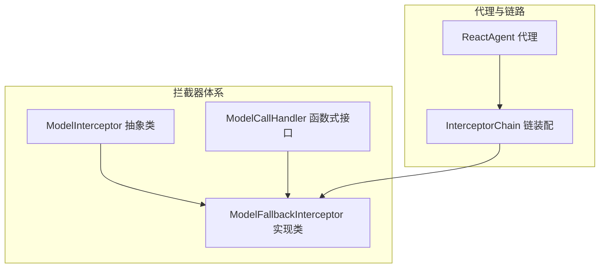
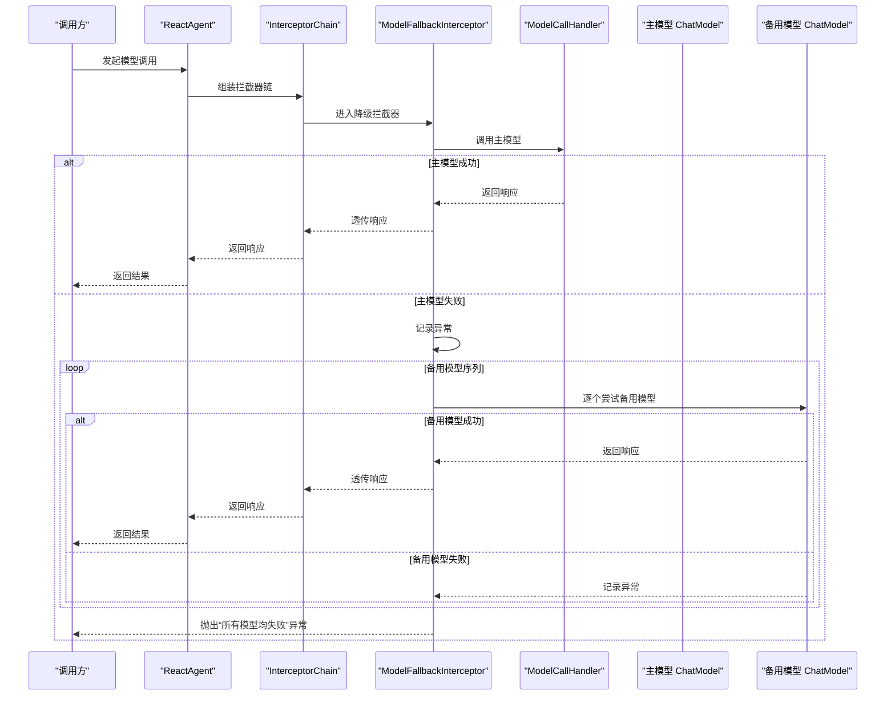
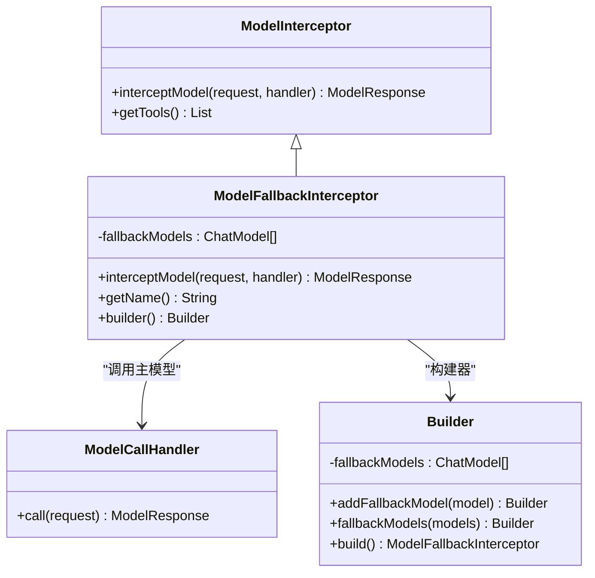
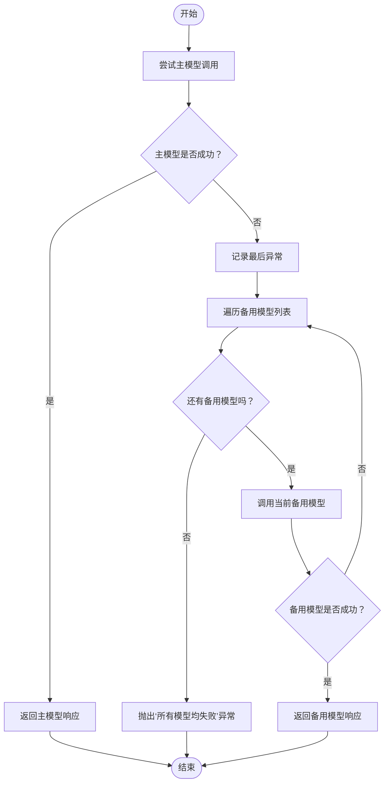
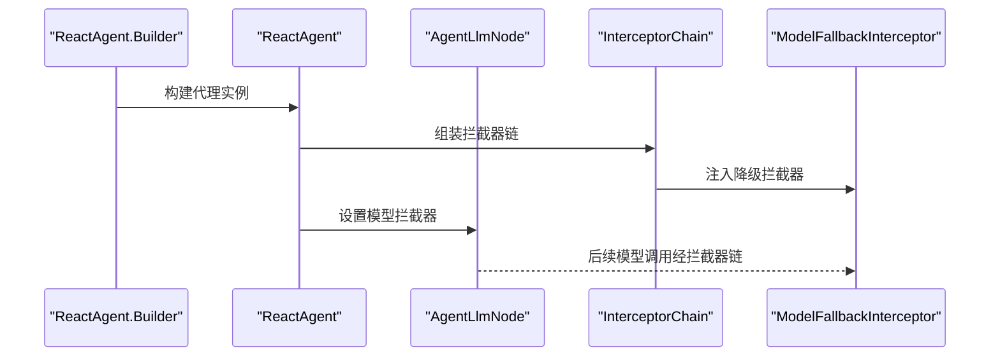
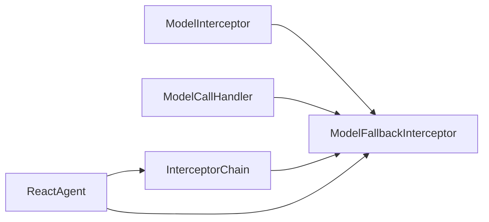

# 模型降级拦截器

<cite>
**本文引用的文件**
- [ModelFallbackInterceptor.java](file://spring-ai-alibaba-agent-framework/src/main/java/com/alibaba/cloud/ai/graph/agent/interceptor/modelfallback/ModelFallbackInterceptor.java)
- [ModelInterceptor.java](file://spring-ai-alibaba-agent-framework/src/main/java/com/alibaba/cloud/ai/graph/agent/interceptor/ModelInterceptor.java)
- [ModelCallHandler.java](file://spring-ai-alibaba-agent-framework/src/main/java/com/alibaba/cloud/ai/graph/agent/interceptor/ModelCallHandler.java)
- [InterceptorChain.java](file://spring-ai-alibaba-agent-framework/src/main/java/com/alibaba/cloud/ai/graph/agent/interceptor/InterceptorChain.java)
- [ReactAgent.java](file://spring-ai-alibaba-agent-framework/src/main/java/com/alibaba/cloud/ai/graph/agent/ReactAgent.java)
- [ModelfallbackTest.java](file://spring-ai-alibaba-agent-framework/src/test/java/com/alibaba/cloud/ai/graph/agent/interceptors/ModelfallbackTest.java)
- [AgentsExample.java](file://examples/documentation/src/main/java/com/alibaba/cloud/ai/examples/documentation/framework/tutorials/AgentsExample.java)
</cite>

## 目录
1. [简介](#简介)
2. [项目结构](#项目结构)
3. [核心组件](#核心组件)
4. [架构总览](#架构总览)
5. [详细组件分析](#详细组件分析)
6. [依赖关系分析](#依赖关系分析)
7. [性能与可靠性考量](#性能与可靠性考量)
8. [故障排查指南](#故障排查指南)
9. [结论](#结论)
10. [附录](#附录)

## 简介
本篇文档围绕模型降级拦截器（ModelFallbackInterceptor）展开，系统阐述其在主模型调用失败时自动切换到备用模型的机制，覆盖异常检测、备用模型选择、请求重试策略、配置方式与参数设置，并结合代理流程的实际集成路径进行说明。同时讨论该拦截器在不同场景下的应用价值，以及与其它容错机制（如重试拦截器、上下文编辑拦截器等）的协同工作方式。

## 项目结构
ModelFallbackInterceptor位于代理框架的拦截器体系中，作为模型层的可插拔增强组件，通过拦截模型调用链路实现“主模型失败即降级”的能力。其与拦截器链、代理构建器、测试用例共同构成完整的功能闭环。

图示来源
- [ModelFallbackInterceptor.java](file://spring-ai-alibaba-agent-framework/src/main/java/com/alibaba/cloud/ai/graph/agent/interceptor/modelfallback/ModelFallbackInterceptor.java#L45-L128)
- [ModelInterceptor.java](file://spring-ai-alibaba-agent-framework/src/main/java/com/alibaba/cloud/ai/graph/agent/interceptor/ModelInterceptor.java#L23-L54)
- [ModelCallHandler.java](file://spring-ai-alibaba-agent-framework/src/main/java/com/alibaba/cloud/ai/graph/agent/interceptor/ModelCallHandler.java#L18-L33)
- [InterceptorChain.java](file://spring-ai-alibaba-agent-framework/src/main/java/com/alibaba/cloud/ai/graph/agent/interceptor/InterceptorChain.java#L28-L60)
- [ReactAgent.java](file://spring-ai-alibaba-agent-framework/src/main/java/com/alibaba/cloud/ai/graph/agent/ReactAgent.java#L138-L148)

章节来源
- [ModelFallbackInterceptor.java](file://spring-ai-alibaba-agent-framework/src/main/java/com/alibaba/cloud/ai/graph/agent/interceptor/modelfallback/ModelFallbackInterceptor.java#L45-L128)
- [ModelInterceptor.java](file://spring-ai-alibaba-agent-framework/src/main/java/com/alibaba/cloud/ai/graph/agent/interceptor/ModelInterceptor.java#L23-L54)
- [ModelCallHandler.java](file://spring-ai-alibaba-agent-framework/src/main/java/com/alibaba/cloud/ai/graph/agent/interceptor/ModelCallHandler.java#L18-L33)
- [InterceptorChain.java](file://spring-ai-alibaba-agent-framework/src/main/java/com/alibaba/cloud/ai/graph/agent/interceptor/InterceptorChain.java#L28-L60)
- [ReactAgent.java](file://spring-ai-alibaba-agent-framework/src/main/java/com/alibaba/cloud/ai/graph/agent/ReactAgent.java#L138-L148)

## 核心组件
- 模型拦截器抽象：定义统一的拦截入口，允许对模型请求/响应进行包装与增强。
- 模型调用处理器：函数式接口，承载实际的模型调用执行。
- 模型降级拦截器：实现主模型失败后的备用模型依次尝试，直至成功或全部失败。
- 拦截器链装配：将多个拦截器按顺序组合为嵌套的调用链。
- 代理集成：代理在构建阶段注入拦截器，形成最终的调用链。

章节来源
- [ModelInterceptor.java](file://spring-ai-alibaba-agent-framework/src/main/java/com/alibaba/cloud/ai/graph/agent/interceptor/ModelInterceptor.java#L23-L54)
- [ModelCallHandler.java](file://spring-ai-alibaba-agent-framework/src/main/java/com/alibaba/cloud/ai/graph/agent/interceptor/ModelCallHandler.java#L18-L33)
- [ModelFallbackInterceptor.java](file://spring-ai-alibaba-agent-framework/src/main/java/com/alibaba/cloud/ai/graph/agent/interceptor/modelfallback/ModelFallbackInterceptor.java#L45-L128)
- [InterceptorChain.java](file://spring-ai-alibaba-agent-framework/src/main/java/com/alibaba/cloud/ai/graph/agent/interceptor/InterceptorChain.java#L28-L60)
- [ReactAgent.java](file://spring-ai-alibaba-agent-framework/src/main/java/com/alibaba/cloud/ai/graph/agent/ReactAgent.java#L138-L148)

## 架构总览
下图展示了从代理发起一次模型调用，到拦截器链处理、再到主模型与备用模型调用的整体流程。

图示来源
- [ModelFallbackInterceptor.java](file://spring-ai-alibaba-agent-framework/src/main/java/com/alibaba/cloud/ai/graph/agent/interceptor/modelfallback/ModelFallbackInterceptor.java#L60-L101)
- [InterceptorChain.java](file://spring-ai-alibaba-agent-framework/src/main/java/com/alibaba/cloud/ai/graph/agent/interceptor/InterceptorChain.java#L28-L60)
- [ReactAgent.java](file://spring-ai-alibaba-agent-framework/src/main/java/com/alibaba/cloud/ai/graph/agent/ReactAgent.java#L138-L148)

## 详细组件分析

### 模型降级拦截器（ModelFallbackInterceptor）
- 功能定位：在主模型调用失败时，按顺序尝试一组备用模型，直到成功或全部失败。
- 异常检测：捕获主模型调用抛出的异常；同时对响应文本进行简单校验，若包含特定错误标识则视为失败。
- 备用模型选择：通过构造器注册多个备用模型，按添加顺序依次尝试。
- 请求重试逻辑：不进行内部重试，而是直接以相同请求体调用备用模型；当所有备用模型都失败时，向上抛出聚合异常。
- 名称标识：返回固定名称用于日志与可观测性识别。

图示来源
- [ModelFallbackInterceptor.java](file://spring-ai-alibaba-agent-framework/src/main/java/com/alibaba/cloud/ai/graph/agent/interceptor/modelfallback/ModelFallbackInterceptor.java#L45-L128)
- [ModelInterceptor.java](file://spring-ai-alibaba-agent-framework/src/main/java/com/alibaba/cloud/ai/graph/agent/interceptor/ModelInterceptor.java#L23-L54)
- [ModelCallHandler.java](file://spring-ai-alibaba-agent-framework/src/main/java/com/alibaba/cloud/ai/graph/agent/interceptor/ModelCallHandler.java#L18-L33)

章节来源
- [ModelFallbackInterceptor.java](file://spring-ai-alibaba-agent-framework/src/main/java/com/alibaba/cloud/ai/graph/agent/interceptor/modelfallback/ModelFallbackInterceptor.java#L45-L128)

### 故障转移机制与流程
- 主模型优先：首次调用由主模型执行。
- 失败判定：捕获异常或响应文本中存在特定错误标识时，视为主模型失败。
- 备用模型遍历：按注册顺序逐一尝试备用模型，遇到成功即返回。
- 全部失败：当所有模型均失败时，抛出包含累计异常信息的运行时异常。

图示来源
- [ModelFallbackInterceptor.java](file://spring-ai-alibaba-agent-framework/src/main/java/com/alibaba/cloud/ai/graph/agent/interceptor/modelfallback/ModelFallbackInterceptor.java#L60-L101)

章节来源
- [ModelFallbackInterceptor.java](file://spring-ai-alibaba-agent-framework/src/main/java/com/alibaba/cloud/ai/graph/agent/interceptor/modelfallback/ModelFallbackInterceptor.java#L60-L101)

### 配置方式与参数设置
- 构造器注册：通过构建器添加一个或多个备用模型，支持批量添加。
- 必填约束：至少需注册一个备用模型，否则构建会失败。
- 名称标识：拦截器名称固定，便于日志与监控识别。

章节来源
- [ModelFallbackInterceptor.java](file://spring-ai-alibaba-agent-framework/src/main/java/com/alibaba/cloud/ai/graph/agent/interceptor/modelfallback/ModelFallbackInterceptor.java#L108-L128)

### 在代理流程中的集成
- 代理注入：在代理构建器中注入拦截器列表，拦截器链会在模型调用前生效。
- 节点绑定：代理在初始化时将拦截器设置到LLM节点上，确保后续调用进入拦截器链。
- 测试验证：通过测试用例验证主模型成功时不触发备用模型，主模型失败时按序尝试备用模型。

图示来源
- [ReactAgent.java](file://spring-ai-alibaba-agent-framework/src/main/java/com/alibaba/cloud/ai/graph/agent/ReactAgent.java#L138-L148)
- [InterceptorChain.java](file://spring-ai-alibaba-agent-framework/src/main/java/com/alibaba/cloud/ai/graph/agent/interceptor/InterceptorChain.java#L28-L60)
- [ModelfallbackTest.java](file://spring-ai-alibaba-agent-framework/src/test/java/com/alibaba/cloud/ai/graph/agent/interceptors/ModelfallbackTest.java#L70-L110)

章节来源
- [ReactAgent.java](file://spring-ai-alibaba-agent-framework/src/main/java/com/alibaba/cloud/ai/graph/agent/ReactAgent.java#L138-L148)
- [ModelfallbackTest.java](file://spring-ai-alibaba-agent-framework/src/test/java/com/alibaba/cloud/ai/graph/agent/interceptors/ModelfallbackTest.java#L70-L110)

### 实际代码示例（路径指引）
- 构建拦截器并注入代理：参考测试用例中对拦截器的构建与注入方式。
- 代理构建与拦截器装配：参考示例教程中对拦截器的使用方式。

章节来源
- [ModelfallbackTest.java](file://spring-ai-alibaba-agent-framework/src/test/java/com/alibaba/cloud/ai/graph/agent/interceptors/ModelfallbackTest.java#L70-L110)
- [AgentsExample.java](file://examples/documentation/src/main/java/com/alibaba/cloud/ai/examples/documentation/framework/tutorials/AgentsExample.java#L186-L200)

## 依赖关系分析
- 继承关系：ModelFallbackInterceptor继承自ModelInterceptor，复用拦截器抽象。
- 依赖接口：实现ModelCallHandler接口的call方法，委托给底层模型调用。
- 链式装配：InterceptorChain负责将多个拦截器按顺序组合，外层拦截器先被调用。
- 代理绑定：ReactAgent在初始化时将拦截器设置到LLM节点，使拦截器贯穿后续模型调用。

图示来源
- [ModelFallbackInterceptor.java](file://spring-ai-alibaba-agent-framework/src/main/java/com/alibaba/cloud/ai/graph/agent/interceptor/modelfallback/ModelFallbackInterceptor.java#L45-L128)
- [ModelInterceptor.java](file://spring-ai-alibaba-agent-framework/src/main/java/com/alibaba/cloud/ai/graph/agent/interceptor/ModelInterceptor.java#L23-L54)
- [ModelCallHandler.java](file://spring-ai-alibaba-agent-framework/src/main/java/com/alibaba/cloud/ai/graph/agent/interceptor/ModelCallHandler.java#L18-L33)
- [InterceptorChain.java](file://spring-ai-alibaba-agent-framework/src/main/java/com/alibaba/cloud/ai/graph/agent/interceptor/InterceptorChain.java#L28-L60)
- [ReactAgent.java](file://spring-ai-alibaba-agent-framework/src/main/java/com/alibaba/cloud/ai/graph/agent/ReactAgent.java#L138-L148)

章节来源
- [ModelFallbackInterceptor.java](file://spring-ai-alibaba-agent-framework/src/main/java/com/alibaba/cloud/ai/graph/agent/interceptor/modelfallback/ModelFallbackInterceptor.java#L45-L128)
- [ModelInterceptor.java](file://spring-ai-alibaba-agent-framework/src/main/java/com/alibaba/cloud/ai/graph/agent/interceptor/ModelInterceptor.java#L23-L54)
- [ModelCallHandler.java](file://spring-ai-alibaba-agent-framework/src/main/java/com/alibaba/cloud/ai/graph/agent/interceptor/ModelCallHandler.java#L18-L33)
- [InterceptorChain.java](file://spring-ai-alibaba-agent-framework/src/main/java/com/alibaba/cloud/ai/graph/agent/interceptor/InterceptorChain.java#L28-L60)
- [ReactAgent.java](file://spring-ai-alibaba-agent-framework/src/main/java/com/alibaba/cloud/ai/graph/agent/ReactAgent.java#L138-L148)

## 性能与可靠性考量
- 调用次数：主模型失败后，每新增一个备用模型都会增加一次额外调用，整体调用次数为1+N（主模型+备用模型数）。
- 延迟影响：备用模型逐一尝试会带来串行延迟，建议合理控制备用模型数量与顺序，优先放置成功率更高或延迟更低的模型。
- 错误传播：当所有模型均失败时，异常会携带最后一次异常信息，便于定位问题根因。
- 与重试拦截器的协作：若需要在单个模型内进行多次重试，可配合“模型重试拦截器”使用；若需要跨模型切换，则使用本拦截器。

[本节为通用指导，无需列出具体文件来源]

## 故障排查指南
- 确认备用模型已正确注册：构建器必须至少注册一个备用模型，否则构建会失败。
- 观察日志：拦截器会在主模型失败时记录告警日志，在尝试备用模型时记录尝试信息；全部失败时抛出异常。
- 验证响应校验：拦截器会对响应文本进行简单校验，若响应文本包含特定错误标识会被视为失败。
- 单元测试参考：可通过测试用例验证主模型成功时不触发备用模型，主模型失败时按序尝试备用模型。

章节来源
- [ModelFallbackInterceptor.java](file://spring-ai-alibaba-agent-framework/src/main/java/com/alibaba/cloud/ai/graph/agent/interceptor/modelfallback/ModelFallbackInterceptor.java#L60-L101)
- [ModelfallbackTest.java](file://spring-ai-alibaba-agent-framework/src/test/java/com/alibaba/cloud/ai/graph/agent/interceptors/ModelfallbackTest.java#L70-L110)

## 结论
ModelFallbackInterceptor为代理模型调用提供了可靠的“主模型失败即降级”能力。它通过简单的异常检测与顺序备用模型尝试，实现了高可用的服务兜底。结合拦截器链与代理的无缝集成，开发者可以轻松将其纳入现有流程。在复杂场景中，可与重试拦截器、上下文编辑拦截器等协同工作，进一步提升系统的稳定性与用户体验。

[本节为总结性内容，无需列出具体文件来源]

## 附录
- 与重试拦截器的协同：若需在单个模型内进行多次重试，可引入“模型重试拦截器”，并在拦截器链中合理安排顺序，使重试在降级之前执行。
- 与上下文编辑拦截器的协同：在模型调用前对请求进行上下文优化，有助于减少主模型失败的概率，从而降低备用模型的触发频率。

[本节为概念性说明，无需列出具体文件来源]