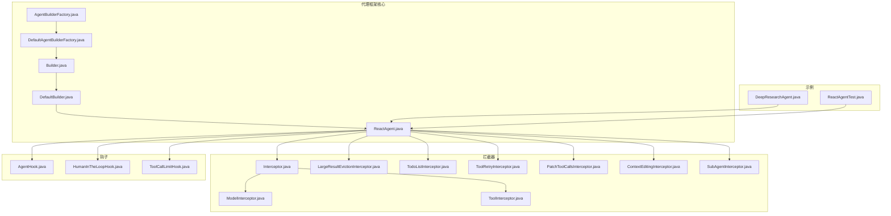
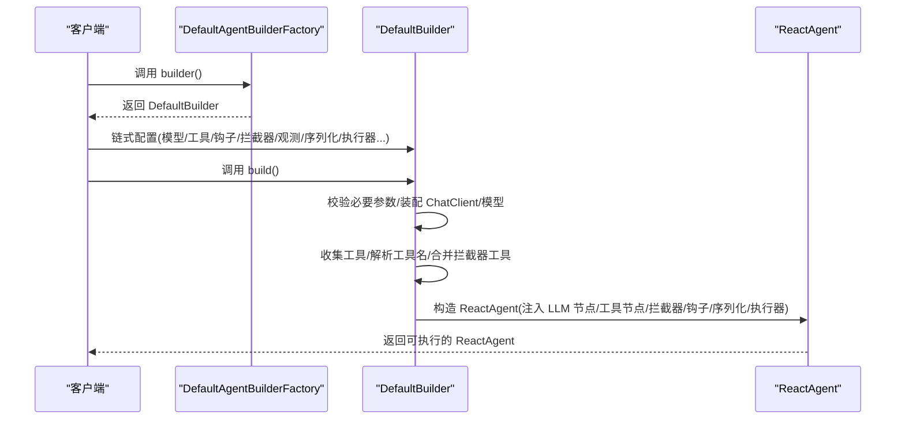
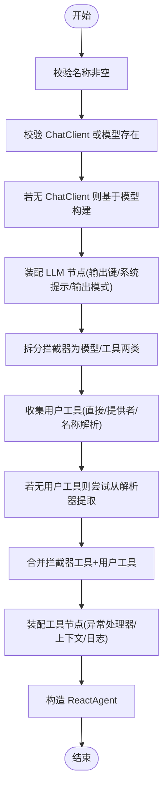
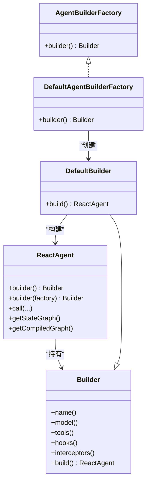
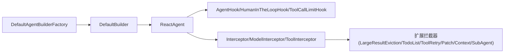

# 构建器

<cite>
**本文引用的文件列表**
- [Builder.java](file://spring-ai-alibaba-agent-framework/src/main/java/com/alibaba/cloud/ai/graph/agent/Builder.java)
- [DefaultBuilder.java](file://spring-ai-alibaba-agent-framework/src/main/java/com/alibaba/cloud/ai/graph/agent/DefaultBuilder.java)
- [AgentBuilderFactory.java](file://spring-ai-alibaba-agent-framework/src/main/java/com/alibaba/cloud/ai/graph/agent/factory/AgentBuilderFactory.java)
- [DefaultAgentBuilderFactory.java](file://spring-ai-alibaba-agent-framework/src/main/java/com/alibaba/cloud/ai/graph/agent/factory/DefaultAgentBuilderFactory.java)
- [ReactAgent.java](file://spring-ai-alibaba-agent-framework/src/main/java/com/alibaba/cloud/ai/graph/agent/ReactAgent.java)
- [Interceptor.java](file://spring-ai-alibaba-agent-framework/src/main/java/com/alibaba/cloud/ai/graph/agent/interceptor/Interceptor.java)
- [ModelInterceptor.java](file://spring-ai-alibaba-agent-framework/src/main/java/com/alibaba/cloud/ai/graph/agent/interceptor/ModelInterceptor.java)
- [ToolInterceptor.java](file://spring-ai-alibaba-agent-framework/src/main/java/com/alibaba/cloud/ai/graph/agent/interceptor/ToolInterceptor.java)
- [AgentHook.java](file://spring-ai-alibaba-agent-framework/src/main/java/com/alibaba/cloud/ai/graph/agent/hook/AgentHook.java)
- [HumanInTheLoopHook.java](file://spring-ai-alibaba-agent-framework/src/main/java/com/alibaba/cloud/ai/graph/agent/hook/hip/HumanInTheLoopHook.java)
- [ToolCallLimitHook.java](file://spring-ai-alibaba-agent-framework/src/main/java/com/alibaba/cloud/ai/graph/agent/hook/toolcalllimit/ToolCallLimitHook.java)
- [LargeResultEvictionInterceptor.java](file://spring-ai-alibaba-agent-framework/src/main/java/com/alibaba/cloud/ai/graph/agent/extension/interceptor/LargeResultEvictionInterceptor.java)
- [TodoListInterceptor.java](file://spring-ai-alibaba-agent-framework/src/main/java/com/alibaba/cloud/ai/graph/agent/interceptor/todolist/TodoListInterceptor.java)
- [ToolRetryInterceptor.java](file://spring-ai-alibaba-agent-framework/src/main/java/com/alibaba/cloud/ai/graph/agent/interceptor/toolretry/ToolRetryInterceptor.java)
- [PatchToolCallsInterceptor.java](file://spring-ai-alibaba-agent-framework/src/main/java/com/alibaba/cloud/ai/graph/agent/extension/interceptor/PatchToolCallsInterceptor.java)
- [ContextEditingInterceptor.java](file://spring-ai-alibaba-agent-framework/src/main/java/com/alibaba/cloud/ai/graph/agent/interceptor/contextediting/ContextEditingInterceptor.java)
- [SubAgentInterceptor.java](file://spring-ai-alibaba-agent-framework/src/main/java/com/alibaba/cloud/ai/graph/agent/extension/interceptor/SubAgentInterceptor.java)
- [DeepResearchAgent.java](file://examples/deepresearch/src/main/java/com/alibaba/cloud/ai/examples/deepresearch/DeepResearchAgent.java)
- [ReactAgentTest.java](file://spring-ai-alibaba-agent-framework/src/test/java/com/alibaba/cloud/ai/graph/agent/ReactAgentTest.java)
</cite>

## 目录
1. [简介](#简介)
2. [项目结构](#项目结构)
3. [核心组件](#核心组件)
4. [架构总览](#架构总览)
5. [详细组件分析](#详细组件分析)
6. [依赖关系分析](#依赖关系分析)
7. [性能与可扩展性](#性能与可扩展性)
8. [故障排查指南](#故障排查指南)
9. [结论](#结论)
10. [附录：使用示例与最佳实践](#附录使用示例与最佳实践)

## 简介
本文件系统性阐述代理构建器的设计与实现，重点围绕 Builder 模式在简化复杂代理对象创建过程中的应用，详解 Builder 接口与 DefaultBuilder 的实现细节，说明如何通过链式调用配置代理的模型、工具、钩子与拦截器；同时介绍工厂接口 AgentBuilderFactory 及其默认实现 DefaultAgentBuilderFactory 如何按配置创建不同类型的代理（如 ReactAgent），并提供使用 DefaultAgentBuilderFactory 创建一个配置了多种工具、钩子与拦截器的 ReactAgent 的完整示例路径，展示其作为统一入口的便利性。

## 项目结构
本节聚焦与“构建器”直接相关的模块与文件组织，帮助读者快速定位关键实现。

图表来源
- [Builder.java](file://spring-ai-alibaba-agent-framework/src/main/java/com/alibaba/cloud/ai/graph/agent/Builder.java#L1-L366)
- [DefaultBuilder.java](file://spring-ai-alibaba-agent-framework/src/main/java/com/alibaba/cloud/ai/graph/agent/DefaultBuilder.java#L1-L247)
- [AgentBuilderFactory.java](file://spring-ai-alibaba-agent-framework/src/main/java/com/alibaba/cloud/ai/graph/agent/factory/AgentBuilderFactory.java#L1-L24)
- [DefaultAgentBuilderFactory.java](file://spring-ai-alibaba-agent-framework/src/main/java/com/alibaba/cloud/ai/graph/agent/factory/DefaultAgentBuilderFactory.java#L1-L28)
- [ReactAgent.java](file://spring-ai-alibaba-agent-framework/src/main/java/com/alibaba/cloud/ai/graph/agent/ReactAgent.java#L1-L200)
- [Interceptor.java](file://spring-ai-alibaba-agent-framework/src/main/java/com/alibaba/cloud/ai/graph/agent/interceptor/Interceptor.java#L1-L21)
- [ModelInterceptor.java](file://spring-ai-alibaba-agent-framework/src/main/java/com/alibaba/cloud/ai/graph/agent/interceptor/ModelInterceptor.java)
- [ToolInterceptor.java](file://spring-ai-alibaba-agent-framework/src/main/java/com/alibaba/cloud/ai/graph/agent/interceptor/ToolInterceptor.java)
- [LargeResultEvictionInterceptor.java](file://spring-ai-alibaba-agent-framework/src/main/java/com/alibaba/cloud/ai/graph/agent/extension/interceptor/LargeResultEvictionInterceptor.java)
- [TodoListInterceptor.java](file://spring-ai-alibaba-agent-framework/src/main/java/com/alibaba/cloud/ai/graph/agent/interceptor/todolist/TodoListInterceptor.java)
- [ToolRetryInterceptor.java](file://spring-ai-alibaba-agent-framework/src/main/java/com/alibaba/cloud/ai/graph/agent/interceptor/toolretry/ToolRetryInterceptor.java)
- [PatchToolCallsInterceptor.java](file://spring-ai-alibaba-agent-framework/src/main/java/com/alibaba/cloud/ai/graph/agent/extension/interceptor/PatchToolCallsInterceptor.java)
- [ContextEditingInterceptor.java](file://spring-ai-alibaba-agent-framework/src/main/java/com/alibaba/cloud/ai/graph/agent/interceptor/contextediting/ContextEditingInterceptor.java)
- [SubAgentInterceptor.java](file://spring-ai-alibaba-agent-framework/src/main/java/com/alibaba/cloud/ai/graph/agent/extension/interceptor/SubAgentInterceptor.java)
- [AgentHook.java](file://spring-ai-alibaba-agent-framework/src/main/java/com/alibaba/cloud/ai/graph/agent/hook/AgentHook.java#L1-L60)
- [HumanInTheLoopHook.java](file://spring-ai-alibaba-agent-framework/src/main/java/com/alibaba/cloud/ai/graph/agent/hook/hip/HumanInTheLoopHook.java)
- [ToolCallLimitHook.java](file://spring-ai-alibaba-agent-framework/src/main/java/com/alibaba/cloud/ai/graph/agent/hook/toolcalllimit/ToolCallLimitHook.java)
- [DeepResearchAgent.java](file://examples/deepresearch/src/main/java/com/alibaba/cloud/ai/examples/deepresearch/DeepResearchAgent.java#L1-L200)
- [ReactAgentTest.java](file://spring-ai-alibaba-agent-framework/src/test/java/com/alibaba/cloud/ai/graph/agent/ReactAgentTest.java#L613-L819)

章节来源
- [Builder.java](file://spring-ai-alibaba-agent-framework/src/main/java/com/alibaba/cloud/ai/graph/agent/Builder.java#L1-L366)
- [DefaultBuilder.java](file://spring-ai-alibaba-agent-framework/src/main/java/com/alibaba/cloud/ai/graph/agent/DefaultBuilder.java#L1-L247)
- [AgentBuilderFactory.java](file://spring-ai-alibaba-agent-framework/src/main/java/com/alibaba/cloud/ai/graph/agent/factory/AgentBuilderFactory.java#L1-L24)
- [DefaultAgentBuilderFactory.java](file://spring-ai-alibaba-agent-framework/src/main/java/com/alibaba/cloud/ai/graph/agent/factory/DefaultAgentBuilderFactory.java#L1-L28)
- [ReactAgent.java](file://spring-ai-alibaba-agent-framework/src/main/java/com/alibaba/cloud/ai/graph/agent/ReactAgent.java#L1-L200)

## 核心组件
- Builder 抽象类：定义代理构建所需的全部配置项（名称、描述、指令、系统提示、模型、聊天选项、工具、工具回调解析器、工具上下文、钩子、拦截器、观测注册表、序列化器、执行器等），并提供链式 setter 方法与统一的 build() 抽象方法。
- DefaultBuilder 实现：完成对 ChatClient/模型的装配、工具收集与合并、拦截器拆分（模型/工具）、LLM 节点与工具节点的组装，并最终构造 ReactAgent。
- AgentBuilderFactory 工厂接口：定义 builder() 工厂方法，用于创建 Builder 实例。
- DefaultAgentBuilderFactory 默认工厂：返回 DefaultBuilder 实例，作为统一入口。
- ReactAgent：基于 Builder 的产物，负责图编排、钩子与拦截器注入、消息路由、状态序列化与执行。

章节来源
- [Builder.java](file://spring-ai-alibaba-agent-framework/src/main/java/com/alibaba/cloud/ai/graph/agent/Builder.java#L116-L366)
- [DefaultBuilder.java](file://spring-ai-alibaba-agent-framework/src/main/java/com/alibaba/cloud/ai/graph/agent/DefaultBuilder.java#L49-L243)
- [AgentBuilderFactory.java](file://spring-ai-alibaba-agent-framework/src/main/java/com/alibaba/cloud/ai/graph/agent/factory/AgentBuilderFactory.java#L1-L24)
- [DefaultAgentBuilderFactory.java](file://spring-ai-alibaba-agent-framework/src/main/java/com/alibaba/cloud/ai/graph/agent/factory/DefaultAgentBuilderFactory.java#L1-L28)
- [ReactAgent.java](file://spring-ai-alibaba-agent-framework/src/main/java/com/alibaba/cloud/ai/graph/agent/ReactAgent.java#L146-L170)

## 架构总览
下图展示了从工厂到构建器再到代理实例的整体流程，以及拦截器与钩子在代理生命周期中的作用位置。

图表来源
- [DefaultAgentBuilderFactory.java](file://spring-ai-alibaba-agent-framework/src/main/java/com/alibaba/cloud/ai/graph/agent/factory/DefaultAgentBuilderFactory.java#L1-L28)
- [DefaultBuilder.java](file://spring-ai-alibaba-agent-framework/src/main/java/com/alibaba/cloud/ai/graph/agent/DefaultBuilder.java#L49-L243)
- [ReactAgent.java](file://spring-ai-alibaba-agent-framework/src/main/java/com/alibaba/cloud/ai/graph/agent/ReactAgent.java#L146-L170)

## 详细组件分析

### Builder 接口与链式配置
- 关键职责
  - 统一管理代理的名称、描述、指令、系统提示、模型、聊天选项、工具集合、工具回调解析器、工具上下文、钩子、拦截器、观测注册表、状态序列化器、执行器、保存器、编译配置等。
  - 提供丰富的链式 setter 方法，便于以“流式 API”的方式逐步配置。
- 设计要点
  - 参数校验：对工具、钩子、拦截器、执行器等集合进行非空校验，避免空元素。
  - 编译配置：若未显式提供，会基于保存器生成默认 CompileConfig。
  - 观测与日志：支持设置 ObservationRegistry、自定义观察约定、启用日志开关。
- 典型链式配置场景
  - 配置模型与聊天选项：model(...)、chatOptions(...)
  - 注册工具：tools(...)、toolCallbackProviders(...)、toolNames(...)、resolver(...)
  - 设置钩子与拦截器：hooks(...)、interceptors(...)
  - 控制输出与序列化：outputKey(...)、outputType(...)、stateSerializer(...)
  - 并行执行：executor(...)

章节来源
- [Builder.java](file://spring-ai-alibaba-agent-framework/src/main/java/com/alibaba/cloud/ai/graph/agent/Builder.java#L116-L366)

### DefaultBuilder 实现与构建流程
- 核心流程
  - 参数校验：名称必填；必须提供 ChatClient 或模型。
  - ChatClient 装配：若仅提供模型，则基于模型与观测配置构建 ChatClient。
  - LLM 节点装配：设置输出键、系统提示、输出模式（schema/type）。
  - 拦截器拆分：将统一拦截器列表按类型拆分为模型拦截器与工具拦截器。
  - 工具收集与合并：
    - 用户提供的工具（直接工具、工具提供者、工具名解析）。
    - 来自拦截器的工具（模型拦截器暴露的工具）。
    - 合并去重后注入 LLM 节点。
  - 工具节点装配：注入工具回调、异常处理器、工具上下文、日志开关。
  - 构造 ReactAgent：传入 LLM 节点、工具节点、编译配置与当前 Builder。
- 错误处理
  - 当工具名无法解析且缺少 ToolCallbackResolver 时抛出非法状态异常。
  - 当工具集合为空但存在拦截器工具时，确保正确合并。
- 性能与并发
  - 使用不可变集合传递工具回调，减少后续修改风险。
  - 执行器通过 builder.executor(...) 注入，用于并行节点执行。

图表来源
- [DefaultBuilder.java](file://spring-ai-alibaba-agent-framework/src/main/java/com/alibaba/cloud/ai/graph/agent/DefaultBuilder.java#L49-L243)

章节来源
- [DefaultBuilder.java](file://spring-ai-alibaba-agent-framework/src/main/java/com/alibaba/cloud/ai/graph/agent/DefaultBuilder.java#L49-L243)

### 工厂接口与默认工厂
- AgentBuilderFactory
  - 定义 builder() 工厂方法，返回 Builder 实例。
- DefaultAgentBuilderFactory
  - 返回 DefaultBuilder，作为默认的代理构建入口。
- 使用建议
  - 多环境或插件化场景可通过实现 AgentBuilderFactory 自定义 Builder 类型。
  - 保持 builder() 返回的 Builder 与 ReactAgent 的构造契约一致。

章节来源
- [AgentBuilderFactory.java](file://spring-ai-alibaba-agent-framework/src/main/java/com/alibaba/cloud/ai/graph/agent/factory/AgentBuilderFactory.java#L1-L24)
- [DefaultAgentBuilderFactory.java](file://spring-ai-alibaba-agent-framework/src/main/java/com/alibaba/cloud/ai/graph/agent/factory/DefaultAgentBuilderFactory.java#L1-L28)

### ReactAgent：统一入口与生命周期
- 统一入口
  - ReactAgent.builder()：使用默认工厂创建 Builder 并链式配置后 build()。
  - ReactAgent.builder(AgentBuilderFactory)：允许注入自定义工厂。
- 生命周期与图编排
  - 初始化钩子：去重校验、设置代理名与实例、准备状态序列化器与执行器。
  - 图构建：按钩子位置插入 before/after 节点，建立模型与工具之间的条件边。
  - 工具注入：根据钩子需求优先匹配名称或类型，注入可用工具。
  - 路由逻辑：根据最后一条消息类型与工具调用结果决定继续模型还是退出。
- 输出与状态
  - 支持按输出键提取响应，或从消息历史中回溯 AssistantMessage。
  - 支持线程态中断与反馈更新。

图表来源
- [AgentBuilderFactory.java](file://spring-ai-alibaba-agent-framework/src/main/java/com/alibaba/cloud/ai/graph/agent/factory/AgentBuilderFactory.java#L1-L24)
- [DefaultAgentBuilderFactory.java](file://spring-ai-alibaba-agent-framework/src/main/java/com/alibaba/cloud/ai/graph/agent/factory/DefaultAgentBuilderFactory.java#L1-L28)
- [Builder.java](file://spring-ai-alibaba-agent-framework/src/main/java/com/alibaba/cloud/ai/graph/agent/Builder.java#L116-L366)
- [DefaultBuilder.java](file://spring-ai-alibaba-agent-framework/src/main/java/com/alibaba/cloud/ai/graph/agent/DefaultBuilder.java#L49-L243)
- [ReactAgent.java](file://spring-ai-alibaba-agent-framework/src/main/java/com/alibaba/cloud/ai/graph/agent/ReactAgent.java#L146-L170)

章节来源
- [ReactAgent.java](file://spring-ai-alibaba-agent-framework/src/main/java/com/alibaba/cloud/ai/graph/agent/ReactAgent.java#L146-L200)

### 钩子与拦截器：扩展点与控制流
- 拦截器
  - Interceptor：通用拦截器接口。
  - ModelInterceptor：面向模型调用的拦截器，可提供工具集合。
  - ToolInterceptor：面向工具调用的拦截器。
- 钩子
  - AgentHook：代理级钩子基类，提供 beforeAgent/afterAgent 生命周期方法。
  - HumanInTheLoopHook：人工介入钩子，支持审批与交互。
  - ToolCallLimitHook：限制工具调用次数的钩子。
- 常用扩展拦截器
  - LargeResultEvictionInterceptor：大结果淘汰拦截器。
  - TodoListInterceptor：待办清单拦截器。
  - ToolRetryInterceptor：工具重试拦截器。
  - PatchToolCallsInterceptor：工具调用补丁拦截器。
  - ContextEditingInterceptor：上下文编辑拦截器。
  - SubAgentInterceptor：子代理拦截器，支持嵌套代理编排。

章节来源
- [Interceptor.java](file://spring-ai-alibaba-agent-framework/src/main/java/com/alibaba/cloud/ai/graph/agent/interceptor/Interceptor.java#L1-L21)
- [ModelInterceptor.java](file://spring-ai-alibaba-agent-framework/src/main/java/com/alibaba/cloud/ai/graph/agent/interceptor/ModelInterceptor.java)
- [ToolInterceptor.java](file://spring-ai-alibaba-agent-framework/src/main/java/com/alibaba/cloud/ai/graph/agent/interceptor/ToolInterceptor.java)
- [AgentHook.java](file://spring-ai-alibaba-agent-framework/src/main/java/com/alibaba/cloud/ai/graph/agent/hook/AgentHook.java#L1-L60)
- [HumanInTheLoopHook.java](file://spring-ai-alibaba-agent-framework/src/main/java/com/alibaba/cloud/ai/graph/agent/hook/hip/HumanInTheLoopHook.java)
- [ToolCallLimitHook.java](file://spring-ai-alibaba-agent-framework/src/main/java/com/alibaba/cloud/ai/graph/agent/hook/toolcalllimit/ToolCallLimitHook.java)
- [LargeResultEvictionInterceptor.java](file://spring-ai-alibaba-agent-framework/src/main/java/com/alibaba/cloud/ai/graph/agent/extension/interceptor/LargeResultEvictionInterceptor.java)
- [TodoListInterceptor.java](file://spring-ai-alibaba-agent-framework/src/main/java/com/alibaba/cloud/ai/graph/agent/interceptor/todolist/TodoListInterceptor.java)
- [ToolRetryInterceptor.java](file://spring-ai-alibaba-agent-framework/src/main/java/com/alibaba/cloud/ai/graph/agent/interceptor/toolretry/ToolRetryInterceptor.java)
- [PatchToolCallsInterceptor.java](file://spring-ai-alibaba-agent-framework/src/main/java/com/alibaba/cloud/ai/graph/agent/extension/interceptor/PatchToolCallsInterceptor.java)
- [ContextEditingInterceptor.java](file://spring-ai-alibaba-agent-framework/src/main/java/com/alibaba/cloud/ai/graph/agent/interceptor/contextediting/ContextEditingInterceptor.java)
- [SubAgentInterceptor.java](file://spring-ai-alibaba-agent-framework/src/main/java/com/alibaba/cloud/ai/graph/agent/extension/interceptor/SubAgentInterceptor.java)

## 依赖关系分析
- 组件耦合
  - DefaultBuilder 强依赖 Builder 的配置项与 ReactAgent 的装配契约。
  - ReactAgent 依赖 Builder 中的钩子、拦截器、序列化器、执行器等配置。
  - 工厂接口与默认工厂解耦具体 Builder 实现，便于替换。
- 外部依赖
  - Spring AI ChatModel/ChatClient、ToolCallback/ToolCallbackResolver、ObservationRegistry 等。
- 循环依赖
  - 未发现循环依赖迹象；各组件职责清晰，边界明确。

图表来源
- [DefaultAgentBuilderFactory.java](file://spring-ai-alibaba-agent-framework/src/main/java/com/alibaba/cloud/ai/graph/agent/factory/DefaultAgentBuilderFactory.java#L1-L28)
- [DefaultBuilder.java](file://spring-ai-alibaba-agent-framework/src/main/java/com/alibaba/cloud/ai/graph/agent/DefaultBuilder.java#L49-L243)
- [ReactAgent.java](file://spring-ai-alibaba-agent-framework/src/main/java/com/alibaba/cloud/ai/graph/agent/ReactAgent.java#L237-L344)
- [Interceptor.java](file://spring-ai-alibaba-agent-framework/src/main/java/com/alibaba/cloud/ai/graph/agent/interceptor/Interceptor.java#L1-L21)
- [LargeResultEvictionInterceptor.java](file://spring-ai-alibaba-agent-framework/src/main/java/com/alibaba/cloud/ai/graph/agent/extension/interceptor/LargeResultEvictionInterceptor.java)
- [TodoListInterceptor.java](file://spring-ai-alibaba-agent-framework/src/main/java/com/alibaba/cloud/ai/graph/agent/interceptor/todolist/TodoListInterceptor.java)
- [ToolRetryInterceptor.java](file://spring-ai-alibaba-agent-framework/src/main/java/com/alibaba/cloud/ai/graph/agent/interceptor/toolretry/ToolRetryInterceptor.java)
- [PatchToolCallsInterceptor.java](file://spring-ai-alibaba-agent-framework/src/main/java/com/alibaba/cloud/ai/graph/agent/extension/interceptor/PatchToolCallsInterceptor.java)
- [ContextEditingInterceptor.java](file://spring-ai-alibaba-agent-framework/src/main/java/com/alibaba/cloud/ai/graph/agent/interceptor/contextediting/ContextEditingInterceptor.java)
- [SubAgentInterceptor.java](file://spring-ai-alibaba-agent-framework/src/main/java/com/alibaba/cloud/ai/graph/agent/extension/interceptor/SubAgentInterceptor.java)
- [AgentHook.java](file://spring-ai-alibaba-agent-framework/src/main/java/com/alibaba/cloud/ai/graph/agent/hook/AgentHook.java#L1-L60)
- [HumanInTheLoopHook.java](file://spring-ai-alibaba-agent-framework/src/main/java/com/alibaba/cloud/ai/graph/agent/hook/hip/HumanInTheLoopHook.java)
- [ToolCallLimitHook.java](file://spring-ai-alibaba-agent-framework/src/main/java/com/alibaba/cloud/ai/graph/agent/hook/toolcalllimit/ToolCallLimitHook.java)

## 性能与可扩展性
- 性能特性
  - 不可变工具集合传递，降低运行期修改开销。
  - 可选执行器注入，支持并行节点并发执行。
  - 默认编译配置递归深度与线程释放策略可满足大多数场景。
- 可扩展性
  - 工厂接口解耦 Builder 实现，便于引入新的构建策略。
  - 拦截器与钩子机制提供横切能力，无需侵入核心逻辑。
  - 子代理拦截器支持复杂多代理协作，提升系统弹性。

[本节为通用指导，不直接分析具体文件]

## 故障排查指南
- 常见问题
  - 名称为空：构建时会抛出非法参数异常，确保调用 name(...)。
  - 缺少模型或 ChatClient：至少提供其一，否则抛出非法参数异常。
  - 工具名解析失败：当 resolver 为空或解析不到工具回调时抛出非法状态异常；请确认工具名与解析器配置。
  - 工具集合为空：若存在拦截器工具但未提供用户工具，应确保解析器具备工具集合或拦截器正确暴露工具。
- 建议排查步骤
  - 检查链式配置顺序与参数合法性。
  - 确认工具提供者与解析器实现是否正确。
  - 开启日志开关以辅助定位推理与行动阶段的问题。
  - 使用测试用例验证工具注入与钩子排序行为。

章节来源
- [DefaultBuilder.java](file://spring-ai-alibaba-agent-framework/src/main/java/com/alibaba/cloud/ai/graph/agent/DefaultBuilder.java#L52-L112)
- [DefaultBuilder.java](file://spring-ai-alibaba-agent-framework/src/main/java/com/alibaba/cloud/ai/graph/agent/DefaultBuilder.java#L130-L188)
- [ReactAgentTest.java](file://spring-ai-alibaba-agent-framework/src/test/java/com/alibaba/cloud/ai/graph/agent/ReactAgentTest.java#L613-L819)

## 结论
Builder 模式在此项目中有效简化了复杂代理对象的创建过程，通过链式配置与工厂抽象，实现了高内聚、低耦合的代理构建体系。DefaultBuilder 将模型、工具、钩子与拦截器整合为统一装配流程，ReactAgent 则承担了图编排与生命周期管理的职责。借助拦截器与钩子机制，系统具备良好的扩展性与可观测性，适合在多样化业务场景中复用与演进。

[本节为总结性内容，不直接分析具体文件]

## 附录：使用示例与最佳实践

### 使用 DefaultAgentBuilderFactory 创建配置了多种工具、钩子与拦截器的 ReactAgent
以下示例展示了如何通过默认工厂创建一个 ReactAgent，该代理配置了多种工具、钩子与拦截器，并启用日志以便调试与审计。

- 示例路径
  - 工厂入口：[DefaultAgentBuilderFactory.java](file://spring-ai-alibaba-agent-framework/src/main/java/com/alibaba/cloud/ai/graph/agent/factory/DefaultAgentBuilderFactory.java#L1-L28)
  - 构建器装配：[DefaultBuilder.java](file://spring-ai-alibaba-agent-framework/src/main/java/com/alibaba/cloud/ai/graph/agent/DefaultBuilder.java#L49-L243)
  - 代理统一入口：[ReactAgent.java](file://spring-ai-alibaba-agent-framework/src/main/java/com/alibaba/cloud/ai/graph/agent/ReactAgent.java#L146-L170)
  - 示例工程集成：[DeepResearchAgent.java](file://examples/deepresearch/src/main/java/com/alibaba/cloud/ai/examples/deepresearch/DeepResearchAgent.java#L144-L163)

- 最佳实践
  - 明确工具来源：优先使用工具对象集合或工具提供者，必要时结合工具名解析器。
  - 合理拆分拦截器：将关注点分离到模型拦截器与工具拦截器，便于维护与复用。
  - 钩子排序与去重：确保钩子唯一性与优先级，避免重复注入与顺序冲突。
  - 日志与观测：开启日志开关与观测注册表，便于问题定位与性能分析。
  - 执行器选择：在需要并行分支时注入合适的执行器，平衡吞吐与资源占用。

章节来源
- [DefaultAgentBuilderFactory.java](file://spring-ai-alibaba-agent-framework/src/main/java/com/alibaba/cloud/ai/graph/agent/factory/DefaultAgentBuilderFactory.java#L1-L28)
- [DefaultBuilder.java](file://spring-ai-alibaba-agent-framework/src/main/java/com/alibaba/cloud/ai/graph/agent/DefaultBuilder.java#L49-L243)
- [ReactAgent.java](file://spring-ai-alibaba-agent-framework/src/main/java/com/alibaba/cloud/ai/graph/agent/ReactAgent.java#L146-L170)
- [DeepResearchAgent.java](file://examples/deepresearch/src/main/java/com/alibaba/cloud/ai/examples/deepresearch/DeepResearchAgent.java#L144-L163)