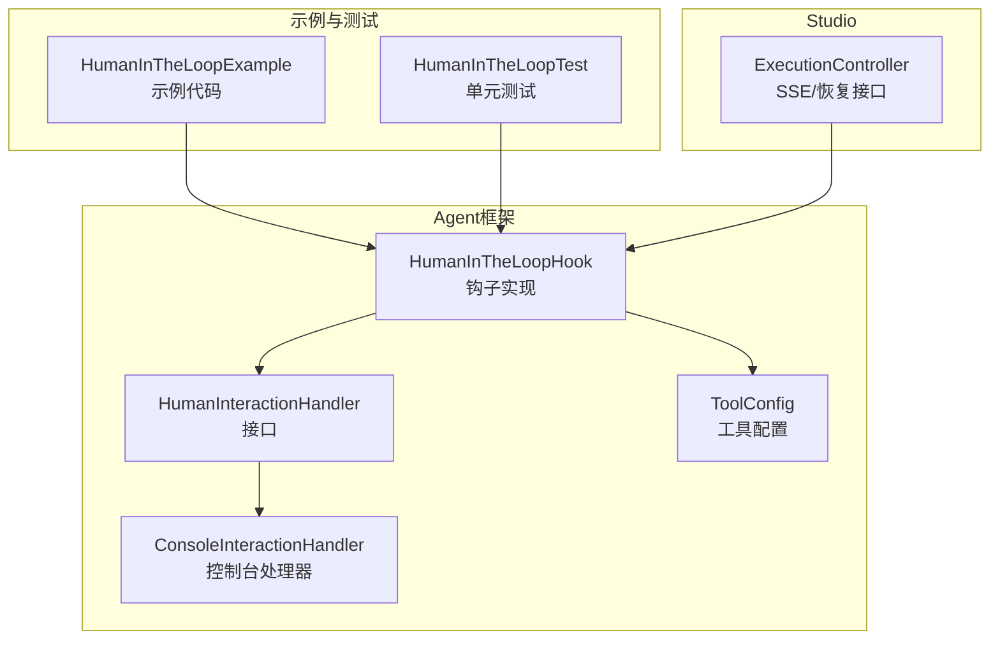
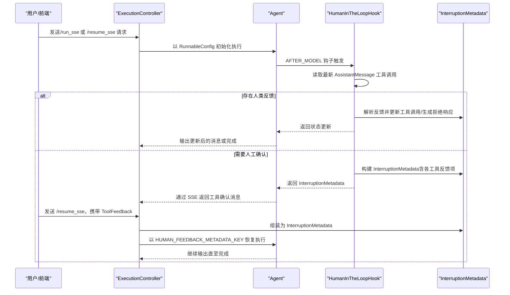
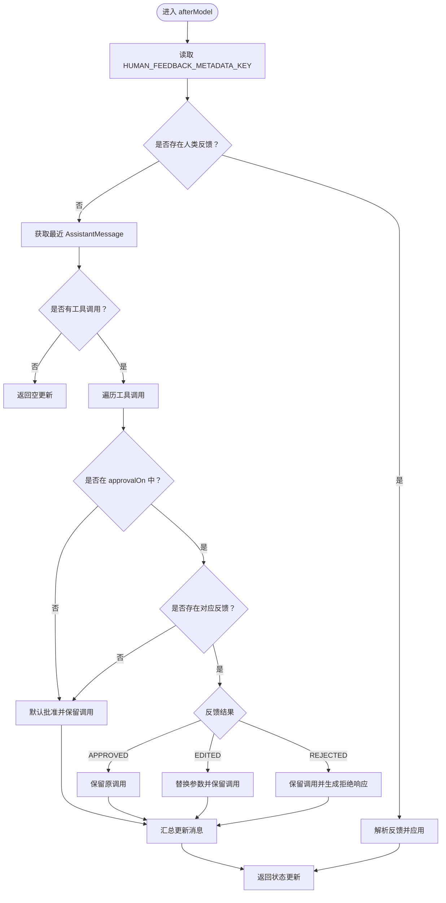
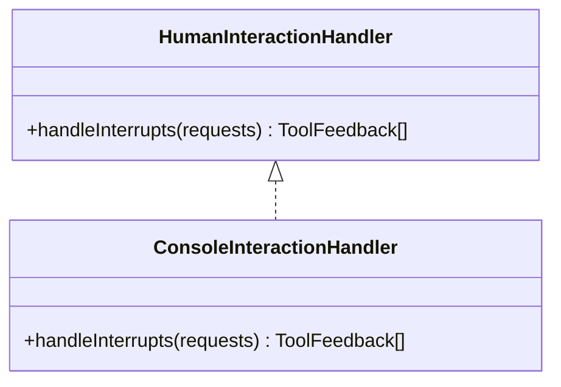
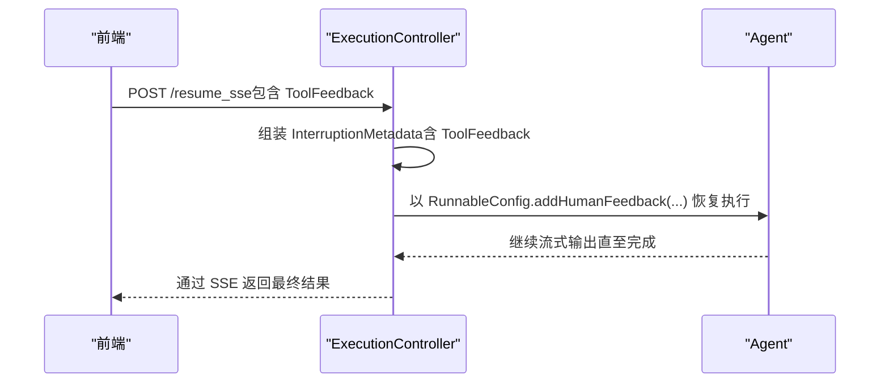
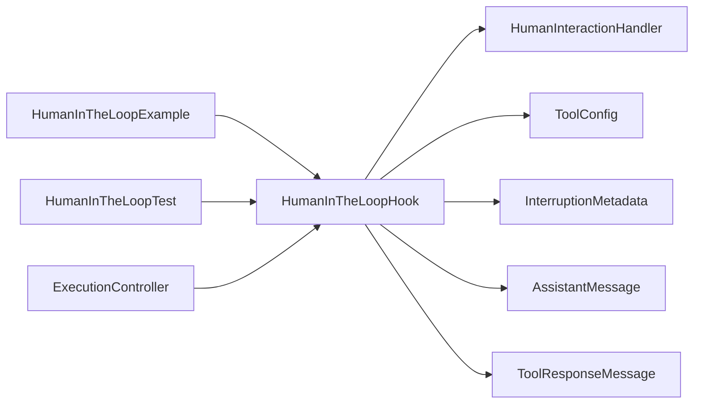

# 人机交互钩子

<cite>
**本文引用的文件**
- [HumanInTheLoopHook.java](file://spring-ai-alibaba-agent-framework/src/main/java/com/alibaba/cloud/ai/graph/agent/hook/hip/HumanInTheLoopHook.java)
- [HumanInteractionHandler.java](file://spring-ai-alibaba-agent-framework/src/main/java/com/alibaba/cloud/ai/graph/agent/hook/hip/HumanInteractionHandler.java)
- [ConsoleInteractionHandler.java](file://spring-ai-alibaba-agent-framework/src/main/java/com/alibaba/cloud/ai/graph/agent/hook/hip/ConsoleInteractionHandler.java)
- [ToolConfig.java](file://spring-ai-alibaba-agent-framework/src/main/java/com/alibaba/cloud/ai/graph/agent/hook/hip/ToolConfig.java)
- [HumanInTheLoopExample.java（框架高级示例）](file://examples/documentation/src/main/java/com/alibaba/cloud/ai/examples/documentation/framework/advanced/HumanInTheLoopExample.java)
- [HumanInTheLoopTest.java](file://spring-ai-alibaba-agent-framework/src/test/java/com/alibaba/cloud/ai/graph/agent/hooks/hip/HumanInTheLoopTest.java)
- [ExecutionController.java](file://spring-ai-alibaba-studio/src/main/java/com/alibaba/cloud/ai/agent/studio/controller/ExecutionController.java)
</cite>

## 目录
1. [简介](#简介)
2. [项目结构](#项目结构)
3. [核心组件](#核心组件)
4. [架构总览](#架构总览)
5. [详细组件分析](#详细组件分析)
6. [依赖关系分析](#依赖关系分析)
7. [性能与可用性考量](#性能与可用性考量)
8. [故障排查指南](#故障排查指南)
9. [结论](#结论)
10. [附录](#附录)

## 简介
本文件围绕 HumanInTheLoopHook（简称 HITL）展开，系统性阐述其在代理执行流程中的作用机制：如何在模型生成工具调用后暂停并等待人工干预，实现人机协同决策；HumanInteractionHandler 接口及 ConsoleInteractionHandler 的设计与行为；ToolConfig 如何定义“需要人工确认”的工具调用；以及在 Studio 中通过 ExecutionController 如何接收人工决策并恢复执行。文末提供在代理中注册该钩子并配置特定工具需要人工确认的完整示例路径，并总结其在安全敏感操作中的典型应用场景。

## 项目结构
HITL 相关代码位于 agent 框架模块的 hook/hip 包中，配套示例与测试分别位于 examples/documentation 与 spring-ai-alibaba-agent-framework 测试目录；Studio 的前端交互通过 ExecutionController 将人工决策转换为 InterruptionMetadata 并恢复执行。

图表来源
- [HumanInTheLoopHook.java](file://spring-ai-alibaba-agent-framework/src/main/java/com/alibaba/cloud/ai/graph/agent/hook/hip/HumanInTheLoopHook.java#L47-L306)
- [HumanInteractionHandler.java](file://spring-ai-alibaba-agent-framework/src/main/java/com/alibaba/cloud/ai/graph/agent/hook/hip/HumanInteractionHandler.java#L16-L25)
- [ConsoleInteractionHandler.java](file://spring-ai-alibaba-agent-framework/src/main/java/com/alibaba/cloud/ai/graph/agent/hook/hip/ConsoleInteractionHandler.java#L16-L49)
- [ToolConfig.java](file://spring-ai-alibaba-agent-framework/src/main/java/com/alibaba/cloud/ai/graph/agent/hook/hip/ToolConfig.java#L16-L54)
- [HumanInTheLoopExample.java（框架高级示例）](file://examples/documentation/src/main/java/com/alibaba/cloud/ai/examples/documentation/framework/advanced/HumanInTheLoopExample.java#L173-L218)
- [HumanInTheLoopTest.java](file://spring-ai-alibaba-agent-framework/src/test/java/com/alibaba/cloud/ai/graph/agent/hooks/hip/HumanInTheLoopTest.java#L189-L218)
- [ExecutionController.java](file://spring-ai-alibaba-studio/src/main/java/com/alibaba/cloud/ai/agent/studio/controller/ExecutionController.java#L188-L247)

章节来源
- [HumanInTheLoopHook.java](file://spring-ai-alibaba-agent-framework/src/main/java/com/alibaba/cloud/ai/graph/agent/hook/hip/HumanInTheLoopHook.java#L47-L306)
- [HumanInteractionHandler.java](file://spring-ai-alibaba-agent-framework/src/main/java/com/alibaba/cloud/ai/graph/agent/hook/hip/HumanInteractionHandler.java#L16-L25)
- [ConsoleInteractionHandler.java](file://spring-ai-alibaba-agent-framework/src/main/java/com/alibaba/cloud/ai/graph/agent/hook/hip/ConsoleInteractionHandler.java#L16-L49)
- [ToolConfig.java](file://spring-ai-alibaba-agent-framework/src/main/java/com/alibaba/cloud/ai/graph/agent/hook/hip/ToolConfig.java#L16-L54)
- [HumanInTheLoopExample.java（框架高级示例）](file://examples/documentation/src/main/java/com/alibaba/cloud/ai/examples/documentation/framework/advanced/HumanInTheLoopExample.java#L173-L218)
- [HumanInTheLoopTest.java](file://spring-ai-alibaba-agent-framework/src/test/java/com/alibaba/cloud/ai/graph/agent/hooks/hip/HumanInTheLoopTest.java#L189-L218)
- [ExecutionController.java](file://spring-ai-alibaba-studio/src/main/java/com/alibaba/cloud/ai/agent/studio/controller/ExecutionController.java#L188-L247)

## 核心组件
- HumanInTheLoopHook：在模型生成工具调用之后进行拦截，基于配置决定是否中断，并根据人工反馈对工具调用进行批准、编辑或拒绝，必要时生成拒绝响应消息。
- HumanInteractionHandler：抽象的人类交互接口，定义处理中断请求的方法。
- ConsoleInteractionHandler：基于控制台的默认实现，提示用户对每个工具调用进行“接受/编辑/拒绝”三类决策。
- ToolConfig：工具级配置对象，用于声明某工具需要人工确认，并可附加描述信息。
- ExecutionController：Studio 后端控制器，接收前端的人工决策（ToolFeedback），封装为 InterruptionMetadata 并恢复执行。

章节来源
- [HumanInTheLoopHook.java](file://spring-ai-alibaba-agent-framework/src/main/java/com/alibaba/cloud/ai/graph/agent/hook/hip/HumanInTheLoopHook.java#L47-L306)
- [HumanInteractionHandler.java](file://spring-ai-alibaba-agent-framework/src/main/java/com/alibaba/cloud/ai/graph/agent/hook/hip/HumanInteractionHandler.java#L16-L25)
- [ConsoleInteractionHandler.java](file://spring-ai-alibaba-agent-framework/src/main/java/com/alibaba/cloud/ai/graph/agent/hook/hip/ConsoleInteractionHandler.java#L16-L49)
- [ToolConfig.java](file://spring-ai-alibaba-agent-framework/src/main/java/com/alibaba/cloud/ai/graph/agent/hook/hip/ToolConfig.java#L16-L54)
- [ExecutionController.java](file://spring-ai-alibaba-studio/src/main/java/com/alibaba/cloud/ai/agent/studio/controller/ExecutionController.java#L188-L247)

## 架构总览
HITL 在代理执行流程中的关键位置是 AFTER_MODEL 钩子位点，它会：
- 从最近一条 AssistantMessage 中提取工具调用；
- 基于 approvalOn 配置判断是否需要人工确认；
- 若存在人类反馈（InterruptionMetadata），则按反馈结果对工具调用进行批准、编辑或拒绝，并在必要时生成 ToolResponseMessage；
- 若不存在人类反馈，且需要确认，则构建 InterruptionMetadata 并返回，等待外部恢复。

图表来源
- [HumanInTheLoopHook.java](file://spring-ai-alibaba-agent-framework/src/main/java/com/alibaba/cloud/ai/graph/agent/hook/hip/HumanInTheLoopHook.java#L66-L169)
- [ExecutionController.java](file://spring-ai-alibaba-studio/src/main/java/com/alibaba/cloud/ai/agent/studio/controller/ExecutionController.java#L188-L247)

## 详细组件分析

### HumanInTheLoopHook 分析
- 钩子位点与职责
  - 注解位置：@HookPositions(AFTER_MODEL)，在模型生成工具调用后进行处理。
  - 核心方法：afterModel 与 interrupt。
- 中断与恢复
  - interrupt：若最近 AssistantMessage 存在工具调用，且未提供人类反馈，则构建 InterruptionMetadata；若已提供但校验失败，也返回 InterruptionMetadata 以继续等待。
  - afterModel：当 RunnableConfig 中包含 HUMAN_FEEDBACK_METADATA_KEY 时，解析反馈并对工具调用进行批准/编辑/拒绝，必要时生成 ToolResponseMessage。
- 工具调用处理
  - 仅对 approvalOn 中声明的工具名进行人工确认；未声明的工具默认批准。
  - 支持编辑参数（编辑后以新参数发起调用）与拒绝（生成拒绝响应消息）。
- 辅助逻辑
  - 获取最近 AssistantMessage 的工具调用列表；
  - 校验人类反馈完整性（名称与 id 匹配、结果非空）。

图表来源
- [HumanInTheLoopHook.java](file://spring-ai-alibaba-agent-framework/src/main/java/com/alibaba/cloud/ai/graph/agent/hook/hip/HumanInTheLoopHook.java#L66-L169)
- [HumanInTheLoopHook.java](file://spring-ai-alibaba-agent-framework/src/main/java/com/alibaba/cloud/ai/graph/agent/hook/hip/HumanInTheLoopHook.java#L171-L211)
- [HumanInTheLoopHook.java](file://spring-ai-alibaba-agent-framework/src/main/java/com/alibaba/cloud/ai/graph/agent/hook/hip/HumanInTheLoopHook.java#L213-L269)

章节来源
- [HumanInTheLoopHook.java](file://spring-ai-alibaba-agent-framework/src/main/java/com/alibaba/cloud/ai/graph/agent/hook/hip/HumanInTheLoopHook.java#L47-L306)

### HumanInteractionHandler 接口与 ConsoleInteractionHandler 实现
- 接口职责
  - 定义 handleInterrupts(List<InterruptionMetadata.ToolFeedback>) 方法，用于处理需要人工确认的工具调用请求。
- ConsoleInteractionHandler 行为
  - 逐条打印工具调用描述与可选动作（接受/编辑/拒绝），从标准输入读取用户选择；
  - 返回经处理后的 ToolFeedback 列表（示例中返回空列表，实际应填充用户决策）。

图表来源
- [HumanInteractionHandler.java](file://spring-ai-alibaba-agent-framework/src/main/java/com/alibaba/cloud/ai/graph/agent/hook/hip/HumanInteractionHandler.java#L16-L25)
- [ConsoleInteractionHandler.java](file://spring-ai-alibaba-agent-framework/src/main/java/com/alibaba/cloud/ai/graph/agent/hook/hip/ConsoleInteractionHandler.java#L16-L49)

章节来源
- [HumanInteractionHandler.java](file://spring-ai-alibaba-agent-framework/src/main/java/com/alibaba/cloud/ai/graph/agent/hook/hip/HumanInteractionHandler.java#L16-L25)
- [ConsoleInteractionHandler.java](file://spring-ai-alibaba-agent-framework/src/main/java/com/alibaba/cloud/ai/graph/agent/hook/hip/ConsoleInteractionHandler.java#L16-L49)

### ToolConfig 配置类
- 用途：为工具声明“需要人工确认”，并可附加描述文本。
- 构建方式：支持通过 builder().description(...) 快速创建；也可直接传入 ToolConfig 实例。
- 与 HumanInTheLoopHook 的关系：HumanInTheLoopHook.Builder.approvalOn(...) 将工具名映射到 ToolConfig，从而决定是否对该工具调用发起中断。

章节来源
- [ToolConfig.java](file://spring-ai-alibaba-agent-framework/src/main/java/com/alibaba/cloud/ai/graph/agent/hook/hip/ToolConfig.java#L16-L54)
- [HumanInTheLoopHook.java](file://spring-ai-alibaba-agent-framework/src/main/java/com/alibaba/cloud/ai/graph/agent/hook/hip/HumanInTheLoopHook.java#L281-L304)

### 在 Studio 中的集成与 ExecutionController 的恢复流程
- /run_sse：首次启动执行，若代理在工具调用处需要人工确认，将通过 SSE 返回 InterruptionMetadata（封装为工具请求确认消息）。
- /resume_sse：前端提交 ToolFeedback 后，ExecutionController 将 ToolFeedback 转换为 InterruptionMetadata，并通过 addHumanFeedback 写入 RunnableConfig 的 HUMAN_FEEDBACK_METADATA_KEY，随后恢复执行。

图表来源
- [ExecutionController.java](file://spring-ai-alibaba-studio/src/main/java/com/alibaba/cloud/ai/agent/studio/controller/ExecutionController.java#L188-L247)

章节来源
- [ExecutionController.java](file://spring-ai-alibaba-studio/src/main/java/com/alibaba/cloud/ai/agent/studio/controller/ExecutionController.java#L188-L247)

## 依赖关系分析
- HumanInTheLoopHook 依赖：
  - 模型钩子基类 ModelHook；
  - 异步节点动作与可中断动作接口（AsyncNodeActionWithConfig、InterruptableAction）；
  - InterruptionMetadata、AssistantMessage、ToolResponseMessage 等消息类型；
  - ToolConfig 作为工具配置来源。
- 示例与测试：
  - HumanInTheLoopExample 展示如何在 ReactAgent 中注册 HumanInTheLoopHook，并演示 approve/edit/reject 场景；
  - HumanInTheLoopTest 验证多轮工具调用、部分反馈与混合决策等边界场景。
- Studio：
  - ExecutionController 通过 /resume_sse 将前端 ToolFeedback 转换为 InterruptionMetadata 并恢复执行。

图表来源
- [HumanInTheLoopHook.java](file://spring-ai-alibaba-agent-framework/src/main/java/com/alibaba/cloud/ai/graph/agent/hook/hip/HumanInTheLoopHook.java#L47-L306)
- [HumanInteractionHandler.java](file://spring-ai-alibaba-agent-framework/src/main/java/com/alibaba/cloud/ai/graph/agent/hook/hip/HumanInteractionHandler.java#L16-L25)
- [ToolConfig.java](file://spring-ai-alibaba-agent-framework/src/main/java/com/alibaba/cloud/ai/graph/agent/hook/hip/ToolConfig.java#L16-L54)
- [HumanInTheLoopExample.java（框架高级示例）](file://examples/documentation/src/main/java/com/alibaba/cloud/ai/examples/documentation/framework/advanced/HumanInTheLoopExample.java#L173-L218)
- [HumanInTheLoopTest.java](file://spring-ai-alibaba-agent-framework/src/test/java/com/alibaba/cloud/ai/graph/agent/hooks/hip/HumanInTheLoopTest.java#L189-L218)
- [ExecutionController.java](file://spring-ai-alibaba-studio/src/main/java/com/alibaba/cloud/ai/agent/studio/controller/ExecutionController.java#L188-L247)

章节来源
- [HumanInTheLoopHook.java](file://spring-ai-alibaba-agent-framework/src/main/java/com/alibaba/cloud/ai/graph/agent/hook/hip/HumanInTheLoopHook.java#L47-L306)
- [HumanInTheLoopExample.java（框架高级示例）](file://examples/documentation/src/main/java/com/alibaba/cloud/ai/examples/documentation/framework/advanced/HumanInTheLoopExample.java#L173-L218)
- [HumanInTheLoopTest.java](file://spring-ai-alibaba-agent-framework/src/test/java/com/alibaba/cloud/ai/graph/agent/hooks/hip/HumanInTheLoopTest.java#L189-L218)
- [ExecutionController.java](file://spring-ai-alibaba-studio/src/main/java/com/alibaba/cloud/ai/agent/studio/controller/ExecutionController.java#L188-L247)

## 性能与可用性考量
- 中断频率与用户体验：对频繁调用的工具启用人工确认会增加交互次数，建议仅对高风险或合规敏感工具启用。
- 状态持久化：HITL 依赖检查点（如 MemorySaver）以支持中断与恢复，确保线程 ID 一致以便正确恢复。
- 反馈完整性：未提供完整反馈会导致持续中断，应在前端或交互层确保收集到每项工具的决策。
- 并发与线程安全：在多会话并发场景下，确保每个线程 ID 对应独立的 RunnableConfig，避免交叉污染。

[本节为通用指导，无需列出具体文件来源]

## 故障排查指南
- 未提供人类反馈导致持续中断
  - 现象：第二次调用仍返回 InterruptionMetadata。
  - 排查：确认前端是否完整提交了所有工具的 ToolFeedback；查看 HumanInTheLoopHook.validateFeedback 的日志提示。
- 反馈结果为空
  - 现象：校验失败并继续等待。
  - 排查：检查 ToolFeedback.result 是否设置为 APPROVED/EDITED/REJECTED。
- 工具名或 id 不匹配
  - 现象：忽略意外反馈或继续等待。
  - 排查：核对 ToolFeedback 的 name 与 id 是否与 AssistantMessage.ToolCall 完全一致。
- 恢复执行无效
  - 现象：/resume_sse 后仍无进展。
  - 排查：确认使用相同的 threadId；确认 HUMAN_FEEDBACK_METADATA_KEY 已正确注入；检查 ExecutionController 的 ToolFeedback 转换逻辑。

章节来源
- [HumanInTheLoopHook.java](file://spring-ai-alibaba-agent-framework/src/main/java/com/alibaba/cloud/ai/graph/agent/hook/hip/HumanInTheLoopHook.java#L213-L269)
- [ExecutionController.java](file://spring-ai-alibaba-studio/src/main/java/com/alibaba/cloud/ai/agent/studio/controller/ExecutionController.java#L208-L239)

## 结论
HumanInTheLoopHook 通过在模型生成工具调用后插入人工确认环节，实现了对关键工具调用的可控与可审计。结合 ToolConfig 的工具级配置与 InterruptionMetadata 的反馈机制，可在代理执行过程中灵活地暂停并等待人工决策。在 Studio 中，ExecutionController 提供了标准化的 /resume_sse 接口，将前端决策转化为 InterruptionMetadata 并恢复执行。该能力特别适用于安全敏感、合规要求高的场景，例如数据库写入、文件删除、权限变更等高风险操作。

[本节为总结性内容，无需列出具体文件来源]

## 附录

### 在代理中注册 HumanInTheLoopHook 并配置特定工具需要人工确认的示例路径
- 基础配置与注册
  - 示例路径：[HumanInTheLoopExample.java（框架高级示例）](file://examples/documentation/src/main/java/com/alibaba/cloud/ai/examples/documentation/framework/advanced/HumanInTheLoopExample.java#L173-L218)
  - 关键步骤：使用 HumanInTheLoopHook.builder().approvalOn(...) 注册工具与描述；将 HumanInTheLoopHook 加入 ReactAgent 的 hooks 列表。
- 批准（approve）、编辑（edit）、拒绝（reject）决策
  - 示例路径：[HumanInTheLoopExample.java（框架高级示例）](file://examples/documentation/src/main/java/com/alibaba/cloud/ai/examples/documentation/framework/advanced/HumanInTheLoopExample.java#L225-L305)
  - 关键步骤：在收到 InterruptionMetadata 后，构造包含每个工具反馈的 InterruptionMetadata，并通过 RunnableConfig.addMetadata(RunnableConfig.HUMAN_FEEDBACK_METADATA_KEY, ...) 恢复执行。
- 多工具调用与混合决策
  - 示例路径：[HumanInTheLoopExample.java（框架高级示例）](file://examples/documentation/src/main/java/com/alibaba/cloud/ai/examples/documentation/framework/advanced/HumanInTheLoopExample.java#L450-L542)
  - 关键步骤：对不同工具分别设置 APPROVED/EDITED/REJECTED，并在一次调用中完成多工具决策。
- 单元测试验证
  - 示例路径：[HumanInTheLoopTest.java](file://spring-ai-alibaba-agent-framework/src/test/java/com/alibaba/cloud/ai/graph/agent/hooks/hip/HumanInTheLoopTest.java#L189-L218)
  - 关键步骤：创建包含 poem/weather_tool 的代理，验证中断与恢复流程。

### 安全敏感操作的应用场景
- 数据库写入/删除：通过 HumanInTheLoopHook 对 SQL 工具调用进行审批，必要时允许编辑参数（如限定范围）。
- 文件系统操作：对写入/删除工具启用人工确认，防止误操作。
- 权限变更：对高权限工具调用强制人工审批，记录拒绝原因与建议。
- 外部系统调用：对可能产生不可逆后果的外部 API 调用进行确认与参数校验。

[本节为概念性内容，无需列出具体文件来源]