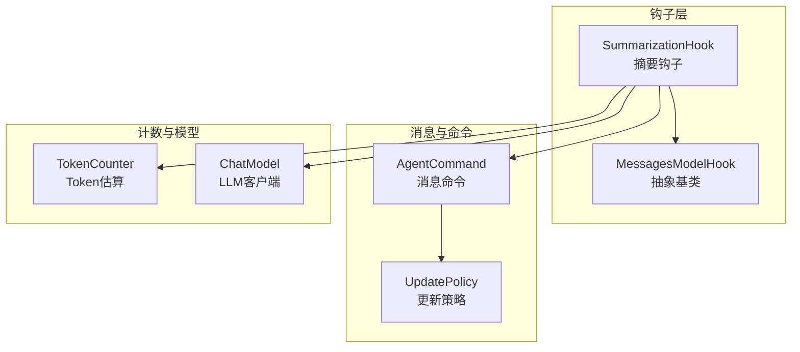
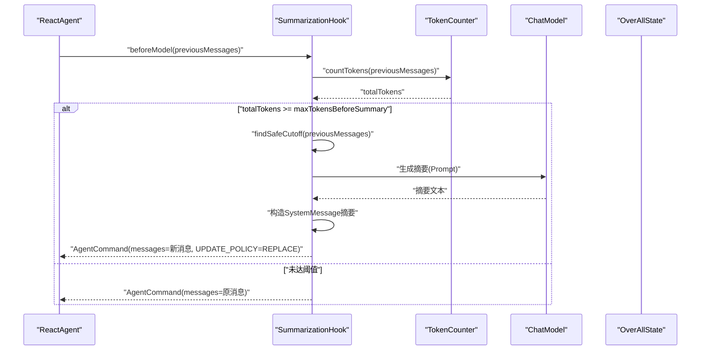
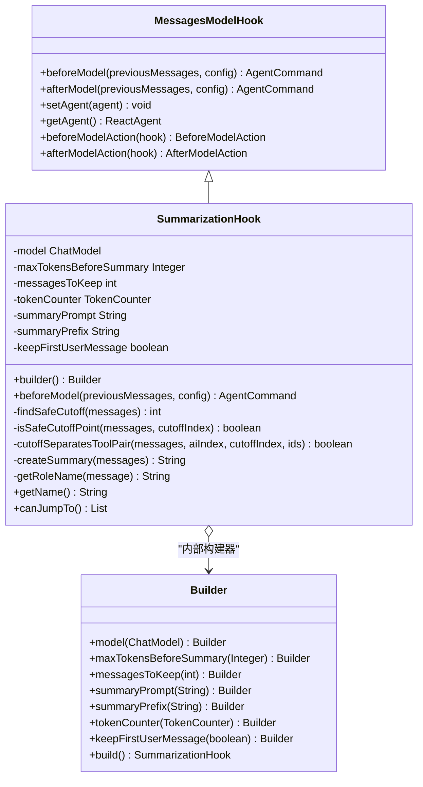
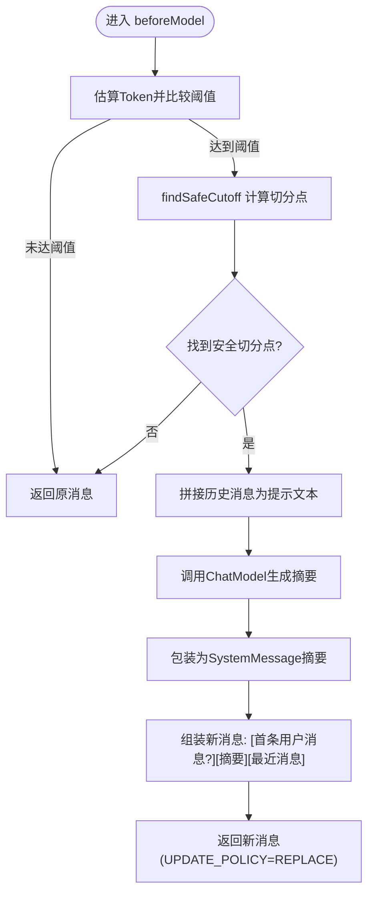
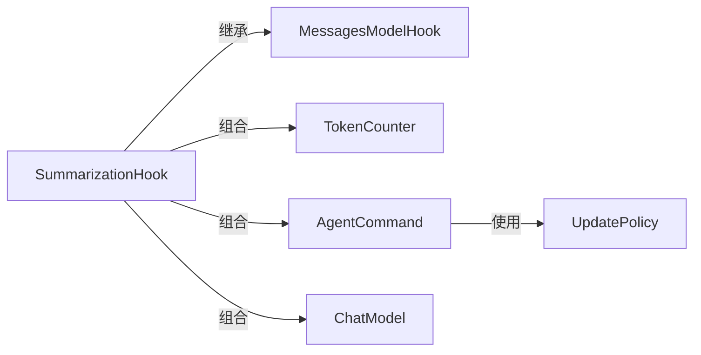

# 摘要生成钩子

<cite>
**本文引用的文件**
- [SummarizationHook.java](file://spring-ai-alibaba-agent-framework/src/main/java/com/alibaba/cloud/ai/graph/agent/hook/summarization/SummarizationHook.java)
- [MessagesModelHook.java](file://spring-ai-alibaba-agent-framework/src/main/java/com/alibaba/cloud/ai/graph/agent/hook/messages/MessagesModelHook.java)
- [TokenCounter.java](file://spring-ai-alibaba-agent-framework/src/main/java/com/alibaba/cloud/ai/graph/agent/hook/TokenCounter.java)
- [AgentCommand.java](file://spring-ai-alibaba-agent-framework/src/main/java/com/alibaba/cloud/ai/graph/agent/hook/messages/AgentCommand.java)
- [UpdatePolicy.java](file://spring-ai-alibaba-agent-framework/src/main/java/com/alibaba/cloud/ai/graph/agent/hook/messages/UpdatePolicy.java)
- [SummarizationTest.java](file://spring-ai-alibaba-agent-framework/src/test/java/com/alibaba/cloud/ai/graph/agent/hooks/summarization/SummarizationTest.java)
- [MemoryExample.java](file://examples/documentation/src/main/java/com/alibaba/cloud/ai/examples/documentation/framework/tutorials/MemoryExample.java)
</cite>

## 目录
1. [简介](#简介)
2. [项目结构](#项目结构)
3. [核心组件](#核心组件)
4. [架构总览](#架构总览)
5. [详细组件分析](#详细组件分析)
6. [依赖关系分析](#依赖关系分析)
7. [性能与成本考量](#性能与成本考量)
8. [故障排查指南](#故障排查指南)
9. [结论](#结论)
10. [附录](#附录)

## 简介
本文件围绕 SummarizationHook 进行深入文档化，解释其如何在接近上下文窗口上限时对历史对话进行摘要，从而降低 Token 消耗并缓解长对话的上下文窗口限制问题。文档还阐明了该钩子与 MessagesModelHook 的协作关系、摘要触发条件（Token 阈值）、摘要策略配置项（摘要详细度与关键信息保留），并提供在特定 Token 阈值下自动触发摘要的配置示例路径与性能影响分析。

## 项目结构
SummarizationHook 位于代理框架的钩子模块中，作为消息型模型钩子的一种实现，负责在模型调用前对历史消息进行评估与必要时的摘要替换。其核心依赖包括：
- 基类：MessagesModelHook，提供钩子生命周期（beforeModel/afterModel）与消息状态更新机制
- 计数器：TokenCounter，用于估算消息集合的 Token 数量
- 命令载体：AgentCommand，封装消息更新策略（替换或追加）与跳转控制
- 更新策略：UpdatePolicy，枚举类型，决定消息列表是整体替换还是追加
- LLM 客户端：ChatModel，用于调用大模型生成摘要

图表来源
- [SummarizationHook.java](file://spring-ai-alibaba-agent-framework/src/main/java/com/alibaba/cloud/ai/graph/agent/hook/summarization/SummarizationHook.java#L58-L167)
- [MessagesModelHook.java](file://spring-ai-alibaba-agent-framework/src/main/java/com/alibaba/cloud/ai/graph/agent/hook/messages/MessagesModelHook.java#L32-L149)
- [AgentCommand.java](file://spring-ai-alibaba-agent-framework/src/main/java/com/alibaba/cloud/ai/graph/agent/hook/messages/AgentCommand.java#L24-L70)
- [UpdatePolicy.java](file://spring-ai-alibaba-agent-framework/src/main/java/com/alibaba/cloud/ai/graph/agent/hook/messages/UpdatePolicy.java#L18-L33)
- [TokenCounter.java](file://spring-ai-alibaba-agent-framework/src/main/java/com/alibaba/cloud/ai/graph/agent/hook/TokenCounter.java#L39-L93)

章节来源
- [SummarizationHook.java](file://spring-ai-alibaba-agent-framework/src/main/java/com/alibaba/cloud/ai/graph/agent/hook/summarization/SummarizationHook.java#L58-L167)
- [MessagesModelHook.java](file://spring-ai-alibaba-agent-framework/src/main/java/com/alibaba/cloud/ai/graph/agent/hook/messages/MessagesModelHook.java#L32-L149)

## 核心组件
- SummarizationHook：在模型调用前根据 Token 阈值判断是否需要摘要；若需要，则安全地切分历史消息，保留近期消息与可选的首条用户消息，调用 LLM 生成摘要并替换为系统消息，最终返回新的消息列表。
- MessagesModelHook：定义钩子生命周期与消息状态更新代理（BeforeModelAction/AfterModelAction），将钩子逻辑注入到代理执行流程中。
- TokenCounter：提供消息集合的近似 Token 计数能力，支持不同消息类型的 Token 估算策略。
- AgentCommand/UpdatePolicy：封装消息更新策略（整体替换或追加），并允许钩子在必要时触发跳转控制。
- ChatModel：用于调用外部 LLM 生成摘要文本。

章节来源
- [SummarizationHook.java](file://spring-ai-alibaba-agent-framework/src/main/java/com/alibaba/cloud/ai/graph/agent/hook/summarization/SummarizationHook.java#L58-L167)
- [MessagesModelHook.java](file://spring-ai-alibaba-agent-framework/src/main/java/com/alibaba/cloud/ai/graph/agent/hook/messages/MessagesModelHook.java#L32-L149)
- [TokenCounter.java](file://spring-ai-alibaba-agent-framework/src/main/java/com/alibaba/cloud/ai/graph/agent/hook/TokenCounter.java#L39-L93)
- [AgentCommand.java](file://spring-ai-alibaba-agent-framework/src/main/java/com/alibaba/cloud/ai/graph/agent/hook/messages/AgentCommand.java#L24-L70)
- [UpdatePolicy.java](file://spring-ai-alibaba-agent-framework/src/main/java/com/alibaba/cloud/ai/graph/agent/hook/messages/UpdatePolicy.java#L18-L33)

## 架构总览
SummarizationHook 通过 @HookPositions 注解声明其在 BEFORE_MODEL 阶段生效，由 MessagesModelHook 的 BeforeModelAction 将其 beforeModel 钩子接入代理的状态流转。当消息集合的 Token 估算超过阈值时，钩子计算安全切分点，保留近期消息与可选首条用户消息，调用 LLM 生成摘要并以系统消息形式插入，随后返回新的消息列表供后续模型调用使用。

图表来源
- [SummarizationHook.java](file://spring-ai-alibaba-agent-framework/src/main/java/com/alibaba/cloud/ai/graph/agent/hook/summarization/SummarizationHook.java#L102-L167)
- [MessagesModelHook.java](file://spring-ai-alibaba-agent-framework/src/main/java/com/alibaba/cloud/ai/graph/agent/hook/messages/MessagesModelHook.java#L84-L112)
- [TokenCounter.java](file://spring-ai-alibaba-agent-framework/src/main/java/com/alibaba/cloud/ai/graph/agent/hook/TokenCounter.java#L39-L93)

## 详细组件分析

### SummarizationHook 类图

图表来源
- [SummarizationHook.java](file://spring-ai-alibaba-agent-framework/src/main/java/com/alibaba/cloud/ai/graph/agent/hook/summarization/SummarizationHook.java#L58-L366)
- [MessagesModelHook.java](file://spring-ai-alibaba-agent-framework/src/main/java/com/alibaba/cloud/ai/graph/agent/hook/messages/MessagesModelHook.java#L32-L149)

章节来源
- [SummarizationHook.java](file://spring-ai-alibaba-agent-framework/src/main/java/com/alibaba/cloud/ai/graph/agent/hook/summarization/SummarizationHook.java#L58-L366)
- [MessagesModelHook.java](file://spring-ai-alibaba-agent-framework/src/main/java/com/alibaba/cloud/ai/graph/agent/hook/messages/MessagesModelHook.java#L32-L149)

### 触发条件与摘要策略
- 触发条件：当 TokenCounter 估算的总 Token 数达到或超过 maxTokensBeforeSummary 阈值时，触发摘要流程。
- 安全切分：findSafeCutoff 会从目标切分点向前搜索，确保不会将 AI 的工具调用与其对应的工具响应消息分离。
- 关键信息保留：
  - messagesToKeep：保留最近的消息数量，保证上下文连续性
  - keepFirstUserMessage：可选保留首条用户消息，确保任务意图不丢失
- 摘要生成：将待摘要的历史消息序列化为提示文本，调用 ChatModel 生成摘要，再以 SystemMessage 形式插入，形成“摘要 + 最近消息”的新消息序列。

图表来源
- [SummarizationHook.java](file://spring-ai-alibaba-agent-framework/src/main/java/com/alibaba/cloud/ai/graph/agent/hook/summarization/SummarizationHook.java#L102-L167)
- [TokenCounter.java](file://spring-ai-alibaba-agent-framework/src/main/java/com/alibaba/cloud/ai/graph/agent/hook/TokenCounter.java#L39-L93)

章节来源
- [SummarizationHook.java](file://spring-ai-alibaba-agent-framework/src/main/java/com/alibaba/cloud/ai/graph/agent/hook/summarization/SummarizationHook.java#L102-L167)
- [TokenCounter.java](file://spring-ai-alibaba-agent-framework/src/main/java/com/alibaba/cloud/ai/graph/agent/hook/TokenCounter.java#L39-L93)

### 与 MessagesModelHook 的协作
- 生命周期注入：MessagesModelHook 提供 BeforeModelAction/AfterModelAction 两个静态代理，分别在模型调用前/后执行钩子逻辑。
- 消息更新：SummarizationHook 返回的 AgentCommand 可选择 REPLACE 或 APPEND 策略；默认使用 REPLACE，确保历史摘要覆盖旧消息。
- 集成方式：在代理构建时将 SummarizationHook 加入 hooks 列表，即可在每次模型调用前自动生效。

章节来源
- [MessagesModelHook.java](file://spring-ai-alibaba-agent-framework/src/main/java/com/alibaba/cloud/ai/graph/agent/hook/messages/MessagesModelHook.java#L84-L149)
- [AgentCommand.java](file://spring-ai-alibaba-agent-framework/src/main/java/com/alibaba/cloud/ai/graph/agent/hook/messages/AgentCommand.java#L24-L70)
- [UpdatePolicy.java](file://spring-ai-alibaba-agent-framework/src/main/java/com/alibaba/cloud/ai/graph/agent/hook/messages/UpdatePolicy.java#L18-L33)

### 配置选项与示例路径
- 关键配置项
  - model：必需，用于生成摘要的 LLM 客户端
  - maxTokensBeforeSummary：可选，触发摘要的 Token 阈值；未设置时不触发
  - messagesToKeep：保留最近消息数量，默认值参考实现
  - tokenCounter：Token 估算策略，默认使用近似字符/Token 比率
  - summaryPrompt：摘要提示词模板
  - summaryPrefix：摘要消息前缀
  - keepFirstUserMessage：是否保留首条用户消息
- 示例路径
  - 在测试中创建 SummarizationHook 并绑定到 ReactAgent 的示例路径：[SummarizationTest.java](file://spring-ai-alibaba-agent-framework/src/test/java/com/alibaba/cloud/ai/graph/agent/hooks/summarization/SummarizationTest.java#L52-L71)
  - 在官方示例中演示基于 MessagesModelHook 的消息总结 Hook 的示例路径：[MemoryExample.java](file://examples/documentation/src/main/java/com/alibaba/cloud/ai/examples/documentation/framework/tutorials/MemoryExample.java#L442-L481)

章节来源
- [SummarizationHook.java](file://spring-ai-alibaba-agent-framework/src/main/java/com/alibaba/cloud/ai/graph/agent/hook/summarization/SummarizationHook.java#L315-L366)
- [SummarizationTest.java](file://spring-ai-alibaba-agent-framework/src/test/java/com/alibaba/cloud/ai/graph/agent/hooks/summarization/SummarizationTest.java#L52-L71)
- [MemoryExample.java](file://examples/documentation/src/main/java/com/alibaba/cloud/ai/examples/documentation/framework/tutorials/MemoryExample.java#L442-L481)

## 依赖关系分析
- 组件耦合
  - SummarizationHook 与 MessagesModelHook：继承关系，复用钩子生命周期与消息代理
  - SummarizationHook 与 TokenCounter：组合关系，用于估算 Token 数量
  - SummarizationHook 与 ChatModel：组合关系，用于摘要生成
  - SummarizationHook 与 AgentCommand/UpdatePolicy：组合关系，用于消息更新策略
- 外部依赖
  - Spring AI ChatModel 接口族：用于调用外部 LLM
  - 日志：使用 SLF4J 输出调试与警告信息

图表来源
- [SummarizationHook.java](file://spring-ai-alibaba-agent-framework/src/main/java/com/alibaba/cloud/ai/graph/agent/hook/summarization/SummarizationHook.java#L58-L167)
- [MessagesModelHook.java](file://spring-ai-alibaba-agent-framework/src/main/java/com/alibaba/cloud/ai/graph/agent/hook/messages/MessagesModelHook.java#L32-L149)
- [AgentCommand.java](file://spring-ai-alibaba-agent-framework/src/main/java/com/alibaba/cloud/ai/graph/agent/hook/messages/AgentCommand.java#L24-L70)
- [UpdatePolicy.java](file://spring-ai-alibaba-agent-framework/src/main/java/com/alibaba/cloud/ai/graph/agent/hook/messages/UpdatePolicy.java#L18-L33)
- [TokenCounter.java](file://spring-ai-alibaba-agent-framework/src/main/java/com/alibaba/cloud/ai/graph/agent/hook/TokenCounter.java#L39-L93)

## 性能与成本考量
- Token 估算开销：TokenCounter 默认采用字符/Token 比率估算，时间复杂度 O(n)，其中 n 为消息数量；对于包含工具调用与工具响应的消息，估算会考虑相应字段长度，提升准确性。
- 摘要生成成本：摘要生成调用一次 LLM，成本与输入长度和模型定价相关；建议合理设置 maxTokensBeforeSummary 以平衡触发频率与成本。
- 切分算法复杂度：findSafeCutoff 与 isSafeCutoffPoint 会遍历候选范围内的消息，最坏情况下为 O(n·k)，其中 k 为搜索范围；默认搜索范围较小，通常对性能影响有限。
- 内存占用：摘要生成后以 SystemMessage 插入，消息列表大小由保留的 recent 消息与摘要决定；建议结合 messagesToKeep 调整以控制内存峰值。
- 触发频率：过低的阈值会导致频繁摘要，增加 LLM 调用次数；过高则可能接近上下文上限导致截断或失败。建议结合具体模型上下文窗口与对话场景进行调优。

## 故障排查指南
- 未触发摘要
  - 检查是否设置了 maxTokensBeforeSummary；未设置将直接返回原消息
  - 检查 TokenCounter 的估算策略是否正确；默认按字符/Token 比率估算
  - 参考测试用例路径：[SummarizationTest.java](file://spring-ai-alibaba-agent-framework/src/test/java/com/alibaba/cloud/ai/graph/agent/hooks/summarization/SummarizationTest.java#L92-L119)
- 无法找到安全切分点
  - 当历史消息中存在大量工具调用且分布密集时，可能无法找到满足“不分离 AI 工具调用与其响应”的切分点
  - 可适当增大 messagesToKeep 或调整阈值
  - 参考日志输出路径：[SummarizationHook.java](file://spring-ai-alibaba-agent-framework/src/main/java/com/alibaba/cloud/ai/graph/agent/hook/summarization/SummarizationHook.java#L114-L122)
- 摘要生成失败
  - 摘要生成过程捕获异常并记录错误日志，返回失败提示文本
  - 参考错误处理路径：[SummarizationHook.java](file://spring-ai-alibaba-agent-framework/src/main/java/com/alibaba/cloud/ai/graph/agent/hook/summarization/SummarizationHook.java#L263-L285)
- 首条用户消息未保留
  - 确认 keepFirstUserMessage 是否启用；默认开启
  - 参考测试验证路径：[SummarizationTest.java](file://spring-ai-alibaba-agent-framework/src/test/java/com/alibaba/cloud/ai/graph/agent/hooks/summarization/SummarizationTest.java#L162-L211)

章节来源
- [SummarizationHook.java](file://spring-ai-alibaba-agent-framework/src/main/java/com/alibaba/cloud/ai/graph/agent/hook/summarization/SummarizationHook.java#L102-L167)
- [SummarizationTest.java](file://spring-ai-alibaba-agent-framework/src/test/java/com/alibaba/cloud/ai/graph/agent/hooks/summarization/SummarizationTest.java#L162-L211)

## 结论
SummarizationHook 通过在模型调用前对历史消息进行 Token 估算与安全切分，利用 LLM 生成摘要并以系统消息形式替换旧历史，有效缓解长对话的上下文窗口限制问题。其与 MessagesModelHook 的协作使钩子逻辑无缝融入代理执行流程；通过可配置的阈值与保留策略，可在不同业务场景下平衡上下文连续性与成本开销。建议结合实际模型上下文窗口与对话特征，合理设置阈值与保留数量，以获得最佳效果。

## 附录
- 配置示例路径
  - 创建并绑定 SummarizationHook 的示例路径：[SummarizationTest.java](file://spring-ai-alibaba-agent-framework/src/test/java/com/alibaba/cloud/ai/graph/agent/hooks/summarization/SummarizationTest.java#L52-L71)
  - 基于 MessagesModelHook 的消息总结 Hook 示例路径：[MemoryExample.java](file://examples/documentation/src/main/java/com/alibaba/cloud/ai/examples/documentation/framework/tutorials/MemoryExample.java#L442-L481)
- 相关接口与类型
  - TokenCounter 接口定义：[TokenCounter.java](file://spring-ai-alibaba-agent-framework/src/main/java/com/alibaba/cloud/ai/graph/agent/hook/TokenCounter.java#L39-L93)
  - AgentCommand 与 UpdatePolicy：[AgentCommand.java](file://spring-ai-alibaba-agent-framework/src/main/java/com/alibaba/cloud/ai/graph/agent/hook/messages/AgentCommand.java#L24-L70)、[UpdatePolicy.java](file://spring-ai-alibaba-agent-framework/src/main/java/com/alibaba/cloud/ai/graph/agent/hook/messages/UpdatePolicy.java#L18-L33)