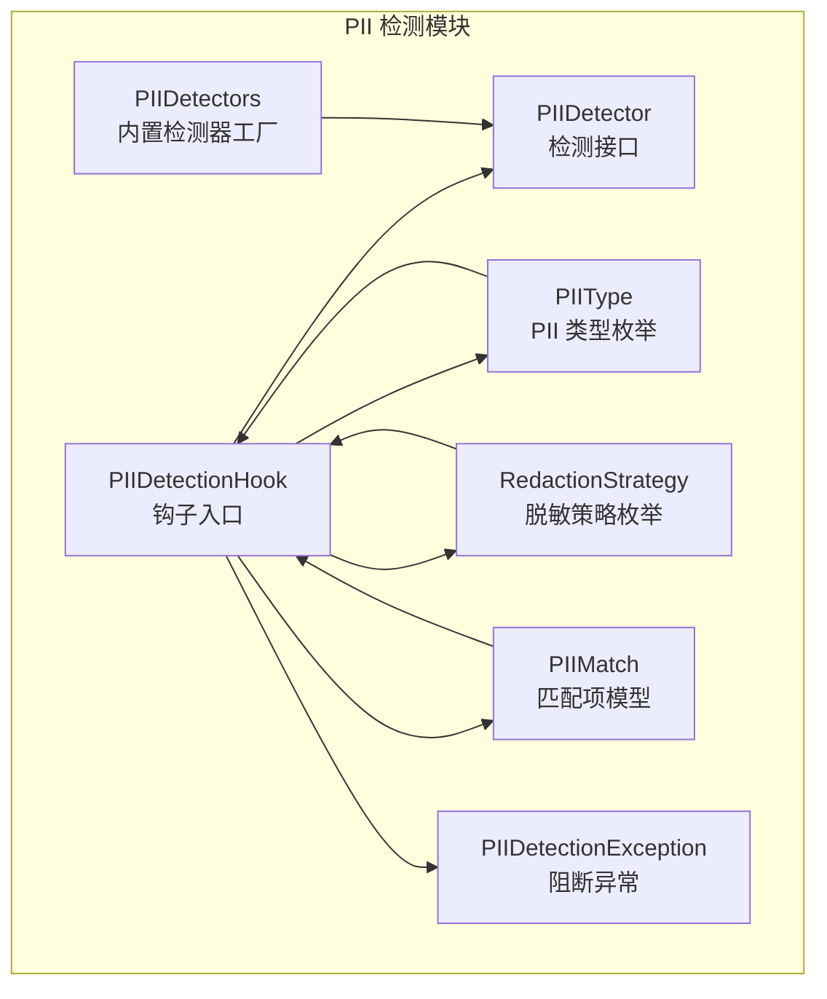
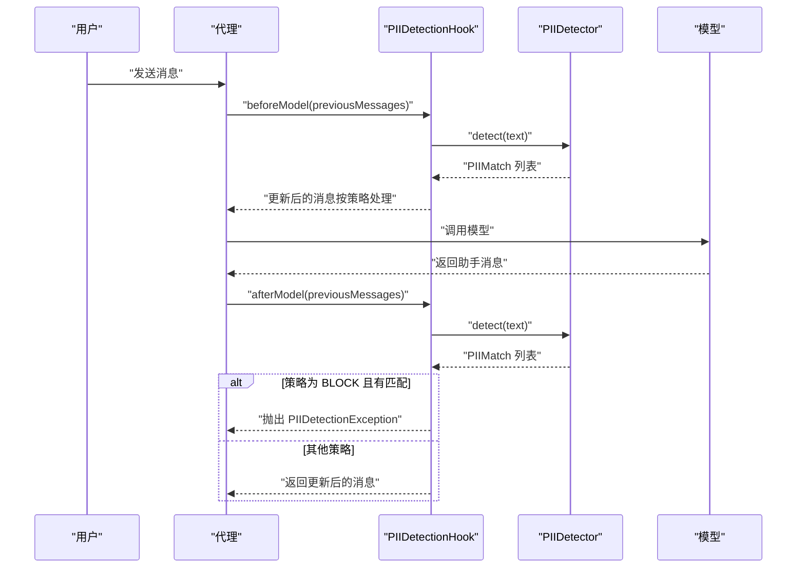
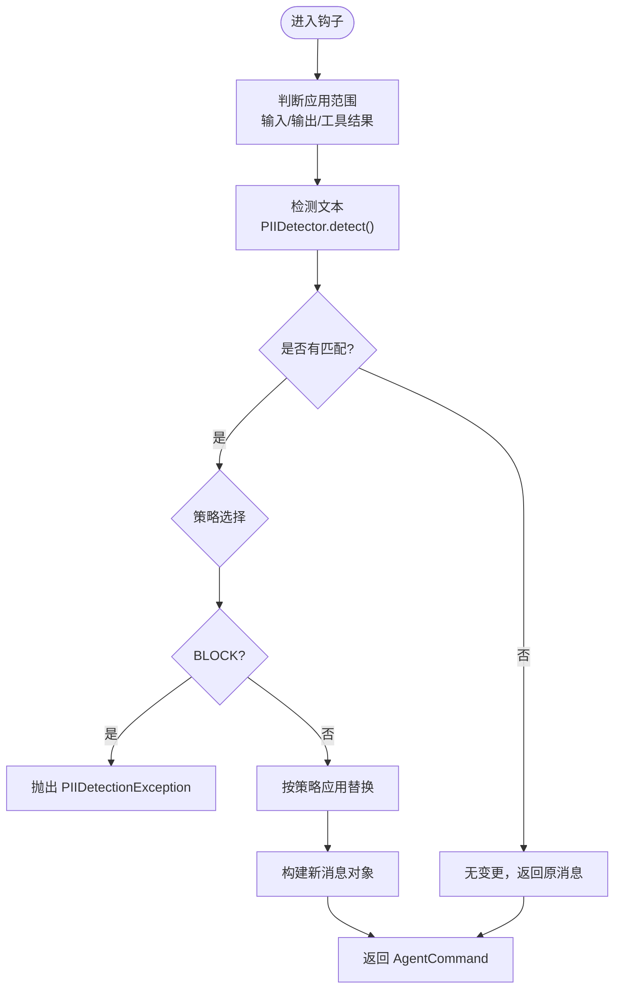
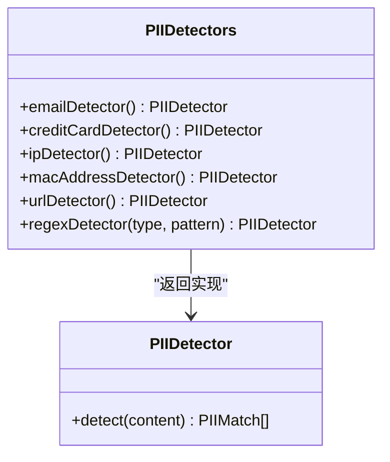
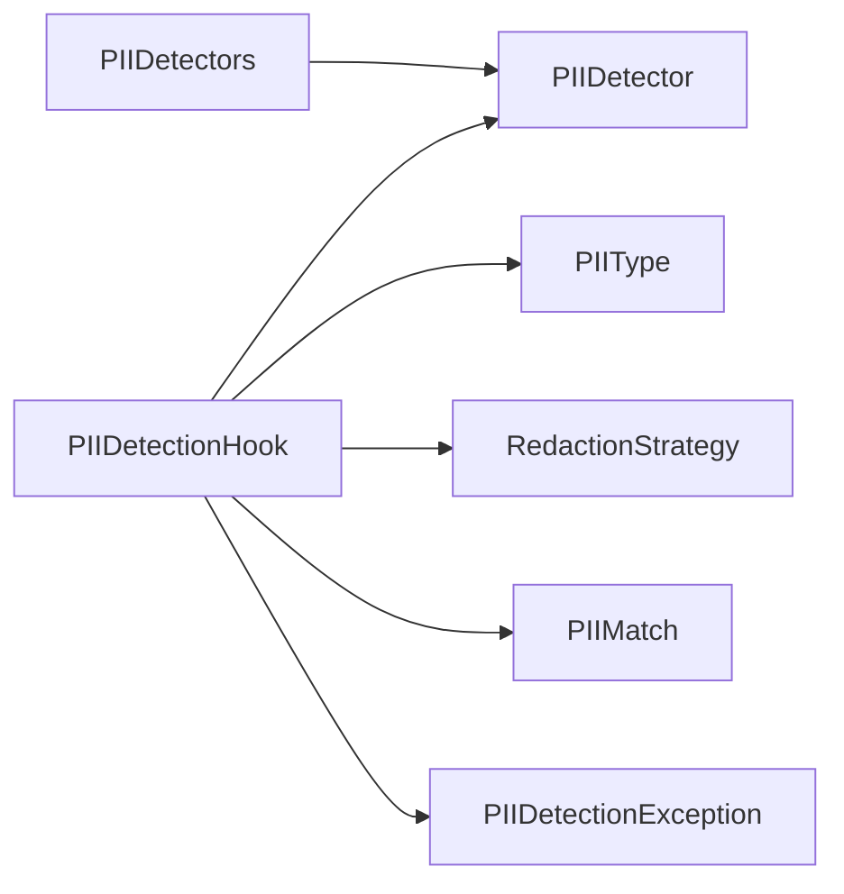

# 敏感信息检测钩子

<cite>
**本文引用的文件列表**
- [PIIDetectionHook.java](file://spring-ai-alibaba-agent-framework/src/main/java/com/alibaba/cloud/ai/graph/agent/hook/pii/PIIDetectionHook.java)
- [PIIDetector.java](file://spring-ai-alibaba-agent-framework/src/main/java/com/alibaba/cloud/ai/graph/agent/hook/pii/PIIDetector.java)
- [PIIDetectors.java](file://spring-ai-alibaba-agent-framework/src/main/java/com/alibaba/cloud/ai/graph/agent/hook/pii/PIIDetectors.java)
- [PIIMatch.java](file://spring-ai-alibaba-agent-framework/src/main/java/com/alibaba/cloud/ai/graph/agent/hook/pii/PIIMatch.java)
- [PIIType.java](file://spring-ai-alibaba-agent-framework/src/main/java/com/alibaba/cloud/ai/graph/agent/hook/pii/PIIType.java)
- [RedactionStrategy.java](file://spring-ai-alibaba-agent-framework/src/main/java/com/alibaba/cloud/ai/graph/agent/hook/pii/RedactionStrategy.java)
- [PIIDetectionException.java](file://spring-ai-alibaba-agent-framework/src/main/java/com/alibaba/cloud/ai/graph/agent/hook/pii/PIIDetectionException.java)
- [PIIDectionHookTest.java](file://spring-ai-alibaba-agent-framework/src/test/java/com/alibaba/cloud/ai/graph/agent/hooks/pii/PIIDectionHookTest.java)
- [HooksExample.java](file://examples/documentation/src/main/java/com/alibaba/cloud/ai/examples/documentation/framework/tutorials/HooksExample.java)
</cite>

## 目录
1. [简介](#简介)
2. [项目结构](#项目结构)
3. [核心组件](#核心组件)
4. [架构总览](#架构总览)
5. [组件详解](#组件详解)
6. [依赖关系分析](#依赖关系分析)
7. [性能与复杂度](#性能与复杂度)
8. [配置与使用示例](#配置与使用示例)
9. [故障排查](#故障排查)
10. [结论](#结论)
11. [附录](#附录)

## 简介
本文件围绕 PIIDetectionHook 钩子展开，系统性说明其在代理处理用户输入或生成响应前对个人身份信息（PII）进行检测与保护的机制。PII 包括但不限于邮箱、信用卡号、IP 地址、MAC 地址、URL 等。通过可插拔的检测器与多种脱敏策略（屏蔽、删除占位、掩码、哈希），PIIDetectionHook 能在不同阶段拦截并处理敏感内容，满足金融、医疗等高敏感领域的数据安全与隐私合规要求。

## 项目结构
PIIDetectionHook 及相关组件位于 agent 框架的 hook 子模块中，采用“接口 + 枚举 + 实现 + 工具类”的分层设计：
- 接口与类型：PIIDetector、PIIType、RedactionStrategy、PIIMatch
- 核心钩子：PIIDetectionHook
- 内置检测器工厂：PIIDetectors
- 异常：PIIDetectionException
- 示例与测试：HooksExample、PIIDectionHookTest

图表来源
- [PIIDetectionHook.java](file://spring-ai-alibaba-agent-framework/src/main/java/com/alibaba/cloud/ai/graph/agent/hook/pii/PIIDetectionHook.java#L1-L380)
- [PIIDetector.java](file://spring-ai-alibaba-agent-framework/src/main/java/com/alibaba/cloud/ai/graph/agent/hook/pii/PIIDetector.java#L1-L34)
- [PIIDetectors.java](file://spring-ai-alibaba-agent-framework/src/main/java/com/alibaba/cloud/ai/graph/agent/hook/pii/PIIDetectors.java#L1-L152)
- [PIIType.java](file://spring-ai-alibaba-agent-framework/src/main/java/com/alibaba/cloud/ai/graph/agent/hook/pii/PIIType.java#L1-L30)
- [RedactionStrategy.java](file://spring-ai-alibaba-agent-framework/src/main/java/com/alibaba/cloud/ai/graph/agent/hook/pii/RedactionStrategy.java#L1-L35)
- [PIIMatch.java](file://spring-ai-alibaba-agent-framework/src/main/java/com/alibaba/cloud/ai/graph/agent/hook/pii/PIIMatch.java#L1-L42)
- [PIIDetectionException.java](file://spring-ai-alibaba-agent-framework/src/main/java/com/alibaba/cloud/ai/graph/agent/hook/pii/PIIDetectionException.java#L1-L48)

章节来源
- [PIIDetectionHook.java](file://spring-ai-alibaba-agent-framework/src/main/java/com/alibaba/cloud/ai/graph/agent/hook/pii/PIIDetectionHook.java#L1-L380)
- [PIIDetectors.java](file://spring-ai-alibaba-agent-framework/src/main/java/com/alibaba/cloud/ai/graph/agent/hook/pii/PIIDetectors.java#L1-L152)

## 核心组件
- PIIDetectionHook：在模型调用前后拦截消息，基于配置的 PII 类型与策略执行检测与处理。
- PIIDetector：检测接口，接收文本并返回匹配项列表。
- PIIDetectors：内置常见类型的检测器工厂（邮箱、信用卡、IP、MAC、URL），以及基于正则表达式的自定义检测器。
- PIIMatch：检测结果项，包含类型、值及在原文中的位置。
- PIIType：PII 类型枚举（EMAIL、CREDIT_CARD、IP、MAC_ADDRESS、URL、CUSTOM）。
- RedactionStrategy：脱敏策略枚举（BLOCK、REDACT、MASK、HASH）。
- PIIDetectionException：当策略为 BLOCK 且检测到 PII 时抛出的异常。

章节来源
- [PIIDetectionHook.java](file://spring-ai-alibaba-agent-framework/src/main/java/com/alibaba/cloud/ai/graph/agent/hook/pii/PIIDetectionHook.java#L1-L380)
- [PIIDetector.java](file://spring-ai-alibaba-agent-framework/src/main/java/com/alibaba/cloud/ai/graph/agent/hook/pii/PIIDetector.java#L1-L34)
- [PIIDetectors.java](file://spring-ai-alibaba-agent-framework/src/main/java/com/alibaba/cloud/ai/graph/agent/hook/pii/PIIDetectors.java#L1-L152)
- [PIIMatch.java](file://spring-ai-alibaba-agent-framework/src/main/java/com/alibaba/cloud/ai/graph/agent/hook/pii/PIIMatch.java#L1-L42)
- [PIIType.java](file://spring-ai-alibaba-agent-framework/src/main/java/com/alibaba/cloud/ai/graph/agent/hook/pii/PIIType.java#L1-L30)
- [RedactionStrategy.java](file://spring-ai-alibaba-agent-framework/src/main/java/com/alibaba/cloud/ai/graph/agent/hook/pii/RedactionStrategy.java#L1-L35)
- [PIIDetectionException.java](file://spring-ai-alibaba-agent-framework/src/main/java/com/alibaba/cloud/ai/graph/agent/hook/pii/PIIDetectionException.java#L1-L48)

## 架构总览
PIIDetectionHook 继承自消息模型钩子，在两个关键时机参与：
- 模型调用前（BEFORE_MODEL）：处理用户输入与工具结果，按策略替换敏感内容。
- 模型调用后（AFTER_MODEL）：处理助手输出，按策略替换敏感内容。

图表来源
- [PIIDetectionHook.java](file://spring-ai-alibaba-agent-framework/src/main/java/com/alibaba/cloud/ai/graph/agent/hook/pii/PIIDetectionHook.java#L72-L152)
- [PIIDetectors.java](file://spring-ai-alibaba-agent-framework/src/main/java/com/alibaba/cloud/ai/graph/agent/hook/pii/PIIDetectors.java#L44-L111)
- [PIIDetectionException.java](file://spring-ai-alibaba-agent-framework/src/main/java/com/alibaba/cloud/ai/graph/agent/hook/pii/PIIDetectionException.java#L1-L48)

## 组件详解

### PIIDetectionHook：钩子工作流与策略应用
- 配置项
  - PII 类型：指定检测范围（如 EMAIL、CREDIT_CARD、IP、MAC_ADDRESS、URL、CUSTOM）。
  - 脱敏策略：BLOCK、REDACT、MASK、HASH。
  - 应用范围：是否应用于输入、输出、工具结果。
  - 自定义检测器：可注入自定义 PIIDetector。
- 处理逻辑
  - 输入阶段：对用户消息与工具结果进行检测与替换；若策略为 BLOCK 且检测到匹配则抛出异常。
  - 输出阶段：仅在启用 applyToOutput 时处理助手最后一条消息；同样支持 BLOCK 抛异常与非 BLOCK 替换。
  - 策略应用：按匹配项起止位置拼接文本，分别执行占位替换、掩码、哈希或直接阻断。
- 名称与跳转：钩子名称包含 PII 类型标识；当前不支持跳转。

图表来源
- [PIIDetectionHook.java](file://spring-ai-alibaba-agent-framework/src/main/java/com/alibaba/cloud/ai/graph/agent/hook/pii/PIIDetectionHook.java#L154-L231)
- [PIIDetectionHook.java](file://spring-ai-alibaba-agent-framework/src/main/java/com/alibaba/cloud/ai/graph/agent/hook/pii/PIIDetectionHook.java#L233-L278)
- [PIIDetectionException.java](file://spring-ai-alibaba-agent-framework/src/main/java/com/alibaba/cloud/ai/graph/agent/hook/pii/PIIDetectionException.java#L1-L48)

章节来源
- [PIIDetectionHook.java](file://spring-ai-alibaba-agent-framework/src/main/java/com/alibaba/cloud/ai/graph/agent/hook/pii/PIIDetectionHook.java#L52-L152)
- [PIIDetectionHook.java](file://spring-ai-alibaba-agent-framework/src/main/java/com/alibaba/cloud/ai/graph/agent/hook/pii/PIIDetectionHook.java#L154-L231)
- [PIIDetectionHook.java](file://spring-ai-alibaba-agent-framework/src/main/java/com/alibaba/cloud/ai/graph/agent/hook/pii/PIIDetectionHook.java#L233-L315)

### PIIDetector 与 PIIDetectors：检测实现机制
- PIIDetector：函数式接口，输入文本，输出匹配项列表。
- PIIDetectors：内置检测器工厂
  - 邮箱：基于正则匹配。
  - 信用卡：基于正则匹配并通过 Luhn 校验。
  - IP：基于正则匹配并通过 InetAddress 解析校验。
  - MAC 地址：基于正则匹配。
  - URL：基于正则匹配。
  - 自定义：regexDetector(type, pattern) 支持任意正则与类型名。

图表来源
- [PIIDetector.java](file://spring-ai-alibaba-agent-framework/src/main/java/com/alibaba/cloud/ai/graph/agent/hook/pii/PIIDetector.java#L1-L34)
- [PIIDetectors.java](file://spring-ai-alibaba-agent-framework/src/main/java/com/alibaba/cloud/ai/graph/agent/hook/pii/PIIDetectors.java#L1-L152)

章节来源
- [PIIDetector.java](file://spring-ai-alibaba-agent-framework/src/main/java/com/alibaba/cloud/ai/graph/agent/hook/pii/PIIDetector.java#L1-L34)
- [PIIDetectors.java](file://spring-ai-alibaba-agent-framework/src/main/java/com/alibaba/cloud/ai/graph/agent/hook/pii/PIIDetectors.java#L29-L150)

### PIIMatch：匹配项模型
- 字段：type（类型）、value（匹配值）、start/end（在原文中的位置）。
- 用途：作为检测结果载体，供策略应用时定位替换区间。

章节来源
- [PIIMatch.java](file://spring-ai-alibaba-agent-framework/src/main/java/com/alibaba/cloud/ai/graph/agent/hook/pii/PIIMatch.java#L1-L42)

### PIIType 与 RedactionStrategy：类型与策略
- PIIType：EMAIL、CREDIT_CARD、IP、MAC_ADDRESS、URL、CUSTOM。
- RedactionStrategy：
  - BLOCK：检测到即抛异常，适合强合规场景。
  - REDACT：以占位符替换，适合审计与日志脱敏。
  - MASK：部分掩码（如信用卡尾数可见），适合展示与调试。
  - HASH：确定性哈希，适合匿名化存储。

章节来源
- [PIIType.java](file://spring-ai-alibaba-agent-framework/src/main/java/com/alibaba/cloud/ai/graph/agent/hook/pii/PIIType.java#L1-L30)
- [RedactionStrategy.java](file://spring-ai-alibaba-agent-framework/src/main/java/com/alibaba/cloud/ai/graph/agent/hook/pii/RedactionStrategy.java#L1-L35)

### PIIDetectionException：阻断异常
- 触发条件：策略为 BLOCK 且检测到匹配。
- 结构：包含 PII 类型与匹配列表，便于上层记录与告警。

章节来源
- [PIIDetectionException.java](file://spring-ai-alibaba-agent-framework/src/main/java/com/alibaba/cloud/ai/graph/agent/hook/pii/PIIDetectionException.java#L1-L48)

## 依赖关系分析
- PIIDetectionHook 依赖
  - PIIDetector：用于检测文本。
  - PIIType/RedactionStrategy：决定默认检测器与策略行为。
  - PIIMatch：承载检测结果。
  - PIIDetectionException：策略阻断时抛出。
- PIIDetectors 依赖
  - 正则表达式与校验逻辑（Luhn、InetAddress）。
- 测试与示例
  - HooksExample 展示基本配置与集成。
  - PIIDectionHookTest 展示 REDACT、MASK、BLOCK、自定义检测器的使用。

图表来源
- [PIIDetectionHook.java](file://spring-ai-alibaba-agent-framework/src/main/java/com/alibaba/cloud/ai/graph/agent/hook/pii/PIIDetectionHook.java#L52-L152)
- [PIIDetectors.java](file://spring-ai-alibaba-agent-framework/src/main/java/com/alibaba/cloud/ai/graph/agent/hook/pii/PIIDetectors.java#L44-L111)

章节来源
- [PIIDetectionHook.java](file://spring-ai-alibaba-agent-framework/src/main/java/com/alibaba/cloud/ai/graph/agent/hook/pii/PIIDetectionHook.java#L52-L152)
- [PIIDetectors.java](file://spring-ai-alibaba-agent-framework/src/main/java/com/alibaba/cloud/ai/graph/agent/hook/pii/PIIDetectors.java#L44-L111)

## 性能与复杂度
- 时间复杂度
  - 单次检测：O(n)，n 为文本长度；正则匹配与校验（如 Luhn、IP 解析）通常线性或近似线性。
  - 合并替换：按匹配项排序后线性拼接，整体 O(n + k log k)，k 为匹配数。
- 空间复杂度
  - 检测结果列表与中间字符串构建，总体 O(n + k)。
- 优化建议
  - 对长文本分段处理或限制最大处理长度。
  - 缓存常用正则编译结果（当前已预编译）。
  - 在工具结果较多时，优先只处理必要字段，避免全量扫描。

[本节为通用性能讨论，不直接分析具体文件]

## 配置与使用示例
以下示例均来自仓库中的示例与测试文件，展示如何启用 PII 检测并选择脱敏策略。

- 基础配置（邮箱检测 + 占位替换）
  - 关键点：设置 PII 类型为 EMAIL，策略为 REDACT，启用 applyToInput。
  - 示例路径：[HooksExample.java](file://examples/documentation/src/main/java/com/alibaba/cloud/ai/examples/documentation/framework/tutorials/HooksExample.java#L204-L208)

- 掩码策略（信用卡号）
  - 关键点：设置 PII 类型为 CREDIT_CARD，策略为 MASK，启用 applyToInput/applyToOutput。
  - 示例路径：[PIIDectionHookTest.java](file://spring-ai-alibaba-agent-framework/src/test/java/com/alibaba/cloud/ai/graph/agent/hooks/pii/PIIDectionHookTest.java#L94-L100)

- 阻断策略（IP 地址）
  - 关键点：设置 PII 类型为 IP，策略为 BLOCK，启用 applyToInput；调用时捕获 PIIDetectionException。
  - 示例路径：[PIIDectionHookTest.java](file://spring-ai-alibaba-agent-framework/src/test/java/com/alibaba/cloud/ai/graph/agent/hooks/pii/PIIDectionHookTest.java#L131-L137)

- 自定义检测器（手机号）
  - 关键点：使用 CUSTOM 类型并注入 regexDetector，匹配手机号模式。
  - 示例路径：[PIIDectionHookTest.java](file://spring-ai-alibaba-agent-framework/src/test/java/com/alibaba/cloud/ai/graph/agent/hooks/pii/PIIDectionHookTest.java#L184-L190)

- 钩子接入代理
  - 将 PIIDetectionHook 注入 ReactAgent 的 hooks 列表即可生效。
  - 示例路径：[HooksExample.java](file://examples/documentation/src/main/java/com/alibaba/cloud/ai/examples/documentation/framework/tutorials/HooksExample.java#L211-L215)

章节来源
- [HooksExample.java](file://examples/documentation/src/main/java/com/alibaba/cloud/ai/examples/documentation/framework/tutorials/HooksExample.java#L204-L215)
- [PIIDectionHookTest.java](file://spring-ai-alibaba-agent-framework/src/test/java/com/alibaba/cloud/ai/graph/agent/hooks/pii/PIIDectionHookTest.java#L54-L100)
- [PIIDectionHookTest.java](file://spring-ai-alibaba-agent-framework/src/test/java/com/alibaba/cloud/ai/graph/agent/hooks/pii/PIIDectionHookTest.java#L131-L137)
- [PIIDectionHookTest.java](file://spring-ai-alibaba-agent-framework/src/test/java/com/alibaba/cloud/ai/graph/agent/hooks/pii/PIIDectionHookTest.java#L184-L190)

## 故障排查
- BLOCK 策略导致流程中断
  - 现象：调用抛出 PIIDetectionException。
  - 处理：确认输入/输出是否包含策略所检测的类型；必要时调整策略或放宽检测范围。
  - 参考：[PIIDetectionException.java](file://spring-ai-alibaba-agent-framework/src/main/java/com/alibaba/cloud/ai/graph/agent/hook/pii/PIIDetectionException.java#L1-L48)
- 检测不到预期内容
  - 检查：PII 类型与策略是否匹配；applyToInput/applyToOutput 是否开启；自定义正则是否正确。
  - 参考：[PIIDetectors.java](file://spring-ai-alibaba-agent-framework/src/main/java/com/alibaba/cloud/ai/graph/agent/hook/pii/PIIDetectors.java#L44-L111)
- 工具结果未处理
  - 检查：是否启用 applyToToolResults。
  - 参考：[PIIDetectionHook.java](file://spring-ai-alibaba-agent-framework/src/main/java/com/alibaba/cloud/ai/graph/agent/hook/pii/PIIDetectionHook.java#L52-L66)

章节来源
- [PIIDetectionException.java](file://spring-ai-alibaba-agent-framework/src/main/java/com/alibaba/cloud/ai/graph/agent/hook/pii/PIIDetectionException.java#L1-L48)
- [PIIDetectors.java](file://spring-ai-alibaba-agent-framework/src/main/java/com/alibaba/cloud/ai/graph/agent/hook/pii/PIIDetectors.java#L44-L111)
- [PIIDetectionHook.java](file://spring-ai-alibaba-agent-framework/src/main/java/com/alibaba/cloud/ai/graph/agent/hook/pii/PIIDetectionHook.java#L52-L66)

## 结论
PIIDetectionHook 提供了灵活、可扩展的 PII 检测与脱敏能力，覆盖输入、输出与工具结果三大场景。通过内置检测器与自定义检测器结合，配合多种脱敏策略，可在金融、医疗等高敏感领域实现合规的数据处理与存储。建议在生产环境中：
- 明确合规需求，选择合适的 PII 类型与策略组合；
- 对 BLOCK 策略进行灰度发布与监控；
- 对长文本与高频调用场景进行性能评估与优化；
- 建立完善的异常告警与审计日志体系。

[本节为总结性内容，不直接分析具体文件]

## 附录
- 应用价值
  - 金融：防止卡号、账户信息泄露，满足支付与风控合规。
  - 医疗：保护病历、诊断、联系方式等敏感数据，符合 HIPAA、GDPR 等要求。
  - 公共服务：保障公民个人信息安全，降低数据泄露风险。

[本节为概念性内容，不直接分析具体文件]