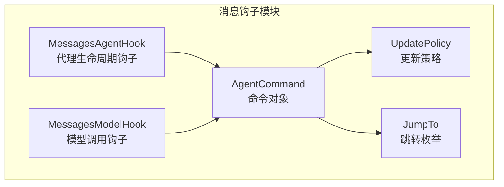
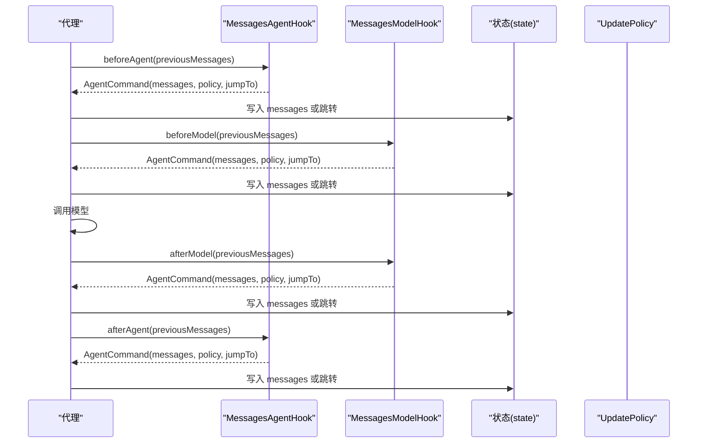
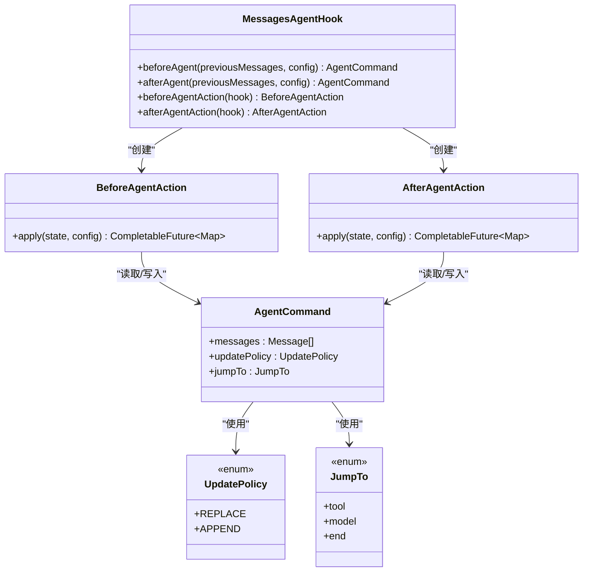
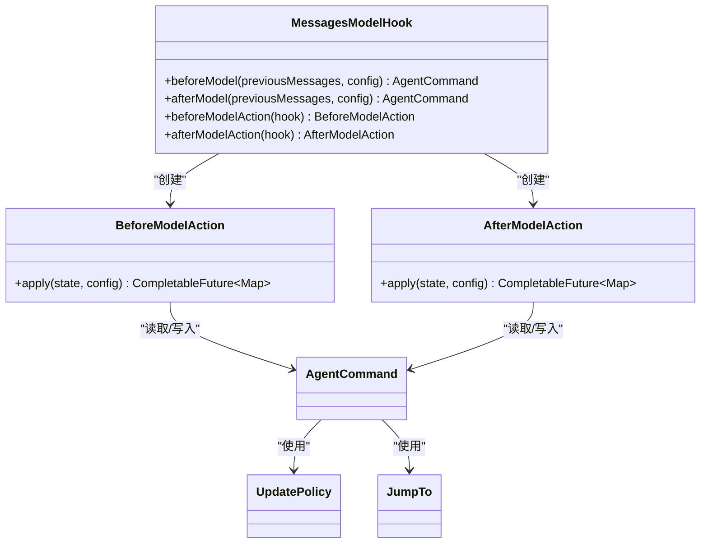
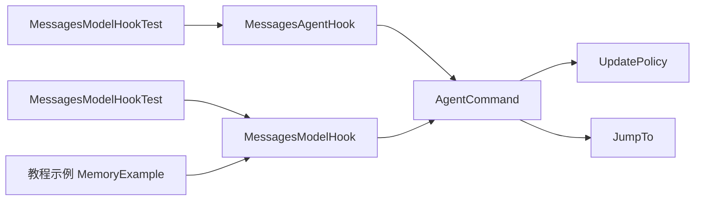

# 消息钩子

<cite>
**本文引用的文件**
- [MessagesAgentHook.java](file://spring-ai-alibaba-agent-framework/src/main/java/com/alibaba/cloud/ai/graph/agent/hook/messages/MessagesAgentHook.java)
- [MessagesModelHook.java](file://spring-ai-alibaba-agent-framework/src/main/java/com/alibaba/cloud/ai/graph/agent/hook/messages/MessagesModelHook.java)
- [UpdatePolicy.java](file://spring-ai-alibaba-agent-framework/src/main/java/com/alibaba/cloud/ai/graph/agent/hook/messages/UpdatePolicy.java)
- [AgentCommand.java](file://spring-ai-alibaba-agent-framework/src/main/java/com/alibaba/cloud/ai/graph/agent/hook/messages/AgentCommand.java)
- [JumpTo.java](file://spring-ai-alibaba-agent-framework/src/main/java/com/alibaba/cloud/ai/graph/agent/hook/JumpTo.java)
- [MessagesModelHookTest.java](file://spring-ai-alibaba-agent-framework/src/test/java/com/alibaba/cloud/ai/graph/agent/hooks/messages/MessagesModelHookTest.java)
- [MemoryExample.java（教程）](file://examples/documentation/src/main/java/com/alibaba/cloud/ai/examples/documentation/framework/tutorials/MemoryExample.java)
</cite>

## 目录
1. [简介](#简介)
2. [项目结构](#项目结构)
3. [核心组件](#核心组件)
4. [架构总览](#架构总览)
5. [组件详解](#组件详解)
6. [依赖关系分析](#依赖关系分析)
7. [性能与策略建议](#性能与策略建议)
8. [故障排查指南](#故障排查指南)
9. [结论](#结论)
10. [附录：使用示例路径](#附录使用示例路径)

## 简介
本篇文档围绕消息钩子体系，系统讲解 MessagesAgentHook 与 MessagesModelHook 如何协同管理代理的上下文消息列表，并通过 UpdatePolicy 控制消息的添加、更新与清理策略。文档还说明 AgentCommand 与 JumpTo 的配合机制，以及在模型调用前后对消息进行精细化控制的方法。最后提供可直接定位到仓库示例的路径，帮助读者快速上手配置与实践。

## 项目结构
消息钩子位于代理框架的 hook/messages 子包中，核心文件如下：
- MessagesAgentHook：代理生命周期的消息钩子抽象，支持 beforeAgent/afterAgent 两阶段命令式控制。
- MessagesModelHook：模型调用层的消息钩子抽象，支持 beforeModel/afterModel 两阶段命令式控制。
- UpdatePolicy：消息更新策略枚举，定义 REPLACE 与 APPEND 两种策略。
- AgentCommand：消息钩子返回的命令对象，承载消息列表、更新策略与跳转目标。
- JumpTo：工作流跳转枚举，支持 tool、model、end 三种跳转目的地。

图表来源
- [MessagesAgentHook.java](file://spring-ai-alibaba-agent-framework/src/main/java/com/alibaba/cloud/ai/graph/agent/hook/messages/MessagesAgentHook.java#L31-L136)
- [MessagesModelHook.java](file://spring-ai-alibaba-agent-framework/src/main/java/com/alibaba/cloud/ai/graph/agent/hook/messages/MessagesModelHook.java#L32-L149)
- [AgentCommand.java](file://spring-ai-alibaba-agent-framework/src/main/java/com/alibaba/cloud/ai/graph/agent/hook/messages/AgentCommand.java#L24-L71)
- [UpdatePolicy.java](file://spring-ai-alibaba-agent-framework/src/main/java/com/alibaba/cloud/ai/graph/agent/hook/messages/UpdatePolicy.java#L18-L33)
- [JumpTo.java](file://spring-ai-alibaba-agent-framework/src/main/java/com/alibaba/cloud/ai/graph/agent/hook/JumpTo.java#L25-L88)

章节来源
- [MessagesAgentHook.java](file://spring-ai-alibaba-agent-framework/src/main/java/com/alibaba/cloud/ai/graph/agent/hook/messages/MessagesAgentHook.java#L31-L136)
- [MessagesModelHook.java](file://spring-ai-alibaba-agent-framework/src/main/java/com/alibaba/cloud/ai/graph/agent/hook/messages/MessagesModelHook.java#L32-L149)
- [UpdatePolicy.java](file://spring-ai-alibaba-agent-framework/src/main/java/com/alibaba/cloud/ai/graph/agent/hook/messages/UpdatePolicy.java#L18-L33)
- [AgentCommand.java](file://spring-ai-alibaba-agent-framework/src/main/java/com/alibaba/cloud/ai/graph/agent/hook/messages/AgentCommand.java#L24-L71)
- [JumpTo.java](file://spring-ai-alibaba-agent-framework/src/main/java/com/alibaba/cloud/ai/graph/agent/hook/JumpTo.java#L25-L88)

## 核心组件
- MessagesAgentHook
  - 提供 beforeAgent/afterAgent 两个生命周期钩子入口，返回 AgentCommand 控制消息列表。
  - 通过 BeforeAgentAction/AfterAgentAction 将钩子适配为异步节点动作，写入 state 的 messages 字段或触发跳转。
- MessagesModelHook
  - 提供 beforeModel/afterModel 两个模型调用阶段钩子入口，返回 AgentCommand 控制消息列表。
  - 通过 BeforeModelAction/AfterModelAction 将钩子适配为异步节点动作，写入 state 的 messages 字段或触发跳转。
- AgentCommand
  - 携带消息列表、更新策略与可选的跳转目标 JumpTo。
  - 支持默认 REPLACE 策略或显式 APPEND 策略。
- UpdatePolicy
  - REPLACE：替换当前消息列表。
  - APPEND：在现有消息列表末尾追加新消息。
- JumpTo
  - tool：跳转到工具阶段。
  - model：跳转回模型阶段。
  - end：结束当前流程，跳过后续钩子。

章节来源
- [MessagesAgentHook.java](file://spring-ai-alibaba-agent-framework/src/main/java/com/alibaba/cloud/ai/graph/agent/hook/messages/MessagesAgentHook.java#L31-L136)
- [MessagesModelHook.java](file://spring-ai-alibaba-agent-framework/src/main/java/com/alibaba/cloud/ai/graph/agent/hook/messages/MessagesModelHook.java#L32-L149)
- [AgentCommand.java](file://spring-ai-alibaba-agent-framework/src/main/java/com/alibaba/cloud/ai/graph/agent/hook/messages/AgentCommand.java#L24-L71)
- [UpdatePolicy.java](file://spring-ai-alibaba-agent-framework/src/main/java/com/alibaba/cloud/ai/graph/agent/hook/messages/UpdatePolicy.java#L18-L33)
- [JumpTo.java](file://spring-ai-alibaba-agent-framework/src/main/java/com/alibaba/cloud/ai/graph/agent/hook/JumpTo.java#L25-L88)

## 架构总览
消息钩子在代理执行流程中的位置如下：
- 代理生命周期钩子（MessagesAgentHook）：在一次完整代理执行前后注入消息控制逻辑。
- 模型调用钩子（MessagesModelHook）：在每次模型调用前/后注入消息控制逻辑。
- 命令式控制：通过 AgentCommand 返回消息列表与策略，驱动 state 的 messages 字段更新。
- 跳转控制：通过 JumpTo 实现工作流跳转，支持 end 跳过后续钩子。

图表来源
- [MessagesAgentHook.java](file://spring-ai-alibaba-agent-framework/src/main/java/com/alibaba/cloud/ai/graph/agent/hook/messages/MessagesAgentHook.java#L31-L136)
- [MessagesModelHook.java](file://spring-ai-alibaba-agent-framework/src/main/java/com/alibaba/cloud/ai/graph/agent/hook/messages/MessagesModelHook.java#L32-L149)
- [AgentCommand.java](file://spring-ai-alibaba-agent-framework/src/main/java/com/alibaba/cloud/ai/graph/agent/hook/messages/AgentCommand.java#L24-L71)
- [UpdatePolicy.java](file://spring-ai-alibaba-agent-framework/src/main/java/com/alibaba/cloud/ai/graph/agent/hook/messages/UpdatePolicy.java#L18-L33)
- [JumpTo.java](file://spring-ai-alibaba-agent-framework/src/main/java/com/alibaba/cloud/ai/graph/agent/hook/JumpTo.java#L25-L88)

## 组件详解

### MessagesAgentHook：代理生命周期消息管理
- 生命周期钩子
  - beforeAgent：在一次完整代理执行开始前，基于 previousMessages 生成 AgentCommand。
  - afterAgent：在一次完整代理执行结束后，基于 previousMessages 生成 AgentCommand。
- 异步动作适配
  - BeforeAgentAction/AfterAgentAction 将钩子转换为 AsyncNodeActionWithConfig，从 state 中读取 messages 并写回。
  - 当 UpdatePolicy 为 REPLACE 时，使用 ReplaceAllWith 包装消息列表，确保完全替换；否则直接追加。
  - 若 AgentCommand 指定 JumpTo，则向 state 注入 jump_to 键，驱动流程跳转。
- 典型用途
  - 在代理开始前注入系统提示或上下文摘要，在代理结束后清理或归档历史。

图表来源
- [MessagesAgentHook.java](file://spring-ai-alibaba-agent-framework/src/main/java/com/alibaba/cloud/ai/graph/agent/hook/messages/MessagesAgentHook.java#L31-L136)
- [AgentCommand.java](file://spring-ai-alibaba-agent-framework/src/main/java/com/alibaba/cloud/ai/graph/agent/hook/messages/AgentCommand.java#L24-L71)
- [UpdatePolicy.java](file://spring-ai-alibaba-agent-framework/src/main/java/com/alibaba/cloud/ai/graph/agent/hook/messages/UpdatePolicy.java#L18-L33)
- [JumpTo.java](file://spring-ai-alibaba-agent-framework/src/main/java/com/alibaba/cloud/ai/graph/agent/hook/JumpTo.java#L25-L88)

章节来源
- [MessagesAgentHook.java](file://spring-ai-alibaba-agent-framework/src/main/java/com/alibaba/cloud/ai/graph/agent/hook/messages/MessagesAgentHook.java#L31-L136)

### MessagesModelHook：模型调用层消息管理
- 模型阶段钩子
  - beforeModel：在模型调用前，基于 previousMessages 生成 AgentCommand，常用于消息修剪、注入上下文等。
  - afterModel：在模型调用后，基于 previousMessages 生成 AgentCommand，常用于清理旧消息、注入总结等。
- 异步动作适配
  - BeforeModelAction/AfterModelAction 与 MessagesAgentHook 类似，负责从 state 读取消息并写回，支持 REPLACE/APPEND 与 JumpTo。
- 典型用途
  - 消息修剪：仅保留关键上下文，避免超出上下文窗口。
  - 消息删除：在模型响应后清理过期历史。
  - 消息总结：在 afterModel 阶段注入总结消息，压缩历史。

图表来源
- [MessagesModelHook.java](file://spring-ai-alibaba-agent-framework/src/main/java/com/alibaba/cloud/ai/graph/agent/hook/messages/MessagesModelHook.java#L32-L149)
- [AgentCommand.java](file://spring-ai-alibaba-agent-framework/src/main/java/com/alibaba/cloud/ai/graph/agent/hook/messages/AgentCommand.java#L24-L71)
- [UpdatePolicy.java](file://spring-ai-alibaba-agent-framework/src/main/java/com/alibaba/cloud/ai/graph/agent/hook/messages/UpdatePolicy.java#L18-L33)
- [JumpTo.java](file://spring-ai-alibaba-agent-framework/src/main/java/com/alibaba/cloud/ai/graph/agent/hook/JumpTo.java#L25-L88)

章节来源
- [MessagesModelHook.java](file://spring-ai-alibaba-agent-framework/src/main/java/com/alibaba/cloud/ai/graph/agent/hook/messages/MessagesModelHook.java#L32-L149)

### UpdatePolicy：更新策略
- REPLACE
  - 完全替换当前消息列表，适用于需要清空历史或注入全新上下文的场景。
  - 在钩子内部通过 ReplaceAllWith 包装消息列表实现。
- APPEND
  - 在现有消息列表末尾追加新消息，适用于增量扩展上下文的场景。
- 适用场景
  - REPLACE：消息修剪、注入系统提示、重置上下文。
  - APPEND：追加工具调用结果、补充用户输入、累积上下文。

章节来源
- [UpdatePolicy.java](file://spring-ai-alibaba-agent-framework/src/main/java/com/alibaba/cloud/ai/graph/agent/hook/messages/UpdatePolicy.java#L18-L33)
- [MessagesAgentHook.java](file://spring-ai-alibaba-agent-framework/src/main/java/com/alibaba/cloud/ai/graph/agent/hook/messages/MessagesAgentHook.java#L80-L100)
- [MessagesModelHook.java](file://spring-ai-alibaba-agent-framework/src/main/java/com/alibaba/cloud/ai/graph/agent/hook/messages/MessagesModelHook.java#L90-L112)

### AgentCommand 与 JumpTo：命令式控制
- AgentCommand
  - 携带 messages、updatePolicy、jumpTo 三个字段，用于统一描述消息变更意图。
  - 默认 updatePolicy 为 REPLACE，便于安全覆盖。
- JumpTo
  - tool：跳转到工具阶段，适合在消息层面决定进入工具选择或执行。
  - model：跳转回模型阶段，适合在工具执行后重新评估上下文。
  - end：结束当前流程，跳过后续钩子，常用于提前终止或短路。

章节来源
- [AgentCommand.java](file://spring-ai-alibaba-agent-framework/src/main/java/com/alibaba/cloud/ai/graph/agent/hook/messages/AgentCommand.java#L24-L71)
- [JumpTo.java](file://spring-ai-alibaba-agent-framework/src/main/java/com/alibaba/cloud/ai/graph/agent/hook/JumpTo.java#L25-L88)

### 示例：消息修剪与删除（基于仓库示例）
- 教程示例中提供了多种消息钩子实践：
  - 自定义内存钩子（仅访问消息，不修改）：[CustomMemoryHook](file://examples/documentation/src/main/java/com/alibaba/cloud/ai/examples/documentation/framework/tutorials/MemoryExample.java#L331-L347)
  - 消息修剪钩子（在模型调用前修剪消息列表，使用 REPLACE 策略）：[MessageTrimmingHook](file://examples/documentation/src/main/java/com/alibaba/cloud/ai/examples/documentation/framework/tutorials/MemoryExample.java#L354-L390)
  - 消息删除钩子（在模型调用后删除最早的消息，使用 APPEND 策略）：[MessageDeletionHook](file://examples/documentation/src/main/java/com/alibaba/cloud/ai/examples/documentation/framework/tutorials/MemoryExample.java#L398-L430)
- 单元测试验证了：
  - REPLACE/APPEND 策略的行为差异。
  - JumpTo end 的跳过后续钩子行为。
  - MessagesModelHook 与 ModelHook 可共同工作。

章节来源
- [MemoryExample.java（教程）](file://examples/documentation/src/main/java/com/alibaba/cloud/ai/examples/documentation/framework/tutorials/MemoryExample.java#L331-L430)
- [MessagesModelHookTest.java](file://spring-ai-alibaba-agent-framework/src/test/java/com/alibaba/cloud/ai/graph/agent/hooks/messages/MessagesModelHookTest.java#L91-L189)
- [MessagesModelHookTest.java](file://spring-ai-alibaba-agent-framework/src/test/java/com/alibaba/cloud/ai/graph/agent/hooks/messages/MessagesModelHookTest.java#L200-L344)

## 依赖关系分析
- MessagesAgentHook 与 MessagesModelHook 共享相同的命令式接口与策略模式，分别作用于代理生命周期与模型调用阶段。
- AgentCommand 是两者之间的契约载体，统一了消息列表、策略与跳转目标。
- UpdatePolicy 与 JumpTo 为策略与流程控制的关键枚举，贯穿钩子执行链路。
- 测试用例验证了策略与跳转的正确性，并展示了与 ModelHook 的协作。

图表来源
- [MessagesAgentHook.java](file://spring-ai-alibaba-agent-framework/src/main/java/com/alibaba/cloud/ai/graph/agent/hook/messages/MessagesAgentHook.java#L31-L136)
- [MessagesModelHook.java](file://spring-ai-alibaba-agent-framework/src/main/java/com/alibaba/cloud/ai/graph/agent/hook/messages/MessagesModelHook.java#L32-L149)
- [AgentCommand.java](file://spring-ai-alibaba-agent-framework/src/main/java/com/alibaba/cloud/ai/graph/agent/hook/messages/AgentCommand.java#L24-L71)
- [UpdatePolicy.java](file://spring-ai-alibaba-agent-framework/src/main/java/com/alibaba/cloud/ai/graph/agent/hook/messages/UpdatePolicy.java#L18-L33)
- [JumpTo.java](file://spring-ai-alibaba-agent-framework/src/main/java/com/alibaba/cloud/ai/graph/agent/hook/JumpTo.java#L25-L88)
- [MessagesModelHookTest.java](file://spring-ai-alibaba-agent-framework/src/test/java/com/alibaba/cloud/ai/graph/agent/hooks/messages/MessagesModelHookTest.java#L91-L189)
- [MemoryExample.java（教程）](file://examples/documentation/src/main/java/com/alibaba/cloud/ai/examples/documentation/framework/tutorials/MemoryExample.java#L331-L430)

章节来源
- [MessagesAgentHook.java](file://spring-ai-alibaba-agent-framework/src/main/java/com/alibaba/cloud/ai/graph/agent/hook/messages/MessagesAgentHook.java#L31-L136)
- [MessagesModelHook.java](file://spring-ai-alibaba-agent-framework/src/main/java/com/alibaba/cloud/ai/graph/agent/hook/messages/MessagesModelHook.java#L32-L149)
- [AgentCommand.java](file://spring-ai-alibaba-agent-framework/src/main/java/com/alibaba/cloud/ai/graph/agent/hook/messages/AgentCommand.java#L24-L71)
- [UpdatePolicy.java](file://spring-ai-alibaba-agent-framework/src/main/java/com/alibaba/cloud/ai/graph/agent/hook/messages/UpdatePolicy.java#L18-L33)
- [JumpTo.java](file://spring-ai-alibaba-agent-framework/src/main/java/com/alibaba/cloud/ai/graph/agent/hook/JumpTo.java#L25-L88)
- [MessagesModelHookTest.java](file://spring-ai-alibaba-agent-framework/src/test/java/com/alibaba/cloud/ai/graph/agent/hooks/messages/MessagesModelHookTest.java#L91-L189)
- [MemoryExample.java（教程）](file://examples/documentation/src/main/java/com/alibaba/cloud/ai/examples/documentation/framework/tutorials/MemoryExample.java#L331-L430)

## 性能与策略建议
- 上下文窗口控制
  - 使用 MessagesModelHook 的 beforeModel 阶段进行消息修剪，优先保留首条系统消息与最近若干条用户/助手消息，避免超出模型上下文窗口。
- 增量扩展
  - 对于工具调用结果或临时上下文，使用 APPEND 策略追加，减少不必要的全量替换。
- 清理与归档
  - 在 afterModel 阶段删除过期历史，保持消息列表规模可控，提升推理效率。
- 跳转优化
  - 利用 JumpTo.end 提前结束流程，避免无效的后续钩子执行，降低整体延迟。

[本节为通用建议，不直接分析具体文件]

## 故障排查指南
- 策略误用导致上下文丢失
  - 症状：消息被意外清空或重复。
  - 排查：确认钩子返回的 UpdatePolicy 是否符合预期；必要时在 beforeModel 使用 REPLACE 注入关键上下文，afterModel 使用 APPEND 补充结果。
- 跳转异常导致后续钩子缺失
  - 症状：某些钩子未执行。
  - 排查：检查 AgentCommand 的 JumpTo 设置；若使用 end，后续钩子将被跳过。
- 消息列表为空或类型不匹配
  - 症状：状态中 messages 字段缺失或类型不符。
  - 排查：确认钩子从 state 中读取 messages 的键名一致；确保返回的 messages 为 List<Message> 类型。

章节来源
- [MessagesAgentHook.java](file://spring-ai-alibaba-agent-framework/src/main/java/com/alibaba/cloud/ai/graph/agent/hook/messages/MessagesAgentHook.java#L80-L133)
- [MessagesModelHook.java](file://spring-ai-alibaba-agent-framework/src/main/java/com/alibaba/cloud/ai/graph/agent/hook/messages/MessagesModelHook.java#L90-L147)
- [AgentCommand.java](file://spring-ai-alibaba-agent-framework/src/main/java/com/alibaba/cloud/ai/graph/agent/hook/messages/AgentCommand.java#L24-L71)
- [JumpTo.java](file://spring-ai-alibaba-agent-framework/src/main/java/com/alibaba/cloud/ai/graph/agent/hook/JumpTo.java#L25-L88)

## 结论
MessagesAgentHook 与 MessagesModelHook 通过命令式接口与 UpdatePolicy、JumpTo 的组合，实现了对代理上下文消息的精细化控制。在代理生命周期与模型调用阶段分别注入消息策略，既能保证上下文完整性，又能控制消息规模与成本。结合教程与测试示例，可快速构建稳定、高效的上下文管理方案。

[本节为总结性内容，不直接分析具体文件]

## 附录：使用示例路径
以下为仓库内可直接参考的示例与测试，便于快速定位与复用：
- 教程示例
  - 自定义内存钩子（仅访问消息）：[CustomMemoryHook](file://examples/documentation/src/main/java/com/alibaba/cloud/ai/examples/documentation/framework/tutorials/MemoryExample.java#L331-L347)
  - 消息修剪钩子（使用 REPLACE 策略）：[MessageTrimmingHook](file://examples/documentation/src/main/java/com/alibaba/cloud/ai/examples/documentation/framework/tutorials/MemoryExample.java#L354-L390)
  - 消息删除钩子（使用 APPEND 策略）：[MessageDeletionHook](file://examples/documentation/src/main/java/com/alibaba/cloud/ai/examples/documentation/framework/tutorials/MemoryExample.java#L398-L430)
- 单元测试
  - REPLACE/APPEND 策略验证：[MessagesModelHookTest（策略测试）](file://spring-ai-alibaba-agent-framework/src/test/java/com/alibaba/cloud/ai/graph/agent/hooks/messages/MessagesModelHookTest.java#L91-L189)
  - JumpTo end 跳过后续钩子：[MessagesModelHookTest（跳转测试）](file://spring-ai-alibaba-agent-framework/src/test/java/com/alibaba/cloud/ai/graph/agent/hooks/messages/MessagesModelHookTest.java#L200-L344)
  - 与 ModelHook 协同工作：[MessagesModelHookTest（协同测试）](file://spring-ai-alibaba-agent-framework/src/test/java/com/alibaba/cloud/ai/graph/agent/hooks/messages/MessagesModelHookTest.java#L304-L344)

章节来源
- [MemoryExample.java（教程）](file://examples/documentation/src/main/java/com/alibaba/cloud/ai/examples/documentation/framework/tutorials/MemoryExample.java#L331-L430)
- [MessagesModelHookTest.java](file://spring-ai-alibaba-agent-framework/src/test/java/com/alibaba/cloud/ai/graph/agent/hooks/messages/MessagesModelHookTest.java#L91-L189)
- [MessagesModelHookTest.java](file://spring-ai-alibaba-agent-framework/src/test/java/com/alibaba/cloud/ai/graph/agent/hooks/messages/MessagesModelHookTest.java#L200-L344)
- [MessagesModelHookTest.java](file://spring-ai-alibaba-agent-framework/src/test/java/com/alibaba/cloud/ai/graph/agent/hooks/messages/MessagesModelHookTest.java#L304-L344)