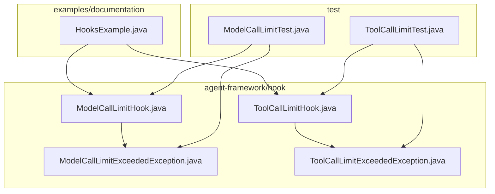
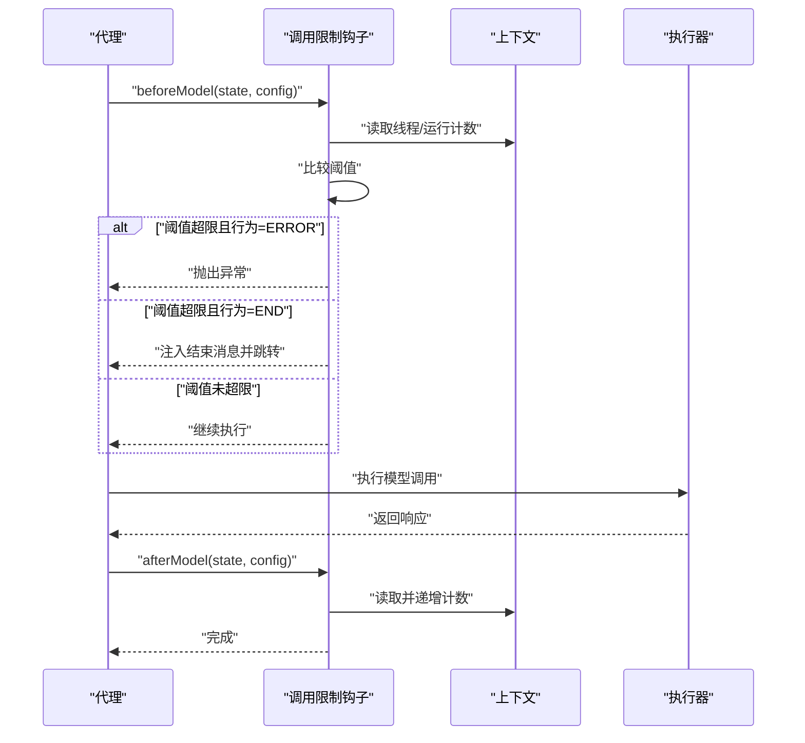
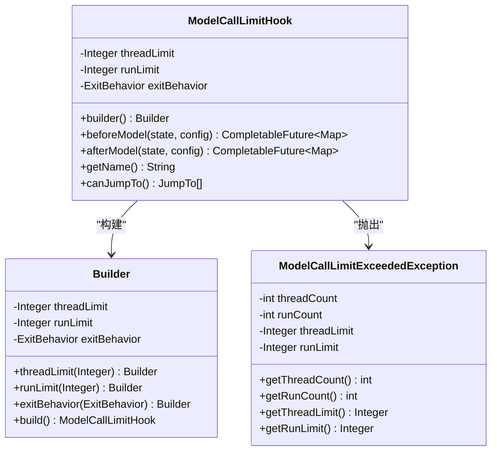
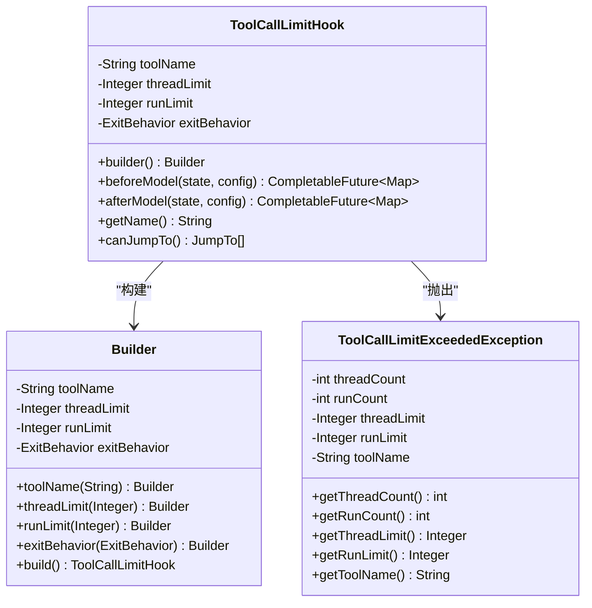
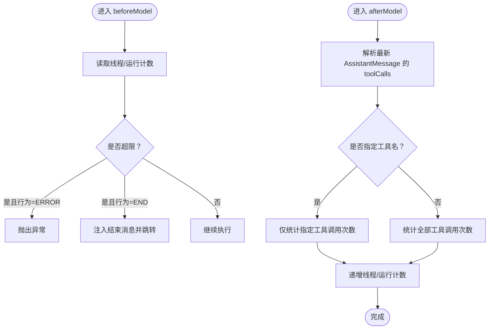
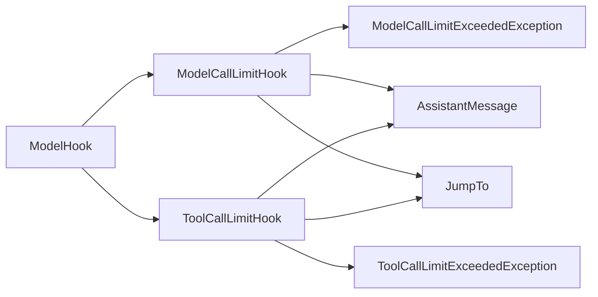

# 调用限制钩子

<cite>
**本文引用的文件**
- [ModelCallLimitHook.java](file://spring-ai-alibaba-agent-framework/src/main/java/com/alibaba/cloud/ai/graph/agent/hook/modelcalllimit/ModelCallLimitHook.java)
- [ToolCallLimitHook.java](file://spring-ai-alibaba-agent-framework/src/main/java/com/alibaba/cloud/ai/graph/agent/hook/toolcalllimit/ToolCallLimitHook.java)
- [ModelCallLimitExceededException.java](file://spring-ai-alibaba-agent-framework/src/main/java/com/alibaba/cloud/ai/graph/agent/hook/modelcalllimit/ModelCallLimitExceededException.java)
- [ToolCallLimitExceededException.java](file://spring-ai-alibaba-agent-framework/src/main/java/com/alibaba/cloud/ai/graph/agent/hook/toolcalllimit/ToolCallLimitExceededException.java)
- [ModelCallLimitTest.java](file://spring-ai-alibaba-agent-framework/src/test/java/com/alibaba/cloud/ai/graph/agent/hooks/modelcalllimit/ModelCallLimitTest.java)
- [ToolCallLimitTest.java](file://spring-ai-alibaba-agent-framework/src/test/java/com/alibaba/cloud/ai/graph/agent/hooks/toolcalllimit/ToolCallLimitTest.java)
- [HooksExample.java](file://examples/documentation/src/main/java/com/alibaba/cloud/ai/examples/documentation/framework/tutorials/HooksExample.java)
</cite>

## 目录
1. [简介](#简介)
2. [项目结构](#项目结构)
3. [核心组件](#核心组件)
4. [架构总览](#架构总览)
5. [详细组件分析](#详细组件分析)
6. [依赖关系分析](#依赖关系分析)
7. [性能与成本控制考量](#性能与成本控制考量)
8. [故障排查指南](#故障排查指南)
9. [结论](#结论)
10. [附录：配置与示例路径](#附录配置与示例路径)

## 简介
本篇文档聚焦于“调用限制钩子”，系统性阐述两个关键钩子：
- ModelCallLimitHook：限制代理在单次运行或线程内模型调用次数，防止无限循环或过度推理，从而控制成本与风险。
- ToolCallLimitHook：限制代理在单次运行或线程内工具调用次数，可按工具名粒度统计，避免代理陷入工具调用风暴。

两者均支持两种退出行为：
- ERROR：达到阈值时抛出对应异常，中断当前流程。
- END：达到阈值时注入提示消息并跳转至结束，优雅收尾。

通过计数键空间隔离（线程级与运行级），结合钩子生命周期回调，实现对代理执行过程的可控约束。

## 项目结构
与调用限制钩子直接相关的模块位于 agent-framework 的 hook 子包中，异常类型与其同属同一命名空间，便于统一管理与传播。

图表来源
- [ModelCallLimitHook.java](file://spring-ai-alibaba-agent-framework/src/main/java/com/alibaba/cloud/ai/graph/agent/hook/modelcalllimit/ModelCallLimitHook.java#L1-L175)
- [ToolCallLimitHook.java](file://spring-ai-alibaba-agent-framework/src/main/java/com/alibaba/cloud/ai/graph/agent/hook/toolcalllimit/ToolCallLimitHook.java#L1-L222)
- [ModelCallLimitExceededException.java](file://spring-ai-alibaba-agent-framework/src/main/java/com/alibaba/cloud/ai/graph/agent/hook/modelcalllimit/ModelCallLimitExceededException.java#L1-L67)
- [ToolCallLimitExceededException.java](file://spring-ai-alibaba-agent-framework/src/main/java/com/alibaba/cloud/ai/graph/agent/hook/toolcalllimit/ToolCallLimitExceededException.java#L1-L79)
- [HooksExample.java](file://examples/documentation/src/main/java/com/alibaba/cloud/ai/examples/documentation/framework/tutorials/HooksExample.java#L167-L187)
- [ModelCallLimitTest.java](file://spring-ai-alibaba-agent-framework/src/test/java/com/alibaba/cloud/ai/graph/agent/hooks/modelcalllimit/ModelCallLimitTest.java#L51-L106)
- [ToolCallLimitTest.java](file://spring-ai-alibaba-agent-framework/src/test/java/com/alibaba/cloud/ai/graph/agent/hooks/toolcalllimit/ToolCallLimitTest.java#L48-L103)

章节来源
- [ModelCallLimitHook.java](file://spring-ai-alibaba-agent-framework/src/main/java/com/alibaba/cloud/ai/graph/agent/hook/modelcalllimit/ModelCallLimitHook.java#L1-L175)
- [ToolCallLimitHook.java](file://spring-ai-alibaba-agent-framework/src/main/java/com/alibaba/cloud/ai/graph/agent/hook/toolcalllimit/ToolCallLimitHook.java#L1-L222)

## 核心组件
- ModelCallLimitHook
  - 功能：监控并限制模型调用次数（线程级与运行级），支持 ERROR 或 END 两种退出策略。
  - 关键点：beforeModel 中检查阈值；afterModel 中递增计数；通过上下文键存储计数。
- ToolCallLimitHook
  - 功能：监控并限制工具调用次数（线程级与运行级），可按工具名或全部工具统计，支持 ERROR 或 END 两种退出策略。
  - 关键点：beforeModel 中检查阈值；afterModel 中解析最新 AssistantMessage 的 toolCalls 并累加计数；键空间区分工具名或“全部”。

章节来源
- [ModelCallLimitHook.java](file://spring-ai-alibaba-agent-framework/src/main/java/com/alibaba/cloud/ai/graph/agent/hook/modelcalllimit/ModelCallLimitHook.java#L40-L174)
- [ToolCallLimitHook.java](file://spring-ai-alibaba-agent-framework/src/main/java/com/alibaba/cloud/ai/graph/agent/hook/toolcalllimit/ToolCallLimitHook.java#L39-L221)

## 架构总览
调用限制钩子作为 ModelHook 的扩展，参与代理执行的生命周期：
- HookPosition.BEFORE_MODEL：在模型调用前检查是否已超出阈值，决定抛异常或注入结束指令。
- HookPosition.AFTER_MODEL：在模型调用后更新计数，确保下一轮判断基于最新计数。

图表来源
- [ModelCallLimitHook.java](file://spring-ai-alibaba-agent-framework/src/main/java/com/alibaba/cloud/ai/graph/agent/hook/modelcalllimit/ModelCallLimitHook.java#L60-L116)
- [ToolCallLimitHook.java](file://spring-ai-alibaba-agent-framework/src/main/java/com/alibaba/cloud/ai/graph/agent/hook/toolcalllimit/ToolCallLimitHook.java#L71-L153)

## 详细组件分析

### ModelCallLimitHook 分析
- 计数键空间
  - 线程级计数键：用于本次线程内的累计调用次数。
  - 运行级计数键：用于本次运行（从构建到销毁）内的累计调用次数。
- 退出行为
  - ERROR：抛出 ModelCallLimitExceededException，包含线程计数、运行计数、阈值等信息。
  - END：注入一条 AssistantMessage 提示“已超出限制”，并设置跳转至结束。
- 配置参数
  - threadLimit：线程级上限。
  - runLimit：运行级上限。
  - exitBehavior：ERROR 或 END。
- 异常
  - ModelCallLimitExceededException：携带线程计数、运行计数、阈值等只读属性，便于上层捕获与日志记录。

图表来源
- [ModelCallLimitHook.java](file://spring-ai-alibaba-agent-framework/src/main/java/com/alibaba/cloud/ai/graph/agent/hook/modelcalllimit/ModelCallLimitHook.java#L40-L174)
- [ModelCallLimitExceededException.java](file://spring-ai-alibaba-agent-framework/src/main/java/com/alibaba/cloud/ai/graph/agent/hook/modelcalllimit/ModelCallLimitExceededException.java#L1-L67)

章节来源
- [ModelCallLimitHook.java](file://spring-ai-alibaba-agent-framework/src/main/java/com/alibaba/cloud/ai/graph/agent/hook/modelcalllimit/ModelCallLimitHook.java#L40-L174)
- [ModelCallLimitExceededException.java](file://spring-ai-alibaba-agent-framework/src/main/java/com/alibaba/cloud/ai/graph/agent/hook/modelcalllimit/ModelCallLimitExceededException.java#L1-L67)

### ToolCallLimitHook 分析
- 计数键空间
  - 线程级计数键：按工具名拼接前缀与标识，支持“全部工具”场景。
  - 运行级计数键：同上。
- 统计逻辑
  - afterModel 中解析最新 AssistantMessage 的 toolCalls 列表，若指定工具名则仅统计该工具的调用次数，否则统计全部。
- 退出行为
  - ERROR：抛出 ToolCallLimitExceededException，包含线程计数、运行计数、阈值、工具名等。
  - END：注入提示消息并跳转结束。
- 配置参数
  - toolName：限定统计的工具名；为 null 表示统计全部工具。
  - threadLimit：线程级上限。
  - runLimit：运行级上限。
  - exitBehavior：ERROR 或 END。
- 异常
  - ToolCallLimitExceededException：携带线程计数、运行计数、阈值、工具名等只读属性。

图表来源
- [ToolCallLimitHook.java](file://spring-ai-alibaba-agent-framework/src/main/java/com/alibaba/cloud/ai/graph/agent/hook/toolcalllimit/ToolCallLimitHook.java#L39-L221)
- [ToolCallLimitExceededException.java](file://spring-ai-alibaba-agent-framework/src/main/java/com/alibaba/cloud/ai/graph/agent/hook/toolcalllimit/ToolCallLimitExceededException.java#L1-L79)

章节来源
- [ToolCallLimitHook.java](file://spring-ai-alibaba-agent-framework/src/main/java/com/alibaba/cloud/ai/graph/agent/hook/toolcalllimit/ToolCallLimitHook.java#L39-L221)
- [ToolCallLimitExceededException.java](file://spring-ai-alibaba-agent-framework/src/main/java/com/alibaba/cloud/ai/graph/agent/hook/toolcalllimit/ToolCallLimitExceededException.java#L1-L79)

### 流程与算法要点
- beforeModel 检查流程
  - 读取线程/运行计数。
  - 比较阈值，若任一超限：
    - ERROR：抛出异常。
    - END：构造提示消息并返回跳转至结束的指令。
- afterModel 更新流程
  - 对模型调用计数：直接递增。
  - 对工具调用计数：解析最新 AssistantMessage 的 toolCalls，按工具名统计并递增。
- 键空间设计
  - ModelCallLimitHook：固定键名。
  - ToolCallLimitHook：按工具名或“全部”拼接键名，避免不同工具间计数串扰。

图表来源
- [ModelCallLimitHook.java](file://spring-ai-alibaba-agent-framework/src/main/java/com/alibaba/cloud/ai/graph/agent/hook/modelcalllimit/ModelCallLimitHook.java#L60-L116)
- [ToolCallLimitHook.java](file://spring-ai-alibaba-agent-framework/src/main/java/com/alibaba/cloud/ai/graph/agent/hook/toolcalllimit/ToolCallLimitHook.java#L71-L153)

## 依赖关系分析
- 组件耦合
  - 两个钩子均继承自 ModelHook，复用生命周期回调接口。
  - 通过 RunnableConfig.context 传递计数状态，降低外部依赖。
- 外部依赖
  - AssistantMessage：用于 afterModel 中解析工具调用。
  - JumpTo：用于 END 行为下的跳转控制。
- 潜在风险
  - 若未正确初始化计数键，可能导致误判。
  - END 行为依赖注入消息与跳转，需确保代理能接收并处理。

图表来源
- [ModelCallLimitHook.java](file://spring-ai-alibaba-agent-framework/src/main/java/com/alibaba/cloud/ai/graph/agent/hook/modelcalllimit/ModelCallLimitHook.java#L1-L175)
- [ToolCallLimitHook.java](file://spring-ai-alibaba-agent-framework/src/main/java/com/alibaba/cloud/ai/graph/agent/hook/toolcalllimit/ToolCallLimitHook.java#L1-L222)

## 性能与成本控制考量
- 成本控制
  - 通过 runLimit 限制整次运行的模型/工具调用次数，避免长链路失控导致的费用飙升。
  - 通过 threadLimit 控制线程内连续调用，防止循环推理或工具风暴。
- 性能影响
  - 计数读写为 O(1)，开销极低。
  - afterModel 解析 toolCalls 为 O(n)，n 为最新消息中的工具调用数量，通常较小。
- 生产建议
  - 将 runLimit 设为业务可接受的最大值，threadLimit 作为短期保护。
  - 结合日志与指标监控异常抛出频率，动态调整阈值。
  - END 行为适合需要快速止损的场景，ERROR 行为适合需要显式处理的场景。

[本节为通用指导，无需特定文件来源]

## 故障排查指南
- 常见问题
  - 未设置任何阈值：Builder 会在构建时校验至少设置一个阈值，否则抛出非法参数异常。
  - END 行为未生效：确认代理支持 JumpTo.end 以及消息注入逻辑。
  - 计数不准确：检查 afterModel 是否能正确解析最新 AssistantMessage 的 toolCalls。
- 定位手段
  - 捕获异常并打印线程计数、运行计数、阈值，定位触发点。
  - 查看钩子名称与键空间，确认是否被多个实例共享上下文。
- 测试参考
  - 模型调用限制测试：验证线程/运行级阈值与 ERROR/END 行为。
  - 工具调用限制测试：验证按工具名统计与 END 行为。

章节来源
- [ModelCallLimitHook.java](file://spring-ai-alibaba-agent-framework/src/main/java/com/alibaba/cloud/ai/graph/agent/hook/modelcalllimit/ModelCallLimitHook.java#L167-L173)
- [ToolCallLimitHook.java](file://spring-ai-alibaba-agent-framework/src/main/java/com/alibaba/cloud/ai/graph/agent/hook/toolcalllimit/ToolCallLimitHook.java#L214-L220)
- [ModelCallLimitTest.java](file://spring-ai-alibaba-agent-framework/src/test/java/com/alibaba/cloud/ai/graph/agent/hooks/modelcalllimit/ModelCallLimitTest.java#L51-L106)
- [ToolCallLimitTest.java](file://spring-ai-alibaba-agent-framework/src/test/java/com/alibaba/cloud/ai/graph/agent/hooks/toolcalllimit/ToolCallLimitTest.java#L48-L103)

## 结论
ModelCallLimitHook 与 ToolCallLimitHook 通过轻量的计数与钩子回调，为代理提供了可靠的“刹车”机制。合理配置阈值与退出行为，可在保障功能可用的同时显著降低失控风险与成本。生产环境中建议：
- 明确业务 SLA，设定合理的 runLimit 与 threadLimit。
- 根据场景选择 ERROR 或 END，前者便于上层统一处理，后者便于快速止损。
- 结合日志与指标持续优化阈值，形成闭环治理。

[本节为总结，无需特定文件来源]

## 附录：配置与示例路径
- 在示例中配置模型调用限制（仅展示路径，不包含具体代码内容）
  - [示例：模型调用限制](file://examples/documentation/src/main/java/com/alibaba/cloud/ai/examples/documentation/framework/tutorials/HooksExample.java#L167-L187)
- 单元测试参考（验证行为）
  - [模型调用限制测试](file://spring-ai-alibaba-agent-framework/src/test/java/com/alibaba/cloud/ai/graph/agent/hooks/modelcalllimit/ModelCallLimitTest.java#L51-L106)
  - [工具调用限制测试](file://spring-ai-alibaba-agent-framework/src/test/java/com/alibaba/cloud/ai/graph/agent/hooks/toolcalllimit/ToolCallLimitTest.java#L48-L103)
- 异常类型（用于捕获与处理）
  - [ModelCallLimitExceededException](file://spring-ai-alibaba-agent-framework/src/main/java/com/alibaba/cloud/ai/graph/agent/hook/modelcalllimit/ModelCallLimitExceededException.java#L1-L67)
  - [ToolCallLimitExceededException](file://spring-ai-alibaba-agent-framework/src/main/java/com/alibaba/cloud/ai/graph/agent/hook/toolcalllimit/ToolCallLimitExceededException.java#L1-L79)