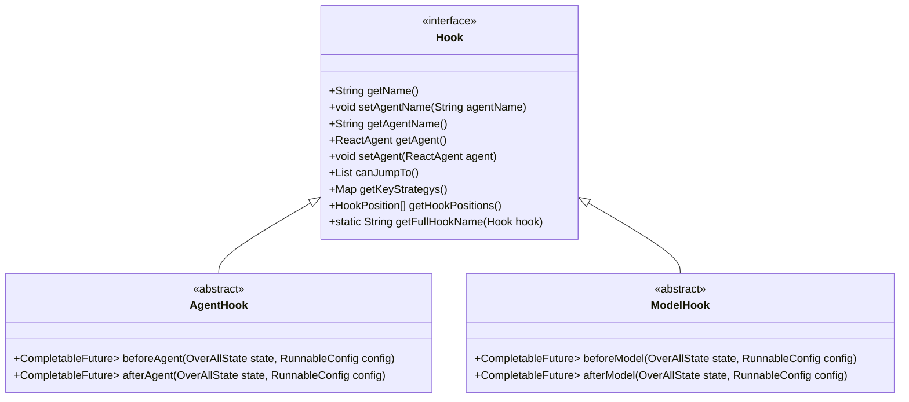
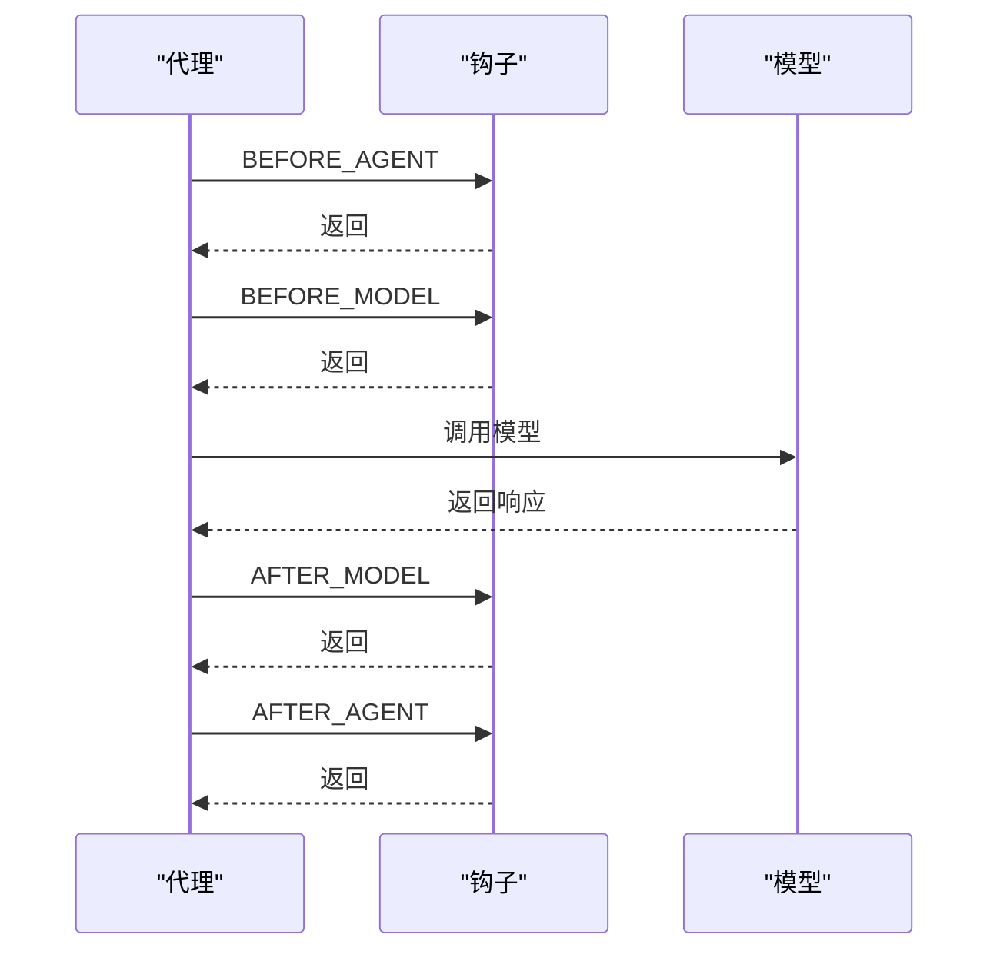
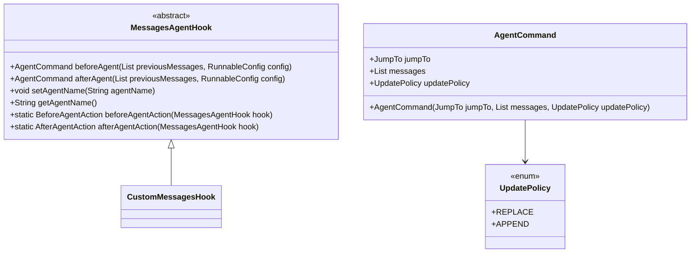
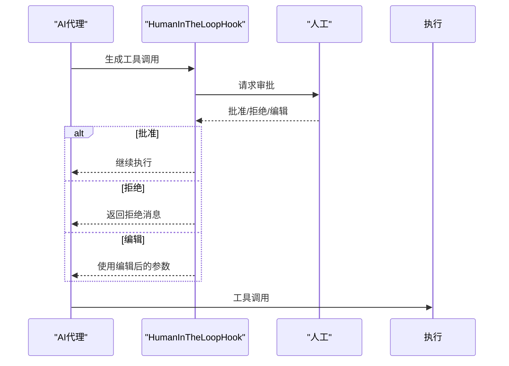
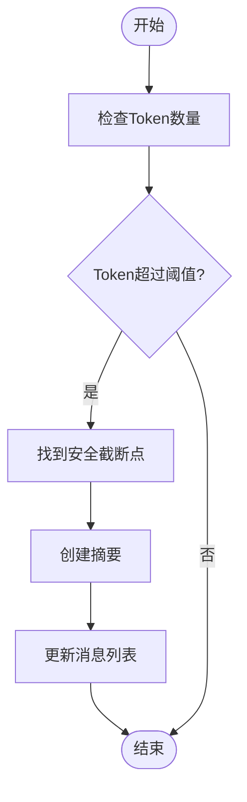
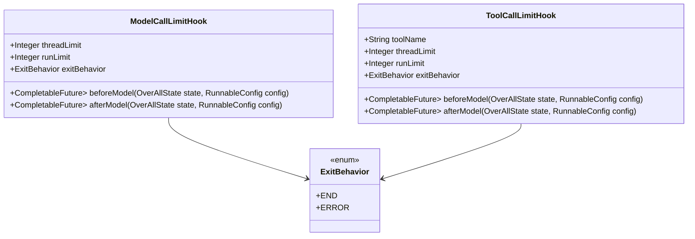
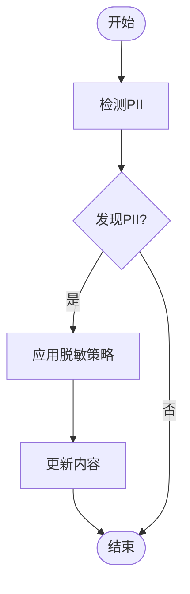

# 钩子系统

<cite>
**本文档中引用的文件**  
- [Hook.java](file://spring-ai-alibaba-agent-framework/src/main/java/com/alibaba/cloud/ai/graph/agent/hook/Hook.java)
- [AgentHook.java](file://spring-ai-alibaba-agent-framework/src/main/java/com/alibaba/cloud/ai/graph/agent/hook/AgentHook.java)
- [ModelHook.java](file://spring-ai-alibaba-agent-framework/src/main/java/com/alibaba/cloud/ai/graph/agent/hook/ModelHook.java)
- [HookPosition.java](file://spring-ai-alibaba-agent-framework/src/main/java/com/alibaba/cloud/ai/graph/agent/hook/HookPosition.java)
- [HookPositions.java](file://spring-ai-alibaba-agent-framework/src/main/java/com/alibaba/cloud/ai/graph/agent/hook/HookPositions.java)
- [MessagesAgentHook.java](file://spring-ai-alibaba-agent-framework/src/main/java/com/alibaba/cloud/ai/graph/agent/hook/messages/MessagesAgentHook.java)
- [HumanInTheLoopHook.java](file://spring-ai-alibaba-agent-framework/src/main/java/com/alibaba/cloud/ai/graph/agent/hook/hip/HumanInTheLoopHook.java)
- [SummarizationHook.java](file://spring-ai-alibaba-agent-framework/src/main/java/com/alibaba/cloud/ai/graph/agent/hook/summarization/SummarizationHook.java)
- [ModelCallLimitHook.java](file://spring-ai-alibaba-agent-framework/src/main/java/com/alibaba/cloud/ai/graph/agent/hook/modelcalllimit/ModelCallLimitHook.java)
- [ToolCallLimitHook.java](file://spring-ai-alibaba-agent-framework/src/main/java/com/alibaba/cloud/ai/graph/agent/hook/toolcalllimit/ToolCallLimitHook.java)
- [PIIDetectionHook.java](file://spring-ai-alibaba-agent-framework/src/main/java/com/alibaba/cloud/ai/graph/agent/hook/pii/PIIDetectionHook.java)
- [JumpTo.java](file://spring-ai-alibaba-agent-framework/src/main/java/com/alibaba/cloud/ai/graph/agent/hook/JumpTo.java)
- [AgentCommand.java](file://spring-ai-alibaba-agent-framework/src/main/java/com/alibaba/cloud/ai/graph/agent/hook/messages/AgentCommand.java)
- [UpdatePolicy.java](file://spring-ai-alibaba-agent-framework/src/main/java/com/alibaba/cloud/ai/graph/agent/hook/messages/UpdatePolicy.java)
</cite>

## 目录
1. [引言](#引言)
2. [核心接口与执行时机](#核心接口与执行时机)
3. [内置钩子实现与用途](#内置钩子实现与用途)
4. [钩子注册与配置示例](#钩子注册与配置示例)
5. [总结](#总结)

## 引言

钩子（Hook）系统是Spring AI Alibaba代理框架中的关键扩展机制，它允许在代理执行的关键位置（如执行前、执行后、模型调用前、模型调用后）插入自定义逻辑，从而实现非侵入式的功能扩展。通过钩子系统，开发者可以在不修改核心代理逻辑的情况下，实现消息控制、人机交互、上下文摘要、调用限制和敏感信息检测等多种高级功能。本文档将详细介绍钩子系统的核心接口、执行时机以及各个内置钩子的实现和用途。

## 核心接口与执行时机

### 核心接口

钩子系统的核心接口是`Hook`，所有钩子都必须实现此接口。`Hook`接口定义了钩子的基本行为，包括获取钩子名称、设置代理名称、获取代理实例等。此外，`Hook`接口还定义了`getHookPositions()`方法，用于指定钩子的执行位置。



**图源**
- [Hook.java](file://spring-ai-alibaba-agent-framework/src/main/java/com/alibaba/cloud/ai/graph/agent/hook/Hook.java)
- [AgentHook.java](file://spring-ai-alibaba-agent-framework/src/main/java/com/alibaba/cloud/ai/graph/agent/hook/AgentHook.java)
- [ModelHook.java](file://spring-ai-alibaba-agent-framework/src/main/java/com/alibaba/cloud/ai/graph/agent/hook/ModelHook.java)

### 执行时机

`HookPosition`枚举定义了钩子可以执行的四个关键位置：

- `BEFORE_AGENT`：在代理开始处理之前执行
- `AFTER_AGENT`：在代理完成处理之后执行
- `BEFORE_MODEL`：在模型调用之前执行
- `AFTER_MODEL`：在模型返回响应之后执行

通过`@HookPositions`注解，可以指定钩子在哪些位置执行。例如，`@HookPositions({HookPosition.BEFORE_MODEL, HookPosition.AFTER_MODEL})`表示该钩子在模型调用前后都执行。



**图源**
- [HookPosition.java](file://spring-ai-alibaba-agent-framework/src/main/java/com/alibaba/cloud/ai/graph/agent/hook/HookPosition.java)
- [HookPositions.java](file://spring-ai-alibaba-agent-framework/src/main/java/com/alibaba/cloud/ai/graph/agent/hook/HookPositions.java)

## 内置钩子实现与用途

### MessagesAgentHook：消息级别的控制

`MessagesAgentHook`是用于消息级别控制的抽象基类。它允许在代理执行前后修改消息列表，实现消息的添加、删除或替换。通过`beforeAgent`和`afterAgent`方法，可以在代理处理前后对消息进行预处理和后处理。



**图源**
- [MessagesAgentHook.java](file://spring-ai-alibaba-agent-framework/src/main/java/com/alibaba/cloud/ai/graph/agent/hook/messages/MessagesAgentHook.java)
- [AgentCommand.java](file://spring-ai-alibaba-agent-framework/src/main/java/com/alibaba/cloud/ai/graph/agent/hook/messages/AgentCommand.java)
- [UpdatePolicy.java](file://spring-ai-alibaba-agent-framework/src/main/java/com/alibaba/cloud/ai/graph/agent/hook/messages/UpdatePolicy.java)

### HumanInTheLoopHook：人机交互

`HumanInTheLoopHook`实现了人机交互（Human-in-the-Loop）功能，允许在AI调用工具前需要人工审批。该钩子在`AFTER_MODEL`位置执行，当AI生成工具调用请求时，会暂停执行并等待人工反馈。人工可以批准、拒绝或编辑工具调用请求。



**图源**
- [HumanInTheLoopHook.java](file://spring-ai-alibaba-agent-framework/src/main/java/com/alibaba/cloud/ai/graph/agent/hook/hip/HumanInTheLoopHook.java)

### SummarizationHook：上下文摘要

`SummarizationHook`用于上下文摘要，当对话历史的Token数量接近限制时，自动对较早的消息进行摘要，以节省Token。该钩子在`BEFORE_MODEL`位置执行，通过调用模型生成摘要，并将摘要插入到消息历史中。



**图源**
- [SummarizationHook.java](file://spring-ai-alibaba-agent-framework/src/main/java/com/alibaba/cloud/ai/graph/agent/hook/summarization/SummarizationHook.java)

### ModelCallLimitHook和ToolCallLimitHook：调用次数限制

`ModelCallLimitHook`和`ToolCallLimitHook`分别用于限制模型调用和工具调用的次数。这两个钩子在`BEFORE_MODEL`和`AFTER_MODEL`位置执行，通过在`RunnableConfig`的上下文中维护计数器来跟踪调用次数，并在达到限制时采取相应行动。



**图源**
- [ModelCallLimitHook.java](file://spring-ai-alibaba-agent-framework/src/main/java/com/alibaba/cloud/ai/graph/agent/hook/modelcalllimit/ModelCallLimitHook.java)
- [ToolCallLimitHook.java](file://spring-ai-alibaba-agent-framework/src/main/java/com/alibaba/cloud/ai/graph/agent/hook/toolcalllimit/ToolCallLimitHook.java)

### PIIDetectionHook：敏感信息检测

`PIIDetectionHook`用于检测和处理个人身份信息（PII），如电子邮件、信用卡号、IP地址等。该钩子在`BEFORE_MODEL`和`AFTER_MODEL`位置执行，可以对输入和输出中的PII进行脱敏处理，支持多种脱敏策略，如红acted、掩码、哈希等。



**图源**
- [PIIDetectionHook.java](file://spring-ai-alibaba-agent-framework/src/main/java/com/alibaba/cloud/ai/graph/agent/hook/pii/PIIDetectionHook.java)

## 钩子注册与配置示例

要使用钩子系统，首先需要创建钩子实例，然后将其注册到代理中。以下是一个配置和注册多个钩子的示例：

```java
// 创建并配置SummarizationHook
SummarizationHook summarizationHook = SummarizationHook.builder()
    .model(chatModel)
    .maxTokensBeforeSummary(4000)
    .messagesToKeep(20)
    .keepFirstUserMessage(true)
    .build();

// 创建并配置ModelCallLimitHook
ModelCallLimitHook modelCallLimitHook = ModelCallLimitHook.builder()
    .threadLimit(10)
    .runLimit(50)
    .exitBehavior(ModelCallLimitHook.ExitBehavior.END)
    .build();

// 创建并配置ToolCallLimitHook
ToolCallLimitHook toolCallLimitHook = ToolCallLimitHook.builder()
    .toolName("search")
    .threadLimit(5)
    .runLimit(20)
    .exitBehavior(ToolCallLimitHook.ExitBehavior.ERROR)
    .build();

// 创建并配置PIIDetectionHook
PIIDetectionHook piiDetectionHook = PIIDetectionHook.builder()
    .piiType(PIIType.EMAIL)
    .strategy(RedactionStrategy.REDACT)
    .applyToInput(true)
    .applyToOutput(true)
    .build();

// 创建并配置HumanInTheLoopHook
HumanInTheLoopHook humanInTheLoopHook = HumanInTheLoopHook.builder()
    .approvalOn("execute_code", "需要人工审批执行代码")
    .approvalOn("send_email", "需要人工审批发送邮件")
    .build();

// 将钩子注册到代理构建器中
AgentBuilder agentBuilder = AgentBuilder.builder()
    .hook(summarizationHook)
    .hook(modelCallLimitHook)
    .hook(toolCallLimitHook)
    .hook(piiDetectionHook)
    .hook(humanInTheLoopHook)
    .build();
```

**节源**
- [SummarizationHook.java](file://spring-ai-alibaba-agent-framework/src/main/java/com/alibaba/cloud/ai/graph/agent/hook/summarization/SummarizationHook.java#L315-L364)
- [ModelCallLimitHook.java](file://spring-ai-alibaba-agent-framework/src/main/java/com/alibaba/cloud/ai/graph/agent/hook/modelcalllimit/ModelCallLimitHook.java#L147-L172)
- [ToolCallLimitHook.java](file://spring-ai-alibaba-agent-framework/src/main/java/com/alibaba/cloud/ai/graph/agent/hook/toolcalllimit/ToolCallLimitHook.java#L188-L219)
- [PIIDetectionHook.java](file://spring-ai-alibaba-agent-framework/src/main/java/com/alibaba/cloud/ai/graph/agent/hook/pii/PIIDetectionHook.java#L333-L376)
- [HumanInTheLoopHook.java](file://spring-ai-alibaba-agent-framework/src/main/java/com/alibaba/cloud/ai/graph/agent/hook/hip/HumanInTheLoopHook.java#L281-L304)

## 总结

钩子系统为Spring AI Alibaba代理框架提供了强大的扩展能力，通过在关键执行位置插入自定义逻辑，实现了非侵入式的功能增强。本文档详细介绍了`Hook`和`AgentHook`核心接口，`HookPosition`的执行时机，以及`MessagesAgentHook`、`HumanInTheLoopHook`、`SummarizationHook`、`ModelCallLimitHook`、`ToolCallLimitHook`和`PIIDetectionHook`等内置钩子的实现和用途。通过合理配置和使用这些钩子，可以构建更加智能、安全和可控的AI代理应用。