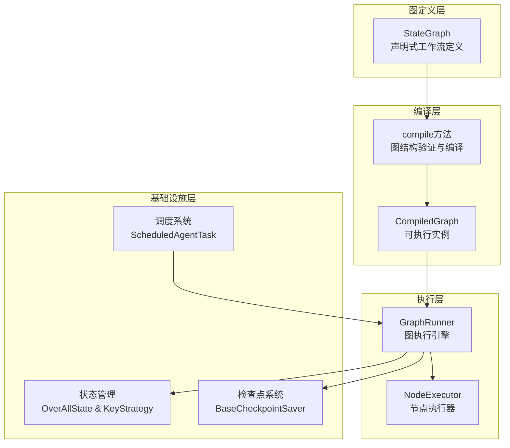
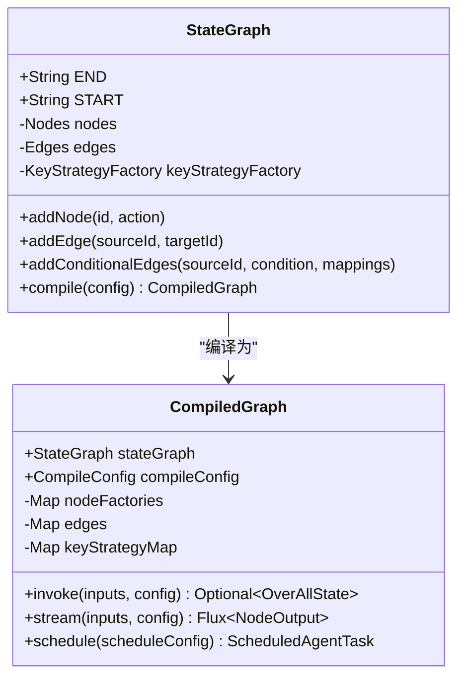
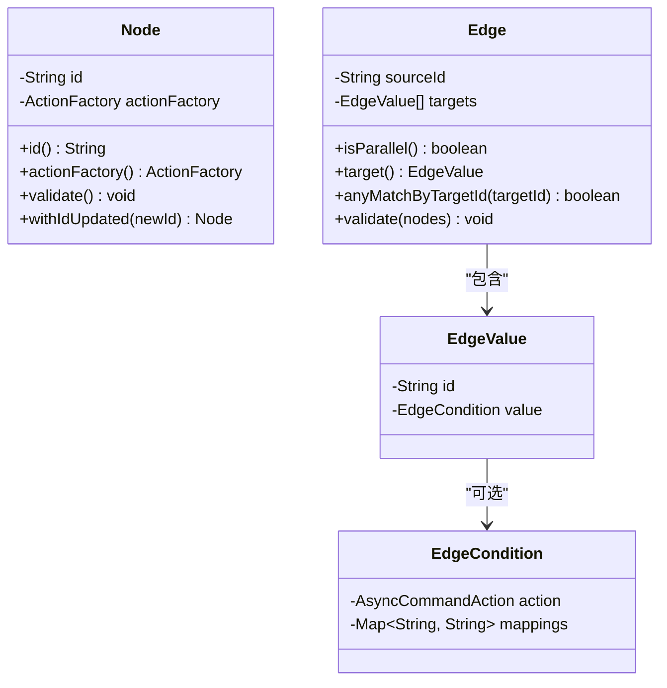
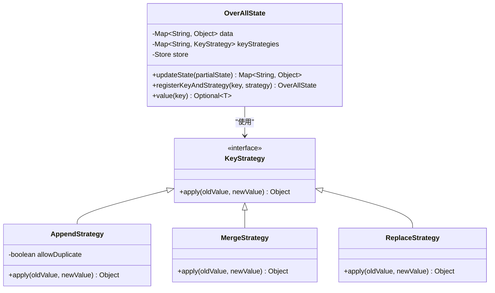
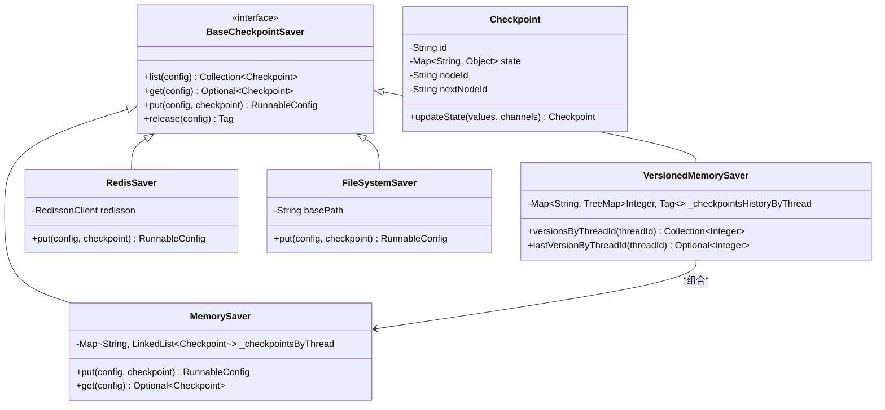
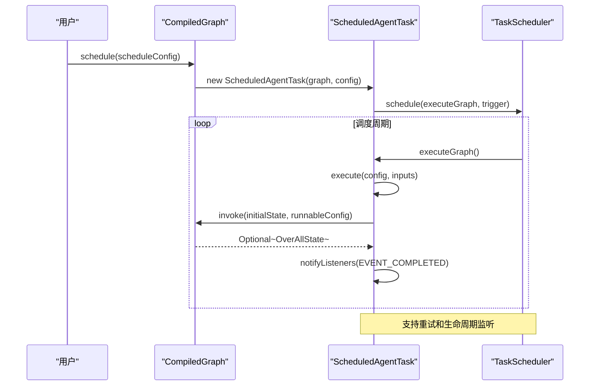

# 图核心引擎

<cite>
**本文档引用的文件**   
- [StateGraph.java](file://spring-ai-alibaba-graph-core/src/main/java/com/alibaba/cloud/ai/graph/StateGraph.java)
- [CompiledGraph.java](file://spring-ai-alibaba-graph-core/src/main/java/com/alibaba/cloud/ai/graph/CompiledGraph.java)
- [OverAllState.java](file://spring-ai-alibaba-graph-core/src/main/java/com/alibaba/cloud/ai/graph/OverAllState.java)
- [AppendStrategy.java](file://spring-ai-alibaba-graph-core/src/main/java/com/alibaba/cloud/ai/graph/state/strategy/AppendStrategy.java)
- [MergeStrategy.java](file://spring-ai-alibaba-graph-core/src/main/java/com/alibaba/cloud/ai/graph/state/strategy/MergeStrategy.java)
- [ReplaceStrategy.java](file://spring-ai-alibaba-graph-core/src/main/java/com/alibaba/cloud/ai/graph/state/strategy/ReplaceStrategy.java)
- [Checkpoint.java](file://spring-ai-alibaba-graph-core/src/main/java/com/alibaba/cloud/ai/graph/checkpoint/Checkpoint.java)
- [BaseCheckpointSaver.java](file://spring-ai-alibaba-graph-core/src/main/java/com/alibaba/cloud/ai/graph/checkpoint/BaseCheckpointSaver.java)
- [ScheduledAgentTask.java](file://spring-ai-alibaba-graph-core/src/main/java/com/alibaba/cloud/ai/graph/scheduling/ScheduledAgentTask.java)
- [Node.java](file://spring-ai-alibaba-graph-core/src/main/java/com/alibaba/cloud/ai/graph/internal/node/Node.java)
- [Edge.java](file://spring-ai-alibaba-graph-core/src/main/java/com/alibaba/cloud/ai/graph/internal/edge/Edge.java)
- [MemorySaver.java](file://spring-ai-alibaba-graph-core/src/main/java/com/alibaba/cloud/ai/graph/checkpoint/savers/MemorySaver.java)
- [VersionedMemorySaver.java](file://spring-ai-alibaba-graph-core/src/main/java/com/alibaba/cloud/ai/graph/checkpoint/savers/VersionedMemorySaver.java)
- [RedisSaver.java](file://spring-ai-alibaba-graph-core/src/main/java/com/alibaba/cloud/ai/graph/checkpoint/savers/redis/RedisSaver.java)
- [FileSystemSaver.java](file://spring-ai-alibaba-graph-core/src/main/java/com/alibaba/cloud/ai/graph/checkpoint/savers/file/FileSystemSaver.java)
</cite>

## 目录
1. [引言](#引言)
2. [图核心引擎架构](#图核心引擎架构)
3. [StateGraph与CompiledGraph](#stategaph与compiledgraph)
4. [图数据模型](#图数据模型)
5. [状态管理机制](#状态管理机制)
6. [检查点系统](#检查点系统)
7. [调度系统](#调度系统)
8. [性能优化与扩展](#性能优化与扩展)
9. [结论](#结论)

## 引言

图核心引擎是Spring AI Alibaba框架中的核心组件，提供了一个声明式的、基于图的工作流执行引擎。该引擎允许开发者通过定义节点（Node）和边（Edge）来构建复杂的代理（Agent）工作流。其核心设计理念是将工作流的定义（StateGraph）与其可执行实例（CompiledGraph）分离，从而实现声明式编程与运行时执行的解耦。本架构文档旨在为系统架构师提供一个全面的技术视角，深入解析引擎的内部机制，包括其数据模型、状态管理、持久化和调度能力。

## 图核心引擎架构

图核心引擎采用分层架构设计，主要由图定义层、编译层、执行层和基础设施层组成。图定义层以`StateGraph`为核心，负责声明式地构建工作流的拓扑结构。编译层通过`compile`方法将`StateGraph`转换为可执行的`CompiledGraph`实例，此过程包含图结构验证、节点工厂化和边的优化。执行层由`GraphRunner`驱动，负责根据`CompiledGraph`的指令执行节点并管理状态流转。基础设施层提供了状态管理、检查点持久化和任务调度等关键服务，确保工作流的可靠性和可扩展性。

**图来源**
- [StateGraph.java](file://spring-ai-alibaba-graph-core/src/main/java/com/alibaba/cloud/ai/graph/StateGraph.java#L56-L607)
- [CompiledGraph.java](file://spring-ai-alibaba-graph-core/src/main/java/com/alibaba/cloud/ai/graph/CompiledGraph.java#L61-L807)
- [OverAllState.java](file://spring-ai-alibaba-graph-core/src/main/java/com/alibaba/cloud/ai/graph/OverAllState.java#L77-L561)

## StateGraph与CompiledGraph

`StateGraph`是图核心引擎的基石，它代表了一个声明式的工作流定义。开发者通过`addNode`和`addEdge`等方法，以编程方式构建一个由节点和边组成的有向无环图（DAG）。`StateGraph`本身并不执行任何逻辑，它只是一个静态的蓝图。其核心作用是提供一个清晰、可读的接口来定义工作流的逻辑结构，支持条件分支（`addConditionalEdges`）和子图嵌套（`addNode` with `StateGraph`），极大地增强了工作流的表达能力。

`CompiledGraph`是`StateGraph`经过编译后的可执行实例。当调用`StateGraph.compile()`方法时，引擎会执行一系列操作：首先验证图的结构完整性，确保所有节点和边都有效；然后，它会为每个节点创建一个`ActionFactory`，这是一个工厂函数，用于在运行时根据配置生成具体的节点动作实例；最后，它会处理并优化边的连接，特别是将多目标边转换为`ParallelNode`以支持并行执行。`CompiledGraph`是线程安全的，可以被多个执行器（`GraphRunner`）同时使用，从而实现了工作流定义与执行的完全解耦。

**图来源**
- [StateGraph.java](file://spring-ai-alibaba-graph-core/src/main/java/com/alibaba/cloud/ai/graph/StateGraph.java#L56-L607)
- [CompiledGraph.java](file://spring-ai-alibaba-graph-core/src/main/java/com/alibaba/cloud/ai/graph/CompiledGraph.java#L61-L807)

## 图数据模型

图核心引擎的内部数据模型围绕`Node`（节点）和`Edge`（边）两个核心实体构建。`Node`代表工作流中的一个执行单元，它包含一个唯一的`id`和一个`ActionFactory`。`ActionFactory`是一个函数式接口，它接收`CompileConfig`并返回一个`AsyncNodeActionWithConfig`，这使得节点动作可以在运行时被动态创建，保证了线程安全。`Node`还提供了`validate`方法来确保其自身定义的正确性。

`Edge`代表节点之间的连接关系，它由`sourceId`（源节点ID）和一个`targets`列表（目标值列表）组成。`Edge`的设计支持两种连接模式：简单的单目标连接和复杂的条件分支连接。当`targets`列表包含多个元素时，表示这是一个并行分支。`Edge`的`validate`方法会检查其引用的节点是否存在，确保图的拓扑结构是有效的。这种数据模型设计简洁而强大，能够精确地表达复杂的工作流逻辑。

**图来源**
- [Node.java](file://spring-ai-alibaba-graph-core/src/main/java/com/alibaba/cloud/ai/graph/internal/node/Node.java#L39-L139)
- [Edge.java](file://spring-ai-alibaba-graph-core/src/main/java/com/alibaba/cloud/ai/graph/internal/edge/Edge.java#L39-L150)

## 状态管理机制

图核心引擎的状态管理机制以`OverAllState`为核心，结合`KeyStrategy`策略模式，实现了灵活且强大的状态合并逻辑。`OverAllState`是一个可序列化的容器，用于存储工作流执行过程中的所有共享数据。它内部维护一个`Map<String, Object>`来存储实际数据，并通过`Map<String, KeyStrategy>`为每个数据键（Key）关联一个更新策略。

引擎提供了三种内置的状态合并策略：
- **Append（追加）**: 通过`AppendStrategy`实现，适用于列表或集合类型的数据。新值会被追加到现有值的末尾，支持去重选项。
- **Merge（合并）**: 通过`MergeStrategy`实现，适用于映射（Map）类型的数据。它会将新值的键值对合并到现有值中，实现深度合并。
- **Replace（替换）**: 通过`ReplaceStrategy`实现，这是最简单的策略，新值会完全覆盖旧值。

开发者可以通过`registerKeyAndStrategy`方法为特定的键注册自定义策略，从而精确控制状态的更新行为。这种设计使得状态管理既灵活又可预测，能够适应各种复杂的业务场景。

**图来源**
- [OverAllState.java](file://spring-ai-alibaba-graph-core/src/main/java/com/alibaba/cloud/ai/graph/OverAllState.java#L77-L561)
- [AppendStrategy.java](file://spring-ai-alibaba-graph-core/src/main/java/com/alibaba/cloud/ai/graph/state/strategy/AppendStrategy.java#L31-L137)
- [MergeStrategy.java](file://spring-ai-alibaba-graph-core/src/main/java/com/alibaba/cloud/ai/graph/state/strategy/MergeStrategy.java#L27-L72)
- [ReplaceStrategy.java](file://spring-ai-alibaba-graph-core/src/main/java/com/alibaba/cloud/ai/graph/state/strategy/ReplaceStrategy.java#L20-L28)

## 检查点系统

检查点系统是图核心引擎实现故障恢复和状态持久化的关键。其核心接口是`BaseCheckpointSaver`，它定义了`list`、`get`、`put`和`release`等基本操作。`Checkpoint`类是检查点的具体数据结构，它包含一个唯一ID、当前状态（`state`）、当前节点ID（`nodeId`）和下一个节点ID（`nextNodeId`），这些信息足以让工作流从任意一点恢复执行。

引擎支持多种后端存储，通过实现`BaseCheckpointSaver`接口来完成。例如，`MemorySaver`将检查点存储在内存中，适合临时会话；`FileSystemSaver`将其保存到文件系统；`RedisSaver`利用Redis的高性能进行存储；还有针对MySQL、MongoDB等数据库的实现。`VersionedMemorySaver`则在此基础上提供了版本控制功能，允许用户回溯到历史状态。通过在`CompileConfig`中配置`saverConfig`，开发者可以轻松地在不同存储后端之间切换，满足不同的性能和可靠性需求。

**图来源**
- [BaseCheckpointSaver.java](file://spring-ai-alibaba-graph-core/src/main/java/com/alibaba/cloud/ai/graph/checkpoint/BaseCheckpointSaver.java#L27-L50)
- [Checkpoint.java](file://spring-ai-alibaba-graph-core/src/main/java/com/alibaba/cloud/ai/graph/checkpoint/Checkpoint.java#L30-L134)
- [MemorySaver.java](file://spring-ai-alibaba-graph-core/src/main/java/com/alibaba/cloud/ai/graph/checkpoint/savers/MemorySaver.java#L36-L170)
- [VersionedMemorySaver.java](file://spring-ai-alibaba-graph-core/src/main/java/com/alibaba/cloud/ai/graph/checkpoint/savers/VersionedMemorySaver.java#L39-L242)
- [RedisSaver.java](file://spring-ai-alibaba-graph-core/src/main/java/com/alibaba/cloud/ai/graph/checkpoint/savers/redis/RedisSaver.java)
- [FileSystemSaver.java](file://spring-ai-alibaba-graph-core/src/main/java/com/alibaba/cloud/ai/graph/checkpoint/savers/file/FileSystemSaver.java)

## 调度系统

调度系统允许将`CompiledGraph`作为定时任务执行，为自动化代理提供了强大的支持。其核心是`ScheduledAgentTask`类，它封装了任务的执行逻辑。通过`CompiledGraph.schedule(ScheduleConfig)`方法，可以创建一个`ScheduledAgentTask`实例。

`ScheduleConfig`配置对象支持多种调度模式，包括`CRON`表达式、固定延迟（`FIXED_DELAY`）、固定速率（`FIXED_RATE`）和一次性执行（`ONE_TIME`）。任务的执行由`TaskScheduler`驱动，它利用Spring的调度框架来管理任务的生命周期。`ScheduledAgentTask`还内置了重试机制，可以在执行失败时根据配置的`retryPredicate`和`retryDelay`进行自动重试。此外，系统还提供了`ScheduleLifecycleListener`，允许开发者监听任务的启动、停止和执行事件，从而实现更精细的监控和管理。

**图来源**
- [ScheduledAgentTask.java](file://spring-ai-alibaba-graph-core/src/main/java/com/alibaba/cloud/ai/graph/scheduling/ScheduledAgentTask.java#L39-L217)
- [CompiledGraph.java](file://spring-ai-alibaba-graph-core/src/main/java/com/alibaba/cloud/ai/graph/CompiledGraph.java#L597-L599)

## 性能优化与扩展

为了优化图核心引擎的性能，建议采取以下措施：首先，对于高并发场景，应选择高性能的检查点后端，如`RedisSaver`，以减少I/O延迟。其次，合理设计`KeyStrategy`，避免在`MergeStrategy`中进行不必要的深度合并，以降低CPU开销。最后，利用`stream`方法进行响应式编程，可以有效处理流式数据，提高吞吐量。

扩展存储后端非常简单。开发者需要创建一个新类，实现`BaseCheckpointSaver`接口，并提供`list`、`get`、`put`和`release`方法的具体实现。例如，要支持Oracle数据库，可以创建一个`OracleSaver`类，使用JDBC或JPA来操作数据库表存储`Checkpoint`对象。然后，通过`SaverConfig.builder().register(new OracleSaver())`将其注册到配置中即可。这种基于接口的设计保证了系统的高度可扩展性。

## 结论

图核心引擎通过`StateGraph`和`CompiledGraph`的分离设计，提供了一个强大且灵活的声明式工作流框架。其基于`OverAllState`和`KeyStrategy`的状态管理机制，使得状态合并逻辑清晰可控。完善的检查点系统支持多种后端，确保了工作流的可靠性和持久性。调度系统则为自动化任务执行提供了便利。对于系统架构师而言，理解这些核心组件的内部机制，有助于设计出高性能、高可用的AI代理应用。通过遵循本文档中的优化和扩展指导，可以进一步提升系统的性能和适应性。