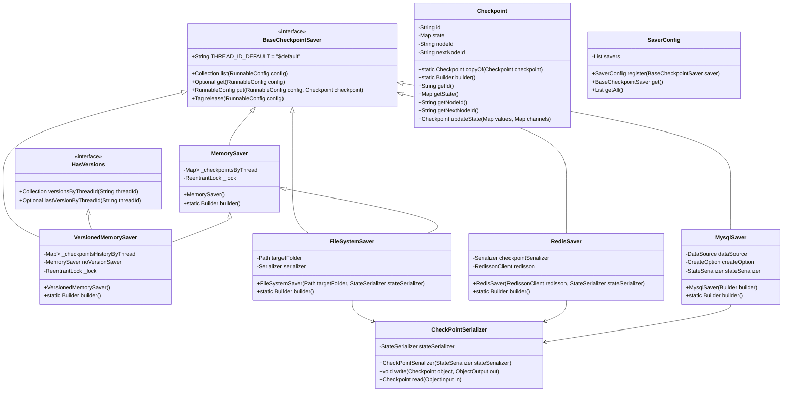
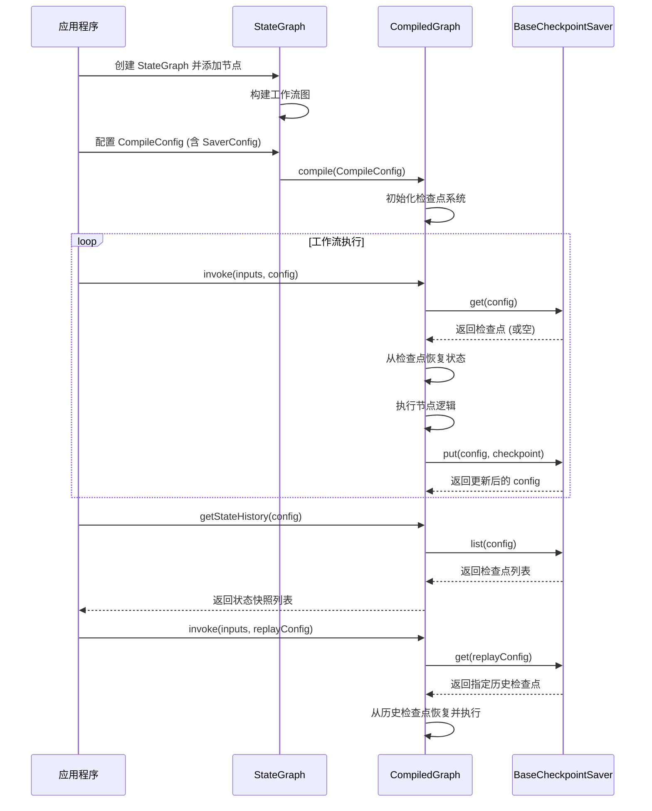

# 检查点系统

<cite>
**本文档中引用的文件**   
- [BaseCheckpointSaver.java](file://spring-ai-alibaba-graph-core/src/main/java/com/alibaba/cloud/ai/graph/checkpoint/BaseCheckpointSaver.java)
- [Checkpoint.java](file://spring-ai-alibaba-graph-core/src/main/java/com/alibaba/cloud/ai/graph/checkpoint/Checkpoint.java)
- [HasVersions.java](file://spring-ai-alibaba-graph-core/src/main/java/com/alibaba/cloud/ai/graph/checkpoint/HasVersions.java)
- [CheckPointSerializer.java](file://spring-ai-alibaba-graph-core/src/main/java/com/alibaba/cloud/ai/graph/serializer/check_point/CheckPointSerializer.java)
- [MemorySaver.java](file://spring-ai-alibaba-graph-core/src/main/java/com/alibaba/cloud/ai/graph/checkpoint/savers/MemorySaver.java)
- [VersionedMemorySaver.java](file://spring-ai-alibaba-graph-core/src/main/java/com/alibaba/cloud/ai/graph/checkpoint/savers/VersionedMemorySaver.java)
- [FileSystemSaver.java](file://spring-ai-alibaba-graph-core/src/main/java/com/alibaba/cloud/ai/graph/checkpoint/savers/file/FileSystemSaver.java)
- [RedisSaver.java](file://spring-ai-alibaba-graph-core/src/main/java/com/alibaba/cloud/ai/graph/checkpoint/savers/redis/RedisSaver.java)
- [MysqlSaver.java](file://spring-ai-alibaba-graph-core/src/main/java/com/alibaba/cloud/ai/graph/checkpoint/savers/mysql/MysqlSaver.java)
- [SaverConfig.java](file://spring-ai-alibaba-graph-core/src/main/java/com/alibaba/cloud/ai/graph/checkpoint/config/SaverConfig.java)
- [TimeTravelExample.java](file://examples/documentation/src/main/java/com/alibaba/cloud/ai/examples/documentation/graph/examples/TimeTravelExample.java)
- [TimeTravelTest.java](file://spring-ai-alibaba-graph-core/src/test/java/com/alibaba/cloud/ai/graph/TimeTravelTest.java)
</cite>

## 目录
1. [简介](#简介)
2. [核心组件](#核心组件)
3. [检查点数据结构](#检查点数据结构)
4. [检查点保存器抽象](#检查点保存器抽象)
5. [具体保存器实现](#具体保存器实现)
6. [版本控制](#版本控制)
7. [序列化机制](#序列化机制)
8. [配置与使用](#配置与使用)
9. [运维最佳实践](#运维最佳实践)
10. [总结](#总结)

## 简介

检查点系统是Spring AI Alibaba框架中的核心持久化机制，为工作流提供了状态持久化、故障恢复和时间旅行（Time Travel）等关键功能。该系统通过在工作流执行的关键节点保存状态快照，确保了应用的可靠性和可恢复性。当工作流因系统故障、网络中断或计划内维护而中断时，检查点系统能够从最近的保存点恢复执行，避免了从头开始的昂贵计算。此外，通过保存历史状态，该系统支持"时间旅行"功能，允许开发者和管理员回溯到任意历史状态，重新执行工作流以进行调试、分析或生成不同的结果。本技术文档将深入探讨检查点系统的内部机制，包括其核心抽象、具体实现、版本控制和序列化过程，并提供配置和运维的最佳实践。

## 核心组件

检查点系统由几个核心组件构成：`Checkpoint`类定义了状态快照的数据结构；`BaseCheckpointSaver`接口定义了保存器的通用行为；各种具体的保存器实现（如`MemorySaver`、`RedisSaver`）负责将检查点持久化到不同的后端；`CheckPointSerializer`负责检查点的序列化与反序列化；`HasVersions`接口为检查点提供了实验性的版本控制能力。这些组件协同工作，为工作流提供了一个灵活、可靠的状态管理解决方案。系统通过`SaverConfig`来注册和管理一个或多个保存器，并在工作流编译时通过`CompileConfig`注入，从而在运行时自动处理状态的保存与恢复。

**检查点系统核心组件关系图**

**图源**
- [BaseCheckpointSaver.java](file://spring-ai-alibaba-graph-core/src/main/java/com/alibaba/cloud/ai/graph/checkpoint/BaseCheckpointSaver.java)
- [Checkpoint.java](file://spring-ai-alibaba-graph-core/src/main/java/com/alibaba/cloud/ai/graph/checkpoint/Checkpoint.java)
- [HasVersions.java](file://spring-ai-alibaba-graph-core/src/main/java/com/alibaba/cloud/ai/graph/checkpoint/HasVersions.java)
- [CheckPointSerializer.java](file://spring-ai-alibaba-graph-core/src/main/java/com/alibaba/cloud/ai/graph/serializer/check_point/CheckPointSerializer.java)
- [MemorySaver.java](file://spring-ai-alibaba-graph-core/src/main/java/com/alibaba/cloud/ai/graph/checkpoint/savers/MemorySaver.java)
- [VersionedMemorySaver.java](file://spring-ai-alibaba-graph-core/src/main/java/com/alibaba/cloud/ai/graph/checkpoint/savers/VersionedMemorySaver.java)
- [FileSystemSaver.java](file://spring-ai-alibaba-graph-core/src/main/java/com/alibaba/cloud/ai/graph/checkpoint/savers/file/FileSystemSaver.java)
- [RedisSaver.java](file://spring-ai-alibaba-graph-core/src/main/java/com/alibaba/cloud/ai/graph/checkpoint/savers/redis/RedisSaver.java)
- [MysqlSaver.java](file://spring-ai-alibaba-graph-core/src/main/java/com/alibaba/cloud/ai/graph/checkpoint/savers/mysql/MysqlSaver.java)

**节源**
- [BaseCheckpointSaver.java](file://spring-ai-alibaba-graph-core/src/main/java/com/alibaba/cloud/ai/graph/checkpoint/BaseCheckpointSaver.java)
- [Checkpoint.java](file://spring-ai-alibaba-graph-core/src/main/java/com/alibaba/cloud/ai/graph/checkpoint/Checkpoint.java)
- [HasVersions.java](file://spring-ai-alibaba-graph-core/src/main/java/com/alibaba/cloud/ai/graph/checkpoint/HasVersions.java)
- [CheckPointSerializer.java](file://spring-ai-alibaba-graph-core/src/main/java/com/alibaba/cloud/ai/graph/serializer/check_point/CheckPointSerializer.java)
- [SaverConfig.java](file://spring-ai-alibaba-graph-core/src/main/java/com/alibaba/cloud/ai/graph/checkpoint/config/SaverConfig.java)

## 检查点数据结构

`Checkpoint`类是检查点系统的核心数据结构，它封装了工作流在某一时刻的完整状态。每个检查点都包含一个唯一的`id`，用于标识该快照。`state`字段是一个`Map<String, Object>`，存储了工作流当前的所有状态数据，例如对话历史、中间计算结果或用户输入。`nodeId`表示检查点被创建时工作流所处的节点，而`nextNodeId`则指明了工作流恢复执行后应该进入的下一个节点。这种设计使得系统能够精确地恢复到中断前的状态并继续执行。`Checkpoint`类提供了`Builder`模式来简化对象的创建，并支持通过`updateState`方法在现有状态的基础上进行更新。此外，`copyOf`静态方法允许创建一个具有新ID的检查点副本，这在需要分支执行或状态复制的场景下非常有用。

**节源**
- [Checkpoint.java](file://spring-ai-alibaba-graph-core/src/main/java/com/alibaba/cloud/ai/graph/checkpoint/Checkpoint.java)

## 检查点保存器抽象

`BaseCheckpointSaver`接口定义了所有检查点保存器必须实现的核心契约。它是一个功能接口，提供了四个关键方法：`list`用于获取与特定配置关联的所有检查点；`get`用于根据配置获取最新的或指定ID的检查点；`put`用于保存一个新的检查点或更新一个已存在的检查点；`release`用于释放与特定配置关联的检查点，通常表示一个工作流实例的结束。`THREAD_ID_DEFAULT`常量定义了当配置中未指定线程ID时使用的默认值。`Tag`记录类用于封装`release`操作的结果，包含被释放的线程ID和检查点集合。通过这个抽象，系统实现了与具体持久化后端的解耦，允许开发者根据需求选择最适合的存储方案，无论是内存、文件系统还是数据库。

**节源**
- [BaseCheckpointSaver.java](file://spring-ai-alibaba-graph-core/src/main/java/com/alibaba/cloud/ai/graph/checkpoint/BaseCheckpointSaver.java)

## 具体保存器实现

### 内存保存器 (MemorySaver)

`MemorySaver`是检查点系统的基础实现，它将检查点存储在JVM的内存中。它使用一个`HashMap<String, LinkedList<Checkpoint>>`来按线程ID组织检查点列表，利用`LinkedList`的栈特性（通过`push`和`peek`操作）来高效地管理检查点的入栈和出栈。为了保证线程安全，所有操作都通过`ReentrantLock`进行同步。`MemorySaver`提供了`Builder`模式来创建实例。虽然它性能极高，但其持久性仅限于JVM的生命周期，一旦应用重启，所有状态都会丢失。因此，它主要适用于开发、测试或对持久性要求不高的场景。

**节源**
- [MemorySaver.java](file://spring-ai-alibaba-graph-core/src/main/java/com/alibaba/cloud/ai/graph/checkpoint/savers/MemorySaver.java)

### 版本化内存保存器 (VersionedMemorySaver)

`VersionedMemorySaver`是一个实验性功能，它在`MemorySaver`的基础上增加了版本控制能力，实现了`HasVersions`接口。它不仅使用`MemorySaver`来管理当前活动的检查点，还使用一个`HashMap<String, TreeMap<Integer, Tag>>`来维护每个线程ID的历史版本。每次调用`release`方法时，它会先调用底层`MemorySaver`的`release`方法获取`Tag`，然后将该`Tag`与一个递增的版本号一起存入历史记录中。这样，系统就可以通过`versionsByThreadId`和`lastVersionByThreadId`等方法查询历史版本，为实现更复杂的状态管理和审计功能提供了可能。

**节源**
- [VersionedMemorySaver.java](file://spring-ai-alibaba-graph-core/src/main/java/com/alibaba/cloud/ai/graph/checkpoint/savers/VersionedMemorySaver.java)

### 文件系统保存器 (FileSystemSaver)

`FileSystemSaver`将检查点持久化到本地文件系统。它继承自`MemorySaver`，利用其内存中的检查点管理机制，并通过重写`loadedCheckpoints`、`insertedCheckpoint`、`updatedCheckpoint`和`releasedCheckpoints`等钩子方法来实现与文件系统的交互。每个`RunnableConfig`对应一个文件，文件名格式为`thread-<threadId>.saver`。在加载时，如果内存中没有检查点且文件存在，它会从文件反序列化检查点列表；在插入或更新时，它会将内存中的检查点列表序列化并写入文件；在释放时，它会将当前文件备份为`thread-<threadId>-v<n>.saver`的版本化文件，然后删除原文件。这种方式提供了比内存更好的持久性，但性能受磁盘I/O限制。

**节源**
- [FileSystemSaver.java](file://spring-ai-alibaba-graph-core/src/main/java/com/alibaba/cloud/ai/graph/checkpoint/savers/file/FileSystemSaver.java)

### Redis保存器 (RedisSaver)

`RedisSaver`利用Redis作为后端存储，提供了高性能和高可用的持久化方案。它使用`RedissonClient`作为客户端，通过多个Redis键来组织数据：`graph:checkpoint:content:<threadId>`存储检查点序列化后的字符串；`graph:thread:meta:<threadName>`是一个哈希表，存储线程元数据（如`threadId`和`is_released`标志）；`graph:thread:reverse:<threadId>`是反向映射，便于通过`threadId`查找`threadName`。它使用`RLock`来保证并发操作的原子性，读操作使用较短的锁超时（500ms），写操作使用较长的超时（3秒）。`getOrCreateThreadId`方法确保了每个`threadName`在未被释放时始终对应同一个`threadId`，从而保证了状态的一致性。

**节源**
- [RedisSaver.java](file://spring-ai-alibaba-graph-core/src/main/java/com/alibaba/cloud/ai/graph/checkpoint/savers/redis/RedisSaver.java)

### MySQL保存器 (MysqlSaver)

`MysqlSaver`将检查点持久化到MySQL数据库，提供了强一致性和丰富的查询能力。它使用两个表：`GRAPH_THREAD`存储线程元数据，`GRAPH_CHECKPOINT`存储检查点数据。`GRAPH_CHECKPOINT`表的`state_data`字段是JSON类型，用于存储序列化后的状态。它通过`UPSERT`操作管理`GRAPH_THREAD`表，确保每个`thread_name`只有一个未释放的线程。所有的数据库操作都在事务中执行，以保证数据的完整性。`Builder`允许配置`DataSource`和`CreateOption`（如`CREATE_IF_NOT_EXISTS`或`CREATE_OR_REPLACE`），方便在不同环境中部署。`encodeState`和`decodeState`方法负责将状态对象与JSON字符串之间的转换。

**节源**
- [MysqlSaver.java](file://spring-ai-alibaba-graph-core/src/main/java/com/alibaba/cloud/ai/graph/checkpoint/savers/mysql/MysqlSaver.java)

## 版本控制

`HasVersions`接口为检查点系统引入了实验性的版本控制功能。它定义了`versionsByThreadId`和`lastVersionByThreadId`等方法，允许查询与特定线程ID关联的所有版本或最新版本。目前，`VersionedMemorySaver`是唯一实现了此接口的保存器。当`VersionedMemorySaver`的`release`方法被调用时，它会将当前的检查点集合（通过`Tag`表示）与一个递增的版本号一起存入`_checkpointsHistoryByThread`映射中。这使得系统能够追踪一个工作流实例的完整生命周期，支持诸如状态回滚、历史分析和A/B测试等高级功能。尽管目前是实验性功能，但它为构建更强大的工作流管理系统奠定了基础。

**节源**
- [HasVersions.java](file://spring-ai-alibaba-graph-core/src/main/java/com/alibaba/cloud/ai/graph/checkpoint/HasVersions.java)
- [VersionedMemorySaver.java](file://spring-ai-alibaba-graph-core/src/main/java/com/alibaba/cloud/ai/graph/checkpoint/savers/VersionedMemorySaver.java)

## 序列化机制

检查点的序列化由`CheckPointSerializer`类负责。它实现了`NullableObjectSerializer<Checkpoint>`接口，能够将`Checkpoint`对象写入`ObjectOutput`流或从`ObjectInput`流中读取。在序列化时，它首先写入检查点的`id`、`nodeId`和`nextNodeId`，然后将`state`字段转换为`OverAllState`对象，并委托给配置的`StateSerializer`（如`StateGraph.DEFAULT_JACKSON_SERIALIZER`）进行序列化。反序列化过程则相反，它读取各个字段，并使用`StateSerializer`重建`state`对象。这种设计将检查点本身的序列化与内部状态的序列化分离，提高了灵活性和可扩展性。对于`FileSystemSaver`和`RedisSaver`，序列化后的字节流会被Base64编码为字符串进行存储。

**节源**
- [CheckPointSerializer.java](file://spring-ai-alibaba-graph-core/src/main/java/com/alibaba/cloud/ai/graph/serializer/check_point/CheckPointSerializer.java)

## 配置与使用

要启用检查点功能，首先需要创建一个具体的`BaseCheckpointSaver`实例，例如`MemorySaver`或`RedisSaver`。然后，通过`SaverConfig.Builder`将该保存器注册到`SaverConfig`中。最后，在创建`StateGraph`的`CompileConfig`时，将`SaverConfig`注入其中。在运行时，工作流引擎会自动调用保存器的`put`方法在每个节点后保存检查点，并在启动时调用`get`方法尝试从持久化存储中恢复状态。要实现"时间旅行"，可以调用`getStateHistory`方法获取历史状态快照，然后使用`StateSnapshot`中的`config`来创建一个包含特定`checkPointId`的`RunnableConfig`，从而从任意历史点重新开始执行。

**图源**
- [SaverConfig.java](file://spring-ai-alibaba-graph-core/src/main/java/com/alibaba/cloud/ai/graph/checkpoint/config/SaverConfig.java)
- [TimeTravelExample.java](file://examples/documentation/src/main/java/com/alibaba/cloud/ai/examples/documentation/graph/examples/TimeTravelExample.java)
- [TimeTravelTest.java](file://spring-ai-alibaba-graph-core/src/test/java/com/alibaba/cloud/ai/graph/TimeTravelTest.java)

**节源**
- [SaverConfig.java](file://spring-ai-alibaba-graph-core/src/main/java/com/alibaba/cloud/ai/graph/checkpoint/config/SaverConfig.java)
- [TimeTravelExample.java](file://examples/documentation/src/main/java/com/alibaba/cloud/ai/examples/documentation/graph/examples/TimeTravelExample.java)
- [TimeTravelTest.java](file://spring-ai-alibaba-graph-core/src/test/java/com/alibaba/cloud/ai/graph/TimeTravelTest.java)

## 运维最佳实践

1.  **选择合适的保存器**：在生产环境中，避免使用`MemorySaver`。对于需要高吞吐和低延迟的场景，推荐使用`RedisSaver`；对于需要强一致性和复杂查询的场景，推荐使用`MysqlSaver`。
2.  **监控与备份**：定期监控所选后端（如Redis、MySQL）的健康状况、内存使用和磁盘空间。对数据库中的检查点表进行定期备份，以防止数据丢失。
3.  **清理过期检查点**：实现定期任务来清理已释放或长时间未活动的检查点，以释放存储空间。`FileSystemSaver`的版本化备份文件也应有相应的清理策略。
4.  **性能考量**：序列化和反序列化是性能瓶颈。确保`StateSerializer`的效率，并避免在`state`中存储过大的对象。对于`RedisSaver`和`MysqlSaver`，确保数据库有足够的资源来处理读写请求。
5.  **故障恢复演练**：定期进行故障恢复演练，验证检查点系统能否正确地从模拟的中断中恢复工作流，确保业务连续性。

**节源**
- [RedisSaver.java](file://spring-ai-alibaba-graph-core/src/main/java/com/alibaba/cloud/ai/graph/checkpoint/savers/redis/RedisSaver.java)
- [MysqlSaver.java](file://spring-ai-alibaba-graph-core/src/main/java/com/alibaba/cloud/ai/graph/checkpoint/savers/mysql/MysqlSaver.java)
- [FileSystemSaver.java](file://spring-ai-alibaba-graph-core/src/main/java/com/alibaba/cloud/ai/graph/checkpoint/savers/file/FileSystemSaver.java)

## 总结

检查点系统是Spring AI Alibaba框架中实现工作流可靠性和可恢复性的基石。通过`BaseCheckpointSaver`这一核心抽象，系统支持多种持久化后端，包括内存、文件系统、Redis和MySQL，满足了不同场景下的性能和持久性需求。`Checkpoint`数据结构和`CheckPointSerializer`机制确保了状态的完整性和可移植性。`HasVersions`接口为未来的版本控制功能提供了扩展能力。通过合理的配置和遵循运维最佳实践，开发者可以构建出能够抵御故障、支持调试和分析的健壮工作流应用。该系统不仅简化了复杂状态管理的复杂性，还为实现"时间旅行"等高级功能打开了大门，极大地提升了AI应用的开发和运维效率。