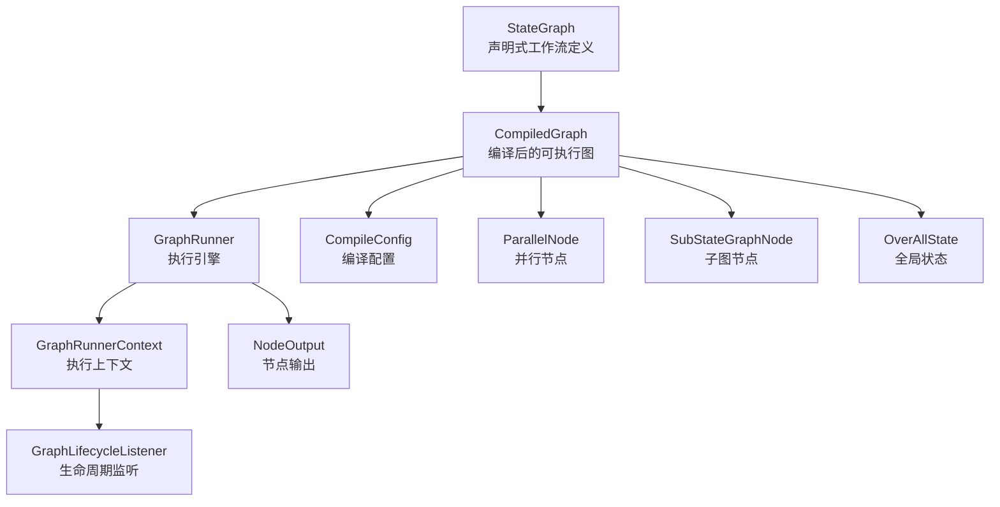
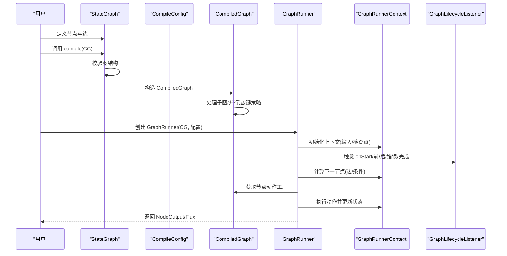
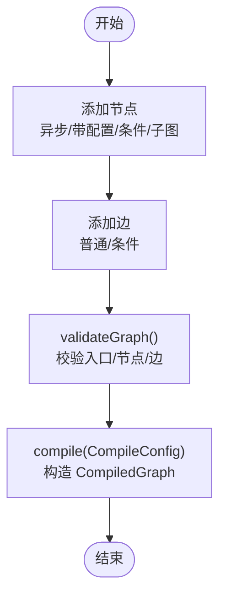
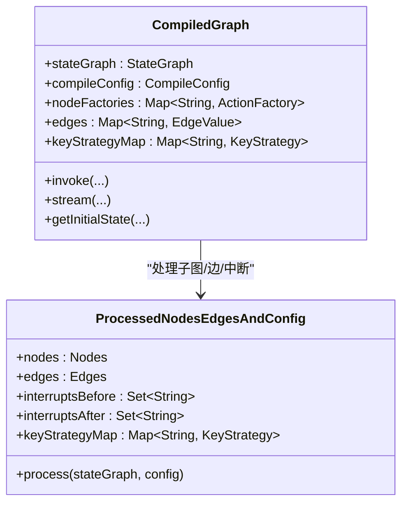
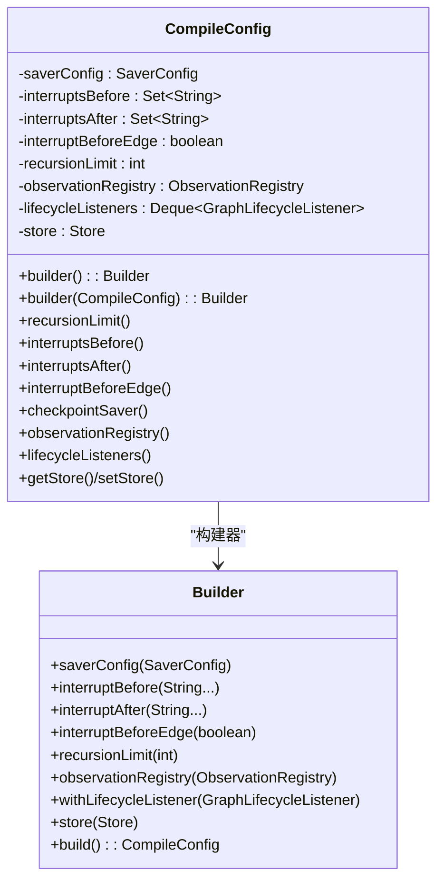
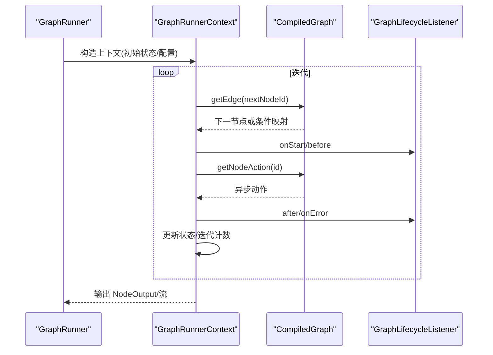
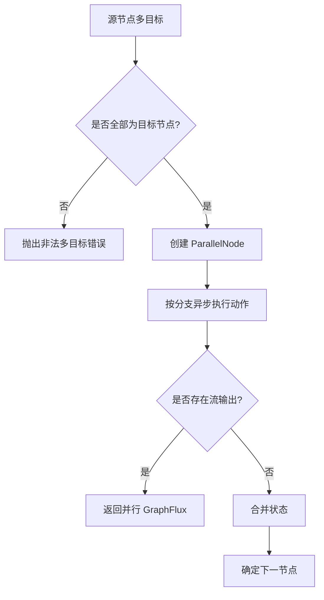
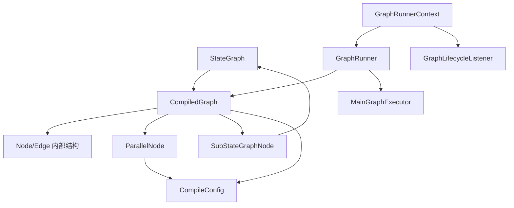

# 状态图

<cite>
**本文引用的文件列表**
- [StateGraph.java](file://spring-ai-alibaba-graph-core/src/main/java/com/alibaba/cloud/ai/graph/StateGraph.java)
- [CompiledGraph.java](file://spring-ai-alibaba-graph-core/src/main/java/com/alibaba/cloud/ai/graph/CompiledGraph.java)
- [CompileConfig.java](file://spring-ai-alibaba-graph-core/src/main/java/com/alibaba/cloud/ai/graph/CompileConfig.java)
- [GraphRunner.java](file://spring-ai-alibaba-graph-core/src/main/java/com/alibaba/cloud/ai/graph/GraphRunner.java)
- [GraphRunnerContext.java](file://spring-ai-alibaba-graph-core/src/main/java/com/alibaba/cloud/ai/graph/GraphRunnerContext.java)
- [GraphLifecycleListener.java](file://spring-ai-alibaba-graph-core/src/main/java/com/alibaba/cloud/ai/graph/GraphLifecycleListener.java)
- [ParallelNode.java](file://spring-ai-alibaba-graph-core/src/main/java/com/alibaba/cloud/ai/graph/internal/node/ParallelNode.java)
- [SubStateGraphNode.java](file://spring-ai-alibaba-graph-core/src/main/java/com/alibaba/cloud/ai/graph/internal/node/SubStateGraphNode.java)
- [OverAllState.java](file://spring-ai-alibaba-graph-core/src/main/java/com/alibaba/cloud/ai/graph/OverAllState.java)
- [NodeOutput.java](file://spring-ai-alibaba-graph-core/src/main/java/com/alibaba/cloud/ai/graph/NodeOutput.java)
- [StateGraphTest.java](file://spring-ai-alibaba-graph-core/src/test/java/com/alibaba/cloud/ai/graph/StateGraphTest.java)
- [SubGraphTest.java](file://spring-ai-alibaba-graph-core/src/test/java/com/alibaba/cloud/ai/graph/SubGraphTest.java)
- [SubgraphAsStateGraphExample.java](file://examples/documentation/src/main/java/com/alibaba/cloud/ai/examples/documentation/graph/examples/SubgraphAsStateGraphExample.java)
- [SubgraphAsCompiledGraphExample.java](file://examples/documentation/src/main/java/com/alibaba/cloud/ai/examples/documentation/graph/examples/SubgraphAsCompiledGraphExample.java)
</cite>

## 目录
1. [简介](#简介)
2. [项目结构与核心组件](#项目结构与核心组件)
3. [架构总览](#架构总览)
4. [详细组件解析](#详细组件解析)
5. [依赖关系分析](#依赖关系分析)
6. [性能考量与优化建议](#性能考量与优化建议)
7. [故障排查指南](#故障排查指南)
8. [结论](#结论)
9. [附录：示例与最佳实践](#附录示例与最佳实践)

## 简介
本文件系统性阐述 StateGraph 作为声明式工作流定义的核心角色，覆盖从图的构建、编译为 CompiledGraph 的机制，到通过 GraphRunner 执行的完整生命周期。文档还深入说明构建器模式（Builder Pattern）与编译配置（CompileConfig），并提供复杂工作流的示例路径，包括条件路由、并行执行与嵌套子图等高级模式。最后给出生命周期管理与事件监听（GraphLifecycleListener）机制说明，以及性能调优建议与常见陷阱规避方法。

## 项目结构与核心组件
- StateGraph：声明式工作流定义入口，负责节点与边的注册、校验与编译。
- CompiledGraph：编译后的可执行图，包含节点工厂、边映射、中断点、键策略与执行流。
- CompileConfig：编译期配置容器，支持检查点保存器、中断点、观察注册表、存储等。
- GraphRunner：基于 Reactor 的执行引擎，封装上下文与主执行器。
- GraphRunnerContext：执行上下文，维护当前/下一节点、状态、检查点、监听器回调等。
- GraphLifecycleListener：生命周期事件监听接口，支持开始、前置、后置、错误、完成等回调。
- ParallelNode：并行节点，负责多分支并发执行与结果聚合。
- SubStateGraphNode：子图节点，支持嵌套 StateGraph 的合并与格式化标识。
- OverAllState：全局状态容器，支持键策略、快照、持久化与恢复。
- NodeOutput：节点输出载体，携带节点标识、代理名、令牌用量与状态。

图表来源
- [StateGraph.java](file://spring-ai-alibaba-graph-core/src/main/java/com/alibaba/cloud/ai/graph/StateGraph.java#L1-L607)
- [CompiledGraph.java](file://spring-ai-alibaba-graph-core/src/main/java/com/alibaba/cloud/ai/graph/CompiledGraph.java#L1-L807)
- [CompileConfig.java](file://spring-ai-alibaba-graph-core/src/main/java/com/alibaba/cloud/ai/graph/CompileConfig.java#L1-L338)
- [GraphRunner.java](file://spring-ai-alibaba-graph-core/src/main/java/com/alibaba/cloud/ai/graph/GraphRunner.java#L1-L66)
- [GraphRunnerContext.java](file://spring-ai-alibaba-graph-core/src/main/java/com/alibaba/cloud/ai/graph/GraphRunnerContext.java#L1-L473)
- [GraphLifecycleListener.java](file://spring-ai-alibaba-graph-core/src/main/java/com/alibaba/cloud/ai/graph/GraphLifecycleListener.java#L1-L77)
- [ParallelNode.java](file://spring-ai-alibaba-graph-core/src/main/java/com/alibaba/cloud/ai/graph/internal/node/ParallelNode.java#L1-L373)
- [SubStateGraphNode.java](file://spring-ai-alibaba-graph-core/src/main/java/com/alibaba/cloud/ai/graph/internal/node/SubStateGraphNode.java#L1-L47)
- [OverAllState.java](file://spring-ai-alibaba-graph-core/src/main/java/com/alibaba/cloud/ai/graph/OverAllState.java#L1-L200)
- [NodeOutput.java](file://spring-ai-alibaba-graph-core/src/main/java/com/alibaba/cloud/ai/graph/NodeOutput.java#L1-L126)

章节来源
- [StateGraph.java](file://spring-ai-alibaba-graph-core/src/main/java/com/alibaba/cloud/ai/graph/StateGraph.java#L1-L607)
- [CompiledGraph.java](file://spring-ai-alibaba-graph-core/src/main/java/com/alibaba/cloud/ai/graph/CompiledGraph.java#L1-L807)
- [CompileConfig.java](file://spring-ai-alibaba-graph-core/src/main/java/com/alibaba/cloud/ai/graph/CompileConfig.java#L1-L338)

## 架构总览
StateGraph 以声明式 DSL 形式定义节点与边，随后通过 compile(CompileConfig) 编译为 CompiledGraph。CompiledGraph 将节点动作工厂化、边映射标准化，并在必要时将并行边转换为 ParallelNode，同时处理子图合并与键策略传播。GraphRunner 基于 Reactor 流式执行，借助 GraphRunnerContext 维护状态、迭代次数、检查点与中断点，最终产出 NodeOutput 或流式输出。

图表来源
- [StateGraph.java](file://spring-ai-alibaba-graph-core/src/main/java/com/alibaba/cloud/ai/graph/StateGraph.java#L441-L466)
- [CompiledGraph.java](file://spring-ai-alibaba-graph-core/src/main/java/com/alibaba/cloud/ai/graph/CompiledGraph.java#L111-L216)
- [GraphRunner.java](file://spring-ai-alibaba-graph-core/src/main/java/com/alibaba/cloud/ai/graph/GraphRunner.java#L41-L66)
- [GraphRunnerContext.java](file://spring-ai-alibaba-graph-core/src/main/java/com/alibaba/cloud/ai/graph/GraphRunnerContext.java#L188-L221)
- [GraphLifecycleListener.java](file://spring-ai-alibaba-graph-core/src/main/java/com/alibaba/cloud/ai/graph/GraphLifecycleListener.java#L1-L77)

## 详细组件解析

### StateGraph：声明式工作流定义与编译
- 节点注册：支持异步节点、带配置节点、条件节点（命令动作+映射）、子图节点（StateGraph/CompiledGraph）。
- 边注册：普通边与条件边（命令动作+映射），条件边不允许重复。
- 校验：确保存在入口 START、所有边目标节点存在、条件映射非空。
- 编译：validateGraph 后构造 CompiledGraph；默认 compile 使用内存检查点保存器。

图表来源
- [StateGraph.java](file://spring-ai-alibaba-graph-core/src/main/java/com/alibaba/cloud/ai/graph/StateGraph.java#L235-L466)

章节来源
- [StateGraph.java](file://spring-ai-alibaba-graph-core/src/main/java/com/alibaba/cloud/ai/graph/StateGraph.java#L235-L466)

### CompiledGraph：编译产物与执行准备
- 节点工厂化：将 Node 的 ActionFactory 存入 Map，保证线程安全与延迟实例化。
- 边映射：将多目标边转换为 ParallelNode 并生成并行边映射；条件边统一为 EdgeValue。
- 子图合并：递归处理子图，替换 START/END 节点与中断点，格式化子图内节点 ID。
- 中断点校验：确保中断节点存在且不越界。
- 执行入口：提供 getInitialState、stream/invoke 等入口，委托 GraphRunner。

图表来源
- [CompiledGraph.java](file://spring-ai-alibaba-graph-core/src/main/java/com/alibaba/cloud/ai/graph/CompiledGraph.java#L99-L216)
- [CompiledGraph.java](file://spring-ai-alibaba-graph-core/src/main/java/com/alibaba/cloud/ai/graph/CompiledGraph.java#L675-L807)

章节来源
- [CompiledGraph.java](file://spring-ai-alibaba-graph-core/src/main/java/com/alibaba/cloud/ai/graph/CompiledGraph.java#L99-L216)
- [CompiledGraph.java](file://spring-ai-alibaba-graph-core/src/main/java/com/alibaba/cloud/ai/graph/CompiledGraph.java#L675-L807)

### CompileConfig：编译期配置与构建器模式
- 关键字段：SaverConfig（默认内存保存器）、中断点（before/after）、是否在边评估前中断、递归限制、观察注册表、生命周期监听队列、Store。
- 构建器：链式设置 saverConfig、interruptsBefore/After、interruptBeforeEdge、recursionLimit、store、observationRegistry、withLifecycleListener 等。
- 默认行为：未显式设置时使用内存检查点保存器与默认观察注册表。

图表来源
- [CompileConfig.java](file://spring-ai-alibaba-graph-core/src/main/java/com/alibaba/cloud/ai/graph/CompileConfig.java#L1-L338)

章节来源
- [CompileConfig.java](file://spring-ai-alibaba-graph-core/src/main/java/com/alibaba/cloud/ai/graph/CompileConfig.java#L1-L338)

### GraphRunner 与 GraphRunnerContext：执行与上下文
- GraphRunner：持有 CompiledGraph 与 RunnableConfig，延迟初始化 MainGraphExecutor，对外暴露 run(Flux)。
- GraphRunnerContext：封装状态、当前/下一节点、迭代计数、检查点、监听器回调、输出构建、子图返回值等。

图表来源
- [GraphRunner.java](file://spring-ai-alibaba-graph-core/src/main/java/com/alibaba/cloud/ai/graph/GraphRunner.java#L41-L66)
- [GraphRunnerContext.java](file://spring-ai-alibaba-graph-core/src/main/java/com/alibaba/cloud/ai/graph/GraphRunnerContext.java#L188-L221)
- [GraphRunnerContext.java](file://spring-ai-alibaba-graph-core/src/main/java/com/alibaba/cloud/ai/graph/GraphRunnerContext.java#L287-L311)

章节来源
- [GraphRunner.java](file://spring-ai-alibaba-graph-core/src/main/java/com/alibaba/cloud/ai/graph/GraphRunner.java#L41-L66)
- [GraphRunnerContext.java](file://spring-ai-alibaba-graph-core/src/main/java/com/alibaba/cloud/ai/graph/GraphRunnerContext.java#L1-L473)

### 生命周期监听与事件回调（GraphLifecycleListener）
- 支持 onStart、before、after、onError、onComplete 回调，默认空实现。
- GraphRunnerContext 在关键阶段遍历监听器队列触发回调，异常被记录但不影响整体流程。

章节来源
- [GraphLifecycleListener.java](file://spring-ai-alibaba-graph-core/src/main/java/com/alibaba/cloud/ai/graph/GraphLifecycleListener.java#L1-L77)
- [GraphRunnerContext.java](file://spring-ai-alibaba-graph-core/src/main/java/com/alibaba/cloud/ai/graph/GraphRunnerContext.java#L287-L311)

### 并行执行：ParallelNode
- 并行边识别：当源节点有多个目标且均为已注册节点时，自动包装为 ParallelNode。
- 线程池：默认线程池大小按 CPU 核心动态计算，支持自定义执行器注入。
- 结果聚合：优先处理 GraphFlux/Flux，否则进行状态合并；每个并行分支独立快照状态，避免竞态。
- 监听器：并行节点内部使用 LIFO 顺序处理 NODE_BEFORE/NODE_AFTER。

图表来源
- [CompiledGraph.java](file://spring-ai-alibaba-graph-core/src/main/java/com/alibaba/cloud/ai/graph/CompiledGraph.java#L157-L216)
- [ParallelNode.java](file://spring-ai-alibaba-graph-core/src/main/java/com/alibaba/cloud/ai/graph/internal/node/ParallelNode.java#L1-L373)

章节来源
- [CompiledGraph.java](file://spring-ai-alibaba-graph-core/src/main/java/com/alibaba/cloud/ai/graph/CompiledGraph.java#L157-L216)
- [ParallelNode.java](file://spring-ai-alibaba-graph-core/src/main/java/com/alibaba/cloud/ai/graph/internal/node/ParallelNode.java#L1-L373)

### 嵌套子图：SubStateGraphNode 与子图合并
- 子图节点：支持将 StateGraph/CompiledGraph 作为节点插入父图。
- 合并规则：START/END 节点与中断点在合并时重写与格式化；子图内的节点 ID 前缀化，避免冲突。
- 键策略传播：子图的键策略合并到父图，确保状态更新策略一致。

章节来源
- [SubStateGraphNode.java](file://spring-ai-alibaba-graph-core/src/main/java/com/alibaba/cloud/ai/graph/internal/node/SubStateGraphNode.java#L1-L47)
- [CompiledGraph.java](file://spring-ai-alibaba-graph-core/src/main/java/com/alibaba/cloud/ai/graph/CompiledGraph.java#L675-L807)

### 全局状态与输出模型
- OverAllState：集中管理键值数据、键策略、快照、Store；提供更新与合并工具。
- NodeOutput：承载节点标识、代理名、令牌用量与状态，支持判断 START/END 与子图标记。

章节来源
- [OverAllState.java](file://spring-ai-alibaba-graph-core/src/main/java/com/alibaba/cloud/ai/graph/OverAllState.java#L1-L200)
- [NodeOutput.java](file://spring-ai-alibaba-graph-core/src/main/java/com/alibaba/cloud/ai/graph/NodeOutput.java#L1-L126)

## 依赖关系分析
- StateGraph 依赖 Node/Edge 内部结构与序列化器、检查点保存器。
- CompiledGraph 依赖 StateGraph 的节点/边集合、键策略工厂、子图节点与并行节点。
- GraphRunner 依赖 CompiledGraph 与 MainGraphExecutor；GraphRunnerContext 依赖 CompiledGraph 与监听器队列。
- ParallelNode 依赖 CompileConfig 的监听器与执行器注入；依赖 OverAllState 快照隔离。
- SubStateGraphNode 依赖 StateGraph 的键策略工厂与 ID 格式化。

图表来源
- [StateGraph.java](file://spring-ai-alibaba-graph-core/src/main/java/com/alibaba/cloud/ai/graph/StateGraph.java#L1-L607)
- [CompiledGraph.java](file://spring-ai-alibaba-graph-core/src/main/java/com/alibaba/cloud/ai/graph/CompiledGraph.java#L1-L807)
- [GraphRunner.java](file://spring-ai-alibaba-graph-core/src/main/java/com/alibaba/cloud/ai/graph/GraphRunner.java#L1-L66)
- [GraphRunnerContext.java](file://spring-ai-alibaba-graph-core/src/main/java/com/alibaba/cloud/ai/graph/GraphRunnerContext.java#L1-L473)
- [ParallelNode.java](file://spring-ai-alibaba-graph-core/src/main/java/com/alibaba/cloud/ai/graph/internal/node/ParallelNode.java#L1-L373)
- [SubStateGraphNode.java](file://spring-ai-alibaba-graph-core/src/main/java/com/alibaba/cloud/ai/graph/internal/node/SubStateGraphNode.java#L1-L47)

## 性能考量与优化建议
- 并行执行
  - 使用默认线程池参数即可满足大多数场景；如需定制，可通过配置项注入执行器。
  - 并行分支建议使用 GraphFlux/Flux 以获得更好的背压与可观测性。
- 递归限制
  - 合理设置 recursionLimit，避免深度嵌套导致栈溢出或资源耗尽。
- 检查点与恢复
  - 合理配置 SaverConfig 与 Store，确保长时间运行任务可恢复。
- 监听器开销
  - 监听器回调在关键阶段触发，避免在回调中执行阻塞操作。
- 状态更新策略
  - 选择合适的 KeyStrategy（如 AppendStrategy/ReplaceStrategy）减少不必要的合并成本。

[本节为通用指导，无需列出具体文件来源]

## 故障排查指南
- 图结构错误
  - 缺少入口 START：编译时报错“缺少入口点”。
  - 边目标未定义：编译时报错“边来源指向未定义节点”。
  - 条件映射为空：添加条件边时报错“条件映射为空”。
  - 并行节点多目标冲突：报错“并行节点必须只有一个目标”或“并行节点存在条件边”。
- 执行期错误
  - 缺失边或映射：运行时报错“缺失边/缺失节点映射”。
  - 中断点不存在：编译时报错“中断节点不存在”。
  - 状态快照/克隆失败：检查序列化器与 Store 配置。
- 单元测试参考
  - 可参考测试用例定位边界条件与错误场景。

章节来源
- [StateGraphTest.java](file://spring-ai-alibaba-graph-core/src/test/java/com/alibaba/cloud/ai/graph/StateGraphTest.java#L122-L163)
- [StateGraphTest.java](file://spring-ai-alibaba-graph-core/src/test/java/com/alibaba/cloud/ai/graph/StateGraphTest.java#L631-L668)
- [SubGraphTest.java](file://spring-ai-alibaba-graph-core/src/test/java/com/alibaba/cloud/ai/graph/SubGraphTest.java#L109-L136)
- [SubGraphTest.java](file://spring-ai-alibaba-graph-core/src/test/java/com/alibaba/cloud/ai/graph/SubGraphTest.java#L290-L326)

## 结论
StateGraph 提供了声明式、可组合、可扩展的工作流定义能力。通过编译期的子图合并、并行边转换与键策略传播，CompiledGraph 将 DSL 映射为高效的可执行图。GraphRunner 与 GraphRunnerContext 则提供了基于 Reactor 的流式执行与完善的生命周期管理。配合 CompileConfig 的灵活配置与 GraphLifecycleListener 的事件回调，开发者可以快速构建从简单串行到复杂并行与嵌套的高级工作流。

[本节为总结，无需列出具体文件来源]

## 附录：示例与最佳实践

### 创建复杂工作流的示例路径
- 子图作为 StateGraph
  - 定义子图：校验→转换→条件路由→结束
  - 在父图中插入子图节点，合并键策略与中断点
  - 参考路径：[SubgraphAsStateGraphExample.java](file://examples/documentation/src/main/java/com/alibaba/cloud/ai/examples/documentation/graph/examples/SubgraphAsStateGraphExample.java#L36-L76)
- 子图作为 CompiledGraph
  - 复用已编译子图节点，串联多个处理步骤
  - 参考路径：[SubgraphAsCompiledGraphExample.java](file://examples/documentation/src/main/java/com/alibaba/cloud/ai/examples/documentation/graph/examples/SubgraphAsCompiledGraphExample.java#L76-L117)

### 条件路由
- 使用 addConditionalEdges(source, condition, mappings) 实现分支选择
- 注意：同一源节点仅允许一个条件边；条件映射不能为空
- 参考路径：
  - [StateGraphTest.java](file://spring-ai-alibaba-graph-core/src/test/java/com/alibaba/cloud/ai/graph/StateGraphTest.java#L122-L163)
  - [StateGraphTest.java](file://spring-ai-alibaba-graph-core/src/test/java/com/alibaba/cloud/ai/graph/StateGraphTest.java#L631-L668)

### 并行执行
- 多目标边自动转换为 ParallelNode；分支动作独立快照状态
- 自定义执行器：通过配置注入或在 RunnableConfig 中指定节点级执行器
- 参考路径：
  - [CompiledGraph.java](file://spring-ai-alibaba-graph-core/src/main/java/com/alibaba/cloud/ai/graph/CompiledGraph.java#L157-L216)
  - [ParallelNode.java](file://spring-ai-alibaba-graph-core/src/main/java/com/alibaba/cloud/ai/graph/internal/node/ParallelNode.java#L1-L373)

### 嵌套子图
- 支持多层子图嵌套与跨层条件路由
- START/END 节点与中断点在合并时重写与格式化
- 参考路径：
  - [SubGraphTest.java](file://spring-ai-alibaba-graph-core/src/test/java/com/alibaba/cloud/ai/graph/SubGraphTest.java#L549-L580)
  - [CompiledGraph.java](file://spring-ai-alibaba-graph-core/src/main/java/com/alibaba/cloud/ai/graph/CompiledGraph.java#L675-L807)

### 生命周期监听与事件
- 在 CompileConfig.Builder 中添加 GraphLifecycleListener
- 在 GraphRunnerContext 中触发 onStart/before/after/onError/onComplete
- 参考路径：
  - [CompileConfig.java](file://spring-ai-alibaba-graph-core/src/main/java/com/alibaba/cloud/ai/graph/CompileConfig.java#L280-L308)
  - [GraphRunnerContext.java](file://spring-ai-alibaba-graph-core/src/main/java/com/alibaba/cloud/ai/graph/GraphRunnerContext.java#L287-L311)