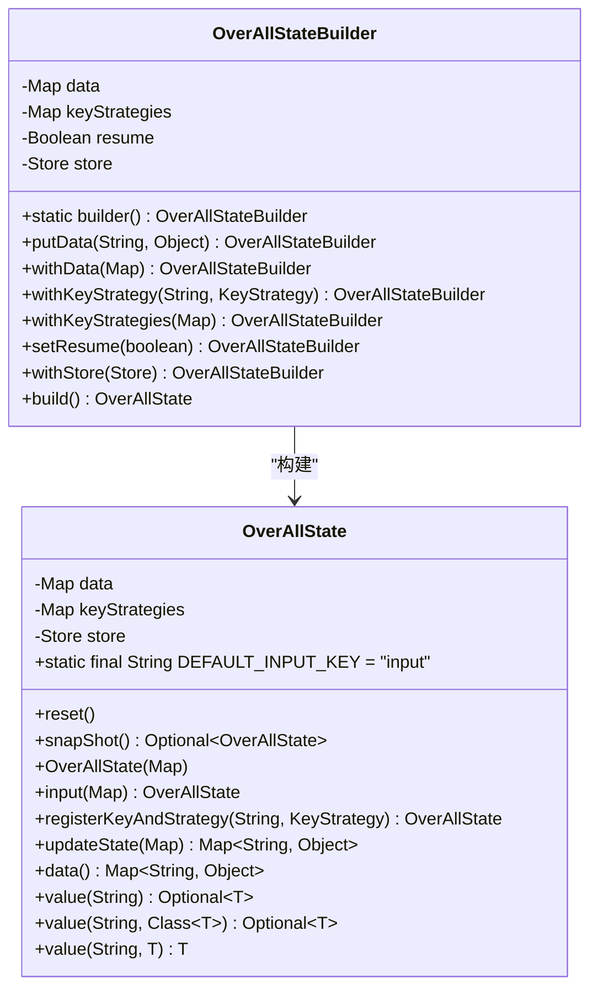
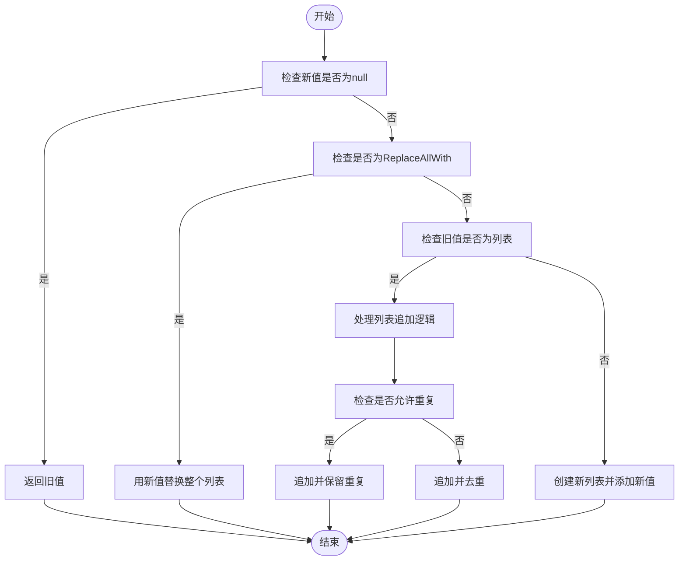
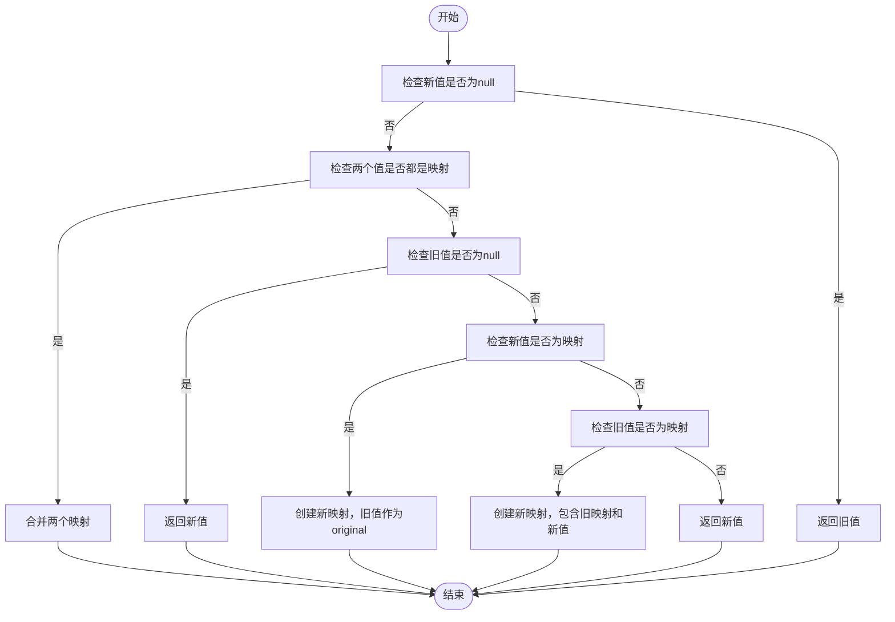
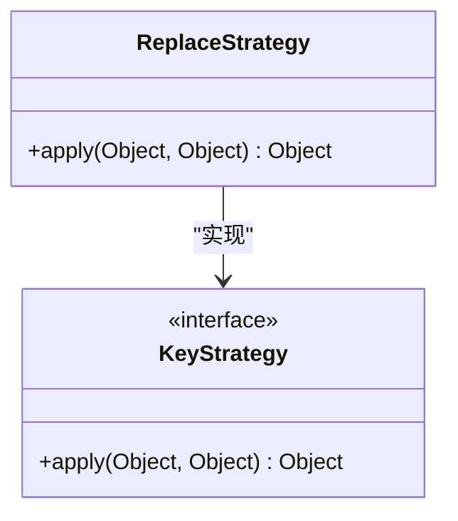
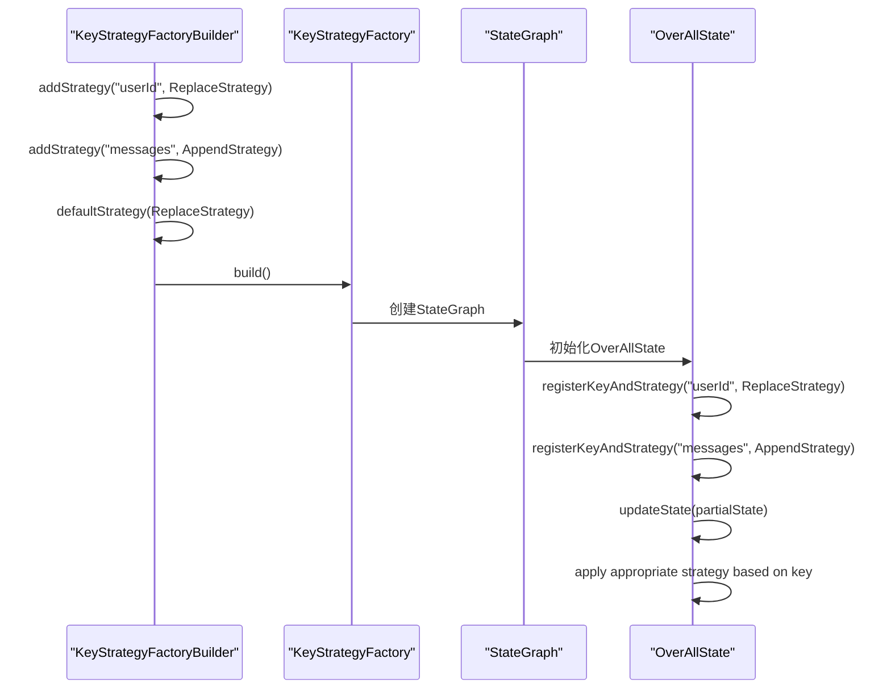

# 状态管理

<cite>
**本文档中引用的文件**  
- [OverAllState.java](file://spring-ai-alibaba-graph-core/src/main/java/com/alibaba/cloud/ai/graph/OverAllState.java)
- [OverAllStateBuilder.java](file://spring-ai-alibaba-graph-core/src/main/java/com/alibaba/cloud/ai/graph/OverAllStateBuilder.java)
- [AppendStrategy.java](file://spring-ai-alibaba-graph-core/src/main/java/com/alibaba/cloud/ai/graph/state/strategy/AppendStrategy.java)
- [MergeStrategy.java](file://spring-ai-alibaba-graph-core/src/main/java/com/alibaba/cloud/ai/graph/state/strategy/MergeStrategy.java)
- [ReplaceStrategy.java](file://spring-ai-alibaba-graph-core/src/main/java/com/alibaba/cloud/ai/graph/state/strategy/ReplaceStrategy.java)
- [Channel.java](file://spring-ai-alibaba-graph-core/src/main/java/com/alibaba/cloud/ai/graph/state/Channel.java)
- [Reducer.java](file://spring-ai-alibaba-graph-core/src/main/java/com/alibaba/cloud/ai/graph/state/Reducer.java)
- [AppenderChannel.java](file://spring-ai-alibaba-graph-core/src/main/java/com/alibaba/cloud/ai/graph/state/AppenderChannel.java)
- [KeyStrategy.java](file://spring-ai-alibaba-graph-core/src/main/java/com/alibaba/cloud/ai/graph/KeyStrategy.java)
- [KeyStrategyFactory.java](file://spring-ai-alibaba-graph-core/src/main/java/com/alibaba/cloud/ai/graph/KeyStrategyFactory.java)
- [KeyStrategyFactoryBuilder.java](file://spring-ai-alibaba-graph-core/src/main/java/com/alibaba/cloud/ai/graph/KeyStrategyFactoryBuilder.java)
</cite>

## 目录
1. [简介](#简介)
2. [核心组件](#核心组件)
3. [状态合并策略](#状态合并策略)
4. [状态通道与归约器](#状态通道与归约器)
5. [工作流中的状态管理](#工作流中的状态管理)
6. [最佳实践](#最佳实践)
7. [结论](#结论)

## 简介

状态管理是Spring AI Alibaba框架中的核心机制，用于在工作流执行过程中维护和共享数据。`OverAllState`作为全局状态容器，为图结构的处理管道提供了一个中心化的数据存储和管理方案。该系统支持灵活的更新策略，允许开发者根据具体需求选择不同的状态合并方式。通过`Channel`和`Reducer`机制，状态管理不仅能够处理简单的键值对更新，还能实现复杂的数据结构操作。本文档将深入探讨这些核心概念，为开发者提供全面的状态管理指导。

## 核心组件

`OverAllState`是状态管理系统的核心类，作为图或工作流执行的整体状态容器。它通过一个内部的`Map<String, Object>`存储实际的状态数据，所有状态值的获取和设置操作都通过这个映射进行。每个键都关联一个`KeyStrategy`，用于确定新值如何与现有值合并或更新。`OverAllState`提供了不可变视图，通过`data()`和`keyStrategies()`方法返回数据和策略的不可修改映射，确保了状态的封装性和安全性。

`OverAllStateBuilder`是一个构建器类，提供了流畅的API来构造`OverAllState`实例。它支持方法链式调用，使状态的构建过程更加清晰和简洁。构建器允许设置数据、注册更新策略、配置恢复模式，并自动确保默认输入键("input")使用替换策略。这种设计模式分离了复杂对象的构建过程和其表示，使得相同的构建过程可以创建不同的状态表示。



**图表来源**  
- [OverAllState.java](file://spring-ai-alibaba-graph-core/src/main/java/com/alibaba/cloud/ai/graph/OverAllState.java)
- [OverAllStateBuilder.java](file://spring-ai-alibaba-graph-core/src/main/java/com/alibaba/cloud/ai/graph/OverAllStateBuilder.java)

**章节来源**  
- [OverAllState.java](file://spring-ai-alibaba-graph-core/src/main/java/com/alibaba/cloud/ai/graph/OverAllState.java#L77-L560)
- [OverAllStateBuilder.java](file://spring-ai-alibaba-graph-core/src/main/java/com/alibaba/cloud/ai/graph/OverAllStateBuilder.java#L66-L175)

## 状态合并策略

状态合并策略是`OverAllState`系统的核心特性，它定义了如何将新值与现有状态值进行合并。框架提供了三种主要的合并策略：追加（Append）、合并（Merge）和替换（Replace），每种策略适用于不同的使用场景。

### AppendStrategy（追加策略）

`AppendStrategy`用于将新值追加到现有值中，特别适用于列表或数组类型的数据。当新值为`null`时，返回旧值；当新值为`ReplaceAllWith`实例时，用新值替换整个列表。该策略支持去重功能，通过`allowDuplicate`标志控制是否允许重复元素。对于列表、数组或集合类型的新值，它会将其所有元素追加到现有列表中。如果现有值不是列表，则创建一个新列表并添加新值。



**图表来源**  
- [AppendStrategy.java](file://spring-ai-alibaba-graph-core/src/main/java/com/alibaba/cloud/ai/graph/state/strategy/AppendStrategy.java)

**章节来源**  
- [AppendStrategy.java](file://spring-ai-alibaba-graph-core/src/main/java/com/alibaba/cloud/ai/graph/state/strategy/AppendStrategy.java#L31-L136)

### MergeStrategy（合并策略）

`MergeStrategy`专门用于合并两个映射（Map）对象。当两个值都是映射时，它会创建一个新映射，包含两个输入映射的所有条目。如果旧值为`null`，则直接返回新值。当新值是映射而旧值不是时，创建一个新映射，将旧值作为"original"键的值，并合并新映射的所有条目。反之，当旧值是映射而新值不是时，创建一个新映射，包含旧映射的所有条目，并将新值作为"additional"键的值。对于其他情况，直接返回新值，类似于替换策略。



**图表来源**  
- [MergeStrategy.java](file://spring-ai-alibaba-graph-core/src/main/java/com/alibaba/cloud/ai/graph/state/strategy/MergeStrategy.java)

**章节来源**  
- [MergeStrategy.java](file://spring-ai-alibaba-graph-core/src/main/java/com/alibaba/cloud/ai/graph/state/strategy/MergeStrategy.java#L27-L71)

### ReplaceStrategy（替换策略）

`ReplaceStrategy`是最简单的合并策略，它直接用新值替换旧值。该策略的实现非常简洁，`apply`方法直接返回新值，无论旧值是什么。这种策略适用于需要完全覆盖现有状态的场景，如用户输入、配置更新等。它是系统的默认策略，当没有为特定键注册其他策略时，系统会自动使用替换策略。



**图表来源**  
- [ReplaceStrategy.java](file://spring-ai-alibaba-graph-core/src/main/java/com/alibaba/cloud/ai/graph/state/strategy/ReplaceStrategy.java)

**章节来源**  
- [ReplaceStrategy.java](file://spring-ai-alibaba-graph-core/src/main/java/com/alibaba/cloud/ai/graph/state/strategy/ReplaceStrategy.java#L20-L27)

## 状态通道与归约器

状态通道（Channel）和归约器（Reducer）是状态管理系统中的高级特性，提供了更精细的状态更新控制机制。`Channel`接口定义了状态属性的维护机制，它与一个键和一个值相关联，通过`update`方法来更新通道的值。通道可以初始化为默认值，这个默认值由`Supplier`提供。`Channel`还可以关联一个`Reducer`，这是一个函数，用于将当前值与新值组合并返回更新后的值。

`Reducer`接口继承自`BiFunction<T, T, T>`，定义了如何将两个相同类型的值组合成一个新值。在`AppenderChannel`的实现中，`Reducer`用于将两个列表合并成一个列表。当第一个列表为`null`时，返回第二个列表；否则，将第二个列表的所有元素添加到第一个列表的末尾。

`AppenderChannel`是`Channel`的一个具体实现，专门用于处理列表类型的状态属性。它内部维护一个`Reducer<List<T>>`和一个`Supplier<List<T>>`，分别用于定义列表的合并逻辑和提供默认列表。`AppenderChannel`支持通过`RemoveIdentifier`接口从列表中移除元素，提供了更灵活的列表操作能力。

```mermaid
classDiagram
class Channel~T~ {
<<interface>>
+static of(Supplier~T~) Channel~T~
+static of(Reducer~T~) Channel~T~
+static of(Reducer~T~, Supplier~T~) Channel~T~
+getReducer() Optional~Reducer~T~~
+getDefault() Optional~Supplier~T~~
+update(String, Object, Object) Object
}
class Reducer~T~ {
<<interface>>
+apply(T, T) T
}
class AppenderChannel~T~ {
-Reducer~T[]~ reducer
-Supplier~T[]~ defaultProvider
+static of(Supplier~T[]~) AppenderChannel~T~
+getReducer() Optional~Reducer~T[]~~
+getDefault() Optional~Supplier~T[]~
+update(String, Object, Object) Object
}
class BaseChannel~T~ {
-Supplier~T~ defaultProvider
-Reducer~T~ reducer
+BaseChannel(Reducer~T~, Supplier~T~)
+getDefault() Optional~Supplier~T~~
+getReducer() Optional~Reducer~T~~
}
Channel~T~ <|-- BaseChannel~T~
Channel~T~ <|-- AppenderChannel~T~
Reducer~T~ <|-- AppenderChannel~T~ : : reducer
Reducer~T~ <|-- BaseChannel~T~ : : reducer
```

**图表来源**  
- [Channel.java](file://spring-ai-alibaba-graph-core/src/main/java/com/alibaba/cloud/ai/graph/state/Channel.java)
- [Reducer.java](file://spring-ai-alibaba-graph-core/src/main/java/com/alibaba/cloud/ai/graph/state/Reducer.java)
- [AppenderChannel.java](file://spring-ai-alibaba-graph-core/src/main/java/com/alibaba/cloud/ai/graph/state/AppenderChannel.java)

**章节来源**  
- [Channel.java](file://spring-ai-alibaba-graph-core/src/main/java/com/alibaba/cloud/ai/graph/state/Channel.java#L89-L153)
- [Reducer.java](file://spring-ai-alibaba-graph-core/src/main/java/com/alibaba/cloud/ai/graph/state/Reducer.java#L20-L22)
- [AppenderChannel.java](file://spring-ai-alibaba-graph-core/src/main/java/com/alibaba/cloud/ai/graph/state/AppenderChannel.java#L30-L247)

## 工作流中的状态管理

在工作流中，状态管理通过`KeyStrategyFactory`和`KeyStrategyFactoryBuilder`进行配置。`KeyStrategyFactory`是一个函数式接口，其`apply`方法返回一个包含所有键策略映射的`Map<String, KeyStrategy>`。`KeyStrategyFactoryBuilder`提供了流畅的API来构建`KeyStrategyFactory`，支持为特定键添加策略、设置默认策略、添加前缀或包含子字符串的策略等。

在实际应用中，开发者可以通过`KeyStrategyFactoryBuilder`创建自定义的策略工厂。例如，在用户会话工作流中，可以为`userId`、`userName`、`action`等键注册`ReplaceStrategy`，确保这些属性在每次更新时都被完全替换。对于消息列表，可以注册`AppendStrategy`，使新消息能够追加到现有消息列表中。



**图表来源**  
- [KeyStrategyFactory.java](file://spring-ai-alibaba-graph-core/src/main/java/com/alibaba/cloud/ai/graph/KeyStrategyFactory.java)
- [KeyStrategyFactoryBuilder.java](file://spring-ai-alibaba-graph-core/src/main/java/com/alibaba/cloud/ai/graph/KeyStrategyFactoryBuilder.java)

**章节来源**  
- [KeyStrategyFactory.java](file://spring-ai-alibaba-graph-core/src/main/java/com/alibaba/cloud/ai/graph/KeyStrategyFactory.java#L31-L41)
- [KeyStrategyFactoryBuilder.java](file://spring-ai-alibaba-graph-core/src/main/java/com/alibaba/cloud/ai/graph/KeyStrategyFactoryBuilder.java#L48-L202)

## 最佳实践

在使用状态管理系统时，应遵循以下最佳实践：

1. **避免状态膨胀**：对于可能无限增长的状态属性（如消息列表），应定期清理或限制大小。可以使用`RemoveIdentifier`从列表中移除旧元素，或实现自定义策略来管理列表大小。

2. **确保状态一致性**：在并发环境中，`OverAllState`不是线程安全的，需要外部同步。对于跨执行的长期记忆存储，应使用`Store`实例来持久化状态。

3. **合理选择合并策略**：
   - 使用`ReplaceStrategy`处理需要完全覆盖的属性，如用户输入、配置参数。
   - 使用`AppendStrategy`处理列表或数组类型的属性，如消息历史、日志条目。
   - 使用`MergeStrategy`处理需要合并的映射对象，如配置对象、元数据。

4. **使用构建器模式**：通过`OverAllStateBuilder`创建状态实例，可以更清晰地表达状态的构建意图，并避免直接操作内部数据结构。

5. **利用快照功能**：`snapShot()`方法可以创建当前状态的不可变快照，用于调试、回滚或持久化。

6. **正确处理null值**：在策略实现中，应妥善处理`null`值，避免空指针异常。`MARK_FOR_REMOVAL`对象可用于标记需要从状态中移除的键。

## 结论

Spring AI Alibaba的状态管理系统提供了一个强大而灵活的框架，用于在工作流中管理和操作状态。`OverAllState`作为全局状态容器，结合`AppendStrategy`、`MergeStrategy`和`ReplaceStrategy`三种合并策略，能够满足各种复杂场景的需求。通过`Channel`和`Reducer`机制，系统支持更精细的状态更新控制。`KeyStrategyFactory`和`KeyStrategyFactoryBuilder`提供了便捷的配置方式，使开发者能够轻松定义和管理状态更新策略。遵循最佳实践，可以有效避免状态膨胀，确保状态一致性，构建高效可靠的工作流应用。