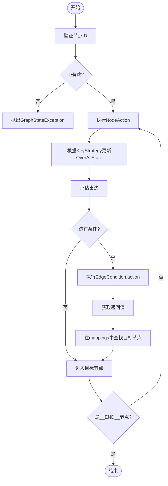
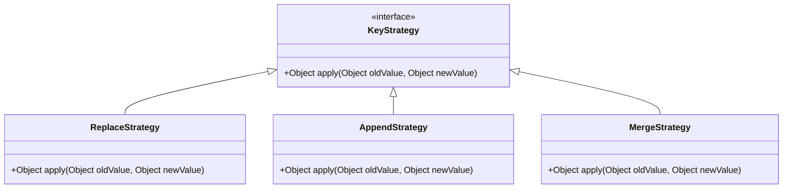

# 节点与边

<cite>
**本文档中引用的文件**  
- [Node.java](file://spring-ai-alibaba-graph-core/src/main/java/com/alibaba/cloud/ai/graph/internal/node/Node.java)
- [Edge.java](file://spring-ai-alibaba-graph-core/src/main/java/com/alibaba/cloud/ai/graph/internal/edge/Edge.java)
- [NodeAction.java](file://spring-ai-alibaba-graph-core/src/main/java/com/alibaba/cloud/ai/graph/action/NodeAction.java)
- [EdgeAction.java](file://spring-ai-alibaba-graph-core/src/main/java/com/alibaba/cloud/ai/graph/action/EdgeAction.java)
- [EdgeCondition.java](file://spring-ai-alibaba-graph-core/src/main/java/com/alibaba/cloud/ai/graph/internal/edge/EdgeCondition.java)
- [EdgeValue.java](file://spring-ai-alibaba-graph-core/src/main/java/com/alibaba/cloud/ai/graph/internal/edge/EdgeValue.java)
- [ParallelNode.java](file://spring-ai-alibaba-graph-core/src/main/java/com/alibaba/cloud/ai/graph/internal/node/ParallelNode.java)
- [OverAllState.java](file://spring-ai-alibaba-graph-core/src/main/java/com/alibaba/cloud/ai/graph/OverAllState.java)
- [StateGraph.java](file://spring-ai-alibaba-graph-core/src/main/java/com/alibaba/cloud/ai/graph/StateGraph.java)
- [AppendStrategy.java](file://spring-ai-alibaba-graph-core/src/main/java/com/alibaba/cloud/ai/graph/state/strategy/AppendStrategy.java)
- [MergeStrategy.java](file://spring-ai-alibaba-graph-core/src/main/java/com/alibaba/cloud/ai/graph/state/strategy/MergeStrategy.java)
- [ReplaceStrategy.java](file://spring-ai-alibaba-graph-core/src/main/java/com/alibaba/cloud/ai/graph/state/strategy/ReplaceStrategy.java)
- [LlmNode.java](file://spring-boot-starters/spring-ai-alibaba-starter-builtin-nodes/src/main/java/com/alibaba/cloud/ai/graph/node/LlmNode.java)
- [ToolNode.java](file://spring-boot-starters/spring-ai-alibaba-starter-builtin-nodes/src/main/java/com/alibaba/cloud/ai/graph/node/ToolNode.java)
</cite>

## 目录
1. [引言](#引言)
2. [节点（Node）数据模型](#节点node数据模型)
3. [边（Edge）数据模型](#边edge数据模型)
4. [节点与边的交互机制](#节点与边的交互机制)
5. [状态管理与数据流](#状态管理与数据流)
6. [内置节点实现示例](#内置节点实现示例)
7. [复杂节点逻辑实现指南](#复杂节点逻辑实现指南)
8. [结论](#结论)

## 引言

在Spring AI Alibaba框架中，节点（Node）和边（Edge）构成了工作流执行的核心数据模型。该模型基于有向无环图（DAG）的设计理念，将复杂的业务流程分解为可独立执行的最小单元（节点），并通过有向边定义其执行顺序和条件路由。这种设计模式不仅提供了高度的灵活性和可扩展性，还支持并行执行、条件分支和循环等高级工作流特性。本文档将深入剖析节点与边的内部数据结构、状态转换逻辑以及它们在图遍历中的作用，为开发者提供实现自定义节点和边的完整指南。

## 节点（Node）数据模型

节点是工作流中的最小执行单元，代表一个具体的操作或任务。每个节点由一个唯一的标识符（ID）和一个动作工厂（ActionFactory）构成，该工厂负责创建在节点执行时被调用的具体动作。

### 节点核心结构

`Node` 类是所有节点的基类，其核心属性包括：
- **id**: 节点的唯一标识符，用于在图中定位和引用该节点。标识符不能以 `__` 开头，且不能与预定义的常量（如 `__START__` 和 `__END__`）冲突。
- **actionFactory**: 一个函数式接口，接受编译配置（`CompileConfig`）并返回一个 `AsyncNodeActionWithConfig` 实例。这个工厂模式允许节点在编译时动态生成其执行动作。

```java
public class Node {
    private final String id;
    private final ActionFactory actionFactory;

    public interface ActionFactory {
        AsyncNodeActionWithConfig apply(CompileConfig config) throws GraphStateException;
    }
}
```

**节点来源**
- [Node.java](file://spring-ai-alibaba-graph-core/src/main/java/com/alibaba/cloud/ai/graph/internal/node/Node.java#L39-L138)

### 节点动作（NodeAction）

`NodeAction` 是一个函数式接口，定义了节点执行的核心逻辑。它接收当前的全局状态（`OverAllState`）作为输入，并返回一个包含更新后数据的 `Map<String, Object>`。

```java
@FunctionalInterface
public interface NodeAction {
    Map<String, Object> apply(OverAllState state) throws Exception;
}
```

当一个节点被调度执行时，其 `actionFactory` 会生成一个 `AsyncNodeActionWithConfig` 实例，该实例的 `apply` 方法会被调用，从而执行节点的业务逻辑，并将结果写入全局状态。

**节点动作来源**
- [NodeAction.java](file://spring-ai-alibaba-graph-core/src/main/java/com/alibaba/cloud/ai/graph/action/NodeAction.java#L23-L27)

### 并行节点（ParallelNode）

`ParallelNode` 是 `Node` 的一个特殊子类，用于支持并行执行多个子任务。它通过 `ThreadPoolExecutor` 管理一个优化的线程池，确保在混合I/O和CPU工作负载下获得最佳性能。

`ParallelNode` 的关键特性包括：
- **动态线程池配置**: 核心线程数为CPU核心数的2倍，最大线程数为CPU核心数的4倍（上限200），队列容量为1000。
- **CallerRunsPolicy拒绝策略**: 当线程池和队列都满时，新任务将在调用线程中直接执行，防止任务丢失。
- **状态快照隔离**: 为每个并行子任务创建全局状态的快照，避免因并发修改导致的数据竞争。

```java
public class ParallelNode extends Node {
    private static final ExecutorService DEFAULT_EXECUTOR = new ThreadPoolExecutor(
        calculateCorePoolSize(), // CPU核心数 * 2
        calculateMaximumPoolSize(), // CPU核心数 * 4 (上限200)
        60L, TimeUnit.SECONDS,
        new LinkedBlockingQueue<>(1000), // 大容量队列
        DEFAULT_THREAD_FACTORY,
        new ThreadPoolExecutor.CallerRunsPolicy() // 调用者运行策略
    );
}
```

**并行节点来源**
- [ParallelNode.java](file://spring-ai-alibaba-graph-core/src/main/java/com/alibaba/cloud/ai/graph/internal/node/ParallelNode.java#L45-L372)

## 边（Edge）数据模型

边是连接两个节点的有向连接，定义了工作流的执行路径。与简单的线性连接不同，该框架中的边支持复杂的条件路由，通过 `EdgeCondition` 实现。

### 边核心结构

`Edge` 是一个记录（record），包含源节点ID和目标值列表（`targets`）。一个边可以有多个目标，这使其天然支持并行分支。

```java
public record Edge(String sourceId, List<EdgeValue> targets) {
    public boolean isParallel() {
        return targets.size() > 1;
    }
}
```

**边来源**
- [Edge.java](file://spring-ai-alibaba-graph-core/src/main/java/com/alibaba/cloud/ai/graph/internal/edge/Edge.java#L39-L149)

### 边条件（EdgeCondition）

`EdgeCondition` 是实现条件路由的关键。它包含一个 `AsyncCommandAction` 和一个映射表（`mappings`）。`AsyncCommandAction` 是一个异步执行的动作，其返回值将决定边的走向。

```java
public record EdgeCondition(AsyncCommandAction action, Map<String, String> mappings) {
}
```

`mappings` 是一个键值对映射，其中键是 `AsyncCommandAction` 执行结果的可能值，值是目标节点的ID。例如，一个条件动作返回 `"approve"` 或 `"reject"`，`mappings` 可以将其映射到 `approve_node` 或 `reject_node`。

### 边值（EdgeValue）

`EdgeValue` 是连接 `Edge` 和 `EdgeCondition` 的桥梁。它包含一个目标节点ID（`id`）或一个 `EdgeCondition`（`value`）。这允许边既可以是简单的直接连接，也可以是基于条件的动态路由。

```java
public record EdgeValue(String id, EdgeCondition value) {
}
```

**边条件来源**
- [EdgeCondition.java](file://spring-ai-alibaba-graph-core/src/main/java/com/alibaba/cloud/ai/graph/internal/edge/EdgeCondition.java#L31-L38)
- [EdgeValue.java](file://spring-ai-alibaba-graph-core/src/main/java/com/alibaba/cloud/ai/graph/internal/edge/EdgeValue.java#L26-L50)

## 节点与边的交互机制

节点和边通过 `StateGraph` 类协同工作，形成一个完整的执行图。图的遍历和执行由 `GraphRunner` 控制。

### 图的构建与验证

`StateGraph` 维护了节点集合（`Nodes`）和边集合（`Edges`）。在图被编译（`compile()`）时，会进行严格的验证：
- **节点验证**: 检查节点ID是否有效（非空、不以 `__` 开头）。
- **边验证**: 检查边的源节点和目标节点是否存在于图中，防止出现悬空引用。
- **并行边验证**: 检查并行边的目标ID是否重复，确保路由的明确性。

```java
public void validate(StateGraph.Nodes nodes) throws GraphStateException {
    if (!Objects.equals(sourceId(), START) && !nodes.anyMatchById(sourceId())) {
        throw Errors.missingNodeReferencedByEdge.exception(sourceId());
    }
    // ... 其他验证逻辑
}
```

**图构建来源**
- [StateGraph.java](file://spring-ai-alibaba-graph-core/src/main/java/com/alibaba/cloud/ai/graph/StateGraph.java#L56-L200)

### 执行流程

1.  **启动**: 执行从 `__START__` 节点开始。
2.  **节点执行**: 调度器选择一个可执行的节点，调用其 `NodeAction` 的 `apply` 方法。
3.  **状态更新**: 节点执行后返回一个 `Map<String, Object>`，该结果会根据预定义的 `KeyStrategy` 合并到全局状态 `OverAllState` 中。
4.  **边评估**: 节点执行完成后，评估所有从该节点出发的边。
    - 对于简单边，直接进入目标节点。
    - 对于条件边，执行 `EdgeCondition` 中的 `AsyncCommandAction`，根据其返回值查找 `mappings` 中对应的目标节点ID。
5.  **循环**: 重复步骤2-4，直到到达 `__END__` 节点。



**流程图来源**
- [StateGraph.java](file://spring-ai-alibaba-graph-core/src/main/java/com/alibaba/cloud/ai/graph/StateGraph.java#L86-L91)
- [Edge.java](file://spring-ai-alibaba-graph-core/src/main/java/com/alibaba/cloud/ai/graph/internal/edge/Edge.java#L76-L122)

## 状态管理与数据流

`OverAllState` 类是整个工作流的状态中心，负责在节点间传递和共享数据。

### OverAllState 核心功能

- **数据存储**: 使用 `Map<String, Object>` 存储任意类型的数据。
- **键策略（KeyStrategy）**: 为每个键（key）关联一个策略，控制新旧值的合并方式。
- **快照（Snapshot）**: 提供 `snapShot()` 方法，创建当前状态的不可变副本，这对于并行执行和错误恢复至关重要。

```java
public final class OverAllState implements Serializable {
    private final Map<String, Object> data;
    private final Map<String, KeyStrategy> keyStrategies;
    
    public Optional<OverAllState> snapShot() {
        return Optional.of(new OverAllState(new HashMap<>(this.data), new HashMap<>(this.keyStrategies), this.store));
    }
}
```

**状态来源**
- [OverAllState.java](file://spring-ai-alibaba-graph-core/src/main/java/com/alibaba/cloud/ai/graph/OverAllState.java#L77-L560)

### 键策略（KeyStrategy）

`KeyStrategy` 是一个函数式接口，定义了如何将新值（`newValue`）与旧值（`oldValue`）合并。

```java
@FunctionalInterface
public interface KeyStrategy {
    Object apply(Object oldValue, Object newValue);
}
```

框架提供了三种内置策略：
- **ReplaceStrategy**: 直接用新值替换旧值。
- **AppendStrategy**: 将新值追加到旧值中。如果旧值是列表，则将新值添加到列表末尾；如果新值是列表，则将所有元素追加。可通过 `allowDuplicate` 参数控制是否允许重复。
- **MergeStrategy**: 尝试合并两个值。如果两者都是 `Map`，则合并两个 `Map`；否则，返回新值。



**类图来源**
- [ReplaceStrategy.java](file://spring-ai-alibaba-graph-core/src/main/java/com/alibaba/cloud/ai/graph/state/strategy/ReplaceStrategy.java#L20-L27)
- [AppendStrategy.java](file://spring-ai-alibaba-graph-core/src/main/java/com/alibaba/cloud/ai/graph/state/strategy/AppendStrategy.java#L31-L136)
- [MergeStrategy.java](file://spring-ai-alibaba-graph-core/src/main/java/com/alibaba/cloud/ai/graph/state/strategy/MergeStrategy.java#L27-L71)

## 内置节点实现示例

框架提供了一些开箱即用的内置节点，它们是 `NodeAction` 的具体实现。

### LLM节点（LlmNode）

`LlmNode` 用于调用大语言模型（LLM）。它封装了构建提示（prompt）、调用 `ChatClient` 和处理响应的逻辑。

```java
public class LlmNode implements NodeAction {
    private String systemPrompt;
    private String userPrompt;
    private ChatClient chatClient;
    private String outputKey; // 结果存储的键

    @Override
    public Map<String, Object> apply(OverAllState state) throws Exception {
        // 1. 从state中获取输入数据
        // 2. 构建完整的消息列表
        // 3. 调用chatClient.stream(prompt)或.call(prompt)
        // 4. 将响应结果（AssistantMessage）存入state
        return Map.of(outputKey, assistantMessage);
    }
}
```

**LLM节点来源**
- [LlmNode.java](file://spring-boot-starters/spring-ai-alibaba-starter-builtin-nodes/src/main/java/com/alibaba/cloud/ai/graph/node/LlmNode.java#L40-L344)

### 工具节点（ToolNode）

`ToolNode` 用于执行LLM返回的工具调用（Tool Call）。它从 `OverAllState` 中获取 `AssistantMessage`，解析出工具调用请求，并调用相应的 `ToolCallback`。

```java
public class ToolNode implements NodeAction {
    private String llmResponseKey; // 存储LLM响应的键
    private List<ToolCallback> toolCallbacks;
    private ToolCallbackResolver toolCallbackResolver;

    @Override
    public Map<String, Object> apply(OverAllState state) throws Exception {
        // 1. 从state中获取AssistantMessage
        // 2. 遍历message中的toolCalls
        // 3. 使用toolCallbackResolver找到对应的ToolCallback
        // 4. 执行ToolCallback并获取结果
        // 5. 将工具调用结果（ToolResponseMessage）存入state
        return Map.of(outputKey, toolResponseMessage);
    }
}
```

**工具节点来源**
- [ToolNode.java](file://spring-boot-starters/spring-ai-alibaba-starter-builtin-nodes/src/main/java/com/alibaba/cloud/ai/graph/node/ToolNode.java#L40-L164)

## 复杂节点逻辑实现指南

在实现复杂节点时，开发者可能会遇到以下问题：

### 1. 状态管理问题

**问题**: 多个节点需要更新同一个状态字段，但合并逻辑复杂。
**解决方案**: 使用合适的 `KeyStrategy`。
- 如果需要累积数据（如聊天历史），使用 `AppendStrategy`。
- 如果需要合并配置信息，使用 `MergeStrategy`。
- 如果需要完全替换状态，使用 `ReplaceStrategy`。

### 2. 并行执行的副作用

**问题**: 并行节点中的子任务修改共享状态，导致数据竞争。
**解决方案**: 
- **使用状态快照**: `ParallelNode` 会为每个子任务创建状态快照，这是最佳实践。
- **原子操作**: 确保对共享状态的更新是原子的，或者使用线程安全的数据结构。

### 3. 条件路由的动态性

**问题**: 路由决策依赖于复杂的业务逻辑，无法通过简单的映射表实现。
**解决方案**: 在 `EdgeCondition` 的 `AsyncCommandAction` 中编写复杂的决策逻辑。

```java
EdgeCondition complexCondition = new EdgeCondition(
    state -> {
        // 复杂的业务逻辑判断
        if (state.value("score").orElse(0) > 80) {
            return "high_score";
        } else if (state.value("score").orElse(0) > 60) {
            return "medium_score";
        } else {
            return "low_score";
        }
    },
    Map.of("high_score", "approve_node", "medium_score", "review_node", "low_score", "reject_node")
);
```

### 4. 错误处理与恢复

**问题**: 节点执行失败，如何优雅地处理？
**解决方案**: 
- 在 `NodeAction.apply()` 方法中捕获异常，并返回一个包含错误信息的状态。
- 使用 `__ERROR__` 节点作为错误处理的入口，集中处理所有错误。
- 利用 `CheckpointSaver` 实现状态持久化，支持从失败点恢复。

## 结论

Spring AI Alibaba的节点与边数据模型提供了一个强大而灵活的工作流引擎基础。通过将执行单元抽象为节点，将执行路径抽象为边，并引入条件路由和并行执行等高级特性，该模型能够有效应对复杂的AI应用流程。`OverAllState` 和 `KeyStrategy` 的设计确保了状态管理的灵活性和安全性。开发者可以通过实现 `NodeAction` 接口来创建自定义节点，并利用 `EdgeCondition` 实现复杂的条件分支逻辑。理解这些核心组件的内部机制，是构建高效、可靠AI工作流的关键。