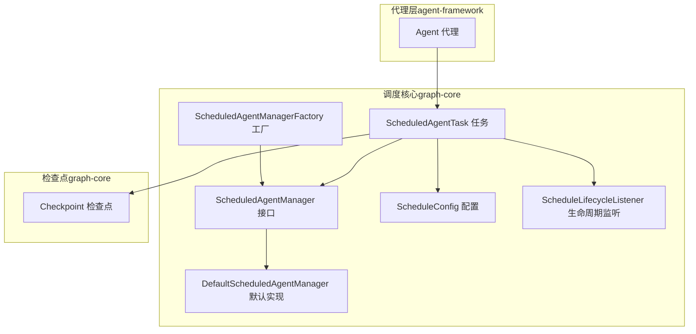
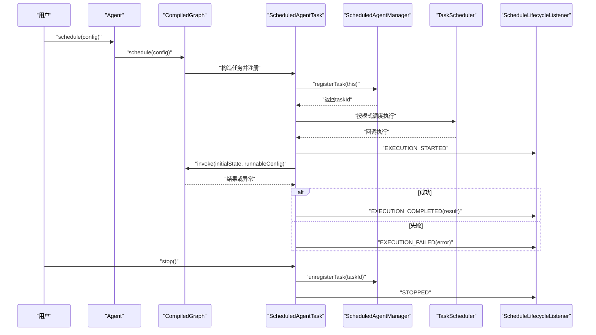
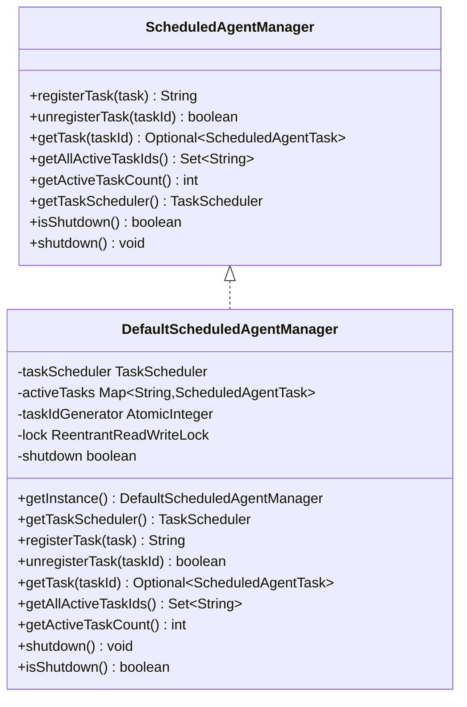
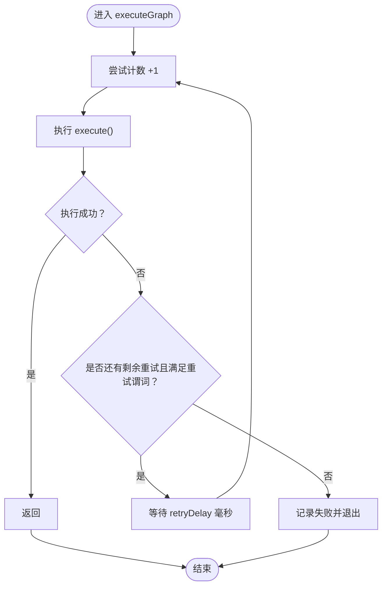
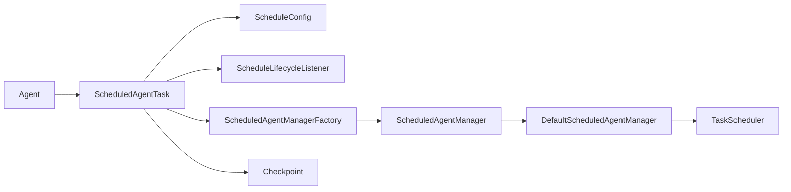

# 调度系统

<cite>
**本文引用的文件列表**
- [ScheduledAgentManager.java](file://spring-ai-alibaba-graph-core/src/main/java/com/alibaba/cloud/ai/graph/scheduling/ScheduledAgentManager.java)
- [DefaultScheduledAgentManager.java](file://spring-ai-alibaba-graph-core/src/main/java/com/alibaba/cloud/ai/graph/scheduling/DefaultScheduledAgentManager.java)
- [ScheduledAgentManagerFactory.java](file://spring-ai-alibaba-graph-core/src/main/java/com/alibaba/cloud/ai/graph/scheduling/ScheduledAgentManagerFactory.java)
- [ScheduleConfig.java](file://spring-ai-alibaba-graph-core/src/main/java/com/alibaba/cloud/ai/graph/scheduling/ScheduleConfig.java)
- [ScheduledAgentTask.java](file://spring-ai-alibaba-graph-core/src/main/java/com/alibaba/cloud/ai/graph/scheduling/ScheduledAgentTask.java)
- [ScheduleLifecycleListener.java](file://spring-ai-alibaba-graph-core/src/main/java/com/alibaba/cloud/ai/graph/scheduling/ScheduleLifecycleListener.java)
- [Agent.java](file://spring-ai-alibaba-agent-framework/src/main/java/com/alibaba/cloud/ai/graph/agent/Agent.java)
- [ScheduledAgentTaskTest.java](file://spring-ai-alibaba-agent-framework/src/test/java/com/alibaba/cloud/ai/graph/agent/scheduling/ScheduledAgentTaskTest.java)
- [Checkpoint.java](file://spring-ai-alibaba-graph-core/src/main/java/com/alibaba/cloud/ai/graph/checkpoint/Checkpoint.java)
</cite>

## 目录
1. [简介](#简介)
2. [项目结构](#项目结构)
3. [核心组件](#核心组件)
4. [架构总览](#架构总览)
5. [详细组件分析](#详细组件分析)
6. [依赖关系分析](#依赖关系分析)
7. [性能与线程模型](#性能与线程模型)
8. [故障排查指南](#故障排查指南)
9. [结论](#结论)
10. [附录：常见用法示例](#附录常见用法示例)

## 简介
本文件面向调度系统（Scheduling System）的使用者与维护者，系统性阐述如何基于 ScheduledAgentManager 管理定时执行的代理任务；详解 ScheduleConfig 的配置项（如 cron 表达式、固定延迟、触发器等）；说明 ScheduledAgentTask 的执行生命周期与错误重试策略；并提供创建周期性工作流的实用示例（如定时数据同步或报告生成）。同时讨论线程模型、资源管理以及与检查点系统的集成，以确保任务的可靠执行。

## 项目结构
调度系统位于图执行与代理框架的交界处，核心代码集中在 graph-core 模块的 scheduling 包中，并通过代理层（Agent）对外暴露调度能力。测试用例展示了典型使用方式与生命周期事件监听。

图表来源
- [ScheduledAgentManager.java](file://spring-ai-alibaba-graph-core/src/main/java/com/alibaba/cloud/ai/graph/scheduling/ScheduledAgentManager.java#L1-L84)
- [DefaultScheduledAgentManager.java](file://spring-ai-alibaba-graph-core/src/main/java/com/alibaba/cloud/ai/graph/scheduling/DefaultScheduledAgentManager.java#L1-L220)
- [ScheduledAgentManagerFactory.java](file://spring-ai-alibaba-graph-core/src/main/java/com/alibaba/cloud/ai/graph/scheduling/ScheduledAgentManagerFactory.java#L1-L76)
- [ScheduleConfig.java](file://spring-ai-alibaba-graph-core/src/main/java/com/alibaba/cloud/ai/graph/scheduling/ScheduleConfig.java#L1-L234)
- [ScheduledAgentTask.java](file://spring-ai-alibaba-graph-core/src/main/java/com/alibaba/cloud/ai/graph/scheduling/ScheduledAgentTask.java#L1-L217)
- [ScheduleLifecycleListener.java](file://spring-ai-alibaba-graph-core/src/main/java/com/alibaba/cloud/ai/graph/scheduling/ScheduleLifecycleListener.java#L1-L40)
- [Agent.java](file://spring-ai-alibaba-agent-framework/src/main/java/com/alibaba/cloud/ai/graph/agent/Agent.java#L130-L160)
- [Checkpoint.java](file://spring-ai-alibaba-graph-core/src/main/java/com/alibaba/cloud/ai/graph/checkpoint/Checkpoint.java#L1-L134)

章节来源
- [ScheduledAgentManager.java](file://spring-ai-alibaba-graph-core/src/main/java/com/alibaba/cloud/ai/graph/scheduling/ScheduledAgentManager.java#L1-L84)
- [DefaultScheduledAgentManager.java](file://spring-ai-alibaba-graph-core/src/main/java/com/alibaba/cloud/ai/graph/scheduling/DefaultScheduledAgentManager.java#L1-L220)
- [ScheduledAgentManagerFactory.java](file://spring-ai-alibaba-graph-core/src/main/java/com/alibaba/cloud/ai/graph/scheduling/ScheduledAgentManagerFactory.java#L1-L76)
- [ScheduleConfig.java](file://spring-ai-alibaba-graph-core/src/main/java/com/alibaba/cloud/ai/graph/scheduling/ScheduleConfig.java#L1-L234)
- [ScheduledAgentTask.java](file://spring-ai-alibaba-graph-core/src/main/java/com/alibaba/cloud/ai/graph/scheduling/ScheduledAgentTask.java#L1-L217)
- [ScheduleLifecycleListener.java](file://spring-ai-alibaba-graph-core/src/main/java/com/alibaba/cloud/ai/graph/scheduling/ScheduleLifecycleListener.java#L1-L40)
- [Agent.java](file://spring-ai-alibaba-agent-framework/src/main/java/com/alibaba/cloud/ai/graph/agent/Agent.java#L130-L160)
- [Checkpoint.java](file://spring-ai-alibaba-graph-core/src/main/java/com/alibaba/cloud/ai/graph/checkpoint/Checkpoint.java#L1-L134)

## 核心组件
- ScheduledAgentManager：调度管理接口，定义注册、注销、查询、计数、获取 TaskScheduler、关闭等能力。
- DefaultScheduledAgentManager：默认实现，提供共享的线程池任务调度器，维护活动任务集合，支持统一关闭。
- ScheduledAgentManagerFactory：工厂，负责提供当前活跃的调度管理器实例，默认注册默认实现。
- ScheduleConfig：调度配置，支持 cron、固定延迟、固定速率、一次性、自定义 Trigger；包含输入、可选的 RunnableConfig、重试次数与延迟、重试谓词、生命周期监听器等。
- ScheduledAgentTask：具体任务封装，负责根据配置选择调度策略（Cron、固定延迟、固定速率、一次性、Trigger），执行图并通知监听器，支持带重试的执行流程。
- ScheduleLifecycleListener：生命周期事件回调接口，事件包括启动、停止、执行开始、执行完成、执行失败。
- Agent：代理层入口，提供 schedule 方法，将 ScheduleConfig 传递给底层编译后的图执行器，从而创建并启动 ScheduledAgentTask。
- Checkpoint：检查点对象，用于记录状态节点、下一节点及状态数据，支撑任务的可恢复与版本化。

章节来源
- [ScheduledAgentManager.java](file://spring-ai-alibaba-graph-core/src/main/java/com/alibaba/cloud/ai/graph/scheduling/ScheduledAgentManager.java#L1-L84)
- [DefaultScheduledAgentManager.java](file://spring-ai-alibaba-graph-core/src/main/java/com/alibaba/cloud/ai/graph/scheduling/DefaultScheduledAgentManager.java#L1-L220)
- [ScheduledAgentManagerFactory.java](file://spring-ai-alibaba-graph-core/src/main/java/com/alibaba/cloud/ai/graph/scheduling/ScheduledAgentManagerFactory.java#L1-L76)
- [ScheduleConfig.java](file://spring-ai-alibaba-graph-core/src/main/java/com/alibaba/cloud/ai/graph/scheduling/ScheduleConfig.java#L1-L234)
- [ScheduledAgentTask.java](file://spring-ai-alibaba-graph-core/src/main/java/com/alibaba/cloud/ai/graph/scheduling/ScheduledAgentTask.java#L1-L217)
- [ScheduleLifecycleListener.java](file://spring-ai-alibaba-graph-core/src/main/java/com/alibaba/cloud/ai/graph/scheduling/ScheduleLifecycleListener.java#L1-L40)
- [Agent.java](file://spring-ai-alibaba-agent-framework/src/main/java/com/alibaba/cloud/ai/graph/agent/Agent.java#L130-L160)
- [Checkpoint.java](file://spring-ai-alibaba-graph-core/src/main/java/com/alibaba/cloud/ai/graph/checkpoint/Checkpoint.java#L1-L134)

## 架构总览
调度系统采用“代理层 + 图执行层 + 调度管理层”的分层设计：
- 代理层（Agent）负责业务语义与输入构建，调用编译后的图执行器进行调度。
- 图执行层（CompiledGraph）承载实际的工作流执行逻辑。
- 调度管理层（ScheduledAgentManagerFactory/DefaultScheduledAgentManager）提供统一的任务调度器与活动任务管理。
- 生命周期监听器（ScheduleLifecycleListener）贯穿任务从注册到执行结束的全过程，便于观测与告警。
- 检查点（Checkpoint）为任务的可恢复与版本化提供基础能力。

图表来源
- [Agent.java](file://spring-ai-alibaba-agent-framework/src/main/java/com/alibaba/cloud/ai/graph/agent/Agent.java#L130-L160)
- [ScheduledAgentTask.java](file://spring-ai-alibaba-graph-core/src/main/java/com/alibaba/cloud/ai/graph/scheduling/ScheduledAgentTask.java#L1-L217)
- [ScheduledAgentManager.java](file://spring-ai-alibaba-graph-core/src/main/java/com/alibaba/cloud/ai/graph/scheduling/ScheduledAgentManager.java#L1-L84)
- [DefaultScheduledAgentManager.java](file://spring-ai-alibaba-graph-core/src/main/java/com/alibaba/cloud/ai/graph/scheduling/DefaultScheduledAgentManager.java#L1-L220)
- [ScheduleLifecycleListener.java](file://spring-ai-alibaba-graph-core/src/main/java/com/alibaba/cloud/ai/graph/scheduling/ScheduleLifecycleListener.java#L1-L40)

## 详细组件分析

### ScheduledAgentManager 与 DefaultScheduledAgentManager
- ScheduledAgentManager 定义了注册/注销任务、查询任务、统计活动任务数量、获取 TaskScheduler、关闭管理器等能力。
- DefaultScheduledAgentManager 提供单例实现，内部持有共享的 ThreadPoolTaskScheduler，使用读写锁保护活动任务集合，支持统一关闭时优雅停止所有任务并关闭线程池。

图表来源
- [ScheduledAgentManager.java](file://spring-ai-alibaba-graph-core/src/main/java/com/alibaba/cloud/ai/graph/scheduling/ScheduledAgentManager.java#L1-L84)
- [DefaultScheduledAgentManager.java](file://spring-ai-alibaba-graph-core/src/main/java/com/alibaba/cloud/ai/graph/scheduling/DefaultScheduledAgentManager.java#L1-L220)

章节来源
- [ScheduledAgentManager.java](file://spring-ai-alibaba-graph-core/src/main/java/com/alibaba/cloud/ai/graph/scheduling/ScheduledAgentManager.java#L1-L84)
- [DefaultScheduledAgentManager.java](file://spring-ai-alibaba-graph-core/src/main/java/com/alibaba/cloud/ai/graph/scheduling/DefaultScheduledAgentManager.java#L1-L220)

### ScheduledAgentManagerFactory
- 工厂负责提供当前活跃的调度管理器实例，默认注册默认实现；支持通过 Provider 注册自定义实现，便于扩展集中式或分布式调度平台集成。

章节来源
- [ScheduledAgentManagerFactory.java](file://spring-ai-alibaba-graph-core/src/main/java/com/alibaba/cloud/ai/graph/scheduling/ScheduledAgentManagerFactory.java#L1-L76)

### ScheduleConfig：配置项与模式
- 调度模式（ScheduleMode）：CRON、FIXED_DELAY、FIXED_RATE、ONE_TIME、TRIGGER。
- 关键配置：
  - cronExpression：cron 表达式（当设置时模式为 CRON）。
  - fixedDelay/fixedRate：固定延迟/固定速率（毫秒），分别对应 FIXED_DELAY/FIXED_RATE。
  - initialDelay：一次性延迟（毫秒），对应 ONE_TIME。
  - trigger：自定义 Trigger（当设置时模式为 TRIGGER）。
  - inputs：执行输入映射。
  - runnableConfig：执行配置（可包含线程标识等）。
  - maxRetries/retryDelay/retryPredicate：重试次数、重试间隔、重试谓词。
  - listeners：生命周期监听器列表。
- 模式推断：根据非空字段自动确定模式。

章节来源
- [ScheduleConfig.java](file://spring-ai-alibaba-graph-core/src/main/java/com/alibaba/cloud/ai/graph/scheduling/ScheduleConfig.java#L1-L234)

### ScheduledAgentTask：执行生命周期与错误处理
- 生命周期：
  - 注册：构造函数中通过工厂获取管理器并注册任务，分配唯一 taskId。
  - 启动：start() 根据配置模式调度执行；通知 STARTED。
  - 执行：executeGraph() 带重试循环；execute() 构建初始状态并调用图执行；成功则通知 EXECUTION_COMPLETED，失败则通知 EXECUTION_FAILED。
  - 停止：stop() 取消计划任务并从管理器注销，通知 STOPPED。
- 错误处理：
  - 执行阶段捕获异常并记录日志，触发 EXECUTION_FAILED。
  - 重试策略：maxRetries 次内，满足 retryPredicate 判定后按 retryDelay 等待再重试；中断安全处理。
- 监听器：notifyListeners() 顺序遍历并调用，异常被吞并在日志中记录，避免影响主流程。

图表来源
- [ScheduledAgentTask.java](file://spring-ai-alibaba-graph-core/src/main/java/com/alibaba/cloud/ai/graph/scheduling/ScheduledAgentTask.java#L1-L217)

章节来源
- [ScheduledAgentTask.java](file://spring-ai-alibaba-graph-core/src/main/java/com/alibaba/cloud/ai/graph/scheduling/ScheduledAgentTask.java#L1-L217)

### ScheduleLifecycleListener：事件类型与回调
- 事件枚举：STARTED、STOPPED、EXECUTION_STARTED、EXECUTION_COMPLETED、EXECUTION_FAILED。
- 回调：onEvent(event, data) 默认空实现，便于按需覆盖。

章节来源
- [ScheduleLifecycleListener.java](file://spring-ai-alibaba-graph-core/src/main/java/com/alibaba/cloud/ai/graph/scheduling/ScheduleLifecycleListener.java#L1-L40)

### Agent：调度入口
- 提供 schedule(Trigger, Map) 与 schedule(ScheduleConfig) 两种入口，最终委托给编译后的图执行器创建并启动 ScheduledAgentTask。

章节来源
- [Agent.java](file://spring-ai-alibaba-agent-framework/src/main/java/com/alibaba/cloud/ai/graph/agent/Agent.java#L130-L160)

## 依赖关系分析
- 组件耦合：
  - Agent 依赖编译后的图执行器，间接依赖 ScheduledAgentTask。
  - ScheduledAgentTask 依赖 ScheduledAgentManagerFactory 获取管理器，依赖 TaskScheduler 进行调度。
  - DefaultScheduledAgentManager 内部持有 TaskScheduler 与活动任务集合，提供统一关闭。
  - ScheduleConfig 作为配置载体，被 ScheduledAgentTask 使用决定调度策略与重试行为。
  - ScheduleLifecycleListener 由 ScheduleConfig 注入，贯穿任务生命周期。
  - Checkpoint 与 RunnableConfig 一起支撑任务的可恢复与版本化（线程标识等）。

图表来源
- [Agent.java](file://spring-ai-alibaba-agent-framework/src/main/java/com/alibaba/cloud/ai/graph/agent/Agent.java#L130-L160)
- [ScheduledAgentTask.java](file://spring-ai-alibaba-graph-core/src/main/java/com/alibaba/cloud/ai/graph/scheduling/ScheduledAgentTask.java#L1-L217)
- [ScheduledAgentManagerFactory.java](file://spring-ai-alibaba-graph-core/src/main/java/com/alibaba/cloud/ai/graph/scheduling/ScheduledAgentManagerFactory.java#L1-L76)
- [DefaultScheduledAgentManager.java](file://spring-ai-alibaba-graph-core/src/main/java/com/alibaba/cloud/ai/graph/scheduling/DefaultScheduledAgentManager.java#L1-L220)
- [ScheduleConfig.java](file://spring-ai-alibaba-graph-core/src/main/java/com/alibaba/cloud/ai/graph/scheduling/ScheduleConfig.java#L1-L234)
- [ScheduleLifecycleListener.java](file://spring-ai-alibaba-graph-core/src/main/java/com/alibaba/cloud/ai/graph/scheduling/ScheduleLifecycleListener.java#L1-L40)
- [Checkpoint.java](file://spring-ai-alibaba-graph-core/src/main/java/com/alibaba/cloud/ai/graph/checkpoint/Checkpoint.java#L1-L134)

## 性能与线程模型
- 线程模型：
  - 默认调度器为 ThreadPoolTaskScheduler，池大小固定为 3，线程名前缀为 agent-scheduler-，组名为 DefaultAgentScheduler。
  - 关闭时等待任务完成，超时时间为 30 秒，确保优雅停机。
- 并发与一致性：
  - DefaultScheduledAgentManager 使用读写锁保护活动任务集合，保证查询与注册/注销的并发安全。
  - ScheduledAgentTask 内部使用 volatile 字段标记启动/停止状态，避免竞态。
- 资源管理：
  - 任务启动后注册到管理器，停止时注销并取消计划任务。
  - 管理器关闭时会逐一停止活动任务并关闭线程池，防止资源泄漏。
- 性能建议：
  - 对于高吞吐场景，可通过自定义实现替换默认管理器，接入集中式/分布式调度平台。
  - 合理设置重试参数（maxRetries、retryDelay、retryPredicate），避免抖动放大。
  - 使用一次性任务或固定速率任务时，结合 initialDelay 控制冷启动压力。

章节来源
- [DefaultScheduledAgentManager.java](file://spring-ai-alibaba-graph-core/src/main/java/com/alibaba/cloud/ai/graph/scheduling/DefaultScheduledAgentManager.java#L1-L220)
- [ScheduledAgentTask.java](file://spring-ai-alibaba-graph-core/src/main/java/com/alibaba/cloud/ai/graph/scheduling/ScheduledAgentTask.java#L1-L217)

## 故障排查指南
- 常见问题与定位：
  - 任务未执行：确认 ScheduleConfig 的模式与参数是否正确；检查 TaskScheduler 是否已初始化；查看 STARTED 事件是否触发。
  - 执行失败：关注 EXECUTION_FAILED 事件与日志；检查重试谓词是否允许重试；必要时增加 maxRetries 或调整 retryDelay。
  - 无法停止：确认 stop() 是否被调用；检查计划任务是否已取消；查看 STOPPED 事件是否到达。
  - 管理器已关闭：若调用 registerTask 抛出异常，说明管理器已关闭，需要重新初始化或在应用生命周期内避免提前关闭。
- 监控与可观测性：
  - 通过 ScheduleLifecycleListener 订阅关键事件，输出到日志或指标系统。
  - 在测试中可参考示例，验证 cron 表达式与执行次数、失败回退等行为。

章节来源
- [ScheduledAgentTask.java](file://spring-ai-alibaba-graph-core/src/main/java/com/alibaba/cloud/ai/graph/scheduling/ScheduledAgentTask.java#L1-L217)
- [ScheduleLifecycleListener.java](file://spring-ai-alibaba-graph-core/src/main/java/com/alibaba/cloud/ai/graph/scheduling/ScheduleLifecycleListener.java#L1-L40)
- [ScheduledAgentTaskTest.java](file://spring-ai-alibaba-agent-framework/src/test/java/com/alibaba/cloud/ai/graph/agent/scheduling/ScheduledAgentTaskTest.java#L83-L167)

## 结论
调度系统通过清晰的分层与职责划分，提供了稳定、可扩展的定时任务执行能力。DefaultScheduledAgentManager 提供开箱即用的线程池与活动任务管理；ScheduleConfig 支持多种调度模式与重试策略；ScheduledAgentTask 将调度与执行生命周期解耦，并通过监听器实现可观测性。结合检查点系统，可进一步提升任务的可靠性与可恢复性。对于生产环境，建议结合集中式/分布式调度平台与完善的监控告警体系，持续优化性能与稳定性。

## 附录：常见用法示例
以下示例基于测试用例与代理层 API，展示如何创建周期性工作流。

- 示例一：基于 cron 表达式的周期任务
  - 步骤：
    1) 构造 ScheduleConfig，设置 cronExpression 与 inputs。
    2) 调用 Agent.schedule(config) 获取 ScheduledAgentTask。
    3) 调用 task.start() 启动；在监听器中观察 EXECUTION_COMPLETED/EXECUTION_FAILED。
    4) 任务完成后调用 task.stop() 停止并注销。
  - 参考路径：
    - [Agent.java](file://spring-ai-alibaba-agent-framework/src/main/java/com/alibaba/cloud/ai/graph/agent/Agent.java#L130-L160)
    - [ScheduledAgentTaskTest.java](file://spring-ai-alibaba-agent-framework/src/test/java/com/alibaba/cloud/ai/graph/agent/scheduling/ScheduledAgentTaskTest.java#L83-L167)

- 示例二：固定延迟任务
  - 步骤：
    1) 设置 ScheduleConfig.fixedDelay 与 initialDelay。
    2) 通过 Agent.schedule(config) 创建任务并 start()。
    3) 观察每次执行的间隔与重试行为。
  - 参考路径：
    - [ScheduleConfig.java](file://spring-ai-alibaba-graph-core/src/main/java/com/alibaba/cloud/ai/graph/scheduling/ScheduleConfig.java#L1-L234)
    - [ScheduledAgentTask.java](file://spring-ai-alibaba-graph-core/src/main/java/com/alibaba/cloud/ai/graph/scheduling/ScheduledAgentTask.java#L1-L217)

- 示例三：一次性任务
  - 步骤：
    1) 设置 ScheduleConfig.initialDelay。
    2) 通过 Agent.schedule(config) 创建任务并 start()。
    3) 任务仅执行一次，随后自动停止。
  - 参考路径：
    - [ScheduleConfig.java](file://spring-ai-alibaba-graph-core/src/main/java/com/alibaba/cloud/ai/graph/scheduling/ScheduleConfig.java#L1-L234)
    - [ScheduledAgentTask.java](file://spring-ai-alibaba-graph-core/src/main/java/com/alibaba/cloud/ai/graph/scheduling/ScheduledAgentTask.java#L1-L217)

- 示例四：集成检查点（可恢复）
  - 步骤：
    1) 在 RunnableConfig 中设置 threadId，以便检查点按线程隔离。
    2) 使用支持检查点的保存器（如内存/文件/数据库/Redis 等）。
    3) 任务执行过程中状态会被持久化，重启后可继续。
  - 参考路径：
    - [Checkpoint.java](file://spring-ai-alibaba-graph-core/src/main/java/com/alibaba/cloud/ai/graph/checkpoint/Checkpoint.java#L1-L134)