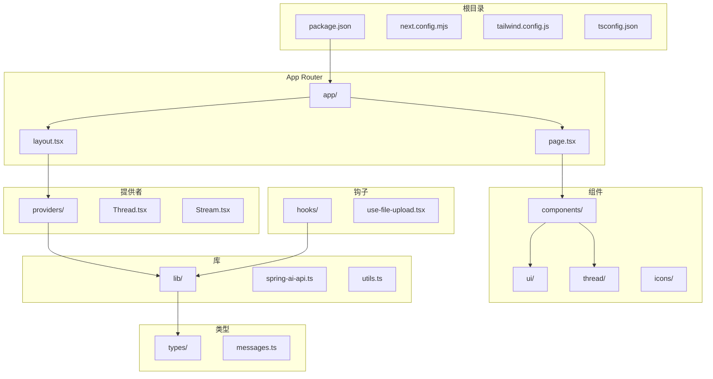
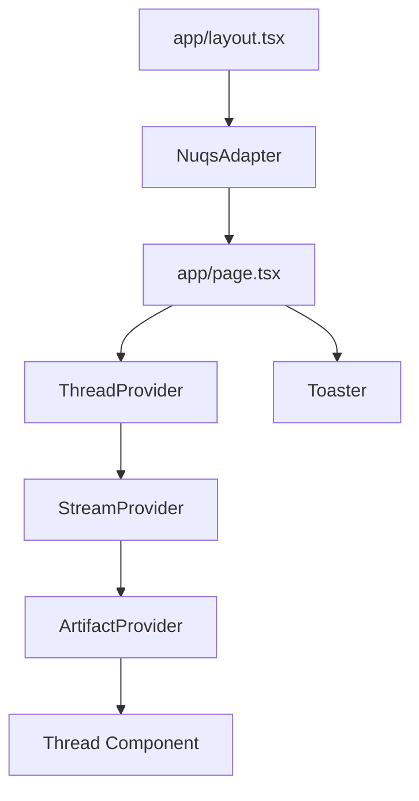
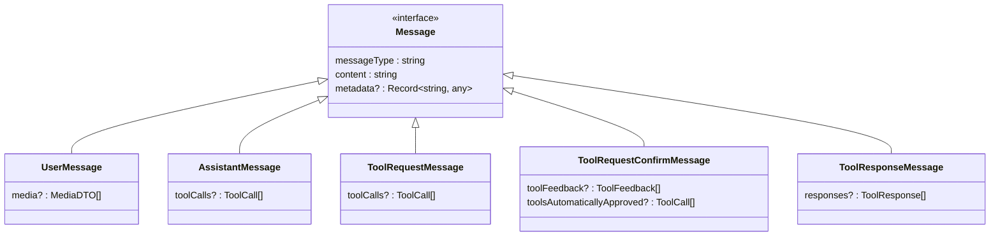
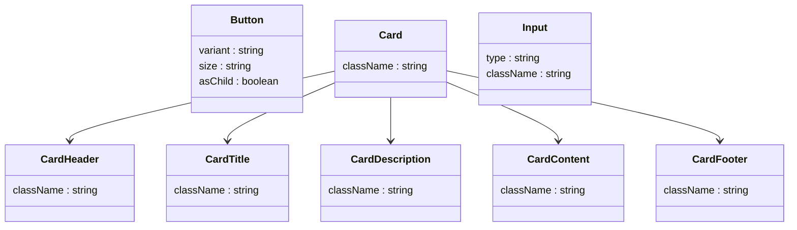
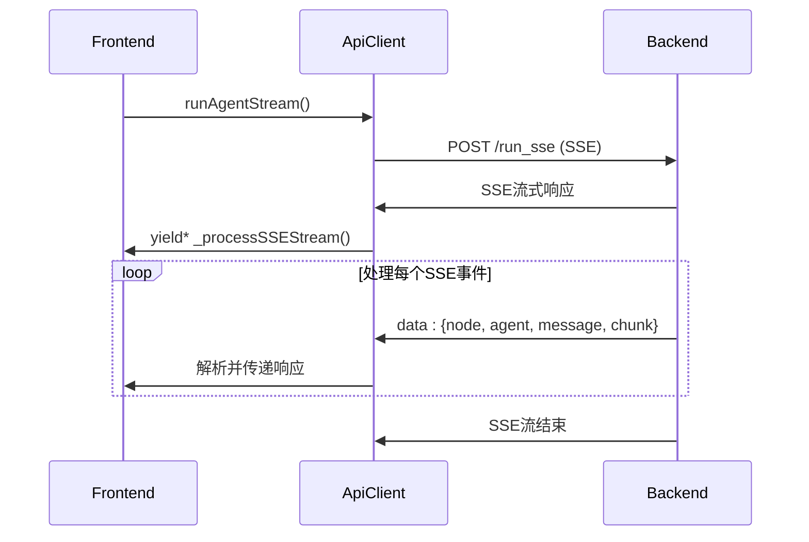
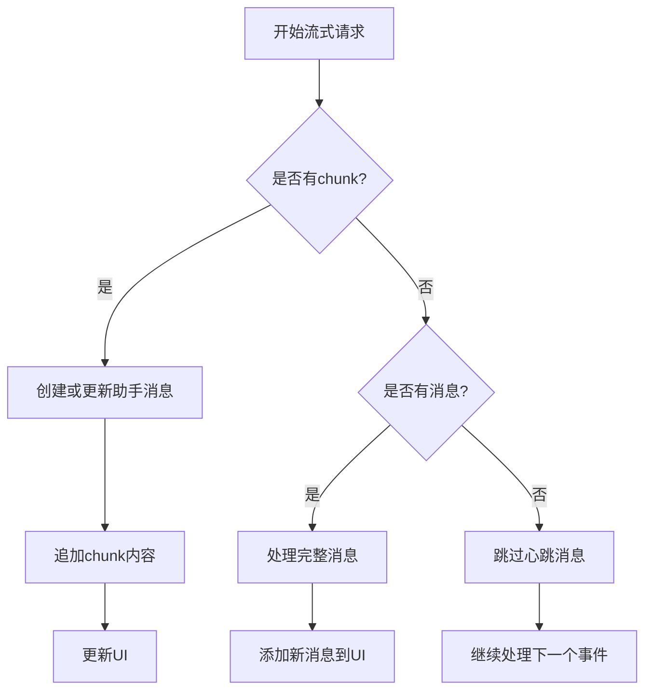
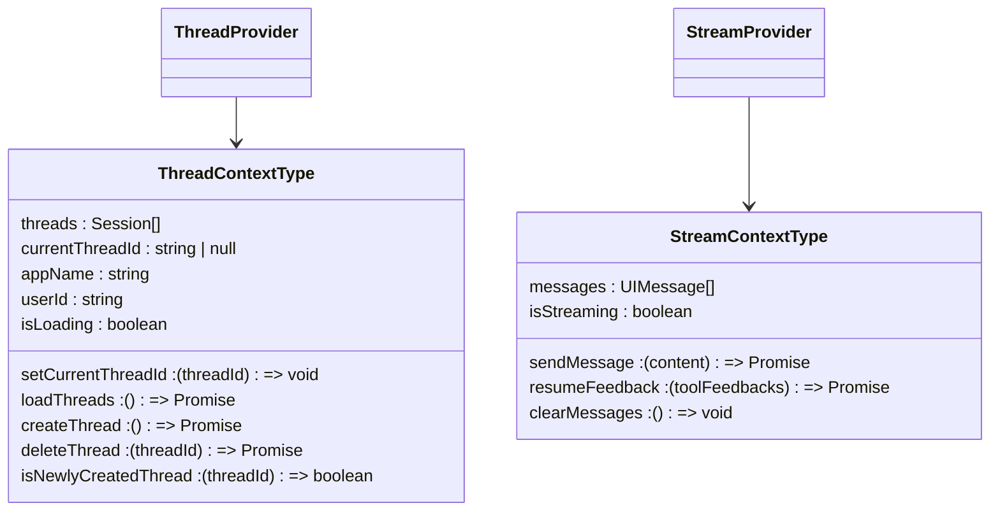
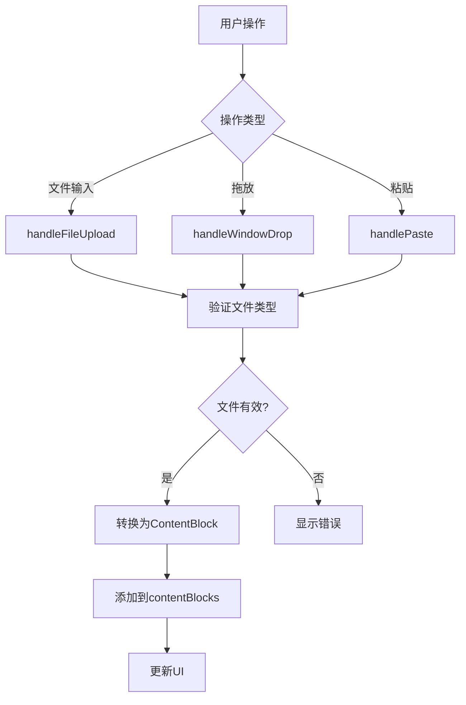

# 前端UI

<cite>
**本文档中引用的文件**   
- [package.json](file://spring-ai-alibaba-studio/agent-chat-ui/package.json)
- [next.config.mjs](file://spring-ai-alibaba-studio/agent-chat-ui/next.config.mjs)
- [tailwind.config.js](file://spring-ai-alibaba-studio/agent-chat-ui/tailwind.config.js)
- [tsconfig.json](file://spring-ai-alibaba-studio/agent-chat-ui/tsconfig.json)
- [layout.tsx](file://spring-ai-alibaba-studio/agent-chat-ui/src/app/layout.tsx)
- [page.tsx](file://spring-ai-alibaba-studio/agent-chat-ui/src/app/page.tsx)
- [messages.ts](file://spring-ai-alibaba-studio/agent-chat-ui/src/types/messages.ts)
- [Thread.tsx](file://spring-ai-alibaba-studio/agent-chat-ui/src/providers/Thread.tsx)
- [Stream.tsx](file://spring-ai-alibaba-studio/agent-chat-ui/src/providers/Stream.tsx)
- [spring-ai-api.ts](file://spring-ai-alibaba-studio/agent-chat-ui/src/lib/spring-ai-api.ts)
- [use-file-upload.tsx](file://spring-ai-alibaba-studio/agent-chat-ui/src/hooks/use-file-upload.tsx)
- [multimodal-utils.ts](file://spring-ai-alibaba-studio/agent-chat-ui/src/lib/multimodal-utils.ts)
- [index.tsx](file://spring-ai-alibaba-studio/agent-chat-ui/src/components/thread/index.tsx)
- [button.tsx](file://spring-ai-alibaba-studio/agent-chat-ui/src/components/ui/button.tsx)
- [card.tsx](file://spring-ai-alibaba-studio/agent-chat-ui/src/components/ui/card.tsx)
- [input.tsx](file://spring-ai-alibaba-studio/agent-chat-ui/src/components/ui/input.tsx)
- [ContentBlocksPreview.tsx](file://spring-ai-alibaba-studio/agent-chat-ui/src/components/thread/ContentBlocksPreview.tsx)
</cite>

## 目录
1. [项目结构](#项目结构)
2. [App Router架构](#app-router架构)
3. [核心组件](#核心组件)
4. [UI组件库与主题](#ui组件库与主题)
5. [前端与后端通信](#前端与后端通信)
6. [消息渲染与交互](#消息渲染与交互)
7. [文件上传与多模态预览](#文件上传与多模态预览)

## 项目结构

工作室前端UI位于`spring-ai-alibaba-studio/agent-chat-ui`目录下，采用Next.js 13+的App Router架构。项目使用TypeScript、React、Tailwind CSS和Radix UI构建，主要依赖包括React 19、Next.js 15、Tailwind CSS、Radix UI组件、Framer Motion动画库和Sonner通知系统。

**Diagram sources**
- [package.json](file://spring-ai-alibaba-studio/agent-chat-ui/package.json)
- [next.config.mjs](file://spring-ai-alibaba-studio/agent-chat-ui/next.config.mjs)

**Section sources**
- [package.json](file://spring-ai-alibaba-studio/agent-chat-ui/package.json#L1-L91)
- [next.config.mjs](file://spring-ai-alibaba-studio/agent-chat-ui/next.config.mjs#L1-L22)

## App Router架构

前端UI基于Next.js 13+的App Router架构构建，采用服务器组件和客户端组件混合模式。应用入口为`app/page.tsx`，使用`"use client"`指令声明为客户端组件，以便使用React状态和交互功能。

**Diagram sources**
- [layout.tsx](file://spring-ai-alibaba-studio/agent-chat-ui/src/app/layout.tsx#L1-L31)
- [page.tsx](file://spring-ai-alibaba-studio/agent-chat-ui/src/app/page.tsx#L1-L24)

**Section sources**
- [layout.tsx](file://spring-ai-alibaba-studio/agent-chat-ui/src/app/layout.tsx#L1-L31)
- [page.tsx](file://spring-ai-alibaba-studio/agent-chat-ui/src/app/page.tsx#L1-L24)

## 核心组件

### Thread（消息线程）

`Thread`组件是应用的核心UI组件，负责管理整个聊天界面的布局和交互。它使用`useStreamContext`和`useThreads`钩子来访问消息流和线程状态，并通过`StickToBottom`组件实现消息的自动滚动。

**Section sources**
- [index.tsx](file://spring-ai-alibaba-studio/agent-chat-ui/src/components/thread/index.tsx#L1-L552)

### Message（消息）

消息系统基于后端DTO定义，包含多种消息类型：用户消息（user）、助手消息（assistant）、工具请求消息（tool-request）、工具确认消息（tool-confirm）和工具响应消息（tool）。每种消息类型都有对应的React组件进行渲染。

**Diagram sources**
- [messages.ts](file://spring-ai-alibaba-studio/agent-chat-ui/src/types/messages.ts#L1-L169)

**Section sources**
- [messages.ts](file://spring-ai-alibaba-studio/agent-chat-ui/src/types/messages.ts#L1-L169)

### ContentBlocksPreview（内容块预览）

`ContentBlocksPreview`组件用于预览用户上传的文件内容，支持图像和PDF文件的预览。它与`useFileUpload`钩子集成，提供文件上传和管理功能。

**Section sources**
- [ContentBlocksPreview.tsx](file://spring-ai-alibaba-studio/agent-chat-ui/src/components/thread/ContentBlocksPreview.tsx)

## UI组件库与主题

### UI组件库

项目使用Radix UI作为基础组件库，并通过`components/ui`目录提供封装的UI组件，包括：

- **Button（按钮）**：支持多种变体（default, destructive, outline, secondary, ghost, link, brand）和尺寸（default, sm, lg, icon）
- **Card（卡片）**：包含Header、Title、Description、Content和Footer子组件
- **Input（输入框）**：支持文本输入和文件上传

**Diagram sources**
- [button.tsx](file://spring-ai-alibaba-studio/agent-chat-ui/src/components/ui/button.tsx#L1-L62)
- [card.tsx](file://spring-ai-alibaba-studio/agent-chat-ui/src/components/ui/card.tsx#L1-L76)
- [input.tsx](file://spring-ai-alibaba-studio/agent-chat-ui/src/components/ui/input.tsx#L1-L21)

**Section sources**
- [button.tsx](file://spring-ai-alibaba-studio/agent-chat-ui/src/components/ui/button.tsx#L1-L62)
- [card.tsx](file://spring-ai-alibaba-studio/agent-chat-ui/src/components/ui/card.tsx#L1-L76)
- [input.tsx](file://spring-ai-alibaba-studio/agent-chat-ui/src/components/ui/input.tsx#L1-L21)

### 自定义主题

项目使用Tailwind CSS进行样式设计，通过`tailwind.config.js`文件配置自定义主题。主题基于CSS变量，支持深色模式，并定义了多种颜色、边框半径和组件样式。

**Section sources**
- [tailwind.config.js](file://spring-ai-alibaba-studio/agent-chat-ui/tailwind.config.js#L1-L66)

## 前端与后端通信

### Spring AI API通信

前端通过`lib/spring-ai-api.ts`中的`SpringAIApiClient`类与后端服务通信。API客户端提供以下主要方法：

- `listApps()`: 获取应用列表
- `listSessions()`: 获取会话列表
- `createSession()`: 创建会话
- `deleteSession()`: 删除会话
- `runAgentStream()`: 执行Agent并流式接收响应
- `resumeAgentStream()`: 恢复Agent执行并流式接收响应

**Diagram sources**
- [spring-ai-api.ts](file://spring-ai-alibaba-studio/agent-chat-ui/src/lib/spring-ai-api.ts#L1-L405)

**Section sources**
- [spring-ai-api.ts](file://spring-ai-alibaba-studio/agent-chat-ui/src/lib/spring-ai-api.ts#L1-L405)

### 流式响应处理

`StreamProvider`组件负责处理流式响应，通过`runAgentStream`和`resumeAgentStream`方法接收SSE（Server-Sent Events）流。流式响应包含`chunk`字段，用于逐步更新助手消息的内容。

**Section sources**
- [Stream.tsx](file://spring-ai-alibaba-studio/agent-chat-ui/src/providers/Stream.tsx#L1-L543)

### 中断处理

系统支持通过`AbortController`中断流式请求。当用户取消请求时，`StreamProvider`会调用`abort()`方法，向后端发送中断信号。

**Section sources**
- [Stream.tsx](file://spring-ai-alibaba-studio/agent-chat-ui/src/providers/Stream.tsx#L1-L543)

## 消息渲染与交互

### 状态管理

应用使用React Context进行状态管理，主要通过两个提供者：

- `ThreadProvider`: 管理线程列表和当前线程ID
- `StreamProvider`: 管理消息列表和流式状态

**Diagram sources**
- [Thread.tsx](file://spring-ai-alibaba-studio/agent-chat-ui/src/providers/Thread.tsx#L1-L143)
- [Stream.tsx](file://spring-ai-alibaba-studio/agent-chat-ui/src/providers/Stream.tsx#L1-L543)

**Section sources**
- [Thread.tsx](file://spring-ai-alibaba-studio/agent-chat-ui/src/providers/Thread.tsx#L1-L143)
- [Stream.tsx](file://spring-ai-alibaba-studio/agent-chat-ui/src/providers/Stream.tsx#L1-L543)

### 事件处理

主要事件处理包括：
- 消息发送：处理表单提交，调用`sendMessage`方法
- 文件上传：处理文件输入和拖放事件
- 线程管理：创建、删除和切换线程

**Section sources**
- [index.tsx](file://spring-ai-alibaba-studio/agent-chat-ui/src/components/thread/index.tsx#L1-L552)

## 文件上传与多模态预览

### 文件上传

`useFileUpload`钩子提供文件上传功能，支持拖放、点击上传和粘贴上传。支持的文件类型包括JPEG、PNG、GIF、WEBP图像和PDF文档。

**Diagram sources**
- [use-file-upload.tsx](file://spring-ai-alibaba-studio/agent-chat-ui/src/hooks/use-file-upload.tsx#L1-L271)

**Section sources**
- [use-file-upload.tsx](file://spring-ai-alibaba-studio/agent-chat-ui/src/hooks/use-file-upload.tsx#L1-L271)

### 多模态预览

`multimodal-utils.ts`提供文件到内容块的转换功能，将文件转换为Base64编码的内容块，用于在消息中显示。

**Section sources**
- [multimodal-utils.ts](file://spring-ai-alibaba-studio/agent-chat-ui/src/lib/multimodal-utils.ts#L1-L90)