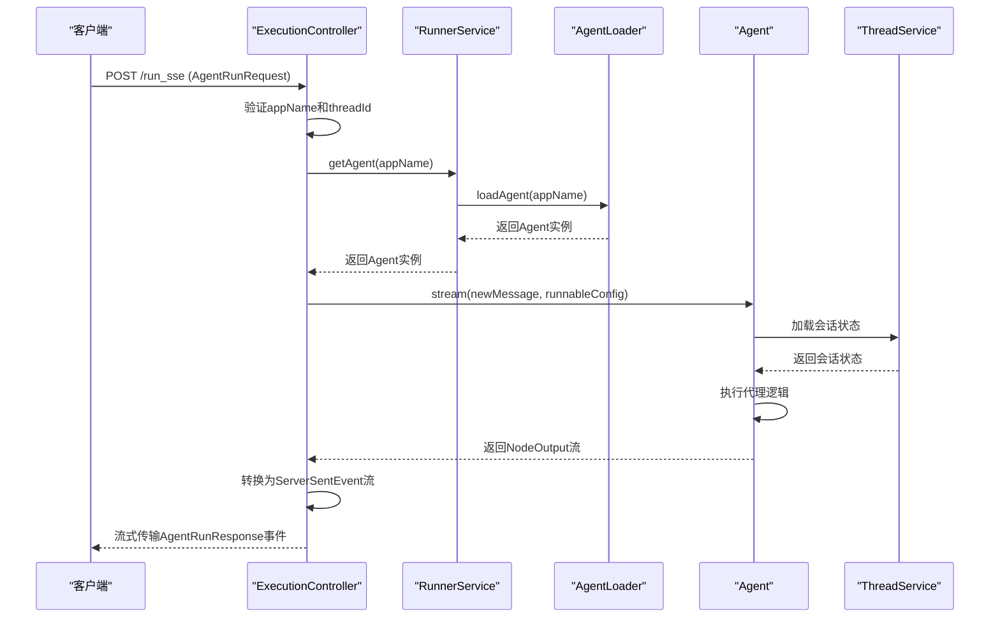

# 后端服务

<cite>
**本文档中引用的文件**  
- [AgentController.java](file://spring-ai-alibaba-studio/src/main/java/com/alibaba/cloud/ai/agent/studio/controller/AgentController.java)
- [ExecutionController.java](file://spring-ai-alibaba-studio/src/main/java/com/alibaba/cloud/ai/agent/studio/controller/ExecutionController.java)
- [ThreadController.java](file://spring-ai-alibaba-studio/src/main/java/com/alibaba/cloud/ai/agent/studio/controller/ThreadController.java)
- [RunnerService.java](file://spring-ai-alibaba-studio/src/main/java/com/alibaba/cloud/ai/agent/studio/service/RunnerService.java)
- [ThreadService.java](file://spring-ai-alibaba-studio/src/main/java/com/alibaba/cloud/ai/agent/studio/service/ThreadService.java)
- [ThreadServiceImpl.java](file://spring-ai-alibaba-studio/src/main/java/com/alibaba/cloud/ai/agent/studio/service/ThreadServiceImpl.java)
- [AgentLoader.java](file://spring-ai-alibaba-studio/src/main/java/com/alibaba/cloud/ai/agent/studio/loader/AgentLoader.java)
- [AgentStaticLoader.java](file://spring-ai-alibaba-studio/src/main/java/com/alibaba/cloud/ai/agent/studio/loader/AgentStaticLoader.java)
- [AgentRunRequest.java](file://spring-ai-alibaba-studio/src/main/java/com/alibaba/cloud/ai/agent/studio/dto/AgentRunRequest.java)
- [AgentResumeRequest.java](file://spring-ai-alibaba-studio/src/main/java/com/alibaba/cloud/ai/agent/studio/dto/AgentResumeRequest.java)
- [AgentRunResponse.java](file://spring-ai-alibaba-studio/src/main/java/com/alibaba/cloud/ai/agent/studio/dto/messages/AgentRunResponse.java)
- [Thread.java](file://spring-ai-alibaba-studio/src/main/java/com/alibaba/cloud/ai/agent/studio/dto/Thread.java)
- [ListThreadsResponse.java](file://spring-ai-alibaba-studio/src/main/java/com/alibaba/cloud/ai/agent/studio/dto/ListThreadsResponse.java)
- [SaaStudioWebModuleAutoConfiguration.java](file://spring-ai-alibaba-studio/src/main/java/com/alibaba/cloud/ai/agent/studio/SaaStudioWebModuleAutoConfiguration.java)
</cite>

## 目录
1. [简介](#简介)
2. [API端点参考](#api端点参考)
3. [数据模型定义](#数据模型定义)
4. [执行流程与序列图](#执行流程与序列图)
5. [核心服务组件](#核心服务组件)
6. [异常处理策略](#异常处理策略)
7. [配置与集成指南](#配置与集成指南)

## 简介
本文档详细描述了Spring AI Alibaba工作室后端服务的RESTful API接口。该服务提供了三个核心控制器：AgentController、ExecutionController和ThreadController，用于管理智能代理的生命周期、执行流程和会话状态。系统通过RunnerService协调代理执行，利用ThreadService处理会话的创建、加载和持久化，并通过AgentLoader实现代理实例的动态加载与管理。所有API均采用Server-Sent Events（SSE）流式传输，确保实时响应和高效通信。

## API端点参考

### AgentController
提供代理管理相关的API端点。

#### 获取可用应用列表
- **HTTP方法**: `GET`
- **URL路径**: `/list-apps`
- **描述**: 列出所有可用的代理应用。
- **请求参数**: 无
- **成功响应**: `200 OK`，返回字符串列表，包含所有可用的代理名称。
- **错误码**:
  - `500 Internal Server Error`: 代理注册表为空时返回警告日志。

**API调用示例**
```http
GET /list-apps HTTP/1.1
Host: localhost:8080
```

**响应示例**
```json
["chat_bot", "code_assistant"]
```

**节来源**
- [AgentController.java](file://spring-ai-alibaba-studio/src/main/java/com/alibaba/cloud/ai/agent/studio/controller/AgentController.java#L63-L68)

### ExecutionController
提供代理执行相关的API端点。

#### 流式执行代理
- **HTTP方法**: `POST`
- **URL路径**: `/run_sse`
- **内容类型**: `application/json`
- **生产类型**: `text/event-stream`
- **描述**: 执行代理并以Server-Sent Events流式传输结果。
- **请求体**: `AgentRunRequest` 对象
- **成功响应**: `200 OK`，返回`ServerSentEvent<String>`流，包含`AgentRunResponse` JSON数据。
- **错误码**:
  - `400 Bad Request`: `appName`或`threadId`为空或无效。
  - `500 Internal Server Error`: 代理执行失败。

**请求参数说明**
- `appName`: 代理应用名称，不能为空。
- `userId`: 用户ID，用于标识会话所有者。
- `threadId`: 会话ID，用于关联对话历史。
- `newMessage`: 用户输入消息，包含文本内容。
- `streaming`: 是否启用流式传输，布尔值。

**节来源**
- [ExecutionController.java](file://spring-ai-alibaba-studio/src/main/java/com/alibaba/cloud/ai/agent/studio/controller/ExecutionController.java#L154-L186)

#### 恢复代理执行
- **HTTP方法**: `POST`
- **URL路径**: `/resume_sse`
- **内容类型**: `application/json`
- **生产类型**: `text/event-stream`
- **描述**: 恢复被中断的代理执行，处理工具调用反馈。
- **请求体**: `AgentResumeRequest` 对象
- **成功响应**: `200 OK`，返回`ServerSentEvent<String>`流。
- **错误码**:
  - `400 Bad Request`: `appName`或`threadId`为空或无效。
  - `500 Internal Server Error`: 代理恢复失败。

**请求参数说明**
- `toolFeedbacks`: 工具调用反馈列表，包含批准或拒绝的决策。

**节来源**
- [ExecutionController.java](file://spring-ai-alibaba-studio/src/main/java/com/alibaba/cloud/ai/agent/studio/controller/ExecutionController.java#L188-L247)

### ThreadController
提供会话管理相关的API端点。

#### 获取会话
- **HTTP方法**: `GET`
- **URL路径**: `/apps/{appName}/users/{userId}/threads/{threadId}`
- **描述**: 根据应用名、用户ID和会话ID获取特定会话。
- **成功响应**: `200 OK`，返回`Thread`对象。
- **错误码**:
  - `404 Not Found`: 会话不存在或应用/用户不匹配。

**节来源**
- [ThreadController.java](file://spring-ai-alibaba-studio/src/main/java/com/alibaba/cloud/ai/agent/studio/controller/ThreadController.java#L115-L120)

#### 列出会话
- **HTTP方法**: `GET`
- **URL路径**: `/apps/{appName}/users/{userId}/threads`
- **描述**: 列出指定应用和用户的所有非评估会话。
- **成功响应**: `200 OK`，返回`List<Thread>`。
- **过滤规则**: 排除以`SAA_EVAL_`为前缀的评估会话。

**节来源**
- [ThreadController.java](file://spring-ai-alibaba-studio/src/main/java/com/alibaba/cloud/ai/agent/studio/controller/ThreadController.java#L129-L151)

#### 创建会话（指定ID）
- **HTTP方法**: `POST`
- **URL路径**: `/apps/{appName}/users/{userId}/threads/{threadId}`
- **描述**: 使用客户端提供的ID创建新会话。
- **请求体**: 可选的初始状态`Map<String, Object>`。
- **成功响应**: `200 OK`，返回创建的`Thread`对象。
- **错误码**:
  - `400 Bad Request`: 指定ID的会话已存在。
  - `500 Internal Server Error`: 会话创建失败。

**节来源**
- [ThreadController.java](file://spring-ai-alibaba-studio/src/main/java/com/alibaba/cloud/ai/agent/studio/controller/ThreadController.java#L164-L217)

#### 创建会话（自动生成ID）
- **HTTP方法**: `POST`
- **URL路径**: `/apps/{appName}/users/{userId}/threads`
- **描述**: 创建新会话，由服务生成唯一ID。
- **请求体**: 可选的初始状态`Map<String, Object>`。
- **成功响应**: `200 OK`，返回创建的`Thread`对象。
- **错误码**: `500 Internal Server Error`。

**节来源**
- [ThreadController.java](file://spring-ai-alibaba-studio/src/main/java/com/alibaba/cloud/ai/agent/studio/controller/ThreadController.java#L228-L264)

#### 删除会话
- **HTTP方法**: `DELETE`
- **URL路径**: `/apps/{appName}/users/{userId}/threads/{threadId}`
- **描述**: 删除指定的会话及其状态。
- **成功响应**: `204 No Content`。
- **错误码**: `500 Internal Server Error`。

**节来源**
- [ThreadController.java](file://spring-ai-alibaba-studio/src/main/java/com/alibaba/cloud/ai/agent/studio/controller/ThreadController.java#L275-L293)

## 数据模型定义

### AgentRunRequest
执行代理请求的数据传输对象。

| 字段名 | 类型 | 必需 | 描述 |
| :--- | :--- | :--- | :--- |
| `appName` | `String` | 是 | 代理应用名称 |
| `userId` | `String` | 是 | 用户ID |
| `threadId` | `String` | 是 | 会话ID |
| `newMessage` | `UserMessageDTO` | 否 | 新的用户消息 |
| `streaming` | `boolean` | 否 | 是否启用流式传输 |
| `stateDelta` | `Map<String, Object>` | 否 | 要合并到会话状态中的可选状态增量 |

**节来源**
- [AgentRunRequest.java](file://spring-ai-alibaba-studio/src/main/java/com/alibaba/cloud/ai/agent/studio/dto/AgentRunRequest.java#L29-L80)

### AgentResumeRequest
恢复代理执行请求的数据传输对象。

| 字段名 | 类型 | 必需 | 描述 |
| :--- | :--- | :--- | :--- |
| `appName` | `String` | 是 | 代理应用名称 |
| `userId` | `String` | 是 | 用户ID |
| `threadId` | `String` | 是 | 会话ID |
| `newMessage` | `UserMessageDTO` | 否 | 新的用户消息 |
| `streaming` | `boolean` | 否 | 是否启用流式传输 |
| `toolFeedbacks` | `List<ToolFeedback>` | 否 | 工具调用反馈列表 |
| `stateDelta` | `Map<String, Object>` | 否 | 可选状态增量 |

**节来源**
- [AgentResumeRequest.java](file://spring-ai-alibaba-studio/src/main/java/com/alibaba/cloud/ai/agent/studio/dto/AgentResumeRequest.java#L31-L89)

### AgentRunResponse
代理执行响应的数据传输对象。

| 字段名 | 类型 | 描述 |
| :--- | :--- | :--- |
| `node` | `String` | 生成输出的节点名称 |
| `agent` | `String` | 代理名称 |
| `tokenUsage` | `Usage` | 令牌使用情况元数据 |
| `message` | `MessageDTO` | 最后一条消息的DTO格式 |
| `chunk` | `String` | 用于流式传输的文本块 |

**节来源**
- [AgentRunResponse.java](file://spring-ai-alibaba-studio/src/main/java/com/alibaba/cloud/ai/agent/studio/dto/messages/AgentRunResponse.java#L25-L120)

### Thread
会话数据模型。

| 字段名 | 类型 | 描述 |
| :--- | :--- | :--- |
| `thread_id` | `String` | 会话唯一标识符 |
| `appName` | `String` | 关联的应用名称 |
| `userId` | `String` | 关联的用户ID |
| `values` | `Map<String, MessageDTO>` | 会话中的消息值映射 |

**节来源**
- [Thread.java](file://spring-ai-alibaba-studio/src/main/java/com/alibaba/cloud/ai/agent/studio/dto/Thread.java#L29-L128)

### ListThreadsResponse
会话列表响应对象。

| 字段名 | 类型 | 描述 |
| :--- | :--- | :--- |
| `threads` | `List<Thread>` | 会话对象列表 |

**节来源**
- [ListThreadsResponse.java](file://spring-ai-alibaba-studio/src/main/java/com/alibaba/cloud/ai/agent/studio/dto/ListThreadsResponse.java#L27-L45)

## 执行流程与序列图

### 代理执行API调用序列图
该序列图展示了客户端调用`/run_sse`端点执行代理的完整流程。



**图来源**  
- [ExecutionController.java](file://spring-ai-alibaba-studio/src/main/java/com/alibaba/cloud/ai/agent/studio/controller/ExecutionController.java#L154-L186)
- [RunnerService.java](file://spring-ai-alibaba-studio/src/main/java/com/alibaba/cloud/ai/agent/studio/service/RunnerService.java#L40-L42)
- [AgentLoader.java](file://spring-ai-alibaba-studio/src/main/java/com/alibaba/cloud/ai/agent/studio/loader/AgentLoader.java#L72-L73)
- [ThreadService.java](file://spring-ai-alibaba-studio/src/main/java/com/alibaba/cloud/ai/agent/studio/service/ThreadService.java#L41-L42)

## 核心服务组件

### RunnerService
负责创建和缓存Runner实例，协调代理执行和状态管理。

- **主要功能**: 通过`AgentLoader`加载指定名称的代理实例。
- **关键方法**: `getAgent(String agentName)`，返回`Agent`实例。
- **依赖关系**: 依赖`AgentLoader`接口实现动态代理加载。

**节来源**
- [RunnerService.java](file://spring-ai-alibaba-studio/src/main/java/com/alibaba/cloud/ai/agent/studio/service/RunnerService.java#L29-L43)

### ThreadService
处理会话（Thread）的创建、加载和持久化。

- **接口定义**: `ThreadService` 定义了`getThread`、`listThreads`、`createThread`和`deleteThread`等核心方法。
- **实现类**: `ThreadServiceImpl` 提供了基于内存的会话管理实现。
- **存储机制**: 使用`ConcurrentHashMap`存储会话和状态，键格式为`appName:userId:threadId`。
- **状态管理**: 支持通过`getThreadState`和`updateThreadState`方法管理会话状态。

**节来源**
- [ThreadService.java](file://spring-ai-alibaba-studio/src/main/java/com/alibaba/cloud/ai/agent/studio/service/ThreadService.java#L30-L74)
- [ThreadServiceImpl.java](file://spring-ai-alibaba-studio/src/main/java/com/alibaba/cloud/ai/agent/studio/service/ThreadServiceImpl.java#L40-L181)

### AgentLoader
动态加载和管理代理实例的核心接口。

- **核心方法**: 
  - `listAgents()`: 返回可用代理名称列表。
  - `loadAgent(String name)`: 根据名称加载代理实例。
- **实现**: `AgentStaticLoader` 是一个具体实现，通过构造函数接收预创建的代理实例数组，并将其注册到内部映射中。
- **线程安全**: 实现必须是线程安全的，因为会被多个HTTP请求并发访问。

**节来源**
- [AgentLoader.java](file://spring-ai-alibaba-studio/src/main/java/com/alibaba/cloud/ai/agent/studio/loader/AgentLoader.java#L53-L73)
- [AgentStaticLoader.java](file://spring-ai-alibaba-studio/src/main/java/com/alibaba/cloud/ai/agent/studio/loader/AgentStaticLoader.java#L42-L73)

## 异常处理策略

### 客户端错误处理
- **400 Bad Request**: 当`appName`或`threadId`为空或无效时抛出。
- **404 Not Found**: 当请求的会话不存在或应用/用户不匹配时抛出。

### 服务器端错误处理
- **500 Internal Server Error**: 代理执行、会话创建或删除失败时抛出。
- **异常传播**: `ResponseStatusException`被直接抛出，由Spring框架转换为相应的HTTP状态码。
- **日志记录**: 所有错误均通过SLF4J记录详细日志，便于调试和监控。

**节来源**
- [ExecutionController.java](file://spring-ai-alibaba-studio/src/main/java/com/alibaba/cloud/ai/agent/studio/controller/ExecutionController.java#L156-L171)
- [ThreadController.java](file://spring-ai-alibaba-studio/src/main/java/com/alibaba/cloud/ai/agent/studio/controller/ThreadController.java#L73-L104)

## 配置与集成指南

### WebConfig配置
系统通过`SaaStudioWebModuleAutoConfiguration`类进行自动配置。

- **注解**: 使用`@Configuration`和`@ComponentScan("com.alibaba.cloud.ai.agent.studio")`注解。
- **组件扫描**: 自动扫描`com.alibaba.cloud.ai.agent.studio`包下的所有组件，包括控制器、服务和加载器。
- **初始化日志**: 构造函数中输出"✅ Spring AI Alibaba Studio module loaded!"，确认模块已成功加载。

**节来源**
- [SaaStudioWebModuleAutoConfiguration.java](file://spring-ai-alibaba-studio/src/main/java/com/alibaba/cloud/ai/agent/studio/SaaStudioWebModuleAutoConfiguration.java#L21-L27)

### 集成SaaStudioWebModuleAutoConfiguration
要将工作室模块集成到Spring Boot应用中：

1. **添加依赖**: 确保项目中包含`spring-ai-alibaba-studio`模块的依赖。
2. **启用自动配置**: Spring Boot会自动检测并加载`SaaStudioWebModuleAutoConfiguration`。
3. **配置属性**: 根据需要在`application.yml`中配置`saa.agents.source-dir`等属性。
4. **自定义AgentLoader**: 实现`AgentLoader`接口以注册自定义代理。

**节来源**
- [SaaStudioWebModuleAutoConfiguration.java](file://spring-ai-alibaba-studio/src/main/java/com/alibaba/cloud/ai/agent/studio/SaaStudioWebModuleAutoConfiguration.java#L21-L27)