# 工作室

<cite>
**本文档中引用的文件**  
- [README.md](file://spring-ai-alibaba-studio/README.md)
- [pom.xml](file://spring-ai-alibaba-studio/pom.xml)
- [SaaStudioWebModuleAutoConfiguration.java](file://spring-ai-alibaba-studio/src/main/java/com/alibaba/cloud/ai/agent/studio/SaaStudioWebModuleAutoConfiguration.java)
- [AgentController.java](file://spring-ai-alibaba-studio/src/main/java/com/alibaba/cloud/ai/agent/studio/controller/AgentController.java)
- [ExecutionController.java](file://spring-ai-alibaba-studio/src/main/java/com/alibaba/cloud/ai/agent/studio/controller/ExecutionController.java)
- [ThreadController.java](file://spring-ai-alibaba-studio/src/main/java/com/alibaba/cloud/ai/agent/studio/controller/ThreadController.java)
- [ThreadService.java](file://spring-ai-alibaba-studio/src/main/java/com/alibaba/cloud/ai/agent/studio/service/ThreadService.java)
- [ThreadServiceImpl.java](file://spring-ai-alibaba-studio/src/main/java/com/alibaba/cloud/ai/agent/studio/service/ThreadServiceImpl.java)
- [page.tsx](file://spring-ai-alibaba-studio/agent-chat-ui/src/app/page.tsx)
- [Thread.tsx](file://spring-ai-alibaba-studio/agent-chat-ui/src/providers/Thread.tsx)
- [Stream.tsx](file://spring-ai-alibaba-studio/agent-chat-ui/src/providers/Stream.tsx)
- [spring-ai-api.ts](file://spring-ai-alibaba-studio/agent-chat-ui/src/lib/spring-ai-api.ts)
- [ContentBlocksPreview.tsx](file://spring-ai-alibaba-studio/agent-chat-ui/src/components/thread/ContentBlocksPreview.tsx)
- [tool-feedback.tsx](file://spring-ai-alibaba-studio/agent-chat-ui/src/components/thread/messages/tool-feedback.tsx)
</cite>

## 目录
1. [简介](#简介)
2. [项目结构](#项目结构)
3. [核心组件](#核心组件)
4. [架构概述](#架构概述)
5. [详细组件分析](#详细组件分析)
6. [依赖分析](#依赖分析)
7. [性能考虑](#性能考虑)
8. [故障排除指南](#故障排除指南)
9. [结论](#结论)

## 简介

工作室（Studio）是一个前后端一体化的代理开发与交互平台，旨在为开发者提供一个可视化界面来与Spring AI Alibaba框架开发的智能代理进行交互。该平台支持两种集成模式：嵌入现有应用和独立部署。前端基于Next.js构建，提供丰富的UI组件来展示代理执行过程、工具调用详情和人机交互功能。后端通过REST API与前端通信，支持流式响应和会话管理。

**本文档来源**
- [README.md](file://spring-ai-alibaba-studio/README.md#L1-L80)

## 项目结构

工作室模块包含两个主要部分：后端服务和前端UI。后端服务位于`spring-ai-alibaba-studio`目录下，提供REST API接口；前端UI位于`agent-chat-ui`目录下，基于Next.js构建。

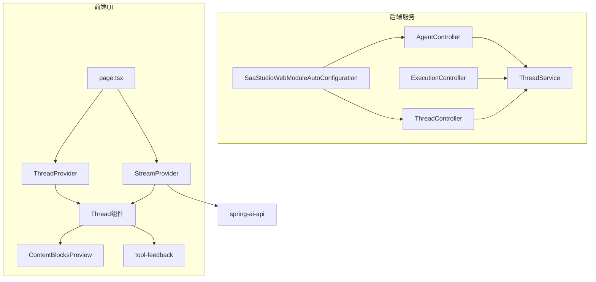

**图表来源**
- [SaaStudioWebModuleAutoConfiguration.java](file://spring-ai-alibaba-studio/src/main/java/com/alibaba/cloud/ai/agent/studio/SaaStudioWebModuleAutoConfiguration.java#L1-L28)
- [AgentController.java](file://spring-ai-alibaba-studio/src/main/java/com/alibaba/cloud/ai/agent/studio/controller/AgentController.java#L1-L70)
- [ExecutionController.java](file://spring-ai-alibaba-studio/src/main/java/com/alibaba/cloud/ai/agent/studio/controller/ExecutionController.java#L1-L357)
- [ThreadController.java](file://spring-ai-alibaba-studio/src/main/java/com/alibaba/cloud/ai/agent/studio/controller/ThreadController.java#L1-L295)
- [ThreadService.java](file://spring-ai-alibaba-studio/src/main/java/com/alibaba/cloud/ai/agent/studio/service/ThreadService.java#L1-L76)
- [page.tsx](file://spring-ai-alibaba-studio/agent-chat-ui/src/app/page.tsx#L1-L24)
- [Thread.tsx](file://spring-ai-alibaba-studio/agent-chat-ui/src/providers/Thread.tsx#L1-L143)
- [Stream.tsx](file://spring-ai-alibaba-studio/agent-chat-ui/src/providers/Stream.tsx#L1-L543)

**本节来源**
- [README.md](file://spring-ai-alibaba-studio/README.md#L1-L80)
- [pom.xml](file://spring-ai-alibaba-studio/pom.xml#L1-L162)

## 核心组件

工作室的核心组件包括后端控制器和服务类，以及前端的UI组件和状态管理。后端通过`AgentController`、`ExecutionController`和`ThreadController`提供REST API，前端通过`ThreadProvider`和`StreamProvider`管理会话和流式通信。

**本节来源**
- [AgentController.java](file://spring-ai-alibaba-studio/src/main/java/com/alibaba/cloud/ai/agent/studio/controller/AgentController.java#L1-L70)
- [ExecutionController.java](file://spring-ai-alibaba-studio/src/main/java/com/alibaba/cloud/ai/agent/studio/controller/ExecutionController.java#L1-L357)
- [ThreadController.java](file://spring-ai-alibaba-studio/src/main/java/com/alibaba/cloud/ai/agent/studio/controller/ThreadController.java#L1-L295)
- [ThreadService.java](file://spring-ai-alibaba-studio/src/main/java/com/alibaba/cloud/ai/agent/studio/service/ThreadService.java#L1-L76)
- [ThreadServiceImpl.java](file://spring-ai-alibaba-studio/src/main/java/com/alibaba/cloud/ai/agent/studio/service/ThreadServiceImpl.java#L1-L181)
- [Thread.tsx](file://spring-ai-alibaba-studio/agent-chat-ui/src/providers/Thread.tsx#L1-L143)
- [Stream.tsx](file://spring-ai-alibaba-studio/agent-chat-ui/src/providers/Stream.tsx#L1-L543)

## 架构概述

工作室采用前后端分离架构，后端提供REST API，前端通过Server-Sent Events (SSE) 实现流式通信。系统支持会话管理、代理执行和人机交互功能。

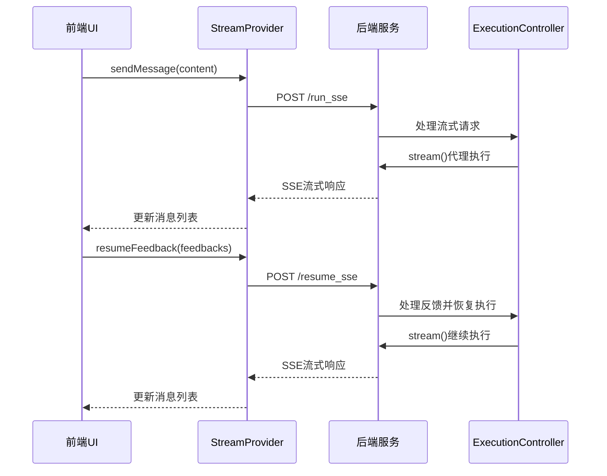

**图表来源**
- [ExecutionController.java](file://spring-ai-alibaba-studio/src/main/java/com/alibaba/cloud/ai/agent/studio/controller/ExecutionController.java#L1-L357)
- [Stream.tsx](file://spring-ai-alibaba-studio/agent-chat-ui/src/providers/Stream.tsx#L1-L543)
- [spring-ai-api.ts](file://spring-ai-alibaba-studio/agent-chat-ui/src/lib/spring-ai-api.ts#L1-L405)

## 详细组件分析

### 后端控制器分析

工作室的后端控制器负责处理各种API请求，包括代理管理、执行控制和会话管理。

#### AgentController分析
`AgentController`负责管理可用的代理应用，提供列出所有可用代理的功能。

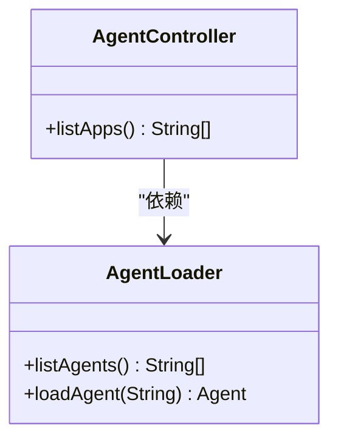

**图表来源**
- [AgentController.java](file://spring-ai-alibaba-studio/src/main/java/com/alibaba/cloud/ai/agent/studio/controller/AgentController.java#L1-L70)
- [AgentLoader.java](file://spring-ai-alibaba-studio/src/main/java/com/alibaba/cloud/ai/agent/studio/loader/AgentLoader.java)

**本节来源**
- [AgentController.java](file://spring-ai-alibaba-studio/src/main/java/com/alibaba/cloud/ai/agent/studio/controller/AgentController.java#L1-L70)

#### ExecutionController分析
`ExecutionController`是核心执行控制器，处理代理的流式执行和恢复执行。

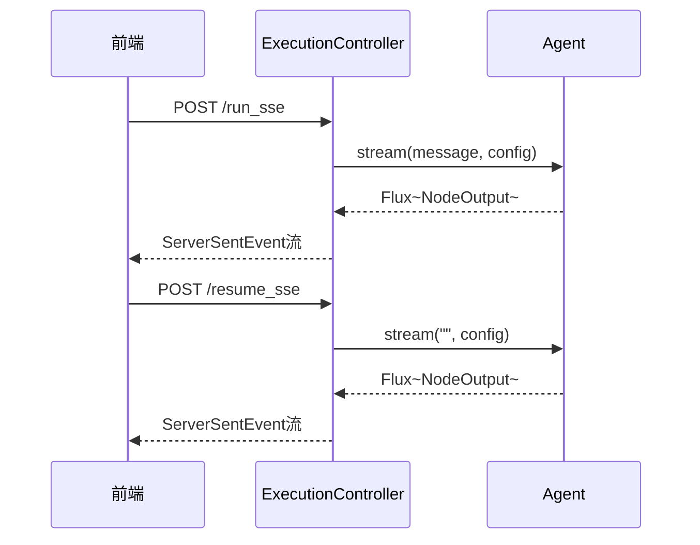

**图表来源**
- [ExecutionController.java](file://spring-ai-alibaba-studio/src/main/java/com/alibaba/cloud/ai/agent/studio/controller/ExecutionController.java#L1-L357)

**本节来源**
- [ExecutionController.java](file://spring-ai-alibaba-studio/src/main/java/com/alibaba/cloud/ai/agent/studio/controller/ExecutionController.java#L1-L357)

#### ThreadController分析
`ThreadController`管理用户会话线程，支持创建、读取、列出和删除会话。

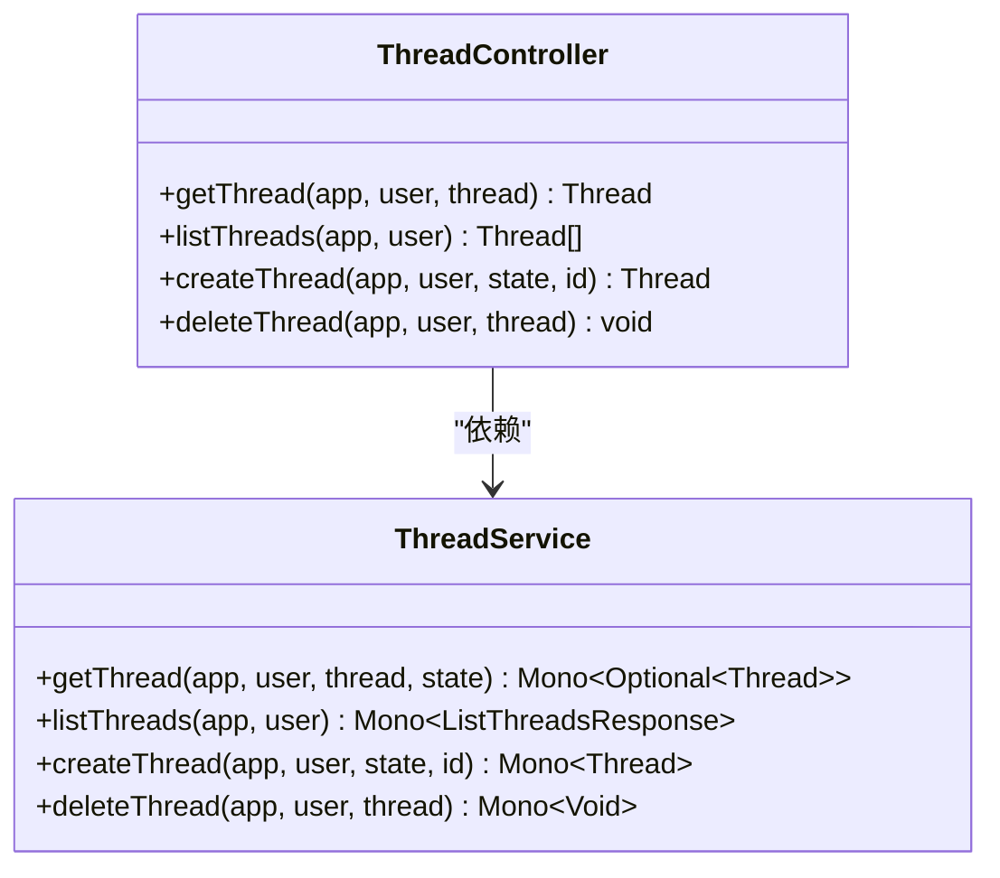

**图表来源**
- [ThreadController.java](file://spring-ai-alibaba-studio/src/main/java/com/alibaba/cloud/ai/agent/studio/controller/ThreadController.java#L1-L295)
- [ThreadService.java](file://spring-ai-alibaba-studio/src/main/java/com/alibaba/cloud/ai/agent/studio/service/ThreadService.java#L1-L76)

**本节来源**
- [ThreadController.java](file://spring-ai-alibaba-studio/src/main/java/com/alibaba/cloud/ai/agent/studio/controller/ThreadController.java#L1-L295)
- [ThreadService.java](file://spring-ai-alibaba-studio/src/main/java/com/alibaba/cloud/ai/agent/studio/service/ThreadService.java#L1-L76)
- [ThreadServiceImpl.java](file://spring-ai-alibaba-studio/src/main/java/com/alibaba/cloud/ai/agent/studio/service/ThreadServiceImpl.java#L1-L181)

### 前端组件分析

前端组件基于Next.js构建，使用React Context进行状态管理。

#### ThreadProvider分析
`ThreadProvider`管理会话线程的状态，包括当前线程、线程列表和线程操作。

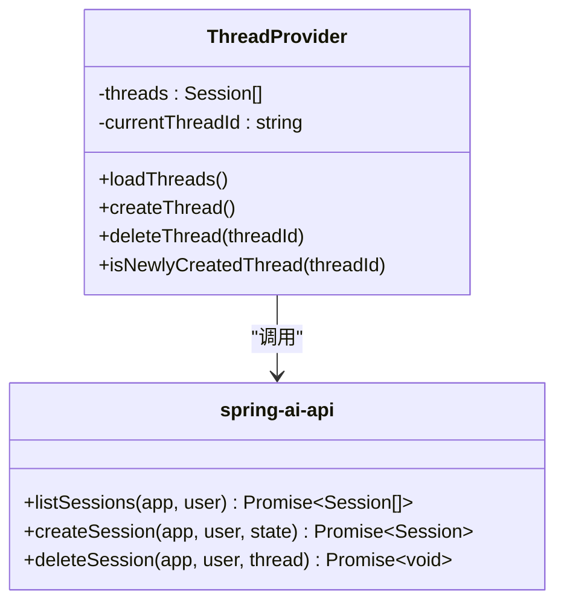

**图表来源**
- [Thread.tsx](file://spring-ai-alibaba-studio/agent-chat-ui/src/providers/Thread.tsx#L1-L143)
- [spring-ai-api.ts](file://spring-ai-alibaba-studio/agent-chat-ui/src/lib/spring-ai-api.ts#L1-L405)

**本节来源**
- [Thread.tsx](file://spring-ai-alibaba-studio/agent-chat-ui/src/providers/Thread.tsx#L1-L143)

#### StreamProvider分析
`StreamProvider`管理消息流和代理执行，处理消息发送和反馈恢复。

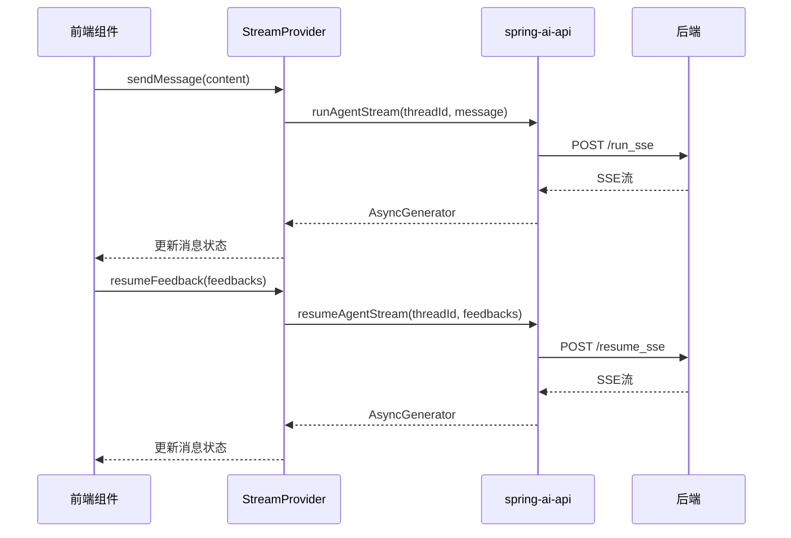

**图表来源**
- [Stream.tsx](file://spring-ai-alibaba-studio/agent-chat-ui/src/providers/Stream.tsx#L1-L543)
- [spring-ai-api.ts](file://spring-ai-alibaba-studio/agent-chat-ui/src/lib/spring-ai-api.ts#L1-L405)

**本节来源**
- [Stream.tsx](file://spring-ai-alibaba-studio/agent-chat-ui/src/providers/Stream.tsx#L1-L543)

#### UI组件分析
前端UI组件包括消息线程、内容块预览和工具调用反馈等。

##### 消息线程（Thread）分析
`Thread`组件是主要的UI容器，整合了消息显示、输入框和状态管理。

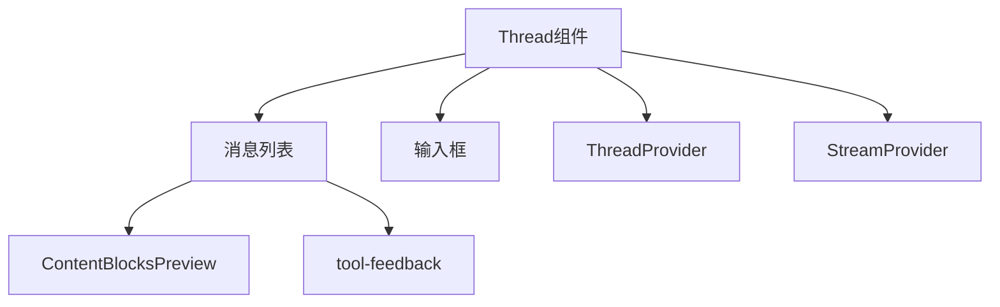

**图表来源**
- [page.tsx](file://spring-ai-alibaba-studio/agent-chat-ui/src/app/page.tsx#L1-L24)
- [index.tsx](file://spring-ai-alibaba-studio/agent-chat-ui/src/components/thread/index.tsx)

**本节来源**
- [page.tsx](file://spring-ai-alibaba-studio/agent-chat-ui/src/app/page.tsx#L1-L24)

##### 内容块预览（ContentBlocksPreview）分析
`ContentBlocksPreview`组件用于预览内容块，支持多种格式的显示。

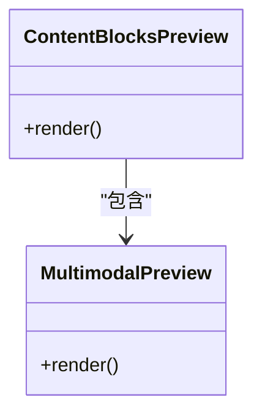

**图表来源**
- [ContentBlocksPreview.tsx](file://spring-ai-alibaba-studio/agent-chat-ui/src/components/thread/ContentBlocksPreview.tsx)
- [MultimodalPreview.tsx](file://spring-ai-alibaba-studio/agent-chat-ui/src/components/thread/MultimodalPreview.tsx)

**本节来源**
- [ContentBlocksPreview.tsx](file://spring-ai-alibaba-studio/agent-chat-ui/src/components/thread/ContentBlocksPreview.tsx)

##### 工具调用反馈（tool-feedback）分析
`tool-feedback`组件处理工具调用的人机交互，允许用户批准、拒绝或编辑工具调用。

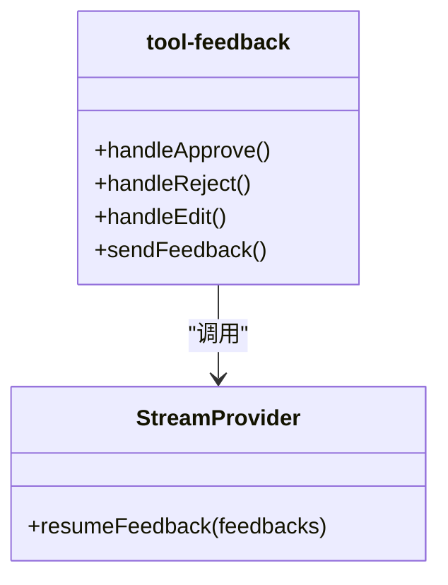

**图表来源**
- [tool-feedback.tsx](file://spring-ai-alibaba-studio/agent-chat-ui/src/components/thread/messages/tool-feedback.tsx)
- [Stream.tsx](file://spring-ai-alibaba-studio/agent-chat-ui/src/providers/Stream.tsx#L1-L543)

**本节来源**
- [tool-feedback.tsx](file://spring-ai-alibaba-studio/agent-chat-ui/src/components/thread/messages/tool-feedback.tsx)

## 依赖分析

工作室模块依赖于Spring AI Alibaba框架的核心组件，通过Maven进行依赖管理。

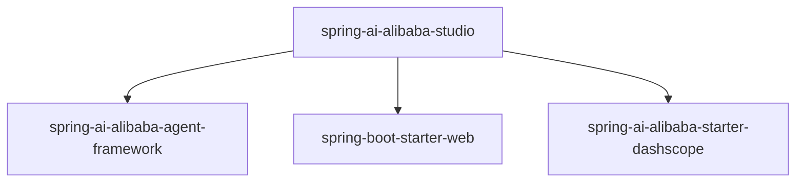

**图表来源**
- [pom.xml](file://spring-ai-alibaba-studio/pom.xml#L1-L162)

**本节来源**
- [pom.xml](file://spring-ai-alibaba-studio/pom.xml#L1-L162)

## 性能考虑

工作室的性能主要受以下因素影响：
- 流式通信的SSE实现效率
- 会话状态的内存存储
- 前后端通信的网络延迟

建议在生产环境中将会话存储从内存存储迁移到数据库或分布式缓存，以支持高并发和持久化。

## 故障排除指南

### 集成问题
- **问题**：前端无法连接到后端
- **解决方案**：检查`.env.development`文件中的`NEXT_PUBLIC_API_URL`配置，确保与后端服务地址匹配

- **问题**：代理列表为空
- **解决方案**：检查`AgentController`日志，确认代理注册配置正确

### 运行时问题
- **问题**：流式响应中断
- **解决方案**：检查网络连接和后端服务状态，确保SSE连接未被防火墙阻止

- **问题**：会话无法保存
- **解决方案**：确认`ThreadServiceImpl`的内存存储正常工作，或考虑实现持久化存储

**本节来源**
- [ExecutionController.java](file://spring-ai-alibaba-studio/src/main/java/com/alibaba/cloud/ai/agent/studio/controller/ExecutionController.java#L1-L357)
- [ThreadServiceImpl.java](file://spring-ai-alibaba-studio/src/main/java/com/alibaba/cloud/ai/agent/studio/service/ThreadServiceImpl.java#L1-L181)

## 结论

工作室提供了一个完整的代理开发与交互平台，支持前后端一体化的开发体验。通过嵌入模式或独立部署，开发者可以轻松地与Spring AI Alibaba框架开发的智能代理进行交互。平台支持丰富的功能，包括会话管理、流式通信、工具调用监控和人机交互。建议在生产环境中将会话存储迁移到持久化存储，并根据需要自定义UI主题和扩展功能。